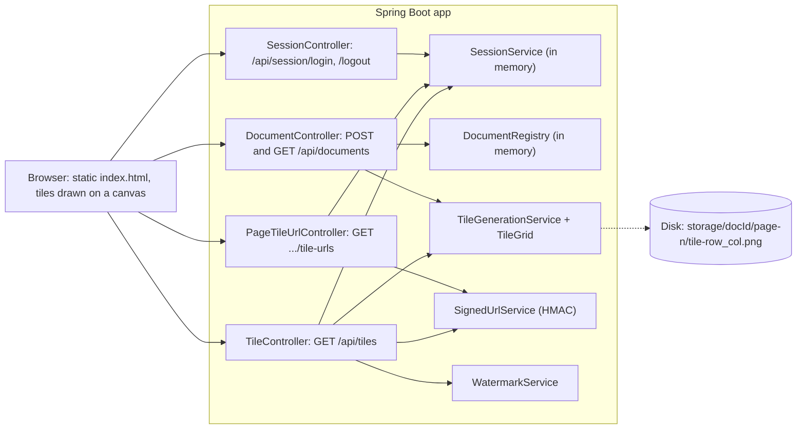
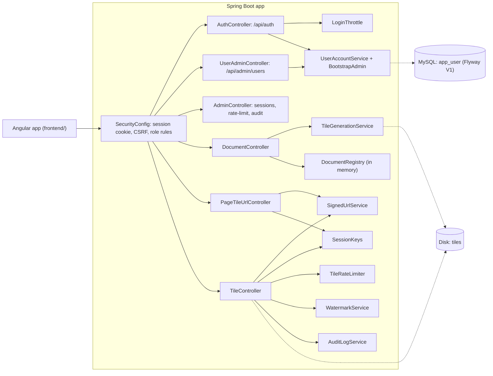
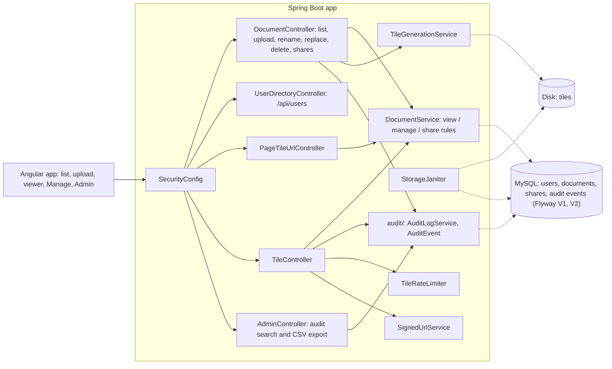
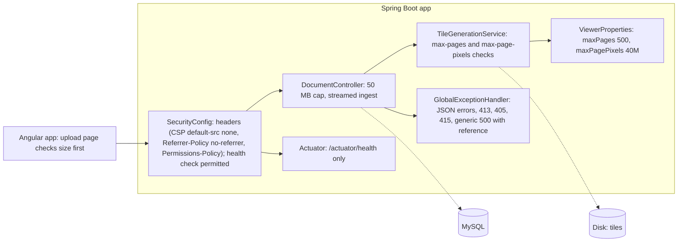
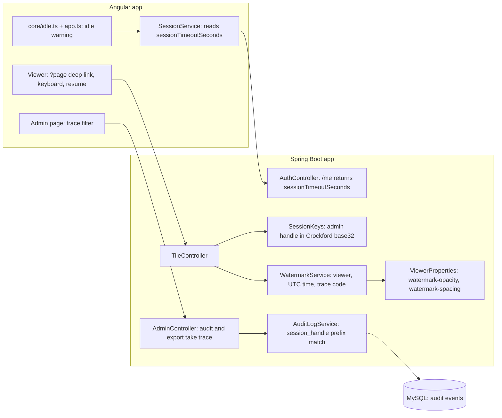
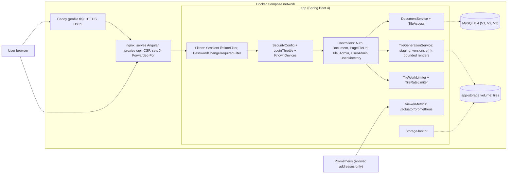

# Appendix B: Blueprint history

The architecture blueprint at each milestone, v0 to v6, with what changed. Assembled from `book/blueprints/`; the chapter for each tag (25 to 31) repeats its blueprint.

## Blueprint v0: the tiled viewer (`book-m0-mvp`)

Stack at this tag: Spring Boot 3.3.4, Java 21, PDFBox; no database, no accounts.

*Figure: Blueprint v0. Text description: the browser signs in by name only, uploads a PDF that is tiled to disk, asks for signed tile URLs, and redeems each one at the tile endpoint, which checks signature and session and stamps a watermark.*

## What's here
- Signing in takes only a username and returns a session id, sent back in an `X-Session-Id` header. This is a stand-in for real authentication.
- Tile URLs are HMAC-signed and bound to that session id; `TileController` also checks the session is still live and sets `Cache-Control: no-store`.
- Documents and sessions live in memory (`DocumentRegistry`, `SessionService`); only tiles are on disk.

## Blueprint v1: accounts, roles and sessions (`book-m1-accounts`)

Stack: still Spring Boot 3.3.4 / Java 21; adds Spring Security, JPA, Flyway, MySQL 8.4 and an Angular 22 frontend.

*Figure: Blueprint v1. Text description: every request now passes through Spring Security; accounts are in MySQL; tile tokens are bound to a keyed hash of the session; sign-ins and tile requests are throttled.*

## What changed since v0
- `SessionController` and `SessionService` removed; sign-in is `POST /api/auth/login` with a password, using an httpOnly session cookie and a CSRF cookie plus header.
- New `account/` package (`AppUser`, `Role`, `UserAccountService`, `BootstrapAdmin`) and the first Flyway migration, `V1__create_app_user.sql`.
- Admin endpoints for users, sessions, per-user rate-limit usage and the audit log.
- `LoginThrottle` and `TileRateLimiter`; `SessionKeys` binds tokens to the session without exposing its id.
- The static page (canvas) is replaced by the Angular frontend, which paints tiles as absolutely positioned divs with CSS background images; `docker-compose.yml` starts MySQL.
- Documents are still held in memory (`DocumentRegistry`).

## Blueprint v2: documents, ownership and audit (`book-m2-documents`)

*Figure: Blueprint v2. Text description: documents, shares and the audit trail move into MySQL; one service decides who may view or manage a document and is consulted on the list, the tile-URL request and every tile request.*

## What changed since v1
- New `document/` package (`Document`, `Visibility`, `DocumentService`, `DocumentRepository`, `Viewer`) replaces the in-memory `DocumentRegistry`; migration `V2__documents_shares_audit.sql`.
- Documents have an owner and a visibility plus per-user shares; new endpoints for rename, replace file, delete and shares.
- The audit log becomes persistent (`audit/` package) with search and CSV export.
- `UserDirectoryController` (share picker), `StorageJanitor` and `FileOperations` added; a Manage page in the frontend.

## Blueprint v3: upload and API hardening (`book-m3-hardening`)

No new components; existing ones gain guards. The diagram shows the request path with the new layers.

*Figure: Blueprint v3. Text description: the same request path as v2 with upload limits, streamed ingest, a uniform error contract, security headers and a health check added.*

## What changed since v2
- Upload limit lowered from 100 MB to 50 MB (`spring.servlet.multipart`, request limit 51 MB); an oversized file gets a JSON `413` from `GlobalExceptionHandler`, whose `MAX_UPLOAD_MB` is kept in step with the setting.
- New limits `max-pages: 500` and `max-page-pixels: 40000000` in `ViewerProperties`, checked before rendering.
- `GlobalExceptionHandler` gains handlers for missing input, type mismatch, unknown routes, wrong method, unsupported media type and a catch-all that logs the exception under a short reference and returns only the reference to the client.
- `SecurityConfig` sets a strict Content-Security-Policy, `Referrer-Policy: no-referrer` and a Permissions-Policy, and lets `GET /actuator/health` through.
- Actuator added to `pom.xml`, exposing only `health` with details hidden and probes enabled.
- Frontend: upload page and `documents.service.ts` updated; `frontend/src/index.html` tweaked.

## Blueprint v4: the reading experience (`book-m4-reading`)

*Figure: Blueprint v4. Text description: the server tells the browser how long the session may sit idle so it can warn the reader; each watermark carries a short trace code derived from the session, and the audit log can be searched by that code.*

## What changed since v3
- `AuthController`'s current-user answer gains `sessionTimeoutSeconds`, which the frontend uses for the idle warning (`core/idle.ts`, `session.service.ts`, `app.ts`).
- The viewer supports page deep links, keyboard navigation and resuming where you stopped.
- `SessionKeys.adminHandle` is now a Crockford base32 string; the first six characters become the trace code stamped on each tile, and `AuditLogService.Query` gains `traceCode`, matched as a prefix of `session_handle`. `AdminController` audit search and CSV export accept a `trace` parameter.
- `WatermarkService` takes the trace code and reads `watermark-opacity` (default 0.2) and `watermark-spacing` (default 1.5) from `ViewerProperties`.

## Blueprint v5: the platform (`book-m5-platform`)

Stack: Spring Boot 4.1.1, Java 25 (upgraded at this milestone), Docker Compose stack, GitHub Actions.

*Figure: Blueprint v5. Text description: the browser reaches nginx (optionally through Caddy for HTTPS); only nginx and Caddy are published; the API and MySQL are internal; tiles are stored in versioned folders on a volume.*

## What changed since v4
- Spring Boot 3.3.4 to 4.1.1 and Java 21 to 25; `Dockerfile`, `frontend/Dockerfile`, `frontend/nginx.conf`, `deploy/Caddyfile`, the full compose stack, `.github/workflows/ci.yml`, Dependabot, the Maven wrapper.
- Versioned tiles (`{doc}/v{n}`) with atomic replace and `410 Gone` for old tokens (`TileGoneException`; migration `V3__tile_versions_and_account_security.sql`).
- Bounded rendering and a tile work limit (`TileWorkLimiter`, `ServiceBusyException`); metrics (`ViewerMetrics`).
- Account security: `KnownDevices` (recognized devices), admin unlock, forced password change (`PasswordChangeRequiredFilter`), `SessionLifetimeFilter`, `SessionMetadata`.
- Playwright end-to-end tests (`frontend/playwright.config.ts`); CI runs tests and vulnerability scans.

## Blueprint v6: the finished app (`book-m6-final`)

The architecture is identical to Blueprint v5 (see `v5-platform.md`). Between `book-m5-platform` and `book-m6-final` the non-test changes are `.github/dependabot.yml` (propose only stable/LTS lines) and `frontend/package.json` with its lock file (Vitest 5, jsdom 30 bumps). The history also contains a fix to a flaky assertion in `TileGenerationServiceTest` (commit `ec6c1c5`, PR #9), which is test code only.

## What changed since v5
- No structural change: a test fix, dependency updates and the Dependabot policy only.

