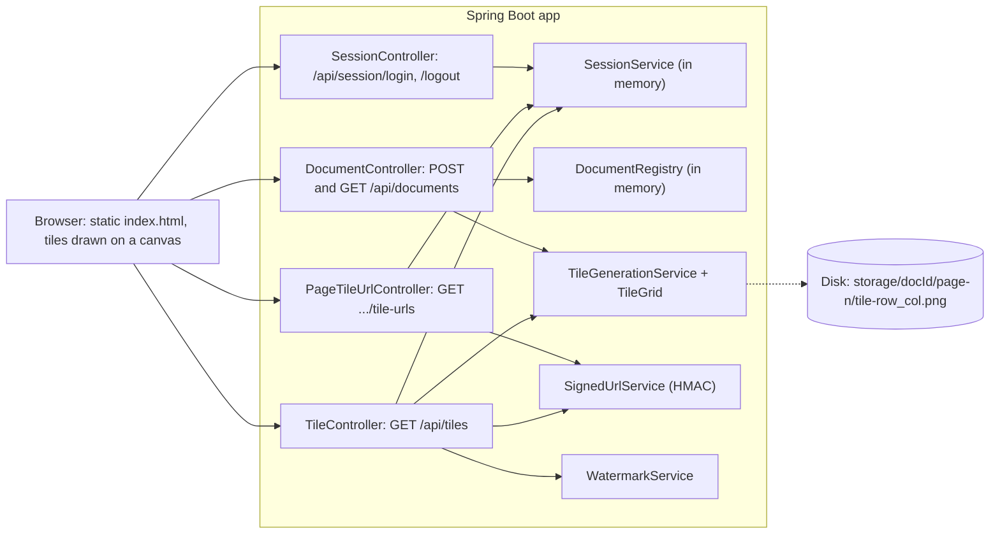
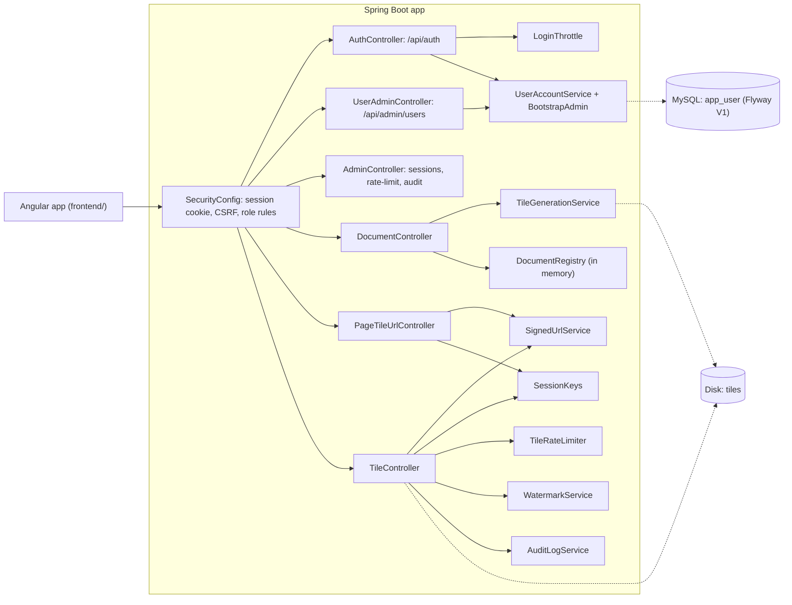
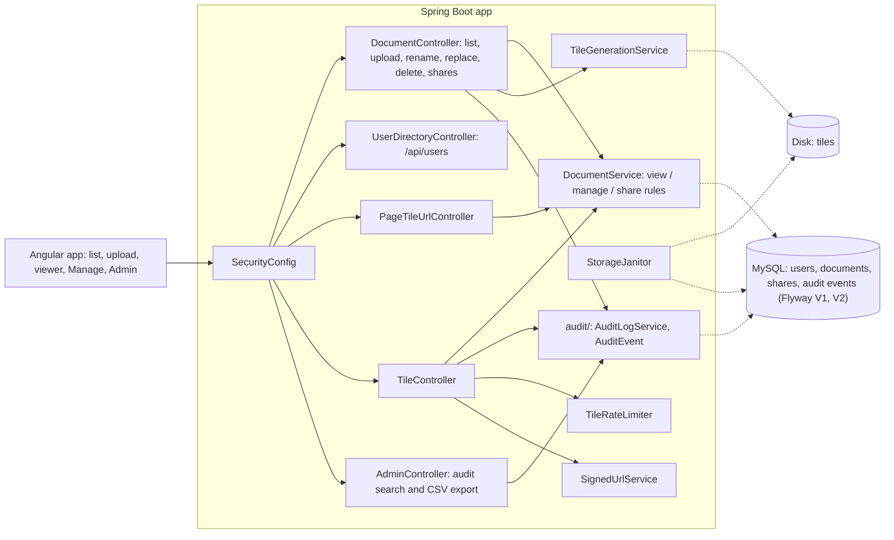
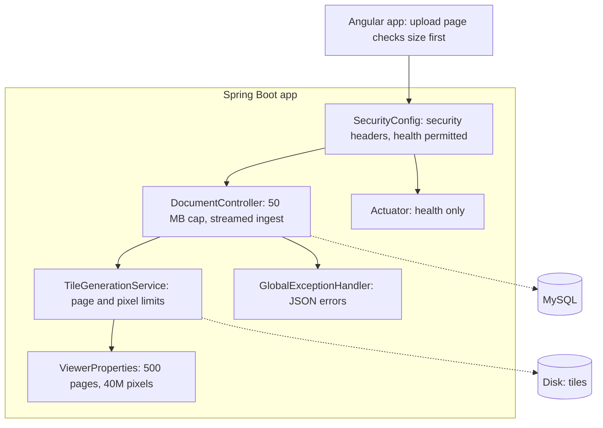
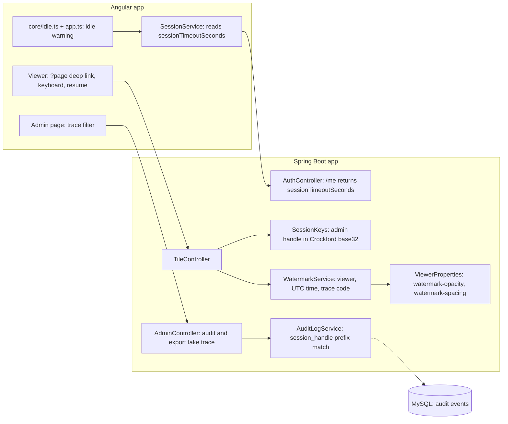
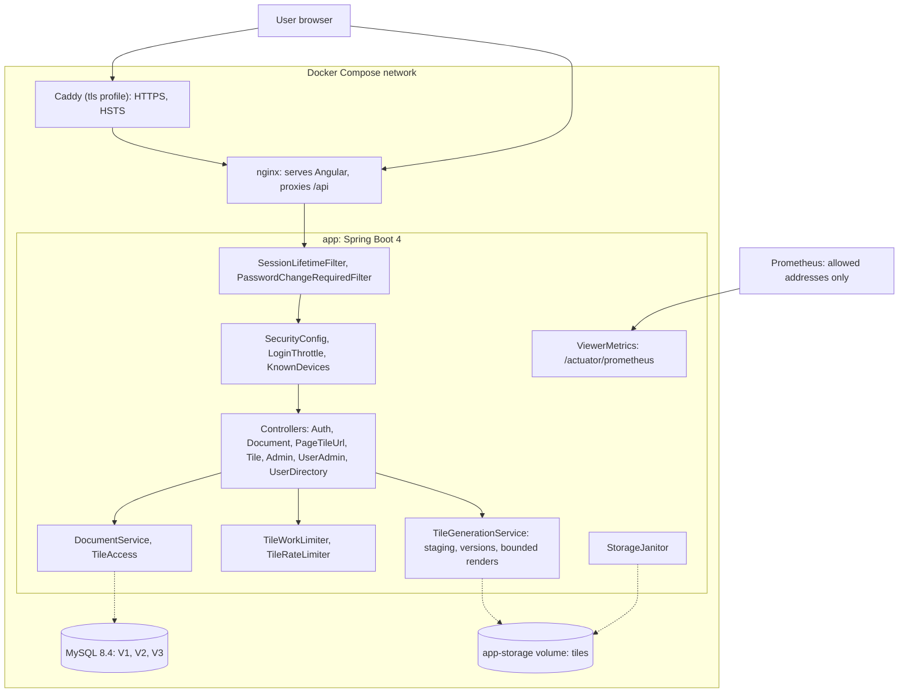

# Appendix B: Blueprint history

The architecture blueprint at each milestone, v0 to v6, with what changed. Each blueprint is repeated in the chapter for its tag (Chapters 25 to 31). Figures B.1 to B.6 show the blueprints for v0 to v5; v6 has no drawing of its own, because its architecture equals v5.

## Blueprint v0: the tiled viewer (`book-m0-mvp`)

Stack at this tag: Spring Boot 3.3.4, Java 21, PDFBox; no database, no accounts.

*Figure B.1 — Blueprint v0 (`book-m0-mvp`)*

*Text description:* A left-to-right flowchart. The browser, a static page that draws tiles on a canvas, calls four controllers inside the Spring Boot application. SessionController uses the in-memory SessionService. DocumentController uses TileGenerationService and the in-memory DocumentRegistry. PageTileUrlController uses SignedUrlService and SessionService. TileController uses SignedUrlService, SessionService, TileGenerationService and WatermarkService. A dotted line shows TileGenerationService writing tiles to disk. Notice that there is no database: sessions and documents live in memory and only the tiles are on disk.

## What's here
- Signing in takes only a username and returns a session id, sent back in an `X-Session-Id` header. This is a stand-in for real authentication.
- Tile URLs are HMAC-signed and bound to that session id; `TileController` also checks the session is still live and sets `Cache-Control: no-store`.
- Documents and sessions live in memory (`DocumentRegistry`, `SessionService`); only tiles are on disk.

## Blueprint v1: accounts, roles and sessions (`book-m1-accounts`)

Stack: still Spring Boot 3.3.4 / Java 21; adds Spring Security, JPA, Flyway, MySQL 8.4 and an Angular 22 frontend.

*Figure B.2 — Blueprint v1 (`book-m1-accounts`)*

*Text description:* A left-to-right flowchart. The Angular app sends every request to SecurityConfig, which fans out to AuthController, UserAdminController, AdminController, DocumentController, PageTileUrlController and TileController. AuthController uses LoginThrottle and UserAccountService with BootstrapAdmin; UserAccountService reaches MySQL, which holds only the app_user table from migration V1 (dotted line). The tile-URL and tile controllers use SignedUrlService and SessionKeys; TileController also uses TileRateLimiter, WatermarkService and AuditLogService. DocumentController uses TileGenerationService and the in-memory DocumentRegistry, and tiles are on disk. Notice that everything passes through SecurityConfig and that documents are still not in the database.

## What changed since v0
- `SessionController` and `SessionService` removed; sign-in is `POST /api/auth/login` with a password, using an httpOnly session cookie and a CSRF cookie plus header.
- New `account/` package (`AppUser`, `Role`, `UserAccountService`, `BootstrapAdmin`) and the first Flyway migration, `V1__create_app_user.sql`.
- Admin endpoints for users, sessions, per-user rate-limit usage and the audit log.
- `LoginThrottle` and `TileRateLimiter`; `SessionKeys` binds tokens to the session without exposing its id.
- The static page (canvas) is replaced by the Angular frontend, which paints tiles as absolutely positioned divs with CSS background images; `docker-compose.yml` starts MySQL.
- Documents are still held in memory (`DocumentRegistry`).

## Blueprint v2: documents, ownership and audit (`book-m2-documents`)

*Figure B.3 — Blueprint v2 (`book-m2-documents`)*

*Text description:* A left-to-right flowchart. The Angular app goes through SecurityConfig to DocumentController (list, upload, rename, replace, delete, shares), UserDirectoryController, PageTileUrlController, TileController and AdminController. DocumentController, PageTileUrlController and TileController all consult DocumentService, which reads and writes MySQL (dotted line), where users, documents, shares and audit events now live from migrations V1 and V2. DocumentController uses TileGenerationService, which writes tiles to disk; StorageJanitor cleans disk and reads MySQL. DocumentController, TileController and AdminController write to AuditLogService, which stores events in MySQL, and TileController also uses TileRateLimiter and SignedUrlService. Notice that one service, DocumentService, decides access for three different controllers.

## What changed since v1
- New `document/` package (`Document`, `Visibility`, `DocumentService`, `DocumentRepository`, `Viewer`) replaces the in-memory `DocumentRegistry`; migration `V2__documents_shares_audit.sql`.
- Documents have an owner and a visibility plus per-user shares; new endpoints for rename, replace file, delete and shares.
- The audit log becomes persistent (`audit/` package) with search and CSV export.
- `UserDirectoryController` (share picker), `StorageJanitor` and `FileOperations` added; a Manage page in the frontend.

## Blueprint v3: upload and API hardening (`book-m3-hardening`)

No new components; existing ones gain guards. The diagram shows the request path with the new layers.

*Figure B.4 — Blueprint v3 (`book-m3-hardening`)*

*Text description:* A left-to-right flowchart with no new components. The Angular app, whose upload page checks the file size first, sends requests to SecurityConfig. SecurityConfig now adds security headers and permits the health check. Requests continue to DocumentController (50 MB cap, streamed ingest) and on to TileGenerationService, which applies the page-count and page-pixel limits taken from ViewerProperties (500 pages, 40 million pixels). DocumentController reports failures to GlobalExceptionHandler, which produces the uniform JSON errors; SecurityConfig also exposes only the Actuator health endpoint. Notice that milestone 3 adds guards to the existing request path.

## What changed since v2
- Upload limit lowered from 100 MB to 50 MB (`spring.servlet.multipart`, request limit 51 MB); an oversized file gets a JSON `413` from `GlobalExceptionHandler`, whose `MAX_UPLOAD_MB` is kept in step with the setting.
- New limits `max-pages: 500` and `max-page-pixels: 40000000` in `ViewerProperties`, checked before rendering.
- `GlobalExceptionHandler` gains handlers for missing input, type mismatch, unknown routes, wrong method, unsupported media type and a catch-all that logs the exception under a short reference and returns only the reference to the client.
- `SecurityConfig` sets a strict Content-Security-Policy, `Referrer-Policy: no-referrer` and a Permissions-Policy, and lets `GET /actuator/health` through.
- Actuator added to `pom.xml`, exposing only `health` with details hidden and probes enabled.
- Frontend: upload page and `documents.service.ts` updated; `frontend/src/index.html` tweaked.

## Blueprint v4: the reading experience (`book-m4-reading`)

*Figure B.5 — Blueprint v4 (`book-m4-reading`)*

*Text description:* A left-to-right flowchart in two groups. In the Angular app, the Viewer (deep links, keyboard, resume) calls TileController. The idle-timer code and the session service read the session timeout from AuthController's current-user answer. The Admin page's trace filter calls AdminController, which searches AuditLogService by session-handle prefix in MySQL. In the Spring Boot app, TileController uses SessionKeys for the admin handle and WatermarkService, which reads opacity and spacing from ViewerProperties. Notice how the watermark's trace code links the tile to the audit search.

## What changed since v3
- `AuthController`'s current-user answer gains `sessionTimeoutSeconds`, which the frontend uses for the idle warning (`core/idle.ts`, `session.service.ts`, `app.ts`).
- The viewer supports page deep links, keyboard navigation and resuming where you stopped.
- `SessionKeys.adminHandle` is now a Crockford base32 string; the first six characters become the trace code stamped on each tile, and `AuditLogService.Query` gains `traceCode`, matched as a prefix of `session_handle`. `AdminController` audit search and CSV export accept a `trace` parameter.
- `WatermarkService` takes the trace code and reads `watermark-opacity` (default 0.2) and `watermark-spacing` (default 1.5) from `ViewerProperties`.

## Blueprint v5: the platform (`book-m5-platform`)

Stack: Spring Boot 4.1.1, Java 25 (upgraded at this milestone), Docker Compose stack, GitHub Actions.

*Figure B.6 — Blueprint v5 (`book-m5-platform`)*

*Text description:* A left-to-right flowchart of the Docker Compose network. The user's browser reaches nginx directly or through the optional Caddy container (HTTPS and HSTS). Inside the Spring Boot app, a request passes the SessionLifetimeFilter and PasswordChangeRequiredFilter, then SecurityConfig with LoginThrottle and KnownDevices, then the controllers. Controllers use DocumentService (backed by MySQL with migrations V1 to V3), TileWorkLimiter with TileRateLimiter, and TileGenerationService, which writes versioned tile folders to the app-storage volume; StorageJanitor cleans that volume, and Prometheus, from allowed addresses only, reads ViewerMetrics. This is a deployment-oriented view of what was added or changed since Blueprint v4: SignedUrlService, SessionKeys, WatermarkService and AuditLogService still exist at this tag but are left out to keep the drawing readable.

## What changed since v4
- Note: this drawing is a deployment view. It shows what was added or changed at this milestone and the containers around it; `SignedUrlService`, `SessionKeys`, `WatermarkService` and `AuditLogService` still exist but are omitted.
- Spring Boot 3.3.4 to 4.1.1 and Java 21 to 25; `Dockerfile`, `frontend/Dockerfile`, `frontend/nginx.conf`, `deploy/Caddyfile`, the full compose stack, `.github/workflows/ci.yml`, Dependabot, the Maven wrapper.
- Versioned tiles (`{doc}/v{n}`) with atomic replace and `410 Gone` for old tokens (`TileGoneException`; migration `V3__tile_versions_and_account_security.sql`).
- Bounded rendering and a tile work limit (`TileWorkLimiter`, `ServiceBusyException`); metrics (`ViewerMetrics`).
- Account security: `KnownDevices` (recognized devices), admin unlock, forced password change (`PasswordChangeRequiredFilter`), `SessionLifetimeFilter`, `SessionMetadata`.
- Playwright end-to-end tests (`frontend/playwright.config.ts`); CI runs tests and vulnerability scans.

## Blueprint v6: the finished app (`book-m6-final`)

The architecture is identical to Blueprint v5 (Figure B.6). Between `book-m5-platform` and `book-m6-final` the non-test changes are `.github/dependabot.yml` (propose only stable/LTS lines) and `frontend/package.json` with its lock file (Vitest 5, jsdom 30 bumps). The history also contains a fix to a flaky assertion in `TileGenerationServiceTest` (commit `ec6c1c5`, PR #9), which is test code only.

## What changed since v5
- No structural change: a test fix, dependency updates and the Dependabot policy only.

