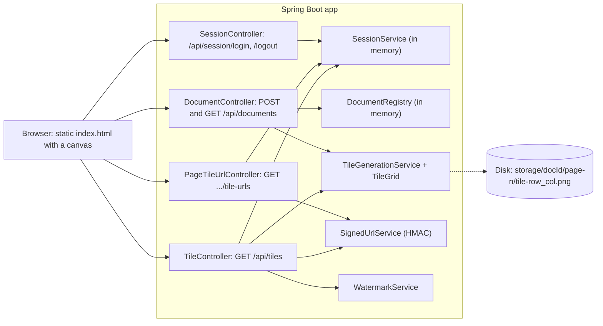

# Blueprint v0: the tiled viewer (`book-m0-mvp`)

Stack at this tag: Spring Boot 3.3.4, Java 21, PDFBox; no database, no accounts.

*Figure: Blueprint v0. Text description: the browser signs in by name only, uploads a PDF that is tiled to disk, asks for signed tile URLs, and redeems each one at the tile endpoint, which checks signature and session and stamps a watermark.*

## What's here
- Signing in takes only a username and returns a session id, sent back in an `X-Session-Id` header. This is a stand-in for real authentication.
- Tile URLs are HMAC-signed and bound to that session id; `TileController` also checks the session is still live and sets `Cache-Control: no-store`.
- Documents and sessions live in memory (`DocumentRegistry`, `SessionService`); only tiles are on disk.
