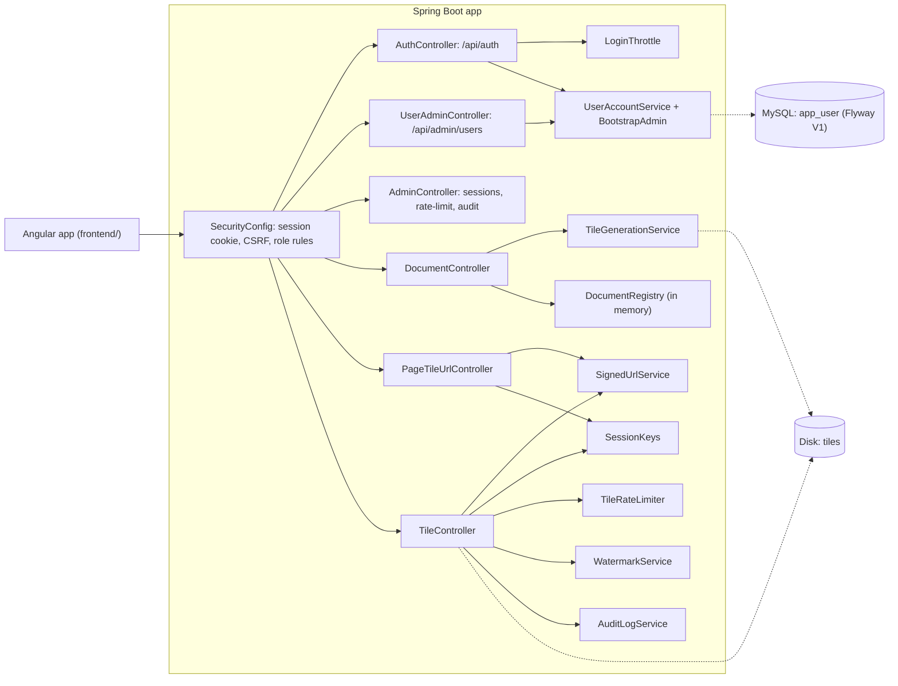

# Blueprint v1: accounts, roles and sessions (`book-m1-accounts`)

Stack: still Spring Boot 3.3.4 / Java 21; adds Spring Security, JPA, Flyway, MySQL 8.4 and an Angular 22 frontend.

*Figure: Blueprint v1. Text description: every request now passes through Spring Security; accounts are in MySQL; tile tokens are bound to a keyed hash of the session; sign-ins and tile requests are throttled.*

## What changed since v0
- `SessionController` and `SessionService` removed; sign-in is `POST /api/auth/login` with a password, using an httpOnly session cookie and a CSRF cookie plus header.
- New `account/` package (`AppUser`, `Role`, `UserAccountService`, `BootstrapAdmin`) and the first Flyway migration, `V1__create_app_user.sql`.
- Admin endpoints for users, sessions, per-user rate-limit usage and the audit log.
- `LoginThrottle` and `TileRateLimiter`; `SessionKeys` binds tokens to the session without exposing its id.
- The static page (canvas) is replaced by the Angular frontend, which paints tiles as absolutely positioned divs with CSS background images; `docker-compose.yml` starts MySQL.
- Documents are still held in memory (`DocumentRegistry`).
