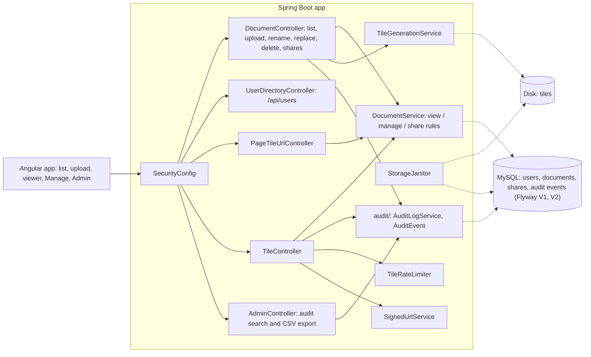

# Blueprint v2: documents, ownership and audit (`book-m2-documents`)

*Figure: Blueprint v2. Text description: documents, shares and the audit trail move into MySQL; one service decides who may view or manage a document and is consulted on the list, the tile-URL request and every tile request.*

## What changed since v1
- New `document/` package (`Document`, `Visibility`, `DocumentService`, `DocumentRepository`, `Viewer`) replaces the in-memory `DocumentRegistry`; migration `V2__documents_shares_audit.sql`.
- Documents have an owner and a visibility plus per-user shares; new endpoints for rename, replace file, delete, and shares.
- The audit log becomes persistent (`audit/` package) with search and CSV export.
- `UserDirectoryController` (share picker), `StorageJanitor` and `FileOperations` added; a Manage page in the frontend.
