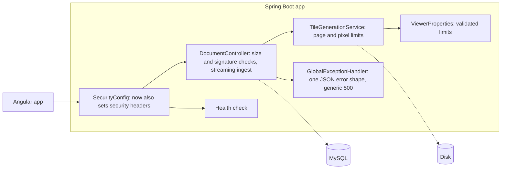

# Blueprint v3: upload and API hardening (`book-m3-hardening`)

No new components; existing ones gain guards. The diagram shows the request path with the new layers.

*Figure: Blueprint v3. Text description: the same request path as v2 with upload limits, streamed ingest, a uniform error contract, security headers and a health check added.*

## What changed since v2
- Files changed: `DocumentController`, `DocumentService`, `TileGenerationService`, `GlobalExceptionHandler`, `SecurityConfig`, `ViewerProperties`, `application.yml`, `pom.xml`, plus the upload page in the frontend.
- Upload limits and streaming ingest; JSON errors without internals; security headers; a health check.
