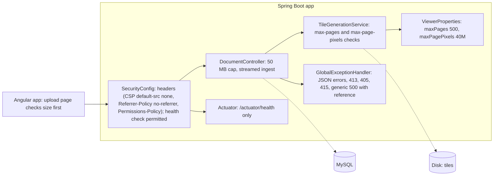

# Blueprint v3: upload and API hardening (`book-m3-hardening`)

No new components; existing ones gain guards. The diagram shows the request path with the new layers.

*Figure: Blueprint v3. Text description: the same request path as v2 with upload limits, streamed ingest, a uniform error contract, security headers and a health check added.*

## What changed since v2
- Upload limit lowered from 100 MB to 50 MB (`spring.servlet.multipart`, request limit 51 MB); an oversized file gets a JSON `413` from `GlobalExceptionHandler`, whose `MAX_UPLOAD_MB` is kept in step with the setting.
- New limits `max-pages: 500` and `max-page-pixels: 40000000` in `ViewerProperties`, checked before rendering.
- `GlobalExceptionHandler` gains handlers for missing input, type mismatch, unknown routes, wrong method, unsupported media type and a catch-all that logs the exception under a short reference and returns only the reference to the client.
- `SecurityConfig` sets a strict Content-Security-Policy, `Referrer-Policy: no-referrer` and a Permissions-Policy, and lets `GET /actuator/health` through.
- Actuator added to `pom.xml`, exposing only `health` with details hidden and probes enabled.
- Frontend: upload page and `documents.service.ts` updated; `frontend/src/index.html` tweaked.
