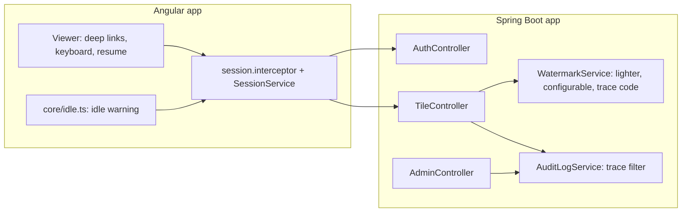

# Blueprint v4: the reading experience (`book-m4-reading`)

*Figure: Blueprint v4. Text description: the frontend adds idle warnings and page navigation; on the server the watermark gains a readable trace code that links a capture to a sign-in in the audit log.*

## What changed since v3
- Frontend: page deep links, keyboard navigation, resume reading (`viewer`), an idle-timeout warning (`core/idle.ts`), changes in `SessionService` and the interceptor.
- Backend: `WatermarkService` reworked (opacity and spacing configurable in `ViewerProperties`); `SessionKeys`, `AuthController`, `AuditLogService` and `AdminController` touched to support the trace code. The Actuator dependency is present in the pom at this tag.
