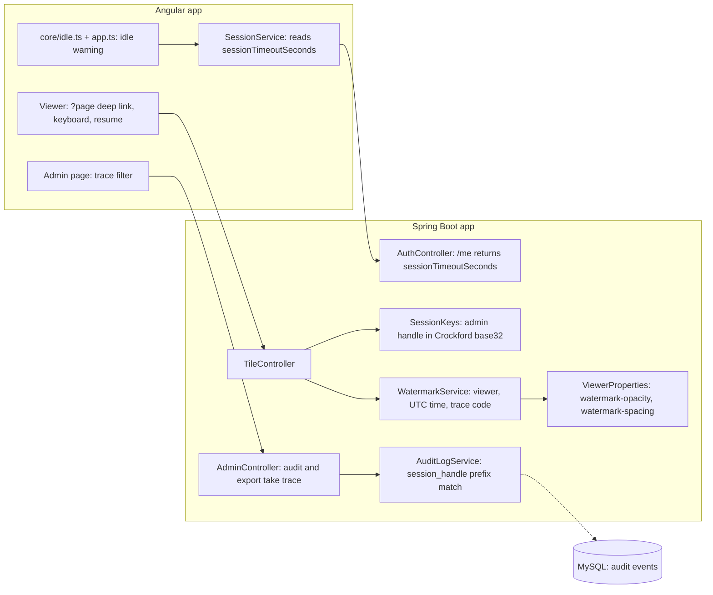

# Blueprint v4: the reading experience (`book-m4-reading`)

*Figure: Blueprint v4. Text description: the server tells the browser how long the session may sit idle so it can warn the reader; each watermark carries a short trace code derived from the session, and the audit log can be searched by that code.*

## What changed since v3
- `AuthController`'s current-user answer gains `sessionTimeoutSeconds`, which the frontend uses for the idle warning (`core/idle.ts`, `session.service.ts`, `app.ts`).
- The viewer supports page deep links, keyboard navigation and resuming where you stopped.
- `SessionKeys.adminHandle` is now a Crockford base32 string; the first six characters become the trace code stamped on each tile, and `AuditLogService.Query` gains `traceCode`, matched as a prefix of `session_handle`. `AdminController` audit search and CSV export accept a `trace` parameter.
- `WatermarkService` takes the trace code and reads `watermark-opacity` (default 0.2) and `watermark-spacing` (default 1.5) from `ViewerProperties`.
