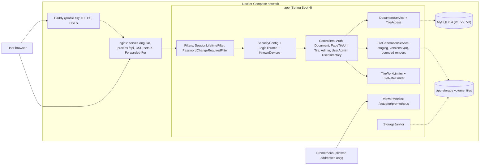

# Blueprint v5: the platform (`book-m5-platform`)

Stack: Spring Boot 4.1.1, Java 25 (upgraded at this milestone), Docker Compose stack, GitHub Actions.

*Figure: Blueprint v5. Text description: the browser reaches nginx (optionally through Caddy for HTTPS); only nginx and Caddy are published; the API and MySQL are internal; tiles are stored in versioned folders on a volume.*

## What changed since v4
- Spring Boot 3.3.4 to 4.1.1 and Java 21 to 25; `Dockerfile`, `frontend/Dockerfile`, `frontend/nginx.conf`, `deploy/Caddyfile`, the full compose stack, `.github/workflows/ci.yml`, Dependabot, the Maven wrapper.
- Versioned tiles (`{doc}/v{n}`) with atomic replace and `410 Gone` for old tokens (`TileGoneException`; migration `V3__tile_versions_and_account_security.sql`).
- Bounded rendering and a tile work limit (`TileWorkLimiter`, `ServiceBusyException`); metrics (`ViewerMetrics`).
- Account security: `KnownDevices` (recognized devices), admin unlock, forced password change (`PasswordChangeRequiredFilter`), `SessionLifetimeFilter`, `SessionMetadata`.
- Playwright end-to-end tests (`frontend/playwright.config.ts`); CI runs tests and vulnerability scans.
