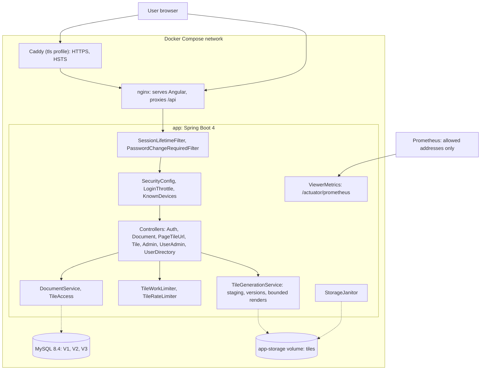

# Blueprint v6: the finished app (`book-m6-final`)

*Figure: Blueprint v6. Text description: the architecture is unchanged from Blueprint v5: the browser reaches nginx (optionally through Caddy for HTTPS); only these are published; the API and MySQL are internal; tiles live in versioned folders on a volume.*

The architecture is identical to Blueprint v5 (see `v5-platform.md`), including its note that the drawing is a deployment view. Between `book-m5-platform` and `book-m6-final` the non-test changes are `.github/dependabot.yml` (propose only stable/LTS lines) and `frontend/package.json` with its lock file (Vitest 5, jsdom 30 bumps). The history also contains a fix to a flaky assertion in `TileGenerationServiceTest` (commit `ec6c1c5`, PR #9), which is test code only.

## What changed since v5
- No structural change: a test fix, dependency updates, and the Dependabot policy only.
