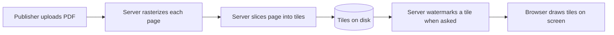
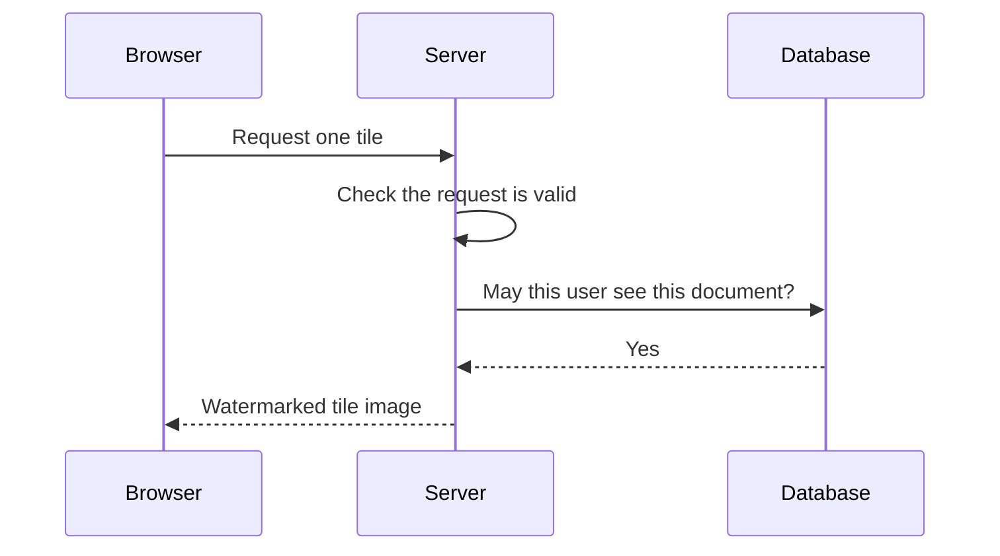

<!-- chapter: 1 | part: I | owner: writer-foundations | tag: book-m6-final | status: expanded -->
# Chapter 1: The big picture

Before you write a line of code, you need a picture of what you're going to build and why it is built the way it is. This chapter describes the Secure Document Viewer in plain words, explains the one idea that shapes the whole design, and gives you a map of the tools the rest of the book teaches.

A word on how to use this book, since this is where you start. Follow along in a terminal: most chapters give commands to run against your own copy of the project, and Chapter 2 makes you comfortable with the command line. Do the exercises at the end of each chapter. They are graded ★ (a few minutes, checking your understanding), ★★ (about an hour, applying the idea) and ★★★ (open-ended), and worked solutions are in Appendix C at the back of the book. When a chapter quotes code, it names the milestone tag, so you can read the same file with `git show <tag>:<path>` (Chapter 7 teaches this) and be sure you see exactly what the book saw. The front matter's "Setting up your machine" gets your tools ready. Finally, do not worry about remembering every new word in this chapter: the ideas return in later chapters, each time with more detail, and the book's glossary lists every term.

## Learning objectives

By the end of this chapter, you will be able to:

- Explain the problem the Secure Document Viewer solves, in one paragraph.
- Explain why hiding a download button in the browser does not protect a document.
- Describe how rasterizing a page and slicing it into tiles keeps the PDF on the server.
- Distinguish a client from a server and say which one you must trust less.
- Name the three roles and say what authentication and authorization mean.
- Follow one page view from sign-in to drawn tiles.
- Name the main tools in this book and say what each is for.
- State what the app cannot do, and match five threats to their defenses.

## Prerequisites

None. This chapter assumes only that you have used a web browser.

## Beginner tier: The problem and the idea

### 1.1 The problem: showing a document without giving it away

Imagine a company that sells a confidential report, a training manual, or a magazine. Customers must be able to read it on screen. The company would prefer that they can't email the file to a thousand strangers.

That is a tension, and it doesn't go away. To show a page on your screen, a computer has to send you something that draws that page. Whatever it sends, you can keep. So no design can make content uncopyable: a person can always photograph the screen.

The realistic goal is smaller and more useful:

1. Make casual copying inconvenient, so that the everyday paths (download the file, save the image) don't exist.
2. Make heavy copying slow, so that harvesting a whole document takes long enough to notice.
3. Make every copy traceable, so that a leaked image says who it was shown to.

The Secure Document Viewer is a small web application built to reach those three goals honestly. A signed-in reader opens a document in the browser and reads it page by page. The reader never receives the **PDF** (Portable Document Format) file. A PDF is the common format for fixed-layout documents such as reports and manuals. <!-- source: README.md, "Why this design" and "Limitations" at book-m6-final -->

### 1.2 Who uses the app: three roles

Before looking at how the app protects a document, meet the people it serves. The app calls them **roles**, and there are three. Example usernames throughout this book follow the project's own tests: `reader.one`, `pub.one` and `outsider.one`.

- A **reader** can open the documents they have access to, and nothing else. `reader.one` is a reader.
- A **publisher** can do everything a reader can and can also upload documents, which makes them the owner of what they upload. `pub.one` is a publisher.
- An **administrator** can additionally manage accounts and sessions and read the audit trail. The role is called `ADMIN` in the code.

The code says the same thing in a comment on the `Role` type. Roles are cumulative in practice. Every signed-in user can read documents they have access to, publishers can also upload, and admins can additionally manage accounts, sessions and the audit log. There is no public sign-up. An administrator creates every account, and the very first administrator is created automatically the first time the app starts on an empty database. <!-- source: Role.java, application.yml (bootstrap-admin) and README.md at book-m6-final -->

Two more ideas belong here, because every later chapter uses them. **Authentication** means proving who you are, which is what signing in does. **Authorization** means deciding what you are allowed to do, which the app checks separately for every action. A person can be authenticated and still not authorized: `outsider.one` can sign in, and still cannot open a document that was never shared with them. Each document has an owner and a **visibility**: either `PRIVATE` (only the owner, administrators and the users the owner shared it with) or `EVERYONE` (any signed-in user). For a document you may not see, the app answers "not found", as if it did not exist at all, so an outsider cannot even learn that it exists. Chapters 8 and 16 explain why.

### 1.3 Why hiding a button doesn't protect anything

The obvious way to build a "protected" viewer is to send the PDF to the browser, then use the browser to hide the download button and block the right-click menu. Call this the **naive viewer**.

Here is why it fails. Your browser is a program running on *your* computer, under *your* control. Every instruction the site sends it, including "hide this button", is a request that the browser happens to honor. A person who opens the browser's **developer tools** (DevTools, a panel built into every browser that lets you inspect and change the page you're viewing) can undo the hiding in seconds. Even without that, the PDF already arrived on their machine, so it sits in the browser's **cache** (the folder where a browser keeps copies of files it has downloaded) waiting to be copied.

The project's README puts it bluntly: both tricks "live entirely in the browser, so both are undone in about ten seconds with DevTools." <!-- source: README.md, opening of "Why this design" -->

The lesson is the most important idea in the whole book, and you'll meet it again in every part:

> Anything enforced only in the client can be bypassed. Real protection lives on the server.

The app does still block the right-click menu in its viewer (the part of the app you see in the browser, built with a tool called Angular; Part III teaches it). It does so knowingly, as a bit of friction for casual users, and it treats that as no protection at all. <!-- source: README.md, "The client also blocks right-click — on purpose, with eyes open" -->

### 1.4 The tile idea: rasterize, slice, deliver one piece at a time

If the PDF must never reach the browser, the server has to send something else. The design does this in three steps.

1. **Rasterize.** To **rasterize** a page means turning a page described by shapes and text (which is what a PDF contains) into a grid of colored dots, an image. The server renders each PDF page as an image at 150 DPI (dots per inch).
2. **Slice.** The server cuts each page image into square **tiles** of 512 by 512 pixels (a pixel is one dot of the image). Tiles at the right and bottom edges are cropped shorter.
3. **Deliver.** The server keeps only the tiles. The original PDF stops existing as something the app can serve. The browser asks for tiles one at a time and assembles them on screen.

A US letter page (8.5 by 11 inches) at 150 DPI is 1,275 by 1,650 pixels. Divided into 512-pixel squares, that is 3 columns by 4 rows: 12 tiles. The project's README says the same in its own words: "a letter page is ~12 tiles". <!-- source: README.md; src/main/resources/application.yml at book-m6-final (tile-size: 512, render-dpi: 150) -->

Figure 1.1 shows the flow.

*Figure 1.1 — From PDF to tiles to screen*

*Text description:* Six boxes in a row, read left to right. A publisher uploads a PDF, the server turns each page into an image and cuts it into tiles, the tiles are stored on disk, and only when a tile is asked for does the server stamp a watermark on it before the browser draws it. Notice that the original PDF appears only at the start: nothing after the upload sends it to the browser.

<!-- source: README.md "Why this design"; application.yml (tile-size, render-dpi); TileGenerationService.java, WatermarkService.java and TileController.java at book-m6-final -->

Three more ingredients, explained in Section 1.8, make the tiles safe to serve: signed addresses, a watermark and checks on every request.

### 1.5 Clients and servers, in one picture

Nearly everything on the web is a conversation between two kinds of programs.

- A **client** asks for things. Your browser is a client.
- A **server** listens for requests and answers them. It runs on a computer that stays on, and it holds the data.

Figure 1.2 shows one exchange in this app.

*Figure 1.2 — A browser asks for a tile*

*Text description:* A sequence of five messages between three parties, read top to bottom: Browser, Server and Database. The browser asks for one tile, the server checks the request is valid, the server asks the database whether this user may see the document, the database answers yes, and the server returns a watermarked tile. Notice that the permission check goes to the database on every tile, not once per session.

<!-- source: TileController.java (method getTile) and DocumentService.tileAccessIfViewable at book-m6-final -->

The *Database* in the figure is a separate program that stores the app's accounts, documents and permissions on disk so they survive a restart; [Chapter 9](09-sql-and-mysql.md) teaches it. Two rules follow, and the rest of the book depends on them:

- The client is under the user's control, so the server treats everything it sends as untrusted until checked.
- The server holds the secrets: the signing key, the tiles and the database.

[Chapter 8](08-how-the-web-works.md) teaches how the conversation works in detail (requests, status codes, cookies). For now, you only need the two roles.

### 1.6 The parts of the app and the tools you'll meet

The app has four moving parts, and this book has a part for each layer of tooling around them. The **backend** is the part that runs on a server and holds the data and the rules. The **frontend** is the part that runs in your browser and draws the pages you see. Table 1.1 is the map. Each tool in it is explained where the book teaches it, so treat the names as labels for now.

**Table 1.1 — The parts of the app and the tools that build them**

| Part of the app | What it does | Main tools | Where you learn it |
|---|---|---|---|
| Backend | Renders tiles, checks permissions, signs URLs, stores data | Java 25, Spring Boot 4, Maven | Chapters 3–6 and Part II |
| Database | Stores accounts, documents, shares and the audit trail | MySQL 8.4, Flyway | Chapter 9 and Chapter 14 |
| Frontend | The pages you see in the browser | TypeScript, Angular 22, Node | Part III |
| Packaging and delivery | Runs everything the same way on any machine | Docker, Git, GitHub Actions | Chapters 7 and 10, Part V |

The source code is in this repository. You will follow it through seven checkpoints, one per milestone, marked with Git tags from `book-m0-mvp` to `book-m6-final`. [Chapter 7](07-git-and-github.md) shows you how to look at any of them.

The path through the book is deliberate. Part I gives you the vocabulary: a language, a build tool, version control, the web, SQL and containers. Parts II and III build the backend and the frontend. Part IV then rebuilds the app one milestone at a time, and Part V takes it to production.

### 1.7 What this app can and can't do

Being honest about limits is a design feature here, so learn them now.

**What it does:**

- The PDF stops being servable after upload; only disconnected tiles remain.
- Each tile address expires after 120 seconds by default and works only for the sign-in it was issued to (Section 1.8 explains how).
- Every tile carries the viewer's identity and a UTC timestamp.
- Each user is subject to a **rate limit**, a cap on how many requests one user may make in a period of time (here 180 tiles per 60 seconds by default), so a scripted harvest is slow.
- Every important action (sign-ins, uploads, views, denied requests) is written to the **audit trail**, an append-only record in the **database** (the program that stores the app's data permanently; Chapter 9 teaches it).

**What it does not do:**

- It does not make content uncopyable. Screenshots and photographs are not prevented.
- A determined user with a valid session can still request every tile and reassemble them. The rate limit bounds how fast, not whether. The README estimates about half an hour for a 500-page document at the defaults.
- It offers no multi-factor sign-in, which would ask for a second proof of identity, such as a code from a phone.
- Pages are images, so screen readers get no text. A screen reader is software that reads a page aloud for people who cannot see it.

<!-- source: README.md, "Why this design" and "Limitations", at book-m6-final; application.yml; SignedTilePayload.java (session binding) -->

The watermark is what makes a leak attributable. That is the honest promise: raise the cost, add attribution, and never claim prevention.

#### The numbers behind "slow"

"Slow" needs a number to mean anything, and the project chose its numbers deliberately. With 512-pixel tiles and a limit of 180 tile requests per minute, a reader can move through about 15 pages a minute (180 tiles divided by about 12 per page) without ever noticing the limit. A person copying a 500-page document with a script needs about 33 minutes. An earlier setting, 256-pixel tiles and 120 requests per minute, made a harvest take about 2.4 hours, but it also throttled ordinary reading: a reviewer found that a reader saw a blank page by about the fourth page. The project's owner accepted the current defaults and recorded the decision in the README, to be revisited from real usage. It is a good example of a trade-off in the open: protection against copying is bought with reading comfort, and someone decided how much to pay. <!-- source: dossier decisions.md (33 minutes vs 2.4 hours; owner sign-off) and bugs-and-findings.md D7; README.md "Limitations" -->

#### Why say all this so early?

A book that only showed the strengths of its project would teach you to overrate it. Security work depends on stating exactly what a defense does and does not achieve, so each later chapter repeats this habit: name the threat, name the defense, name what remains.

**Terms so far.** You have met the PDF, the three roles, authentication and authorization, rasterizing and tiles, clients and servers, the rate limit, the audit trail and the database. The Intermediate tier adds URLs, signatures, sessions and watermarks. If a term slips away, the glossary at the back of the book has it.

## Intermediate tier: Why it is built this way

### 1.8 Three more ingredients: signed addresses, watermarks and checks

Rasterizing and slicing hide the PDF. Three more ingredients make the tiles safe to serve. Each gets its own chapter later; here is what each one is and why it exists.

**Signed, short-lived tile addresses.** A **URL** (Uniform Resource Locator) is a web address such as `https://example.com/page`. Every tile is fetched from its own URL, and that URL carries a **signature**: a short code that only the server can produce, computed from the rest of the address and a secret key. Change any part of the address and the signature no longer matches, so the server refuses it. The address also carries an expiry time. A URL like this is a **signed URL**. Chapter 17 explains signatures.

The address is also tied to one **session**. A session is the server's record that a particular browser has signed in: the browser proves who it is once, and the session saves it from sending the password with every request. An address issued to one session is refused for any other, so pasting it into another browser does not work.

**A per-viewer watermark.** A **watermark** is a faint mark laid over an image. When the server sends a tile, it stamps the viewer's username and a timestamp onto it, so every response is individually traceable.

**Access checks on every request.** The server verifies the sign-in and the document's permissions again for each tile, so unsharing a document cuts off a page that is already open.

#### An analogy, and where it breaks down

Think of a museum that will never lend you the painting. Instead it lets you look at the canvas through a window, one small square at a time, and the guard stamps your name on each square as you look.

The analogy breaks down in one respect: a museum guard can see you. The server can't; it only sees requests. Everything it knows about you comes from what your browser sends, which is why the server must check that information itself.

### 1.9 One page view, step by step

Put the pieces together by following one reader, `reader.one`, as they open page 3 of a document that was shared with them. Every step is a request from the browser to the server (Chapter 8 teaches the vocabulary), and the paths in this list are the app's real ones.

1. **Sign in.** The browser sends the username and password to `/api/auth/login`. The server checks them, starts a session, and answers with a **session cookie**: a small piece of text the browser stores and sends back with every later request, so the server knows which session it is.
2. **List the library.** The browser asks `/api/documents`. The server answers with only the documents this reader may open, not the whole library.
3. **Open a document.** The browser asks `/api/documents/{documentId}`, where `{documentId}` stands for the document's identifier. The answer describes each page: how many rows and columns of tiles it has, and how big each is. It contains no image and no link to a PDF.
4. **Ask for page 3's tile addresses.** The browser asks `/api/documents/{documentId}/pages/3/tile-urls`. The server checks permission again and answers with a grid of signed addresses of the form `/api/tiles?token=<signed-token>`, one per tile: 12 for a letter page.
5. **Fetch the tiles.** The browser requests each address. For every single one, the server checks four things in turn. First, the signature and expiry. Second, that the request comes from the very session the address was issued to. Third, that this reader has not exceeded the rate limit. Fourth, that the document is still shared with them. Only then does it stamp the watermark onto the tile and send it, marked so that no cache may keep it.
6. **Draw.** The browser places the 12 tiles side by side on the screen. The server records one "page viewed" entry in the audit trail, not one per tile.

<!-- source: PageTileUrlController.java, TileController.java (comments describing the four checks), AuditEventType.java at book-m6-final -->

Notice what never happens: at no step does the browser receive the PDF, and at no step does the server trust the browser's word about who it is. Each tile request is checked from scratch. That repeated checking is what lets an administrator cut off a reader instantly: end the session or unshare the document, and the next tile request fails. You will build each step in Part IV, one milestone at a time.

### 1.10 Why not something simpler?

Three simpler designs come to mind, and each fails in a way that teaches something.

- **Send the PDF with a viewer library.** The file is in the browser's memory and cache. Anyone can save it.
- **Send whole page images.** Better, but a single request returns a complete, high-quality page, and scripting that takes only a few lines. Tiles mean each individual response is a fragment.
- **Stamp one watermark at upload time.** Every reader would get an identical copy, so a leak would not say who leaked it. Stamping at request time costs processor time (CPU) on each request, and the README accepts that cost on purpose. <!-- source: README.md, "Watermarking happens on the way out, not at ingest" -->

Every one of these trade-offs is revisited in [Chapter 37](../tradeoffs/37-engineering-tradeoffs.md), which lists the enterprise alternative to each choice.

### 1.11 How this app came to be

The app you will build was not designed in one sitting, and its history is part of the teaching. Here is the outline, which Part IV tells in full.

The first version, milestone 0, was a backend only: rasterizing PDFs, slicing tiles, signed URLs and the watermark, in a single first commit. Its own commit message states the rationale as serving PDFs without exposing the source file. An Angular frontend, an admin page and an audit log followed. At that point the project's owner had two independent reviews done. Both reviewers were AI review agents. A "product owner" reviewer looked at the reading experience, and a "senior technical manager" reviewer looked for engineering and security defects. Between them they listed 33 findings, 20 from the technical review and 13 from the product review. The most serious were startling for a security product. Any signed-in user could list every live session identifier (a session is the server's record of a sign-in; Section 1.8), and the identifier was the only credential, so any user could take over any other user's session. And sign-in accepted any username with no password at all. Both were fixed first, by giving the app real accounts (with passwords stored only as scrambled one-way hashes, Chapter 15) and by limiting who can see session information. <!-- source: dossier reviews.md TM-1, TM-2; bugs-and-findings.md -->

The owner then approved a plan in five phases, with one pull request per phase. A pull request is a proposal to merge a set of changes into the main code, reviewed before it lands (Chapter 7). The five phases were real accounts and roles; ownership, sharing, a real database and the audit trail; upload and error hardening; the reading experience; and finally the platform (Spring Boot 4, Java 25, Docker, automated checks). Those phases became milestones 1 to 5, and a few small maintenance changes became milestone 6. Each phase was checked with tests and by hand in a browser, and the fifth was reviewed in several more rounds before it was merged. By the last recorded count the project had 114 backend tests and 31 frontend tests. <!-- source: dossier DOSSIER.md and timeline.md; memory hardening plan -->

Two things follow for you as a reader. First, the code you will read has been through review, and many of its odd-looking details are scars from real findings; the book points them out. Second, you will see the app as it grew, so each concept arrives when the project first needed it, not all at once.

## Advanced tier: The mindset

### 1.12 Threat thinking

Security work starts by asking who might misuse the system and how. A **threat** is a specific way someone might misuse the system; a **defense** is what stands in the way. For this app, imagine five people. One is a curious reader who right-clicks. One is a reader who shares a tile URL in a chat. One is a scripter who requests every tile. One was never given access and guesses document identifiers. One steals a session. Table 1.2 sets each against the defense the app uses, and where you will learn it.

**Table 1.2 — Five threats and the defense for each**

| Who | What they try | The app's defense | Where taught |
|---|---|---|---|
| Curious reader | Save the image or the file | No file exists; right-click blocking is friction only | Chapters 1 and 21 |
| Sharer | Paste a tile URL into a chat | URL expires in 120 seconds and works only for its session | Chapters 8 and 17 |
| Scripter | Request every tile of every page | Per-user rate limit, watermark on every tile | Chapter 16 |
| Guesser | Try other document identifiers | Random identifiers, `404` for unseen documents, checks on every request | Chapters 9 and 16 |
| Session thief | Reuse someone's session identifier | Cookie hidden from scripts, identifiers never exposed, admin can end sessions | Chapters 15 and 16 |

<!-- source: README.md "Why this design"; dossier bugs-and-findings.md TM-1 -->

Each of the app's protections answers one of them. You will see the answers as mechanisms in Parts II and IV, and you will test the strongest ones yourself. [Chapter 32](../part-5-production/32-security-review.md) turns this into a structured review. Notice that no row promises prevention: the defenses raise the cost, narrow the window, or make the act traceable.

### 1.13 Common misunderstandings

A few wrong ideas are worth clearing up now, because beginners meet them in the first week.

**"HTTPS protects the document from the reader."** HTTPS (the encrypted form of the web's request-and-response protocol; Chapter 8) protects data on its way between the server and the browser, so an eavesdropper on the network cannot read it. It does nothing about the reader, who is the intended recipient. The tile design addresses the reader; HTTPS addresses the wire.

**"A watermark stops leaks."** It does not. A watermark cannot stop a photograph. It makes a leaked image traceable to the account and time it came from, which changes people's behavior and gives an administrator something to investigate.

**"Signing in once means the server trusts me."** In this app the server re-checks identity and permission on every tile, because things change: an administrator may end your session, or the owner may unshare the document.

**"Authentication and authorization are the same thing."** They are not. The first is "who are you?", and the second is "what may you do?". A large share of real security bugs are missing or wrong authorization checks on someone who is properly signed in.

**"If the page hides it, it is protected."** The one lesson to keep from Section 1.3.

## In this project

At `book-m6-final`, the pieces from this chapter live in these places.

| Idea | Where |
|---|---|
| Tile size and DPI | `src/main/resources/application.yml` (`tile-size`, `render-dpi`) |
| Tile slicing math | `src/main/java/com/example/securedocviewer/service/TileGrid.java` |
| Signed tile URLs | `service/SignedUrlService.java` |
| Rate limit | `security/TileRateLimiter.java` |
| The frontend | `frontend/` |

You'll read these files in later chapters. You don't need to understand them yet.

## Try it

### Exercise 1.1 ★ Count the tiles

A page is 2,000 pixels wide and 3,000 pixels high, and tiles are 512 pixels square. How many columns and rows of tiles does it need, and how many tiles in total? Are the tiles at the edges full size?

*Hint:* divide, then round up.

*Solution:* Appendix C, Exercise 1.1.

### Exercise 1.2 ★ Client or server?

For each of these, say whether it can be enforced by the client, the server, or only the server: hiding the download button; checking that a tile URL has not expired; blocking a user who isn't allowed to see a document.

*Solution:* Appendix C, Exercise 1.2.

### Exercise 1.3 ★★ Read the limits

Read the "Limitations" section of `README.md` at `book-m6-final`. Pick two limits and, for each, write one sentence explaining why the design accepts it.

*Solution:* Appendix C, Exercise 1.3.

### Exercise 1.4 ★ Authentication or authorization?

For each, say whether it is authentication or authorization: the app checking your password; the app refusing to show you a document that was never shared with you; the app ending your session after 30 idle minutes.

*Solution:* Appendix C, Exercise 1.4.

### Exercise 1.5 ★★ Trace a page view

Using Section 1.9, list the requests a browser makes to show page 2 of a document whose pages are 3 columns by 4 rows, in order, and count the requests from the moment the reader has already signed in and opened the document. What would change if the document had a different tile size?

*Solution:* Appendix C, Exercise 1.5.

### Exercise 1.6 ★★★ Argue for a different trade-off

A customer says: "Our readers skim quickly; the rate limit gets in the way." A different customer says: "Our documents are extremely sensitive; slow the harvest more." Using Section 1.7, propose a different setting for each customer (tile size and requests per minute), estimate reading speed and harvest time for each, and say what you give up.

*Solution:* Appendix C, Exercise 1.6.

## Summary

- The app shows documents without ever serving the PDF: pages are rasterized, sliced into tiles and delivered one at a time.
- Protections that live only in the browser can be bypassed; real protection lives on the server.
- Signed short-lived URLs, per-viewer watermarks and per-request access checks each answer a specific misuse.
- The app raises the cost of copying and adds attribution. It does not, and cannot, prevent copying.
- There are three roles (reader, publisher, administrator); authentication proves who you are and authorization decides what you may do, and the app re-checks both on every tile request.
- One page view is a short chain of requests: sign in, list, open, ask for tile addresses, fetch each tile.
- "Slow" has numbers (about 15 pages a minute to read, about 33 minutes to harvest 500 pages), and the trade-off was decided in the open.
- The book teaches the tools in this order: language, build, version control, the web, SQL, containers.

## Further reading

- *MDN Web Docs*, "How the Web works." https://developer.mozilla.org/en-US/docs/Learn_web_development/Getting_started/Web_standards/How_the_Web_works
- *OWASP Foundation*, "Threat Modeling Cheat Sheet." https://cheatsheetseries.owasp.org/cheatsheets/Threat_Modeling_Cheat_Sheet.html
