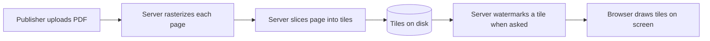
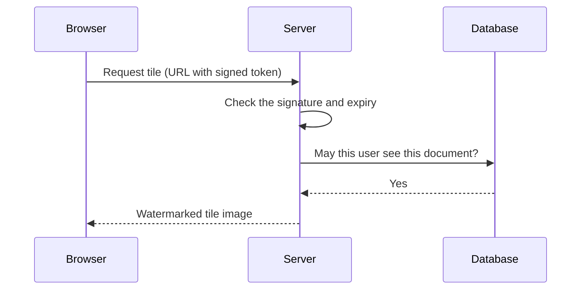

<!-- chapter: 1 | part: I | owner: writer-foundations | tag: book-m6-final | status: draft -->
# Chapter 1: The big picture

Before you write a line of code, you need a picture of what you're going to build and why it is built the way it is. This chapter describes the Secure Document Viewer in plain words, explains the one idea that shapes the whole design, and gives you a map of the tools the rest of the book teaches.

## Learning objectives

By the end of this chapter, you will be able to:

- Explain the problem the Secure Document Viewer solves, in one paragraph.
- Explain why hiding a download button in the browser does not protect a document.
- Describe how rasterizing a page and slicing it into tiles keeps the PDF on the server.
- Distinguish a client from a server and say which one you must trust less.
- Name the main tools in this book and say what each is for.
- State what the app cannot do.

## Prerequisites

None. This chapter assumes only that you have used a web browser.

## Beginner tier: The problem and the idea

### 1.1 The problem: showing a document without giving it away

Imagine a company that sells a confidential report, a training manual, or a magazine. Customers must be able to read it on screen. The company would prefer that they can't email the file to a thousand strangers.

That is a tension, and it doesn't go away. To show a page on your screen, a computer has to send you something that draws that page. Whatever it sends, you can keep. So no design can make content uncopyable: a person can always photograph the screen.

The realistic goal is smaller and more useful:

1. Make casual copying inconvenient, so that the easy paths (download the file, save the image) don't exist.
2. Make heavy copying slow, so that harvesting a whole document takes long enough to notice.
3. Make every copy traceable, so that a leaked image says who it was shown to.

The Secure Document Viewer is a small web application built to reach those three goals honestly. A signed-in reader opens a document in the browser and reads it page by page. The reader never receives the **PDF** (Portable Document Format) file, the common format for fixed-layout documents such as reports and manuals. <!-- source: README.md, "Why this design" and "Limitations" at book-m6-final -->

### 1.2 Why hiding a button doesn't protect anything

The obvious way to build a "protected" viewer is to send the PDF to the browser, then use the browser to hide the download button and block the right-click menu. Call this the *naive viewer*.

Here is why it fails. Your browser is a program running on *your* computer, under *your* control. Every instruction the site sends it, including "hide this button", is a request that the browser happens to honor. A person who opens the browser's **developer tools** (DevTools, a panel built into every browser that lets you inspect and change the page you're viewing) can undo the hiding in seconds. Even without that, the PDF already arrived on their machine, so it sits in the browser's **cache** (the folder where a browser keeps copies of files it has downloaded) waiting to be copied.

The project's README puts it bluntly: both tricks "live entirely in the browser, so both are undone in about ten seconds with DevTools." <!-- source: README.md, opening of "Why this design" -->

The lesson is the most important idea in the whole book, and you'll meet it again in every part:

> Anything enforced only in the client can be bypassed. Real protection lives on the server.

The app does still block the right-click menu in its Angular viewer. It does so knowingly, as a bit of friction for casual users, and it treats that as no protection at all. <!-- source: README.md, "The client also blocks right-click — on purpose, with eyes open" -->

### 1.3 The tile idea: rasterize, slice, deliver one piece at a time

If the PDF must never reach the browser, the server has to send something else. The design does this in three steps.

1. **Rasterize.** To **rasterize** a page means turning a page described by shapes and text (which is what a PDF contains) into a grid of colored dots, an image. The server renders each PDF page as an image at 150 DPI (dots per inch).
2. **Slice.** The server cuts each page image into square **tiles** of 512 by 512 pixels (a pixel is one dot of the image). Tiles at the right and bottom edges are cropped shorter.
3. **Deliver.** The server keeps only the tiles. The original PDF stops existing as something the app can serve. The browser asks for tiles one at a time and assembles them on screen.

A US letter page (8.5 by 11 inches) at 150 DPI is 1,275 by 1,650 pixels. Divided into 512-pixel squares, that is 3 columns by 4 rows: 12 tiles. The project's README says the same in its own words: "a letter page is ~12 tiles". <!-- source: README.md; src/main/resources/application.yml at book-m6-final (tile-size: 512, render-dpi: 150) -->

Figure 1.1 shows the flow.

**Figure 1.1 — From PDF to tiles to screen**

Three more ingredients complete the design. Each gets its own chapter later; here is the one-line version.

- **Signed, short-lived tile URLs.** A **URL** (Uniform Resource Locator) is a web address such as `https://example.com/page`. Every tile is fetched from its own URL, and that URL carries a **signature**: a short code that only the server can produce, computed from the rest of the address and a secret key. Change any part of the address and the signature no longer matches, so the server refuses it. The URL also carries an expiry time. A URL like this is a **signed URL**. Chapter 17 explains signatures.
- **A per-viewer watermark.** A **watermark** is a faint mark laid over an image. When the server sends a tile, it stamps the viewer's username and a timestamp onto it, so every response is individually traceable.
- **Access checks on every request.** The server verifies the sign-in and the document's permissions again for each tile, so unsharing a document cuts off a page that is already open. Signing in starts a **session**: the server's record that a particular browser has proven who it is, so the browser doesn't have to send the password again with every request.

#### An analogy, and where it breaks down

Think of a museum that will never lend you the painting. Instead it lets you look at the canvas through a window, one small square at a time, and the guard stamps your name on each square as you look.

The analogy breaks down in one respect: a museum guard can see you. The server can't; it only sees requests. Everything it knows about you comes from what your browser sends, which is why the server must check that information itself.

### 1.4 Clients and servers, in one picture

Nearly everything on the web is a conversation between two kinds of programs.

- A **client** asks for things. Your browser is a client.
- A **server** listens for requests and answers them. It runs on a computer that stays on, and it holds the data.

Figure 1.2 shows one exchange in this app.

**Figure 1.2 — A browser asks for a tile**

The *Database* in the figure is a separate program that stores the app's accounts, documents and permissions on disk so they survive a restart; [Chapter 9](09-sql-and-mysql.md) teaches it. Two rules follow, and the rest of the book depends on them:

- The client is under the user's control, so the server treats everything it sends as untrusted until checked.
- The server holds the secrets: the signing key, the tiles and the database.

[Chapter 8](08-how-the-web-works.md) teaches how the conversation works in detail (requests, status codes, cookies). For now, you only need the two roles.

### 1.5 The parts of the app and the tools you'll meet

The app has four moving parts, and this book has a part for each layer of tooling around them. Table 1.1 is the map.

**Table 1.1 — The parts of the app and the tools that build them**

| Part of the app | What it does | Main tools | Where you learn it |
|---|---|---|---|
| Backend | Renders tiles, checks permissions, signs URLs, stores data | Java 25, Spring Boot 4, Maven | Chapters 3–6 and Part II |
| Database | Stores accounts, documents, shares and the audit trail | MySQL 8.4, Flyway | Chapter 9 and Chapter 14 |
| Frontend | The pages you see in the browser | TypeScript, Angular 22, Node | Part III |
| Packaging and delivery | Runs everything the same way on any machine | Docker, Git, GitHub Actions | Chapters 7 and 10, Part V |

The source code is in this repository. You will follow it through seven checkpoints, one per milestone, marked with Git tags from `book-m0-mvp` to `book-m6-final`. [Chapter 7](07-git-and-github.md) shows you how to look at any of them.

The path through the book is deliberate. Part I gives you the vocabulary: a language, a build tool, version control, the web, SQL and containers. Parts II and III build the backend and the frontend. Part IV then rebuilds the app one milestone at a time, and Part V takes it to production.

### 1.6 What this app can and can't do

Being honest about limits is a design feature here, so learn them now.

**What it does:**

- The PDF stops being servable after upload; only disconnected tiles remain.
- Tile URLs expire (120 seconds by default) and work only for the session they were issued to.
- Every tile carries the viewer's identity and a UTC timestamp.
- Each user is subject to a **rate limit**, a cap on how many requests one user may make in a period of time (here 180 tiles per 60 seconds by default), so a scripted harvest is slow.
- Every important action (sign-ins, uploads, views, denied requests) is written to the **audit trail**, an append-only record in the **database** (the program that stores the app's data permanently; Chapter 9 teaches it).

**What it does not do:**

- It does not make content uncopyable. Screenshots and photographs are not prevented.
- A determined user with a valid session can still request every tile and reassemble them. The rate limit bounds how fast, not whether. The README estimates about half an hour for a 500-page document at the defaults.
- It offers no multi-factor sign-in, and pages are images, so screen readers get no text.

<!-- source: README.md, "Why this design" and "Limitations", at book-m6-final; application.yml; SignedTilePayload.java (session binding) -->

The watermark is what makes a leak attributable. That is the honest promise: raise the cost, add attribution, and never claim prevention.

## Intermediate tier: Why it is built this way

### 1.7 Why not something simpler?

Three simpler designs come to mind, and each fails in a way that teaches something.

- **Send the PDF with a viewer library.** The file is in the browser's memory and cache. Anyone can save it.
- **Send whole page images.** Better, but a single request returns a complete, high-quality page, and scripting that is trivial. Tiles mean each individual response is a fragment.
- **Stamp one watermark at upload time.** Every reader would get an identical copy, so a leak would not say who leaked it. Stamping at request time costs processor time (CPU) on each request, and the README accepts that cost on purpose. <!-- source: README.md, "Watermarking happens on the way out, not at ingest" -->

Every one of these trade-offs is revisited in [Chapter 37](../tradeoffs/37-engineering-tradeoffs.md), which lists the enterprise alternative to each choice.

## Advanced tier: The mindset

### 1.8 Threat thinking

Security work starts by asking who might misuse the system and how. For this app, imagine four people: a curious reader who right-clicks; a reader who shares a tile URL in a chat; a scripter who requests every tile; and someone who was never given access and guesses document identifiers.

Each of the app's protections answers one of them. You will see the answers as mechanisms in Parts II and IV, and you will test the strongest ones yourself. [Chapter 32](../part-5-production/32-security-review.md) turns this into a structured review.

## In this project

At `book-m6-final`, the pieces from this chapter live in these places.

| Idea | Where |
|---|---|
| Tile size and DPI | `src/main/resources/application.yml` (`tile-size`, `render-dpi`) |
| Tile slicing math | `src/main/java/com/example/securedocviewer/service/TileGrid.java` |
| Signed tile URLs | `service/SignedUrlService.java` |
| Rate limit | `security/TileRateLimiter.java` |
| The frontend | `frontend/` |

You'll read these files in later chapters. You don't need to understand them yet.

## Try it

### Exercise 1.1 ★ Count the tiles

A page is 2,000 pixels wide and 3,000 pixels high, and tiles are 512 pixels square. How many columns and rows of tiles does it need, and how many tiles in total? Are the tiles at the edges full size?

*Hint:* divide, then round up.

*Solution:* Appendix C, Exercise 1.1.

### Exercise 1.2 ★ Client or server?

For each of these, say whether it can be enforced by the client, the server, or only the server: hiding the download button; checking that a tile URL has not expired; blocking a user who isn't allowed to see a document.

*Solution:* Appendix C, Exercise 1.2.

### Exercise 1.3 ★★ Read the limits

Read the "Limitations" section of `README.md` at `book-m6-final`. Pick two limits and, for each, write one sentence explaining why the design accepts it.

*Solution:* Appendix C, Exercise 1.3.

## Summary

- The app shows documents without ever serving the PDF: pages are rasterized, sliced into tiles and delivered one at a time.
- Protections that live only in the browser can be bypassed; real protection lives on the server.
- Signed short-lived URLs, per-viewer watermarks and per-request access checks each answer a specific misuse.
- The app raises the cost of copying and adds attribution. It does not, and cannot, prevent copying.
- The book teaches the tools in this order: language, build, version control, the web, SQL, containers.

## Further reading

- *MDN Web Docs*, "How the Web works." https://developer.mozilla.org/en-US/docs/Learn_web_development/Getting_started/Web_standards/How_the_Web_works
- *OWASP Foundation*, "Threat Modeling Cheat Sheet." https://cheatsheetseries.owasp.org/cheatsheets/Threat_Modeling_Cheat_Sheet.html
