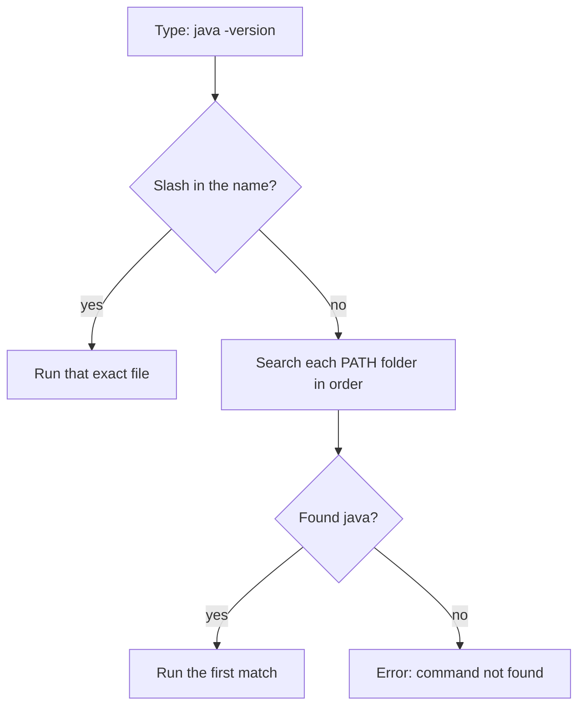

<!-- chapter: 2 | part: I | owner: writer-foundations | tag: book-m6-final | status: expanded -->
# Chapter 2: The command line and your files

Nearly every tool in this book is started by typing a command. This chapter teaches the small set of terminal skills you need: moving between folders, working with files, setting environment variables, and understanding what it means for a program to listen on a port. The app uses all of these. Its secrets live in environment variables, its settings come from files you edit, and its server listens on port 8080. By the end you will be able to type commands without fear and read the messages they print.

## Learning objectives

By the end of this chapter, you will be able to:

- Explain what a terminal and a shell are, and read the parts of a command.
- Move between folders and list their contents with commands.
- Create, read, copy, move, and delete files from the command line, and chain simple commands.
- Read and set an environment variable, and explain the `PATH`.
- Explain why the project keeps secrets in a `.env` file and how the app finds them.
- Explain what "listening on port 8080" means, and find what is using a port.
- Diagnose the common command-line errors.

## Prerequisites

- Chapter 1: The big picture

## Beginner tier: Talking to your computer in text

### 2.1 What a terminal and a shell are

Until now you have probably given your computer instructions by clicking. A **terminal** is a window where you type instructions instead. A **shell** is the program inside the terminal that reads what you type, runs it, and prints the result. The shell shows a **prompt**, a short line of text that says it is ready, often ending in `$`.

Why bother? Clicking cannot be written down and repeated. A command can be pasted into a document, run by a teammate, or run by a machine in the middle of the night. The project's build, its tests and its automated checks are all commands, and so is starting the database. When something goes wrong, a command and its output are also something you can copy into a bug report, which a description of clicks never is.

This book uses `bash` syntax. On macOS and Linux, open the Terminal app. On Windows, install Git for Windows, which includes **Git Bash**, and use that for every command in this book. (Windows also has PowerShell, whose syntax differs; where a PowerShell equivalent matters, the book shows it.)

**Analogy.** A terminal is like a phone call to a very literal assistant: you say exactly what you want, and it does exactly that.

**Where the analogy breaks down:** the assistant never asks "are you sure?". Commands such as delete run immediately and usually cannot be undone. It also breaks down in that a real assistant understands your intent, while the shell understands only the exact words and punctuation you typed.

#### Anatomy of a command

Every command has the same shape: the command name, then optional **flags** (also called options, which change how it behaves), then **arguments** (what to act on).

```bash
ls -l src
```

Here `ls` is the command, `-l` is a flag that asks for a long listing, and `src` is the argument, the folder to list. Flags start with one dash (short form, `-l`) or two (long form, `--help`). Words are separated by spaces, which is why a name that contains a space needs quotes: `cd "My Documents"`. Almost every command prints a summary of its flags if you add `--help`, for example `ls --help`.

### 2.2 Folders, paths, and moving around

Your files live in **folders** (also called directories) that nest inside each other. A **path** is the address of a file or folder. Paths use forward slashes in `bash`: `/c/dev/secure-doc-viewer` on Git Bash for Windows, or `/Users/you/dev/secure-doc-viewer` on macOS. Your path will differ. Git Bash shows the `C:` drive as `/c`.

The shell is always "in" one folder, called the **working directory**. Table 2.1 lists the commands you use to look around.

**Table 2.1 — Navigation commands**

| Command | What it does |
|---|---|
| `pwd` | Print the working directory |
| `ls` | List files in the working directory |
| `cd folder` | Move into `folder` |
| `cd ..` | Move up one level |
| `cd ~` | Move to your home folder |

A path is an **absolute path** if it starts from the top (`/c/dev/...`) and a **relative path** if it starts from where you are (`src/main`). The name `.` means "this folder" and `..` means "the folder above." Your **home folder** is where your personal files live, and `~` is shorthand for it.

Example 2.1 shows a short session. The lines starting with `#` are comments for you; the shell ignores them. If you have not cloned the project yet, use any folder; Chapter 7 shows how to get the project.

**Example 2.1 — Moving around**

```bash
pwd                      # where am I?
cd secure-doc-viewer     # go into the project folder
ls                       # what is here?
cd src/main/resources    # a relative path, three levels at once
cd ../../..              # back up three levels
```

Read the last line as "up, up, up." If you get lost, `cd ~` always takes you home and `pwd` always tells you where you are. Two habits will save you hours. Press <kbd>Tab</kbd> to complete a name, so you type `cd sec` and <kbd>Tab</kbd>. And press <kbd>↑</kbd> to bring back the previous command.

Figure 2.1 shows how the project's folders nest, using the top of the repository at `book-m6-final`.

```text
secure-doc-viewer/
├── pom.xml
├── docker-compose.yml
├── .env.example
├── src/
│   ├── main/
│   │   ├── java/
│   │   └── resources/
│   └── test/
└── frontend/
```

*Figure 2.1 — The top of the project's folder tree (book-m6-final, abbreviated)*

*Text description:* An indented list showing the project folder at the top, with `pom.xml`, `docker-compose.yml` and `.env.example` directly inside it, then `src` (holding `main`, which holds `java` and `resources`, and `test`) and `frontend`. Notice that application code lives under `src/main` and tests live separately under `src/test`.

<!-- source: git ls-tree of the repository root and of src/ at book-m6-final -->


A folder inside another is written with slashes: `src/main/resources` is `resources` inside `main` inside `src`. The full layout gets its own section in Chapter 6.

### 2.3 Creating, reading, copying, and deleting files

Table 2.2 gives the essential file commands.

**Table 2.2 — File commands**

| Command | What it does |
|---|---|
| `mkdir notes` | Create a folder |
| `cat file.txt` | Print a file's contents |
| `cp a.txt b.txt` | Copy a file |
| `mv a.txt notes/` | Move (or rename) a file |
| `rm b.txt` | Delete a file, permanently |
| `rm -r notes` | Delete a folder and everything in it |

`rm` does not use a recycle bin. Read a delete command twice before pressing <kbd>Enter</kbd>. `rm -r` is the one to be most careful with, since it deletes a whole folder and everything inside it.

Practice in a folder that is not the project, so nothing you care about is at risk:

```bash
mkdir scratch
cd scratch
echo "Tiles are 512 px square." > tiles.txt
cat tiles.txt
cp tiles.txt tiles-backup.txt
mv tiles-backup.txt old.txt
ls
rm old.txt
```

`echo` prints the words after it, and the `>` sends that output into a file instead of the screen (creating it, or replacing it if it exists). `cat` prints the file. Then a copy, a rename with `mv` (moving a file to a new name is renaming it), a listing that should show `tiles.txt` and `old.txt`, and a delete.

#### Redirection and pipes

The `>` in the `echo` command is **redirection**: sending a command's output somewhere other than the screen. Two relatives are worth knowing. `>>` appends to a file instead of replacing it. And the **pipe** `|` feeds one command's output into another's input, so small tools combine into bigger ones:

```bash
cat tiles.txt | wc -w
```

`wc -w` counts words, so this prints the number of words in the file. A very common combination is `grep`, which prints only the lines that contain some text:

```bash
grep "512" tiles.txt
```

You will use `grep` to search the project: `grep -r "tile-size" src` searches every file under `src` (`-r` means recursive, into subfolders) for the text `tile-size`. When a command produces a screenful, add `| head` to see only the first ten lines.

### 2.4 Editing text files

You need one more tool: a **text editor**, a program for changing text files. Any plain-text editor works. Visual Studio Code is free and popular, and is what this book's screenshots and instructions assume where an editor matters. If you have it, `code .` in a terminal opens the current folder. The most important rule is to edit *text* files in a text editor and not in a word processor, which adds formatting the project's tools cannot read.

If you want to stay in the terminal, `nano notes.txt` opens a small editor whose commands are listed at the bottom of the screen; <kbd>Ctrl</kbd>+<kbd>O</kbd> saves and <kbd>Ctrl</kbd>+<kbd>X</kbd> exits.

## Intermediate tier: How programs find their settings

*On a first read you can skim this tier; every later chapter uses environment variables, and Chapter 10 returns to them.*

### 2.5 Environment variables and the PATH

An **environment variable** is a named value that the operating system (the software that manages your computer, such as Windows, macOS, or Linux) hands to every program it starts. You can set and read one in the shell:

**Example 2.2 — An environment variable**

```bash
export GREETING="hello"
echo $GREETING
```

The first line sets `GREETING`. The second prints its value; the dollar sign means "the value of the variable named." Variables set this way last only for that terminal window, and only programs started from that window can see them.

On Windows (PowerShell):

```powershell
$env:GREETING = "hello"
echo $env:GREETING
```

You can list every variable the shell holds with `env` (or `printenv`). The list is long; you did not set most of it. The system and the programs you installed put them there. To set a variable for one command only, put it in front:

```bash
GREETING=hello bash -c 'echo $GREETING'
```

That prints `hello`, and afterwards `GREETING` is unchanged, because the assignment lived only for that one command.

Why do programs use environment variables at all? Because settings such as a database address or a password change from one computer to another, and you do not want to edit and rebuild the program to change them. The same program runs on your laptop and in production, with different values in the environment.

One variable deserves special mention. `PATH` is a list of folders. When you type `java`, the shell searches each folder in `PATH`, in order, for a program with that name. If a tool "is not found" although you installed it, its folder is usually missing from `PATH`. You can see yours with `echo $PATH`, and ask where the shell found a program with `which java` (on Windows PowerShell, `Get-Command java`).

Figure 2.2 shows exactly how the shell decides what to run when you type a command such as `java -version`.



*Figure 2.2 — How the shell finds a program: a name with a slash skips PATH*

*Text description:* A decision flow read from top to bottom, starting with the typed command `java -version`. The shell first asks whether the name contains a slash, as in `./mvnw`. If it does, it runs that exact file. If it does not, it reads the `PATH` list, searches each folder in order, and runs the first program it finds, or reports "command not found" when the folders run out.

<!-- source: bash behavior; ./mvnw is used in Chapter 6 (mvnw at book-m6-final) -->

Notice the first decision. A name with a slash in it, like `./mvnw` (the Maven wrapper of Chapter 6), names one exact file, so the shell never consults `PATH`. That is why you type `./mvnw` and not `mvnw` alone: the current folder is not on `PATH`. A bare name like `java` triggers the search, in order, and the first match wins, which is why the order of folders in `PATH` matters when two versions of Java are installed.

A related variable is **JAVA_HOME**, which many tools (Maven among them, Chapter 6) read to find the folder where your JDK (Java Development Kit, Chapter 3) is installed. If a build complains about Java although `java -version` works, check `JAVA_HOME`.

### 2.6 Configuration through the environment: `.env` files

Typing `export` for a dozen variables every time you open a terminal would be tedious and error-prone. The project instead lists them in a file. Chapter 1 mentioned that the app needs secrets; here is the template that ships with it.

**Listing 2.1 — `.env.example` (book-m6-final, excerpt: the database block)**

```text
# MySQL
DB_HOST=localhost
DB_PORT=3306
DB_NAME=securedocs
DB_USERNAME=securedocs
DB_PASSWORD=
DB_ROOT_PASSWORD=
```

*Path: `.env.example`*

Each line is `NAME=value`. The password lines are empty on purpose: you fill them in on your own machine, in a copy named `.env`. The other lines are safe defaults for local development. Copying the template is one command:

```bash
cp .env.example .env
```

Then open `.env` in a text editor and fill in the blanks with values you choose. Never paste a real password into a book, a chat, or a commit.

How does the app read this file? Its main settings file, `application.yml`, uses placeholders that mean "read this environment variable, or use this default":

**Listing 2.2 — `application.yml` (book-m6-final, excerpt: two settings)**

```yaml
spring:
  config:
    # Local development: secrets live in a git-ignored .env next to pom.xml
    # (the same file docker compose reads). Real environment variables win.
    import: optional:file:.env[.properties]

  datasource:
    # ...
    url: jdbc:mysql://${DB_HOST:localhost}:${DB_PORT:3306}/${DB_NAME:securedocs}?connectionTimeZone=UTC&forceConnectionTimeZoneToSession=true
```

*Path: `src/main/resources/application.yml`*

Read `${DB_HOST:localhost}` as "the value of `DB_HOST`, or `localhost` if it is not set". The `import` line tells the app to read a `.env` file if there is one (`optional:` means no error if it is missing), and the comment states the rule that matters: a real environment variable, if set, overrides the file. That precedence lets one machine, such as a production server, use environment variables and never have a `.env` file at all. **YAML** is a settings format where indentation shows nesting; Chapter 13 explains the whole file.

### 2.7 Text files, encodings, and line endings

A **text file** holds characters. Computers store everything as numbers called bytes, so an **encoding** is the rule that maps characters to bytes. The project's files use **UTF-8**, which stores plain English letters in one byte each and other characters, such as accented letters or emoji, in more. So a character is not always one byte, a fact that has a surprising consequence for passwords in Chapter 3.

A **line ending** marks where a line stops. Windows uses two bytes for it (a carriage return then a line feed, often written **CRLF**), while macOS and Linux use one (`LF`). Git and editors can convert between them, which matters in Chapter 7 and in Chapter 6, where a script with the wrong line endings fails with an error that mentions `\r`. The project's frontend includes an `.editorconfig` file that tells editors to save in UTF-8 and end each file with a newline, so every contributor's editor produces the same bytes. <!-- source: frontend/.editorconfig at book-m6-final -->

Now the reason for `.env` in one sentence. Secrets such as the database password and the key used to sign tile URLs must never be committed to version control. **Version control** is a tool that records every change to a project's files so that you can go back to any earlier state; Git is the one this project uses, and [Chapter 7](07-git-and-github.md) teaches it. Its history is permanent and shared, so a secret committed once is exposed for good. So the project keeps a template, `.env.example`, in the repository, and asks you to copy it to `.env`. A file named `.gitignore` lists the files Git must not record, and it lists `.env`. The real values stay on your machine. <!-- source: .gitignore and .env.example at book-m6-final -->

## Advanced tier: Ports, processes, and real incidents

*On a first read you can skip to "In this project"; Chapters 7 and 10 come back to secrets and ports.*

### 2.8 Ports and processes (what "listening on 8080" means)

A running program is a **process**. Your computer can run many at once, and each gets its own number. A **port** is a numbered door on your computer, from 0 to 65535. A server process **listens** on a port: it asks the operating system to hand it any network request addressed to that number.

An **address** here means which of the computer's network connections the program listens on; the name **localhost** means this computer, and its numeric form is `127.0.0.1`. Two programs cannot listen on the same port on the same address. If you start the backend and see an error that port 8080 is already in use, another process holds it. Table 2.3 lists the ports in this project.

**Table 2.3 — Ports used by the project**

| Port | What listens | Where it is set |
|---|---|---|
| `8080` | The backend (Spring Boot) | `server.port` in `application.yml` |
| `3306` | MySQL | `DB_PORT` in `.env`, published by `docker-compose.yml` |
| `8081` | The web front door in the full Docker stack | `WEB_PORT` in `docker-compose.yml` |
| `8443` | The optional HTTPS frontend | `TLS_PORT` in `docker-compose.yml` |
| `4200` | The Angular development server | Angular's default |

<!-- source: application.yml, docker-compose.yml at book-m6-final; frontend/README.md -->

A request to `localhost:8080` never leaves your machine. The project's `docker-compose.yml` publishes MySQL as `127.0.0.1:3306`, which means only your own computer can connect to it, never the network. That is a security choice: the database has no reason to be reachable from elsewhere. Chapter 10 explains the file.

#### Finding what uses a port

When a startup fails with "port already in use", find the culprit. The command depends on your system, and one common trap is worth stating: `lsof`, the usual tool on macOS and Linux, does not exist in Git Bash, because Git Bash only imitates a Unix shell on top of Windows.

On macOS and Linux:

```bash
lsof -i :8080
```

You should see a line naming the program and its process number (**PID**). On Windows, in Git Bash or PowerShell, Windows' own `netstat` tool works in both:

```bash
netstat -ano | findstr :8080
```

`netstat -ano` lists every network connection with the process number in the last column, and the pipe passes the list to `findstr`, which keeps only lines that contain `:8080`. The line marked `LISTENING` is the server; the number at its end is the PID. In PowerShell there is also a tidier form:

```powershell
Get-NetTCPConnection -LocalPort 8080 | Select-Object OwningProcess
```

Then look the process up by its number: `ps -p <pid>` on macOS and Linux, `Get-Process -Id <pid>` in PowerShell (or find the number in Task Manager's *Details* tab on Windows). If it is a previous copy of the app that you forgot to stop, end it. If it is something you need, change the port instead of killing it, for example by setting the `server.port` property. The friendlier fix is nearly always to stop your own earlier run.

### 2.9 A real incident: the secret that started in a file

Chapter 1 promised that real protection lives on the server, and the server's most important secret is the key that signs tile URLs. The first version of the project had a placeholder key written directly in `application.yml`. The technical-manager review (an AI review agent that examined the project) flagged it as a high-severity finding. A key in a committed file is in the history for everyone who ever clones the repository, and a placeholder tends to become the real key when nobody notices.

The fix has three parts, all from this chapter. The key moved to an environment variable named `SIGNING_SECRET`. The `.env` file that holds it was added to `.gitignore`. And the app now refuses to start unless the key is present and at least 32 characters long, so a missing or weak key fails loudly at startup rather than quietly at the first tile. A note in the review records that the placeholder still exists in Git history, because history is permanent. The value was never a real secret. The lesson is exactly why a secret must never be committed in the first place. <!-- source: dossier bugs-and-findings.md TM-6; ViewerProperties.java at book-m6-final -->

You need a good random value for such a key. The project's own automated checks generate throwaway secrets with a standard tool, and you can do the same:

```bash
openssl rand -hex 32
```

That prints 64 random hexadecimal characters, comfortably above the 32-character minimum. Put the value in your local `.env` as `SIGNING_SECRET=<your value>`. Do not copy the example output from anywhere, including this book: a secret is only secret if you made it and nobody else has seen it.

### 2.10 A real incident: OneDrive and the locked folder

The second incident is about files rather than secrets. Early in development, the project lived inside a OneDrive-synced folder. OneDrive and antivirus programs briefly lock files that were written a moment ago, and on Windows a locked file cannot be renamed or deleted. The app renames and deletes folders of tiles constantly, so it began failing intermittently. Two fixes followed. The project was moved to a plain folder outside any synced location, and the code that moves and deletes directories was changed to retry. Its class comment explains the whole problem:

**Listing 2.3 — `FileOperations.java` (book-m6-final, excerpt: class comment and method `backOff`)**

```java
/**
 * Directory moves and deletes that tolerate transient locks. On Windows,
 * antivirus scanners and sync clients (OneDrive, Dropbox) briefly hold files
 * that were just written or are being synced, which makes a rename or delete
 * fail with AccessDenied for a moment. Each operation retries for about two
 * seconds before giving up.
 */
final class FileOperations {

    // ...

    private static void backOff(int attempt) {
        try {
            Thread.sleep(50L << Math.min(attempt, 4));
        } catch (InterruptedException e) {
            Thread.currentThread().interrupt();
        }
    }
}
```

*Path: `src/main/java/com/example/securedocviewer/service/FileOperations.java`*

The method waits between attempts, and the wait grows. The expression `50L << Math.min(attempt, 4)` shifts the number 50 left by the attempt number, which doubles it each time. The waits are 50, 100, 200, 400 and then 800 milliseconds, and they stay at 800 from the fifth wait on. The class allows eight attempts, and it waits after each failure, so the waits add up to 50 + 100 + 200 + 400 + 4 x 800 = 3,950 milliseconds, close to four seconds. The class comment in Listing 2.3 says "about two seconds," which understates what the code does; when a comment and the code disagree, believe the code. The lesson for a beginner is the operating-system one: your files are not only yours. Other programs may hold them, and a sync service can also copy your secrets and your documents to a cloud you did not intend. That is why `.env.example` carries a warning that the storage folder must not be synced. <!-- source: dossier bugs-and-findings.md C4; decisions.md (move out of OneDrive); FileOperations.java and .env.example at book-m6-final -->

### 2.11 Common mistakes

**"command not found."** Either the name is misspelled, or the program is not installed, or its folder is not on the `PATH`. Check the spelling, then `which <name>`. After installing a tool, open a new terminal: an already-open window keeps the old `PATH`.

**"No such file or directory."** You are in the wrong folder, or a name is misspelled, or the case is wrong: `Readme.md` and `README.md` are different files on macOS and Linux (though not on default Windows settings). Run `pwd` and `ls`.

**A name with spaces breaks a command.** The shell splits words at spaces. Wrap the name in quotes: `cd "My Documents"`.

**"Permission denied."** You lack permission to run or write the file. For a script that is not executable, `chmod +x script.sh` (Chapter 6 has a real case, the Maven wrapper).

**A variable is empty in a new window.** `export` lasts for one terminal. Put lasting settings in a file, such as `.env`, or in your shell's startup file.

**An unexpected deletion.** `rm -r` is permanent. Before running it, run `ls` on the same path and read the list. If you are unsure, move the folder instead (`mv folder /tmp/`) and delete it later.

**The wrong slash on Windows.** In Git Bash use forward slashes. A path copied from Windows Explorer has backslashes and a drive letter; write `/c/Users/you/...` instead.

**"Address already in use."** Section 2.8: another process holds the port.

## In this project

At `book-m6-final`, the ideas from this chapter appear in:

- `.env.example` and `.gitignore`: the secrets template and the rule that keeps `.env` out of Git.
- `src/main/resources/application.yml`: uses placeholders such as `${DB_HOST:localhost}`, which read an environment variable and fall back to a default. Chapter 13 explains the syntax.
- `docker-compose.yml`: the ports, and the `.env` values passed into containers (Chapter 10).
- `src/main/java/com/example/securedocviewer/service/FileOperations.java`: retries for locked files.
- `frontend/.editorconfig`: the shared editor settings.

## Try it

### Exercise 2.1 ★ Explore the repository

(Do this after [Chapter 7](07-git-and-github.md) shows you how to get a copy of the repository, or use any folder you have.) Open a terminal in your copy of the repository. Use `pwd`, `ls` and `cd` to find `application.yml`, then print it with `cat`. How many levels deep is it below the project folder?

*Solution:* Appendix C, Exercise 2.1.

### Exercise 2.2 ★ Set and use a variable

Set an environment variable `SCRATCH_SIZE=512`, print it with `echo`, then open a new terminal window and print it again. What happens, and why?

*Hint:* variables set with `export` last only for one terminal.

*Solution:* Appendix C, Exercise 2.2.

### Exercise 2.3 ★★ Why is `.env` ignored?

Find the line in `.gitignore` that excludes `.env`. Write two sentences explaining what could go wrong if it were missing.

*Solution:* Appendix C, Exercise 2.3.

### Exercise 2.4 ★ Redirect and count

In a scratch folder, use `echo` and `>>` to write three lines into a file, then use `wc -l` to count them and `grep` to print only the lines that contain a word you choose.

*Solution:* Appendix C, Exercise 2.4.

### Exercise 2.5 ★★ Who owns port 8080?

Start any program that listens on a port (for example, `python -m http.server 8080` if you have Python), then use the command from Section 2.8 for your system (`lsof` on macOS and Linux, `netstat` on Windows) to find the process that owns port 8080. Stop the program and confirm the port is free.

*Solution:* Appendix C, Exercise 2.5.

### Exercise 2.6 ★★★ Read the environment like the app does

Copy `.env.example` to `.env` (do not commit it). Set `DB_PORT=3307` in the file. Using only Listing 2.2 and Section 2.6, predict what the datasource URL becomes, and what would happen if you also ran `export DB_PORT=3308` before starting the app. Explain which value wins and why.

*Solution:* Appendix C, Exercise 2.6.

## Summary

- A terminal runs a shell; commands have a name, flags and arguments, and can be repeated and shared.
- Paths locate files; `pwd`, `ls`, and `cd` navigate, redirection, and pipes combine commands, and `rm` deletes permanently.
- Environment variables carry settings and secrets into programs; `PATH` tells the shell where programs live.
- The project keeps secrets in a Git-ignored `.env` copied from `.env.example`, and a real environment variable overrides the file.
- Files are bytes with an encoding and line endings; other programs, such as sync clients, can lock or copy your files.
- A server listens on a port; the backend uses 8080 and MySQL uses 3306, and you can find what holds a port.

## Further reading

- *Git for Windows*, "Git Bash." https://gitforwindows.org/
- *GNU Bash Reference Manual*. https://www.gnu.org/software/bash/manual/bash.html
- *Spring Boot Reference Documentation*, "Externalized Configuration." https://docs.spring.io/spring-boot/reference/features/external-config.html
