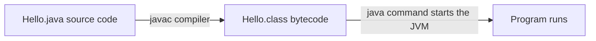

<!-- chapter: 3 | part: I | owner: writer-foundations | tag: book-m6-final | status: expanded -->
# Chapter 3: Your first Java program

The backend of the Secure Document Viewer is written in Java. This chapter teaches the smallest useful core of the language: how to write, compile, and run a program, how to store values, how to make decisions and repeat work, and how to package logic into methods. It ends by reading real code from the app: the method that decides how many tiles a page needs, the test that checks it, and the rule that decides whether a password is acceptable. Every idea is small, and each one is used in the project.

## Learning objectives

By the end of this chapter, you will be able to:

- Explain what a program, source code, the JDK, and the JVM are.
- Write, compile, and run a small Java program from the terminal.
- Declare variables of the basic types and combine them with operators.
- Explain the difference between a character and a byte, and why it mattered for a password rule.
- Write `if` statements, `switch`, and loops.
- Write and call a method with parameters and a return value.
- Read a compiler error and a stack trace to find the line at fault.
- Read `TileGrid.tileCount`, its test, and the password rule, and explain each line.

## Prerequisites

- Chapter 2: The command line and your files

## Beginner tier: Writing and running a program

### 3.1 What Java, the JDK and the JVM are

A **program** is a list of instructions a computer follows. People write those instructions as **source code**, text in a **programming language**. A computer's processor cannot read source code directly, so the code must be translated first.

Java works in two steps. A tool called the **compiler** (`javac`) translates your source files (which end in `.java`) into **bytecode**, a compact set of instructions stored in `.class` files. Then the **JVM** (Java Virtual Machine) runs the bytecode. The JVM is a program that behaves like a computer inside your computer, which is why the same bytecode runs on Windows, macOS and Linux. Figure 3.1 shows the path from your text to a running program.



*Figure 3.1 — From source code to a running program*

*Text description:* Three boxes in a row, read left to right. The source file `Hello.java` is turned into `Hello.class` bytecode by the `javac` compiler, and the `java` command then starts the JVM, which runs the bytecode as a program.

You install the **JDK** (Java Development Kit), which contains the compiler, the JVM and the standard library, a large collection of ready-made code. The **JRE** (Java Runtime Environment) is the part needed only to run programs, without the compiler; you will meet it in the Dockerfile in Chapter 10. This book uses Java 25, a long-term-support release, which the project selected when it upgraded (Chapter 6). The project sets `<java.version>25</java.version>` in its `pom.xml`. <!-- source: pom.xml at book-m6-final; dossier decisions.md (Java 25, LTS) -->

**Analogy.** Source code is a recipe in English, bytecode is the same recipe translated into a simple universal shorthand, and the JVM is a cook in each kitchen who knows the shorthand.

**Where the analogy breaks down:** a cook works from the shorthand at human speed, while the JVM also optimizes the bytecode as it runs, so long-running programs get faster after a warm-up. And a cook may improvise, while the JVM does exactly what the bytecode says.

### 3.2 Hello, world: compile and run

Check that Java is installed:

```bash
java -version
```

You should see something like this:

```text
openjdk version "25" ...
```

The exact wording varies with the vendor and patch level (you may see `25.0.1`, or `java version "25..."`); what matters is the 25.

If you get "command not found", the JDK is not installed or not on your `PATH` (Chapter 2). Also check the compiler: `javac -version` should print `javac 25...`.

Create a file named `Hello.java` with the code in Example 3.1. The filename must match the class name.

**Example 3.1 — `Hello.java`**

```java
public class Hello {
    public static void main(String[] args) {
        System.out.println("Hello, world");
    }
}
```

Every token here is new, so we go through it.

- `public class Hello { ... }` declares a **class**, a named container for code. Chapter 4 explains classes fully. For now, every Java program lives inside one, and the name matches the file.
- `public static void main(String[] args)` declares the **main method**, the entry point: where the JVM starts. The words `public` and `static` control who can call it and whether it needs an object; `void` means it returns nothing; `String[] args` receives any words typed after the program name.
- `System.out.println("Hello, world");` prints a line of text. `"Hello, world"` is a **string**, a piece of text in double quotes. The semicolon ends the statement.
- Braces `{ }` group code into blocks.

Compile and run:

```bash
javac Hello.java
java Hello
```

`javac` creates `Hello.class`; `java Hello` runs it. You should see:

```text
Hello, world
```

Since Java 11 you can also run a single file in one step with `java Hello.java`, which compiles in memory and runs. This book uses it for small examples.

The real application has the same shape. Its entry point is short.

**Listing 3.1 — `SecureDocViewerApplication.java` (book-m6-final)**

```java
package com.example.securedocviewer;

import org.springframework.boot.SpringApplication;
import org.springframework.boot.autoconfigure.SpringBootApplication;
import org.springframework.scheduling.annotation.EnableScheduling;

@SpringBootApplication
@EnableScheduling
public class SecureDocViewerApplication {
    public static void main(String[] args) {
        SpringApplication.run(SecureDocViewerApplication.class, args);
    }
}
```

*Path: `src/main/java/com/example/securedocviewer/SecureDocViewerApplication.java`*

You recognize the class and `main`. The `package` and `import` lines and the `@` lines are explained in Chapter 4. The single line inside `main` starts the whole web server; Chapter 11 explains how.

### 3.3 Variables, types, and operators

A **variable** is a named place to keep a value. Java is **statically typed**: every variable has a **type** that says what kind of value it holds, and the compiler checks that you use it correctly. Table 3.1 lists the types you will meet most.

**Table 3.1 — Basic types**

| Type | Holds | Example |
|---|---|---|
| `int` | Whole numbers (about -2 billion to 2 billion) | `512` |
| `long` | Larger whole numbers | `120L` |
| `double` | Decimal numbers | `1.5` |
| `boolean` | `true` or `false` | `true` |
| `String` | Text | `"admin"` |

Example 3.2 declares some variables using names from the app's configuration.

**Example 3.2 — Variables and operators**

```java
int tileSize = 512;
int pageWidthPx = 1275;
String owner = "pub.one";
boolean isPrivate = true;

int leftover = pageWidthPx - 2 * tileSize;   // 1275 - 1024 = 251
boolean fits = pageWidthPx <= tileSize;      // false
String label = owner + " owns this";         // text joining
```

Each line has the shape `type name = value;`. The `=` **assigns**: it stores the value on the right in the variable on the left. **Operators** combine values: `+ - * /` for arithmetic, `<=`, `<`, `==` (equal), `!=` (not equal) for comparison, and `&&` (and), `||` (or), `!` (not) for booleans. With `+`, text and other values are joined. Names follow a convention: start with a lowercase letter and capitalize each later word (`pageWidthPx`), called **camel case**. Java is case-sensitive, so `tileSize` and `TileSize` are different names.

Two more pieces of vocabulary. A variable declared `final` cannot be changed after it is set, which is the right choice for a value that should stay fixed. And a number written directly in code, such as `512`, is a **literal**. When the same number matters in several places, give it a name so its meaning is clear.

Three details trip up beginners. Dividing two `int` values gives an `int` with the remainder dropped: `7 / 2` is `3`, not `3.5`. To keep the fraction, at least one side must be a `double`: `7 / 2.0` is `3.5`. Assigning a decimal to an `int` variable is an error, because it would lose information (Section 3.8 shows the message). And `==` compares numbers; to compare text, use `.equals`: `owner.equals("pub.one")`. The reason is that a `String` is an object (Chapter 4), and `==` on objects asks "are these the very same object?", not "do they hold the same text?".

### 3.4 Strings

Text is everywhere in the app, from usernames to document titles, so it is worth knowing how Java treats it.

A `String` is a sequence of characters, and you can ask questions of it with methods. `text.length()` counts its characters, `text.isBlank()` is true if it is empty or only spaces, `text.toUpperCase()` returns an uppercase copy, and `text.substring(0, 3)` returns the first three characters. A `String` never changes: every method that seems to modify it returns a new one.

One more subtlety of text, the difference between a character and a byte, caused a real bug in this project. It is not needed yet, so it waits in Section 3.10 in the Advanced tier.

## Intermediate tier: Control flow and methods

*On a first read you can skim this tier; Chapters 4 and 5 use these ideas again.*

### 3.5 Decisions

An **if statement** runs code only when a condition is true. Add `else` for the other case, and `else if` for more.

**Example 3.3 — Deciding**

```java
if (pageCount > 500) {
    System.out.println("Too many pages");
} else if (pageCount == 0) {
    System.out.println("Empty document");
} else {
    System.out.println("OK");
}
```

The conditions are checked from the top, and only the first true branch runs. The 500-page limit in the example is the project's real maximum (`max-pages: 500` in `application.yml`). <!-- source: application.yml at book-m6-final -->

When you are choosing among many fixed values, a **switch** reads better than a chain of `if`. Suppose you want a sentence about each account role. `Role` is a type with a fixed set of values, which Chapter 4 calls an enum, and the compiler checks that you covered every value.

**Example 3.4 — Switch on a fixed set of values (teaching example)**

```java
public class Roles {
    enum Role { READER, PUBLISHER, ADMIN }

    static String describe(Role role) {
        return switch (role) {
            case READER -> "may read documents shared with them";
            case PUBLISHER -> "may also upload documents";
            case ADMIN -> "may also manage accounts and see the audit log";
        };
    }

    public static void main(String[] args) {
        System.out.println(describe(Role.PUBLISHER));   // may also upload documents
    }
}
```

`switch` here is an expression: it produces a value, which the method returns. Each `case X -> value` is one branch. If you delete one case, the compiler refuses to compile, which turns "I forgot a role" into an error you see immediately. The role descriptions follow the project's own comment on `Role`. <!-- source: Role.java at book-m6-final --> The real app uses a switch of a more advanced kind in its error handler; you will read it in Chapter 13.

### 3.6 Loops

A **loop** repeats code. A `for` loop counts:

**Example 3.5 — Counting**

```java
for (int row = 0; row < 4; row++) {
    System.out.println("Row " + row);
}
```

Read the parentheses as three parts: start (`int row = 0`), keep going while (`row < 4`), and step (`row++`, which adds one). This prints rows 0 to 3. Counting starts at zero throughout Java, and the app follows that: the first tile of a page is row 0, column 0.

A `while` loop repeats as long as a condition holds. It suits cases where you do not know in advance how many rounds you need:

**Example 3.6 — Counting tiles the slow way**

```java
int covered = 0;
int cols = 0;
while (covered < 1275) {
    covered += 512;   // shorthand for covered = covered + 512
    cols++;
}
System.out.println(cols);   // 3
```

Each round adds one tile's width until the page width is covered. It gives the same answer as the formula in Section 3.7, three columns, by repetition instead of arithmetic. Two keywords change a loop's flow: `break` leaves the loop at once, and `continue` skips to the next round.

The app uses exactly the counting pattern to hand out one URL per tile, with one loop inside another.

**Listing 3.2 — `PageTileUrlController.java` (book-m6-final, excerpt: method `tileUrls`)**

```java
        String[][] urls = new String[pageInfo.rows()][pageInfo.cols()];
        for (int row = 0; row < pageInfo.rows(); row++) {
            for (int col = 0; col < pageInfo.cols(); col++) {
                String token = signedUrlService.issueToken(documentId, page, row, col, issuable.tileVersion(), sessionBinding);
                urls[row][col] = "/api/tiles?token=" + token;
            }
        }
```

*Path: `src/main/java/com/example/securedocviewer/controller/PageTileUrlController.java`*

The outer loop walks the rows, and the inner loop walks the columns of each row. Each pass creates a **token**, the signed part of a URL, and stores a URL in `urls`. The variable `urls` is a table of strings: `String[][]` is a two-dimensional **array**, a fixed-size row of values. Names like `pageInfo.rows()` and `signedUrlService.issueToken(...)` are calls to code defined elsewhere; you will learn to read them in Chapter 4. A page that is 3 columns by 4 rows makes the inner statement run 12 times, once per tile.

A common source of bugs is stepping one too far. `for (int i = 0; i <= 4; i++)` runs five times, not four. Prefer `<` with a count, as in Listing 3.2, and remember that an array of length 4 has indexes 0 to 3.

### 3.7 Methods

A **method** is named, reusable code that takes inputs (**parameters**) and can give back a result (a **return value**). Methods stop you from writing the same logic twice and let you test it in isolation.

**Example 3.7 — A method**

```java
static int tilesNeeded(int lengthPx, int tileSize) {
    return (lengthPx + tileSize - 1) / tileSize;
}
```

`static int tilesNeeded(...)` says: this method returns an `int`. Inside the parentheses are two parameters, each with a type. `return` sends a value back. You call it like this: `int cols = tilesNeeded(1275, 512);`, and `cols` becomes 3.

Why that formula? Whole-number division drops the remainder, so `1275 / 512` is 2, one tile short. Adding `tileSize - 1` first makes any remainder push the result up to the next whole number. This is **ceiling division**, "divide and round up." Check it by hand: `(1275 + 511) / 512` is `1786 / 512`, which is 3 after dropping the remainder. And for an exact fit, `(1024 + 511) / 512` is `1535 / 512`, which is 2, correct. The app needs it because a page rarely divides evenly into tiles.

A method that returns nothing is declared `void` (like `main`) and does something instead, such as printing. Methods can call other methods, and each call gets its own set of variables. Parameters are **passed by value**: the method receives a copy of a number, so changing the parameter inside the method does not change the caller's variable. Methods are also how you split a big problem: `main` in a real program is usually short, and calls methods that each do one thing well.

**Example 3.8 — Methods calling methods**

```java
public class Grid {
    static int tilesNeeded(int lengthPx, int tileSize) {
        return (lengthPx + tileSize - 1) / tileSize;
    }

    static int totalTiles(int widthPx, int heightPx, int tileSize) {
        return tilesNeeded(widthPx, tileSize) * tilesNeeded(heightPx, tileSize);
    }

    public static void main(String[] args) {
        System.out.println(totalTiles(1275, 1650, 512));   // 12
    }
}
```

The total is columns times rows: 3 times 4, which is 12, the number quoted in Chapter 1.

### 3.8 Reading errors

Errors are normal. You will read many. Learn to read them calmly, from the first line.

A **compiler error** stops the build before anything runs. Suppose you forget a semicolon:

```text
Hello.java:3: error: ';' expected
        System.out.println("Hello, world")
                                          ^
1 error
```

The message gives the file, the line number (3), what is wrong, and a caret under the place. Fix the first error first; later ones often follow from it. Two more you will meet often:

```text
Hello.java:3: error: cannot find symbol
        System.out.printn("Hello, world");
                  ^
  symbol:   method printn(String)
  location: variable out of type PrintStream
```

"Cannot find symbol" means a name is misspelled, or in the wrong case, or was never declared or imported. Here `printn` should be `println`. And:

```text
Tiles.java:4: error: incompatible types: possible lossy conversion from double to int
        int cols = 1275 / 512.0;
                        ^
```

You put a decimal result into an `int`. Java refuses, because the fraction would be lost silently; this is the "types protect you" behavior of a statically typed language. The fix is to choose the right type, or to convert on purpose.

A **runtime error** happens while the program runs. Java reports it as an **exception** with a **stack trace**, the chain of method calls that led to the failure, newest first:

```text
Exception in thread "main" java.lang.IllegalArgumentException: lengthPx and tileSize must both be positive
        at TileMath.tileCount(TileMath.java:6)
        at TileMath.main(TileMath.java:12)
```

Read it top to bottom: the first line says what went wrong, and the first `at` line says where. Here that is line 6 of `TileMath.java`, called from line 12. (This trace is teaching output, not from the project.) Another common one is `ArrayIndexOutOfBoundsException: Index 3 out of bounds for length 3`, which means you asked for the fourth item of a three-item array. Chapter 5 teaches how to raise and handle exceptions.

## Advanced tier: Real code from the app

*On a first read you can skip to "In this project"; Chapter 13 returns to validation.*

### 3.9 A small taste of the app: tile-grid math and its test

You now know enough to read a real class. `TileGrid` holds the math that turns a page's pixel size into a number of tiles. Listing 3.3 is its counting method.

**Listing 3.3 — `TileGrid.java` (book-m6-final, excerpt: method `tileCount`)**

```java
    /** Number of tiles needed to cover {@code lengthPx} pixels: ceil(lengthPx / tileSize). */
    public static int tileCount(int lengthPx, int tileSize) {
        if (lengthPx <= 0 || tileSize <= 0) {
            throw new IllegalArgumentException("lengthPx and tileSize must both be positive");
        }
        return (lengthPx + tileSize - 1) / tileSize;
    }
```

*Path: `src/main/java/com/example/securedocviewer/service/TileGrid.java`*

Line by line:

- The `/** ... */` block is a **doc comment**: text for people, ignored by the compiler.
- `public static int tileCount(int lengthPx, int tileSize)` is a method that returns a whole number. `public` lets any code call it.
- The `if` uses `||` ("or"): if either input is zero or negative, the method refuses to continue.
- `throw new IllegalArgumentException(...)` raises an exception with a message. Refusing bad input early stops a nonsense answer from spreading.
- The final line is the ceiling division from Section 3.7.

The project tests this method with a synthetic image so it never needs a real PDF. That is why the class is kept separate from PDF rendering, as its own comment says. A **test** is code that checks other code. Here are two of the project's tests for `tileCount`, and you can already read them.

**Listing 3.4 — `TileGridTest.java` (book-m6-final, excerpt: two tests)**

```java
    @Test
    void tileCountRoundsUpForPartialTiles() {
        assertEquals(1, TileGrid.tileCount(1, 256));
        assertEquals(1, TileGrid.tileCount(256, 256));
        assertEquals(2, TileGrid.tileCount(257, 256));
        assertEquals(13, TileGrid.tileCount(612, 50));
        assertEquals(16, TileGrid.tileCount(792, 50));
    }

    @Test
    void tileCountRejectsNonPositiveInputs() {
        assertThrows(IllegalArgumentException.class, () -> TileGrid.tileCount(0, 256));
        assertThrows(IllegalArgumentException.class, () -> TileGrid.tileCount(100, 0));
    }
```

*Path: `src/test/java/com/example/securedocviewer/service/TileGridTest.java`*

`assertEquals(expected, actual)` fails the test if the two values differ. Check the last two. A US letter page is 612 by 792 points. With 50-pixel tiles you need 13 columns, because `612 / 50` is 12.24, which rounds up to 13. You need 16 rows, because `792 / 50` is 15.84, which rounds up to 16. The tests choose their inputs on the edges: one pixel, exactly one tile, one pixel more than a tile. Those are where a rounding formula goes wrong. `assertThrows` checks that bad input raises the exception, using a small unnamed method, a lambda (Chapter 5). The test class is `TileGridTest`; the testing chapters (18 and 24) teach how tests are run.

The same file holds the guarantee that gave the class its shape. Its own comment states: "tiles are a lossless partition of the page. Reassembling every tile at its grid offset must reproduce the source image pixel-for-pixel — no seams, no overlap, no dropped edge strips." A test builds a random image whose size is not a multiple of the tile size (613 by 457 with 64-pixel tiles). It slices the image, reassembles it, and compares every pixel. The lesson is bigger than the code: when a class has one clear promise, write the test that proves it. <!-- source: TileGridTest.java at book-m6-final; dossier timeline.md (round-trip test in b6aef4e) -->

### 3.10 Characters, bytes, and a real limit

This section is a first look at a subtle point. If it feels heavy, read it once and return to it after Chapter 5; nothing later in Part I depends on it.

Text deserves a closer look here, because a real bug in this project came from misunderstanding it.

Computers store everything as bytes (Chapter 2), so a string must be **encoded** into bytes to be saved or sent. In UTF-8, plain English letters take one byte each, but accented letters take two, and many symbols and emoji take three or four. So the number of characters and the number of bytes can differ, and a program must know which one a rule is about.

**Example 3.9 — Characters versus bytes**

```java
import java.nio.charset.StandardCharsets;

public class Bytes {
    public static void main(String[] args) {
        String plain = "password";
        String accented = "contraseña";
        System.out.println(plain.length());                                       // 8
        System.out.println(plain.getBytes(StandardCharsets.UTF_8).length);        // 8
        System.out.println(accented.length());                                    // 10
        System.out.println(accented.getBytes(StandardCharsets.UTF_8).length);     // 11
    }
}
```

`getBytes(StandardCharsets.UTF_8)` turns the string into its UTF-8 bytes, and `.length` counts them. The word `contraseña` (the Spanish for "password") has 10 characters but 11 bytes, because `ñ` takes two.

Why does this matter here? The app stores passwords using BCrypt, a **hashing** method (a one-way scrambling of a password, so the original cannot be recovered; Chapter 15) that reads at most 72 bytes of a password and refuses longer ones. So the rule "how long may a password be?" is really a rule about bytes. Here is how the app expresses it.

**Listing 3.5 — `UserAccountService.java` (book-m6-final, excerpt: the byte limit)**

```java
    /** BCrypt uses at most 72 bytes of a password and refuses longer ones. */
    public static final int MAX_PASSWORD_BYTES = 72;

    public static boolean fitsBcrypt(String password) {
        return password == null || password.getBytes(java.nio.charset.StandardCharsets.UTF_8).length <= MAX_PASSWORD_BYTES;
    }
```

*Path: `src/main/java/com/example/securedocviewer/account/UserAccountService.java`*

`public static final int MAX_PASSWORD_BYTES = 72;` is a named constant (`final` means it never changes; `static` means it belongs to the class itself; Chapter 4 explains). `fitsBcrypt` returns a `boolean`: true if the password is missing (`null`, treated as "nothing to reject here") or if its UTF-8 byte count is at most 72. It is a method with one input and one true-or-false answer, the simplest useful kind. Section 3.11 shows where it is used, and Chapter 5 tells the bug this rule fixed.

### 3.11 Validating input: the password rule

Real programs spend much of their time rejecting bad input politely. Here is the app's rule for a new password, built from the pieces of this chapter.

**Listing 3.6 — `UserAccountService.java` (book-m6-final, excerpt: method `requireAcceptablePassword`)**

```java
    private static void requireAcceptablePassword(String password) {
        if (password == null || password.length() < MIN_PASSWORD_LENGTH || password.length() > MAX_PASSWORD_LENGTH) {
            throw new BadRequestException("Password must be " + MIN_PASSWORD_LENGTH + "-" + MAX_PASSWORD_LENGTH
                    + " characters long.");
        }
        if (!fitsBcrypt(password)) {
            throw new BadRequestException("Password is too long: at most " + MAX_PASSWORD_BYTES
                    + " bytes (fewer characters if it uses accents, non-Latin letters or emoji).");
        }
        if (password.isBlank()) {
            throw new BadRequestException("Password can't be only whitespace.");
        }
    }
```

*Path: `src/main/java/com/example/securedocviewer/account/UserAccountService.java`*

Read it as a checklist. The first `if` rejects a missing password or one shorter than 12 characters or longer than 128 (the constants `MIN_PASSWORD_LENGTH` and `MAX_PASSWORD_LENGTH`). The second rejects one that does not fit BCrypt's 72 bytes, using `fitsBcrypt` from Listing 3.5; the `!` means "not". The third rejects a password that is only spaces. Each failure throws a `BadRequestException` with a message a user can act on, and the message even explains that accents and emoji use more than one byte per character. The `+` joins text and numbers into a sentence. `private static void` means: only this class may call it, it belongs to the class, and it returns nothing (it either returns quietly or throws).

Notice the order of the checks. The cheap and most common problems come first, and the byte check comes after the length check, because it is the subtle one. Notice also that validation happens at the door of the code, before anything is stored. Chapter 13 shows the framework's own validation, and Chapter 15 shows what happens to the password next.

### 3.12 Common mistakes

**Missing semicolon or brace.** The compiler names the line, but the mistake is often on the previous line. Check that every `{` has a `}`.

**`=` versus `==`.** `=` assigns and `==` compares. `if (x = 5)` will not compile; `if (x == 5)` is what you meant.

**Integer division.** `7 / 2` is `3`. If you need a fraction, make one side a `double`.

**Off by one.** Using `<=` where you meant `<`, or forgetting that counting starts at zero. Test the first and last cases by hand.

**Comparing strings with `==`.** Use `.equals`.

**File and class name mismatch.** A `public class Hello` must live in `Hello.java`, or the compiler says "class Hello is public, should be declared in a file named Hello.java". Rename one of them.

**"cannot find symbol."** A typo, a wrong case, or a missing `import`. Java is case-sensitive: `String` and `string` are different.

**Forgetting `static`.** In a small program, calling a method from `main` that is not `static` gives "non-static method cannot be referenced from a static context." Add `static` for now; Chapter 4 explains when you should not.

**Counting characters when the rule is about bytes.** As Section 3.10 showed, the two can differ. Decide which one your rule is about.

## In this project

- `src/main/java/com/example/securedocviewer/SecureDocViewerApplication.java`: the entry point.
- `src/main/java/com/example/securedocviewer/service/TileGrid.java`: the tile math, with its tests in `src/test/java/com/example/securedocviewer/service/TileGridTest.java`.
- `src/main/java/com/example/securedocviewer/controller/PageTileUrlController.java`: the nested loop.
- `src/main/java/com/example/securedocviewer/account/UserAccountService.java`: the password rule.

## Try it

### Exercise 3.1 ★ Hello, tiles

Write `Tiles.java` with a `main` that prints how many columns and rows a 1275 by 1650 page needs at 512 pixels, using the formula from Section 3.7. Compile and run it.

*Solution:* Appendix C, Exercise 3.1.

### Exercise 3.2 ★ Break it on purpose

Remove the semicolon from your `println` line and compile. Then restore it and change `main` to `mian`, compile, and run. Describe each message.

*Hint:* one fails at compile time, one at launch.

*Solution:* Appendix C, Exercise 3.2.

### Exercise 3.3 ★★ Print the grid

Extend `Tiles.java` with two nested `for` loops that print each tile as `row,col`, one per line. How many lines do you expect for a 1275 by 1650 page?

*Solution:* Appendix C, Exercise 3.3.

### Exercise 3.4 ★ Characters or bytes

Run Example 3.9 with a string of your own that contains at least one accented letter. Predict the two numbers before you run it.

*Solution:* Appendix C, Exercise 3.4.

### Exercise 3.5 ★★ Write a rule

Write a method `static boolean validTitle(String title)` that returns true only if the title is not blank and at most 200 characters (the size of the `title` column; Chapter 9 explains columns). Test it with an empty string, a string of spaces, a normal title, and a 201-character string.

*Solution:* Appendix C, Exercise 3.5.

### Exercise 3.6 ★★★ Test your own method

Write a `main` that calls `tilesNeeded` with the same edge cases the project's test uses (1, exactly one tile, one more than a tile) for a tile size of 256, and prints `PASS` or `FAIL` for each by comparing with the expected values 1, 1 and 2. Then add a fourth check that a zero length is rejected: make `tilesNeeded` throw `IllegalArgumentException` and catch it in `main`.

*Solution:* Appendix C, Exercise 3.6.

## Summary

- Java source is compiled by `javac` to bytecode, which the JVM runs; the JDK contains both.
- Variables have types; `int` division drops the remainder; a `String` is not compared with `==`.
- Characters and bytes are different things, and the app's password limit is about bytes.
- `if` and `switch` decide, `for` and `while` repeat, and methods package logic behind a name.
- Errors are read from the first line: the message, then the location.
- `TileGrid.tileCount` is ceiling division guarded by a check that throws an exception, and its tests choose edge cases on purpose.
- Validation rejects bad input early, in order, with messages a person can act on.

## Further reading

- *The Java Tutorials*, "Getting Started." https://docs.oracle.com/javase/tutorial/getStarted/index.html
- *The Java Tutorials*, "Language Basics." https://docs.oracle.com/javase/tutorial/java/nutsandbolts/index.html
- *Java Platform SE 25 API*, `java.lang.String`. https://docs.oracle.com/en/java/javase/25/docs/api/
