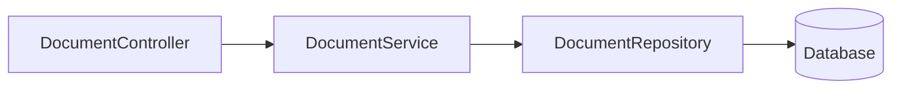

<!-- chapter: 4 | part: I | owner: writer-foundations | tag: book-m6-final | status: expanded -->
# Chapter 4: Classes, objects, records and interfaces

Chapter 3 gave you values, decisions, loops and methods. Real programs group these into larger pieces that model things: an account, a document, a tile. This chapter teaches classes and objects, records, enums, interfaces, packages and annotations, using the app's own account and document types as the examples. It also shows how objects are wired together, and tells the story of a bug that came from an object that was too trusting.

## Learning objectives

By the end of this chapter, you will be able to:

- Explain the difference between a class and an object.
- Write a class with private fields, a constructor, getters and a method that keeps a rule true.
- Write a record and say when a record is a better choice than a class.
- Write an enum for a fixed set of choices.
- Explain what an interface is and why the app depends on interfaces.
- Explain how objects receive the other objects they need.
- Read a `package` line, an `import` line and a source-folder layout, and the four access levels.
- Recognize an annotation and say what it is for.

## Prerequisites

- Chapter 3: Your first Java program

## Beginner tier: Modeling things

### 4.1 Classes and objects; fields, constructors

Suppose the app must keep track of accounts. Each account has a username, a role and a creation time. You could use three separate variables, but you would need a new set for every account. A **class** is a blueprint that groups such values together with the code that works on them. An **object** is one thing built from that blueprint. A class is "account"; the account for `pub.one` is an object of that class, and the account for `reader.one` is another object of the same class.

**Analogy.** A class is a form with blank fields, and each object is a filled-in copy. The analogy breaks down in two ways. The same form can produce as many copies as you like while the program runs, and each copy is independent: changing one does not touch the others. And an object lives in the computer's memory only while the program runs; it disappears when the program ends unless the app saves it, which is what the database is for (Chapter 9). Unlike a paper form, a class can also carry behavior: it holds methods, not just blanks.

The values an object holds are its **fields**. A **constructor** is special code that runs when you create an object with `new`, and sets up its fields. Example 4.1 is a tiny teaching class, not the project's.

**Example 4.1 — A minimal class**

```java
public class Account {
    String username;
    int failedAttempts;

    Account(String username) {
        this.username = username;
        this.failedAttempts = 0;
    }

    void recordFailure() {
        failedAttempts = failedAttempts + 1;
    }
}
```

The constructor has the class's name and no return type. `this` means "this object", so `this.username = username` copies the parameter into the field. The method `recordFailure` belongs to each account and changes that account's own field. Creating and using objects:

```java
Account a = new Account("pub.one");
Account b = new Account("reader.one");
a.recordFailure();
a.recordFailure();
System.out.println(a.failedAttempts);   // 2
System.out.println(b.failedAttempts);   // 0
```

The dot reaches into an object: `a.username` is the field, and `a.recordFailure()` calls a method. The two objects are independent: `a` has two failures and `b` still has none. To try it, put a `main` method in a class and run it as in Chapter 3.

### 4.2 Encapsulation: private, getters, and rules that stay true

If any code can change `a.failedAttempts`, then any bug anywhere can corrupt it. **Encapsulation** means hiding a class's fields and exposing only the operations you intend. You mark fields `private` (only this class can touch them) and offer **getter** methods to read them and, where change is allowed, **setter** methods to write them.

The app's real account class follows this pattern. Here it is, shortened to the parts we need.

**Listing 4.1 — `AppUser.java` (book-m6-final, simplified: imports, the fields `enabled`, `createdAt`, `mustChangePassword` and `lastSignInAt`, and the accessors of `role`, `enabled` and those fields omitted; the `// ...` lines mark the cuts)**

```java
@Entity
@Table(name = "app_user")
public class AppUser {

    @Id
    @GeneratedValue(strategy = GenerationType.IDENTITY)
    private Long id;

    @Column(nullable = false, unique = true, length = 64)
    private String username;

    @Column(name = "password_hash", nullable = false, length = 100)
    private String passwordHash;

    @Enumerated(EnumType.STRING)
    @Column(nullable = false, length = 20)
    private Role role;

    // ...

    protected AppUser() {
    }

    public AppUser(String username, String passwordHash, Role role) {
        this.username = username;
        this.passwordHash = passwordHash;
        this.role = role;
        this.createdAt = Instant.now();
    }

    public Long getId() {
        return id;
    }

    public String getUsername() {
        return username;
    }

    public String getPasswordHash() {
        return passwordHash;
    }

    public void setPasswordHash(String passwordHash) {
        this.passwordHash = passwordHash;
    }

    // ...
}
```

*Path: `src/main/java/com/example/securedocviewer/account/AppUser.java`*

Notice four things:

- Every field is `private`. Other code must go through methods.
- There is a getter for `username` but no setter. Once created, an account's username cannot be changed through this class; that is a deliberate rule, written into the code's shape. Other fields, such as `role`, do have setters (cut from the listing), because an administrator can change them.
- There is a setter for `passwordHash`, because passwords change.
- The public constructor takes the three values a new account needs and sets the creation time itself, so no caller can forget or fake it. The `protected` constructor with no parameters exists for the database library, which Chapter 14 explains. `Long` with a capital L is the object form of `long` (Chapter 5), which can be `null` before the database assigns the number.

A field with no setter and set only in the constructor is **immutable**: it never changes after creation. Immutable data is easier to reason about, because nothing can alter it behind your back. `Instant.now()` gives the current moment as a point in time, which Chapter 5 explains.

The best reason for setters instead of public fields is that a setter can do more than assign. Look at how the project's `Document` class keeps its "last updated" time honest.

**Listing 4.2 — `Document.java` (book-m6-final, simplified: imports, fields and unrelated methods omitted)**

```java
    public void touch() {
        this.updatedAt = Instant.now();
    }

    // ...

    public void setTitle(String title) {
        this.title = title;
        touch();
    }

    // ...

    public void setVisibility(Visibility visibility) {
        this.visibility = visibility;
        touch();
    }
```

*Path: `src/main/java/com/example/securedocviewer/document/Document.java`*

Every setter that changes the document also calls `touch()`, which updates `updatedAt`. No caller has to remember to do it, and no caller can forget. If `title` were a public field, someone would eventually change it directly and the "last updated" time in the library page would be wrong. This is encapsulation doing real work: the class guarantees a rule about its own data. <!-- source: Document.java at book-m6-final -->

The `Role` type of the `role` field is an enum, which we meet in Section 4.4. The `@` lines are annotations, covered in Section 4.8.

### 4.3 Records for plain data

Many types are just bundles of values that never change: a page's dimensions, a row of a table. Writing a private field, constructor and getter for each is repetitive. A **record** gives you all of that in one line. When you declare `record Point(int x, int y) { }`, Java generates the constructor, the read methods `x()` and `y()`, and sensible `equals`, `hashCode` and `toString`. `equals` decides whether two objects count as the same value; `hashCode` is a fingerprint that collections use (Chapter 5); `toString` produces readable text. Record fields are always immutable.

The app uses records everywhere data moves around. Here is one describing a rendered page.

**Listing 4.3 — `PageInfo.java` (book-m6-final)**

```java
package com.example.securedocviewer.model;

/**
 * Describes the tile grid for a single rendered page, plus the pixel
 * dimensions the frontend needs to lay tiles out on a &lt;canvas&gt;.
 */
public record PageInfo(
        int page,
        int rows,
        int cols,
        int tileSize,
        int pageWidthPx,
        int pageHeightPx
) {
}
```

*Path: `src/main/java/com/example/securedocviewer/model/PageInfo.java`*

A note on the comment: it mentions a `<canvas>`, a drawing surface in the browser. That comment dates from the first milestone, whose static page drew tiles on a canvas. The Angular viewer in the finished app instead positions plain `div` elements and paints each tile as a CSS background image (Chapter 21), so the comment is stale in the repository; the record itself is unaffected. <!-- source: editor's note on OUTLINE 21.6; requests.md -->

You create one with `new PageInfo(1, 4, 3, 512, 1275, 1650)` and read it with `info.rows()`. Note that the read method is `rows()`, not `getRows()`. Listing 3.2 in Chapter 3 used exactly this: `pageInfo.rows()` and `pageInfo.cols()`. Records also compare by value, which a plain class does not:

**Example 4.2 — Records compare by value (teaching example)**

```java
public class RecordDemo {
    record TileRef(int row, int col) { }

    public static void main(String[] args) {
        TileRef a = new TileRef(2, 1);
        TileRef b = new TileRef(2, 1);
        System.out.println(a);            // TileRef[row=2, col=1]
        System.out.println(a.equals(b));  // true
        System.out.println(a == b);       // false: two different objects
    }
}
```

`a.equals(b)` is true because the values match, even though `a == b` is false, since they are two objects. That is what you want for data such as a tile position. A record can also contain methods. The signed-URL payload adds one that joins its fields into the text that gets signed.

**Listing 4.4 — `SignedTilePayload.java` (book-m6-final, simplified: comments omitted)**

```java
public record SignedTilePayload(
        String documentId,
        int page,
        int row,
        int col,
        int tileVersion,
        String sessionBinding,
        long expiresAtEpochSeconds
) {
    public String canonicalString() {
        return documentId + "|" + page + "|" + row + "|" + col + "|" + tileVersion + "|" + sessionBinding + "|" + expiresAtEpochSeconds;
    }
}
```

*Path: `src/main/java/com/example/securedocviewer/model/SignedTilePayload.java`*

Why a record here? A signed payload must not change between the moment it is signed and the moment it is checked, and a record cannot be altered after creation. Chapter 17 explains what the signature covers.

Records can also have **static methods**, which belong to the type and not to an object. Two real examples show a common pattern: a method that builds the record from something else. First, `Viewer`, the record the app uses to mean "the signed-in user an operation is for".

**Listing 4.5 — `Viewer.java` (book-m6-final, simplified: imports omitted)**

```java
/** The signed-in user a document operation is performed for. */
public record Viewer(String username, boolean admin, boolean publisher) {

    public static Viewer of(Authentication authentication) {
        boolean admin = hasRole(authentication, "ROLE_ADMIN");
        return new Viewer(authentication.getName(), admin, admin || hasRole(authentication, "ROLE_PUBLISHER"));
    }

    private static boolean hasRole(Authentication authentication, String role) {
        return authentication.getAuthorities().stream().anyMatch(a -> role.equals(a.getAuthority()));
    }
}
```

*Path: `src/main/java/com/example/securedocviewer/document/Viewer.java`*

`Viewer.of(...)` is a **static factory method**: called on the type, not on an object, and it returns a new `Viewer`. It reads the framework's `Authentication` object once and turns it into three plain facts: a username and two booleans. Note that an admin is also treated as a publisher (`admin || ...`), so code elsewhere need only ask `publisher()`. And the private helper `hasRole` uses the `anyMatch` stream idea of Chapter 5. The second example is a record nested inside another record.

**Listing 4.6 — `AuditEvent.java` (book-m6-final, excerpt: the nested record `Actor`)**

```java
    /** Who did it and from where; attached to every event recorded during a request. */
    public record Actor(String username, String sessionHandle, String clientIp) {
        public static Actor anonymous(String clientIp) {
            return new Actor(null, null, clientIp);
        }
    }
```

*Path: `src/main/java/com/example/securedocviewer/audit/AuditEvent.java`*

An `Actor` says who did something (the username and a session handle, a short stand-in for the session's identifier that is safe to show; Chapter 16) and from where (the client address). `anonymous` builds one for a request with no signed-in user, where the first two are `null`. Naming the situation (`Actor.anonymous(ip)`) reads better than `new Actor(null, null, ip)`.

**When to choose which.** Use a record for plain data that does not change. Use a class when the object has changing state or must hide its fields, as `AppUser` does because the database library fills it in and updates it. Table 4.1 sums up the choice.

| | Class | Record |
|---|---|---|
| Fields | You declare them, usually `private` | Listed in the header, always `private final` |
| Changes after creation | Allowed, if you write setters | Never |
| `equals` and `toString` | You write them, or get identity comparison | Generated, by value |
| Typical use in the app | `AppUser`, `Document`, services | `PageInfo`, `Viewer`, `Actor`, `AuditEvent` |

*Table 4.1 — Class or record*

### 4.4 Enums for fixed choices

Some values come from a short, fixed list. An account's role is `READER`, `PUBLISHER` or `ADMIN`, and nothing else. If you stored roles as free text, a typo such as `"ADMlN"` would compile and fail silently later. An **enum** declares the complete list, and the compiler rejects anything else.

**Listing 4.7 — `Role.java` (book-m6-final)**

```java
package com.example.securedocviewer.account;

/**
 * What an account may do. Roles are cumulative in practice: every signed-in
 * user can read documents they have access to, publishers can also upload,
 * and admins can additionally manage accounts, sessions and the audit log.
 */
public enum Role {
    READER,
    PUBLISHER,
    ADMIN
}
```

*Path: `src/main/java/com/example/securedocviewer/account/Role.java`*

You write `Role.ADMIN` in code, and compare with `==`: `user.getRole() == Role.ADMIN`. Two useful methods exist on every enum: `name()` returns the value as text (`"ADMIN"`), and `values()` returns them all. The database stores the name as text, which is what the annotation `@Enumerated(EnumType.STRING)` in Listing 4.1 asks for: the `role` column holds `'ADMIN'`, not a number. Storing the name rather than the position is deliberate. If someone reorders the enum, positions change but names do not, so old rows keep their meaning.

The project has a second enum, `Visibility`, with the values `PRIVATE` and `EVERYONE`. It is the answer to "besides the owner and admins, who may open this document?". And a third, `AuditEventType`, lists the 22 kinds of event the audit trail records (`SIGN_IN`, `PAGE_VIEWED`, `ACCESS_DENIED`, and so on); a new kind of event means adding a value there, and the compiler then helps you find every `switch` that must handle it. Chapter 3's `switch` example works on exactly this kind of type. <!-- source: Visibility.java, AuditEventType.java at book-m6-final -->

## Intermediate tier: Depending on promises, and wiring objects together

A note on pacing. This tier and the next show a few real listings that use things you have not met yet: the framework Spring (Part II), tests (Chapter 18), and two Java features taught in Chapter 5, `Optional` and lambdas (small unnamed methods written with `->`). Each such spot is flagged right where it appears. Read these listings for the idea they illustrate and let the unfamiliar syntax pass; you will be able to read every line after Chapter 5, and you are welcome to come back then.

### 4.5 Interfaces and why we depend on them

An **interface** lists methods that a type promises to offer, without saying how. Code that needs those methods depends on the interface and does not care which class supplies them. Example 4.3 is a teaching sketch.

**Example 4.3 — An interface and two implementations**

```java
interface TileStore {
    byte[] load(String tileName);
}

class DiskTileStore implements TileStore {
    public byte[] load(String tileName) { /* read from disk */ return new byte[0]; }
}

class FakeTileStore implements TileStore {
    public byte[] load(String tileName) { return new byte[] {1, 2, 3}; }
}
```

Code that takes a `TileStore` works with either. A test can hand it the fake, so the test needs no real disk. That is the main reason interfaces matter in practice: they let you swap parts, and they make code testable.

The project uses interfaces heavily, often without writing the implementation itself. Look at how the app declares its access to documents.

**Listing 4.8 — `DocumentRepository.java` (book-m6-final, simplified: imports, Javadoc comments and six of the eight query methods omitted; four are cut at the `// ...` marker, one (`findVisibleTo`) before the first shown method and one (`findAllIds`) after the last)**

```java
public interface DocumentRepository extends JpaRepository<Document, String> {

    @Query("select d from Document d join fetch d.owner order by d.createdAt desc")
    List<Document> findAllWithOwner();

    // ...

    long countByOwner_Username(String username);
}
```

*Path: `src/main/java/com/example/securedocviewer/document/DocumentRepository.java`*

There is no class that implements this interface anywhere in the project. Spring, the framework the backend uses (a **framework** is a large library that calls your code, rather than the other way round; Chapter 11 explains it), builds one at startup from the method declarations. More exactly, a part of Spring called Spring Data does that. You state what you need and the framework supplies the how. Chapter 14 explains this in detail. The `<Document, String>` part is a **generic**: it says this repository handles `Document` objects whose identifier is a `String`. Chapter 5 covers generics.

The other direction also appears. Sometimes the project does write a class that fulfills an interface, and then it says so with `implements`.

**Listing 4.9 — `DatabaseUserDetailsService.java` (book-m6-final, simplified: imports omitted)**

```java
@Service
public class DatabaseUserDetailsService implements UserDetailsService {

    private final AppUserRepository repository;

    public DatabaseUserDetailsService(AppUserRepository repository) {
        this.repository = repository;
    }

    @Override
    public UserDetails loadUserByUsername(String username) {
        AppUser user = repository.findByUsername(UserAccountService.normalizeUsername(username))
                .orElseThrow(() -> new UsernameNotFoundException("Unknown user"));
        return User.withUsername(user.getUsername())
                .password(user.getPasswordHash())
                .roles(user.getRole().name())
                .disabled(!user.isEnabled())
                .build();
    }
}
```

*Path: `src/main/java/com/example/securedocviewer/security/DatabaseUserDetailsService.java`*

`UserDetailsService` is an interface from Spring Security, the library that handles sign-in (Chapter 15). It promises one method: given a username, produce the details Spring Security needs to check a password. The framework does not know where the project keeps its accounts, so it depends on the interface. This class fulfills the promise by looking the account up in the database (using the repository from Section 4.5) and translating an `AppUser` into what the framework expects. `@Override` says "this method fulfills an interface promise", and the compiler checks that it really does: if you misspell `loadUserByUsername`, the build fails instead of the app misbehaving. This is a real swap point: to keep accounts somewhere else, you would write a different class that implements the same interface, and nothing that depends on the interface would change. <!-- source: DatabaseUserDetailsService.java at book-m6-final -->

*Read now, revisit later.* The chain `.orElseThrow(() -> new UsernameNotFoundException(...))` inside the method is Chapter 5's `Optional`: read it as "find the account, or else fail with this error". The `@Service` label is explained in Chapter 11.

**We simplify here.** Interfaces have more features, such as default methods. The app does not need them, so this book does not teach them.

### 4.6 Objects that need other objects

Most real classes do not work alone. `DatabaseUserDetailsService` needs an `AppUserRepository` to find accounts. How does it get one? Not by creating it. Look at its constructor: it lists what the class needs as parameters, and stores them in `private final` fields. Whoever creates the object must supply them. This pattern is called **constructor injection**, and it is the way nearly every class in the app receives its collaborators. Here is another small example.

**Listing 4.10 — `RequestActors.java` (book-m6-final, excerpt: the fields and constructor)**

```java
/** Builds the audit {@link Actor} for the current request: user, session handle, client IP. */
@Component
public class RequestActors {

    private final SessionKeys sessionKeys;

    public RequestActors(SessionKeys sessionKeys) {
        this.sessionKeys = sessionKeys;
    }
```

*Path: `src/main/java/com/example/securedocviewer/audit/RequestActors.java`*

`RequestActors` needs a `SessionKeys` object, so it asks for one in its constructor. It never writes `new SessionKeys(...)`. In the app, the framework creates the objects, sees what each constructor asks for, and passes the right ones in; that is called **dependency injection**, and Chapter 11 explains it fully. The gain is control: because a class only *receives* its helpers, a test can hand it a different helper.

The project uses exactly that for time. A class that needs "the current time" can ask for a `Clock` in its constructor, and a test can give it a frozen one. Here is the real test for the rule that a recognized sign-in address expires after 30 days.

**Listing 4.11 — `KnownDevicesTest.java` (book-m6-final, excerpt: method `recognitionExpiresAfterThirtyDays`)**

```java
        Instant signedIn = Instant.parse("2026-01-01T00:00:00Z");
        new KnownDevices(jdbc, properties, Clock.fixed(signedIn, ZoneOffset.UTC)).remember("kd-bob", "198.51.100.30");

        KnownDevices day29 = new KnownDevices(jdbc, properties,
                Clock.fixed(signedIn.plus(KnownDevices.RETENTION).minusSeconds(60), ZoneOffset.UTC));
        KnownDevices day31 = new KnownDevices(jdbc, properties,
                Clock.fixed(signedIn.plus(KnownDevices.RETENTION).plusSeconds(60), ZoneOffset.UTC));
        assertTrue(day29.isRecognised("kd-bob", "198.51.100.30"));
        assertFalse(day31.isRecognised("kd-bob", "198.51.100.30"), "expiry must be enforced in the check itself");
```

*Path: `src/test/java/com/example/securedocviewer/security/KnownDevicesTest.java`*

Read it as a story. Create a `KnownDevices` whose clock is frozen at January 1 and remember an address. Then create two more whose clocks are frozen one minute before and one minute after the 30-day limit (`KnownDevices.RETENTION`). The first still recognizes the address, and the second does not. The test needs no waiting and no real clock, because `KnownDevices` takes its `Clock` as a constructor argument. `Clock` is technically an abstract class (a class that is meant to be extended, not created directly) rather than an interface, but the idea is identical: depend on a replaceable thing, and a test can replace it. <!-- source: KnownDevicesTest.java and KnownDevices.java at book-m6-final -->

*Read now, revisit later.* This is a test, so it uses `assertTrue` and `assertFalse` (checks that fail the test if wrong), `jdbc` and `properties` (a database helper and settings that the test prepared earlier) and `Instant`, `Clock` and `Duration` from Chapter 5's time section. You do not need to follow those names to see the point: the clock is a constructor argument, so the test can set it.

Figure 4.1 shows how three of the app's classes depend on each other, from the web layer down to the database.



*Figure 4.1 — One request's path through the classes (simplified)*

<!-- source: DocumentController.java, DocumentService.java and DocumentRepository.java at book-m6-final (each receives the next class through its constructor) -->


The controller receives the web request and asks the service to do the work; the service applies the rules and asks the repository for data; the repository talks to the database. Each arrow is a constructor parameter. Part II builds exactly this layering.

### 4.7 Packages, imports and access levels

A large program has hundreds of classes. **Packages** group them, like folders. The first line of each file declares its package, and the folder layout matches it. `PageInfo` is in `com.example.securedocviewer.model`, so its file sits in `src/main/java/com/example/securedocviewer/model/`.

Table 4.2 shows the app's packages under `com.example.securedocviewer`.

| Package | Holds |
|---|---|
| `account` | Users, roles, the account service |
| `audit` | The audit trail |
| `config` | Settings read from `application.yml` |
| `controller` | The web endpoints |
| `document` | Documents, sharing, visibility |
| `exception` | The app's own error types |
| `model` | Plain data records such as `PageInfo` |
| `security` | Sign-in, sessions, throttling |
| `service` | Tile rendering, signing, watermarking |

*Table 4.2 — The app's packages (book-m6-final)*

<!-- source: git ls-tree of src/main/java at book-m6-final -->

To use a class from another package, you **import** it: `import java.util.List;` at the top of a file lets you write `List` instead of `java.util.List`. Classes in `java.lang`, such as `String`, need no import. Packages also let two classes share a name without clashing.

The reverse-domain name `com.example` is a convention that keeps package names unique across the world. The project uses the placeholder `example.com`.

Packages also matter for **access levels**, which decide who may use a class, field or method. Table 4.3 lists the four, with examples from the project.

| Level | Written as | Who can use it | Example in the app |
|---|---|---|---|
| Public | `public` | Any code | `public class AppUser` |
| Protected | `protected` | The same package, and subclasses | `protected AppUser()` for the database library |
| Package-private | (nothing) | Only code in the same package | `final class FileOperations` in `service` |
| Private | `private` | Only the same class | the fields of `AppUser` |

*Table 4.3 — Access levels*

`FileOperations` has no `public` in front of `class`, so only other classes in the `service` package can use it. That is a design choice: the file-moving helpers are an internal detail of tile handling, and hiding them stops other packages from depending on them. Make things as private as you can, and widen access only when there is a reason.

## Advanced tier: Annotations, design and a real bug

### 4.8 Annotations: a first look

Look again at Listing 4.1. Lines that start with `@` are **annotations**: labels attached to code that tools read. `@Entity` tells the database library "this class maps to a table". `@Column(nullable = false, length = 64)` says the field maps to a column that cannot be empty and holds at most 64 characters. `@SpringBootApplication` in Listing 3.1 tells Spring where to start. `@Override` in Listing 4.9 is read by the compiler itself.

An annotation does not do anything by itself. A framework finds it, reads it, and acts. That is why the app's code can be so short: much behavior is declared with labels and carried out by libraries. Table 4.4 lists the ones you will meet most, and where each is taught.

| Annotation | Meaning | Taught in |
|---|---|---|
| `@Entity`, `@Column`, `@Id` | Map a class and its fields to a database table | Chapter 14 |
| `@RestController`, `@GetMapping`, `@PostMapping` | Turn a class and its methods into web endpoints | Chapter 12 |
| `@Component`, `@Service` | Let the framework create and inject this class | Chapter 11 |
| `@Override` | The compiler checks that this fulfills an interface or parent method | This chapter |

*Table 4.4 — Annotations you will meet*

The cost of annotations is that behavior becomes less visible. If something happens that you cannot find in the code, look for an annotation. Parts II and III return to this often.

### 4.9 A note on inheritance and composition

You have seen `extends` twice: `interface DocumentRepository extends JpaRepository<...>` and, in Chapter 5, `class ResourceNotFoundException extends RuntimeException`. **Inheritance** means a new type takes everything an existing one has and adds to it. It is useful for a small set of cases, such as your own exception types, where you genuinely mean "is a kind of". For most other cases, the project prefers **composition**: a class *has* another object and uses it, as `RequestActors` has a `SessionKeys`. Composition keeps classes independent and easier to test. The app has almost no inheritance between its own classes, and this book teaches only what you have seen here.

### 4.10 A real incident: the demoted publisher who could still manage documents

Design choices in small objects can carry security weight. Recall `Viewer` from Listing 4.5: a record of a username and two booleans, `admin` and `publisher`, built from the sign-in. The record is immutable, which means those booleans are a snapshot of what the user could do at the moment of sign-in.

**The problem.** In the first version of the ownership rules, a document's owner could manage it. During the review of the fifth pull request, the technical-manager review (an AI review agent) found that a publisher who had been demoted to reader, and who therefore no longer had the right to manage anything, could still manage the documents they owned, because ownership alone was enough.

**The fix.** Managing a document now requires both ownership and the publisher role (or being an administrator), and the rule lives in one small method, `canManage`. A later review round (the reviews of the fifth pull request happened in stages, called rounds, which Chapter 32 tells in full; this was the fourth) added a second method, `currentRoles`, whose comment states its purpose: to use the viewer's roles as they are in the database now, not as they were at sign-in. Both are shown here:

**Listing 4.12 — `DocumentService.java` (book-m6-final, excerpt: methods `currentRoles` and `canManage`)**

```java
    /** The viewer's roles as they are in the database now, not as they were at sign-in. */
    private Viewer currentRoles(Viewer viewer) {
        return users.findByUsername(viewer.username())
                .filter(AppUser::isEnabled)
                .map(user -> new Viewer(user.getUsername(), user.getRole() == Role.ADMIN,
                        user.getRole() == Role.ADMIN || user.getRole() == Role.PUBLISHER))
                .orElse(new Viewer(viewer.username(), false, false));
    }

    private static boolean canManage(Document document, Viewer viewer) {
        return viewer.admin()
                || (viewer.publisher() && document.getOwner().getUsername().equals(viewer.username()));
    }
```

*Path: `src/main/java/com/example/securedocviewer/document/DocumentService.java`*

Read `canManage`: an admin may manage anything; otherwise the viewer must be a publisher *and* the owner. Read `currentRoles`: look the user up again, keep them only if the account is still enabled, and build a fresh `Viewer` from their present role; if the account is gone or disabled, return a `Viewer` with no rights at all. Every step is one you now know: an `Optional` chain (Chapter 5), an enum comparison, a record constructor, a static method.

*Read now, revisit later.* Two pieces of syntax here belong to Chapter 5: `AppUser::isEnabled` is a short way to write "call `isEnabled` on the user" (a *method reference*), and the chain `.filter(...).map(...).orElse(...)` works on an `Optional`, a box that may hold a user or nothing. Read the chain as: look the user up; keep them only if the account is enabled; build a `Viewer` from their current role; if there is no such user, use a `Viewer` with no rights. The lesson does not depend on the syntax.

**The lesson.** An immutable record is safe against being changed, but it can still be *stale*. When a decision depends on facts that can change, such as a role, re-check them at the moment of the decision. The same principle runs through the app: access to tiles is re-checked on every tile request, so unsharing a document cuts off pages that are already open. <!-- source: dossier bugs-and-findings.md D2 (TM2-3, commit 2d82253); git log -S currentRoles (commit 6cf17fa, round 4); DocumentService.java at book-m6-final -->

### 4.11 Common mistakes

**Forgetting `new`.** `Account a = Account("pub.one");` is an error; write `new Account("pub.one")`.

**`NullPointerException` on a field.** A field that you never set is `null` for objects (and `0` or `false` for numbers). Set it in the constructor.

**Calling an object's method on the class name.** `Account.recordFailure()` fails because the method belongs to an object. Call it on one: `a.recordFailure()`. Only `static` methods are called on the class, like `Viewer.of(...)`.

**Public fields.** They let any code break your rules, as Section 4.2 showed with `touch()`. Make fields `private`.

**Using `==` to compare objects.** For text and other objects, use `.equals`. Records already compare by value; ordinary classes compare by identity unless you write `equals`.

**A record with a setter.** Records have no setters. If you need change, you want a class, or you build a new record with the new values.

**Mismatched package and folder.** The compiler or build tool complains that a class is not found or in the wrong place. The `package` line must match the folder path under `src/main/java`.

**Missing import.** "cannot find symbol" on a class name usually means an `import` line is missing. Your editor can add it for you.

**Getter names for records.** A record's read method is `rows()`, not `getRows()`. Ordinary classes such as `AppUser` follow the `getX()` convention.

## In this project

- `account/AppUser.java`, `document/Document.java`: classes with private fields and rule-keeping setters.
- `model/PageInfo.java`, `model/SignedTilePayload.java`, `document/DocumentSummary.java`, `document/Viewer.java`, `audit/AuditEvent.java`: records.
- `account/Role.java`, `document/Visibility.java`, `audit/AuditEventType.java`: enums.
- `document/DocumentRepository.java`, `account/AppUserRepository.java`: interfaces implemented by Spring; `security/DatabaseUserDetailsService.java`: a class that implements an interface.
- `audit/RequestActors.java`, `security/KnownDevices.java`: constructor injection, and a swappable clock.
- `document/DocumentService.java`: `canManage` and `currentRoles`.

## Try it

### Exercise 4.1 ★ Class or record?

For each of these say whether you would write a class or a record, and why: a tile's `row` and `col`; an account whose password can change; the result of a search (a title and a page count).

*Solution:* Appendix C, Exercise 4.1.

### Exercise 4.2 ★ Write a record

Write a record `TileRef(int row, int col)`, create one for row 2, column 1, and print it. What does `toString` show? Run it with `java TileRefDemo.java`.

*Solution:* Appendix C, Exercise 4.2.

### Exercise 4.3 ★★ Add an enum

After Chapter 7 shows you how to get the project, open `Visibility.java`. Then write your own enum `TileStatus` with three values of your choice for a tile that is queued, ready or failed. Use it in a `main` and compare a value with `==`. Work in a scratch folder, not in the repository.

*Solution:* Appendix C, Exercise 4.3.

### Exercise 4.4 ★★ A class that keeps a rule

Write a class `Counter` with a private `int count`, a method `increment()` that adds one but never goes above a maximum given to the constructor, and a getter. Show that a caller cannot push the count past the maximum.

*Solution:* Appendix C, Exercise 4.4.

### Exercise 4.5 ★★ Swap a part

Using Example 4.3 as a guide, write a method `describe(TileStore store)` that prints how many bytes `store.load("tile-0_0.png")` returns. Call it once with `DiskTileStore` and once with `FakeTileStore`. Explain what would have to change in `describe` to support a third store.

*Solution:* Appendix C, Exercise 4.5.

### Exercise 4.6 ★★★ Model a request

Design (on paper or in code) the small types for one audit event: an enum for the kind of event, a record for who did it, and a record for what it was about, following Listing 4.6 and `AuditEventType`. Add a static factory method for an event with no subject. Explain why you chose a record for each, and which fields you would allow to be `null`.

*Solution:* Appendix C, Exercise 4.6.

## Summary

- A class is a blueprint and an object is one instance; fields hold state and constructors set it up.
- Private fields with getters and setters hide the details, and a setter can keep a rule true; immutable data is easier to trust.
- Records are one-line immutable data classes that compare by value; enums are a closed list of values.
- Interfaces are promises; depending on them lets you swap and test parts, and constructor injection is how objects receive their collaborators.
- Packages organize code, imports bring names in, and four access levels decide who can use what.
- Annotations are labels that frameworks act on.
- An immutable snapshot can still be stale, so re-check facts that can change at the moment of the decision.

## Further reading

- *The Java Tutorials*, "Classes and Objects." https://docs.oracle.com/javase/tutorial/java/javaOO/index.html
- *The Java Tutorials*, "Interfaces and Inheritance." https://docs.oracle.com/javase/tutorial/java/IandI/index.html
- *The Java Language Specification*, Java SE 25 edition, "Records" and "Enum Classes." https://docs.oracle.com/javase/specs/
