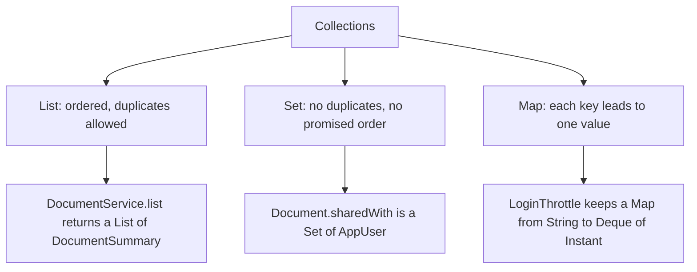
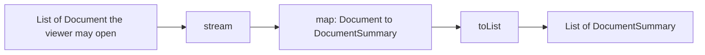
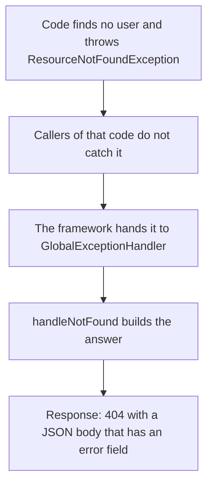

<!-- chapter: 5 | part: I | owner: writer-foundations | tag: book-m6-final | status: expanded -->
# Chapter 5: Collections, generics, lambdas, and exceptions

Programs rarely handle one value at a time. The app lists many documents, tracks many failed sign-ins, and stores many tiles. This chapter teaches how Java holds groups of values, how to process them concisely, and how to signal and handle failure. It finishes with time, which the app treats with unusual care, and with the few things that go wrong when many requests touch the same data at once.

## Learning objectives

By the end of this chapter, you will be able to:

- Choose between a list, a set, and a map, and loop over each.
- Read a generic type such as `Map<String, Deque<Instant>>`.
- Read a lambda and a short stream pipeline, and write a simple one.
- Explain why `Optional` exists and use `orElseThrow`.
- Throw, catch, and define an exception, and explain what `finally` is for.
- Explain what try-with-resources does.
- Explain why the app stores times in UTC, and why a shared map needs care.
- Diagnose the common collection and exception errors.

## Prerequisites

- Chapter 4: Classes, objects, records, and interfaces

## Beginner tier: Groups of values

### 5.1 Lists, sets and maps

A **collection** is an object that holds many values. Three kinds cover almost everything in this app.

- A **list** keeps items in order and allows duplicates. Example: the documents on a library page, newest first.
- A **set** keeps each item at most once and does not promise any order. Example: the users a document is shared with; sharing twice with the same user changes nothing.
- A **map** connects **keys** to **values**, like a dictionary. Each key appears at most once. (Unlike a printed dictionary, a map has no alphabetical order, and you can change its entries at any time.) Example: a username mapped to that user's recent failed sign-ins.

Figure 5.1 puts the three collections side by side, each with the place in the app that uses it.



*Figure 5.1 — List, set and map, with the code that uses each*

*Text description:* A tree read top to bottom. A root box labeled Collections has three children, list, set and map, each with a one-line rule. Beneath each child is one real example from the app: a list of document summaries, a set of users a document is shared with, and a map from a key to a queue of timestamps.

<!-- source: DocumentService.java, Document.java, LoginThrottle.java at book-m6-final -->

The top row is the idea; the bottom row is the real code from `book-m6-final`. Ask one question to choose: do I need order (list), uniqueness (set), or lookup by a name (map)?

Example 5.1 shows all three, and the way to run it. (`var` lets the compiler work out the type from the right-hand side.)

**Example 5.1 — The three collections**

```java
import java.util.*;

public class Collections101 {
    public static void main(String[] args) {
        var pages = new ArrayList<String>();      // list
        pages.add("cover");
        pages.add("contents");
        System.out.println(pages.get(0));         // cover (counting starts at 0)

        var sharedWith = new HashSet<String>();   // set
        sharedWith.add("reader.one");
        sharedWith.add("reader.one");             // ignored: already there
        System.out.println(sharedWith.size());    // 1

        var failures = new HashMap<String, Integer>();   // map
        failures.put("pub.one", 2);
        System.out.println(failures.get("pub.one"));     // 2
    }
}
```

Save it as `Collections101.java` and run it with `java Collections101.java` (Chapter 3). Line by line: `import java.util.*;` brings in the collection classes. `new ArrayList<String>()` creates an empty list that holds text. `add` appends, `get(0)` reads the first item (indexes start at zero, as in Chapter 3), and `size()` counts. For the set, adding the same text twice leaves one item. For the map, `put(key, value)` stores and `get(key)` looks up.

The real app uses each. A document keeps its shares as `Set<AppUser> sharedWith = new HashSet<>()`, and the sign-in throttle keeps a map from a key to a queue of timestamps. <!-- source: Document.java line 68 and LoginThrottle.java line 61 at book-m6-final -->

The words `ArrayList`, `HashSet` and `HashMap` name particular implementations. What matters to a beginner is the kind of collection, and the interface types `List`, `Set` and `Map` (Chapter 4's interfaces) that you use when declaring a variable. Code that declares `List<String>` works with any list, which is the point of an interface.

### 5.2 Generics in plain words

What are the angle brackets in `ArrayList<String>`? They are a generic parameter: they say what type of thing the collection holds. A `List<String>` holds only text, and the compiler refuses to let you add a number. Without generics you would find out at runtime, with a crash, when the wrong kind of value came out of the list.

Read a generic type from the outside in. The throttle's field is `Map<String, Deque<Instant>>`:

- a map,
- whose keys are `String`,
- and whose values are `Deque<Instant>`, a **deque** (double-ended queue: you can add and remove at both ends) of `Instant` values, which are moments in time (Section 5.8).

That is: for each key, a queue of when the failures happened. Reading types like this is a skill you will use all through Parts II and III.

Two details save confusion. First, when you write `new HashMap<>()` the empty angle brackets, called the **diamond**, tell the compiler to copy the types from the left side, so you write them once. Second, generic collections hold objects, not the plain types of Chapter 3. The map in Example 5.1 uses `Integer`, the object form of `int`, and Java converts between them automatically (**boxing**). You write `Map<String, Integer>`, never `Map<String, int>`.

### 5.3 Looping over a collection

To visit every item, use the **for-each loop**. It reads "for each `p` in `pages`". You do not manage an index, so you cannot get it wrong.

**Example 5.2 — Walking a list and a map**

```java
import java.util.*;

public class Walk {
    public static void main(String[] args) {
        List<String> pages = List.of("cover", "contents", "chapter one");
        for (String p : pages) {
            System.out.println(p);
        }
        System.out.println(pages.contains("cover"));     // true

        Map<String, Integer> failures = new HashMap<>();
        failures.put("pub.one", 2);
        failures.put("reader.one", 0);
        for (Map.Entry<String, Integer> e : failures.entrySet()) {
            System.out.println(e.getKey() + " -> " + e.getValue());
        }
        int n = failures.getOrDefault("outsider.one", 0);
        System.out.println(n);                            // 0
    }
}
```

`List.of(...)` builds a list that cannot be changed afterward (an immutable list, as in Chapter 4); calling `add` on it throws an exception. A map is not directly loopable, so you loop over its **entries**, each holding a key and a value. `getOrDefault` answers a missing key with a fallback instead of `null`, which avoids a whole class of errors that Section 5.5 discusses. The order of a `HashMap`'s entries is not something to rely on: print it twice on two machines and the order may differ.

## Intermediate tier: Processing and failing

*On a first read you can skim this tier; Chapters 13 and 14 use these ideas again.*

### 5.4 Lambdas and streams

A **lambda** is a small unnamed method you can pass around. `u -> u.getUsername()` means "given `u`, produce `u.getUsername()`". A **stream** is a pipeline that processes a collection step by step: filter some items, transform others, collect a result. Build it up one step at a time.

**Example 5.3 — Filter and transform**

```java
import java.util.List;

public class StreamDemo {
    public static void main(String[] args) {
        List<String> names = List.of("pub.one", "reader.one", "outsider.one");
        List<String> shortNames = names.stream()
                .filter(n -> n.length() < 10)
                .map(n -> n.toUpperCase())
                .toList();
        System.out.println(shortNames);   // [PUB.ONE]
    }
}
```

`names.stream()` starts the pipeline. `filter` keeps items for which the lambda is true: only `pub.one` is shorter than 10 characters. `map` transforms each remaining item, here to uppercase. `toList()` ends the pipeline and returns a new list. The original list is untouched, which is a useful property: a pipeline describes a new result and never edits its input.

Two more pieces of vocabulary appear in the app. A **method reference** is a short form of a lambda that only calls one method: `AppUser::getUsername` means the same as `u -> u.getUsername()`. And `anyMatch` asks "is at least one item true for this?", stopping at the first yes. The app's permission check uses it.

**Listing 5.1 — `DocumentService.java` (book-m6-final, excerpt: method `canView`)**

```java
    private static boolean canView(Document document, Viewer viewer) {
        return viewer.admin()
                || document.getVisibility() == Visibility.EVERYONE
                || document.getOwner().getUsername().equals(viewer.username())
                || document.getSharedWith().stream().anyMatch(u -> u.getUsername().equals(viewer.username()));
    }
```

*Path: `src/main/java/com/example/securedocviewer/document/DocumentService.java`*

Read it as a sentence. A viewer may view a document if they are an admin, or the document's visibility is `EVERYONE`, or they are the owner, or some user in the document's shares has their username. The `||` operator (Chapter 3) stops at the first true part, so the cheap checks run before the search through the shares. Here is a longer pipeline that turns stored documents into rows for the library page.

**Listing 5.2 — `DocumentService.java` (book-m6-final, excerpt: method `list`)**

```java
    public List<DocumentSummary> list(Viewer viewer) {
        return tx.execute(status -> {
            List<Document> visible = viewer.admin()
                    ? documents.findAllWithOwner()
                    : documents.findVisibleTo(viewer.username(), Visibility.EVERYONE);
            return visible.stream().map(d -> summary(d, viewer)).toList();
        });
    }
```

*Path: `src/main/java/com/example/securedocviewer/document/DocumentService.java`*

Three things to notice. The `? :` is a compact `if`: administrators get every document, everyone else only those visible to them. `visible.stream().map(d -> summary(d, viewer)).toList()` converts each `Document` to a `DocumentSummary`. And `status -> { ... }` is a lambda handed to `tx.execute`, which runs it inside a database transaction (Chapter 9 and Chapter 14). We simplify here: streams have many more operations, but the app needs mostly `map`, `filter`, `anyMatch`, and `toList`.

Figure 5.2 shows the pipeline inside `list` as a picture: data flows left to right, and each step produces a new value without changing the one before it.



*Figure 5.2 — The stream pipeline in DocumentService.list*

*Text description:* Five boxes in a row, read left to right. A list of documents the viewer may open goes through `stream`, then a step that converts each document to a summary, then `toList`, and ends as a list of summaries. Notice that the starting list is never changed; each step produces something new.

<!-- source: DocumentService.list at book-m6-final (Listing 5.2) -->

Read it against Listing 5.2: `visible.stream().map(d -> summary(d, viewer)).toList()` is these three boxes in a row.

#### Why streams and not loops?

Everything a stream does you could write with a for-each loop and a temporary list. The stream version says *what* you want, not *how* to build it, and that reads faster once you know the vocabulary. It is not always better. For a loop with several exits or lots of changing state, a plain loop is clearer, and the project uses both (Listing 3.2's nested loop is a good example of a loop that would be worse as a stream).

### 5.5 Optional and the trouble with null

Java has a special value, `null`, meaning "no object here." Calling a method on `null` crashes with a `NullPointerException`, so forgetting to check is a common bug. **Optional** is a box that is either empty or holds one value. A method that returns `Optional<AppUser>` tells the caller "there may be no user; decide what to do", and the compiler makes sure the caller sees that.

The user repository declares exactly that, and callers decide.

**Listing 5.3 — `AppUserRepository.java` (book-m6-final, excerpt)**

```java
    Optional<AppUser> findByUsername(String username);
```

*Path: `src/main/java/com/example/securedocviewer/account/AppUserRepository.java`*

**Listing 5.4 — `UserAccountService.java` (book-m6-final, excerpt: method `require`)**

```java
    private AppUser require(String rawUsername) {
        String username = normalizeUsername(rawUsername);
        return repository.findByUsername(username)
                .orElseThrow(() -> new ResourceNotFoundException("No such user: " + username));
    }
```

*Path: `src/main/java/com/example/securedocviewer/account/UserAccountService.java`*

`orElseThrow` means: give me the value, or if the box is empty, throw this exception. The `() -> new ...` lambda builds the exception only when needed. Example 5.4 is a small program you can run to see two common ways of opening the box, and the way of making one.

**Example 5.4 — Opening an Optional**

```java
import java.util.Map;
import java.util.Optional;

public class Opt {
    static Optional<String> roleOf(Map<String, String> roles, String user) {
        return Optional.ofNullable(roles.get(user));
    }

    public static void main(String[] args) {
        Map<String, String> roles = Map.of("pub.one", "PUBLISHER");
        System.out.println(roleOf(roles, "pub.one").orElse("none"));      // PUBLISHER
        System.out.println(roleOf(roles, "nobody").orElse("none"));       // none
        try {
            roleOf(roles, "nobody")
                    .orElseThrow(() -> new IllegalStateException("No such user: nobody"));
        } catch (IllegalStateException e) {
            System.out.println(e.getMessage());                            // No such user: nobody
        }
    }
}
```

`Optional.ofNullable` wraps a value that might be `null` (a map's `get` returns `null` for a missing key). `orElse` supplies a fallback. `orElseThrow` turns "nothing" into an error, which is what you want when the caller cannot continue without the value.

### 5.6 Exceptions: throwing, catching, custom types

An exception is an object that represents a failure. When code throws one, normal execution stops and the exception travels up the chain of callers (Chapter 3's stack trace) until something **catches** it. If nothing does, the program or the request ends with the error.

**Example 5.5 — Catching**

```java
public class CatchDemo {
    static int tileCount(int lengthPx, int tileSize) {
        if (lengthPx <= 0 || tileSize <= 0) {
            throw new IllegalArgumentException("lengthPx and tileSize must both be positive");
        }
        return (lengthPx + tileSize - 1) / tileSize;
    }

    public static void main(String[] args) {
        try {
            int cols = tileCount(0, 512);
            System.out.println(cols);
        } catch (IllegalArgumentException e) {
            System.out.println("Bad input: " + e.getMessage());
        }
    }
}
```

The method is a copy of the app's `TileGrid.tileCount` from Chapter 3, so the example stands alone. The `println(cols)` line never runs: the exception jumps straight to the `catch` block.

Add a third part when something must happen whether or not an error occurred. The **finally** block always runs, on success and on failure alike.

**Example 5.6 — try, catch, and finally**

```java
public class Finally {
    static int parse(String text) {
        try {
            return Integer.parseInt(text);
        } catch (NumberFormatException e) {
            return -1;
        } finally {
            System.out.println("parsed " + text);
        }
    }

    public static void main(String[] args) {
        System.out.println(parse("12"));   // parsed 12, then 12
        System.out.println(parse("x"));    // parsed x, then -1
    }
}
```

Java sorts exceptions into a family tree. Those that extend `RuntimeException` are **unchecked exceptions**: the compiler does not force you to catch them. `IllegalArgumentException` and `NumberFormatException` are unchecked. Others, such as `IOException` (which file operations throw), are **checked exceptions**: a method that can throw one must either catch it or declare `throws IOException`, which you will see in `DocumentController.upload` in Listing 5.6. The app defines its own exceptions as unchecked, so business code can throw them without cluttering every method signature.

The app defines its own exception types so that each failure has a meaning. The smallest is one line of substance.

**Listing 5.5 — `ResourceNotFoundException.java` (book-m6-final)**

```java
package com.example.securedocviewer.exception;

/** Mapped to 404. */
public class ResourceNotFoundException extends RuntimeException {
    public ResourceNotFoundException(String message) {
        super(message);
    }
}
```

*Path: `src/main/java/com/example/securedocviewer/exception/ResourceNotFoundException.java`*

`extends RuntimeException` means "is a kind of `RuntimeException`" (inheritance: the new class gets everything the old one has). `super(message)` passes the message to it. The comment says where it ends up: a single class, `GlobalExceptionHandler`, catches these and turns each into an HTTP status such as `404 Not Found`. Chapter 8 taught status codes and Chapter 13 shows the handler. The design choice is that business code throws a meaningful exception and one central place decides what the user sees. The project has eleven such types, one for each kind of refusal: not found, forbidden, bad request, too many requests, and so on. <!-- source: exception/ folder and GlobalExceptionHandler.java at book-m6-final -->

Figure 5.3 follows one exception from where it is thrown to what the user sees.



*Figure 5.3 — From a thrown exception to a 404 response*

*Text description:* Five boxes in a column, read top to bottom. Code that finds no user throws an exception, the callers of that code do not catch it, the framework hands it to `GlobalExceptionHandler`, `handleNotFound` builds the answer, and the response is a 404 with a JSON body containing an `error` field.

<!-- source: UserAccountService.java, ResourceNotFoundException.java, GlobalExceptionHandler.java at book-m6-final -->

The business code never mentions HTTP. It throws a meaningful exception, and one central class turns it into a status code (Chapter 13 shows the class in full).

A related security rule shows in `ForbiddenException`'s comment: resources a user may not see at all are reported as 404, not 403, "so their existence isn't revealed." <!-- source: ForbiddenException.java at book-m6-final -->

### 5.7 try-with-resources and files

Files, network connections, and database connections must be **closed** after use, or the program leaks them until it runs out. **Try-with-resources** closes them automatically, even if an error happens.

**Listing 5.6 — `DocumentController.java` (book-m6-final, excerpt: method `upload`)**

```java
        try (var in = file.getInputStream()) {
            return documents.upload(title, file.getOriginalFilename(), in, visibility,
                    Viewer.of(authentication), actors.of(request, authentication));
        }
```

*Path: `src/main/java/com/example/securedocviewer/controller/DocumentController.java`*

The resource in parentheses, the uploaded file's stream of bytes, is closed when the block ends, whether it ends normally or by an exception. Without this, one failed upload could leave a file open until the server restarted. For files on disk Java offers `Path` (a file address) and `Files` (operations on it). `FileOperations.java` uses `Files.move` to rename a folder of tiles in one step, and retries when Windows briefly locks a file. Chapter 17 covers files in the app.

### 5.8 Time: Instant, UTC, and why the app uses it

An **Instant** is a single point on the timeline, independent of time zones. **UTC** (Coordinated Universal Time) is the world's reference time, with no daylight-saving changes. Ask for the current one with `Instant.now()`. A local time such as "10:30 in Kolkata" names different instants depending on the zone, but an instant is the same everywhere.

**Example 5.7 — Instants and seconds**

```java
import java.time.Duration;
import java.time.Instant;

public class Clock101 {
    public static void main(String[] args) {
        Instant issued = Instant.parse("2026-09-19T00:00:00Z");
        System.out.println(issued.getEpochSecond());          // 1789776000
        Instant expires = issued.plus(Duration.ofSeconds(120));
        System.out.println(expires);                           // 2026-09-19T00:02:00Z
        System.out.println(expires.isBefore(issued));          // false
    }
}
```

`Instant.parse` reads a timestamp; the trailing `Z` means UTC. `getEpochSecond()` gives the **epoch seconds**: the number of seconds since midnight UTC on January 1, 1970, a plain number, which is how the app stores a token's expiry (`expiresAtEpochSeconds` in Listing 4.4). `Duration` is a length of time, and `plus` moves an instant forward. The app's signed tile URLs live 120 seconds (Chapter 1), so this example computes exactly such an expiry.

The app also stores every database timestamp as UTC. Why? A server in a Docker container (Chapter 10) runs in UTC, while a developer's laptop may run in local time. If they disagreed about what "9:00" means, the same stored value would be read as different moments. Two settings in `application.yml` fix that: `connectionTimeZone=UTC` in the database connection address, and `hibernate.jdbc.time_zone: UTC` for Hibernate, the library that moves Java objects in and out of the database (Chapter 14). Watermarks also show a UTC timestamp for the same reason. <!-- source: application.yml comment at book-m6-final -->

## Advanced tier: When many requests share data

This tier is a first look at ideas that professional programmers spend years mastering: several requests running at once, and what an error handler should tell a user. It is fine to read it quickly for the main ideas, or to skip it and return after Part II, when the app's web layer makes these problems concrete. Nothing in Chapters 6 to 10 depends on it, except the plain facts that the app stores time in UTC and that error messages must not leak internals.

### 5.9 Collections that many requests share

A web server handles many requests at the same time, each on its own **thread**: a path of execution inside the program. Code is **thread-safe** if it stays correct when several threads use it at once. An **atomic** step is one that cannot be interrupted halfway: it happens completely or not at all, and no other thread can see it half done. Two threads can touch the same collection in the same instant, and an ordinary `HashMap` or `ArrayDeque` breaks if they do, sometimes corrupting its contents without any error message.

Java offers collections designed for this. `ConcurrentHashMap` is a map that many threads can use safely. The app's sign-in throttle keeps one of them, and inside it a queue of failure times for each key. The code that adds and expires those times shows both tools: the safe map, and a **synchronized** block, a Java feature that lets only one thread at a time change one queue.

**Listing 5.7 — `LoginThrottle.java` (book-m6-final, excerpt: methods `append` and `prune`)**

```java
    private void append(String key, Instant at) {
        Deque<Instant> attempts = failures.computeIfAbsent(key, k -> new ArrayDeque<>());
        synchronized (attempts) {
            attempts.addLast(at);
        }
    }

    private static void prune(Deque<Instant> attempts, Instant cutoff) {
        while (!attempts.isEmpty() && attempts.peekFirst().isBefore(cutoff)) {
            attempts.pollFirst();
        }
    }
```

*Path: `src/main/java/com/example/securedocviewer/security/LoginThrottle.java`*

`computeIfAbsent(key, ...)` means "return the queue for this key, creating an empty one first if there is none," as one safe step. `synchronized (attempts)` makes other threads wait if they want the same queue. (In the real class, `prune` is only ever called from inside another `synchronized (attempts)` block, in the method `lockedFor`, so it is protected there too.) In `prune`, the queue holds failure times in order, oldest first. So `peekFirst` looks at the oldest, and `pollFirst` removes it while it is older than the cutoff. What is left is exactly the failures inside the time window. You can try the same idea in a few lines.

**Example 5.8 — A sliding window of failures**

```java
import java.time.Duration;
import java.time.Instant;
import java.util.ArrayDeque;
import java.util.Deque;

public class Window {
    public static void main(String[] args) {
        Deque<Instant> failures = new ArrayDeque<>();
        Instant now = Instant.parse("2026-01-01T10:00:00Z");
        failures.addLast(now.minusSeconds(1000));
        failures.addLast(now.minusSeconds(100));
        failures.addLast(now.minusSeconds(10));

        Instant cutoff = now.minus(Duration.ofMinutes(15));   // 900 seconds ago
        while (!failures.isEmpty() && failures.peekFirst().isBefore(cutoff)) {
            failures.pollFirst();
        }
        System.out.println(failures.size());                   // 2
    }
}
```

The failure 1,000 seconds ago is older than the 900-second window, so it is dropped; two remain. The app's window is 15 minutes, and its limits are five failures per account and address, 20 per address and 20 per account from unrecognized devices. <!-- source: LoginThrottle.java constants at book-m6-final; dossier DOSSIER.md numbers -->

#### A real incident: nine simultaneous wrong passwords

Care with shared data was not theoretical. In the last review rounds, the technical-manager reviewer (an AI review agent) probed the sign-in with nine wrong passwords sent at the same moment for one account from one address, against a limit of five. All nine were answered as "wrong password" (401), and only the next single attempt was refused (429). The cause was that the code checked the limit first, then verified the password (which takes about 100 milliseconds), then recorded the failure, with nothing tying the three steps together, so many requests slipped through in the gap. The fix reserved the attempt atomically before checking the password: count first, give the count back on success. With the fix exactly five got through. The lesson generalizes: a check and the update it depends on must happen as one step, or concurrent requests will pass the check together. <!-- source: dossier bugs-and-findings.md G1; commit 708fd8c -->

### 5.10 A real incident with time: the audit rows from the future

Time bugs are the same kind of problem seen through a clock. Late in development, the audit log showed events with future times. The cause was a mismatch between two backends that shared one database. The developer's backend ran in the Asia/Kolkata time zone and wrote local time. The Docker backend wrote UTC. So the two sets of rows disagreed by five and a half hours. The product-owner reviewer (also an AI review agent) found it. The fix pinned the database connection and Hibernate to UTC and made the admin audit view show UTC, to match the watermark and the CSV export (CSV, comma-separated values, is a plain-text table format that spreadsheets open). A test now stores timestamps and checks them against a MySQL server set to a different time zone. The lesson: store instants in one zone and convert only when showing them to a person. <!-- source: dossier bugs-and-findings.md C6; commit 65f2530 -->

### 5.11 Exceptions at the edge: one more incident

Where exceptions end up matters as much as where they start. Here is the handler of last resort in the app.

**Listing 5.8 — `GlobalExceptionHandler.java` (book-m6-final, excerpt: method `handleUnexpected`)**

```java
    /** Last resort: never leak internals, but make the failure traceable in the log. */
    @ExceptionHandler(Exception.class)
    public ResponseEntity<Map<String, String>> handleUnexpected(Exception e) {
        String reference = UUID.randomUUID().toString().substring(0, 8);
        log.error("Unhandled error, reference {}", reference, e);
        return error(HttpStatus.INTERNAL_SERVER_ERROR,
                "Something went wrong on our side. Reference: " + reference + ".");
    }
```

*Path: `src/main/java/com/example/securedocviewer/controller/GlobalExceptionHandler.java`*

`@ExceptionHandler(Exception.class)` says "catch any exception nobody else handled." (`ResponseEntity` is the framework's object for a whole web response, a status plus a body, which Chapter 8 teaches; for now read the method as "build a 500 answer.") The method makes a short random reference. It writes the full exception to the log, with that reference. The log is the server's running record of what happened, a file or stream that developers read. Finally, the method returns a message to the user that contains only the reference. The user never sees a stack trace, file paths or SQL, which would help an attacker. Yet if the user reports the reference, a developer can find the exact log entry.

This handler earned its place. Before a fix, creating a user with a 100-character password returned a plain 500 with a reference. The validation allowed passwords of 12 to 128 characters, but the password hashing (BCrypt, Chapter 15) rejects more than 72 **bytes**, and a character can be more than one byte: 30 emoji can exceed 72 bytes. The fix checked the UTF-8 byte length and added a test. The lesson from the reviewer's note: characters are not bytes. And the handler did its job even then, by turning a crash into a traceable reference. <!-- source: dossier bugs-and-findings.md G2; commit 708fd8c -->

### 5.12 Common mistakes

**`NullPointerException`.** You called a method on a value that was `null`. Read the stack trace's first line for the exact line, then ask where the value should have come from. Prefer methods that return `Optional` or a default (`getOrDefault`).

**`UnsupportedOperationException` when you call `add`.** The list came from `List.of(...)`, `Map.of(...)` or `.toList()`, which are immutable. Copy it into a new `ArrayList` if you need to change it.

**`ConcurrentModificationException`.** You added or removed items from a collection while a for-each loop was walking it. Collect the changes and apply them after the loop, or use `removeIf`.

**Comparing text with `==`.** It compares whether two variables refer to the same object, not the same characters. Use `.equals` (Chapter 3).

**Catching too much.** `catch (Exception e)` at the wrong place hides bugs. Catch the specific exceptions you can handle, and let others travel to the central handler.

**Swallowing an exception.** An empty `catch` block hides a failure completely. At least log it, or rethrow.

**Forgetting to close a resource.** Use try-with-resources whenever you open a stream, connection or file.

## In this project

- `document/Document.java`, `security/LoginThrottle.java`: sets, maps and deques.
- `document/DocumentService.java`: streams, lambdas, `anyMatch` and `orElseThrow`.
- `exception/`: eleven custom exception types.
- `controller/GlobalExceptionHandler.java`: one place that turns exceptions into responses.
- `service/FileOperations.java`: file moves with retries.
- `service/SignedUrlService.java`: expiry as epoch seconds.

## Try it

### Exercise 5.1 ★ Pick the collection

For each, choose list, set or map: the pages of a document in order; the usernames allowed to open a document; each username with its role.

*Solution:* Appendix C, Exercise 5.1.

### Exercise 5.2 ★ Stream it

Given `List.of(1275, 1650, 512, 300)` of pixel lengths, write a stream that keeps the values above 512 and prints how many tiles each needs, using the ceiling formula from Chapter 3.

*Solution:* Appendix C, Exercise 5.2.

### Exercise 5.3 ★★ Throw and catch

Write a method `tileCount` that throws `IllegalArgumentException` on a non-positive input, and a `main` that catches it and prints the message. Then define your own exception `PageOutOfRange` and throw it instead.

*Solution:* Appendix C, Exercise 5.3.

### Exercise 5.4 ★★ Look up a user

Write a method `findRole(Map<String, String> roles, String username)` that returns `Optional<String>`. In `main`, print the role for a known user with `orElse`, and for an unknown user throw `IllegalStateException` with `orElseThrow`. Catch it and print the message.

*Solution:* Appendix C, Exercise 5.4.

### Exercise 5.5 ★★★ Build a small throttle

Write a class `MiniThrottle` with a method `boolean allow(String user, Instant now)` that allows at most three calls per user in any 60-second window. Keep a `Map<String, Deque<Instant>>`, prune old entries as in Example 5.8, and test it with instants you choose. Then explain which line would need `synchronized` if many threads called `allow` at once.

*Solution:* Appendix C, Exercise 5.5.

## Summary

- Lists keep order, sets keep uniqueness, maps connect keys to values; generics say what they hold, and for-each loops walk them.
- Lambdas and streams process collections in short pipelines; method references and `anyMatch` shorten common cases.
- `Optional` makes "maybe nothing" explicit; `orElseThrow` turns nothing into an error.
- Custom exceptions give failures meaning, and one central handler decides what users see, without leaking internals.
- Try-with-resources closes what you open; `finally` always runs.
- The app stores times as UTC instants, and shared collections need thread-safe types and atomic check-and-update steps.

## Further reading

- *The Java Tutorials*, "Collections." https://docs.oracle.com/javase/tutorial/collections/index.html
- *The Java Tutorials*, "Exceptions." https://docs.oracle.com/javase/tutorial/essential/exceptions/index.html
- *The Java Tutorials*, "Date Time." https://docs.oracle.com/javase/tutorial/datetime/index.html
- *Java Platform SE 25 API*, `java.time.Instant`. https://docs.oracle.com/en/java/javase/25/docs/api/
