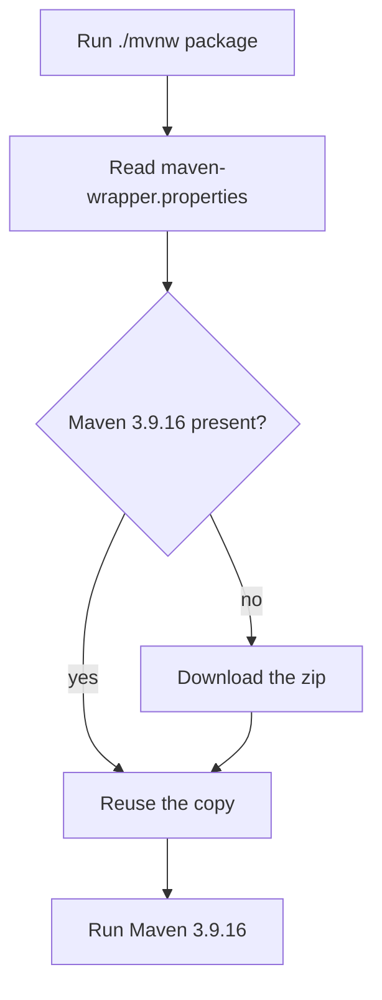
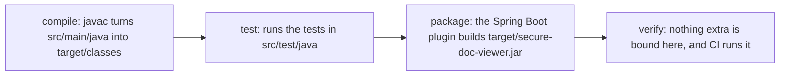

<!-- chapter: 6 | part: I | owner: writer-foundations | tag: book-m6-final | status: expanded -->
# Chapter 6: Maven and the shape of a project

Chapter 3 compiled one file by hand. The Secure Document Viewer has 84 Java files (tests included) and depends on many libraries written by other people. Nobody compiles that by hand. This chapter teaches Maven, the tool that downloads the libraries, compiles the code, runs the tests, and packages the result, and shows where every file in the project belongs. By the end you will be able to build the whole backend with one command and read the file that describes it.

## Learning objectives

By the end of this chapter, you will be able to:

- Explain what a build tool does and why the project needs one.
- Run the compile, test, package, and verify steps and say what each produces.
- Read `pom.xml` and say what each section is for.
- Explain what a dependency is, where Maven finds it, and what a scope does.
- Explain why the project runs Maven through `mvnw` and pins its versions.
- Diagnose the most common build failures.
- Say where source code, tests and settings live in the project.

## Prerequisites

- Chapter 3: Your first Java program
- Chapter 4: Classes, objects, records, and interfaces

## Beginner tier: What a build tool does

### 6.1 What a build tool does

To turn source code into a running application you must do several things in the right order. You fetch the libraries the code uses. You compile every file. You run the tests to check that nothing is broken. Finally you bundle the result into one file that can be started. Together these steps are called a **build**.

Doing a build by hand is slow, and it is error-prone. You might forget to download one library, or compile files in an order that fails. Worse, two people would do it slightly differently, and then the app would work on one machine and not the other.

A **build tool** does the build from a written description, the same way every time, on every machine. **Maven** is the build tool for this project. You describe the project once in a file called `pom.xml` (POM stands for Project Object Model), and Maven follows the description. The description says *what* the project is and which libraries it uses. It does not list the compile steps, because Maven already knows them. That is a deliberate design, and Section 6.9 returns to it.

**Analogy.** Maven is a recipe-following kitchen assistant: you hand over a recipe and it fetches the ingredients and cooks the dish in a fixed order.

**Where the analogy breaks down:** in two places. First, the ingredients here are other people's code, which can carry security flaws; Section 6.11 and Chapter 36 cover how the project watches for that. Second, a kitchen assistant improvises when something is missing, while Maven stops with an error and tells you what it could not find.

### 6.2 A first build, step by step

Before reading the description file, run the build once and watch what happens. You need Java 25 installed (Chapter 3) and a copy of the project (Step 7 of [Setting up your machine](../front-matter/c-setting-up-your-machine.md) clones it; Chapter 7 explains what that does). Open a terminal in the project folder, the one that contains `pom.xml`.

First, check that Java is the right version, because Maven uses whichever Java it finds:

```bash
java -version
```

You should see something like this, with a version that begins with 25:

```text
openjdk version "25" ...
```

Now ask Maven, through the wrapper script that Section 6.7 explains, to print its own version:

```bash
./mvnw -v
```

The first time you run this, the script downloads Maven itself, which takes a moment. Afterwards you should see something like this:

```text
Apache Maven 3.9.16 ...
Java version: 25 ...
```

Now compile the code:

```bash
./mvnw compile
```

On the first run, the terminal fills with lines that begin with `Downloading from central:`. Maven is fetching the libraries listed in `pom.xml`, and the libraries those libraries need, and storing them in a cache folder on your computer (by default `.m2/repository` inside your home folder). Later builds reuse the cache and print far less. When the build works, the last lines say `BUILD SUCCESS`.

Look at what appeared in the project folder:

```bash
ls target
```

A new folder named `target` holds the compiled `.class` files (the bytecode from Chapter 3) under `target/classes`. Everything Maven produces goes in `target`. Because you can always regenerate it, the project's `.gitignore` excludes it from Git (Chapter 7). If a build ever behaves strangely, delete the folder with `./mvnw clean` and build again; the word `clean` means "remove `target`".

You have now run a **phase** of Maven's lifecycle, a named step in a fixed sequence. Section 6.8 lists the sequence. First we read the file that told Maven what to do.

### 6.3 `pom.xml` line by line

A `pom.xml` is written in **XML** (Extensible Markup Language), a format where information sits between named tags: `<name>secure-doc-viewer</name>` means "the name is secure-doc-viewer." A tag that opens with `<name>` closes with `</name>`. Tags nest inside one another, and the nesting is the structure. Anything between `<!--` and `-->` is a comment for people. The first tag inside `<project>` is `<modelVersion>4.0.0</modelVersion>`, which names the version of the POM format itself; it never changes in practice, and you can ignore it.

Here is the top of the project's file.

**Listing 6.1 — `pom.xml` (book-m6-final, excerpt: the project's identity)**

```xml
    <parent>
        <groupId>org.springframework.boot</groupId>
        <artifactId>spring-boot-starter-parent</artifactId>
        <version>4.1.1</version>
        <relativePath/>
    </parent>

    <groupId>com.example</groupId>
    <artifactId>secure-doc-viewer</artifactId>
    <version>0.1.0</version>
    <name>secure-doc-viewer</name>
```

*Path: `pom.xml`*

Every Maven project or library is identified by three values, its **coordinates**. The `groupId` says who made it, written in the reverse-domain style from Chapter 4. The `artifactId` is its name. The `version` says which release it is. This project is `com.example:secure-doc-viewer:0.1.0`. Anyone in the world can name a library by its coordinates, and Maven can find exactly that release.

The `<parent>` block says "start from the settings of `spring-boot-starter-parent`, version 4.1.1". A **parent** POM supplies sensible defaults, and one of them matters a great deal: a tested list of matching library versions. That is why most dependencies later in the file have no version number. The parent chooses one that is known to work with the others. The empty `<relativePath/>` tag tells Maven to fetch the parent from the internet rather than look for it in a neighboring folder.

Spring Boot is the framework Part II teaches: a large library that supplies the structure of a web application, so you write only the parts specific to yours. Here you only need to know that it is also the source of the version list.

Next come the properties.

**Listing 6.2 — `pom.xml` (book-m6-final, excerpt: properties)**

```xml
    <properties>
        <java.version>25</java.version>
        <pdfbox.version>3.0.8</pdfbox.version>
        <!-- Boot 4.1.1 ships Tomcat 11.0.24 (GHSA-9xv2-5v5q-p794, GHSA-gcx9-497g-6cp6,
             GHSA-h3x4-894j-xpx5, all critical). Drop this once Boot manages 11.0.25+. -->
        <tomcat.version>11.0.26</tomcat.version>
    </properties>
```

*Path: `pom.xml`*

**Properties** are named values used elsewhere in the file or by the parent. `java.version` tells Maven to compile for Java 25. `pdfbox.version` names the release of the library that reads PDFs, so the number is written once and used wherever it is needed. `tomcat.version` is a real decision, and Section 6.11 tells its story. The project overrides the web server release that Spring Boot chose. The chosen one had critical security advisories, which are published reports of exploitable flaws, each with an identifier such as `GHSA-...`. The comment says why and states when to remove the override. State the reason next to the pin; it is the difference between a decision and a mystery.

### 6.4 Dependencies and where they come from

A **dependency** is a library your code uses. Instead of copying its files into the project, you name it by its coordinates, and Maven downloads it from **Maven Central**, a public repository of Java libraries, into the cache you saw in Section 6.2.

**Listing 6.3 — `pom.xml` (book-m6-final, excerpt: three dependencies taken from different places in the file, shown in file order)**

```xml
        <dependency>
            <groupId>org.springframework.boot</groupId>
            <artifactId>spring-boot-starter-webmvc</artifactId>
        </dependency>
        <dependency>
            <groupId>com.mysql</groupId>
            <artifactId>mysql-connector-j</artifactId>
            <scope>runtime</scope>
        </dependency>
        <dependency>
            <groupId>org.apache.pdfbox</groupId>
            <artifactId>pdfbox</artifactId>
            <version>${pdfbox.version}</version>
        </dependency>
```

*Path: `pom.xml`*

Reading them one at a time:

- `spring-boot-starter-webmvc` is a **starter**, a bundle that pulls in everything needed to build web endpoints. It has no version because the parent supplies one. The file's own comment notes that Spring Boot 4 splits the older all-in-one starters into focused ones.
- `pdfbox` has an explicit version, written `${pdfbox.version}`. The dollar sign and braces mean "insert the value of the property named `pdfbox.version`", which Listing 6.2 defined as 3.0.8. The parent does not manage this library, so the project chooses its version.
- `mysql-connector-j` is the driver that lets Java talk to MySQL. Its **scope** is `runtime`.

A scope says when a dependency is needed. Table 6.1 lists the two you will meet in this project. A dependency with no scope is needed for everything.

**Table 6.1 — Dependency scopes used in this project**

| Scope | Available when | Example in this project |
|---|---|---|
| (none, the default) | Compiling, testing, and running | `pdfbox` |
| `runtime` | Testing and running, but not compiling | `mysql-connector-j` |
| `test` | Only while running tests | `h2`, `spring-boot-starter-test` |

The `runtime` scope for the MySQL driver is a small discipline with a purpose. Your own code never mentions a MySQL class directly; it talks to a general database interface, and the driver is plugged in when the program runs. Marking it `runtime` stops you from accidentally writing code that depends on a specific database.

#### Dependencies of dependencies

When you name `pdfbox`, you get more than one file. PDFBox itself depends on other libraries, and those depend on others. Maven follows the chain and downloads them all. These are **transitive dependencies**: the ones you did not list, but that arrive because something you listed needs them. The `spring-boot-starter-webmvc` starter is mostly a list of transitive dependencies, which is exactly why it is convenient.

You can see the full tree. This command prints every dependency, indented under the one that brought it in:

```bash
./mvnw dependency:tree
```

The output is long, and that is instructive: a project that names about twenty dependencies ends up with many more libraries on its path. Every one is code you trust, which matters for security (Section 6.11).

#### Why so many dependencies?

Each direct dependency does one job the project would not write itself: PDF rendering (`pdfbox`), the database (`spring-boot-starter-data-jpa`, Flyway and the MySQL driver), security, validation, and metrics. Writing a PDF renderer from scratch would take years and be worse. Using a well-tested library is the right trade, provided you keep the list short and watch it for known flaws. The project does both, and Chapter 36 shows how.

## Intermediate tier: Running Maven

*On a first read you can skim this tier and return to it when you first run a build.*

### 6.5 Test dependencies

Some libraries exist only to check the app, not to run it. They carry `<scope>test</scope>`, so they are used while tests run and never enter the packaged application. Here are three of them from the final `pom.xml`.

**Listing 6.4 — `pom.xml` (book-m6-final, excerpt: test dependencies)**

```xml
        <dependency>
            <groupId>org.springframework.boot</groupId>
            <artifactId>spring-boot-starter-test</artifactId>
            <scope>test</scope>
        </dependency>
        <dependency>
            <groupId>com.h2database</groupId>
            <artifactId>h2</artifactId>
            <scope>test</scope>
        </dependency>
        <!-- MySqlIntegrationTest: the real database engine; skipped when Docker isn't available. -->
        <dependency>
            <groupId>org.testcontainers</groupId>
            <artifactId>testcontainers-mysql</artifactId>
            <scope>test</scope>
        </dependency>
```

*Path: `pom.xml`*

`spring-boot-starter-test` is the starter that brings the testing tools (Chapter 18 teaches them). `h2` is a small database that lives entirely in memory, so most tests can exercise database code without needing MySQL running. `testcontainers-mysql` goes further: it starts a real MySQL in a Docker container (Chapter 10) for one test class. The comment in the file records that this test is skipped when Docker is not available, so a machine without Docker can still run the rest of the tests.

The pairing shows a real trade-off. Tests against the small in-memory database are fast and need nothing installed, but that database is not MySQL and can behave differently. The Testcontainers test is slower but faithful. The project keeps both: fast tests for everyday feedback, one faithful test as a check. <!-- source: dossier decisions.md (H2 in MySQL mode since m1; MySqlIntegrationTest added in commit a51674c) -->

### 6.6 What the Spring Boot plugin adds

Maven does its work through **plugins**, small programs it runs at each step. Compiling is done by a plugin, and so is running tests. The `<build>` section of the `pom.xml` names the one plugin this project adds beyond the defaults.

**Listing 6.5 — `pom.xml` (book-m6-final, excerpt: the build section)**

```xml
    <build>
        <finalName>secure-doc-viewer</finalName>
        <plugins>
            <plugin>
                <groupId>org.springframework.boot</groupId>
                <artifactId>spring-boot-maven-plugin</artifactId>
            </plugin>
        </plugins>
    </build>
```

*Path: `pom.xml`*

`<finalName>` sets the name of the file Maven produces: `secure-doc-viewer`, plus the extension `.jar`. Without it, the name would include the version, `secure-doc-viewer-0.1.0.jar`, and every script that mentions the file would have to change at each release.

A **JAR** (Java ARchive) is a zip file of compiled classes. An ordinary JAR contains only your own classes, and running it also requires all the libraries. The Spring Boot plugin changes that. It repackages the JAR so that it also holds every library it needs and a small launcher. The result is an **executable JAR**: one file that holds the app, its libraries and even the web server, so you start the whole application with a single command, with no separate server to install.

You can look inside after a build (Section 6.8 shows how to make one):

```bash
jar tf target/secure-doc-viewer.jar
```

`jar tf` lists the files in the archive. You should see something like this, and much more of the same:

```text
META-INF/MANIFEST.MF
BOOT-INF/classes/com/example/securedocviewer/SecureDocViewerApplication.class
BOOT-INF/lib/pdfbox-3.0.8.jar
...
```

The application's own classes live under `BOOT-INF/classes` and every library sits as a nested JAR under `BOOT-INF/lib`. Notice that the PDFBox filename carries the version from Listing 6.2.

### 6.7 The Maven wrapper (`mvnw`) and why it pins the version

Different Maven versions can behave differently. If you had Maven 3.8 and a teammate had 3.9, the same command could give different results, and "it builds on my machine" would be the start of a long afternoon. The project therefore ships a **wrapper**: small scripts, `mvnw` (macOS, Linux, and Git Bash) and `mvnw.cmd` (Windows), that download and run one exact Maven version. You do not need Maven installed at all.

**Listing 6.6 — `maven-wrapper.properties` (book-m6-final)**

```properties
wrapperVersion=3.3.4
distributionType=only-script
distributionUrl=https://repo.maven.apache.org/maven2/org/apache/maven/apache-maven/3.9.16/apache-maven-3.9.16-bin.zip
```

*Path: `.mvn/wrapper/maven-wrapper.properties`*

The `distributionUrl` names Maven 3.9.16 exactly, down to the patch number. `distributionType=only-script` means the wrapper consists of only the two scripts and needs no extra JAR file. Run Maven by typing `./mvnw` instead of `mvn`; the first run downloads that version into your home folder and later runs reuse it. The Docker image build and the automated checks use the same command, so your laptop, a container and the checking service all build with the same Maven.

Figure 6.1 shows what happens each time you type `./mvnw`.



*Figure 6.1 — How the Maven wrapper finds the exact Maven version*

*Text description:* A decision flow read from top to bottom. Running `./mvnw package` makes the script read the file `.mvn/wrapper/maven-wrapper.properties` and ask whether Maven 3.9.16 is already downloaded. If not, it downloads the zip named by `distributionUrl` in that file. In both cases it then reuses that copy to run Maven with your arguments.

<!-- source: .mvn/wrapper/maven-wrapper.properties at book-m6-final -->

Only the first run pays for the download. Every later run, on your laptop, in the Docker build or in CI, ends at the same last box, which is the point of the wrapper.

The wrapper arrived late. In the first review of the project, the AI technical-manager reviewer (an AI review agent, like the other reviewer you will meet) listed the missing Dockerfile, CI and Maven wrapper as one finding. The wrapper was added in the commit that moved the project to Java 25, the one behind milestone `book-m5-platform`.

This has a practical consequence for you. At the tags `book-m0-mvp` to `book-m4-reading` there is no `mvnw`, and the project builds with Spring Boot 3.3.4 on Java 21. To run one of those milestones you need a JDK 21 and a Maven that you install yourself (Maven 3.9 is the line the wrapper later pinned), and you start the app with `mvn` instead of `./mvnw`. Table IV.3 in [Part IV](../part-4-building-the-app/00-part-introduction.md) lists exactly what each group of tags needs. Reading the older code with `git show <tag>:<path>` (Chapter 7) needs none of that. <!-- source: dossier reviews.md TM-14; timeline.md commit 2d10e07; git log for mvnw; Table IV.3 in Part IV -->

### 6.8 Lifecycle: compile, test, package, verify

Maven runs a fixed sequence of **phases**, and asking for a phase runs it and every phase before it. That is why `./mvnw package` also compiles and tests: those phases come earlier in the sequence. Table 6.2 lists the ones you will use.

**Table 6.2 — Maven phases you will use**

| Command | What happens |
|---|---|
| `./mvnw compile` | Compiles the source code |
| `./mvnw test` | Compiles, then runs all the tests, unit and integration alike (the project configures no separate integration-test plugin) |
| `./mvnw package` | Also bundles the app into `target/secure-doc-viewer.jar` |
| `./mvnw verify` | Runs everything through `package`, then any checks bound to a later phase; here that adds nothing beyond `package`, but it is the command **continuous integration** (CI, a service that builds and tests every proposed change automatically) runs |

Figure 6.2 draws the same phases as a chain, with what each one does in this project.



*Figure 6.2 — The Maven phases and what each does in this project*

*Text description:* Four boxes in a row, read left to right: compile, test, package, and verify. Each box says what the phase does here: compiling source into classes, running the tests, building the executable JAR, and finally verify, which adds nothing extra in this project and is the phase continuous integration runs. Notice that a phase on the left must succeed before one on the right runs.

<!-- source: pom.xml and .github/workflows/ci.yml at book-m6-final -->

Asking for a phase runs everything to its left. A failing test in the second box stops the chain, so no JAR is produced from broken code.

Two practical flags appear in the project's scripts. `-DskipTests` (a `-D` sets a property) tells Maven to compile the tests but not run them; the Dockerfile uses it, because the container build only needs the JAR. `-B` means batch mode: no colors and no interactive prompts, which suits automated runs. `-q` means quiet, printing only errors.

Now build the whole thing and run it. The first command runs every test, so it takes longer than `compile`. Expect a minute or two on a laptop, with many lines printed while it works. A long quiet stretch is normal; a hang is when nothing changes for ten minutes. The test that needs Docker (Section 6.5) is skipped if Docker is not running:

```bash
./mvnw package
```

You should see the test runner report how many tests ran, in lines such as `Tests run: 114, Failures: 0`, then `BUILD SUCCESS`. A test that fails stops the build before the JAR is created, which is the point: a broken change cannot be packaged by accident. To skip the tests when you only need the JAR:

```bash
./mvnw package -DskipTests
```

Then start the application from the JAR:

```bash
java -jar target/secure-doc-viewer.jar
```

`java -jar` runs the executable JAR from Section 6.6. The app needs its settings and a database first (Chapters 2, 9 and 10), so at this point it stops with an error about missing configuration. That is the app doing its job: for example, it refuses to start without a signing secret of at least 32 characters (Chapter 13 explains that check).

### 6.9 Convention over configuration, and the alternatives

Maven relies on **convention over configuration**: if you put files where it expects them, it needs no instructions. Java code goes in `src/main/java`, tests in `src/test/java`, and Maven knows how to compile both without a single line of setup. That is why the `pom.xml` in this project is short even though the build does a lot.

Maven is not the only Java build tool. **Gradle** describes the build in a script written in a programming language instead of XML, which gives more flexibility and can be faster on large projects. The price is that every build file can differ from the next, where every Maven project follows the same shape. This book uses Maven because the project does; the project's history records no comparison of build tools, so this book does not invent a reason. What you learn transfers: dependencies, scopes, phases, and layout have direct counterparts in Gradle.

### 6.10 Common mistakes

Build failures look alarming and are usually one of a few causes. Read the first `ERROR` line; the lines after it are often echoes of the same problem.

**"release version 25 not supported."** The compiler is older than Java 25. The `<java.version>25</java.version>` property asks for Java 25, and an older JDK refuses. Check `java -version` and, if needed, install a JDK 25 and make sure it is the first one found (Chapter 2's `PATH` and `JAVA_HOME`).

**"The JAVA_HOME environment variable is not defined correctly."** Maven found a Java installation it cannot use. Point `JAVA_HOME` at the JDK folder, or unset it if it points to a folder that no longer exists.

**`Permission denied` when you run `./mvnw` on macOS or Linux.** The script lost its execute permission, for example after being copied through a system that dropped it. Fix it with `chmod +x mvnw`. The project's own Dockerfile does exactly this before building (`RUN chmod +x mvnw && ...`), for the same reason.

**A strange error mentioning `\r` or "bad interpreter."** The script's line endings were converted to the Windows style (Chapter 2 introduced line endings), which the Unix shell cannot read. Re-clone with Git's default settings, or ask your editor to save `mvnw` with Unix line endings.

**Downloads fail or stall.** Maven needs the internet the first time. A firewall or an offline machine stops it. Once the cache is filled, you can work offline; the project's Dockerfile runs `dependency:go-offline` to fill the cache in a separate step (Section 6.11).

**A build works, then behaves oddly after you switch versions.** Old compiled files remain in `target`. Run `./mvnw clean package` to start from nothing.

## Advanced tier: The shape of the project

*On a first read you can skip to "In this project"; Chapter 36 returns to supply-chain checks.*

### 6.11 Pinning, reproducibility, and the supply chain

Everything in this chapter serves one goal: **a reproducible build**, where the same source code produces the same result on any machine and on any day. The project pins versions at every layer:

- Spring Boot's version, through the `<parent>`;
- the libraries the parent does not manage, through properties such as `pdfbox.version`;
- Maven itself, through the wrapper;
- and, in Chapter 10, the Docker images, by digest.

Pinning matters for security as well as convenience. The libraries you depend on are your **supply chain**: code written by others, running with your app's privileges. A flaw in one of them is a flaw in your app. The project treats this as ordinary work, not an emergency, and it has real examples.

#### The Tomcat pin

Look back at Listing 6.2. Spring Boot 4.1.1 shipped with Tomcat 11.0.24, the web server embedded in the app. That release had three critical security advisories. The project's fifth pull request went through several rounds of review, and one of them found the problem. The fix was one line: override `tomcat.version` to 11.0.26, and write a comment saying when to drop the override, which is once Boot itself manages 11.0.25 or later. The lesson generalizes: a framework release can lag behind the security fixes of its own dependencies, so scanning the dependency list continuously is part of the build, not an occasional chore. <!-- source: dossier bugs-and-findings.md G9; commit f682716; pom.xml comment at book-m6-final -->

The scan runs in the project's CI. Here is the job that does it.

**Listing 6.7 — `ci.yml` (book-m6-final, excerpt: job `dependency-scan`)**

```yaml
  dependency-scan:
    name: Known-vulnerability scan (OSV)
    runs-on: ubuntu-latest
    steps:
      - uses: actions/checkout@3d3c42e5aac5ba805825da76410c181273ba90b1  # v7.0.1
      # Fails the build if any Maven or npm dependency (including transitive
      # ones) has a published vulnerability.
      - run: >
          docker run --rm -v "$PWD:/src:ro" ghcr.io/google/osv-scanner:v2@sha256:afd838850ac1a0fcc15ff4a041dc9ba11123c3f0d2666217a5f0fcf9222b55fa
          scan source --lockfile=/src/pom.xml --lockfile=/src/frontend/package-lock.json
```

*Path: `.github/workflows/ci.yml`*

The job runs a scanner against `pom.xml` and the frontend's lock file, and fails the build if any dependency, direct or transitive, has a published vulnerability. Notice the long `sha256:` strings: they pin the scanner and even the checkout step to exact versions, for the same reason the wrapper pins Maven. Chapter 36 walks through the full workflow.

#### Caching downloads in a container

A build in a fresh Docker container has an empty cache, so it downloads everything each time, unless the Dockerfile is arranged well. The project's backend Dockerfile copies `pom.xml` first, downloads all dependencies in one step, and only then copies the source code. Because Docker reuses a step whose inputs have not changed, the slow download is repeated only when `pom.xml` changes. Chapter 10 explains the mechanism. <!-- source: Dockerfile at book-m6-final -->

### 6.12 The same project at two milestones

Comparing the `pom.xml` at the first and last milestones shows how a project grows. At `book-m0-mvp` the file was small: Spring Boot 3.3.4 as parent, `java.version` 21, and only three dependencies.

**Listing 6.8 — `pom.xml` (book-m0-mvp, excerpt: properties and dependencies)**

```xml
    <properties>
        <java.version>21</java.version>
        <pdfbox.version>3.0.3</pdfbox.version>
    </properties>

    <dependencies>
        <dependency>
            <groupId>org.springframework.boot</groupId>
            <artifactId>spring-boot-starter-web</artifactId>
        </dependency>

        <dependency>
            <groupId>org.apache.pdfbox</groupId>
            <artifactId>pdfbox</artifactId>
            <version>${pdfbox.version}</version>
        </dependency>

        <dependency>
            <groupId>org.springframework.boot</groupId>
            <artifactId>spring-boot-starter-test</artifactId>
            <scope>test</scope>
        </dependency>
    </dependencies>
```

*Path: `pom.xml`*

Web serving, PDF reading, and tests: that is the whole first version. Milestone by milestone, the file gained security, validation, JPA (the Java Persistence API, which stores objects in a database), Flyway, the MySQL driver, and monitoring. The versions changed once, at `book-m5-platform`: Spring Boot 3.3.4 to 4.1.1, Java 21 to 25, and PDFBox 3.0.3 to 3.0.8, all in one move. The reason on record is that the threat-modeling review had flagged Spring Boot 3.3 as past its open-source support and PDFBox as behind, and the implementer chose the latest generally available versions checked on Maven Central. Note that the starter's name changed as well, from `spring-boot-starter-web` to `spring-boot-starter-webmvc`, which is the Spring Boot 4 split you read about in Listing 6.3. Chapter 30 tells the whole upgrade. <!-- source: dossier decisions.md (upgrade rationale), reviews.md TM-16; versions.md; pom.xml at book-m0-mvp and book-m5-platform -->

### 6.13 Directory layout

Table 6.3 shows the layout at `book-m6-final`, which follows Maven's conventions.

*Pattern note: A single deployable with clear package boundaries is a modular monolith (Chapter 39, Section 39.6).*

**Table 6.3 — Where things live**

| Path | Holds |
|---|---|
| `pom.xml` | The build description |
| `mvnw`, `mvnw.cmd`, `.mvn/wrapper/` | The wrapper scripts and the pinned Maven version |
| `src/main/java/` | The application's Java code, in folders that match packages |
| `src/main/resources/` | Non-code files the app reads: `application.yml`, the database migrations in `db/migration/` |
| `src/test/java/` | Tests |
| `src/test/resources/` | Settings for tests (`application-test.yml`) |
| `target/` | Build output (ignored by Git) |
| `frontend/` | The Angular application (Part III) |
| `Dockerfile`, `docker-compose.yml` | Packaging (Chapter 10) |

Splitting `src/main` from `src/test` matters. Test code and test libraries never enter the packaged application, so the JAR carries nothing that exists only to check it. Files under `src/main/resources` are copied into the JAR untouched, which is how `application.yml` and the SQL migrations travel with the program. Chapter 18 covers the tests themselves, and Chapter 9 explains the migration files.

The Java folders repeat the packages of Chapter 4. A class in the package `com.example.securedocviewer.document` lives in `src/main/java/com/example/securedocviewer/document/`. The same class's test lives at the same path under `src/test/java`, which makes tests quick to find.

## In this project

- `pom.xml`, `mvnw`, `mvnw.cmd` and `.mvn/wrapper/maven-wrapper.properties`: the build.
- `Dockerfile`: runs `./mvnw -B -q -DskipTests package` to build the JAR inside a container, and copies the dependency list first so downloads stay cached until `pom.xml` changes. <!-- source: Dockerfile at book-m6-final -->
- `.github/workflows/ci.yml`: runs `./mvnw -B verify` on every pull request, plus the dependency scan from Listing 6.7.
- `.github/dependabot.yml`: a bot that proposes dependency updates weekly (Chapter 36). <!-- source: dossier timeline.md, Dependabot weekly -->
- Milestones: the wrapper and the Java 25 upgrade arrive at `book-m5-platform`; earlier tags build with Java 21 and Spring Boot 3.3.4.

## Try it

### Exercise 6.1 ★ Read the coordinates

Open `pom.xml` at `book-m6-final`. What are the project's `groupId`, `artifactId`, and version? Which Java version does it compile for?

*Solution:* Appendix C, Exercise 6.1.

### Exercise 6.2 ★ Build it

With Java 25 installed and the project cloned, run `./mvnw compile`, then `./mvnw package -DskipTests`. Where does the JAR appear, and what is inside `target/classes`?

*Solution:* Appendix C, Exercise 6.2.

### Exercise 6.3 ★★ Why pin Tomcat?

Read the comment next to `tomcat.version` in Listing 6.2. In three sentences, explain what the project did, why, and when the override should be removed.

*Solution:* Appendix C, Exercise 6.3.

### Exercise 6.4 ★★ Follow the tree

Run `./mvnw dependency:tree`. Find `pdfbox` in the output and list two libraries that appear indented beneath it or nearby. Then explain, in two sentences, why you did not have to list them in `pom.xml`.

*Solution:* Appendix C, Exercise 6.4.

### Exercise 6.5 ★★★ Compare two milestones

Print the `pom.xml` at `book-m0-mvp` and at `book-m2-documents` with `git show <tag>:pom.xml`. List every dependency added between them and, for each, say which feature of the app you think needed it. Which ones have a scope other than the default?

*Solution:* Appendix C, Exercise 6.5.

## Summary

- A build tool fetches libraries, compiles, tests, and packages the same way everywhere; Maven does it from `pom.xml`.
- The coordinates (`groupId`, `artifactId`, `version`) identify any library, and the parent supplies tested versions.
- Dependencies come from Maven Central, arrive with their own dependencies, and use scopes (`runtime`, `test`) to control where they are used.
- The Spring Boot plugin packages an executable JAR that holds the app, its libraries and the web server.
- `mvnw` pins Maven 3.9.16 so every machine builds alike; phases run in order, so `package` also compiles and tests.
- Pinning versions and scanning dependencies are how the project manages its supply chain, as the Tomcat override shows.
- Most build failures come from the Java version, `JAVA_HOME`, script permissions or line endings.

## Further reading

- *Apache Maven Project*, "Maven in 5 Minutes." https://maven.apache.org/guides/getting-started/maven-in-five-minutes.html
- *Apache Maven Project*, "Introduction to the Build Lifecycle." https://maven.apache.org/guides/introduction/introduction-to-the-lifecycle.html
- *Apache Maven Project*, "Introduction to the Dependency Mechanism." https://maven.apache.org/guides/introduction/introduction-to-dependency-mechanism.html
- *Apache Maven Project*, "Maven Wrapper." https://maven.apache.org/tools/wrapper/
- *Spring Boot Reference Documentation*, "Build Systems." https://docs.spring.io/spring-boot/reference/using/build-systems.html
