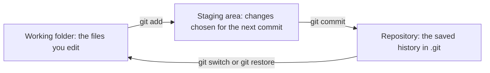
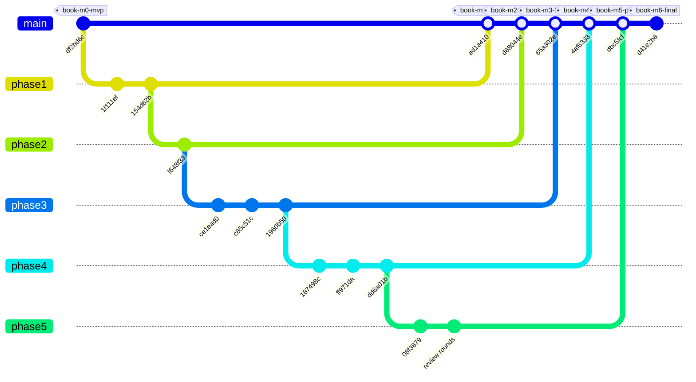

<!-- chapter: 7 | part: I | owner: writer-foundations | tag: book-m6-final | status: expanded -->
# Chapter 7: Git and GitHub

The Secure Document Viewer was built in small steps, and every step is preserved. Git is the tool that keeps that history, and the seven `book-m` tags are the checkpoints you will use to follow this book. This chapter teaches enough Git to record your own work, get the project's code, look at any milestone, and experiment without losing anything. It also reads the project's real history, because a history is one of the best documents a project has.

## Learning objectives

By the end of this chapter, you will be able to:

- Explain what version control is and what a commit is.
- Create a repository, record changes with `git add` and `git commit`, and read the result with `git log` and `git diff`.
- Clone the project and read its history.
- Look at the code as it was at any milestone, using tags.
- Explain branches, merges, remotes, and pull requests, and follow the project's use of them.
- Explain why `.gitignore` exists and why secrets are never committed.
- Follow the book's milestones without breaking your own changes, and recover from the common mistakes.

## Prerequisites

- Chapter 2: The command line and your files

## Beginner tier: A save history

### 7.1 Version control as a save history

Imagine writing a long document and saving copies named `report-final`, `report-final-2`, and `report-really-final`. Within a week you cannot say which is newest, what changed between them, or which one you sent to your manager. Version control replaces that habit. A tool records every meaningful change, who made it, when, and why, and lets you return to any earlier state. **Git** is the version control tool this project uses, and it is the most widely used one in the world.

A Git project is a **repository**: your files plus a hidden folder named `.git` that holds the whole history. Each saved state is a **commit**: a snapshot of every tracked file at one moment, with a message describing the change and a unique identifier such as `08f3879`. Commits form a chain, and each one points to the commit before it. Because each snapshot is complete, you can reload any of them.

**Analogy.** A commit is a numbered save point in a video game; you can reload any one.

**Where the analogy breaks down:** in two ways. First, Git can hold several lines of work at once, each with its own chain of save points, and merge them later; a game has one save file in one timeline. Second, a game save stores your whole world every time, while Git stores the changes compactly and identifies each snapshot by a fingerprint of its contents, so the same identifier means the same content on every computer.

Why does this matter for a security project? Three reasons. History lets a reviewer see exactly what changed and why. It lets a team undo a mistake without guessing. And it makes the project's growth readable: the book uses it to give you seven checkpoints at known states.

### 7.2 Setting up Git

Check that Git is installed:

```bash
git --version
```

You should see something like `git version 2.x`. On Windows, Git for Windows (which also gives you Git Bash, Chapter 2) installs it. Before your first commit, tell Git who you are, so each commit records an author. Use your own name and an address you are comfortable seeing in a project's history:

```bash
git config --global user.name "Your Name"
git config --global user.email "you@example.com"
```

The `--global` flag stores these once for your whole computer. The address in the second command is a placeholder; a real one is written into every commit you make and travels with the repository, so choose accordingly.

### 7.3 Your first repository, step by step

The fastest way to understand Git is to use it on something small. Make a scratch folder outside the project and turn it into a repository:

```bash
mkdir tile-notes
cd tile-notes
git init -b main
```

`git init -b main` creates the hidden `.git` folder, and `-b main` names the first branch `main`. Older Git versions call it `master`, so the flag keeps your output the same as this book's. You now have an empty repository. Create a file, then ask Git what it sees:

```bash
echo "Tiles are 512 px square." > notes.txt
git status
```

You should see something like this:

```text
On branch main
No commits yet
Untracked files:
  notes.txt
```

**Untracked** means Git can see the file but is not recording it. Recording happens in two steps, and the reason for two steps is worth understanding. Git has three places where your work can be: the **working folder** (the files you edit), the **staging area** (a list of changes you have chosen to record next), and the repository (the saved history). You move changes from the first to the second with `git add`, and from the second to the third with `git commit`.

Figure 7.1 draws the three places and the commands that move changes between them.



*Figure 7.1 — The three places your changes move through*

*Text description:* Three boxes: the working folder, the staging area, and the repository, with a labeled arrow from each to the next. `git add` moves changes from the working folder to the staging area, `git commit` moves them into the repository, and `git switch` or `git restore` brings files from the repository back to the working folder.

<!-- source: git behavior, as demonstrated in the scratch repository of Section 7.3 -->

Nothing is recorded until it reaches the right-hand box. The middle box is what lets you commit only some of your edits.

```bash
git add notes.txt
git commit -m "Add notes about tile size"
```

`git add` puts the file in the staging area. `git commit` saves a snapshot of everything staged, and `-m` supplies the message. Why stage at all? Because it lets you make several edits and commit only the ones that belong together, so each commit tells one story. Look at your history:

```bash
git log
```

You should see something like this:

```text
commit 3f2a9c1... (HEAD -> main)
Author: Your Name <you@example.com>
Date:   ...

    Add notes about tile size
```

The long hexadecimal number is the commit's identifier. Everyone abbreviates it to its first seven or so characters. `HEAD` is Git's name for "where you are now," and `main` is the name of the branch you are on (Section 7.6).

Now change the file and see what Git noticed:

```bash
echo "Edge tiles are cropped shorter." >> notes.txt
git diff
```

`>>` appends a line (Chapter 2). `git diff` shows the change as lines added (`+`) and removed (`-`) compared with the last commit. If the change is right, record it:

```bash
git add notes.txt
git commit -m "Note that edge tiles are cropped"
git log --oneline
```

`--oneline` compresses each commit to one line: its short identifier and its message. You should see two lines. Good commit messages matter more than beginners expect. Write what changed and, if it is not obvious, why. The project's own history reads well because its messages do that: "Fix review findings: X-Forwarded-For spoofing, role vs ownership, audit volume, UTC" tells you at a glance what the commit was for. <!-- source: git log, commit 65f2530 -->

### 7.4 Getting the project

If you already followed Step 7 of [Setting up your machine](../front-matter/c-setting-up-your-machine.md), you have cloned the project and can skip the `git clone` command shown in this section; this section explains what that step did. To get a copy of an existing repository, you **clone** it. The address comes from the project's repository page on GitHub, the website that hosts Git repositories: open the page, click the green *Code* button, and copy the address it shows. The project's repository is named `secure-doc-viewer` under its owner's account on GitHub, and it is **private**. You can open it, and its *Pull requests* tab (Section 7.7), only if its owner has given your GitHub account access. Ask the owner, or use the copy of the code you were given with this book. Substitute the address you copied:

```bash
git clone <repository-address>
cd secure-doc-viewer
```

A clone is a complete copy, including the whole history. You can now read it, offline, with `git log`:

```bash
git log --oneline
```

You should see something like this, newest first. The very top line depends on where the project's history stood when you cloned it; the line shown is the tip of `main` at `book-m6-final`:

```text
d41e2b8 Merge pull request #12 from ...
ccc9b89 Bump jsdom from 28.1.0 to 30.0.1 in /frontend
...
df2bd6c Add secure document viewer: tiled rendering with signed URLs and per-viewer watermarking
```

The last line is the very first commit: the project began as a small tiled viewer, which is what `book-m0-mvp` marks. To see what one commit changed, use `git show`:

```bash
git show 08f3879 --stat
```

`--stat` summarizes which files changed. This commit, "Phase 5: Spring Boot 4 / Java 25, Docker stack, CI, and e2e tests", is the one that introduced the Dockerfile and the Maven wrapper from Chapter 6. (In that title, CI is continuous integration and e2e means end-to-end: tests that drive the whole running app.) It touched 28 files. <!-- source: git show --stat 08f3879; git log --diff-filter=A for mvnw -->

## Intermediate tier: Tags, branches, and pull requests

*On a first read you can skim this tier and return to it when you first work on a branch.*

### 7.5 Tags as bookmarks: the `book-m*` tags

A **tag** is a permanent name for one commit, like a bookmark. The project has seven, and they are this book's checkpoints (Table 7.1).

**Table 7.1 — The milestone tags**

| Tag | Milestone | Commit |
|---|---|---|
| `book-m0-mvp` | Tiled viewer with signed URLs and watermarks | `df2bd6c` (the first commit) |
| `book-m1-accounts` | Accounts, roles, sessions, CSRF, sign-in throttling | `ad1a410` (merge of pull request 1) |
| `book-m2-documents` | Ownership, sharing, MySQL and Flyway, audit trail | `d88044e` (merge of pull request 2) |
| `book-m3-hardening` | Upload and API hardening, secrets, operations | `65a302e` (merge of pull request 3) |
| `book-m4-reading` | Reading experience, deep links, idle warning, watermark | `4af6338` (merge of pull request 4) |
| `book-m5-platform` | Spring Boot 4, Docker, CI, production hardening | `dbc5fcf` (merge of pull request 5) |
| `book-m6-final` | The finished app | `d41e2b8` (merge of pull request 12) |

A few words in the table are new. CSRF (Cross-Site Request Forgery) is an attack on signed-in users that Chapter 8 explains. CI (continuous integration) is a service that builds and tests every proposed change automatically, as Chapter 6 describes.

<!-- source: book/README.md milestone table; dossier timeline.md tag map -->

There is a subtlety worth knowing. Pull requests 1 to 4 were **stacked pull requests**: each branch started from the previous one, and all four were merged within about a minute of each other. So each tag marks a merge commit on `main`, and the code at each tag is the cumulative state of the project at that merge. That is exactly what a reader wants from a checkpoint. It also means you should always check what a tag contains with `git show`, and never assume from a pull request's title. <!-- source: dossier timeline.md, caveat for writers -->

Figure 7.2 shows the project's real history as branches and merges. Each phase branch started from the tip of the one before it, which is what "stacked" means, and each was then merged into `main`.



*Figure 7.2 — The project's history: stacked phase branches and the seven tags (simplified)*

*Text description:* A branching history drawn along a main line. The first commit on `main` carries the tag `book-m0-mvp`. Five branches then stack one on top of the next, each starting from the end of the previous one. `main` later merges them in order, and each merge commit carries one milestone tag from `book-m1-accounts` to `book-m5-platform`, followed by a final commit tagged `book-m6-final`.

<!-- source: git log --graph at book-m6-final; parents of 1f111ef, f648f33, ce1ead0, 187498c and 08f3879 checked with git log; dossier timeline.md -->

The figure makes two simplifications. First, the branch names are shortened to `phase1` to `phase5`; the real ones are `hardening/review-findings`, `phase-2/documents` and so on. Second, the last box stands for the four small merges of pull requests 9 to 12, of which `d41e2b8` is the final merge. The box "review rounds" stands for the 14 further commits on the fifth branch. Notice that each `book-m` tag sits on a merge commit on `main`, except the first, which is the very first commit.

List the tags, and read any file as it was at a tag without changing anything on disk. (A fresh clone normally includes the tags; if `git tag` shows none, run `git fetch --tags`.)

```bash
git tag
git show book-m2-documents:src/main/resources/db/migration/V2__documents_shares_audit.sql
```

The form `git show <tag>:<path>` prints one file as it was at that tag. This is how the book's code listings are checked, and it is the safest way to look around: nothing in your folder changes. You can list a folder the same way, with `git ls-tree`:

```bash
git ls-tree --name-only book-m0-mvp src/main/java/com/example/securedocviewer/service
```

That command lists the files of one folder at the first milestone, before the app had accounts or a database. Comparing it with the same command at `book-m6-final` shows the growth in one glance.

### 7.6 Branches and merges

A **branch** is a movable name for a line of work. The default branch, `main`, holds the accepted history. To try something, you create a branch, commit there, and `main` stays untouched. When the work is good, you **merge** it back. Try it in your scratch repository:

```bash
git switch -c add-rate-note
echo "Rate limit: 180 tiles per minute." >> notes.txt
git add notes.txt
git commit -m "Note the rate limit"
git switch main
cat notes.txt
```

`git switch -c add-rate-note` creates a branch and moves to it (`-c` means create). After the commit, `git switch main` moves back, and `cat notes.txt` shows the file without the new line: on `main`, the change does not exist yet. Now merge:

```bash
git merge add-rate-note
cat notes.txt
```

The line appears. Because `main` had no new commits of its own, Git could move `main` forward to the branch's commit, which is called a **fast-forward**. When both branches have new commits, Git creates a **merge commit** that has two parents and joins the lines of work. The project's history is full of those: the messages that begin "Merge pull request #..." are merge commits made by GitHub.

If two branches change the same lines of the same file, Git cannot decide which version wins, and it stops with a **merge conflict**. It writes both versions into the file, between marker lines `<<<<<<<`, `=======` and `>>>>>>>`. You edit the file to keep what is right, delete the markers, `git add` the file and commit. Conflicts are normal and not a sign that you did something wrong.

### 7.7 Remotes, pull requests, and code review

A **remote** is a copy of the repository on another computer, usually GitHub. `git clone` sets one up for you, under the name `origin`. Three commands move commits between copies. To **push** is to send your commits to the remote (`git push`). To **fetch** is to download new commits without touching your files (`git fetch`). To **pull** is to fetch and then merge the new commits into your branch (`git pull`).

On GitHub, a **pull request** (PR) is a proposal to merge one branch into another. It shows the changes, lets others comment line by line, and runs automated checks before anything is merged. **Code review** is the practice of having someone else read the change before it lands. It catches mistakes the author cannot see, spreads knowledge, and leaves a record of why decisions were made.

This project used one pull request per phase, and the pull requests are a record of how it grew. For example, `book-m1-accounts` is the merge of pull request 1, "Phase 1: real accounts, roles, and admin lockdown". And `book-m5-platform` is the merge of pull request 5, "Phase 5: Spring Boot 4 / Java 25, Docker stack, CI, and e2e tests". Pull request 5 is the largest story: after it was opened, review rounds added fixes for problems the reviewers found, and about 15 commits landed on that branch before it was merged. In this project, the reviewers were AI review agents: a senior technical manager agent and a product owner agent. The technical manager agent gave a final recommendation to merge pull request 5, "subject to the product owner's approval," and it was the project's human owner who approved the merge. The agents advised; a person decided. Part V describes what they found. <!-- source: dossier timeline.md (PR #5 commits); reviews.md (line 5964, TM recommends merge subject to product owner approval; user approves merging #5) -->

You can read the pull requests on the repository's *Pull requests* tab, or from the terminal with `gh pr view 5` if you have GitHub's command-line tool, `gh`, signed in. The pull requests in the public repository were recreated after personal data was removed from the commit history, so the dates GitHub shows on those pages are the recreation dates; the commits keep their original dates.

Not every pull request in the history is a feature. After pull request 5 merged, the automated checks failed once on `main` because one test was flaky: it sometimes failed and sometimes passed for the same code. The fix went through its own small pull request (number 9). Dependabot, a bot that proposes dependency updates, opened pull requests 6, 7 and 8 right after the merge. The project closed all three with an explanation, because they proposed unstable or non-LTS (long-term-support) versions. It then changed the bot's rules to propose only stable lines (pull request 10). Later Dependabot pull requests (11 and 12) were merged, which produced `book-m6-final`. One more pull request, number 13, was merged after that tag: it is documentation only, and it removed the stale mentions of a canvas from the README and from a comment in `PageInfo.java` (Chapter 4). So the tags stop at pull request 12, and `main` has one further commit than the last tag. The point for you: a pull request is the unit of change, whatever its size, and a healthy history has small ones. <!-- source: dossier timeline.md, PR index -->

### 7.8 `.gitignore` and why secrets never get committed

Some files must not be recorded: build output, editor settings, and above all secrets. The file `.gitignore` lists patterns Git skips. Excerpt:

**Listing 7.1 — `.gitignore` (book-m6-final, excerpt)**

```text
# Build output
target/
!.mvn/wrapper/maven-wrapper.jar

# Generated tile storage — never commit ingested documents
storage/

# Local secrets (see .env.example)
.env
```

*Path: `.gitignore`*

Each non-comment line is a pattern. `target/` skips Maven's output (Chapter 6), `storage/` skips the uploaded documents' tiles (uploaded content must never enter history), and `.env` skips your secrets (Chapter 2). A line starting with `!` makes an exception, here keeping the Maven wrapper's jar file.

Why so strict? Git history is permanent and copied to everyone who clones. If you commit a password and delete it in the next commit, it is still in the history, and anyone can read it. The only safe practice is to never commit a secret, and to replace, or rotate, any secret that leaks. That is why the project ships `.env.example` with blanks and asks you to make your own `.env`.

The same care covers where the repository lives on your disk. The project's `.env.example` warns that the tile storage folder must be somewhere that is not synced by OneDrive, Dropbox or a similar service, because those would upload every rendered page to the cloud. The developer learned this the hard way: the project began inside a OneDrive folder, and the sync client copied the repository, the secrets and the tiles, and its file locks broke the moves and deletes the app performs. It was moved out to a plain local folder. <!-- source: dossier timeline.md (project moved out of OneDrive); .env.example at book-m6-final -->

## Advanced tier: Working safely

*On a first read you can skip to "In this project"; Part IV uses the tags throughout.*

### 7.9 Following this book with tags without breaking your work

Two commands let you move to a milestone: `git checkout <tag>` and `git switch --detach <tag>`. Both put you in **detached HEAD** state. You are looking at an old commit and are not on any branch. Commits you make there belong to no branch, and can be lost when you switch away.

The safe routine:

1. Make sure your own work is saved: `git status` shows uncommitted changes. Commit them or set them aside first.
2. To read code, prefer `git show <tag>:<path>` (Section 7.5). It changes nothing.
3. To run or edit a milestone, create a branch from the tag and work there:

```bash
git switch -c my-m2 book-m2-documents
```

This creates and switches to a new branch `my-m2` that starts exactly at the tag. Your experiments live on `my-m2`; the tag and `main` stay intact. Exercises in this book always ask you to work on a branch like this, never directly on a tag. To go back: `git switch main`.

Being on a branch at an old tag does not make it runnable with the tools from your setup guide. The tags `book-m0-mvp` to `book-m4-reading` need a JDK 21 and a Maven you install yourself, because the Maven wrapper only arrives at `book-m5-platform` (Chapter 6, Section 6.7); Table IV.3 in [Part IV](../part-4-building-the-app/00-part-introduction.md) lists what each tag needs. Until you have those, treat the older tags as read-only and use `git show`.

**We simplify here.** Git has many more commands, such as rebasing and stashing. The app's story does not need them, and you can look them up when you do.

### 7.10 Reading history to understand a project

History answers questions the code cannot. Three commands do most of the work.

`git log --oneline -- <path>` lists only the commits that touched one file. To find when the third database migration appeared:

```bash
git log --oneline --diff-filter=A -- src/main/resources/db/migration/V3__tile_versions_and_account_security.sql
```

`--diff-filter=A` keeps only commits that **added** the file. The answer is a commit titled "Atomic PDF replace via versioned tiles; bounded rendering", made during the review rounds of pull request 5. So the reason for the `tile_version` column in Chapter 9 is a replace-a-PDF bug found in review, which Chapter 30 tells in full. The history led you to the story. <!-- source: git log --diff-filter=A for V3 (commit 00e0619); dossier timeline.md -->

`git blame <file>`, called **blame** for short, shows, line by line, which commit last changed each line. It is not for blaming people; it is the quickest route from a puzzling line to the commit message that explains it. And `git log --stat` shows which files each commit touched, so you can see the size and shape of a change before you read it.

### 7.11 Common mistakes

**"fatal: not a git repository."** You ran a Git command outside a repository. Use `pwd` (Chapter 2) to check where you are, and `cd` into the project.

**You edited a file but the change is not in the commit.** You forgot `git add`. `git status` lists changes "not staged for commit" and tells you what to do.

**Your changes vanished after switching to a tag.** You committed while in detached HEAD, then switched away. If you have not yet switched, save the work with `git switch -c rescue` while you are still there. If you have already switched, ask Git for the lost commit's identifier with `git reflog`, the **reflog**, which lists where `HEAD` has been, then `git switch -c rescue <id>`.

**"LF will be replaced by CRLF" warnings on Windows.** (LF and CRLF are the Unix and Windows line endings from Chapter 2.) This is Git converting line endings (Chapter 2) between the Windows and Unix styles. It is normal. If a script such as `mvnw` fails with a strange `\r` error, the conversion went too far for that file (Chapter 6).

**"Permission denied" or a request for credentials when cloning.** The public repository needs no account to clone over HTTPS. If you cloned your own private copy, check that your GitHub account has access, and that you are signed in through the method your clone address uses.

**You committed a secret.** Do not rely on deleting it in a new commit. Treat it as leaked: replace the secret with a new one first, since that is what actually protects you. Then, if the repository is shared, ask an experienced colleague about rewriting history, which is possible but affects everyone.

**A merge conflict.** Read the file, decide which lines are right, remove the marker lines, `git add`, and commit. `git status` tells you which files still conflict.

## In this project

- The seven `book-m*` tags, and the pull requests behind them (`gh pr view 1` to `gh pr view 5`).
- `.gitignore` and `.env.example`: the secrets rule and the warning about synced folders.
- `.github/workflows/ci.yml`: the automated checks that run on every pull request (Chapter 36).
- `.github/dependabot.yml`: a bot that opens pull requests to update dependencies.
- The project's history is short enough to read: at `book-m6-final` it holds 38 commits and pull requests 1 to 12, and milestone 5 alone is 15 of the commits. A documentation-only pull request, number 13, was merged after the tag. <!-- source: dossier timeline.md (38 commits); git rev-list --count book-m6-final -->

## Try it

### Exercise 7.1 ★ Read the first commit

Run `git log --oneline` and find the oldest commit. Then run `git show <id> --stat`. Which folder holds most of the changed files?

*Solution:* Appendix C, Exercise 7.1.

### Exercise 7.2 ★ Time travel without moving

Print `pom.xml` as it was at `book-m0-mvp` and at `book-m6-final`. Which lines mention the Java version, and how do they differ?

*Solution:* Appendix C, Exercise 7.2.

### Exercise 7.3 ★★ Your own branch

Create a branch from `book-m2-documents`, add a file `notes.txt`, commit it, then switch back to `main` and confirm the file is gone. Switch back to your branch and confirm it returned.

*Solution:* Appendix C, Exercise 7.3.

### Exercise 7.4 ★ Two commits in a scratch repository

In a new folder, run `git init`, create a file, commit it, change it, view the change with `git diff`, and commit again. Then use `git log --oneline` to confirm you have two commits.

*Solution:* Appendix C, Exercise 7.4.

### Exercise 7.5 ★★ Find when a file appeared

Use `git log --diff-filter=A --oneline -- <path>` to find the commit that added `Dockerfile`, and the commit that added `V2__documents_shares_audit.sql`. For each, read the commit message and say which milestone it belongs to.

*Solution:* Appendix C, Exercise 7.5.

### Exercise 7.6 ★★★ Cause and resolve a conflict

In your scratch repository, create two branches that change the same line of `notes.txt` differently. Merge one, then the other, and resolve the conflict by hand. Write down, in your own words, what each of the three marker lines means.

*Solution:* Appendix C, Exercise 7.6.

## Summary

- Git records a project's history as commits; the working folder, staging area, and repository are the three places your changes move through.
- `git add` stages, `git commit` saves, `git diff` and `git log` show what changed.
- Tags are permanent names for commits; `git show <tag>:<path>` reads any file at any milestone without changing your files.
- Branches isolate work and merges join it; pull requests propose merges and trigger review and checks.
- `.gitignore` keeps build output and secrets out of history, which is permanent; keep repositories out of synced folders.
- To run or edit a milestone, create a branch from its tag; when in doubt, `git reflog` remembers where you have been.

## Further reading

- *Pro Git*, by Scott Chacon and Ben Straub, "Git Basics" and "Git Branching." https://git-scm.com/book/en/v2
- *Git Reference Manual*, `git-show`, `git-log` and `gitignore`. https://git-scm.com/docs
- *GitHub Docs*, "About pull requests." https://docs.github.com/en/pull-requests
