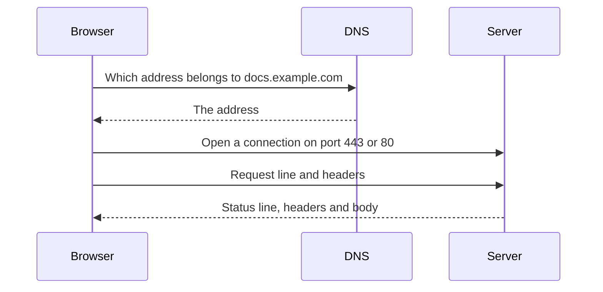
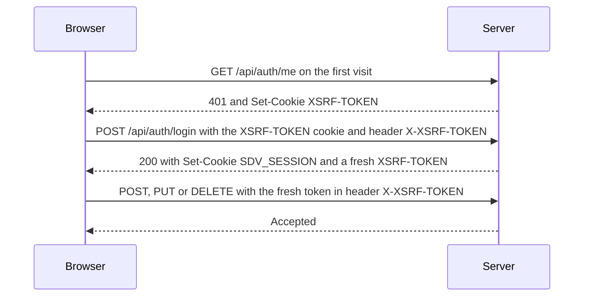
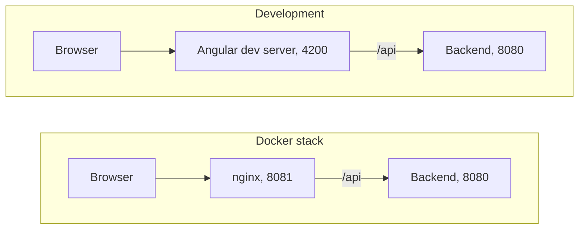

<!-- chapter: 8 | part: I | owner: writer-foundations | tag: book-m6-final | status: expanded -->
# Chapter 8: How the web works

The browser and the backend of the Secure Document Viewer talk in a language called HTTP. Every protection in the app, from sign-in to signed tile URLs, is expressed in that language, so you need to read it fluently. This chapter teaches requests and responses, methods, and status codes, headers, JSON, cookies, security headers, the same-origin rule, and HTTPS, and shows you how to watch real traffic. Real bugs from this project appear along the way, because most of them were bugs about exactly these ideas.

## Learning objectives

By the end of this chapter, you will be able to:

- Describe an HTTP request and response and name their parts.
- Choose the right method for an action and explain the common status codes.
- Read and write a small JSON document, and explain how the app's records become JSON.
- Explain what a cookie is, how the app uses one for sign-in, and what the CSRF token adds.
- Explain what the security headers the app sets are for.
- Explain the same-origin rule and why browsers enforce it.
- Explain, in one paragraph, what HTTPS adds.
- Inspect traffic with the browser's developer tools and `curl`.

## Prerequisites

- Chapter 1: The big picture
- Chapter 2: The command line and your files

## Beginner tier: Requests and responses

### 8.1 Browsers, servers, requests, and responses

Chapter 1 introduced clients and servers. **HTTP** (Hypertext Transfer Protocol) is the set of rules they follow to talk. A **protocol** is an agreed format for a conversation, like the rules of a phone call: who speaks first, how you say goodbye. The conversation is always the same shape: the client sends a **request**, and the server sends back one **response**. The server never speaks first.

*Pattern note: This request and response exchange is the client-server pattern (Chapter 39, Section 39.4).*

A request names *what* the client wants and *how*; the response says whether that worked and carries the result. Everything on a web page, from the text to each image, arrives through separate exchanges like this. When a reader looks at one page of a document in the app, the browser makes about a dozen tile requests, one for each tile.

Follow what happens when you type an address such as `https://docs.example.com/` into a browser:

1. The browser asks the **DNS** (Domain Name System), the internet's phone book (unlike a printed one, its entries change, and each lookup takes a fraction of a second), which number address belongs to the name `docs.example.com`.
2. It opens a connection to that address, on a port (Chapter 2). For `https`, the default port is 443; for `http`, 80.
3. It sends a request.
4. The server sends a response.
5. The browser uses the response (draws the page, or shows an image) and may then make more requests for the things the page mentions.

Figure 8.1 shows one exchange, written out the way it travels.

```text
GET /api/documents HTTP/1.1
Host: localhost:8080
Cookie: SDV_SESSION=<session-id>
Accept: application/json

HTTP/1.1 200 OK
Content-Type: application/json

[{"documentId":"...","title":"Quarterly report"}]
```

*Figure 8.1 — One request and its response (teaching example, abbreviated)*

*Text description:* Two blocks of plain text. The upper block is a request: a request line saying `GET /api/documents HTTP/1.1`, then header lines for host, cookie and accepted type. The lower block is the response: a status line `HTTP/1.1 200 OK`, a `Content-Type` header, an empty line, and a JSON body.

<!-- source: modeled on GET /api/documents in DocumentController.java and the SDV_SESSION cookie name in application.yml at book-m6-final; the values are placeholders -->


The top block is the request: a **request line** (method, path, protocol version), then **headers**, one per line. The bottom is the response: a **status line**, headers, an empty line, and the **body**. The id and title values are placeholders for illustration. Notice that everything is plain text. You can write a request by hand, and Section 8.10 does.

Figure 8.2 shows the five numbered steps of this section as a conversation between three parties.



*Figure 8.2 — What happens between typing an address and getting a response*

*Text description:* A sequence read top to bottom among three parties: Browser, DNS, and Server. The browser asks DNS for the address of a name and receives it, then opens a connection to the server, sends a request, and receives a response. Notice that only the last two messages are HTTP.

<!-- source: HTTP and DNS behavior (RFC 9110); the server side is the app's endpoints at book-m6-final -->

Only the last two arrows are HTTP. The first two are the lookup that makes the name usable.

### 8.2 URLs, methods, and status codes

A URL has parts. Take `https://docs.example.com:8080/api/tiles?token=<signed-token>`:

- `https` is the scheme (the protocol, with encryption, Section 8.9);
- `docs.example.com` is the host, the computer to contact;
- `8080` is the port (Chapter 2);
- `/api/tiles` is the path, chosen by the app;
- `?token=<signed-token>` is the **query string**: extra named values after a question mark, in `name=value` pairs joined by `&`.

The path can also carry a value. The app's document endpoints use `/api/documents/{documentId}`, where `{documentId}` stands for a real identifier, so `/api/documents/123e4567-e89b-12d3-a456-426614174000` names one document. The app's real identifiers are random UUIDs, so they cannot be guessed by counting upward. A path that names a thing is called a **resource**, and the design style of naming resources by path and acting on them with methods is called **REST**, for Representational State Transfer (Chapter 12).

The method says what the client wants to do. Table 8.1 lists the ones the app uses, with real examples from `DocumentController`.

**Table 8.1 — HTTP methods in the app**

| Method | Meaning | Example in the app |
|---|---|---|
| `GET` | Read something; changes nothing | `GET /api/documents` lists your documents |
| `POST` | Create something or submit an action | `POST /api/documents` uploads a PDF |
| `PUT` | Replace something | `PUT /api/documents/{id}/file` replaces a PDF |
| `PATCH` | Change part of something | `PATCH /api/documents/{id}` renames it |
| `DELETE` | Remove something | `DELETE /api/documents/{id}` |

<!-- source: DocumentController.java at book-m6-final -->

Two properties explain why the methods differ. A method is a **safe method** if it does not change anything on the server: `GET` is safe, so a browser may repeat it, cache it or prefetch it freely. A method is **idempotent** if doing it twice has the same effect as once: `PUT` and `DELETE` are, since replacing a file twice with the same file, or deleting an already deleted document, leaves the same end state. `POST` is neither, which is why browsers warn before resubmitting one.

The response's **status code** is a three-digit number telling the client what happened. They come in families: 2xx success, 3xx redirect, 4xx the client's request was wrong, 5xx the server failed. Table 8.2 lists the codes this app produces, each taken from its error handler, plus `412`, which the app does not send but which Part VII needs.

**Table 8.2 — Status codes the app uses**

| Code | Name | When the app sends it |
|---|---|---|
| `200` | OK | The request worked |
| `204` | No Content | A delete worked; nothing to return |
| `400` | Bad Request | Missing or malformed input |
| `401` | Unauthorized | Not signed in, or an invalid tile token |
| `403` | Forbidden | You may see it but not change it |
| `404` | Not Found | Does not exist, or you may not know it exists |
| `409` | Conflict | The username is already taken |
| `410` | Gone | A tile URL for a page that has since been replaced |
| `412` | Precondition Failed | A condition attached to the request was not met. The app does not send this at `book-m6-final`; you will meet it in Part VII, where a conditional write to cloud storage answers `412` if the object already exists |
| `413` | Content Too Large | The upload is over 50 MB |
| `415` | Unsupported Media Type | The body's content type is not one the endpoint accepts |
| `429` | Too Many Requests | Rate limit or sign-in lockout, with a `Retry-After` header |
| `500` | Internal Server Error | An unexpected failure on the server |
| `503` | Service Unavailable | The server is busy rendering; retry |

<!-- source: GlobalExceptionHandler.java at book-m6-final -->

Two rows deserve comment. Despite its name, `401 Unauthorized` really means "not authenticated": the server does not know who you are. `403 Forbidden` means the server knows who you are and refuses. And a document you may not see gets `404`, not `403`, so that nobody can probe which documents exist. The app's own exception comments say this explicitly.

### 8.3 Headers and bodies

**Headers** are name-and-value lines that add information about the message. A few matter in this app:

- `Content-Type` says what the body is (`application/json`, `image/png`);
- `Accept` (in a request) says what the client is willing to receive;
- `Cache-Control` tells caches whether they may keep a copy;
- `Retry-After` tells a client how many seconds to wait before trying again;
- `Cookie` and `Set-Cookie` carry cookies (Section 8.6).

A header in a request is a request header, and one in a response is a **response header**. The **body** carries the data. In a request, the data a client sends is the **request body**, such as the bytes of an uploaded PDF or a JSON document. In a response, the body is what the server returns: JSON for the app's API (application programming interface, the set of endpoints it offers; Section 8.4) or the bytes of an image for a tile. A `GET` request usually has no body.

The header names are case-insensitive, and there are dozens more, but these are enough to read almost everything the app sends. Section 8.7 covers a second group, the security headers.

## Intermediate tier: Data, cookies, and headers in the app

*On a first read you can skim this tier; Chapters 12, 15, and 16 return to cookies and headers.*

### 8.4 JSON

**JSON** (JavaScript Object Notation) is a text format for structured data. It has objects in braces with named fields, arrays in brackets, and values that are text in double quotes, numbers, `true`, `false` or `null`.

**Example 8.1 — A JSON object**

```json
{
  "title": "Quarterly report",
  "pageCount": 12,
  "visibility": "PRIVATE",
  "sharedWith": ["reader.one"]
}
```

The rules are strict, and breaking them is the commonest JSON mistake: field names need double quotes, text needs double quotes (not single), items are separated by commas, and there is no comma after the last item. A JSON document with any of these wrong is rejected as malformed, and the app then answers `400 Bad Request` with "Request body is missing or malformed."

The similarity to Chapter 4's records is deliberate. The app's record `DocumentSummary` becomes a JSON object with the same field names, automatically. A record with these fields (`documentId`, `title`, `pageCount`, `owner`, `visibility`, `createdAtEpochSeconds`, `updatedAtEpochSeconds`, `canManage`, `sharedWithCount`) is sent like this, with made-up values:

**Example 8.2 — A DocumentSummary as JSON (teaching values)**

```json
{
  "documentId": "123e4567-e89b-12d3-a456-426614174000",
  "title": "Quarterly report",
  "pageCount": 12,
  "owner": "pub.one",
  "visibility": "PRIVATE",
  "createdAtEpochSeconds": 1789776000,
  "updatedAtEpochSeconds": 1789776000,
  "canManage": false,
  "sharedWithCount": null
}
```

Each Java field became a JSON field of the same name; the `Visibility` enum became its name as text; and the `Integer sharedWithCount`, which the record fills in only for people who can manage the document, became `null`. Timestamps are plain numbers of seconds (Chapter 5), which every language can read. <!-- source: DocumentSummary.java at book-m6-final -->

Every error the app sends is also JSON with one field, `error`, and the handler sets the `Content-Type` explicitly.

**Listing 8.1 — `GlobalExceptionHandler.java` (book-m6-final, excerpt: method `error`)**

```java
    private static ResponseEntity<Map<String, String>> error(HttpStatus status, String message) {
        return ResponseEntity.status(status)
                .contentType(MediaType.APPLICATION_JSON)
                .body(Map.of("error", message));
    }
```

*Path: `src/main/java/com/example/securedocviewer/controller/GlobalExceptionHandler.java`*

A `ResponseEntity` is Spring's object for a whole response: a status, headers, and a body. This helper builds one with the given status, marks it JSON, and puts the message in a map (Chapter 5), which becomes `{"error": "..."}`. Chapter 13 shows the full handler. Section 8.11 tells why the explicit content type is there.

### 8.5 Sending files: multipart uploads

JSON is for structured data. A PDF is a large block of bytes, and HTTP has a separate way to send one along with a few text fields: a **multipart** body, the format that HTML (the markup language of web pages) file-upload forms use. The body has several **parts**, each with its own headers, separated by a boundary marker. You do not write this format by hand. The app's upload endpoint declares what it expects, and the framework parses the parts.

**Listing 8.2 — `DocumentController.java` (book-m6-final, excerpt: method `upload` signature)**

```java
    @PostMapping
    public DocumentDetail upload(@RequestParam(value = "title", required = false) String title,
                                 @RequestParam(value = "visibility", required = false) Visibility visibility,
                                 @RequestParam("file") MultipartFile file,
                                 Authentication authentication,
                                 HttpServletRequest request) throws IOException {
```

*Path: `src/main/java/com/example/securedocviewer/controller/DocumentController.java`*

`@PostMapping` binds this method to `POST /api/documents`. Each `@RequestParam` names one part: an optional `title` and `visibility`, and a required `file`, which arrives as a `MultipartFile`. If the file part is missing the app answers `400` with "Missing required 'file'." If it is too big, the size limits apply: the settings cap a file at 50 MB, and the answer is `413 Content Too Large`. The limit exists at several layers, on purpose: the settings, the error handler's message, the frontend's own check, and the web server in front, so an oversized body is refused early, before the backend has spent effort on it. <!-- source: application.yml, GlobalExceptionHandler.java, nginx.conf comment at book-m6-final -->

### 8.6 Cookies, sessions, and the CSRF token

HTTP has no memory: each request stands alone. Yet after you sign in, the server must recognize you on the next request. The mechanism is a **cookie**: a small piece of text that the server asks the browser to store (with a `Set-Cookie` header) and that the browser then attaches to every later request to that server (with a `Cookie` header).

At sign-in, the server creates a session (Chapter 1) and sends its identifier as a cookie. The app's configuration names and protects it.

**Listing 8.3 — `application.yml` (book-m6-final, excerpt: session cookie)**

```yaml
  servlet:
    session:
      # Idle timeout: each request extends it, so an active reader is never
      # cut off mid-document, while an abandoned session still dies.
      timeout: 30m
      cookie:
        name: SDV_SESSION
        http-only: true
        same-site: strict
        # Must be true anywhere the app is served over HTTPS.
        secure: ${SESSION_COOKIE_SECURE:false}
```

*Path: `src/main/resources/application.yml`*

The cookie is named `SDV_SESSION`, and three settings protect it:

- `http-only: true` hides the cookie from JavaScript (the programming language that browsers run inside web pages; Part III covers its typed sibling, TypeScript) running in the page, so a script injected into the page (the attack is called **XSS**, for cross-site scripting) cannot steal it;
- `same-site: strict` sets the cookie's **SameSite** rule. It tells the browser to send the cookie only for requests that start on the app's own site, which blocks a class of forged-request attacks;
- `secure` makes the browser send it only over HTTPS. It is `false` by default so that local development over plain HTTP works, and the file's comment says it must be true wherever the app is served over HTTPS.

The `timeout: 30m` line means a session ends after 30 minutes without a request.

**Analogy.** The session cookie is a coat-check ticket. You hand over your coat at the desk (you sign in) and get a numbered ticket; whoever holds the ticket can collect the coat, which is why the ticket needs the three protections of Listing 8.3.

**Where the analogy breaks down:** in two ways. A coat-check ticket is used once, at the end, while the app checks the session again on every single tile request. And a coat-check ticket stays valid until the cloakroom closes, while a session ends after 30 idle minutes, and an administrator can cancel it at any time.

#### The forged-request problem and the second cookie

Browsers attach cookies automatically. That is convenient, and it is also the opening for **CSRF** (Cross-Site Request Forgery). A malicious page you visit in another tab makes your browser send a request to the app. Your session cookie goes along, so the app cannot tell the request from a real click. `same-site: strict` is one defense. The app adds a second: a **CSRF token**, a secret value that the app's own page reads and sends back in a header on every change (`POST`, `PUT`, `PATCH`, `DELETE`). A foreign page cannot read the value, so it cannot send it.

Figure 8.3 shows how the two cookies arrive during sign-in, in the order the project's own test drives them.



*Figure 8.3 — The session cookie and the CSRF token arriving during sign-in*

*Text description:* A sequence between Browser and Server, read top to bottom. A first visit gets a 401 answer that sets an `XSRF-TOKEN` cookie. The browser then signs in, sending that cookie and a matching header, and the answer sets the `SDV_SESSION` cookie and a fresh `XSRF-TOKEN`. A later change request carries the fresh token in a header and is accepted.

<!-- source: CsrfCookieFlowTest.java at book-m6-final; SecurityConfig.java (csrfTokenRepository); dossier bugs-and-findings.md C1 and C2 -->

Notice the second reply: sign-in hands out a fresh CSRF token together with the session. The bug described in Section 8.11 was exactly a missing arrow here, a sign-in that deleted the CSRF cookie without issuing a new one.

The token travels in a second cookie, and this one is deliberately different.

**Listing 8.4 — `SecurityConfig.java` (book-m6-final, excerpt: the CSRF cookie)**

```java
    @Bean
    public CsrfTokenRepository csrfTokenRepository() {
        CookieCsrfTokenRepository repository = CookieCsrfTokenRepository.withHttpOnlyFalse();
        repository.setCookieCustomizer(cookie -> cookie.sameSite("Strict").path("/"));
        return repository;
    }
```

*Path: `src/main/java/com/example/securedocviewer/security/SecurityConfig.java`*

`withHttpOnlyFalse()` makes the CSRF cookie readable by the page's JavaScript, the opposite of the session cookie. That is intended: the Angular frontend must read the value to copy it into a header. Being readable is safe here because the value is useless without the session cookie, which stays hidden. Chapter 16 explains the design fully. What matters for now is that the app uses two cookies for two different jobs.

## Advanced tier: Trust, transport, and traffic

*On a first read you can skip to "In this project"; Chapter 16 comes back to security headers, and Chapter 33 to HTTPS.*

### 8.7 Security headers

The server also sends headers whose only job is to tell the browser to be stricter. The app sets a small set of them, and its own comments explain each.

**Listing 8.5 — `SecurityConfig.java` (book-m6-final, excerpt: security headers)**

```java
                .headers(headers -> headers
                        // The API only ever returns JSON and PNG tiles, so nothing it serves
                        // needs to run script, load resources or be framed.
                        .contentSecurityPolicy(csp -> csp.policyDirectives(
                                "default-src 'none'; frame-ancestors 'none'; base-uri 'none'; form-action 'none'"))
                        // Tile URLs carry signed tokens; never send them onward in a Referer.
                        .referrerPolicy(referrer -> referrer.policy(ReferrerPolicy.NO_REFERRER))
                        .permissionsPolicyHeader(permissions -> permissions.policy(
                                "camera=(), microphone=(), geolocation=(), payment=()")))
```

*Path: `src/main/java/com/example/securedocviewer/security/SecurityConfig.java`*

Reading them in turn:

- **Content-Security-Policy** (CSP) is an allow-list (a list of what is permitted, with everything else refused) that tells the browser what a response may do. `default-src 'none'` means "load nothing from anywhere"; `frame-ancestors 'none'` means "no other page may embed this one in a frame." Since the API returns only JSON and images, it needs no permissions, so it grants none. If an attacker ever got script into a response, the browser would refuse to run it.
- **Referrer-Policy**: `no-referrer` stops the browser from telling the next site which page the visitor came from. This matters because tile URLs carry signed tokens (Chapter 1). Without the policy, following a link from a page could leak a token in the `Referer` header.
- **Permissions-Policy** switches off browser features the app never uses (camera, microphone, location, payment), so nothing can request them.

The tile endpoint sets one more header, the one that matters most for the watermark.

**Listing 8.6 — `TileController.java` (book-m6-final, excerpt: the end of method `getTile`)**

```java
        return ResponseEntity.ok()
                // Deliberately not cacheable beyond a moment — a shared cache
                // holding onto a watermarked-for-someone-else tile would leak it.
                .cacheControl(CacheControl.noStore())
                .body(png);
```

*Path: `src/main/java/com/example/securedocviewer/controller/TileController.java`*

`Cache-Control: no-store` forbids any cache from keeping the response. A tile is watermarked for one viewer, so a shared cache (a proxy that many people use) that kept it could hand it to someone else. The cost is that tiles are never reused from a cache, which the README accepts on purpose. <!-- source: TileController.java, README.md "Watermarking happens on the way out, not at ingest" -->

### 8.8 Same origin, and why browsers are suspicious

An **origin** is the combination of scheme, host and port. `http://localhost:8080` and `http://localhost:4200` are different origins because the ports differ. Browsers apply the **same-origin policy**: a script loaded from one origin may not freely read responses from another. The rule exists because otherwise any web page you visit could silently read your email or your documents using your cookies.

The consequence for this project: the Angular frontend (the pages you see, built in Part III) and the backend must appear to the browser as one origin. A **proxy** is a program that receives a request on behalf of another server and forwards it. In development a small proxy forwards `/api` requests to the backend.

**Listing 8.7 — `proxy.conf.json` (book-m6-final)**

```json
{
  "/api": {
    "target": "http://localhost:8080",
    "secure": false,
    "changeOrigin": false,
    "logLevel": "warn"
  }
}
```

*Path: `frontend/proxy.conf.json`*

The Angular development server, on port 4200, forwards every request whose path starts with `/api` to the backend on 8080, so the browser sees only one origin. In the Docker stack a web server called nginx does the same job (Chapters 10 and 33). The project avoids opening cross-origin access (a browser feature called **CORS**, for cross-origin resource sharing) rather than granting it; there is no cross-origin configuration in the backend at `book-m6-final`. <!-- source: git grep for "cors" at book-m6-final finds none; frontend/nginx.conf and frontend/Dockerfile comments -->

Figure 8.4 shows the two arrangements side by side. In both, the browser talks to one address only.



*Figure 8.4 — How the browser sees one origin in development and in the Docker stack*

*Text description:* Two rows, one above the other. In the top row, Development, the browser talks to the Angular development server on port 4200, which forwards paths starting with `/api` to the backend on port 8080. In the bottom row, the Docker stack, the browser talks to an nginx container published on port 8081, which forwards the same paths to a backend container on port 8080 that is not published.

<!-- source: frontend/proxy.conf.json, docker-compose.yml and frontend/nginx.conf at book-m6-final -->

The backend is never reached directly by the browser, so the browser sees a single origin and the same-origin rule is satisfied without any cross-origin exceptions.

### 8.9 HTTPS and TLS in one page

Plain HTTP travels as readable text, so anyone on the network path can read or change it, including the session cookie. HTTPS is HTTP inside an encrypted channel created by **TLS** (Transport Layer Security). TLS provides three things: **encryption** (eavesdroppers see noise), **integrity** (changes are detected), and authentication (a certificate proves you reached the real host). A **certificate** is a signed statement, issued by an authority the browser trusts, that a public key belongs to a given domain. (A public key is one half of a pair of numbers used for encryption: it can be shared freely, while its partner, the private key, stays secret on the server.)

The project's optional TLS frontend is a program called Caddy, and the setting `SESSION_COOKIE_SECURE=true` is what you turn on when you use it. The Caddy configuration adds one more header, `Strict-Transport-Security`, known as HSTS (HTTP Strict Transport Security), which tells the browser to use only HTTPS for this site from then on.

**Listing 8.8 — `deploy/Caddyfile` (book-m6-final, excerpt: the header block)**

```text
	header {
		# Browsers must only ever use HTTPS for this site from now on. Add
		# "; includeSubDomains" via HSTS_POLICY only if every subdomain is HTTPS too.
		Strict-Transport-Security "{$HSTS_POLICY:max-age=31536000}"
		-Server
	}
```

*Path: `deploy/Caddyfile`*

`max-age=31536000` is one year in seconds. The braces-and-dollar form `{$HSTS_POLICY:max-age=31536000}` is Caddy's own way of reading an environment variable, with the text after the colon as the default. The `-Server` line removes the `Server` header, so responses do not advertise which software answers. Chapter 33 covers deployment and TLS in depth.

### 8.10 Looking at real traffic

You can watch everything in this chapter with tools you already have. The steps that involve the app itself need the app running, which you get in Chapter 10 (the database) and Part II (the backend). So this section has two parts: a first experiment that works right now against a public website, and a read-along or later-practice part for the app.

**Developer tools.** In a browser, press <kbd>F12</kbd>, open the *Network* tab, and load any page, for example `https://example.com`. Each row is one request; click it to see the method, status code, headers and body. When you later run the app, look for a `/api/tiles?token=...` row when a document page loads, and check its `Cache-Control` header.

**curl.** `curl` is a command-line program that sends requests. It is installed with Git Bash and with macOS, and Windows 10, and later includes it too. The `-i` flag prints the response headers as well. Try it now, against `example.com`, a website reserved for exactly this kind of demonstration:

```bash
curl -i https://example.com
```

You should see something like this: a status line, headers such as `Content-Type: text/html`, an empty line, and the page's HTML as the body. That is Figure 8.1 for real. Add `-v` to see the request `curl` sent as well as the response, or `-I` to send a `HEAD` request that returns only the headers.

#### Later practice: against your own copy of the app

The rest of this section is a read-along for now; come back to it after Chapter 10 and Part II have the app running on your machine. The app's health endpoint, from Chapter 10's health check, answers without signing in:

```bash
curl -i http://localhost:8080/actuator/health
```

You should see something like this:

```text
HTTP/1.1 200
Content-Type: application/json
...
{"status":"UP"}
```

The exact `Content-Type` may be a longer vendor-specific type that ends in `+json`; the body is the important part.

Requests to the API without a session cookie get `401`, which is a useful experiment once the app runs:

```bash
curl -i http://localhost:8080/api/documents
```

You should see a `401` status line and a JSON body with an `error` field, and, in the headers, the security headers from Section 8.7. `curl -X DELETE` sends a different method. Only ever run such experiments against your own copy, not against someone else's deployment.

### 8.11 Real incidents from this project

Three bugs from the project's history are best understood with what you now know.

#### The tile endpoint that answered 500

**The problem.** In an early version, a request that was refused for being rate-limited or unauthenticated should have produced a clean `429` or `401`. Instead, some requests produced `500`.

**The cause.** It was found in the first round of testing the viewer in a browser and fixed in the same milestone as the frontend baseline (`book-m1-accounts`). The handler's own comment gives the mechanism. The tile endpoint's callers may send an `Accept` header that allows only images. Spring negotiates the format of an error body against that header, so when the app tried to send a JSON error, JSON was "not acceptable" for that request. The error handler itself then failed, and a clean `401` or `429` turned into a `500`.

**The fix.** Every error response now sets its `Content-Type` to JSON explicitly, so the response no longer depends on negotiation with the request's `Accept` header. That is why Listing 8.1 sets the type by hand, and why the handler's own comment starts by describing this problem.

**The lesson.** Error paths need tests as careful as success paths: the code that reports a failure can itself fail, and headers can influence more than the happy path. <!-- source: dossier bugs-and-findings.md A3; GlobalExceptionHandler.java class comment at book-m6-final -->

#### The first write after sign-in that got 403

**The problem.** Right after signing in, the first change the user made (a `POST` or `PUT`) was refused with `403 Forbidden`.

**How it was found.** A live check against the real database in the first phase. Signing in caused the CSRF cookie of Section 8.6 to be deleted without a new one being issued, so the next change had no token to send.

**The fix.** Issue a fresh CSRF cookie at sign-in, and add a test of that whole flow. A related note in the project records why an earlier test hid the bug. The test helper that Spring provides for CSRF swaps the real token repository for its own. So a test that used it passed while the real cookie flow was broken.

**The lesson.** A test that replaces the thing under test can pass while the real thing is broken. Test the real flow at least once. <!-- source: dossier bugs-and-findings.md C1 and C2; CsrfCookieFlowTest.java at book-m1-accounts -->

#### The security headers that appeared twice

**The problem.** When the frontend's web server (nginx) was added, browsers received two `Content-Security-Policy` headers, and a rule meant for static files also caught some API paths ending in `.js`.

**How it was found.** By the technical-manager review of the fifth pull request, an AI review agent.

**The fix.** Set the headers once per location, and match `/api` with a prefix rule so no other pattern can capture an API path. The nginx configuration's comments still explain it.

**The lesson.** When two layers both set the same header, the browser may receive both. Decide which layer owns each header. <!-- source: dossier bugs-and-findings.md D6; frontend/nginx.conf comments at book-m6-final -->

### 8.12 Common mistakes

**A `401` you did not expect.** The session cookie is missing or expired. In `curl`, you did not send a cookie; in the browser, the session timed out (30 minutes idle) or was revoked.

**`403` on a change, but reads work.** The CSRF token is missing or wrong (Section 8.6), or your role does not allow the action. The error message says which.

**Confusing `404` and `403`.** In this app, `404` can mean "it does not exist" or "you may not know it exists." Do not assume a `404` means the id is mistyped.

**A cookie that never arrives.** Common causes are these. The cookie is marked `Secure` but you are on plain HTTP. Or `SameSite=Strict` blocks it on a request that came from another site. Or the request goes to a different origin than the one that set it.

**`415 Unsupported Media Type`.** You sent a body without the right `Content-Type`, for example JSON without `Content-Type: application/json`.

**`400` on a body that looks right.** Check for a trailing comma, single quotes, or a missing quote in your JSON.

**Stale results after a change.** Something cached an old response. The API sends no long-lived cache headers, but during development a browser may keep static files; do a hard reload or disable the cache in the developer tools' *Network* tab.

**A blocked cross-origin request.** The message mentions CORS. In this project, it means your page is not going through the proxy of Section 8.8.

## In this project

- `controller/DocumentController.java`: methods, paths, and the multipart upload.
- `controller/GlobalExceptionHandler.java`: status codes and the JSON error contract.
- `controller/TileController.java`: the tile endpoint, `Cache-Control: no-store`.
- `security/SecurityConfig.java`: the CSRF cookie and the security headers.
- `src/main/resources/application.yml`: the session cookie.
- `frontend/proxy.conf.json`, `frontend/nginx.conf`, `deploy/Caddyfile`: proxies and HTTPS.

## Try it

### Exercise 8.1 ★ Match the code

Which status code would you expect for: reading a document you do not have access to; uploading a 60 MB file; sending too many tile requests in a minute?

*Solution:* Appendix C, Exercise 8.1.

### Exercise 8.2 ★ Read a URL

Take `https://docs.example.com/api/tiles?token=abc` and name its scheme, host, path and query string.

*Solution:* Appendix C, Exercise 8.2.

### Exercise 8.3 ★★ Watch the cookie

After Chapter 10 and Part II have the app running locally (or as a read-along until then), sign in through the browser, open the developer tools, and find the `SDV_SESSION` cookie under *Application* (or *Storage*). Which flags are set? Compare with Listing 8.3.

*Solution:* Appendix C, Exercise 8.3.

### Exercise 8.4 ★ Write a request by hand

Write the request line and headers for a `GET` of the document list from `localhost:8080`, asking for JSON. Then say what response status you expect if you send it with no cookie.

*Solution:* Appendix C, Exercise 8.4.

### Exercise 8.5 ★★ Two cookies

After the app is running (Chapter 10 and Part II), sign in and list all cookies the app set. Until then, answer from Listings 8.3 and 8.4 alone. Which one is readable by JavaScript and which is not? Explain, using Section 8.6, why the design needs both.

*Solution:* Appendix C, Exercise 8.5.

### Exercise 8.6 ★★★ Explain the header

Choose one of the headers in Listing 8.5 or Listing 8.6 and write one paragraph for a non-technical product owner: what it protects against, what the app would risk without it, and what it costs.

*Solution:* Appendix C, Exercise 8.6.

## Summary

- HTTP is a request and response conversation; the server never speaks first.
- Methods say what to do, and safe and idempotent methods behave differently; status codes say what happened, and the app uses `404` to hide existence.
- Headers describe messages; the API's bodies are JSON, and uploads use multipart.
- A session cookie carries the sign-in, protected by `http-only`, `same-site`, and `secure`; a second, readable CSRF cookie defends against forged requests.
- Security headers (CSP, Referrer-Policy, Permissions-Policy, HSTS) and `Cache-Control: no-store` restrict what browsers and caches do.
- Browsers enforce the same-origin rule; HTTPS adds encryption, integrity, and authentication.
- Several of the project's real bugs were HTTP details: the `Accept` header, the CSRF cookie and duplicated headers.

## Further reading

- *MDN Web Docs*, "An overview of HTTP." https://developer.mozilla.org/en-US/docs/Web/HTTP/Guides/Overview
- *MDN Web Docs*, "HTTP response status codes." https://developer.mozilla.org/en-US/docs/Web/HTTP/Reference/Status
- *MDN Web Docs*, "Same-origin policy." https://developer.mozilla.org/en-US/docs/Web/Security/Same-origin_policy
- *MDN Web Docs*, "Content Security Policy (CSP)." https://developer.mozilla.org/en-US/docs/Web/HTTP/Guides/CSP
- RFC 9110, "HTTP Semantics." https://www.rfc-editor.org/rfc/rfc9110
