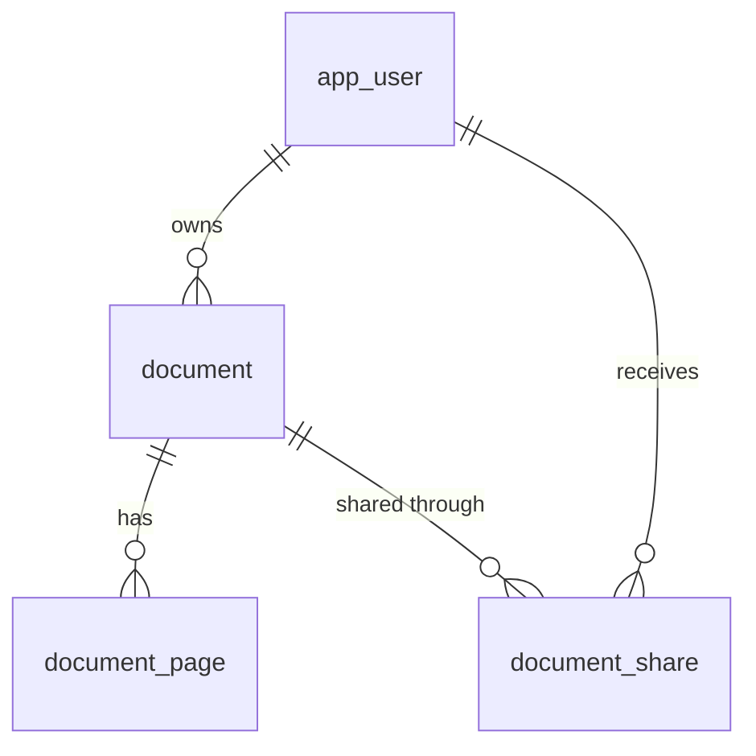

<!-- chapter: 9 | part: I | owner: writer-foundations | tag: book-m2-documents | status: expanded -->
# Chapter 9: SQL and MySQL

From milestone 2 on, the Secure Document Viewer keeps its accounts, documents, shares and audit trail in a database, so they survive restarts and can be queried safely by many users at once. This chapter teaches the SQL language and the ideas behind relational databases, using the project's real migration files as examples. By the end you will be able to read every table definition in the project and write the queries the app needs.

## Learning objectives

By the end of this chapter, you will be able to:

- Explain tables, rows, columns and keys.
- Read a `CREATE TABLE` statement, including types and constraints.
- Write `INSERT`, `SELECT`, `UPDATE` and `DELETE` statements, with `WHERE`, `ORDER BY` and `LIMIT`.
- Explain foreign keys and write a join.
- Summarize rows with `COUNT` and `GROUP BY`.
- Explain what an index is and why the project adds them.
- Explain transactions and row locks.
- Explain what a migration is and why the schema is changed only through them.
- Diagnose the common SQL errors.

## Prerequisites

- Chapter 2: The command line and your files
- Chapter 8: How the web works

## Beginner tier: Tables and queries

### 9.1 Why a database

Files on disk are fine for a PDF, but a poor place to answer "which documents can `reader.one` open?". To answer that from files, you would read every file, parse it, and hope nobody changed one while you were reading. A **database** is a program that stores data in an organized form and answers questions about it quickly, safely and for many users at once. This project uses **MySQL** 8.4, a **relational database**: one that stores data in tables and links them by keys. The language you use to talk to it is **SQL** (Structured Query Language, usually pronounced "sequel" or letter by letter).

What does the app keep in it? At `book-m6-final` there are six tables, listed in Table 9.1. Notice that the tiles themselves are not among them: images stay on disk, and the database holds the facts about them.

| Table | What it holds | Created in |
|---|---|---|
| `app_user` | Accounts: username, password hash, role | `V1` |
| `document` | One row per uploaded document | `V2` |
| `document_page` | One row per rendered page: its tile grid | `V2` |
| `document_share` | Who a private document is shared with | `V2` |
| `audit_event` | The append-only security trail | `V2` |
| `account_known_ip` | Recently used sign-in addresses (hashed) | `V3` |

*Table 9.1 — The app's tables at book-m6-final*

<!-- source: db/migration V1 to V3 at book-m6-final -->

The names `V1`, `V2` and `V3` are the migration files that create them; Section 9.11 explains those.

### 9.2 Tables, rows, columns, keys

A **table** is like a spreadsheet: it has named **columns** (the kinds of facts) and **rows** (one entry each). The `app_user` table has a column for username and one for role, and one row per account.

A **primary key** is a column (or set of columns) whose value identifies each row uniquely. It cannot be empty or repeat. In `app_user`, the key is `id`. A **foreign key** is a column that holds the primary key of a row in another table, creating a link. In `document`, the column `owner_id` holds the `id` of the owner's row in `app_user`. Figure 9.1 draws the links between four of the tables.



*Figure 9.1 — How four tables relate (crow's-foot notation: one on the left, many on the right)*

Read `app_user ||--o{ document` as "one user owns zero or more documents". The document-to-share and user-to-share links together make the many-to-many relationship that Section 9.6 explains.

**Analogy.** A table is a spreadsheet tab and a foreign key is a cell that says "see row 7 of the Users tab". The analogy breaks down because a database enforces the link: it refuses to store an `owner_id` that points to nobody. A spreadsheet would let the bad reference sit there until something broke.

### 9.3 Trying SQL against the project's database

You can run every statement in this chapter yourself, but you need a running MySQL first, and Chapter 10 is where Docker and the project's `docker-compose.yml` are taught. Docker itself was installed in the setup guide, and Chapter 10 explains what the commands do. So treat this section as a read-along now, and come back to it after Chapter 10; nothing in the rest of the chapter depends on running the commands. The steps, for when you are ready:

1. Copy `.env.example` to `.env` and fill in the password lines (Chapter 2), then start MySQL with `docker compose up -d` (Chapter 10).
2. Create the tables. Normally the app creates them itself through its migrations when it starts (Section 9.11), but the app is not running yet, so apply the three migration files yourself, in order. Each command reads one file and feeds it to the MySQL client inside the container, using the database name, user and password the container already holds, so you never type a password:

```bash
for f in src/main/resources/db/migration/V*.sql; do
  docker compose exec -T mysql sh -c 'MYSQL_PWD="$MYSQL_PASSWORD" mysql -u "$MYSQL_USER" "$MYSQL_DATABASE"' < "$f"
done
```

The `V*.sql` pattern matches the files in order (`V1`, `V2`, `V3`). Run this at `book-m6-final`, where all three exist. Treat this as a practice database: if you later start the real app against it, the app's migration tool will refuse to run on tables it did not create, so reset first with `docker compose down -v` (this deletes the database's data; Chapter 10 explains).

3. Open a SQL prompt inside the container. The command asks for the password interactively (`-p` with no value) so it never appears on the command line or in your shell history:

```bash
docker compose exec mysql mysql -u securedocs -p securedocs
```

Here `securedocs` is the default username and, as the last word, the database name from `.env.example`; use your own values if you changed them. Type the password you chose in `.env` when asked. At the `mysql>` prompt, statements end with a semicolon. Try `SHOW TABLES;` and you should see the six tables of Table 9.1. Type `exit` to leave.

### 9.4 `CREATE TABLE`, types and constraints

Every table starts with a `CREATE TABLE` statement. Here is the very first migration of the project, the accounts table.

**Listing 9.1 — `V1__create_app_user.sql` (book-m2-documents, unchanged at book-m6-final)**

```sql
-- Accounts that can sign in. Usernames are stored lower-cased by the
-- application, so the unique constraint is effectively case-insensitive.
CREATE TABLE app_user (
    id            BIGINT       NOT NULL AUTO_INCREMENT,
    username      VARCHAR(64)  NOT NULL,
    password_hash VARCHAR(100) NOT NULL,
    role          VARCHAR(20)  NOT NULL,
    enabled       BOOLEAN      NOT NULL DEFAULT TRUE,
    created_at    DATETIME(6)  NOT NULL,
    PRIMARY KEY (id),
    CONSTRAINT uk_app_user_username UNIQUE (username)
);
```

*Path: `src/main/resources/db/migration/V1__create_app_user.sql`*

Line by line:

- `--` starts a comment.
- `CREATE TABLE app_user ( ... );` defines the table. Each line inside is a column: a name, a **type**, and optional rules.
- `BIGINT` is a large whole number; `VARCHAR(64)` is text up to 64 characters; `BOOLEAN` is true or false; `DATETIME(6)` is a date and time with microsecond precision.
- `NOT NULL` means the column cannot be empty. SQL's `NULL` means "unknown or missing", like Chapter 5's `null`.
- `AUTO_INCREMENT` makes the database assign the next number to `id`, so each new account gets a fresh key.
- `DEFAULT TRUE` supplies a value when the row does not give one.
- `PRIMARY KEY (id)` declares the key.
- `CONSTRAINT uk_app_user_username UNIQUE (username)` is a **constraint**, a rule the database enforces: no two accounts may share a username. Enforcing it in the database is safer than only checking in Java, because two simultaneous account-creation requests cannot both slip through.

Notice `password_hash`, not `password`. The database never stores the password itself, only a one-way scrambled form (Chapter 15). And notice that `role` is `VARCHAR(20)`: the Java enum `Role` from Chapter 4 is stored as its name, `READER`, `PUBLISHER` or `ADMIN`, as text.

Table 9.2 lists the types you will meet in the project's migrations.

| Type | Holds | Example column |
|---|---|---|
| `INT`, `BIGINT` | Whole numbers (about 2 billion and about 9 quintillion at most) | `page_count`, `id` |
| `VARCHAR(n)` | Text up to `n` characters | `title`, `username` |
| `BOOLEAN` | true or false | `enabled` |
| `DATETIME(6)` | A date and time, to the microsecond | `created_at` |

*Table 9.2 — Column types used in the migrations*

Choosing a size is a design decision with consequences. `VARCHAR(64)` for a username means a 65th character is refused by the database. The app's Java code also checks such limits, but the database is the last line of defense.

### 9.5 INSERT, SELECT, UPDATE, DELETE

Four statements cover everyday work. Example 9.1 uses the table above; the values are made up for teaching, and in the app Java code sends these statements for you (Chapter 14).

**Example 9.1 — The four everyday statements**

```sql
INSERT INTO app_user (username, password_hash, role, created_at)
VALUES ('pub.one', '<password-hash>', 'PUBLISHER', NOW(6));

SELECT username, role FROM app_user WHERE enabled = TRUE ORDER BY username;

UPDATE app_user SET role = 'ADMIN' WHERE username = 'pub.one';

DELETE FROM app_user WHERE username = 'pub.one';
```

- `INSERT` adds a row; you name the columns and give matching values. Columns you leave out use their default (`enabled` becomes true). Text values use single quotes.
- `SELECT` reads. It lists columns, then `FROM` a table, then an optional `WHERE` filter and an `ORDER BY`.
- `UPDATE` changes existing rows, and `WHERE` decides which. Forget `WHERE` and every row changes.
- `DELETE` removes rows, with the same warning.

`SELECT` has more clauses worth knowing. `LIMIT` caps how many rows come back. `LIKE` matches text with wildcards, where `%` means "anything". `COUNT` counts rows. Combine them:

**Example 9.2 — More of SELECT**

```sql
SELECT COUNT(*) FROM app_user WHERE role = 'READER';

SELECT username FROM app_user WHERE username LIKE 'pub%' ORDER BY username LIMIT 20;
```

The first counts readers. The second lists up to 20 usernames that start with `pub`, in alphabetical order. That second query is exactly the shape of the app's share picker, which Chapter 14 shows being generated from a method name: `findTop20ByEnabledTrueAndUsernameStartingWithOrderByUsernameAsc` reads as "top 20, enabled true, username starting with, order by username ascending". <!-- source: AppUserRepository.java at book-m6-final -->

#### The danger of UPDATE and DELETE

The rule about `WHERE` is worth an example, because it is the way real data gets damaged. Suppose some audit rows were written five and a half hours ahead because a server used local time (a bug this project really had, Chapter 5). A fix would shift those rows back. The safe way is to look before you change:

**Example 9.3 — Look, then change (teaching example)**

```sql
SELECT COUNT(*) FROM audit_event WHERE occurred_at > NOW(6);

UPDATE audit_event
SET occurred_at = DATE_SUB(occurred_at, INTERVAL 330 MINUTE)
WHERE occurred_at > NOW(6);
```

Run the `SELECT` first, with the same `WHERE`, and check that the count is what you expect. Only then run the `UPDATE`. Never run a statement like this on data you care about without a backup, and note that `NOW(6)` uses the database server's own time zone setting, which is the very thing that caused the original problem. The real project did exactly one such one-off correction to a small number of rows after the owner approved it; the exact statement is not reproduced here. <!-- source: dossier decisions.md (line 4409: one-off UPDATE fixing 25 wrong-timezone audit rows, approved by the project's owner); bugs-and-findings.md C6 -->

## Intermediate tier: Relationships and speed

### 9.6 Relationships: foreign keys and joins

Documents and users are related: every document has one owner, and a document can be shared with many users, each of whom can see many documents. The second kind, **many-to-many**, needs a third table that holds pairs. The project's second migration creates these tables.

**Listing 9.2 — `V2__documents_shares_audit.sql` (book-m2-documents, unchanged at book-m6-final; simplified: two tables and the indexes omitted)**

```sql
CREATE TABLE document (
    id          VARCHAR(36)  NOT NULL,
    title       VARCHAR(200) NOT NULL,
    owner_id    BIGINT       NOT NULL,
    visibility  VARCHAR(20)  NOT NULL,
    page_count  INT          NOT NULL,
    tile_size   INT          NOT NULL,
    created_at  DATETIME(6)  NOT NULL,
    updated_at  DATETIME(6)  NOT NULL,
    PRIMARY KEY (id),
    CONSTRAINT fk_document_owner FOREIGN KEY (owner_id) REFERENCES app_user (id)
);

-- ...

CREATE TABLE document_share (
    document_id VARCHAR(36) NOT NULL,
    user_id     BIGINT      NOT NULL,
    PRIMARY KEY (document_id, user_id),
    CONSTRAINT fk_document_share_document FOREIGN KEY (document_id) REFERENCES document (id) ON DELETE CASCADE,
    CONSTRAINT fk_document_share_user FOREIGN KEY (user_id) REFERENCES app_user (id) ON DELETE CASCADE
);
```

*Path: `src/main/resources/db/migration/V2__documents_shares_audit.sql`*

Reading it:

- `document.id` is a `VARCHAR(36)`, not a number. Thirty-six characters is the length of a UUID (a randomly generated identifier such as `123e4567-e89b-12d3-a456-426614174000`), so document identifiers cannot be guessed by counting up, unlike an `AUTO_INCREMENT` number. That matters for a security product: a guessable id is an invitation to probe.
- `document.owner_id` is a foreign key to `app_user.id`. The database refuses a document whose owner does not exist.
- `document_share` is a **join table**: each row says "this user may open this document". Its primary key is the *pair* `(document_id, user_id)`, so the same share cannot be recorded twice, which is exactly Chapter 5's set behavior, enforced by the database.
- `ON DELETE CASCADE` means: when the referenced row is deleted, delete these rows too. Deleting a document removes its shares automatically, so no orphaned shares remain.

Note what is missing from `document`: a foreign key does not say what happens on `DELETE` for `owner_id`. By default the database refuses to delete a user who still owns documents. That is deliberate. The project never deletes users at all (it disables them), so their audit history and ownership stay meaningful.

A **join** combines rows from two tables in a query. This teaching query lists documents with their owners' usernames:

**Example 9.4 — A join**

```sql
SELECT d.title, u.username AS owner
FROM document d
JOIN app_user u ON u.id = d.owner_id
WHERE d.visibility = 'EVERYONE';
```

`d` and `u` are short aliases for the tables, and `ON` says how rows match: the document's `owner_id` equals the user's `id`. `AS owner` renames the output column. A plain `JOIN` keeps only rows that match on both sides. Its sibling `LEFT JOIN` keeps every row from the left table even with no match, which the app needs to list a document that has no shares.

The app writes such queries in a Java-flavored language called JPQL, and the framework translates it to SQL (Chapter 14). Here is the query behind the library page, so you can see joins in the project.

**Listing 9.3 — `DocumentRepository.java` (book-m6-final, excerpt: query `findVisibleTo`)**

```java
    @Query("""
            select distinct d from Document d
            join fetch d.owner
            left join d.sharedWith s
            where d.visibility = :everyone or d.owner.username = :username or s.username = :username
            order by d.createdAt desc
            """)
    List<Document> findVisibleTo(@Param("username") String username, @Param("everyone") Visibility everyone);
```

*Path: `src/main/java/com/example/securedocviewer/document/DocumentRepository.java`*

Read it as English. Take documents joined to their owner, and also, if there are any, to the users they are shared with (`left join`). Keep a document if it is visible to everyone, or the caller owns it, or the caller is one of the users it is shared with. Sort newest first. `distinct` removes duplicates that the join creates when a document has several shares. The words after a colon (`:username`) are placeholders the framework fills in safely; the box below explains why that matters.

#### A word on SQL injection

Suppose a program builds its query by gluing text together, and a user types their name into a form:

**Example 9.5 — A dangerous way to build SQL (teaching example; never do this)**

```java
String sql = "SELECT * FROM app_user WHERE username = '" + name + "'";
```

If `name` is `pub.one`, the query is what you expect. But if a person types `x' OR '1'='1`, the text becomes `SELECT * FROM app_user WHERE username = 'x' OR '1'='1'`, and the condition `'1'='1'` is always true, so the query returns every account. The input has escaped from being data and become part of the SQL itself. This attack is called **SQL injection**, and it has caused some of the worst data breaches on record. The defense is to keep the SQL and the values separate: write the SQL with a placeholder, and hand the value over on its own, so the database treats it strictly as a value and never as SQL. That is what `:username` above does, and what every query in this project does. Chapter 14, on how the app talks to its database, shows the framework filling those placeholders in.

### 9.7 Summaries: COUNT and GROUP BY

Often you want a summary, not rows. `GROUP BY` collects rows that share a value and applies a function such as `COUNT` to each group. The audit trail is a natural place to use it.

**Example 9.6 — Counting events by type**

```sql
SELECT event_type, COUNT(*) AS events
FROM audit_event
GROUP BY event_type
ORDER BY events DESC;
```

The result has one row per kind of event (`SIGN_IN`, `PAGE_VIEWED`, `ACCESS_DENIED` and so on) with how many of each, largest first. The same idea answers "how many failed sign-ins did this user have?": add `WHERE username = 'reader.one' AND event_type = 'SIGN_IN_FAILED'` before the `GROUP BY`, or drop the `GROUP BY` and use a plain `COUNT(*)`.

### 9.8 Indexes: why some queries are fast

Without help, finding all documents for one owner means reading every row. An **index** is a sorted lookup structure on one or more columns, like the index of a book: the database jumps straight to matching rows. (Unlike a printed index, the database keeps its index up to date automatically, which is exactly the write cost mentioned next.) The cost is extra storage and slightly slower writes, because every insert must also update the index. So you add indexes for queries you actually run. The project's second migration adds several.

**Listing 9.4 — `V2__documents_shares_audit.sql` (book-m2-documents, unchanged at book-m6-final; excerpt: indexes)**

```sql
CREATE INDEX ix_document_owner ON document (owner_id);

CREATE INDEX ix_document_share_user ON document_share (user_id);

CREATE INDEX ix_audit_event_time ON audit_event (occurred_at);
CREATE INDEX ix_audit_event_user_time ON audit_event (username, occurred_at);
```

*Path: `src/main/resources/db/migration/V2__documents_shares_audit.sql`*

`ix_document_owner` speeds up "documents owned by this user", and `ix_document_share_user` speeds up "documents shared with this user", which the library page needs on every load. The audit table is append-only and grows without limit, so its indexes let an administrator filter by time or by user without scanning millions of rows. An index on `(username, occurred_at)` serves both "this user's events" and "this user's events in this time range", because the database can use the leftmost columns of a multi-column index on their own: a lookup by `username` alone can use the index above, while a lookup by `occurred_at` alone cannot. The migration also indexes `(document_id, occurred_at)` and `(event_type, occurred_at)`, for the audit page's other filters.

Primary keys and `UNIQUE` constraints create indexes automatically, which is why `username` is fast to look up without an explicit `CREATE INDEX`.

The per-tile access check runs for every single tile and is written to be, in the source's own words, "one indexed query, no entity loading". <!-- source: DocumentRepository.findTileAccessIfVisible comment at book-m6-final --> That comment is a performance promise: a page of 12 tiles triggers 12 of these checks, so each must be cheap.

If you want to see whether a query uses an index, put `EXPLAIN` in front of it. The output names the index it chose, or says it scans the whole table.

### 9.9 Design choices worth noticing

Two details in the migration files show real design thinking.

The first is a naming decision. The `document_page` table stores the tile grid, and its columns are called `tile_rows` and `tile_cols`. The migration's own comment says why: "Column names avoid ROWS, which is reserved in MySQL 8." A **reserved word** is a word SQL already uses, so it cannot be used as a plain name. The Java class `DocumentPage` keeps the natural name `rows` for its field, and an annotation, `@Column(name = "tile_rows")` (Chapter 4's annotations), maps it to the column: the mapping absorbs the difference, and the record `PageInfo` that reaches the browser still says `rows`. <!-- source: V2__documents_shares_audit.sql comment at book-m2-documents -->

The second is the audit table. Here is how it is described in the migration.

**Listing 9.5 — `V2__documents_shares_audit.sql` (book-m2-documents, unchanged at book-m6-final; excerpt: the audit table)**

```sql
-- Append-only security/audit trail. Deliberately denormalised (username and
-- document title are copied, not foreign keys) so records stay readable after
-- the account or document they mention is renamed or deleted.
CREATE TABLE audit_event (
    id             BIGINT       NOT NULL AUTO_INCREMENT,
    occurred_at    DATETIME(6)  NOT NULL,
    event_type     VARCHAR(40)  NOT NULL,
    username       VARCHAR(64)  NULL,
    session_handle VARCHAR(32)  NULL,
    client_ip      VARCHAR(45)  NULL,
    document_id    VARCHAR(36)  NULL,
    document_title VARCHAR(200) NULL,
    page_index     INT          NULL,
    tile_row       INT          NULL,
    tile_col       INT          NULL,
    detail         VARCHAR(255) NULL,
    PRIMARY KEY (id)
);
```

*Path: `src/main/resources/db/migration/V2__documents_shares_audit.sql`*

Everywhere else in the schema, tables point to each other with foreign keys. Here the table deliberately does not. **Denormalized** means storing a copy of information instead of a link. If `audit_event` pointed to `document` by foreign key, deleting a document would either be refused or erase its history; copying the title and username keeps the record readable forever, which is what an audit trail is for. Notice too that most columns are `NULL`: a sign-in event has no document, and a page view has no detail. The rule to take away is that normalization (keeping each fact in exactly one place, avoiding copies) is a default and not a law; break it when you can say why.

## Advanced tier: Safety over time

### 9.10 Transactions and locks

A **transaction** groups several statements so they all succeed or none do. Replacing a PDF means writing new tile files, then switching the document to the new version; if it fails halfway, the reader must still see a consistent document. A transaction guarantees that: either the whole change is committed, or all of it is rolled back and the database is as if it never started.

Two people changing the same document at once is a second problem. A **lock** makes one wait for the other. The project asks the database for a **row lock** when replacing or deleting a document:

**Listing 9.6 — `DocumentRepository.java` (book-m6-final, excerpt)**

```java
    /** Row lock for replace/delete, so concurrent changes to one document are serialised. */
    @Lock(LockModeType.PESSIMISTIC_WRITE)
    @Query("select d from Document d where d.id = :id")
    Optional<Document> findByIdForUpdate(@Param("id") String id);
```

*Path: `src/main/java/com/example/securedocviewer/document/DocumentRepository.java`*

`PESSIMISTIC_WRITE` means "assume there will be a conflict and lock the row now". While one request holds the lock, a second request for the same document waits its turn. The chapter on JPA (Chapter 14) covers the details and the alternatives. In SQL terms, this is `SELECT ... FOR UPDATE`.

The lock is part of a bigger design. When a PDF is replaced, the app renders the new tiles into a new version folder, and then, under this row lock, switches the document's row to the new version in one transaction. Readers holding old tile URLs then get a `410` instead of a mix of old and new tiles. That design (Chapter 30) exists because an early version of replace could show a page assembled from old and new tiles. <!-- source: dossier decisions.md (commit cd0f5c2, versioned tiles under a row lock); bugs-and-findings.md -->

#### A real incident: the audit rows that were never saved

Transactions also caused a bug in the audit trail. The symptom: `ACCESS_DENIED` events, the record that someone asked for a document they may not see, were never saved. The cause was that the audit write shared the transaction of the request that was being refused. When that request failed with an error, its transaction rolled back, and the audit row went with it, so the events that most needed recording disappeared exactly when they mattered. A test caught it. The fix was to write audit events in their own, separate transaction, so a rollback of the request cannot erase the record of it. The lesson: audit records must not depend on the success of the thing they record. <!-- source: dossier bugs-and-findings.md C3; commit ba00693 -->

### 9.11 Migrations: changing a schema safely over time

A **schema** is the set of tables and columns. It has to change as the app grows, and the changes must apply identically on your machine, in tests and in production. A **migration** is a numbered SQL file that makes one change. **Flyway**, the migration tool the project uses, runs the files in order when the app starts, skips the ones it has already applied, and records what ran in its own table.

The project has three migrations, and the name pattern matters: `V1__create_app_user.sql`, `V2__documents_shares_audit.sql`, `V3__tile_versions_and_account_security.sql`. `V` plus a version, two underscores, and a description. The third one changes existing tables:

**Listing 9.7 — `V3__tile_versions_and_account_security.sql` (book-m6-final, excerpt)**

```sql
ALTER TABLE document ADD COLUMN tile_version INT NOT NULL DEFAULT 0;

-- Admin-set passwords (new accounts, resets) must be changed at first sign-in.
ALTER TABLE app_user ADD COLUMN must_change_password BOOLEAN NOT NULL DEFAULT FALSE;
ALTER TABLE app_user ADD COLUMN last_sign_in_at DATETIME(6) NULL;
```

*Path: `src/main/resources/db/migration/V3__tile_versions_and_account_security.sql`*

`ALTER TABLE ... ADD COLUMN` changes a table that already holds rows. The `DEFAULT` values matter: existing rows need something to put in the new column, and `NOT NULL` without a default would fail. (`V3` is part of `book-m5-platform` and later; `book-m2-documents` has `V1` and `V2` only.) <!-- source: git ls-tree of tags -->

The rule is: **never edit a migration that has already run somewhere.** Flyway checks that applied files have not changed and refuses to start if they have. To change the schema, add a new migration. The configuration sets `hibernate.ddl-auto: none` with the comment "Flyway owns the schema; Hibernate never alters it", so there is exactly one authority. <!-- source: application.yml at book-m6-final -->

Why this discipline? Consider the alternative: someone changes a column by hand on the production database and forgets to record it. Now no other environment matches, and a later deploy fails in a way nobody can reproduce. Migrations turn the schema into code that is reviewed, versioned in Git (Chapter 7) and tested like anything else.

The project tests its schema against two databases. Most tests use H2, a small in-memory database run in a mode that imitates MySQL, so they need nothing installed. A reviewer then asked for a test against the real engine, and the project added `MySqlIntegrationTest`, which starts an actual MySQL 8.4 in a container (Chapters 6 and 10) and runs the migrations there. That test also checks that timestamps survive a database server set to a different time zone. A migration that works on H2 is not proven to work on MySQL; the second test closes that gap. <!-- source: dossier decisions.md (H2 in MySQL mode; MySqlIntegrationTest, commit a51674c) -->

### 9.12 Common mistakes

**`UPDATE` or `DELETE` without `WHERE`.** Every row changes or disappears. Run the same `WHERE` in a `SELECT` first and read the count.

**Double quotes around text.** In MySQL, text values use single quotes: `'PUBLISHER'`. Double quotes are for identifiers in some modes and cause confusing errors.

**Comparing to `NULL` with `=`.** `WHERE detail = NULL` matches nothing, because `NULL` is "unknown" and nothing equals it. Use `IS NULL` or `IS NOT NULL`.

**A reserved word as a column name.** A name such as `rows` or `order` fails with a syntax error. Pick another, as the project did with `tile_rows`.

**"Cannot delete or update a parent row: a foreign key constraint fails."** You tried to delete a row that other rows still reference. Delete or reassign the children first, or declare `ON DELETE CASCADE` where that is what you mean.

**"Duplicate entry ... for key ..."** You broke a unique constraint, such as a second user with the same username. It is the database doing its job; the app translates it into a friendly `409 Conflict` (Chapter 8).

**"Migration checksum mismatch."** (A checksum is a fingerprint of a file's contents, recorded when the migration first ran.) Someone edited a migration that Flyway had already applied. Restore the file to its original contents and put the change in a new migration.

**Forgetting the semicolon.** In the `mysql>` prompt, a statement is not run until you end it with `;`. The prompt changes to `->` while it waits.

**Times that look wrong.** A `DATETIME` has no time zone of its own. The project stores UTC everywhere (Chapter 5); reading it back in a different zone shifts it.

## In this project

- `src/main/resources/db/migration/`: the three migrations, `V1` to `V3`.
- `document/Document.java`, `account/AppUser.java`: Java classes that map onto `document` and `app_user`.
- `document/DocumentRepository.java`: queries, including the row lock.
- `docker-compose.yml`: starts MySQL 8.4 (Chapter 10).
- `MySqlIntegrationTest`: the real-database check of the migrations (Chapter 18).

## Try it

### Exercise 9.1 ★ Read a table

Open `V2__documents_shares_audit.sql` at `book-m2-documents` and find the column that records who owns a document. What is its type, and why can't it be empty?

*Hint:* look for `NOT NULL` and the foreign key.

*Solution:* Appendix C, Exercise 9.1.

### Exercise 9.2 ★ Write a query

Write a `SELECT` that lists the titles of all documents whose visibility is `PRIVATE`, newest first.

*Solution:* Appendix C, Exercise 9.2.

### Exercise 9.3 ★★ Write a migration

On a branch, write `V4__add_document_description.sql` that adds an optional `description` column of up to 500 characters to `document`. Why must the column allow `NULL`, or have a default?

*Solution:* Appendix C, Exercise 9.3.

### Exercise 9.4 ★★ Count and group

Write a query that shows, for each `role` in `app_user`, how many accounts have it. Then write one that shows how many are `enabled` and how many are not.

*Solution:* Appendix C, Exercise 9.4.

### Exercise 9.5 ★★ Join three tables

Using `document`, `document_share` and `app_user`, write a query that lists each document title together with the usernames it is shared with. Which kind of join do you need if you also want documents that are shared with nobody?

*Solution:* Appendix C, Exercise 9.5.

### Exercise 9.6 ★★★ Design a table

The project might one day store comments on documents. Design a `document_comment` table: choose columns and types, a primary key, and foreign keys to `document` and `app_user`. Decide what should happen to comments when a document is deleted, and when a user is disabled, and defend your choices with reference to `ON DELETE` and to the audit table's denormalization.

*Solution:* Appendix C, Exercise 9.6.

## Summary

- A relational database stores data in tables linked by keys, and SQL is the language for it.
- `CREATE TABLE` defines types and constraints; the database enforces them.
- `INSERT`, `SELECT`, `UPDATE` and `DELETE` cover everyday work; `WHERE` matters, and `COUNT` with `GROUP BY` summarizes.
- Foreign keys link tables, joins combine them, and indexes make chosen queries fast at a cost.
- Transactions and locks keep concurrent changes safe, and audit records need their own transaction.
- Migrations change the schema in numbered, never-edited steps, tested against the real database engine.

## Further reading

- *MySQL 8.4 Reference Manual*, "Data Types" and "SQL Statements." https://dev.mysql.com/doc/refman/8.4/en/
- *MySQL 8.4 Reference Manual*, "Keywords and Reserved Words." https://dev.mysql.com/doc/refman/8.4/en/keywords.html
- *Flyway Documentation*, "Migrations." https://documentation.red-gate.com/flyway
