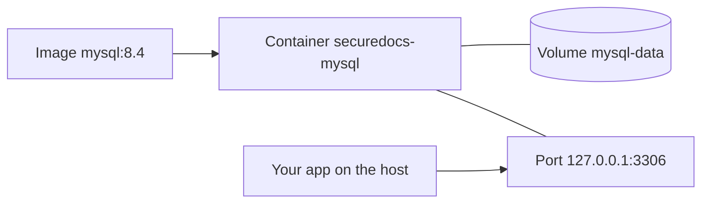

<!-- chapter: 10 | part: I | owner: writer-foundations | tag: book-m6-final | status: expanded -->
# Chapter 10: Containers and Docker

The app needs MySQL, and later a web server and more. Installing each by hand on every machine would be slow and error-prone. Docker lets you run each program in a sealed, repeatable package. This chapter teaches images, containers, volumes and Docker Compose, using the project's real `docker-compose.yml` and `Dockerfile`, and finishes Part I. After it, you will be able to start the project's database with one command and read every line of the file that describes the whole stack.

## Learning objectives

By the end of this chapter, you will be able to:

- Explain why containers exist and how they differ from virtual machines.
- Distinguish an image, a container, a volume and a network, and inspect each with a command.
- Start the project's MySQL database with Docker Compose and check that it is healthy.
- Read a Compose file, including ports, volumes, environment, profiles, networks and health checks.
- Explain how secrets reach a container without being committed or baked into an image.
- Read a two-stage `Dockerfile` and explain why its steps are in that order.
- Diagnose the common Docker problems.

## Prerequisites

- Chapter 2: The command line and your files
- Chapter 8: How the web works
- Chapter 9: SQL and MySQL

## Beginner tier: Packages that run anywhere

### 10.1 Why containers exist

"It works on my machine" is a classic failure. The database version differs, a library is missing, a setting is different. **Docker** solves this by running programs in **containers**: isolated processes that bring their own files and settings. A container sees its own small filesystem and its own network, and cannot see your other files unless you allow it.

Compare this with a **virtual machine**, which pretends to be a whole computer and boots a whole operating system inside your computer. A container is lighter. It shares your computer's operating system core and starts in seconds, where a virtual machine takes a minute and gigabytes. The cost is weaker isolation than a virtual machine offers, which is one reason the project also hardens its images (Section 10.9).

**Analogy.** A container is a shipping container: it holds anything, looks the same to every ship and crane, and needs no knowledge of what is inside. The analogy breaks down in two ways. A shipping container is inert cargo, while a Docker container is a running program. And a shipping container is sealed from the outside, while a Docker container is open to exactly the doors (ports) and shared folders (volumes) you choose to give it.

What does this buy the project? Three things:

- **Repeatability.** The MySQL 8.4 you run is the same MySQL 8.4 that the automated checks run and that production runs.
- **Cleanliness.** You do not install MySQL on your computer. When you are finished, you remove the container and nothing is left behind.
- **A description you can read.** The whole stack is written down in a file, so nobody has to remember the setup steps.

### 10.2 Images, containers, volumes and networks

Four words carry the whole idea.

- An **image** is a read-only template containing a program and everything it needs. `mysql:8.4` is an image.
- A container is a running instance of an image. You can start many containers from one image.
- A **volume** is storage that lives outside a container. A container's own files vanish when it is removed; a volume survives. The database's data must live in a volume, or every restart would erase the accounts.
- A **network** connects containers so they can reach each other by name.

Your own computer, which runs Docker, is called the **host**. The relationship is the same as a class and its objects in Chapter 4, though only partly (an image is built in layers and is read-only): an image is the blueprint and a container is one live copy. Figure 10.1 shows how the pieces of the project's local setup relate.



*Figure 10.1 — An image, its container, its volume and its published port*

*Text description:* Five boxes connected by lines. The image `mysql:8.4` starts the container `securedocs-mysql`. That container is attached to the volume `mysql-data` and to the published port `127.0.0.1:3306`, and your app running on the host connects to that port.

<!-- source: docker-compose.yml, service mysql (image, container_name, volumes, ports) at book-m6-final -->


Docker fetches images from a **registry**, a public store; Docker Hub is the default. Images have a tag after the colon (`mysql:8.4`), the same idea as Chapter 7's Git tags but for images. An image is built in **layers**, each the result of one step. Docker stores each layer once and reuses it, which is why pulling a second image that shares layers is fast.

### 10.3 Your first containers

Install Docker Desktop (Windows and macOS) or Docker Engine (Linux) from docs.docker.com. Check that it works:

```bash
docker --version
docker run --rm hello-world
```

`docker run` starts a container from an image, downloading the image first if it is not on your computer. `hello-world` is a tiny image that prints a message and exits; `--rm` deletes the container afterward. You should see something like this:

```text
Hello from Docker!
This message shows that your installation appears to be working correctly.
...
```

Now three commands that show what Docker holds:

```bash
docker images
docker ps
docker ps -a
```

`docker images` lists the images on your computer. `docker ps` lists running containers, and `docker ps -a` adds stopped ones. After the `--rm` run of `hello-world` in this section, `hello-world` shows in `docker images` but not in `docker ps -a`, because its container was removed and its image was not.

## Intermediate tier: Docker Compose

### 10.4 Running MySQL 8.4 with Docker

You could start MySQL with one long `docker run` command, but you would have to retype it exactly, and a long command invites typing mistakes. **Docker Compose** describes one or more containers in a file, `docker-compose.yml`, and starts them with one command. It is written in YAML, the indentation-based format from Chapter 8.

The database first appears at `book-m1-accounts`, where the file held only MySQL. Here it is, in full, exactly as it was at that milestone.

**Listing 10.1 — `docker-compose.yml` (book-m1-accounts)**

```yaml
# Local development database. Usage: `docker compose up -d` from this folder.
# Credentials come from the git-ignored .env file (copy .env.example).
services:
  mysql:
    image: mysql:8.4
    container_name: securedocs-mysql
    restart: unless-stopped
    environment:
      MYSQL_DATABASE: ${DB_NAME:-securedocs}
      MYSQL_USER: ${DB_USERNAME:-securedocs}
      MYSQL_PASSWORD: ${DB_PASSWORD:?Set DB_PASSWORD in .env}
      MYSQL_ROOT_PASSWORD: ${DB_ROOT_PASSWORD:?Set DB_ROOT_PASSWORD in .env}
    ports:
      # Bound to localhost only; the database is never exposed to the network.
      - "127.0.0.1:${DB_PORT:-3306}:3306"
    volumes:
      - mysql-data:/var/lib/mysql
    healthcheck:
      test: ["CMD", "mysqladmin", "ping", "-h", "localhost", "-u", "root", "-p${DB_ROOT_PASSWORD}"]
      interval: 5s
      timeout: 5s
      retries: 20

volumes:
  mysql-data:
```

*Path: `docker-compose.yml`*

From the repository folder, with your `.env` in place (Chapter 2), start it:

```bash
docker compose up -d
```

`up` starts what the file describes, and `-d` (detached) runs it in the background. The first time, Docker downloads the MySQL image. Then check on it:

```bash
docker compose ps
```

You should see something like this, with the state moving from `starting` to `healthy` after a few seconds:

```text
NAME               IMAGE       ...   STATUS
securedocs-mysql   mysql:8.4   ...   Up 12 seconds (healthy)
```

To read what the database is saying, and to stop it when you are done:

```bash
docker compose logs mysql
docker compose down
```

Notice that Compose commands use the *service* name from the file (`mysql`), not the container name (`securedocs-mysql`). If you came here from Chapter 9's hands-on section, `docker compose up -d` is the command it needed.

`down` removes the containers but keeps the volume, so your data survives. Adding `-v` would delete the volumes too, and with them all the data, so use it only when you mean to.

The project chose this setup deliberately. When the implementer offered a zero-install embedded database (H2) as the recommended option for storage, the project's owner overrode it and asked for MySQL through Docker, because it is a real database engine of the kind used in production. <!-- source: dossier decisions.md D2 -->

### 10.5 Reading the Compose file line by line

Here is the MySQL service from the final version of the file.

**Listing 10.2 — `docker-compose.yml` (book-m6-final, excerpt: service `mysql`)**

```yaml
services:
  mysql:
    image: mysql:8.4@sha256:85b9bf2e29cf836ecb8c2a15a935d4ba0c606631dff1dd79531a11983c638f2a
    container_name: securedocs-mysql
    restart: unless-stopped
    environment:
      MYSQL_DATABASE: ${DB_NAME:-securedocs}
      MYSQL_USER: ${DB_USERNAME:-securedocs}
      MYSQL_PASSWORD: ${DB_PASSWORD:?Set DB_PASSWORD in .env}
      MYSQL_ROOT_PASSWORD: ${DB_ROOT_PASSWORD:?Set DB_ROOT_PASSWORD in .env}
    ports:
      # Bound to localhost only; the database is never exposed to the network.
      - "127.0.0.1:${DB_PORT:-3306}:3306"
    volumes:
      - mysql-data:/var/lib/mysql
    healthcheck:
      # $$ defers expansion to the container, so the password never appears in
      # the stored command (docker inspect); MYSQL_PWD keeps it off the argv.
      test: ["CMD-SHELL", "MYSQL_PWD=\"$$MYSQL_ROOT_PASSWORD\" mysqladmin ping -h localhost -u root --silent"]
      interval: 5s
      timeout: 5s
      retries: 20
```

*Path: `docker-compose.yml`*

Line by line:

- `image: mysql:8.4@sha256:...` names the image, its tag, and a **digest**: a fingerprint of the exact image contents. A tag can be re-pointed to a newer image; a digest cannot. Pinning by digest means a rebuild gets exactly the reviewed image, as the project's own comment in the file explains.
- `restart: unless-stopped` restarts the container after a crash or reboot, unless you stopped it on purpose.
- `environment:` sets environment variables inside the container (Chapter 2). The MySQL image reads them on first start to create the database and user. `${DB_NAME:-securedocs}` means "the value of `DB_NAME` from `.env`, or `securedocs` if unset". `${DB_PASSWORD:?Set DB_PASSWORD in .env}` means "required": Compose stops with that message if the variable is missing.
- `ports: "127.0.0.1:3306:3306"` publishes container port 3306 to your computer's port 3306, but only on `127.0.0.1`. That means no other machine can connect (Chapter 2).
- `volumes: mysql-data:/var/lib/mysql` attaches a named volume at the folder where MySQL keeps its data. The volume is declared at the bottom of the file.
- `healthcheck` runs a command every 5 seconds to test whether MySQL is really answering. A container can be running but not yet ready; the health check tells other services when they can begin.

Compare the health check in Listing 10.1 with the one here. The early version passed the password on the command line as `-p${DB_ROOT_PASSWORD}`. The final version changed it: `$$` defers the variable's expansion until the command runs inside the container, and the password is passed through the environment variable `MYSQL_PWD`, not as an argument. The stated reason is that the password then never appears in the stored command (which `docker inspect` would reveal) or in the process's argument list (which other users of the machine could see). It is a small change with a general lesson: a secret on a command line is visible in more places than you expect.

Be honest about what the change achieves, though, because the MySQL 8.4 manual is blunt about `MYSQL_PWD`. It says that using `MYSQL_PWD` to specify a password "must be considered extremely insecure", because on some systems any user who can list processes can also see their environment. It also says that the variable "is deprecated as of MySQL 8.4" and may be removed in a future version. The trade the project made is narrower than "secure". The password is gone from the command line and from the stored command. Inside the container, only that container's own processes can see the environment. A stricter option is an **option file**, a small configuration file for the MySQL client that holds the password and is readable only by its owner (mode `400` or `600`); you point the client at it with `--defaults-extra-file`. The manual also describes `mysql_config_editor`, which stores credentials in an obscured login file. Chapter 34 uses `MYSQL_PWD` for its backup commands for the same reason as here, and you should treat either approach as a step up from `-p` on the command line, not as the last word. <!-- source: MySQL 8.4 Reference Manual, "Environment Variables" (MYSQL_PWD) and "End-User Guidelines for Password Security" (option files, file mode 400 or 600), checked 2026-09-20 --> <!-- source: docker-compose.yml comments at book-m6-final; git log -S MYSQL_PWD (commit 1ce2c8b, "Ultrareview prep") -->

### 10.6 Profiles, networks and the full stack

A Compose file can hold several services. The final file adds `app` (the backend), `web` (the frontend server) and `tls` (an optional HTTPS front end). It uses **profiles** so that you start only what you need. The header comment lists the three ways to run it:

**Listing 10.3 — `docker-compose.yml` (book-m6-final, excerpt: header comment)**

```yaml
# Local development:  `docker compose up -d`                    -> MySQL only (run the app with mvnw / ng serve)
# Full stack:         `docker compose --profile full up -d --build` -> MySQL + API + web at http://localhost:8081
# With HTTPS:         `docker compose --profile full --profile tls up -d --build` -> also https://localhost:8443
```

*Path: `docker-compose.yml`*

A service with `profiles: ["full"]` starts only when you ask for that profile, so plain `docker compose up -d` gives you only MySQL, which is what you want while developing. Here is the backend service.

**Listing 10.4 — `docker-compose.yml` (book-m6-final, excerpt: service `app`)**

```yaml
  app:
    profiles: ["full"]
    build: .
    container_name: securedocs-app
    restart: unless-stopped
    # The JVM sizes its heap from this (MaxRAMPercentage=75); rendering is bounded by
    # max-concurrent-renders, so a PDF can't take the host down with it.
    mem_limit: 1536m
    env_file: .env
    environment:
      DB_HOST: mysql
      DB_PORT: "3306"
      STORAGE_ROOT: /data/storage
      # Behind nginx: trust X-Forwarded-For so throttling and audit see real client IPs...
      FORWARD_HEADERS_STRATEGY: native
      # ...but only from nginx itself (its fixed address below). Any other container
      # on this network that talks to app:8080 directly is judged by its own address.
      TRUSTED_PROXY_REGEX: '172\.28\.0\.10'
    volumes:
      - app-storage:/data/storage
    depends_on:
      mysql:
        condition: service_healthy
    # Not published: only reachable through the web container.
    expose:
      - "8080"
    healthcheck:
      test: ["CMD", "curl", "-fsS", "-o", "/dev/null", "http://localhost:8080/actuator/health"]
      interval: 10s
      timeout: 5s
      start_period: 60s
      retries: 6
```

*Path: `docker-compose.yml`*

Several ideas appear at once, and each one connects to something you know.

- `build: .` means "build the image from the `Dockerfile` in this folder" (Section 10.8), instead of downloading one.
- `env_file: .env` passes every variable in your `.env` into the container, and `environment:` then adds or overrides some. Notice `DB_HOST: mysql`. Inside the Compose network, each service is reachable by its **service name**, so the backend finds the database at the host name `mysql`, not `localhost`. (Inside a container, `localhost` means the container itself.) That is what Docker's network from Section 10.2 does.
- `mem_limit: 1536m` caps the container's memory. The comment explains the interaction: the Java virtual machine (Chapter 3) sizes its heap (the memory a Java program uses for its objects) as a percentage of that limit, so a large PDF cannot exhaust the host.
- `volumes: app-storage:/data/storage` gives the backend a persistent place for tiles; without a volume the rendered tiles would vanish on every restart.
- `depends_on` with `condition: service_healthy` makes the backend wait until MySQL's health check passes. Without it, the backend would often start first and fail to connect.
- `expose` (not `ports`) makes port 8080 reachable by other containers but not from your computer. Only the web container is published to the host, so all outside traffic passes through it.
- The `healthcheck` here uses `curl` against the app's health endpoint from Chapter 8. `start_period: 60s` gives the app a minute to start before failures count.

The fixed address matters. The `web` service is pinned to `172.28.0.10` on a network whose subnet (a reserved block of network addresses) the file declares, and `TRUSTED_PROXY_REGEX` tells the backend to believe the client address in the **X-Forwarded-For** header (a header in which proxies list the client addresses a request has passed through) only when the request comes from that one address. Section 10.11 tells why. <!-- source: docker-compose.yml at book-m6-final; dossier decisions.md D11 -->

### 10.7 Environment variables and secrets in containers

The Compose file contains no passwords. It reads `${DB_PASSWORD}` from `.env`, the git-ignored file from Chapter 2, and passes it into the container. The `app` service uses `env_file: .env` for the same purpose. The result: secrets live in one local file, and the repository holds only the template.

A second protection keeps secrets out of images. When you build an image, Docker sends the project folder to the builder as the **build context**, and a careless `COPY . .` could copy `.env` into the image, where anyone who receives the image could read it. The file `.dockerignore` excludes files from the context, the same way `.gitignore` excludes them from Git.

**Listing 10.5 — `.dockerignore` (book-m6-final)**

```text
# Never send secrets, data or build output into the image build context.
.env
storage/
target/
frontend/
.git/
.idea/
.vscode/
*.log
```

*Path: `.dockerignore`*

`.env` and `storage/` (uploaded content) are secrets and data; `target/` and `frontend/` are build output and a different project's files; `.git/` is history, which could contain more than you meant to ship. Keeping them out also makes builds faster, because Docker has less to copy.

**We simplify here.** An environment variable is visible to anyone who can inspect the container. For a small deployment that is acceptable; larger systems use a dedicated secrets store. Section 33.11 covers how the project handles secrets and configuration in a real deployment.

## Advanced tier: Building your own images

### 10.8 Building your own image (a first Dockerfile)

For MySQL you used a ready-made image. For the backend, the project builds its own from a **Dockerfile**: a recipe of steps. Each step adds a layer to the image, and Docker reuses layers that have not changed, which makes rebuilds fast. The project's file has two stages. The file's first comments give the commands: build with `docker build -t secure-doc-viewer-api .`, or, usually, through Compose with `docker compose --profile full up -d --build`.

**Listing 10.6 — `Dockerfile` (book-m6-final, simplified: image digests replaced by `<digest>`; comments omitted)**

```dockerfile
FROM eclipse-temurin:25-jdk@sha256:<digest> AS build
WORKDIR /src
COPY mvnw pom.xml ./
COPY .mvn .mvn
RUN chmod +x mvnw && ./mvnw -B -q dependency:go-offline
COPY src src
RUN ./mvnw -B -q -DskipTests package

FROM eclipse-temurin:25-jre@sha256:<digest>
RUN apt-get update \
    && apt-get install -y --no-install-recommends fontconfig fonts-dejavu-core curl \
    && rm -rf /var/lib/apt/lists/* \
    && groupadd --system app && useradd --system --gid app --home /app app \
    && mkdir -p /app /data/storage && chown -R app:app /app /data
WORKDIR /app
COPY --from=build /src/target/secure-doc-viewer.jar app.jar
USER app
ENV STORAGE_ROOT=/data/storage \
    JAVA_TOOL_OPTIONS="-XX:MaxRAMPercentage=75 -Djava.awt.headless=true"
VOLUME /data/storage
EXPOSE 8080
ENTRYPOINT ["java", "-jar", "/app/app.jar"]
```

*Path: `Dockerfile`*

Reading it, stage by stage.

- `FROM` picks a base image. The first stage uses a full JDK (`25-jdk`) because building needs the compiler. `AS build` names it.
- `WORKDIR` sets the working folder. `COPY` brings files in. `RUN` executes a command at build time: here, the Maven wrapper from Chapter 6.
- The order is deliberate, and it is the most important idea in this chapter about performance. Copying `pom.xml` and downloading dependencies first means that layer is cached until `pom.xml` changes; copying `src` later means a code change does not repeat the downloads. The project's own comment says: "Dependencies first, so they stay cached until pom.xml changes." Swap the order and every one-line code change would download everything again.
- The second `FROM` starts a fresh image with only a JRE (`25-jre`, Java without the compiler). `COPY --from=build` takes only the finished JAR from the first stage. This is a **multi-stage build**: the final image is smaller and contains no build tools or source code, so there is less to attack.
- The long `RUN` installs three things the running app needs. `fontconfig` and `fonts-dejavu-core` are fonts, because the watermark and PDF rendering draw text with Java's graphics library, which needs real fonts even in a container with no screen. `curl` is for the health check from Listing 10.4. It also creates an unprivileged user and group named `app`, and makes the folders it will write to. The chained `&&` and the final `rm -rf /var/lib/apt/lists/*` keep the layer small by deleting package downloads in the same step that created them.
- `USER app` runs the program as that unprivileged user rather than as `root` (the administrator account of a Linux system, which can do anything). If an attacker takes over the program, they gain less.
- `ENV` sets variables: the storage folder, and JVM options that cap the heap at 75 percent of the container's memory and turn off graphics that need a screen (`java.awt.headless`). `VOLUME` marks where data lives, `EXPOSE` documents the port, and `ENTRYPOINT` is the command that starts the app.

<!-- source: Dockerfile at book-m6-final -->

The frontend has a Dockerfile of the same shape: build the Angular app in a Node image, then copy only the built files into a small web server image.

**Listing 10.7 — `frontend/Dockerfile` (book-m6-final, simplified: image digests replaced by `<digest>`; the header comment omitted)**

```dockerfile
FROM node:24-alpine@sha256:<digest> AS build
WORKDIR /src
COPY package.json package-lock.json ./
RUN npm ci --no-audit --no-fund
COPY . .
RUN npx ng build --configuration production

# Unprivileged variant: nginx runs as a non-root user and listens on 8080.
FROM nginxinc/nginx-unprivileged:stable-alpine@sha256:<digest>
COPY nginx.conf /etc/nginx/conf.d/default.conf
COPY --from=build /src/dist/frontend/browser /usr/share/nginx/html
EXPOSE 8080
```

*Path: `frontend/Dockerfile`*

It follows the same cache logic (package files first, source later) and the same two-stage idea. The final image contains only nginx and the built site: no Node, no source, no `node_modules`. Chapter 20 explains `npm ci` and the build.

### 10.9 Choices that harden the stack

Collect the security choices scattered through this chapter's listings:

- **Digests, not only tags.** Every image is pinned by `sha256` digest, and Dependabot proposes updates, so a rebuild gets exactly the reviewed image and updates arrive as reviewable pull requests.
- **Non-root everywhere.** The backend runs as `app`, and the frontend uses the unprivileged nginx image.
- **Published on localhost only.** MySQL and the web port are bound to `127.0.0.1`; the backend is not published at all.
- **Resource limits.** `mem_limit` on the containers keeps one runaway process from taking the machine.
- **Health checks.** They let Compose start services in a safe order and let operators see real status.
- **Scanned images.** The project's CI builds the images and scans them for known vulnerabilities, failing on any high or critical issue that has a fix (Chapter 36).

These were not all there at first. The threat-modeling review, an AI review agent, listed "no Dockerfile, no CI, no Maven wrapper" as a finding. The Docker stack arrived in the fifth phase. It was then tightened over several review rounds, and non-root nginx and digest pinning came in the second round. <!-- source: dossier reviews.md TM-14; bugs-and-findings.md (round 2, commit f682716); ci.yml at book-m6-final -->

A related decision concerns upgrades. When the bot Dependabot proposed moving MySQL from 8.4 to a release numbered 26.7, the project declined. It told the bot to ignore major-version bumps for the database. 8.4 is a long-term-support release, and 26.7 was an "innovation" release. Moving to the next long-term-support version would be a deliberate upgrade with a migration test. <!-- source: dossier decisions.md, Dependabot rules (PR #10) -->

### 10.10 Why Docker and not the obvious alternatives?

Two alternatives come to mind. You could **install MySQL directly** on your computer. That works, but the installation drifts: your version differs from a teammate's, uninstalling leaves files behind, and the steps live only in someone's head. Or you could use a virtual machine, which is heavier and slower for the same repeatability. The container's cost is that you must learn one more tool and keep Docker running; the benefit is that "the database" is one line, and it is the same line everywhere. For an application with a database, a web server and an optional HTTPS front end, that trade is strongly in favor of containers. Chapter 33 shows how the same images are deployed.

### 10.11 A real incident: the address the proxy forwarded

The fixed network address in Listing 10.4 exists because of a real bug found in review. The `web` container runs nginx, a **reverse proxy**: a server that sits in front of another one and forwards requests to it. Nginx passes each request to the backend and adds the client's address in a header called `X-Forwarded-For`. That header lets the backend's sign-in throttle and audit log see who is calling. The first version appended to whatever `X-Forwarded-For` the client had sent. A reviewer testing through nginx showed that any client could put a fake address in that header and reset its own sign-in lockout, and the audit log filled with invented addresses. The pull request's text had even claimed direct callers could not spoof it, which was false.

The fix came in stages: nginx now overwrites the header with the true peer address; then the Compose file fixed a subnet and gave nginx a fixed address, and the backend was told to trust the header only from that address. The lesson generalizes beyond Docker: a value that a client can influence, such as a header, is only as trustworthy as the last system you actually control. Chapter 16 tells the whole story. <!-- source: dossier bugs-and-findings.md D1; decisions.md D11; commits 2d82253 and a51674c -->

### 10.12 Common mistakes

**"Cannot connect to the Docker daemon" or "docker: command not found."** (The daemon is Docker's background service.) Docker itself is not running or not installed. Start Docker Desktop and wait for it to say it is running. On Windows, Docker may also need the Windows Subsystem for Linux updated and virtualization enabled in the BIOS, as the project's owner found.

**"Set DB_PASSWORD in .env."** Compose printed the message from a `:?` placeholder. You have no `.env`, or the variable is blank. Copy `.env.example` to `.env` and fill it in (Chapter 2).

**"port is already allocated" or "address already in use."** Another program, perhaps a MySQL you installed by hand, is using port 3306. Stop it, or change `DB_PORT` in `.env`. Chapter 2 shows how to find the culprit.

**The database is empty after `down -v`.** The `-v` flag deletes volumes, and with them the data. Use plain `docker compose down` to keep it.

**The app cannot reach the database inside Compose.** Inside a container, `localhost` is the container itself. The backend must use the service name: `DB_HOST: mysql`, as Listing 10.4 sets.

**Changes to the code do not appear.** You changed the code but not the image. Rebuild with `docker compose --profile full up -d --build`.

**Disk fills up.** Old images and stopped containers accumulate. `docker system prune` removes unused ones; read its confirmation prompt first.

**A secret ended up in an image.** Check `.dockerignore` and any `COPY . .` step. Rebuild without it, and treat the leaked secret as exposed (Chapter 7).

## In this project

- `docker-compose.yml`: MySQL, and behind profiles the backend, web server and TLS front end. Milestone `book-m1-accounts` has the MySQL-only version; `book-m5-platform` added the full stack.
- `Dockerfile` and `frontend/Dockerfile`: the backend and frontend images.
- `.dockerignore`: keeps `.env`, `storage/` and `target/` out of the build context, so secrets never enter an image. <!-- source: .dockerignore at book-m6-final -->
- `.env.example`: the template for the variables Compose reads.
- `deploy/Caddyfile`: the optional HTTPS front end (Chapter 33).

## Try it

### Exercise 10.1 ★ Image or container?

For each, say image, container, volume or network: `mysql:8.4`; the running `securedocs-mysql`; `mysql-data`.

*Solution:* Appendix C, Exercise 10.1.

### Exercise 10.2 ★ Start the database

Copy `.env.example` to `.env`, choose your own values for the two password variables (never reuse a real password), and run `docker compose up -d`. Use `docker compose ps` to see the health status. Then run `docker compose down`, start again, and explain why your data would survive.

*Solution:* Appendix C, Exercise 10.2.

### Exercise 10.3 ★★ Read the ports

In Listing 10.2, what would change if the ports line were `"3306:3306"`? Why did the project add the `127.0.0.1` prefix?

*Solution:* Appendix C, Exercise 10.3.

### Exercise 10.4 ★★ Compare two health checks

Read the `healthcheck` in Listing 10.1 and in Listing 10.2. List every difference, and explain in your own words why the final version is safer.

*Solution:* Appendix C, Exercise 10.4.

### Exercise 10.5 ★★ Trace a dependency

In Listing 10.4, find the lines that make the backend wait for MySQL. Then explain what would probably happen on a slow computer if they were removed.

*Solution:* Appendix C, Exercise 10.5.

### Exercise 10.6 ★★★ Reorder the Dockerfile

In Listing 10.6, imagine moving `COPY src src` above the `dependency:go-offline` step. Describe, step by step, what happens when you change one line of Java code and rebuild, before and after the move. Which version is faster, and why?

*Solution:* Appendix C, Exercise 10.6.

## Summary

- Docker runs programs in isolated, repeatable containers created from images; it is lighter than a virtual machine.
- Volumes keep data across container removal; networks let containers reach each other by service name.
- Compose describes services in one file; profiles select which start; health checks say when a service is ready; `depends_on` orders them.
- Secrets come from a git-ignored `.env`, never from the repository, and `.dockerignore` keeps them out of images.
- A multi-stage Dockerfile builds in one image and ships a smaller, non-root one, and its step order decides how well builds are cached.
- Pinning by digest, publishing on localhost only and scanning images are the project's hardening choices, and each has a reason.

## Further reading

- *Docker Docs*, "Get started." https://docs.docker.com/get-started/
- *Docker Docs*, "Compose file reference." https://docs.docker.com/reference/compose-file/
- *Docker Docs*, "Dockerfile reference." https://docs.docker.com/reference/dockerfile/
- *Docker Docs*, "Building best practices." https://docs.docker.com/build/building/best-practices/
- *MySQL 8.4 Reference Manual*, "Deploying MySQL on Linux with Docker." https://dev.mysql.com/doc/refman/8.4/en/linux-installation-docker.html
