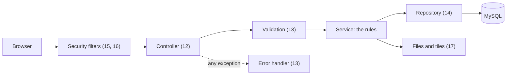

<!-- chapter: 0 | part: II | owner: writer-backend | tag: none | status: expanded -->
# Part II: The backend

In Part I you learned the language (Java), the tools (Maven, Git, Docker), and the web and database basics the rest of the book stands on. Part II builds the server side of the Secure Document Viewer on top of them.

The backend is the part of the app users never see, and everything depends on it. It decides who you are, what you may open, and whether a request is honest. The browser is easy to bypass: anyone can send requests to the server with a script, so every rule that matters lives here and not in the user interface. That single idea explains most of the design you'll read in the next eight chapters, and it's why a good deal of this part is about refusing things politely and consistently.

## What the part covers

| Chapter | Topic | Why the app needs it |
|---|---|---|
| 11 | Spring Boot foundations | The framework that starts the server and wires its classes together |
| 12 | REST controllers and JSON | Every action the browser takes arrives as an HTTP request to a controller method |
| 13 | Validation, configuration and errors | Bad input must be refused, a broken configuration must stop the server, and every error has one shape |
| 14 | Storing data with JPA and Flyway | Accounts, documents, shares and the audit trail live in MySQL |
| 15 | Spring Security I | The server must know who you are before it can decide anything |
| 16 | Spring Security II | Signed-in sessions, sign-in attempts and proxies all need defenses |
| 17 | Files, images, PDFs and signatures | The core of the product: pages become watermarked tiles behind unforgeable links |
| 18 | Testing the backend | Every promise the app makes is checked by a test |

*Table 1 — The chapters of Part II*

## The path of one request

The chapters follow the route a request takes through the server, so it helps to see the whole route once. Figure 1 shows it in the order the parts meet a request.

*Figure 1 — The route of one request through the backend, with the chapters that teach each stop*

A request first meets the security filters (Chapters 15 and 16), which decide who is calling and whether they may go further. The controller (Chapter 12) reads the path, the query string or the JSON body. Validation (Chapter 13) checks the input. The service applies the rules of the application, such as which documents a user may open, and uses repositories to read and write MySQL (Chapter 14) and, for documents, the files on disk (Chapter 17). If anything fails on the way, an exception handler (Chapter 13) turns it into the one JSON error shape the browser understands. Chapter 11 is the framework that connects all of these, and Chapter 18 shows how to test each stop.

## Why this order

Chapter 11 comes first because everything else is a Spring Boot idea: beans, configuration and annotations. Chapter 12 adds the front door, the controller, so you can see something answer a request. Chapter 13 then teaches what a careful server does with what it receives, before the data layer arrives in Chapter 14. Chapters 15 and 16 come after the data layer because the accounts they protect live in the database. Chapter 17 gathers the image, signing and file handling that the tile endpoint needs; it leans on ideas from Chapters 12, 13 and 15. Chapter 18 comes last because it tests everything before it.

## How each chapter is organized

Every chapter has three tiers. The **beginner tier** teaches the core idea with an analogy, defines the terms, and reads the setup code line by line. The **intermediate tier** shows how the pieces talk to each other and why this design was chosen over the obvious alternatives. The **advanced tier** covers security, performance and architecture, with real incidents from this project's history: the audit rows that vanished, the sign-in guesses that all got through at once, the error that turned into a `500`. You can read only the beginner tier of each chapter on a first pass and return for the rest later; each later tier tells you what you can skip.

Code labeled *Listing* is copied from the repository at a named tag, such as `book-m6-final`, and you can print the same file with `git show <tag>:<path>`. Where a listing is shortened, the caption says what was left out. Code labeled *Example* is written for this book to teach an idea, and never carries a tag. Part II mostly quotes the final code (`book-m6-final`) because it is the most complete, and it says so when it quotes an earlier tag. Part IV then tells the story of how the app grew, milestone by milestone, so this part teaches the concepts and leaves most of the history to Part IV.

## Before you start

The backend uses Java 25, Spring Boot 4.1.1, Spring Security 7, Jackson 3, Hibernate 7, Flyway 12 and MySQL 8.4. You can read Part II with only the source code and this book. To try the exercises, you need the setup from the front matter and, for the chapters that touch the database, the MySQL container from Chapter 10. Exercises that change code tell you to work on your own branch (Chapter 7), never on a milestone tag.

## If you already know Spring

If you have used Spring before, skim Chapter 11 and read from Chapter 13. The project has a few choices that differ from a typical tutorial and are worth seeing:

- Constructor injection everywhere, and typed, validated configuration that stops startup when a secret is missing (Chapters 11 and 13).
- One JSON error shape for everything, including errors raised by the security filters (Chapter 13).
- Transactions managed by a `TransactionTemplate` in the document service, so a slow PDF render never holds a database connection (Chapter 14).
- Sessions and an `httpOnly` cookie rather than tokens, with a CSRF cookie the single-page app copies into a header (Chapters 15 and 16).
- Sign-in attempts counted before the password is checked, so that parallel guesses can't beat the limit (Chapter 16).

## What you will have at the end

By the end of Part II you'll be able to read any class in `src/main/java` and say what it is for, why it is built that way, and how it is tested. You won't have built the app yet: Part III does the same for the browser side, and Part IV assembles both into the finished viewer, one milestone at a time.
