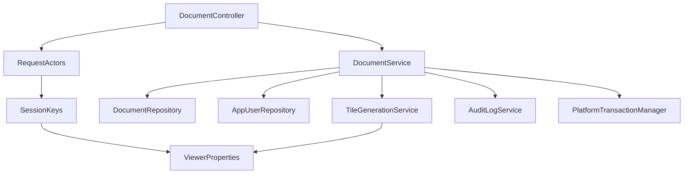

<!-- chapter: 11 | part: II | owner: writer-backend | tag: book-m6-final | status: expanded -->
# Chapter 11: Spring Boot foundations

Everything the Secure Document Viewer does on the server (signing you in, listing documents, cutting a PDF page into tiles) runs inside one Java program built on Spring Boot. This chapter explains what a framework is, shows the smallest Spring Boot application in the repository, and teaches the two ideas the rest of Part II depends on: beans and dependency injection. It then shows how the program is configured from outside, what the one-line dependencies called starters bring in, how logging works, and why a well-built Spring program refuses to start rather than misbehave.

## Learning objectives

By the end of this chapter, you will be able to:

- Explain what a framework is and how it differs from a library.
- Describe what `@SpringBootApplication` does when the program starts.
- Explain what a bean is and how dependency injection supplies one to another class.
- Read a constructor-injected class such as `DocumentController` and name each of its dependencies.
- Configure the application through `application.yml`, environment variables and profiles, and predict which value wins.
- Explain what a starter dependency and auto-configuration are, and where the project overrides a managed version.
- Write and read a log line, and choose the right level.

## Prerequisites

- Chapter 3: your first Java program (`main`, imports, `final`)
- Chapter 4: classes, objects, records and interfaces
- Chapter 6: Maven and the shape of a project
- Chapter 8: how the web works (HTTP requests and responses)

## Beginner tier: Someone else runs the show

### 11.1 What a framework is

Imagine you want to open a restaurant. You could build the building, wire the electricity, install plumbing, and only then start cooking. Or you could rent a fitted-out kitchen where the ovens, the extraction fans and the fire alarms already exist, and you bring your recipes. A framework is the fitted-out kitchen: a large body of ready-made code that already knows how to start a program, listen for web requests and connect to a database. You supply the recipes, which are the pieces specific to your application.

A **library** is a single tool you pick up when you need it, such as a PDF reader. You call the library, and you decide when. With a framework, the direction reverses: the framework calls you. Your code sits in classes that the framework finds, creates and invokes at the right moment. This reversal has a name, **inversion of control**, and it explains most of what looks strange about Spring at first. Here is the difference as two tiny sketches. They are written to teach, so they are Examples, not project code.

**Example 11.1 — You call a library; a framework calls you (teaching example)**

```java
// A library: your code is in charge and decides when to call it.
public static void main(String[] args) {
    Report report = PdfLibrary.open("quarterly.pdf");   // you call it
    System.out.println(report.pageCount());
}

// A framework: you write a method and a label; the framework decides when to call it.
@GetMapping("/api/documents")
public List<DocumentSummary> list() {                   // the framework calls you
    return documents.list();
}
```

Nobody in the project writes code that says "when a request for `/api/documents` arrives, call `list`". You write the method and the label, and Spring does the waiting, the listening and the calling.

**Where the analogy breaks down:** a rented kitchen has walls you can see. A framework's structure is mostly invisible: it's made of rules such as "any class with this label gets created at startup". When something goes wrong, you often need to know the rule to understand the behavior. Much of Part II is these rules.

Spring is the framework the project uses. **Spring Boot** is a layer on top of it that chooses sensible defaults, so a program can start with almost no setup. The project uses Spring Boot 4.1.1 on Java 25 (`pom.xml`, tag `book-m6-final`). Two other pieces appear in this chapter. Maven downloads the libraries (Chapter 6). Tomcat is the web server built into the finished program, so running the app is one command and needs no separate server installation.

### 11.2 The first Spring Boot application

Listing 11.1 is the entire entry point of the server. It is short on purpose: nearly everything else is discovered by the framework.

**Listing 11.1 — `SecureDocViewerApplication.java` (`book-m6-final`)**

```java
package com.example.securedocviewer;

import org.springframework.boot.SpringApplication;
import org.springframework.boot.autoconfigure.SpringBootApplication;
import org.springframework.scheduling.annotation.EnableScheduling;

@SpringBootApplication
@EnableScheduling
public class SecureDocViewerApplication {
    public static void main(String[] args) {
        SpringApplication.run(SecureDocViewerApplication.class, args);
    }
}
```

*Path: `src/main/java/com/example/securedocviewer/SecureDocViewerApplication.java`*

Read it from the bottom up.

- `main` is the method Java runs first (Chapter 3). Its only job is to hand control to `SpringApplication.run`, which starts the framework. From this line on, Spring is in charge.
- Words that start with `@` are annotations: labels attached to a class or method that tell a tool how to treat it. They don't change what the code does by themselves; the framework reads them.
- `@SpringBootApplication` marks this class as the starting point. It switches on three behaviors. First, it tells Spring to search this package and every package beneath it (`com.example.securedocviewer...`) for classes to manage, which is called **component scanning**. Second, it allows this class to declare extra configuration. Third, it turns on **auto-configuration**, which Section 11.5 explains.
- `@EnableScheduling` turns on the feature that runs methods on a timer. The project uses it for cleanup jobs that [Chapter 14](14-jpa-and-flyway.md) describes; for now, note that one annotation is enough to activate a whole capability.

What happens when you run the program? You start it with Maven's wrapper from the project folder (Chapter 6):

```bash
./mvnw spring-boot:run
```

Then `main` runs, and `SpringApplication.run` does roughly the following, in order. This is a simplified description; the real sequence has more steps, but this is the outline to keep in mind.

1. **Read the configuration:** `application.yml`, environment variables and any active profile (Section 11.4).
2. **Scan for classes to manage:** every class in `com.example.securedocviewer` and below that carries a label such as `@Service` or `@RestController` (Section 11.3).
3. **Create the objects and connect them:** each managed class is instantiated, and its dependencies are supplied (Section 11.3). The database connection, the security filters, the web server and the scheduler are created here too, by auto-configuration.
4. **Run start-up tasks:** for example, `BootstrapAdmin` creates the first administrator on an empty database (Section 11.7).
5. **Start listening:** the embedded web server accepts requests on the port from `server.port` (8080 in `application.yml`).

If any step fails, the program stops with an error and never listens. That's deliberate, and Section 11.7 explains why.

### 11.3 Beans and dependency injection

When Spring starts, it creates one object of every class it finds that is labeled as a managed component (with annotations such as `@Component`, `@Service`, `@RestController` or `@Configuration`). Each such object is a **bean**, and the box that holds them all is the **application context**. By default there is one instance of each bean, shared by the whole program.

*Pattern note: Constructor injection is the dependency injection pattern (Chapter 38, Section 38.2).*

The labels tell Spring, and the reader, what kind of class this is. Three kinds appear throughout the project, so it helps to name them now. A **controller** is a class that answers web requests; Chapter 12 is about them. A **service** is a class that holds the rules of the application, such as who may open a document. A repository is a class that reads and writes the database; Chapter 14 covers it.

**Table 11.1 — The labels that create beans**

| Label | Meant for | Example in the project |
|---|---|---|
| `@RestController` | A class that answers web requests | `DocumentController` |
| `@Service` | A class holding business rules | `DocumentService`, `UserAccountService` |
| `@Component` | Any other managed class | `StorageJanitor`, `ViewerProperties` |
| `@Configuration` with `@Bean` methods | A class that builds beans by hand | `SecurityConfig` |

Why not write `new DocumentService(...)` wherever you need one? Because a `DocumentService` needs a `DocumentRepository`, which needs a database connection, which needs configuration. If every class built its own helpers, you'd repeat that wiring everywhere, and you couldn't swap a helper for a fake in a test. Instead, a class declares what it needs, and Spring hands it over. That is dependency injection. To keep the kitchen analogy going: the chef doesn't drive to the market. The chef writes a list ("flour, eggs, butter"), and a supplier delivers exactly those items before service begins. The class's constructor is the list, and Spring is the supplier.

Listing 11.2 shows it in the smallest useful example in the repository.

**Listing 11.2 — Constructor injection in `DocumentController.java` (`book-m6-final`, simplified: the two nested records after the class line are omitted; only the constructor and its fields are shown, and the methods are left out)**

```java
@RestController
@RequestMapping("/api/documents")
public class DocumentController {

    // ... two nested records omitted ...

    private final DocumentService documents;
    private final RequestActors actors;

    public DocumentController(DocumentService documents, RequestActors actors) {
        this.documents = documents;
        this.actors = actors;
    }

    // ... request-handling methods omitted ...
}
```

*Path: `src/main/java/com/example/securedocviewer/controller/DocumentController.java`*

The constructor lists two parameters. When Spring builds the controller, it looks in the application context for a bean of type `DocumentService` and one of type `RequestActors`, and passes them in. Nothing in the class says where they come from, which is the point: `DocumentController` only says what it needs. The fields are `final`, so once the object exists its dependencies can't change or be missing. This style is called constructor injection, and every controller and service in the project uses it.

Why constructor injection rather than marking a field and letting Spring fill it in afterward? Three reasons. The dependencies are visible in one place, the constructor, so you can see at a glance how much a class depends on; a class with twelve parameters is asking to be split. The `final` fields make it impossible to forget one. And a test can create the class by hand, with a fake in place of a real dependency, by calling `new`, with no Spring at all. Chapter 18 shows tests that do exactly this, such as `new SignedUrlService(properties)`.

Dependencies form a chain, and Spring works out the order. Figure 11.1 shows the part of the chain behind `DocumentController`.



*Figure 11.1 — Part of the dependency chain behind `DocumentController`*

*Text description:* A top-down graph with `DocumentController` at the top, pointing to `DocumentService` and `RequestActors`. `RequestActors` points to `SessionKeys`, which points to `ViewerProperties`. `DocumentService` points to five things: two repositories, `TileGenerationService`, `AuditLogService` and the transaction manager, and `TileGenerationService` also points to `ViewerProperties`. Notice that `ViewerProperties` sits at the bottom of two branches, so one shared bean serves both.

<!-- source: constructors of DocumentController, DocumentService, RequestActors, SessionKeys and TileGenerationService at book-m6-final; partial: TileGenerationService also takes ViewerMetrics, omitted here -->


Spring builds the leaves first: `ViewerProperties`, then `SessionKeys` and `TileGenerationService`, and so on up to the controller. If a bean can't be built or found, the program refuses to start and names the missing type, so a wiring mistake shows up at startup and never in front of a user.

Spring picks a dependency by type, not by name. If two beans of the same type exist, Spring can't choose without more information, and startup fails. `KnownDevices` shows a related detail. It has two constructors: a public one that Spring uses, and a second one, visible only inside its own package, which the unit tests use to supply a fixed clock. When there is more than one constructor, Spring needs to be told which to call, and the public one carries an explicit `@Autowired` label for that.

Not every bean can be created by labeling a class. Sometimes the class belongs to a library and you can't edit it. For those, a `@Configuration` class contains `@Bean` methods: each method builds an object, and its return value becomes a bean. `SecurityConfig` declares eight beans this way (a password encoder, a session registry and so on), and Listing 11.3 shows one.

**Listing 11.3 — A hand-built bean in `SecurityConfig.java` (`book-m6-final`, excerpt: method `passwordEncoder`)**

```java
/** Delegating encoder stores "{bcrypt}..." so the algorithm can be upgraded later without a migration. */
@Bean
public PasswordEncoder passwordEncoder() {
    return PasswordEncoderFactories.createDelegatingPasswordEncoder();
}
```

*Path: `src/main/java/com/example/securedocviewer/security/SecurityConfig.java`*

Spring calls the method once, keeps the returned object, and hands it to every class that asks for a `PasswordEncoder`, such as `UserAccountService`. Chapter 15 explains what the encoder does.

## Intermediate tier: Configuring the program from outside

*If you're reading for the first time, Sections 11.4 and 11.5 are the important ones here; 11.6 is a short tour of logging.*

### 11.4 Configuration files: `application.yml`, profiles, environment variables

Some values must change between your laptop and a real server: the database address, a secret key, whether cookies require HTTPS. Hard-coding them would mean rebuilding the program for every machine, and putting secrets in code would mean publishing them with it. Spring Boot reads such values from outside the code, mainly from `src/main/resources/application.yml`, a file in the YAML format: indented `key: value` lines, where indentation means nesting. So this:

```yaml
server:
  servlet:
    session:
      timeout: 30m
```

sets the property named `server.servlet.session.timeout` to `30m`. Spring Boot defines many properties of its own (`server.port`, `spring.datasource.url`), and your own code can define more under a prefix of its choosing; the project's are under `secure-doc-viewer`.

Listing 11.4 shows two excerpts.

**Listing 11.4 — `application.yml` (`book-m6-final`, simplified: two excerpts, comments trimmed)**

```yaml
server:
  port: 8080
  servlet:
    session:
      timeout: 30m
      cookie:
        name: SDV_SESSION
        http-only: true
        same-site: strict
        secure: ${SESSION_COOKIE_SECURE:false}

spring:
  jpa:
    open-in-view: false
    hibernate:
      ddl-auto: none
```

*Path: `src/main/resources/application.yml`*

Three things to notice. First, `${SESSION_COOKIE_SECURE:false}` is a **property placeholder**: use the environment variable `SESSION_COOKIE_SECURE` if it exists, otherwise `false`. The same file therefore works on a laptop (plain HTTP, the default) and in production (the variable set to `true`). Second, keys like `server.servlet.session.timeout` are ones Spring Boot defines itself; you set them and the framework obeys. Third, values that come from `ddl-auto: none` and `open-in-view: false` are *decisions*: Chapter 14 explains why the project switched off two convenient defaults.

The database settings show the placeholder pattern at scale.

**Listing 11.5 — `application.yml` (`book-m6-final`, excerpt: the datasource; comments trimmed)**

```yaml
spring:
  datasource:
    url: jdbc:mysql://${DB_HOST:localhost}:${DB_PORT:3306}/${DB_NAME:securedocs}?connectionTimeZone=UTC&forceConnectionTimeZoneToSession=true
    username: ${DB_USERNAME:securedocs}
    password: ${DB_PASSWORD:}
```

*Path: `src/main/resources/application.yml`*

On a developer machine none of the `DB_` variables need to be set: the defaults point at MySQL on `localhost`. In Docker Compose (Chapter 10), the compose file sets `DB_HOST` to the name of the database container. The password has an *empty* default on purpose: there is no built-in password to guess, and a deployment must supply its own.

**Which value wins?** The same property can be given in several places, and Spring Boot applies a fixed order. The two you need to know: a value from an environment variable overrides the same property in `application.yml`, and a value from `application.yml` overrides a default written in code. The project adds one more source for local work, in `application.yml`:

```yaml
spring:
  config:
    import: optional:file:.env[.properties]
```

(`book-m6-final`, `application.yml`, excerpt.) This says: "if there is a file named `.env` next to the program, read it as a list of `NAME=value` lines." It is `optional`, so its absence is fine. The `.env` file is kept out of Git (Chapter 7), which is how a developer's secrets stay off GitHub. "Real environment variables win", says the comment beside it.

A profile is a named set of extra settings that you switch on. The tests use one: `@ActiveProfiles("test")` makes Spring also read `application-test.yml`, which overrides the datasource to point at an in-memory H2 database instead of MySQL. Chapter 14 and Chapter 18 cover why. The naming rule is always `application-<profile>.yml`.

**Relaxed binding.** One last convenience: Spring maps names loosely. The environment variable `SESSION_COOKIE_SECURE` is a legal way to set what the YAML calls `session.cookie.secure`, and `secure-doc-viewer.storage-root` in YAML maps to a `storageRoot` field in Java. That's why environment variables (upper case, underscores) and YAML (lower case, dashes) can describe the same setting.

In the project, most of the `secure-doc-viewer.*` settings are read into one typed Java class, `ViewerProperties`, which [Chapter 13](13-validation-and-errors.md) explains. A few single values are read directly into a constructor with `@Value`, as in `BootstrapAdmin`:

**Listing 11.6 — `BootstrapAdmin.java` (`book-m6-final`, excerpt: the constructor)**

```java
public BootstrapAdmin(UserAccountService accounts,
                      @Value("${secure-doc-viewer.bootstrap-admin.username:admin}") String username,
                      @Value("${secure-doc-viewer.bootstrap-admin.password:}") String configuredPassword) {
    this.accounts = accounts;
    this.username = username;
    this.configuredPassword = configuredPassword;
}
```

*Path: `src/main/java/com/example/securedocviewer/account/BootstrapAdmin.java`*

`@Value` puts the value of one property into one parameter. The `:admin` after the property name is the default when nothing sets it, and the empty default after `password:` means "no password configured", which the class treats as "generate a random one" (Chapter 15). `@Value` is fine for one or two settings; for a group of related settings, a typed class is easier to read and validate.

### 11.5 Starters and auto-configuration

Look at the dependencies in `pom.xml` and you'll see names like `spring-boot-starter-webmvc`, `spring-boot-starter-security`, `spring-boot-starter-data-jpa` and `spring-boot-starter-flyway`. A starter is a single dependency that pulls in a matched set of libraries for one job, at versions known to work together. Table 11.2 lists the ones the project uses.

**Table 11.2 — The starters in `pom.xml` (`book-m6-final`) and what each brings**

| Starter | What you get |
|---|---|
| `spring-boot-starter-webmvc` | Spring's web layer: controllers, JSON conversion, and the embedded Tomcat server |
| `spring-boot-starter-security` | Spring Security (Chapters 15 and 16) |
| `spring-boot-starter-validation` | Bean Validation annotations such as `@NotBlank` (Chapter 13) |
| `spring-boot-starter-data-jpa` | JPA, Hibernate and Spring Data repositories (Chapter 14) |
| `spring-boot-starter-flyway` | Flyway database migrations (Chapter 14) |
| `spring-boot-starter-actuator` | Health and metrics endpoints (Chapter 35) |
| `spring-boot-starter-test` and friends | JUnit, Mockito and the test tools (Chapter 18) |

A comment in the project's `pom.xml` notes that "Spring Boot 4 splits the old all-in-one starters into focused ones", which is why the web starter is named `webmvc` and Flyway has its own starter. Other dependencies (the MySQL driver, PDFBox, the Prometheus registry) are ordinary libraries with no starter.

**Where do the versions come from?** The top of the `pom.xml` declares `spring-boot-starter-parent` version `4.1.1` as its **parent POM**, a Maven project file that other projects inherit defaults from, such as a tested list of library versions. That parent contains a table of tested versions for hundreds of libraries, so most dependencies in the file have *no version number at all*: Maven takes it from the parent. Upgrading Spring Boot upgrades the whole tested set at once.

Auto-configuration is the second half of the trick. When Spring Boot starts, it looks at what is on the classpath and at your settings, and creates sensible beans for you. With the JPA starter and a MySQL driver present and `spring.datasource.url` set, it builds the database connection pool and the transaction manager without you writing a line. With the Flyway starter present, it runs the migrations at startup (Chapter 14). With the web starter, it starts Tomcat. If you define your own bean of the same kind, yours takes priority: that's exactly what `SecurityConfig` does when it declares its own `PasswordEncoder` and `SecurityFilterChain` (Chapter 15). The rule of thumb is that Boot provides a default and you override only what you must.

We simplify here: the full list of what is auto-configured is long and changes between versions. You don't need to memorize it; you need to know that it exists, so that when a bean appears that you never wrote, you know where it came from.

### 11.6 Logging and startup output

A running server has no screen to show what it's doing, so it writes **log** lines to the console. Spring Boot configures logging by default, and the project writes to it through **SLF4J**, a common logging interface. Each class that logs declares a logger, and then calls a method named for the severity.

**Listing 11.7 — Logging in `BootstrapAdmin.java` (`book-m6-final`, excerpt: the logger and one call; the generated-password message is omitted)**

```java
private static final Logger log = LoggerFactory.getLogger(BootstrapAdmin.class);

// ...

log.info("Created initial admin account '{}' from BOOTSTRAP_ADMIN_PASSWORD.", username);
```

*Path: `src/main/java/com/example/securedocviewer/account/BootstrapAdmin.java`*

The logger is created once per class and tagged with the class name, so every line says which class wrote it. The `{}` in the message is a placeholder that SLF4J fills with the arguments that follow. Use placeholders, not string concatenation: the text is only assembled if that level is switched on, which is cheaper. That severity label is the **log level**: a label such as `error`, `warn`, `info` or `debug` that says how important a log line is, so that you can filter them.

**Table 11.3 — Log levels**

| Level | Meant for | Example in the project |
|---|---|---|
| `error` | Something failed that shouldn't have | `GlobalExceptionHandler` logs unexpected failures with a reference code (Chapter 13) |
| `warn` | Something suspicious, or something an operator must see | `BootstrapAdmin` prints a generated password once; `StorageJanitor` logs a folder it couldn't delete |
| `info` | A normal event worth recording | `BootstrapAdmin` creating the first admin; the audit purge reporting how many rows it deleted |
| `debug` | Detail for developers, off by default | (not used by the project's own code) |

**What must never be logged.** A log is copied, backed up and searched by many people, so secrets don't belong in it. The project logs a password in exactly one place, deliberately. When no bootstrap password is configured, `BootstrapAdmin` generates one and prints it *once*, because the operator has no other way to learn it. The account is flagged "must change password" at first sign-in (Chapter 15). Everywhere else, the audit log records that a sign-in *failed*, never what was typed.

This book doesn't reproduce a startup log, because its exact text depends on your machine and versions. When you run the app, read the output from the top. The framework reports which profile is active, the port it listens on, and any bean that failed to build. If startup fails, the last message in the output usually names the missing bean or the property that failed validation, and the lines above it show the chain of causes. When you're stuck, read the *last* "Caused by" line first: it's usually the root cause, and the earlier ones only describe how the failure travelled.

## Advanced tier: Failing early, and where the seams are

*You can skip to "In this project" on a first read; Part IV comes back to these ideas.*

### 11.7 Fail at startup, not at the first request

The most useful property of this wiring is that mistakes surface when the program starts. A missing dependency stops startup with an error naming the type. `ViewerProperties` goes further: its signing secret must be present and at least 32 characters, or the application refuses to start (Chapter 13 shows how). The source comment states the reason: startup fails "rather than failing on the first tile". A server that started with a broken secret would only fail later, in front of a user.

Startup is also the place for one-off setup. Some code must run once, after the beans exist but before the app accepts requests. `BootstrapAdmin` is the project's example. It implements `ApplicationRunner`, a Spring interface with one method that Spring calls once at the end of startup.

**Listing 11.8 — `BootstrapAdmin.run` (`book-m6-final`)**

```java
@Override
public void run(ApplicationArguments args) {
    if (accounts.hasAnyUsers()) {
        return;
    }
    boolean generated = configuredPassword == null || configuredPassword.isBlank();
    String password = generated ? randomPassword() : configuredPassword;
    // A generated password was printed to a log: it must be replaced at first sign-in.
    accounts.create(username, password, Role.ADMIN, generated);
    if (generated) {
        log.warn("\n\nCreated initial admin account '{}' with generated password: {}\n"
                + "Sign in and change it (or set BOOTSTRAP_ADMIN_PASSWORD before first start).\n", username, password);
    } else {
        log.info("Created initial admin account '{}' from BOOTSTRAP_ADMIN_PASSWORD.", username);
    }
}
```

*Path: `src/main/java/com/example/securedocviewer/account/BootstrapAdmin.java`*

Read it as a small story. If any account exists, do nothing: this code runs at *every* start, so it must be safe to run again, and "only on an empty database" is how it stays safe. Otherwise, decide whether a password was configured. If not (`generated`), make a random one. Create the administrator, flagging a generated password as "must change" (the fourth argument), because it is about to be printed. Then log which case happened. The class comment explains why the app needs it: "otherwise nobody could sign in to create anyone else." Note the design again: no credential is committed to the repository, and none is baked in.

### 11.8 Annotations are read by the framework, so calls matter

Annotations such as `@Transactional` work because Spring wraps the bean in a proxy, a stand-in object with the same methods that adds behavior (here, starting a database transaction) around your method. The consequence is that the wrapper only runs when the call comes from *outside* the bean, through the proxy. If a method calls another method on `this`, the proxy is bypassed and the annotation does nothing. Chapter 14 returns to this. The project's `DocumentService` doesn't use the annotation at all; it manages transactions explicitly, because rendering a PDF is slow and must run outside any database transaction (Chapter 14).

### 11.9 A managed version you must override: the Tomcat incident

Spring Boot's parent manages the version of every library, including Tomcat. Usually that's a gift. Occasionally a security fix lands in a library *after* the Boot release, and you want the fix now. The project hit this. *The problem:* Spring Boot 4.1.1 manages Tomcat 11.0.24, and that version had three critical published security advisories. *How it was found:* during the second round of review before release. *The fix:* an override in the `pom.xml`, with a comment saying when to remove it:

**Listing 11.9 — `pom.xml` (`book-m6-final`, excerpt: the `properties` block; indentation reduced)**

```xml
<properties>
    <java.version>25</java.version>
    <pdfbox.version>3.0.8</pdfbox.version>
    <!-- Boot 4.1.1 ships Tomcat 11.0.24 (GHSA-9xv2-5v5q-p794, GHSA-gcx9-497g-6cp6,
         GHSA-h3x4-894j-xpx5, all critical). Drop this once Boot manages 11.0.25+. -->
    <tomcat.version>11.0.26</tomcat.version>
</properties>
```

*Path: `pom.xml`*

The parent's table is keyed by property names such as `tomcat.version`; setting the property in *your* `pom.xml` replaces the managed value. The IDs in the comment are GitHub security advisory numbers, which you can look up. The comment is what makes the override safe: a future maintainer knows why it's there and when to delete it. The lesson: **a framework release can lag behind its own dependencies' security fixes, so scan your dependencies and know how to override one deliberately.** Chapter 36 covers scanning. <!-- source: dossier bugs-and-findings G9; commit f682716; pom.xml comment at book-m6-final -->

### 11.10 Common mistakes

- **Field injection and `new`.** Creating a service with `new` inside another class bypasses Spring: the object isn't a bean, its own dependencies aren't supplied, and annotations on it don't work.
- **Component scanning misses a class.** A class outside `com.example.securedocviewer` isn't found, so it silently isn't a bean. Keep application classes under the main package.
- **Two beans of one type.** Startup fails because Spring can't choose. Either remove one, or name the choice.
- **Secrets in `application.yml`.** Anything committed is published. Use a placeholder with an empty default and supply the value by environment variable or a git-ignored `.env`.
- **Forgetting that environment variables win.** A value in your shell overrides the file, so "I changed the YAML and nothing happened" often means a variable is set.
- **Misspelled property names.** A key Spring doesn't recognize is silently ignored unless a typed class validates it. Prefer `@ConfigurationProperties` for groups (Chapter 13).
- **Logging a secret or a whole request.** Log identifiers and outcomes, not credentials or bodies.

## In this project

**Table 11.4 — Where Chapter 11's ideas live (`book-m6-final`)**

| Idea | File |
|---|---|
| Entry point, scheduling switch | `src/main/java/com/example/securedocviewer/SecureDocViewerApplication.java` |
| Constructor injection | `controller/DocumentController.java` and the other controllers |
| Beans built by hand | `security/SecurityConfig.java` |
| Settings, placeholders, `.env` import | `src/main/resources/application.yml` |
| Test profile | `src/test/resources/application-test.yml` |
| Starters, parent version, Tomcat override | `pom.xml` |
| Start-up task | `account/BootstrapAdmin.java` |

Part IV's Chapter 25 tells how the project began; the configuration approach in this chapter is how the same program runs on a laptop, in tests and in Docker.

## Try it

### Exercise 11.1 ★ Find the cookie settings

Open `application.yml` and find the session cookie name. Which line makes the cookie unreadable to JavaScript, and which placeholder controls whether it is sent only over HTTPS?

*Solution:* Appendix C, Exercise 11.1.

### Exercise 11.2 ★ List the dependencies

In `DocumentController`, list every dependency injected by the constructor. Then open `DocumentService` and list *its* constructor parameters. Draw the two levels as a diagram like Figure 11.1.

*Solution:* Appendix C, Exercise 11.2.

### Exercise 11.3 ★★ Find the `@Value` settings

`BootstrapAdmin` reads two settings with `@Value` rather than `ViewerProperties`. Find them, their default values, and the environment variable names the `application.yml` uses to set them.

*Solution:* Appendix C, Exercise 11.3.

### Exercise 11.4 ★★ Who wins?

Suppose `application.yml` says `server.port: 8080`. Predict the port when you start the program with the environment variable `SERVER_PORT=9090`. Then check your prediction on your own copy. What does this tell you about relaxed binding and about which source wins?

*Solution:* Appendix C, Exercise 11.4.

### Exercise 11.5 ★★★ Explain the `@Autowired` in `KnownDevices`

`KnownDevices` needs `@Autowired` on one constructor, while most of the project's classes don't. Explain why, what would happen if you removed the annotation, and why the second constructor exists.

*Solution:* Appendix C, Exercise 11.5 (a worked outline).

### Exercise 11.6 ★★★ Break the startup on purpose

On your own copy, make the application fail to start in three different ways (for example: unset the signing secret, give `server.port` a non-number, and delete a class's `@Service` label). For each, record the error message and say which step of Section 11.2's outline failed. Which message was easiest to act on, and why?

*Solution:* Appendix C, Exercise 11.6 (a worked outline).

## Summary

- A framework calls your code; a library is called by it.
- `@SpringBootApplication` starts component scanning and auto-configuration; `SpringApplication.run` starts everything, and a failed step stops the program before it listens.
- Managed objects are beans, held in the application context and supplied to each other by constructor injection, matched by type; `@Bean` methods build beans you can't label.
- `application.yml`, environment variables, a `.env` file and profiles let one build run in many places; `${NAME:default}` placeholders bridge them, and an environment variable beats the file.
- Starters bundle dependencies, the parent pom manages their versions, and auto-configuration builds beans from what it finds; your own beans take priority.
- Logging goes through SLF4J with levels, and secrets are never logged.
- Mistakes in wiring or required settings stop the program at startup, which is where you want them; a start-up runner is the place for one-time setup that must be safe to repeat.

## Further reading

- *Spring Boot Reference Documentation*, "Externalized Configuration." https://docs.spring.io/spring-boot/reference/features/external-config.html
- *Spring Framework Reference Documentation*, "The IoC Container." https://docs.spring.io/spring-framework/reference/core/beans.html
- *Spring Boot Reference Documentation*, "Auto-configuration." https://docs.spring.io/spring-boot/reference/using/auto-configuration.html
- *Spring Boot Reference Documentation*, "Logging." https://docs.spring.io/spring-boot/reference/features/logging.html
- *SLF4J Manual*. https://www.slf4j.org/manual.html
