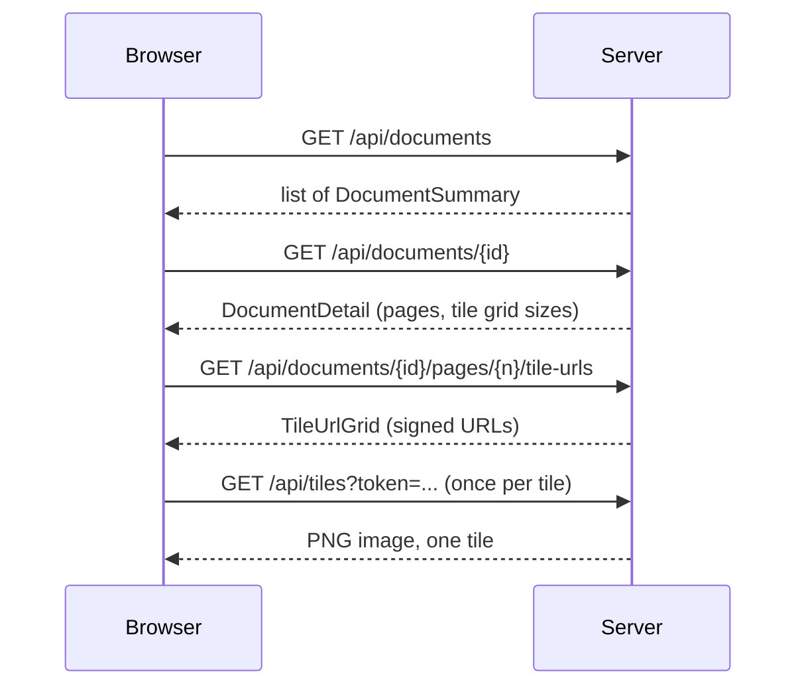

<!-- chapter: 12 | part: II | owner: writer-backend | tag: book-m6-final | status: expanded -->
# Chapter 12: REST controllers and JSON

A controller is the class that receives one kind of web request and returns a response. Everything the browser asks the Secure Document Viewer to do, from signing in to listing documents to fetching one image tile, arrives at a controller method. In this chapter you learn to read and write controllers, using the real ones from the project. They include the document library, the endpoint that hands out signed tile URLs, the tile endpoint that sends PNG images, and the upload endpoint that receives a PDF. Along the way you learn how Java objects become JSON and back, and why the choice of a status code is a promise to the client.

## Learning objectives

By the end of this chapter, you will be able to:

- Explain what REST means and how this book uses the word.
- Write a controller method that maps an HTTP method and path to Java code.
- Read data from a path variable, a query parameter and a JSON request body, and say which to use when.
- Explain how Jackson turns records into JSON and JSON into records.
- Follow the requests the viewer makes to show one page, and say what each controller contributes.
- Describe how a controller returns binary data, accepts a file upload, and sets status codes, and headers.

## Prerequisites

- Chapter 4: classes, objects, records and interfaces
- Chapter 8: how the web works (requests, responses, status codes, JSON)
- Chapter 11: Spring Boot foundations (beans, annotations)

## Beginner tier: A method that answers a request

### 12.1 What REST means, and what this book means by it

Think of a library desk. You don't walk the shelves; you hand the clerk a request slip naming the thing you want and what you want done with it: "fetch book 42," "return book 42," "renew book 42." REST (representational state transfer) is a style of web API built the same way. Each thing the server holds is called a resource and has an address: `/api/documents/<document-id>` is one document. The HTTP method on the request says the action, and the response carries a *representation* of the resource, usually JSON.

Table 12.1 shows the methods the project uses, with real endpoints.

**Table 12.1 — HTTP methods and the endpoints that use them (`book-m6-final`)**

| Method | Meaning | Example endpoint |
|---|---|---|
| `GET` | Read; changes nothing | `GET /api/documents` (the library), `GET /api/documents/{documentId}` |
| `POST` | Create, or run an action | `POST /api/documents` (upload), `POST /api/auth/login` |
| `PUT` | Replace a whole thing | `PUT /api/documents/{documentId}/file` (replace the PDF) |
| `PATCH` | Change part of a thing | `PATCH /api/documents/{documentId}` (rename, change visibility) |
| `DELETE` | Remove | `DELETE /api/documents/{documentId}` |

The path names *nouns* (documents, shares, sessions) and the method supplies the verb. Compare `DELETE /api/documents/abc` with an imaginary `POST /api/deleteDocument?id=abc`: the first uses the language HTTP already has, so any client, cache or log reader understands it without reading your documentation.

**Where the analogy breaks down:** a library clerk remembers you between visits. A pure REST server is meant to treat each request as self-contained, carrying everything needed to answer it. This project bends that rule on purpose: sign-in creates a server-side session, and later requests carry a cookie that identifies it (Chapter 15). This book calls the API "REST-style": resources, paths, and methods as in Table 12.1, JSON bodies, and honest status codes, but not the full academic definition (see Further reading).

### 12.2 A controller method: `@RestController`, `@GetMapping`

A controller is a class whose methods answer web requests. Listing 12.1 is the start of the class that handles the document library.

*Pattern note: Keeping controllers thin and putting the rules in a service is the service layer pattern (Chapter 38, Section 38.2; the whole arrangement is covered in Chapter 39, Section 39.5).*

**Listing 12.1 — `DocumentController.java` (`book-m6-final`, simplified: the nested records, fields, and constructor are omitted, see Listing 11.2; the other methods and the closing brace are left out)**

```java
@RestController
@RequestMapping("/api/documents")
public class DocumentController {

    // ...

    /** Only the documents the caller is allowed to open. */
    @GetMapping
    public List<DocumentSummary> list(Authentication authentication) {
        return documents.list(Viewer.of(authentication));
    }
```

*Path: `src/main/java/com/example/securedocviewer/controller/DocumentController.java`*

Reading it line by line:

- `@RestController` tells Spring this class is a bean whose methods answer web requests, and that whatever they return should be written into the response body (as JSON, for objects).
- `@RequestMapping("/api/documents")` puts a path prefix on every method in the class. Every endpoint in this class starts with `/api/documents`.
- `@GetMapping` on `list` means: when a `GET` request arrives at exactly `/api/documents`, call this method. There are matching annotations for the other methods: `@PostMapping`, `@PutMapping`, `@PatchMapping`, and `@DeleteMapping`.
- `Authentication authentication` is a parameter Spring fills in with the signed-in user (Chapter 15). You never call this method yourself. The framework calls it, and it decides what to pass, which is the inversion of control from Chapter 11. `HttpServletRequest`, which appears in other methods, is the raw request; you can mostly ignore it for now.
- The method body is one line. It hands the real work to `DocumentService` and returns the result. The class comment says: "Who may see or change what is decided in `DocumentService`; this layer only adapts HTTP."

That last point is a design rule worth stating: **keep controllers thin.** A controller's job is to translate between HTTP (paths, headers, JSON, status codes) and Java (method calls). The rules of the business, such as who may see which document, live in a service class. This keeps the rules testable without starting a web server (Chapter 18), and it means the same rule can't be accidentally implemented twice in two controllers. Dividing the code into levels like this, with controllers calling services, and services calling repositories, is called **layered architecture**.

The return type `List<DocumentSummary>` is turned into a JSON array automatically, as Section 12.4 explains.

### 12.3 Path variables, query parameters, request bodies

A request carries data in three places, and each has its own annotation.

**Table 12.2 — Where request data comes from**

| Where | Example | Annotation |
|---|---|---|
| The path | `/api/documents/abc` | `@PathVariable` |
| The query string (the part after `?`) | `/api/tiles?token=<signed-token>` | `@RequestParam` |
| The body (JSON) | `{"title": "Q3 report"}` | `@RequestBody` |

Listing 12.2 shows the first and the last.

**Listing 12.2 — Excerpts from `DocumentController.java` (`book-m6-final`, simplified: three declarations from different places in the class; everything else omitted)**

```java
public record UpdateDocumentRequest(String title, Visibility visibility) {
}

@GetMapping("/{documentId}")
public DocumentDetail get(@PathVariable String documentId, Authentication authentication,
                          HttpServletRequest request) {
    return documents.get(documentId, Viewer.of(authentication), actors.of(request, authentication));
}

@PatchMapping("/{documentId}")
public DocumentDetail update(@PathVariable String documentId, @RequestBody UpdateDocumentRequest body,
                             Authentication authentication, HttpServletRequest request) {
    return documents.update(documentId, body.title(), body.visibility(),
            Viewer.of(authentication), actors.of(request, authentication));
}
```

*Path: `src/main/java/com/example/securedocviewer/controller/DocumentController.java`*

`{documentId}` in the path is a placeholder. When a request for `/api/documents/123e4567-e89b-12d3-a456-426614174000` arrives, `@PathVariable` copies that part of the real URL into the parameter, so `documentId` holds the identifier. The placeholder is called a **path variable**: a part of a URL path that a controller receives as a parameter. Use one to say *which resource*.

For `@RequestBody`, Spring reads the JSON body and builds an `UpdateDocumentRequest` from it. That class is a Java record (Chapter 4): a short way to declare a class that only carries data. Its component names, `title` and `visibility`, are the JSON keys the client must send. Use a body to say *what to change* or *what to create*.

Now the query string, which the tile endpoint uses: `TileController.getTile` declares `@RequestParam String token`, so a request for `/api/tiles?token=abc` gives the method the value `abc`. Another example is in `UserDirectoryController`, which serves the "share with" picker:

```java
@GetMapping
public List<String> search(@RequestParam(defaultValue = "") String q, Authentication authentication) {
```

(`book-m6-final`, `UserDirectoryController.java`, excerpt: the method signature.) Here `defaultValue = ""` means "if the caller leaves `q` out, treat it as empty" instead of failing. Without a default, a missing required parameter is an error. Chapter 13 turns it into a clean JSON `400` such as `Missing required 'token'.` Use a query parameter for *optional filters and small options*: the search text, the page size in the admin audit log.

**A worked example: from URL to method.** Follow one request all the way. The browser sends:

```text
PATCH /api/documents/123e4567-e89b-12d3-a456-426614174000 HTTP/1.1
Content-Type: application/json

{"title": "Q3 report"}
```

1. Spring looks for a method whose path and HTTP method match. The class-level prefix `/api/documents` plus `/{documentId}` from `@PatchMapping("/{documentId}")` matches, and the method is `PATCH`, so `update` is chosen.
2. `documentId` is filled from the path: `123e4567-e89b-12d3-a456-426614174000`.
3. Jackson reads the body into `UpdateDocumentRequest`. The body has no `visibility`, so that component is `null`.
4. `update` calls `documents.update(documentId, "Q3 report", null, ...)`. The service changes only the fields that aren't `null` (`if (newTitle != null)`, `if (newVisibility != null)`), which is what makes `PATCH` a partial update: leave a field out and it stays unchanged.
5. The returned `DocumentDetail` becomes the JSON body of a `200` response.

Nothing in this trace runs unless the security rules in Chapter 16 allow it first. The request must pass authentication and any role rule *before* it reaches the method.

## Intermediate tier: JSON, several controllers, bytes, and files

*If you're reading for the first time, Sections 12.4 and 12.5 matter most; 12.6 and 12.7 cover the two endpoints that don't return JSON.*

### 12.4 Jackson: turning objects into JSON

You return a Java object; the client receives text. The library that converts between them is **Jackson**, and Spring Boot 4 uses Jackson 3, whose packages start with `tools.jackson` (`SecurityErrorResponses` imports `tools.jackson.databind.ObjectMapper`, for example). Converting an object to JSON is called **serialization**, and the reverse, **deserialization**. You rarely call Jackson yourself: Spring calls it when a method returns an object or takes a `@RequestBody`.

*Pattern note: A record that carries only the data of one JSON message is a data transfer object (Chapter 38, Section 38.2).*

For a record, the rule is simple: each component becomes a JSON key with the same name. Listing 12.3 is a record the project returns from the document list.

**Listing 12.3 — `DocumentSummary.java` (`book-m6-final`)**

```java
public record DocumentSummary(
        String documentId,
        String title,
        int pageCount,
        String owner,
        Visibility visibility,
        long createdAtEpochSeconds,
        long updatedAtEpochSeconds,
        boolean canManage,
        Integer sharedWithCount
) {
}
```

*Path: `src/main/java/com/example/securedocviewer/document/DocumentSummary.java`*

Written out, one element of the array returned by `GET /api/documents` looks like this. It is a teaching example with made-up values, not a capture from the project:

**Example 12.1 — One document summary as JSON (teaching example)**

```json
{
  "documentId": "123e4567-e89b-12d3-a456-426614174000",
  "title": "Quarterly report",
  "pageCount": 12,
  "owner": "pub.one",
  "visibility": "PRIVATE",
  "createdAtEpochSeconds": 1790000000,
  "updatedAtEpochSeconds": 1790000000,
  "canManage": true,
  "sharedWithCount": 2
}
```

Compare it with the record component by component. The text and numbers map directly. `Visibility` is a Java `enum` (a fixed set of names), and Jackson writes an enum as its name, `"PRIVATE"`. `boolean` becomes `true` or `false`. A `List<DocumentSummary>` becomes a JSON array of such objects.

Three design decisions are visible in this small record.

- **Timestamps are plain numbers.** `createdAtEpochSeconds` is the number of seconds since January 1, 1970 (UTC, Coordinated Universal Time). A number has no time zone, so the client can't misread it, and the browser can format it for the reader's own zone. The alternative, a text date such as `"2026-09-19T10:00:00"`, invites bugs about which zone is meant (Chapter 14 tells such a bug).
- *`Integer`, not `int`, for `sharedWithCount`.* `int` can't be `null`; `Integer` can. The comment on the record says the count is "only filled in for users who can manage it." For anyone else the value is `null`, and the key appears with the value `null`, so a reader can't learn how many people a document is shared with.
- *`canManage` is computed by the server.* The browser uses it to decide whether to show the *Share* button. This is a convenience, not the protection: the server checks the rule again when the request arrives (Chapter 16). Computing it on the server keeps the rule in one place.

Deserialization is the reverse. When the client sends `{"title": "Q3 report"}` for `UpdateDocumentRequest`, Jackson creates the record, filling components it finds in the JSON and leaving the rest `null` (for objects) or zero (for numbers). The names must match, and malformed JSON is refused with a `400` (the `HttpMessageNotReadableException` handler in Chapter 13).

### 12.5 One page view, four requests

To see how several controllers cooperate, follow what the viewer asks the server when you open a document and look at its first page. Figure 12.1 shows the sequence.



*Figure 12.1 — The requests behind viewing one page*

*Text description:* A sequence between a browser and a server, read from top to bottom. The browser asks for the document list and receives summaries. It asks for one document and receives its detail, with page and tile-grid sizes. It asks for the signed tile URLs of one page and receives a grid of URLs. Finally it asks for each tile with its token and receives one PNG image per request.

<!-- source: DocumentController.java, PageTileUrlController.java and TileController.java at book-m6-final -->


1. `GET /api/documents` (`DocumentController.list`): the library. The reader picks a document.
2. `GET /api/documents/{documentId}` (`DocumentController.get`): the `DocumentDetail`, which includes a list of pages, each with its number of tile rows and columns and its pixel size (`PageInfo`).
3. `GET /api/documents/{documentId}/pages/{page}/tile-urls`: a *new* controller, which asks the server to sign one URL per tile of that page.
4. `GET /api/tiles?token=...`, once per tile: the images themselves.

Step 3 is the one worth reading, because it shows how a class can carry *two* path variables and how a controller assembles its answer.

**Listing 12.4 — `PageTileUrlController.java` (`book-m6-final`, simplified: imports, the class comment, and the constructor are omitted)**

```java
@RestController
@RequestMapping("/api/documents/{documentId}/pages/{page}")
public class PageTileUrlController {

    // ... fields and constructor ...

    @GetMapping("/tile-urls")
    public ResponseEntity<TileUrlGrid> tileUrls(
            @PathVariable String documentId,
            @PathVariable int page,
            Authentication authentication,
            HttpServletRequest request) {

        DocumentService.IssuablePage issuable = documents.requirePage(documentId, page,
                Viewer.of(authentication), actors.of(request, authentication));
        PageInfo pageInfo = issuable.info();

        // Tokens carry a keyed binding to this session, never its id, so a
        // tile URL can be logged or leaked without leaking the credential.
        String sessionBinding = sessionKeys.tileBinding(request.getSession().getId());

        String[][] urls = new String[pageInfo.rows()][pageInfo.cols()];
        for (int row = 0; row < pageInfo.rows(); row++) {
            for (int col = 0; col < pageInfo.cols(); col++) {
                String token = signedUrlService.issueToken(documentId, page, row, col, issuable.tileVersion(), sessionBinding);
                urls[row][col] = "/api/tiles?token=" + token;
            }
        }

        return ResponseEntity.ok(new TileUrlGrid(page, pageInfo.rows(), pageInfo.cols(), pageInfo.tileSize(), issuable.tileVersion(), urls));
    }
}
```

*Path: `src/main/java/com/example/securedocviewer/controller/PageTileUrlController.java`*

The class-level path has two variables, `{documentId}` and `{page}`, and both are available to every method. `@PathVariable int page` shows something else: Spring converts the text in the path to the parameter's type, so `/pages/3/` gives the integer 3, and text that isn't a number is refused with `400` (Chapter 13's `MethodArgumentTypeMismatchException`).

The method asks the service whether this caller may view the page (`requirePage` throws a `404` if not, Chapter 16) and computes a session binding. It then builds a two-dimensional array of URLs, one for each `(row, col)`, by asking `SignedUrlService` for a token for each one (Chapter 17). It wraps the array with the grid's size in a `TileUrlGrid` record and returns it with `ResponseEntity.ok(...)`. The result is JSON like `{"page": 0, "rows": 3, "cols": 2, "tileSize": 512, "tileVersion": 1, "tileUrls": [["/api/tiles?token=...", ...], ...]}`, a `String[][]` becoming an array of arrays.

Notice what this controller does *not* do: it never returns a link to the document or a whole page, only individually signed links to single tiles. That's the security design of the whole app, expressed as the shape of one response.

### 12.6 Returning bytes: how `TileController` sends PNGs

Not every response is JSON. The tile endpoint sends an image. Listing 12.5 shows the parts that matter.

**Listing 12.5 — `TileController.java` (`book-m6-final`, simplified: the checks and rendering in the middle of the method are omitted)**

```java
@GetMapping(value = "/api/tiles", produces = MediaType.IMAGE_PNG_VALUE)
public ResponseEntity<byte[]> getTile(@RequestParam String token,
                                      Authentication authentication,
                                      HttpServletRequest request) throws Exception {
    // ... verify the token, session, rate limit and access; render the tile ...

    return ResponseEntity.ok()
            // Deliberately not cacheable beyond a moment — a shared cache
            // holding onto a watermarked-for-someone-else tile would leak it.
            .cacheControl(CacheControl.noStore())
            .body(png);
}
```

*Path: `src/main/java/com/example/securedocviewer/controller/TileController.java`*

`produces = MediaType.IMAGE_PNG_VALUE` declares that this method answers with `image/png`. The return type `ResponseEntity<byte[]>` lets the method control the whole response: the status (`ok()` is 200), the headers (`cacheControl(CacheControl.noStore())` sets `Cache-Control: no-store`) and the body (the PNG bytes, unchanged). Returning `byte[]` skips Jackson, because the bytes are already in their final format.

**ResponseEntity** is worth knowing. When a method returns a plain object, Spring assumes the answer is `200 OK` with default headers. When you need a different status or a header, you return a `ResponseEntity`, which is an object holding all three parts of a response: the status, the headers, and the body. The project returns plain objects when 200 is right (`DocumentController.list`) and `ResponseEntity` whenever it needs more.

The `no-store` header matters for security. Each tile has the viewer's name and a timestamp drawn into it, so no cache, in the browser or at any proxy in between, may keep it and hand it to someone else. There is a reason the content is at the *end* of the method: everything before it (which you'll read in Chapter 17) is a series of checks, and a request that fails any of them never gets a tile.

### 12.7 File uploads (multipart)

A PDF upload can't be JSON: JSON is text, and a PDF is binary. Browsers send files as **multipart form data**: one request whose body is divided into several named parts, each with its own content type, such as a text part called `title` and a file part called `file`. Listing 12.6 is the upload method.

**Listing 12.6 — `DocumentController.upload` (`book-m6-final`)**

```java
@PostMapping
public DocumentDetail upload(@RequestParam(value = "title", required = false) String title,
                             @RequestParam(value = "visibility", required = false) Visibility visibility,
                             @RequestParam("file") MultipartFile file,
                             Authentication authentication,
                             HttpServletRequest request) throws IOException {
    try (var in = file.getInputStream()) {
        return documents.upload(title, file.getOriginalFilename(), in, visibility,
                Viewer.of(authentication), actors.of(request, authentication));
    }
}
```

*Path: `src/main/java/com/example/securedocviewer/controller/DocumentController.java`*

The text parts `title` and `visibility` arrive through `@RequestParam` like query parameters: `required = false` makes them optional, and Spring converts the text `PRIVATE` into the `Visibility` enum, refusing a value that isn't one of its names. The file arrives as a `MultipartFile`. The method doesn't copy the whole file into memory: it takes `file.getInputStream()`, a stream, and passes that to the service. The `try (var in = ...)` closes the stream afterward even if something throws (Chapter 5). Streaming means a 50 MB PDF isn't held as one big array only to be handed on. The size limit is in `application.yml` (`spring.servlet.multipart.max-file-size: 50MB`), and Chapter 13 shows how an oversized upload becomes a clean `413` error.

You can try this endpoint from the command line against your own copy of the app, but a `curl` upload needs three steps: pick up the CSRF (cross-site request forgery) cookie, sign in, and then upload. Example 12.2 shows the sequence. It is a teaching example based on the "API" section of the project's `README.md` at `book-m6-final`, with a placeholder for the password. The browser does all of this for you, and Chapter 16 explains why the app asks for the token.

**Example 12.2 — Signing in and uploading a PDF with `curl` (teaching example)**

```bash
jar=$(mktemp)
xsrf() { awk '$6=="XSRF-TOKEN"{print $7}' "$jar"; }

# 1. Any request receives the XSRF-TOKEN cookie (this one answers 401, which is fine)
curl -s -c "$jar" http://localhost:8080/api/auth/me > /dev/null

# 2. Sign in, sending the cookie jar and echoing the token in a header
curl -s -b "$jar" -c "$jar" -H "X-XSRF-TOKEN: $(xsrf)" \
     -H 'Content-Type: application/json' \
     -d '{"username":"pub.one","password":"<password>"}' \
     http://localhost:8080/api/auth/login

# 3. Upload (read the token again: sign-in replaces it)
curl -s -b "$jar" -H "X-XSRF-TOKEN: $(xsrf)" \
     -F "title=Q3 report" -F "visibility=PRIVATE" -F "file=@report.pdf" \
     http://localhost:8080/api/documents
```

Step 1 works because the server sets the `XSRF-TOKEN` cookie on the first response, even an error. The helper function `xsrf` reads that cookie's value out of the jar file. In step 2, `-c "$jar"` saves the cookies the server sets (the session cookie and a fresh CSRF cookie), `-b "$jar"` sends the cookies you already have, and the header echoes the token, which is the double-submit defense from Chapter 16. Step 3 sends a multipart body: `-F` adds one part, and `file=@report.pdf` means "attach this file." The account must be a `PUBLISHER` or `ADMIN`, because the rule in `SecurityConfig` refuses a reader *before* the body is read. It must also not be waiting to change a temporary password. Until it has done so in the app, every request except the sign-in ones answers `403` with `passwordChangeRequired` (Chapter 16).

## Advanced tier: The contract is part of the design

*You can skip to "In this project" on a first read. Part IV comes back to these decisions.*

### 12.8 Status codes and headers as part of the contract

Clients, including the Angular app in Part III, decide what to do by looking at the status code before they read the body. So a controller's choice of status is a promise, and changing it later breaks callers. Table 12.3 lists the statuses this API uses and where they come from.

**Table 12.3 — Status codes used by the API**

| Status | When | Comes from |
|---|---|---|
| `200 OK` | Success with a body | Returning an object |
| `201 Created` | An account was created | `UserAdminController.create` returns `ResponseEntity.status(HttpStatus.CREATED)` |
| `204 No Content` | Success, nothing to send back | `DocumentController.delete` returns `ResponseEntity.noContent().build()` |
| `400 Bad Request` | Bad input | Validation and `BadRequestException` (Chapter 13) |
| `401 Unauthorized` | Not signed in, or session ended | Security (Chapter 16) |
| `403 Forbidden` | Signed in but not allowed | Security and `ForbiddenException` |
| `404 Not Found` | No such thing, *or you may not know it exists* | `DocumentNotFoundException` and unknown routes |
| `409 Conflict` | Username already taken | `UsernameTakenException` |
| `410 Gone` | A tile from an older render of a replaced document | `TileGoneException` |
| `413 Content Too Large` | Upload over 50 MB | Multipart limit |
| `429 Too Many Requests` | Rate limit or lockout, with `Retry-After` | `RateLimitExceededException`, `LoginLockedException` |
| `503 Service Unavailable` | Server busy, with `Retry-After` | `ServiceBusyException` |

Two rules stand behind the table. First, **each status has one meaning the client can rely on**: the Angular app treats `429` and `503` as "wait and try again" and reads the `Retry-After` header for how long, while `410` means "reload the page's tiles." Second, **a document you can't see is `404`, never `403`**, so its existence isn't revealed (Chapter 16).

#### A real incident: the endless reload

The viewer answers a `410` by reloading the page's tiles, which is right when the document has been replaced. But a bug made a `410` appear for a different reason, and the viewer reloaded forever. *The problem:* if a tile file was missing on disk for the *current* render (for example after a mismatched restore from backup), the server reported "gone," the viewer reloaded, asked again, got "gone" again, and looped. *How it was found:* by a dry run of the code review that the team performed before the final release. *The fix:* the server now checks whether the document has really moved on to a newer render. Only then does it answer `410`; a missing tile of the *current* render is server damage, so it is a logged, generic `500` that the viewer doesn't retry forever. Listing 12.7 is that decision. <!-- source: dossier bugs-and-findings G13; commit f1bb3a8 -->

**Listing 12.7 — `TileController.loadTile` (`book-m6-final`)**

```java
/**
 * A missing tile means "replaced" (410, the viewer reloads) only if the
 * document really has moved on to a newer render. A missing tile of the
 * current render is damage on the server (e.g. a mismatched restore): that
 * is a 500, never a 410 that would make the viewer reload the same thing forever.
 */
private BufferedImage loadTile(SignedTilePayload payload, TileAccess access, Authentication authentication)
        throws IOException {
    try {
        return tileGenerationService.loadRawTile(
                payload.documentId(), access.tileVersion(), payload.page(), payload.row(), payload.col());
    } catch (TileGoneException gone) {
        int current = documents.tileAccessIfViewable(payload.documentId(), Viewer.of(authentication))
                .map(TileAccess::tileVersion).orElse(-1);
        if (current == access.tileVersion()) {
            throw new IllegalStateException("Tile file missing for the current render of document "
                    + payload.documentId() + " (version " + current + ", page " + payload.page() + ")");
        }
        throw gone;
    }
}
```

*Path: `src/main/java/com/example/securedocviewer/controller/TileController.java`*

Read the comment first; it states the rule. The code catches "the tile file is gone," asks for the *current* version of the document, and compares. If the versions agree, the file is missing although the document hasn't changed, so it throws a plain `IllegalStateException`, which falls to the generic `500` handler from Chapter 13 (logged with a reference, no internals shown). Only if the versions differ does it rethrow the `410`. **The lesson:** a status code that triggers automatic client behavior needs a stop condition on *both* sides; every retry loop must have one.

### 12.9 Small controllers that don't leak

Two more design habits appear in the controllers.

**Limit what a helper endpoint reveals.** `UserDirectoryController` powers the "share with" picker. Its class comment records how it avoids being a directory of accounts: it's restricted to publishers and administrators, returns usernames only, and at most 20 per query. In the code, a search shorter than two characters returns an empty list, matches only enabled accounts, leaves out administrators ("they can already see every document") and leaves out the caller. A convenience endpoint is still an endpoint an attacker can call in a loop, so it returns the minimum.

**Build the audit "who" in one place.** Most methods take `actors.of(request, authentication)`, where `RequestActors` builds the audit record's actor: the username, a short session handle, and the client address. Because every controller calls the same helper, audit rows describe callers consistently, and a controller can't forget half the fields.

### 12.10 Common mistakes

- **Putting rules in the controller.** If the check "may this user open this document?" lives in one controller method, the next endpoint will forget it. Put the rule in the service (Chapter 16 shows `DocumentService`) and keep the controller thin.
- **Returning entities directly.** JPA (Jakarta Persistence) entities such as `Document` (Chapter 14) carry lazy links to other objects and internal fields. The project returns purpose-built records such as `DocumentSummary`, so what the client sees is decided deliberately, and the password hash in `AppUser` can never appear in a response.
- **Using `GET` for actions that change something.** Browsers, caches, and link checkers may repeat a `GET` freely. Anything that changes state uses another method, and, as Chapter 16 explains, changing methods are the ones protected by CSRF tokens.
- **Choosing a status code by feel.** If the client's behavior depends on the code, write down what each one means, as Table 12.3 does.
- **Forgetting the empty case.** A missing optional parameter and a missing body are different situations; use `required = false` or `defaultValue` deliberately.
- **Sending a response that tells too much.** A `500` with an exception message can leak the database layout (Chapter 13). Let the shared handler decide what errors say.

## In this project

**Table 12.4 — Controllers in `book-m6-final`**

| Controller | Path prefix | Purpose |
|---|---|---|
| `AuthController` | `/api/auth` | Sign in, sign out, current user, password change |
| `DocumentController` | `/api/documents` | Library, upload, replace, rename, share, delete |
| `PageTileUrlController` | `/api/documents/{documentId}/pages/{page}` | Signed tile URLs for one page |
| `TileController` | `/api/tiles` | Watermarked PNG tiles |
| `UserDirectoryController` | `/api/users` | Username search for the share picker |
| `AdminController` | `/api/admin` | Sessions, audit log, rate limits |
| `UserAdminController` | `/api/admin/users` | Account management |

All live in `src/main/java/com/example/securedocviewer/controller/`. The endpoints appear in Part IV as they were added: sign-in in Chapter 26, documents in Chapter 27, the hardened upload in Chapter 28.

## Try it

### Exercise 12.1 ★ Match a request to a method

Which annotation and value make `DocumentController.get` respond to `GET /api/documents/{id}`? What fills the `documentId` parameter?

*Solution:* Appendix C, Exercise 12.1.

### Exercise 12.2 ★ Why `ResponseEntity`?

Find the methods in `DocumentController` that return `ResponseEntity` and explain, for each, why a plain object wouldn't do.

*Hint:* look at what each one returns to the client.

*Solution:* Appendix C, Exercise 12.2.

### Exercise 12.3 ★★ Read the JSON of your own copy

With your own copy of the app running and signed in (Chapter 8's developer tools work well), open the *Network* tab, load the document list, and find the response of `GET /api/documents`. Match each JSON key to a component of `DocumentSummary`. Which values are `null` for a reader, and why?

*Solution:* Appendix C, Exercise 12.3.

### Exercise 12.4 ★★ Rename a component

Suppose you rename `pageCount` to `pages` in `DocumentSummary`. List every place that would need to change on the server and on the client, and explain why the JSON key is a contract.

*Solution:* Appendix C, Exercise 12.4.

### Exercise 12.5 ★★★ Design an endpoint

The project owner asks for "the ten most recently updated documents." Design the endpoint: method, path, query parameters, response record, and status codes. Say which class would hold the rule (who may see which documents) and which would hold the HTTP details, and what you would test.

*Solution:* Appendix C, Exercise 12.5 (a worked outline).

### Exercise 12.6 ★★★ Follow the tile chain

Using a copy of the app and the browser's *Network* tab, open a document, and record the sequence of requests that produce the first page. Compare it with Figure 12.1. Then decode the `token` of one tile URL up to the dot with a base64url decoder (Chapter 17 explains the format) and list the fields you find. Which of them would you not want in a log, and which does the design make safe to leak?

*Solution:* Appendix C, Exercise 12.6 (a worked outline).

## Summary

- REST-style APIs map an HTTP method and a path to an action on a resource; this project bends statelessness for its session cookie and says so.
- `@RestController`, `@GetMapping`, and friends connect requests to methods; `@PathVariable` picks the resource, `@RequestParam` supplies options and `@RequestBody` supplies what to create or change.
- Controllers stay thin: they adapt HTTP, while services own the rules.
- Jackson 3 serializes records to JSON with the component names as keys; timestamps travel as epoch seconds, and `null` carries meaning.
- Viewing one page takes four requests across three controllers, and the response of the third is a grid of individually signed tile URLs.
- `ResponseEntity` gives full control of status, headers, and body, which is how PNG tiles and `204`, `201` and `Retry-After` responses are produced; multipart requests carry files that the service receives as a stream.
- Status codes are a contract: each has one meaning the client relies on, and any code that triggers a retry needs a stop condition.

## Further reading

- *Spring Framework Reference Documentation*, "Annotated Controllers." https://docs.spring.io/spring-framework/reference/web/webmvc/mvc-controller.html
- *Spring Framework Reference Documentation*, "Multipart Resolver." https://docs.spring.io/spring-framework/reference/web/webmvc/mvc-servlet/multipart.html
- Roy T. Fielding, *Architectural Styles and the Design of Network-based Software Architectures*, doctoral dissertation, University of California, Irvine, 2000, Chapter 5, "Representational State Transfer (REST)." https://ics.uci.edu/~fielding/pubs/dissertation/rest_arch_style.htm
- *RFC 9110*, "HTTP Semantics." https://www.rfc-editor.org/rfc/rfc9110
