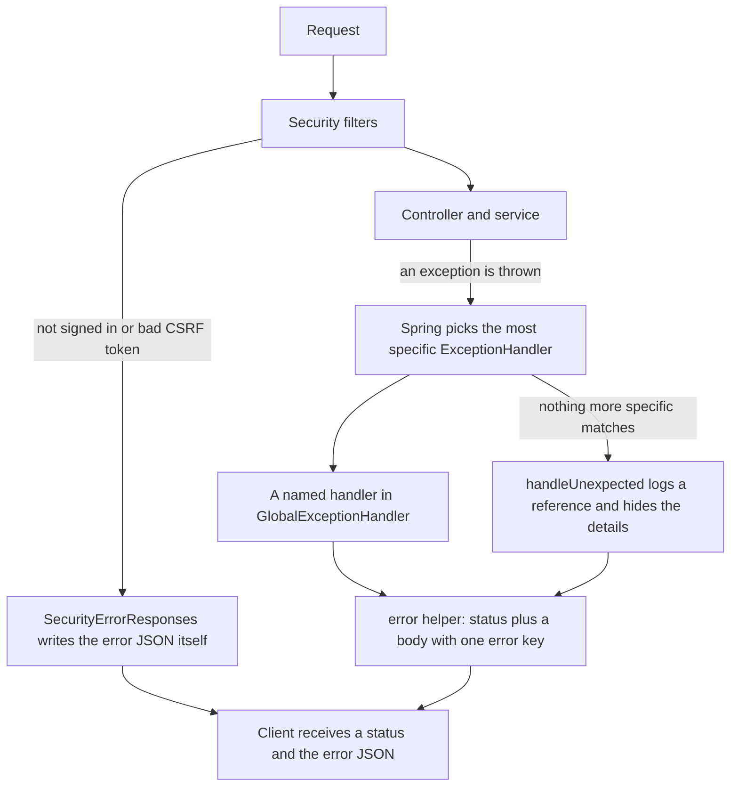

<!-- chapter: 13 | part: II | owner: writer-backend | tag: book-m3-hardening | status: expanded -->
# Chapter 13: Validation, configuration properties and errors

A server that accepts anything a client sends will eventually be hurt by it. This chapter teaches three habits the Secure Document Viewer applies from milestone 3 onward: check every input, refuse to start with a broken configuration, and answer every failure in one predictable JSON shape that never leaks internals. It ends with the layered limits that keep a hostile upload from taking the server down.

## Learning objectives

By the end of this chapter, you will be able to:

- Explain why a server must validate input that the user interface has already checked.
- Add Bean Validation annotations to a request record and to request parameters, and predict the resulting error.
- Explain how `ViewerProperties` makes the application fail at startup when a secret is missing.
- Describe how `GlobalExceptionHandler` maps exceptions to status codes and one JSON error body, and add a new mapping.
- Explain why the catch-all handler returns a reference code rather than the exception message.
- Name the layers of limits on an upload and the order in which they apply.

## Prerequisites

- Chapter 5: exceptions
- Chapter 11: Spring Boot foundations (beans, `application.yml`)
- Chapter 12: REST controllers and JSON

**A note on versions.** Most listings in this chapter are quoted at `book-m3-hardening` (Spring Boot 3.3.4, Java 21), where these features were added. Listings 13.1 and 13.2, the paging snippet, the two short excerpts in Section 13.5 and Listings 13.6 and 13.7 come from `book-m6-final` (Spring Boot 4.1.1, Java 25). At `book-m6-final`, `ViewerProperties` has more settings and different defaults (for example `tileRateLimitPerWindow` is 180, not 120), and `GlobalExceptionHandler` has extra handlers, but the parts quoted here are unchanged. One name changed with Spring 7: the constant for status 413 is `HttpStatus.PAYLOAD_TOO_LARGE` in the m3 code and `HttpStatus.CONTENT_TOO_LARGE` at `book-m6-final`; the status is the same.

Terms used here and explained where they appear: **`Accept` header** (the request header naming the content types the caller can receive; Chapter 8), stack trace (the list of method calls at the moment of an exception; Chapter 3), **log** (Chapter 11), **`Retry-After`** (a response header telling the client how many seconds to wait; Chapter 12), and **UUID** (a randomly generated identifier, used here only to make a short reference code).
## Beginner tier: Never trust input

### 13.1 Never trust input

Picture a bank teller who checks that a deposit slip is filled in, but never looks at the check itself. The form is not the security; the teller's check is. The Angular app also checks what users type, so a mistake gets a friendly message immediately. But anyone can skip the app and send requests directly with a script, and the browser's checks are just code running on the user's machine, which the user controls. So the server must treat every request as untrusted, however it arrived.

**Where the analogy breaks down:** a teller sees the customer and can judge them. A server never does. It sees only bytes, and it must decide from the bytes alone.

Input arrives in every place Chapter 12 listed: the path, the query string, the body, the headers and uploaded files. Each is a place a client can put something you didn't expect. Some examples the project's checks exist for:

- A username 10 MB long, which would be read into memory and then stored.
- A page size of `-1` or `1000000`, meant to make the admin screen load the whole audit table.
- A `type` filter that isn't one of the known event names.
- A password of 30 emoji (Chapter 15), which a hashing library refuses.
- A "PDF" that is really something else, or a real PDF built to be enormous once drawn (Section 13.9).

Validation has two jobs. It **protects the system**: a bad value never reaches the database or an expensive operation. And it **helps the caller**: an error message that says what to fix. The rest of the chapter is about doing both consistently.

### 13.2 Bean Validation annotations

**Bean Validation** is a standard set of annotations that state rules directly on the data, so the rule sits next to the thing it protects. Table 13.1 lists the ones the project uses.

**Table 13.1 — Bean Validation annotations used in the project**

| Annotation | Rule | Where |
|---|---|---|
| `@NotBlank` | Not `null`, not empty, not only spaces | Sign-in and account requests |
| `@NotNull` | Not `null` | The `role` of a new account |
| `@Size(max = 64)` | Text length at most 64 (`min` also works) | Usernames, audit filters |
| `@Min(0)`, `@Max(500)` | A number's lower and upper bound | Paging of the audit log |

Spring runs the rules for you when a method parameter is marked `@Valid`. Listing 13.1 is the sign-in request.

**Listing 13.1 — The sign-in request record in `AuthController.java` (`book-m6-final`, simplified: only the record and the start of the method)**

```java
public record LoginRequest(@NotBlank @Size(max = 64) String username,
                           @NotBlank @Size(max = 128) String password) {
}

// ...

@PostMapping("/login")
public ResponseEntity<CurrentUser> login(@Valid @RequestBody LoginRequest body,
                                         HttpServletRequest request,
                                         HttpServletResponse response) {
```

*Path: `src/main/java/com/example/securedocviewer/controller/AuthController.java`*

Read the record first: a sign-in must have a username of 1 to 64 characters that isn't blank, and a password up to 128 characters that isn't blank. `@Valid` on the parameter tells Spring: "before you call this method, check the rules on this object." If a rule fails, the method is never called. That's the protection: the body of `login` can assume it has non-blank, bounded text.

**A worked example.** A script sends `POST /api/auth/login` with the body `{"username": "", "password": "x"}`. The steps:

1. Jackson builds a `LoginRequest` with an empty `username` (Chapter 12).
2. Because of `@Valid`, Spring validates it. `@NotBlank` on `username` fails.
3. Spring throws `MethodArgumentNotValidException` *instead of* calling `login`.
4. `GlobalExceptionHandler` (Section 13.5) catches it, takes the first field error, and answers `400 Bad Request` with `{"error": "username: must not be blank"}`. The words `must not be blank` are the standard message of `@NotBlank`; you can replace it with `@NotBlank(message = "...")`, as `ViewerProperties` does in Section 13.4.

The caller learns what to fix, and the sign-in code, the throttle and the audit log never see the request.

### 13.3 Rules on single parameters

Bodies aren't the only input. `AdminController.audit` restricts its paging parameters directly on the method:

```java
@RequestParam(defaultValue = "0") @Min(0) int page,
@RequestParam(defaultValue = "50") @Min(1) @Max(500) int size
```

(`book-m6-final`, `AdminController.java`, excerpt.) A caller can't ask for a page size of a million rows, which would otherwise load the audit table into memory. The rule sits in the signature, where a reader of the code sees it. A failure here raises a different exception, `HandlerMethodValidationException`, because Spring validates method parameters through a different path than request bodies.

There are, in fact, three related exception types. `MethodArgumentNotValidException` is for a validated request body. `HandlerMethodValidationException` is for rules on individual parameters like the two above. Jakarta's `ConstraintViolationException` is for rules checked elsewhere in the code. The handler class has one method for each, and they all answer with the same `400` shape, so a client never has to know which mechanism caught the problem.

The project's own tests show the whole set of cases. This one is real:

**Listing 13.2 — `SecurityIntegrationTest.java` (`book-m6-final`, excerpt: test `auditLimitIsValidated`; the test administrator's password is replaced by the placeholder `<test-admin-password>`, as this book never prints secret values)**

```java
@Test
void auditLimitIsValidated() throws Exception {
    MockHttpSession admin = login("admin", "<test-admin-password>");
    mvc.perform(get("/api/admin/audit").param("size", "0").session(admin)).andExpect(status().isBadRequest());
    mvc.perform(get("/api/admin/audit").param("size", "501").session(admin)).andExpect(status().isBadRequest());
    mvc.perform(get("/api/admin/audit").param("page", "-1").session(admin)).andExpect(status().isBadRequest());
    mvc.perform(get("/api/admin/audit").param("type", "NOT_A_TYPE").session(admin))
            .andExpect(status().isBadRequest());
    mvc.perform(get("/api/admin/audit").param("size", "10").session(admin)).andExpect(status().isOk());
}
```

*Path: `src/test/java/com/example/securedocviewer/security/SecurityIntegrationTest.java`*

The four refused cases are the boundaries: one below the minimum size, one above the maximum, a negative page, and a value that isn't in the enum. The last line is the control: a valid request still succeeds. A test that only checked refusals would pass for a server that refused everything. Note also the last refused case, `type=NOT_A_TYPE`: there is no annotation for it. Spring can't convert the text into the `AuditEventType` enum, raises a conversion error, and the handler in Section 13.5 answers `400` with `Invalid value for 'type'.`

## Intermediate tier: Failing early and speaking one language

*If you're reading for the first time, Sections 13.4 and 13.5 are the important ones here; 13.6 is a short bridge between the layers.*

### 13.4 Typed configuration (`ViewerProperties`) that fails fast

Chapter 11 showed the `secure-doc-viewer:` block of `application.yml`. `ViewerProperties` is the Java class that receives it. Listing 13.3 shows the parts that matter.

*Pattern note: Reading settings from the environment is twelve-factor configuration (Chapter 39, Section 39.12).*

**Listing 13.3 — `ViewerProperties.java` (`book-m3-hardening`, simplified: the other settings and all getters and setters are omitted)**

```java
@Component
@ConfigurationProperties(prefix = "secure-doc-viewer")
@Validated
public class ViewerProperties {

    private String storageRoot = "./storage";
    // ...
    /**
     * HMAC key for tile tokens and session-derived values. Supplied via the
     * SIGNING_SECRET environment variable; startup fails if it is missing or
     * too short to be a real key, rather than failing on the first tile.
     */
    @NotBlank(message = "SIGNING_SECRET must be set")
    @Size(min = 32, message = "SIGNING_SECRET must be at least 32 characters")
    private String signingSecret;
    // ...
}
```

*Path: `src/main/java/com/example/securedocviewer/config/ViewerProperties.java`*

`@ConfigurationProperties(prefix = "secure-doc-viewer")` tells Spring to copy each key under that prefix into the matching field. `storage-root` in the file becomes `storageRoot` in Java: Spring matches the two spellings (this is called **relaxed binding**), so YAML can use dashes while Java uses camel case. Defaults such as `"./storage"` apply when a key is absent. Types are converted for you: the file says `render-timeout: 3m` and `session-max-lifetime: 12h`, and the corresponding fields at `book-m6-final` are `Duration` objects, so a value that isn't a valid duration stops startup instead of silently becoming zero.

`@Validated` switches on the same Bean Validation rules from Section 13.2. So a missing or short `signingSecret` stops the program during startup, with the message you wrote in the annotation. The signing secret matters more than any other value here: it is the key that signs every tile URL (Chapter 17), so a blank or guessable one would let anyone forge links. The project's `application.yml` reads it from an environment variable, `signing-secret: ${SIGNING_SECRET:}`, with an *empty* default on purpose, so forgetting it is an error rather than a hidden weak default. The source comment states the intent: "startup fails if it is missing or too short to be a real key, rather than failing on the first tile."

Compare with reading each value by hand using `@Value("${...}")`, which the project still does for a few single settings (`BootstrapAdmin` reads two). A typed class gives you a name, a type, a default and a rule in one place, and IDEs can autocomplete and check the names. It also fails early. A server that started without a signing secret would discover the problem only when it tried to sign its first tile URL, in front of a real user. The habit is worth copying: **make the program refuse to start rather than misbehave later.**

One subtlety. The rules apply when *Spring* fills the object from configuration. A unit test that writes `new ViewerProperties()` and calls setters skips validation entirely (Chapter 18 points out the trap). That's why the integration tests, which start the whole application, matter for configuration.

### 13.5 One JSON error shape: `GlobalExceptionHandler`

When something goes wrong, a client needs to know two things: the status code, and a message it can show. If every endpoint invented its own format, the Angular app would need many code paths. The project uses one: `{"error": "message"}`.

Java signals a failure by throwing an exception (Chapter 5). Spring lets you write a class of **exception handlers**, methods that catch a given exception type anywhere in the controllers and turn it into a response. The class is marked `@RestControllerAdvice`, and each method is marked `@ExceptionHandler`. Figure 13.1 shows the route an error takes from the moment something throws to the JSON the client receives.



*Figure 13.1 — The path of an error from a thrown exception to the JSON body*

<!-- source: GlobalExceptionHandler.java and SecurityErrorResponses.java at book-m3-hardening and book-m6-final -->

Notice the two roads into the same JSON. Failures raised inside a controller or service travel down the middle of the figure: Spring chooses the handler whose exception type is the closest match, and the catch-all `Exception` handler is only the last resort. Failures raised earlier, in the security filters, never reach the handler class at all, so `SecurityErrorResponses` writes the same shape by hand (Section 13.6). Both roads end at a status and a body with one `error` key, which is why the browser app needs only one way to read a failure.

**Listing 13.4 — `GlobalExceptionHandler.java` (`book-m3-hardening`, simplified: imports and most handlers omitted)**

```java
@RestControllerAdvice
public class GlobalExceptionHandler {

    @ExceptionHandler(BadCredentialsException.class)
    public ResponseEntity<Map<String, String>> handleBadCredentials(BadCredentialsException e) {
        return error(HttpStatus.UNAUTHORIZED, "Invalid username or password.");
    }

    @ExceptionHandler({DocumentNotFoundException.class, ResourceNotFoundException.class})
    public ResponseEntity<Map<String, String>> handleNotFound(RuntimeException e) {
        return error(HttpStatus.NOT_FOUND, e.getMessage());
    }

    // ... more handlers ...

    private static ResponseEntity<Map<String, String>> error(HttpStatus status, String message) {
        return ResponseEntity.status(status)
                .contentType(MediaType.APPLICATION_JSON)
                .body(Map.of("error", message));
    }
}
```

*Path: `src/main/java/com/example/securedocviewer/controller/GlobalExceptionHandler.java`*

Each `@ExceptionHandler` names the exception types it catches. The second handler shows that one method can serve several types, and that it can use the exception's own message (`e.getMessage()`) when that message is safe to show. The helper at the bottom is where the shape is defined, once: a response with the given status, an explicitly set JSON content type (the reason for that is the incident in Section 13.7), and a body that is a one-entry map, which Jackson writes as `{"error": "..."}`.

The project defines its own small exception classes, and their comments say what they mean. `BadRequestException` is "a request that is well-formed HTTP but breaks a business rule; mapped to 400". `LoginLockedException` is "Too many failed sign-ins; mapped to 429 with Retry-After". A service simply throws the one that fits. Here is a real one, from the document service:

```java
private static String validTitle(String title) {
    String trimmed = title == null ? "" : title.trim();
    if (trimmed.isEmpty() || trimmed.length() > MAX_TITLE_LENGTH) {
        throw new BadRequestException("Title must be 1-" + MAX_TITLE_LENGTH + " characters.");
    }
    return trimmed;
}
```

(`book-m6-final`, `DocumentService.java`.) This is validation the annotations can't do, because it depends on a rule that includes trimming. It throws `BadRequestException` with a message meant for the user, and the handler decides the rest. The service knows *what went wrong*; the handler decides *how HTTP says so*. Keeping HTTP details out of business code means a service can be called from a test, a scheduled job or another service without a web server in sight.

**Table 13.2 — A sample of the mapping (`GlobalExceptionHandler`)**

| Exception | Status |
|---|---|
| `MethodArgumentNotValidException`, `HandlerMethodValidationException`, `ConstraintViolationException` | 400 |
| `HttpMessageNotReadableException` (body missing or malformed) | 400 |
| `MissingServletRequestParameterException`, `MissingServletRequestPartException`, `MissingRequestHeaderException` | 400 |
| `MethodArgumentTypeMismatchException` (wrong type, such as text for a number) | 400 |
| `BadCredentialsException`, `InvalidTokenException` | 401 |
| `ForbiddenException` | 403 |
| `DocumentNotFoundException`, `ResourceNotFoundException`, unknown route | 404 |
| `HttpRequestMethodNotSupportedException` | 405 |
| `UsernameTakenException` | 409 |
| `MaxUploadSizeExceededException` | 413 |
| `RateLimitExceededException`, `LoginLockedException` | 429 with `Retry-After` |
| any other `Exception` | 500 |

A validation handler picks only the first error. This is the real one for request bodies:

```java
@ExceptionHandler(MethodArgumentNotValidException.class)
public ResponseEntity<Map<String, String>> handleInvalidBody(MethodArgumentNotValidException e) {
    String message = e.getBindingResult().getFieldErrors().stream()
            .findFirst()
            .map(fieldError -> fieldError.getField() + ": " + fieldError.getDefaultMessage())
            .orElse("Invalid request.");
    return error(HttpStatus.BAD_REQUEST, message);
}
```

(`book-m6-final`, `GlobalExceptionHandler.java`, excerpt.) It builds the message `username: must not be blank` from the field name and the annotation's message, and returns just the first, so the client gets one clear sentence to fix at a time. `Optional`'s `orElse` supplies a fallback for the odd case with no field error.

**Adding a mapping is a three-step habit.** To add "409 when a document title already exists", you write a small exception class, throw it from the service where the rule is decided, and add one `@ExceptionHandler` method that calls `error(HttpStatus.CONFLICT, e.getMessage())`. No controller changes. Exercise 13.3 asks you to do it.

### 13.6 Errors raised before a controller runs

The advice class only sees exceptions thrown while a controller is handling a request. Failures inside the security filter chain (not signed in, or a missing CSRF token, the guard against forged requests that [Chapter 16](16-spring-security-defenses.md) explains) happen earlier, so the advice never sees them. `SecurityErrorResponses` writes the same `{"error": ...}` JSON itself, so a caller gets one shape whether the failure came from a controller or a filter (Chapter 16). It's a good example of a rule that had to be applied twice, in two places, because the framework has two paths.

## Advanced tier: Not leaking, and setting limits

*You can skip to "In this project" on a first read; Part IV's Chapter 28 tells how the hardening milestone added these.*

### 13.7 Not leaking internals (generic 500 with a reference)

A helpful error message can be dangerous. An unhandled exception might say `SELECT * FROM ... WHERE path='C:/internal'`, which tells an attacker the database, table and file layout. Listing 13.5 is the last-resort handler.

**Listing 13.5 — The catch-all handler (`book-m3-hardening`)**

```java
/** Last resort: never leak internals, but make the failure traceable in the log. */
@ExceptionHandler(Exception.class)
public ResponseEntity<Map<String, String>> handleUnexpected(Exception e) {
    String reference = UUID.randomUUID().toString().substring(0, 8);
    log.error("Unhandled error, reference {}", reference, e);
    return error(HttpStatus.INTERNAL_SERVER_ERROR,
            "Something went wrong on our side. Reference: " + reference + ".");
}
```

*Path: `src/main/java/com/example/securedocviewer/controller/GlobalExceptionHandler.java`*

`Exception` is the parent of every exception, so this handler catches whatever the more specific handlers above it didn't; Spring picks the most specific match. The client gets a generic sentence and an eight-character reference made from a random UUID. The full exception, with its stack trace, goes to the server log next to the same reference (`log.error(..., reference, e)`). When a user reports "reference 3f9a1c22", an operator searches the log for it and finds exactly what happened. Nothing sensitive crosses the network, and the failure is still traceable.

`ErrorContractTest` proves this. It adds a controller that throws an exception whose message contains a fake SQL statement and a file path, calls it, and asserts that the response is `500`, starts with `Something went wrong on our side. Reference: `, and contains neither the SQL nor the path (Chapter 18, Listing 18.5). The test's fake secrets are on purpose: it checks by content, not just by status.

#### A real incident: the handler that failed on images

The comment above `GlobalExceptionHandler` records a subtle bug. *The problem:* on the tile endpoint, which answers with PNG images, a clean `401` or `429` turned into a `500`. *How it was found:* during the first manual test pass of the running app in a browser, before the hardening milestone, and fixed then (it was already fixed at `book-m1-accounts`). *The cause:* Spring negotiates the content type of a response body against the request's `Accept` header, which lists what the caller is willing to receive. The tile endpoint's callers may accept *only images*, so a JSON error body was "not acceptable", the error handler itself failed, and the failure of the failure was a `500`. *The fix:* the `error(...)` helper always sets `MediaType.APPLICATION_JSON` explicitly, as in Listing 13.4. *The lesson:* error paths are code too, and they need tests as much as success paths do. <!-- source: dossier bugs-and-findings A3 and DOSSIER 'Ch 13 incident reference' (fixed in commit 32d040f, PR #1; the m3 handler carries the class comment); phase 3b commit 335e0b0 only made the JSON error contract consistent -->

### 13.8 Do not trust a message you will show

Two smaller rules follow from the same idea. First, decide which exceptions carry messages meant for users. `BadRequestException` and friends are written with user-facing text, so their handlers show `e.getMessage()`. Anything else goes to the generic 500. Second, remember that some messages include a value the caller sent. Most of the project's messages are fixed text (`"Invalid username or password."`) or a field name (`"Missing required 'token'."`), but a few echo a name back, such as `"No user named '<name>'."`. The server returns these inside a JSON string with an explicit content type, so they are never interpreted as markup; but any client that displays an error message must treat it as plain text and never insert it into a page as HTML. Angular's templates escape text by default (Part III), which is the behavior you want.

### 13.9 Limits: upload size, page count, decompression bombs

Validation isn't only about shape; it's about *size and cost*. A PDF can be small on disk and enormous once drawn: a **decompression bomb**, a file crafted to expand into something that exhausts memory or time. So the project sets limits in layers, cheapest first, and each layer rejects with an ordinary error.

**Table 13.3 — The layers of upload limits (`book-m6-final`)**

| Order | Limit | Where set | Result |
|---|---|---|---|
| 1 | Role: only publishers and admins may upload | `SecurityConfig` | `403`, before the body is read |
| 2 | File size at most 50 MB | `spring.servlet.multipart.max-file-size` | `413` |
| 3 | Upload is streamed to a temporary file, never held in memory | `TileGenerationService.render` | (protects memory) |
| 4 | The file must start with `%PDF-` | `requirePdfSignature` | `400` |
| 5 | The PDF must open, have pages, and at most `max-pages` (500) | `requireWithinLimits` | `400` |
| 6 | Each rendered page at most `max-page-pixels` (40,000,000) | `requireWithinLimits` | `400` |
| 7 | At most `max-concurrent-renders` (2) at a time; others wait up to 30 seconds | `acquireRenderPermit` | `503` with `Retry-After` |
| 8 | A render longer than `render-timeout` (3 minutes) is abandoned | `render` | `400` |

Two of these are worth reading in code. The signature check is the first look inside the file:

**Listing 13.6 — `TileGenerationService.requirePdfSignature` (`book-m6-final`)**

```java
/** Cheap first check: real PDFs start with "%PDF-" (a few writers prepend junk, so allow 1 KB). */
private static void requirePdfSignature(Path file) throws IOException {
    byte[] head = new byte[1024];
    int read;
    try (InputStream in = Files.newInputStream(file)) {
        read = in.readNBytes(head, 0, head.length);
    }
    if (!new String(head, 0, read, StandardCharsets.ISO_8859_1).contains("%PDF-")) {
        throw new BadRequestException("The file is not a readable PDF.");
    }
}
```

*Path: `src/main/java/com/example/securedocviewer/service/TileGenerationService.java`*

It reads only the first kilobyte of the file and looks for the marker `%PDF-`. Nothing is trusted about the file *name* or the declared content type, which the client chooses; the file's own first bytes are what count. The check is cheap, so it goes first, and it doesn't prove the file is a good PDF; the next layers do more.

And the size-and-cost check:

**Listing 13.7 — `TileGenerationService.requireWithinLimits` (`book-m6-final`)**

```java
private void requireWithinLimits(PDDocument document) {
    int pageCount = document.getNumberOfPages();
    if (pageCount == 0) {
        throw new BadRequestException("The PDF has no pages.");
    }
    if (pageCount > properties.getMaxPages()) {
        throw new BadRequestException("The PDF has " + pageCount + " pages; the limit is "
                + properties.getMaxPages() + ".");
    }
    double scale = properties.getRenderDpi() / 72.0;
    for (int i = 0; i < pageCount; i++) {
        PDPage page = document.getPage(i);
        PDRectangle box = page.getCropBox();
        boolean rotated = page.getRotation() % 180 != 0;
        double width = (rotated ? box.getHeight() : box.getWidth()) * scale;
        double height = (rotated ? box.getWidth() : box.getHeight()) * scale;
        if (width * height > properties.getMaxPagePixels()) {
            throw new BadRequestException("Page " + (i + 1) + " is too large to render ("
                    + Math.round(width) + "x" + Math.round(height) + " px).");
        }
    }
}
```

*Path: `src/main/java/com/example/securedocviewer/service/TileGenerationService.java`*

This is the decompression-bomb defense. A PDF page has a size in points (72 to an inch), so the code can compute the *pixel size it would render to* (`scale = dpi / 72`) *without rendering it*, and compare the area with the limit. It even accounts for a page rotated by 90 degrees, which swaps width and height. A poster-sized page at 150 DPI is refused up front with a message naming the page. The comments on the settings in `ViewerProperties` say the same: the limit is on the "Largest rendered page allowed (width x height at render DPI); stops decompression-bomb PDFs."

**The incident behind the layers.** The first version of the upload read the whole file into memory, had no limits and rendered synchronously, so one large or hostile file could take the server down. A threat-modeling review (an AI agent playing a security reviewer) found it. The fix arrived in stages, each tied to a review round: streaming to a temporary file, the `%PDF-` check, the page and pixel limits and the `413` for oversized files came first; a cap of two concurrent renders (with `503` and `Retry-After`) followed; and a *time* limit came last, after a review round asked what happens if a pathological PDF holds one of two render slots forever. <!-- source: dossier bugs-and-findings B (TM-5), G3; commits 3de764d, cd0f5c2, 1ce2c8b --> The lesson is that limits come in several dimensions (size, count, area, concurrency and time), and each protects a different resource.

Every limit here is a setting, not a constant. `application.yml` documents them, and the frontend has its own size check, so the user sees a refusal before waiting for a long upload. The comments in the file say to keep the three in step: the multipart limit, `GlobalExceptionHandler.MAX_UPLOAD_MB` and the frontend.

### 13.10 Common mistakes

- **Trusting the interface's checks.** The browser's validation is a courtesy. The server's is the rule.
- **Validating only the shape.** A field can be the right type and still be a hundred megabytes. Bound sizes, counts and ranges.
- **Returning the exception's message from an unexpected error.** It can contain SQL, file paths or secrets. Use a generic message and a log reference.
- **Different error shapes in different places.** The client must handle each one. One helper builds them all, including the ones written by the security filters.
- **Forgetting the content type of an error.** An error body without an explicit content type can fail in negotiation (Section 13.7).
- **Checking a limit after doing the expensive work.** Order the checks cheapest first: the role, the size, the signature, then the rendering.
- **Testing only the refusals.** Also test that a valid request passes, as in Listing 13.2.
- **Having a default for a secret.** A default signing key means a deployment that forgot to set one is silently insecure. Leave it empty and validate.

## In this project

**Table 13.4 — Where Chapter 13's ideas live**

| Idea | File | Tag |
|---|---|---|
| Request validation | `controller/AuthController.java`, `controller/AdminController.java` | `book-m6-final` |
| Typed, validated settings | `config/ViewerProperties.java` | `book-m3-hardening` |
| Error mapping | `controller/GlobalExceptionHandler.java` | `book-m3-hardening` |
| Filter-chain errors | `security/SecurityErrorResponses.java` | `book-m6-final` |
| Error contract test | `src/test/.../controller/ErrorContractTest.java` | `book-m3-hardening` |
| Upload limits | `service/TileGenerationService.java`, `src/main/resources/application.yml` | `book-m6-final` |

## Try it

### Exercise 13.1 ★ Which rule stops a long username?

Which annotations stop a sign-in request whose username is 200 characters long, and what status and message does the client see? Check by reading Listing 13.1 and `GlobalExceptionHandler`.

*Solution:* Appendix C, Exercise 13.1.

### Exercise 13.2 ★ The reference code

What JSON does the server return for an unexpected exception? Which parts are safe to show a user, and where does the rest go?

*Solution:* Appendix C, Exercise 13.2.

### Exercise 13.3 ★★ Add an exception and a mapping

On your own branch, add a `ConflictException` and map it to `409` in the handler. Write a `MockMvc` test with a small test-only controller, like `ErrorContractTest`'s, that throws it, and check the status and the JSON. Where does the message text come from?

*Solution:* Appendix C, Exercise 13.3.

### Exercise 13.4 ★★ Start without the secret

On your own copy, unset `SIGNING_SECRET` (and check that a `.env` file isn't supplying it, because the project imports `.env` as a fallback) and start the application. Read the error. Which line of `ViewerProperties` produced it? Then set a 10-character value and start again, and compare the message.

*Solution:* Appendix C, Exercise 13.4.

### Exercise 13.5 ★★★ Design the limits

You are adding an image upload for user avatars, at most 2 MB. List the layers of limits you'd apply, in order, and for each say what status it returns and what resource it protects. Which of the project's PDF limits have no equivalent for a small image, and which are still needed?

*Solution:* Appendix C, Exercise 13.5 (a worked outline).

### Exercise 13.6 ★★★ Why three places?

The upload limit appears in `application.yml`, in `GlobalExceptionHandler.MAX_UPLOAD_MB` and in the frontend. Explain what a user experiences if the frontend allows 100 MB while the server allows 50 MB, and propose a way to keep the three values from drifting apart.

*Solution:* Appendix C, Exercise 13.6 (a worked outline).

## Summary

- The server validates every input, whatever the UI already checked; validation protects the system and helps the caller.
- Bean Validation annotations (`@NotBlank`, `@Size`, `@Min`, `@Max`) plus `@Valid` state the rules next to the data; three related exception types cover bodies, parameters and other checks, and all answer `400`.
- `@ConfigurationProperties` with `@Validated` turns configuration into a typed class and stops startup when a required value is wrong.
- `@RestControllerAdvice` maps exceptions to status codes and one `{"error": ...}` body, always with an explicit JSON content type; services throw meaning, and the handler decides the status.
- Unexpected errors return a generic message and a reference; details stay in the log.
- Upload limits come in layers (role, size, signature, page count, page area, concurrency, time), checked cheapest first, so a hostile file is refused before it can cost much.

## Further reading

- *Spring Framework Reference Documentation*, "Validation, Data Binding, and Type Conversion." https://docs.spring.io/spring-framework/reference/core/validation.html
- *Spring Boot Reference Documentation*, "Type-safe Configuration Properties." https://docs.spring.io/spring-boot/reference/features/external-config.html#features.external-config.typesafe-configuration-properties
- *Spring Framework Reference Documentation*, "Error Responses." https://docs.spring.io/spring-framework/reference/web/webmvc/mvc-ann-rest-exceptions.html
- *OWASP Cheat Sheet Series*, "Input Validation Cheat Sheet." https://cheatsheetseries.owasp.org/cheatsheets/Input_Validation_Cheat_Sheet.html
- *OWASP Cheat Sheet Series*, "File Upload Cheat Sheet." https://cheatsheetseries.owasp.org/cheatsheets/File_Upload_Cheat_Sheet.html
