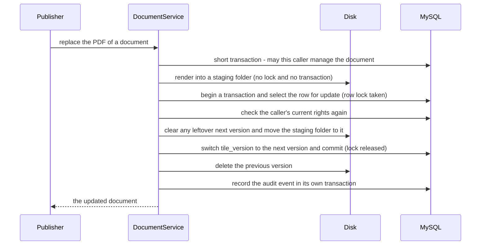

<!-- chapter: 14 | part: II | owner: writer-backend | tag: book-m2-documents | status: expanded -->
# Chapter 14: Storing data with JPA and Flyway

The Secure Document Viewer keeps accounts, documents, shares, and an audit trail in MySQL. This chapter shows how Java objects map to database tables and how the schema is created and changed safely. It then covers how transactions keep changes all-or-nothing, how a row lock stops two people from replacing the same PDF at once, and how timed cleanup jobs run. It also tells the real bugs that taught the project these lessons: audit rows that vanished, and timestamps that came out in the wrong time zone.

## Learning objectives

By the end of this chapter, you will be able to:

- Explain the mismatch between objects and tables and how an object-relational mapper (ORM) bridges it.
- Read an entity class and a Spring Data repository interface, including a query method whose name is a small sentence.
- Explain what a transaction is, and compare `@Transactional` with `TransactionTemplate`.
- Read a Flyway migration and explain why the schema is versioned SQL files, never edited after they run.
- Explain a row lock, and when `REQUIRES_NEW` is needed.
- Describe how `@Scheduled` runs the project's cleanup sweeps.
- Explain why tests use both H2 and a real MySQL, and why the project stores time in UTC (Coordinated Universal Time).

## Prerequisites

- Chapter 4: classes, objects, records
- Chapter 9: SQL and MySQL (tables, rows, keys, foreign keys)
- Chapter 11: Spring Boot foundations (beans, configuration)
- Chapter 12: REST controllers and JSON (why entities aren't returned directly)

**A note on versions.** The chapter belongs to milestones 1 and 2, but the entity and service listings are quoted from `book-m6-final`, where they're complete. The first two migrations are identical at `book-m2-documents` and `book-m6-final`; the third migration was added in milestone 5 (`book-m5-platform`).

## Beginner tier: Objects on one side, tables on the other

### 14.1 Objects and tables: the mismatch

Java code works with objects that hold other objects: a `Document` has an owner, a list of pages and a set of users it's shared with. A database holds flat tables of rows, linked by numbers called foreign keys. Imagine two ways of describing the same library. One is a set of index cards: each card is a book, and a colored sticker on it says which shelf it belongs to. The other is a set of rooms, where each room contains its shelves and each shelf contains its books. Java is the rooms, and SQL is the index cards. Translating between them by hand means writing SQL for every save and load and copying columns into fields, hundreds of times.

An **ORM** (object-relational mapper) does the translation from declarations you write once. The standard Java specification is **JPA** (Jakarta Persistence). **Hibernate** is the implementation the project uses (Hibernate 7 with Spring Boot 4). **Spring Data JPA** sits on top and writes the common queries for you.

**Where the analogy breaks down:** an ORM feels like a translator who makes the database disappear. It doesn't. Every property you map costs a column, and a careless mapping can run hundreds of queries behind one innocent line of Java. You still need to read the SQL it produces (Chapter 9), and this chapter points out the two places where the project has to be careful: lazy loading and transactions.

### 14.2 Entities and repositories

An **entity** is a class mapped to a table. Listing 14.1 is the account entity.

*Pattern note: A repository hides how objects are stored behind a collection-like interface (Chapter 38, Section 38.2).*

**Listing 14.1 — `AppUser.java` (`book-m6-final`, simplified: getters and setters after the constructors, and two columns, are omitted)**

```java
@Entity
@Table(name = "app_user")
public class AppUser {

    @Id
    @GeneratedValue(strategy = GenerationType.IDENTITY)
    private Long id;

    @Column(nullable = false, unique = true, length = 64)
    private String username;

    @Column(name = "password_hash", nullable = false, length = 100)
    private String passwordHash;

    @Enumerated(EnumType.STRING)
    @Column(nullable = false, length = 20)
    private Role role;

    @Column(nullable = false)
    private boolean enabled = true;

    @Column(name = "created_at", nullable = false)
    private Instant createdAt;

    // ... must_change_password and last_sign_in_at columns omitted ...

    protected AppUser() {
    }

    public AppUser(String username, String passwordHash, Role role) {
        this.username = username;
        this.passwordHash = passwordHash;
        this.role = role;
        this.createdAt = Instant.now();
    }
```

*Path: `src/main/java/com/example/securedocviewer/account/AppUser.java`*

Line by line:

- `@Entity` says "this class is stored in the database," and `@Table(name = "app_user")` names the table. Without `@Table`, Hibernate would guess a name from the class.
- `@Id` marks the primary key, the column that identifies a row. `@GeneratedValue(strategy = GenerationType.IDENTITY)` lets MySQL generate the value (`AUTO_INCREMENT`) when the row is inserted.
- `@Column` maps a field to a column and repeats constraints: `nullable = false` becomes `NOT NULL`, `unique = true` becomes a unique constraint, and `length = 64` is the `VARCHAR` size. The migration in Section 14.5 is where the schema is really defined; these declarations describe it to Hibernate, and mismatches show up as errors when the application runs.
- `@Enumerated(EnumType.STRING)` stores the role as the text `READER`, `PUBLISHER` or `ADMIN`. The alternative, the default, stores the *position* of the name in the enum: `READER` is 0, `PUBLISHER` is 1. Then reordering the enum, or inserting a new role in the middle, silently changes what every stored row means. Storing the name is safer and readable in the database.
- `Instant` is Java's type for a moment in time (Chapter 5). The project maps it to `DATETIME(6)`, and Section 14.9 explains how it's kept in UTC.
- The two constructors: the `protected` one with no parameters exists for Hibernate, which creates entities by calling it and then filling the fields. Your code uses the public one, which forces a caller to supply the required values.

A repository is an interface through which you load and save entities. You write no implementation.

**Listing 14.2 — `AppUserRepository.java` (`book-m6-final`)**

```java
public interface AppUserRepository extends JpaRepository<AppUser, Long> {

    Optional<AppUser> findByUsername(String username);

    boolean existsByUsername(String username);

    List<AppUser> findAllByOrderByUsernameAsc();

    List<AppUser> findTop20ByEnabledTrueAndUsernameStartingWithOrderByUsernameAsc(String prefix);
}
```

*Path: `src/main/java/com/example/securedocviewer/account/AppUserRepository.java`*

Extending `JpaRepository<AppUser, Long>` means "a repository of `AppUser` entities whose ids are `Long`," and it gives you `save`, `findById`, `count`, `delete`, and more without writing them. Each extra method is a **query method**: Spring reads the method's *name* and writes the SQL. Spring creates the implementation as a bean when the application starts, so you inject the interface like any other dependency (Chapter 11), and a name it can't understand stops startup with a clear error.

The last method has the longest name, and it's a good one to take apart. Read it as a sentence, word by word.

**Table 14.1 — How Spring reads `findTop20ByEnabledTrueAndUsernameStartingWithOrderByUsernameAsc`**

| Part of the name | Meaning | SQL idea |
|---|---|---|
| `find` | Load entities | `select ...` |
| `Top20` | At most 20 results | `limit 20` |
| `By` | Conditions follow | `where` |
| `EnabledTrue` | The `enabled` field is true | `enabled = true` |
| `And` | Both conditions must hold | `and` |
| `UsernameStartingWith` | The username begins with the argument | `username like 'prefix%'` |
| `OrderByUsernameAsc` | Sort by username, ascending | `order by username asc` |

The `UserDirectoryController` (Chapter 12) calls it for the "share with" picker. Note also `Optional<AppUser> findByUsername`: the `Optional` (Chapter 5) forces the caller to decide what "no such user" means, instead of hitting a `null` later.

### 14.3 Relationships: `Document`

Accounts are one table. Documents are three linked tables, and the entity for them shows how JPA describes relationships.

**Listing 14.3 — `Document.java` (`book-m6-final`, excerpt: the relationship fields; other columns, constructors, and accessors omitted)**

```java
@Entity
@Table(name = "document")
public class Document {

    @Id
    @Column(length = 36)
    private String id;

    // ... title ...

    @ManyToOne(fetch = FetchType.LAZY, optional = false)
    @JoinColumn(name = "owner_id")
    private AppUser owner;

    // ... visibility, page_count, tile_size, tile_version, created_at, updated_at ...

    @ElementCollection
    @CollectionTable(name = "document_page", joinColumns = @JoinColumn(name = "document_id"))
    @OrderBy("pageIndex")
    private List<DocumentPage> pages = new ArrayList<>();

    @ManyToMany
    @JoinTable(name = "document_share",
            joinColumns = @JoinColumn(name = "document_id"),
            inverseJoinColumns = @JoinColumn(name = "user_id"))
    private Set<AppUser> sharedWith = new HashSet<>();
```

*Path: `src/main/java/com/example/securedocviewer/document/Document.java`*

Each relationship annotation matches a shape of table.

- `@ManyToOne` on `owner`: many documents have one owner. In the table, `document.owner_id` is a foreign key to `app_user.id` (`@JoinColumn(name = "owner_id")` names the column).
- `@ElementCollection` on `pages`: a list of small values that belong entirely to the document and have no life of their own. `DocumentPage` (a class marked `@Embeddable`) holds one page's tile grid. Its rows go in a table `document_page` with the document's id, and `@OrderBy("pageIndex")` keeps them in page order.
- `@ManyToMany` on `sharedWith`: many users can be shared many documents. That needs a third table, `document_share`, holding pairs of ids, which `@JoinTable` names and describes.

Notice `fetch = FetchType.LAZY`. **Lazy loading** means Hibernate doesn't load the owner when it loads the document; it loads it only when your code first calls `getOwner()`. That saves work when you don't need the owner, but it has a catch, described in Section 14.6: the object can only fetch it while a database *session* is still open.

There is also a design point in `replacePages` and `setTitle`: each setter calls `touch()`, which updates the `updatedAt` time. Putting that rule inside the entity means no caller can forget it.

### 14.4 One query, not thirty: `join fetch`

Lazy loading has a famous trap. Suppose you load 30 documents and then read each one's owner name. With lazy loading, Hibernate runs one query for the documents, then one more per document for its owner: 31 queries. This is called the **N+1 problem**, and it's the most common way an ORM makes an application slow. The project avoids it by writing the query explicitly, in JPQL, which is SQL's cousin that talks about entities and fields instead of tables and columns.

**Listing 14.4 — `DocumentRepository.java` (`book-m6-final`, excerpt: method `findVisibleTo`)**

```java
/** Everything a non-admin may open: own, shared with them, or visible to everyone. */
@Query("""
        select distinct d from Document d
        join fetch d.owner
        left join d.sharedWith s
        where d.visibility = :everyone or d.owner.username = :username or s.username = :username
        order by d.createdAt desc
        """)
List<Document> findVisibleTo(@Param("username") String username, @Param("everyone") Visibility everyone);
```

*Path: `src/main/java/com/example/securedocviewer/document/DocumentRepository.java`*

`join fetch d.owner` tells Hibernate to load each document *together with* its owner in the same query. `left join d.sharedWith s` joins the share table so the `where` clause can ask "is this user one of the people it's shared with?." `distinct` removes duplicates that the join creates (a document shared with three people appears in three joined rows). The `:username` and `:everyone` markers are named parameters, filled from the `@Param` arguments; they're passed to the database separately from the query text, which is what keeps them from being read as SQL (Chapter 13 discusses why that matters). The rule "which documents may this user see" is written once, here, in one query, and the list screen calls it (Chapter 12).

## Intermediate tier: Changing data safely

*If you're reading for the first time, Sections 14.5 and 14.6 are the important ones here.*

### 14.5 Flyway migrations (`V1`, `V2`, `V3`)

Someone has to create the tables. If Hibernate did it automatically, the schema would depend on whichever code last ran, and production changes would be guesses. Instead the project sets `spring.jpa.hibernate.ddl-auto: none` ("Flyway owns the schema; Hibernate never alters it," says the comment in `application.yml`) and uses Flyway. Flyway applies numbered SQL files in order and records what it applied in a table, so each file runs exactly once on each database.

**Listing 14.5 — `V1__create_app_user.sql` (`book-m2-documents`, identical at `book-m6-final`)**

```sql
-- Accounts that can sign in. Usernames are stored lower-cased by the
-- application, so the unique constraint is effectively case-insensitive.
CREATE TABLE app_user (
    id            BIGINT       NOT NULL AUTO_INCREMENT,
    username      VARCHAR(64)  NOT NULL,
    password_hash VARCHAR(100) NOT NULL,
    role          VARCHAR(20)  NOT NULL,
    enabled       BOOLEAN      NOT NULL DEFAULT TRUE,
    created_at    DATETIME(6)  NOT NULL,
    PRIMARY KEY (id),
    CONSTRAINT uk_app_user_username UNIQUE (username)
);
```

*Path: `src/main/resources/db/migration/V1__create_app_user.sql`*

Compare it with Listing 14.1: each column matches a field. The filename follows a rule that Flyway reads: `V` for a versioned migration, the version number `1`, two underscores, and a description. The `DATETIME(6)` type stores a date and time to the microsecond, with no time zone (Section 14.9).

Now the relationship tables from Section 14.3.

**Listing 14.6 — `V2__documents_shares_audit.sql` (`book-m2-documents`, identical at `book-m6-final`, excerpt: the share table and its index)**

```sql
-- Explicit per-user grants for PRIVATE documents.
CREATE TABLE document_share (
    document_id VARCHAR(36) NOT NULL,
    user_id     BIGINT      NOT NULL,
    PRIMARY KEY (document_id, user_id),
    CONSTRAINT fk_document_share_document FOREIGN KEY (document_id) REFERENCES document (id) ON DELETE CASCADE,
    CONSTRAINT fk_document_share_user FOREIGN KEY (user_id) REFERENCES app_user (id) ON DELETE CASCADE
);

CREATE INDEX ix_document_share_user ON document_share (user_id);
```

*Path: `src/main/resources/db/migration/V2__documents_shares_audit.sql`*

The **composite primary key** `(document_id, user_id)` means the same user can't be shared the same document twice. `ON DELETE CASCADE` means that deleting a document (or a user) automatically deletes their share rows, so no orphan rows are left pointing at nothing. The index on `user_id` exists because the list query in Listing 14.4 asks "which documents are shared with this user?," and without an index MySQL would scan the whole table for each user. The same migration creates `document`, `document_page`, and the `audit_event` table with four indexes on the columns the admin screen filters by.

The third migration shows how a real schema changes over time.

**Listing 14.7 — `V3__tile_versions_and_account_security.sql` (`book-m6-final`; added in `book-m5-platform`)**

```sql
-- Each render of a document's PDF lives in its own directory ({doc}/v{n});
-- the row points at the committed version, so replacing a PDF switches
-- versions atomically in one transaction. 0 = the original unversioned layout.
ALTER TABLE document ADD COLUMN tile_version INT NOT NULL DEFAULT 0;

-- Admin-set passwords (new accounts, resets) must be changed at first sign-in.
ALTER TABLE app_user ADD COLUMN must_change_password BOOLEAN NOT NULL DEFAULT FALSE;
ALTER TABLE app_user ADD COLUMN last_sign_in_at DATETIME(6) NULL;

-- Addresses an account has recently signed in from successfully (30 days).
-- They are exempt from the account-wide lockout, so failed guesses from
-- elsewhere cannot lock the real user out of their usual device. Stored as
-- a keyed hash of the address (IPv6 grouped by /64), never the raw IP.
CREATE TABLE account_known_ip (
    user_id         BIGINT      NOT NULL,
    ip_hash         VARCHAR(64) NOT NULL,
    last_success_at DATETIME(6) NOT NULL,
    PRIMARY KEY (user_id, ip_hash),
    CONSTRAINT fk_account_known_ip_user FOREIGN KEY (user_id) REFERENCES app_user (id) ON DELETE CASCADE
);
```

*Path: `src/main/resources/db/migration/V3__tile_versions_and_account_security.sql`*

Two habits show here. New columns on tables that already hold rows get a `DEFAULT`, so existing rows are valid the moment the column appears: `tile_version` defaults to `0`, "the original unversioned layout." And a change is a *new file*: nobody edited `V1`.

**Never edit a migration that has run.** Flyway stores a checksum of each applied file in its history table (`flyway_schema_history`, which `MySqlIntegrationTest` queries). If a file that already ran is changed, the checksums differ and Flyway refuses to start, which protects you from databases that silently disagree about their own schema. To change the schema, add `V4__...sql`. If a mistake in an earlier migration must be corrected, the correction is also a new migration.

### 14.6 Transactions: `@Transactional` and `TransactionTemplate`

A transaction groups several database changes so that either all succeed or none do: it either commits (makes them all permanent) or is rolled back. To **roll back** is to undo every change the transaction made. Without one, a crash halfway through "create the document row, then its page rows" would leave half a document. `UserAccountService` uses the simplest form: an annotation.

*Pattern note: `TransactionTemplate` is the template method idea with a callback (Chapter 38, Section 38.5).*

```java
@Transactional
public UserSummary create(String rawUsername, String password, Role role, boolean mustChangePassword) {
```

(`book-m6-final`, `UserAccountService.java`, signature only.) Spring wraps the method in a proxy (a stand-in object with the same methods; Chapter 11, Section 11.8): the proxy begins a transaction and runs your method. It commits if the method returns normally. It rolls back if the method throws an unchecked exception (a `RuntimeException` or an `Error`); a checked exception does not roll back unless you configure `rollbackFor`. The project never sets `rollbackFor`. Its services report failures with runtime exceptions such as `BadRequestException`, so a failed rule rolls back. `DocumentService.replaceFile` wraps a checked `IOException` in an `UncheckedIOException` inside its transaction for the same reason: a checked exception there would commit. Read-only methods use `@Transactional(readOnly = true)`, which lets the database and Hibernate skip work.

Inside a transaction, Hibernate *tracks* every entity it loaded. That's why `UserAccountService.update` can change a user with `user.setEnabled(enabled)` and never call `save`: at commit, Hibernate notices the field differs from what it loaded and writes an `UPDATE`. This is called **dirty checking**. It is convenient, and it surprises people: a setter called inside a transaction is a database write.

**Why entities stay inside the transaction.** The project sets `spring.jpa.open-in-view: false` in `application.yml`. By default Spring keeps the database session open for the whole web request, so a lazy field can be loaded even while the controller writes JSON, which hides performance problems and lets queries run in unexpected places. With it off, an entity's lazy fields work *only* inside the transaction. So `DocumentService` converts entities into plain records (`DocumentDetail`, `DocumentSummary`) *before* the transaction ends, and only records leave the service.

`DocumentService` doesn't use the annotation at all. It holds a `TransactionTemplate` and wraps only the parts that need it:

```java
this.tx = new TransactionTemplate(transactionManager);
// ...
return tx.execute(status -> detail(requireViewable(documentId, viewer, actor), viewer));
```

(`book-m6-final`, `DocumentService.java`, excerpts.) The reason is in the class comment: "Rendering a PDF is slow, so it runs outside any database transaction: render to staging, then commit tiles and metadata." A transaction holds a database **connection**, one of a limited pool the application shares. If uploads held a connection while a PDF rendered for seconds, a few uploads could use up the pool and every other request would wait. The template lets the service open a transaction only around the quick database work.

A **worked example**: the upload in `DocumentService.upload`. In order:

1. Check and normalize the title. (No database yet.)
2. Render the PDF into a staging folder. (Slow, no transaction.)
3. Move the tiles into the document's own directory.
4. `tx.execute(...)`: *inside* one short transaction, re-check that the uploader is still a publisher, load the owner, save the new `Document`, and return the record. If anything throws here, the transaction rolls back and the code that follows the `try` deletes the tiles it moved.
5. Record an audit event. (Its own transaction, Section 14.8.)

Files and rows can't be one transaction, so the code orders the steps so that a failure at any point leaves either nothing or something that a later cleanup removes (Section 14.10).

### 14.7 Locking rows, optimistic, and pessimistic

Two people replacing the same PDF at the same moment could overwrite each other or leave a mixture of old and new tiles. A row lock makes the second wait until the first finishes. `DocumentRepository` has:

```java
/** Row lock for replace/delete, so concurrent changes to one document are serialised. */
@Lock(LockModeType.PESSIMISTIC_WRITE)
@Query("select d from Document d where d.id = :id")
Optional<Document> findByIdForUpdate(@Param("id") String id);
```

(`book-m6-final`, `DocumentRepository.java`, excerpt.) A **pessimistic** lock assumes conflicts are likely and blocks up front: Hibernate adds `for update` to the `select`, so MySQL holds the row until the transaction ends and any other transaction wanting the same row waits. An **optimistic** approach lets both proceed and detects the conflict at save time, usually with a version number column, and one of the two fails and must retry. Optimistic is cheaper when conflicts are rare and retrying is cheap. The project chose pessimistic for replace and delete because a conflict would corrupt *files on disk*, which a retry can't cleanly undo, and because the rows involved are few.

The lock also gives a place for a re-check. `DocumentService.replaceFile` renders the PDF first (slow, no lock) and only then, inside the transaction, calls `findByIdForUpdate` and asks again whether the caller may still manage the document (`canManage(document, currentRoles(viewer))`). The reason is that a render can take a while, and the uploader may have been demoted, or the document handed to someone else, in the meantime. A final review found that this second check was missing; the fix re-reads the caller's current role, enabled state, and ownership under the lock. <!-- source: dossier bugs-and-findings F3 (final threat-modeling review round; the fix's commit is not identified in the dossier) --> The lesson: **an authorization decision has a time of check, and the action has a time of use; if a slow step lies between them, check again at the moment of use.**

Figure 14.1 puts the whole replacement in order, so you can see where the slow work happens, where the lock is held, and what is deleted last.



*Figure 14.1 — Replacing a PDF: render outside the lock, switch versions under it, delete the old version last*

*Text description:* A sequence with four participants: the publisher, `DocumentService`, the disk, and MySQL. Time runs downward. Rendering to a staging folder happens before the row lock is taken. The lock, the rights check, the move to the next version and the switch of `tile_version` happen inside one transaction. The previous version is deleted and the audit event written only after the commit.

<!-- source: DocumentService.replaceFile at book-m6-final -->

Read the figure from top to bottom. The slow step, rendering, happens *before* the lock, so a second publisher isn't kept waiting while pages are drawn. The lock is held only for the short stretch from the `select ... for update` to the commit, which is where the version number changes. The old version is deleted *after* the commit, so a reader who still holds a link to it is never left with nothing on disk: at worst the link answers `410` (Chapter 17). The audit row is written last, in its own transaction (Section 14.8).

## Advanced tier: Separate transactions, cleanup, and real databases

*You can skip to "In this project" on a first read. Part IV tells when each of these was added.*

### 14.8 Separate transactions: `REQUIRES_NEW`

An audit trail must record failures, but a failure rolls back the caller's transaction, and with it any audit row written inside it. `AuditLogService` therefore writes in its own transaction:

```java
@Transactional(propagation = Propagation.REQUIRES_NEW)
public void record(AuditEventType type, Actor actor, Subject subject) {
    insert(Instant.now(), type, actor, subject);
}
```

(`book-m6-final`, `AuditLogService.java`.) **Propagation** says how a method joins a transaction that already exists. The default, `REQUIRED`, joins the caller's. `REQUIRES_NEW` suspends the caller's transaction, opens another, and commits it independently. The class comment gives the reason: the most important events (access denied, a failed operation) "are recorded just before the caller throws and rolls its own transaction back, and must not be rolled back with it."

**A real incident: the audit rows that vanished.** *The problem:* `ACCESS_DENIED` events were never saved. *How it was found:* an automated test written for the documents milestone caught it. *The cause:* the audit write shared the caller's transaction, and the request that was *denied* threw an exception, which rolled the whole transaction back, including the audit row that recorded the denial. *The fix:* audit writes run in their own transaction. The lesson: **the events you most need to keep are the ones that occur when something is failing.** <!-- source: dossier bugs-and-findings C3; commit ba00693; PR #2 -->

Two cautions about this annotation. First, the wrapper sits *between beans*: it only runs when another bean calls the method. A method calling another method on `this` skips the proxy and the annotation does nothing. That is why `AuditLogService` also builds a `TransactionTemplate` with `PROPAGATION_REQUIRES_NEW` for `recordAtMostEvery`, its rate-limited variant, which decides in memory whether to write at all. That method is deliberately *not* annotated: the common case, an event suppressed as a repeat, uses no database connection. Second, the audit code uses plain `JdbcTemplate` SQL rather than JPA entities. Its rows are only inserted and searched, never updated, which is the pattern JPA helps least with, and there is no need to track objects that never change.

### 14.9 Time zones and UTC storage

A `DATETIME` column has no time zone. If a laptop in one zone and a container in another read the same stored value, they disagree about *which moment* it means. The project stores UTC everywhere: the JDBC (Java Database Connectivity) URL in `application.yml` ends with `connectionTimeZone=UTC&forceConnectionTimeZoneToSession=true`, and `hibernate.jdbc.time_zone: UTC` is set under `spring.jpa.properties`. The comment in the file explains: "DATETIME columns hold UTC regardless of the JVM's time zone, so a backend in UTC (Docker) and one in local time (a dev machine) read the same instant back."

**A real incident: audit events from the future.** *The problem:* audit events appeared with times five and a half hours in the future. *How it was found:* the AI product-owner reviewer (Chapter 32 explains how the reviews worked) noticed it while two copies of the backend shared one database. *The cause:* the development copy ran on a laptop in the Asia/Kolkata zone and wrote local time, while the Docker copy wrote UTC, so the same table held both. *The fix:* the team pinned the JDBC connection to UTC and showed UTC in the admin screen so it matches the watermark and the CSV export. It also added a test that runs the JVM in Asia/Kolkata against a MySQL server set to `-03:00` and checks that stored values are UTC. The test was verified to fail without the pinning. <!-- source: dossier bugs-and-findings C6; commits 2d82253, a51674c --> The lesson: **store instants in UTC, and test with a deliberately odd time zone**, because a test that runs in the developer's own zone can't fail.

### 14.10 Timed sweeps with `@Scheduled`

Some data must be cleaned up on a timer. Chapter 11 mentioned `@EnableScheduling`; with it on, a method marked `@Scheduled` runs by itself, on a background thread that Spring manages. The project has six.

Table 14.2 shows the sweeps as they are at `book-m6-final`. This chapter's own tag, `book-m2-documents`, has only three of the six: the audit purge, the sign-in throttle sweep, and the storage janitor. The others arrived in later milestones.

**Table 14.2 — Scheduled sweeps (`book-m6-final`)**

| Method | Schedule | Purpose |
|---|---|---|
| `AuditLogService.purgeExpired` | cron `0 30 3 * * *` (daily, 03:30) | Delete audit events older than `audit-retention-days` (180 by default) |
| `AuditLogService.sweepThrottled` | fixed delay 1 hour | Forget idle throttle keys, first writing a summary of suppressed events |
| `KnownDevices.purgeExpired` | cron `0 45 3 * * *` (daily, 03:45) | Delete known-address rows older than 30 days (the `RETENTION` constant) |
| `LoginThrottle.sweep` | fixed delay 5 minutes | Drop sign-in counters whose failures have aged out |
| `TileRateLimiter.sweep` | fixed delay 5 minutes | Drop per-user tile windows with no recent requests |
| `StorageJanitor.sweep` | 2 minute initial delay, then every 6 hours | Remove tile directories nothing points to |

A **cron expression** lists second, minute, hour, day of month, month, and weekday: `0 30 3 * * *` means "second 0 of minute 30 of hour 3, every day." A **fixed delay** waits that long *after the previous run finishes*, so runs never overlap. The cron values are themselves configurable, as in `@Scheduled(cron = "${secure-doc-viewer.audit-retention-cron:0 30 3 * * *}")`, using the placeholder syntax from Chapter 11. Spring evaluates a cron in the server's time zone unless told otherwise, which is one more reason the app runs in UTC in its container.

The `StorageJanitor` is the most careful of the six, because it deletes files. It touches only directories whose names look like document ids and only ones older than an hour, "once they are old enough that no upload can still be in flight" (its class comment). It keeps every version of a document whose *current* version is missing from disk, because then the other versions may be the only surviving copy; a review of the backup design asked for that rule. <!-- source: dossier bugs-and-findings F1; commit 66f7152 --> Its test builds nine directories of different ages and checks exactly which are removed (Chapter 18). A good sweep is safe to run at any moment, safe to run twice, and logs and moves on when one item fails, so that one locked folder doesn't stop the rest.

### 14.11 Testing with H2 versus a real MySQL

Most tests run against H2, an in-memory database started in MySQL compatibility mode (`jdbc:h2:mem:securedocs;MODE=MySQL;DATABASE_TO_LOWER=TRUE`), so the same Flyway files run with no server. But H2 isn't MySQL. `MySqlIntegrationTest` runs the migrations, the row lock and the timestamp behavior against a real `mysql:8.4` container, and is skipped when Docker isn't available. Chapter 18 explains the tools in detail. The split is a trade: the fast tests run in seconds and catch most mistakes, and the slower one catches the mistakes only the real engine can make.

### 14.12 Common mistakes

- **Editing an applied migration.** Flyway refuses to start. Add a new file instead.
- **Letting Hibernate create the schema.** `ddl-auto: update` or `create` makes production depend on the code that last ran. Keep `none` and use migrations.
- **Ordering enums by position.** Use `EnumType.STRING`.
- **Returning entities from the service.** With `open-in-view: false`, lazy fields fail outside the transaction, and entities expose columns you didn't mean to show. Return records.
- **The N+1 query.** A loop that touches a lazy relationship runs one query per row. Load what you need with `join fetch`.
- **Holding a transaction during slow work.** Rendering a PDF, calling a remote server, or waiting on a file all belong outside it.
- **Calling a `@Transactional` method on `this`.** The proxy is bypassed and no transaction starts.
- **Writing audit rows inside the transaction that may fail.** Use `REQUIRES_NEW`.
- **Testing only in your own time zone.** Deliberately use an odd one.

## In this project

**Table 14.3 — Where Chapter 14's ideas live (`book-m6-final`)**

| Idea | File |
|---|---|
| Entities | `account/AppUser.java`, `document/Document.java`, `document/DocumentPage.java` |
| Repositories | `account/AppUserRepository.java`, `document/DocumentRepository.java` |
| Transactions | `account/UserAccountService.java`, `document/DocumentService.java`, `audit/AuditLogService.java` |
| Migrations | `src/main/resources/db/migration/V1`, `V2` (from `book-m2-documents`), `V3` (from `book-m5-platform`) |
| Sweeps | `AuditLogService`, `KnownDevices`, `LoginThrottle`, `service/StorageJanitor.java` |
| Settings | `src/main/resources/application.yml` (`ddl-auto`, `open-in-view`, JDBC URL, time zone) |

Part IV's chapters on milestones 1 and 2 (Chapters 26 and 27) tell how the schema grew; Chapter 34 covers backups of this database.

## Try it

### Exercise 14.1 ★ Why store the enum as text?

Which annotation stores the role as text, and why is that safer than the default? What would happen to existing rows if you inserted a new role between `READER` and `PUBLISHER` under the default?

*Solution:* Appendix C, Exercise 14.1.

### Exercise 14.2 ★ Find the audit indexes

Find the migration that creates `audit_event`. Which indexes does it define, and which admin filter does each one serve?

*Solution:* Appendix C, Exercise 14.2.

### Exercise 14.3 ★★ Read a query method

Without running anything, write the SQL you'd expect for `existsByUsername` and for `findAllByOrderByUsernameAsc`. Then find another query method in the project and take its name apart as in Table 14.1.

*Solution:* Appendix C, Exercise 14.3.

### Exercise 14.4 ★★ Annotation or template?

Explain why `DocumentService` uses `TransactionTemplate` while `UserAccountService` uses `@Transactional`. For each service, what would go wrong if you swapped the choice?

*Solution:* Appendix C, Exercise 14.4.

### Exercise 14.5 ★★★ Add a migration on a scratch copy

On a scratch branch and a scratch database (never your real one), write `V4` that adds a nullable column `notes VARCHAR(500)` to `document`. Start the app and confirm Flyway applied it. Then edit `V4` and start again, and read the error. What did Flyway check, and how do you make the change you wanted?

*Solution:* Appendix C, Exercise 14.5 (a worked outline).

### Exercise 14.6 ★★★ Predict the race

Two publishers replace the same document at the same moment. Walk through `DocumentService.replaceFile` and say what happens with and without the row lock, including what would be on disk afterward. Which test proves it, and why can't it run on H2?

*Solution:* Appendix C, Exercise 14.6 (a worked outline).

## Summary

- JPA and Hibernate map objects to tables; Spring Data writes common queries from method names; explicit `join fetch` queries avoid the N+1 problem.
- Entities describe tables and relationships (`@ManyToOne`, `@ElementCollection`, `@ManyToMany`); enums are stored as text.
- Flyway applies versioned SQL once each; Hibernate never alters the schema; an applied migration is never edited.
- Transactions make changes all-or-nothing; `TransactionTemplate` keeps slow work outside them, and `open-in-view: false` keeps entities inside them.
- `PESSIMISTIC_WRITE` serializes concurrent changes to one row, and a check made before a slow step must be repeated under the lock.
- `REQUIRES_NEW` commits audit rows even when the caller rolls back.
- `@Scheduled` runs cleanup sweeps that are safe to repeat; test with H2 for speed and real MySQL for truth; store time in UTC and test in an odd zone.

## Further reading

- *Spring Data JPA Reference Documentation*, "Query Methods." https://docs.spring.io/spring-data/jpa/reference/jpa/query-methods.html
- *Spring Framework Reference Documentation*, "Transaction Management." https://docs.spring.io/spring-framework/reference/data-access/transaction.html
- *Spring Framework Reference Documentation*, "Task Execution and Scheduling." https://docs.spring.io/spring-framework/reference/integration/scheduling.html
- *Hibernate ORM Documentation*. https://hibernate.org/orm/documentation/
- *Flyway Documentation*, "Migrations." https://documentation.red-gate.com/flyway
