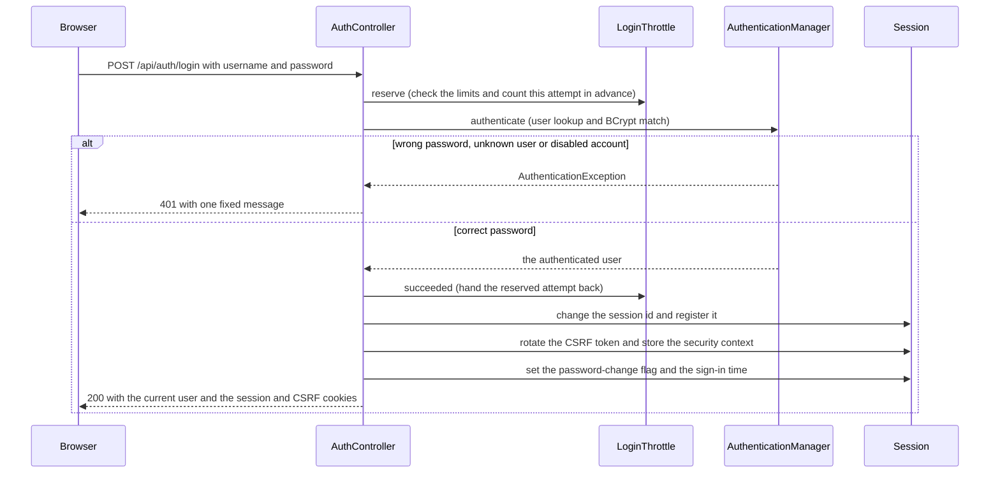

<!-- chapter: 15 | part: II | owner: writer-backend | tag: book-m6-final | status: expanded -->
# Chapter 15: Spring Security I: who are you?

Before the Secure Document Viewer can decide what you may open, it must know who you are. This chapter covers authentication. You learn how the server checks a claim of identity and how passwords are stored so that even the database's owner can't read them. You also learn how a session cookie keeps you signed in, how roles say what an account is for, and why the sign-in endpoint gives the same answer for a wrong password and an unknown user. Chapter 16 then adds the defenses that protect all of this.

## Learning objectives

By the end of this chapter, you will be able to:

- Explain the difference between authentication and authorization.
- Describe what a servlet filter is and how Spring Security's filter chain uses it.
- Explain why passwords are hashed and salted, what BCrypt is, and what its 72-byte limit means in practice.
- Follow one sign-in through `AuthController`, step by step, and say why each step is where it is.
- Explain how a session cookie works, what `httpOnly` and `SameSite` do, and why the project chose sessions over tokens.
- Read `DatabaseUserDetailsService` and the three roles.
- Explain why sign-in reveals nothing about which accounts exist.

## Prerequisites

- Chapter 5: collections, lambdas and exceptions
- Chapter 8: how the web works (cookies, headers)
- Chapter 11: Spring Boot foundations
- Chapter 12: REST controllers and JSON
- Chapter 13: Validation, configuration properties and errors
- Chapter 14: Storing data with JPA and Flyway

**A note on versions.** The chapter belongs to milestone 1 (`book-m1-accounts`), but each listing is labeled with the tag it was copied from. `Role.java` and `DatabaseUserDetailsService.java` are identical at `book-m1-accounts` and `book-m6-final`. The 72-byte check, the full sign-in code and the security chain shown here come from `book-m6-final`, because those files gained features after milestone 1.

## Beginner tier: Proving who you are

### 15.1 Authentication, authorization, and the difference

Authentication answers "who are you?" Authorization answers "what may you do?" Think of an office building with a front desk. Showing your badge to the guard is authentication. The badge reader on each door, which opens only some of them for you, is authorization. This chapter is about the guard; [Chapter 16](16-spring-security-defenses.md) is about the doors.

**Where the analogy breaks down:** a guard sees your face and remembers you. A server sees only a claim, a username and a password typed into a form, and it can't tell a person from a script. It must also re-check on every request, because HTTP has no memory of earlier requests unless you add one (Section 15.6). Nothing here identifies a *human*; it identifies someone who knows the password.

**Spring Security** is the part of the Spring family that does both jobs. You add one dependency, `spring-boot-starter-security`, and Spring Boot 4 with Spring Security 7 protects every endpoint until you say otherwise. That "closed by default" behavior is the right way around: you must open doors on purpose.

### 15.2 The filter chain

A **servlet** is Java's name for a piece of code that handles web requests, and the web server (Tomcat, in this project) hands each request to your application through a chain of **servlet filters**. A filter is code that every request passes through *before* it reaches a controller, and every response passes back through afterward. Each filter can look at the request, change it, stop it (by writing a response itself) or pass it on.

*Pattern note: A filter chain is the chain of responsibility pattern (Chapter 38, Section 38.3; pipes and filters, Chapter 39, Section 39.8).*

Spring Security is a chain of such filters, each with one job. One reads the session and works out who the caller is. One checks the CSRF token (Chapter 16). One decides whether the request is allowed. If any filter refuses, the controller never runs. You describe the chain in one place, a bean of type `SecurityFilterChain`. The project's begins like this.

**Listing 15.1 — `SecurityConfig.java` (`book-m6-final`, simplified: the method's other parameters are omitted, and only the opening lines and the last disabled features are shown)**

```java
@Configuration
@EnableWebSecurity
public class SecurityConfig {

    @Bean
    public SecurityFilterChain securityFilterChain(HttpSecurity http, ...) throws Exception {
        http
                // ... csrf, sessions, headers, authorization rules, custom filters ...
                .requestCache(cache -> cache.disable())
                .formLogin(AbstractHttpConfigurer::disable)
                .httpBasic(AbstractHttpConfigurer::disable)
                .logout(AbstractHttpConfigurer::disable);
        return http.build();
    }
```

*Path: `src/main/java/com/example/securedocviewer/security/SecurityConfig.java`*

`@Configuration` marks a class whose `@Bean` methods create beans by hand (Chapter 11). `@EnableWebSecurity` switches on the Spring Security machinery. The `HttpSecurity` parameter is a builder: you call methods on it to describe the chain, and `http.build()` produces the finished `SecurityFilterChain`.

The last three lines *turn off* features Spring Security would otherwise provide. `formLogin` is a ready-made HTML sign-in page, `httpBasic` is a browser pop-up asking for a username and password, and Spring's built-in `logout` handles a logout address. The project disables all three because the Angular app has its own sign-in screen and talks to its own endpoints, `/api/auth/login` and `/api/auth/logout`, that return JSON (Chapter 12). The middle of the chain, the CSRF and authorization rules, is Chapter 16.

Why write the chain by hand instead of using defaults? Because the defaults assume a server that renders web pages, while this app is an API used by a single-page application. Every default you leave on is a behavior you'd have to understand, test and defend, so the project turns on only what it uses.

### 15.3 Storing passwords: hashing, salting, BCrypt

The database must never contain passwords. Anyone who could read it, through a leaked backup, a stolen disk or a mistake, would have every account, and people reuse passwords across sites. Instead the database stores a **hash**: the output of a one-way function that turns a password into a fixed-length string of characters. "One-way" means that given the hash you can't practically get back the password. To check a sign-in, the server hashes what was typed and compares the two hashes.

*Pattern note: A password encoder that can be swapped or upgraded is the strategy pattern (Chapter 38, Section 38.4).*

Plain hashing has two weaknesses. Two people with the same password would have the same hash, and attackers prepare tables of the hashes of common passwords. The fix for both is a **salt**: random data mixed into each password before hashing, so the same password produces a different hash every time. The salt isn't secret. It's stored beside the hash, and its job is to make precomputed tables useless.

The remaining problem is speed. Ordinary hash functions are designed to be fast, which helps an attacker trying billions of guesses per second. **BCrypt** is a hash function built for passwords. It includes the salt in its output, and it is deliberately slow: it repeats an expensive step many times, and the number of repetitions (the *work factor*) can be raised as computers get faster. Checking one password costs a fraction of a second, which nobody notices when signing in, and multiplies into an enormous cost for someone trying billions of guesses.

A BCrypt hash looks like a 60-character string beginning with something like `$2a$10$`. That prefix names the algorithm version and the work factor, and the rest holds the salt and the result. You'll see in the code that the project stores a slightly longer string, and Listing 15.2 shows why.

**Listing 15.2 — `SecurityConfig.passwordEncoder` (`book-m6-final`; identical logic at `book-m1-accounts`)**

```java
/** Delegating encoder stores "{bcrypt}..." so the algorithm can be upgraded later without a migration. */
@Bean
public PasswordEncoder passwordEncoder() {
    return PasswordEncoderFactories.createDelegatingPasswordEncoder();
}
```

*Path: `src/main/java/com/example/securedocviewer/security/SecurityConfig.java`*

A `PasswordEncoder` is Spring Security's interface for "turn a password into a hash" (`encode`) and "does this password match this hash?" (`matches`). The **delegating** encoder adds a label to what it stores, such as `{bcrypt}`, and later chooses the algorithm from the label. Suppose in five years the project wants a stronger algorithm. New passwords would be stored as `{newalgo}...`, and old `{bcrypt}...` hashes keep working, so nobody is forced to reset their password. The column that holds the hash is `VARCHAR(100)` (migration `V1`, Chapter 14), which fits the label plus a 60-character hash with room to spare.

#### Worked example: what "matching" means

Suppose an account has the password `<example-password>` (a placeholder: this book never prints real passwords). Table 15.1 shows what the app does, in order. The hash strings are placeholders, not real values.

**Table 15.1 — Creating an account and signing in, from the password's point of view**

| Step | What happens | What is stored or compared |
|---|---|---|
| Create | `encode("<example-password>")` picks a random salt and hashes | `{bcrypt}$2a$10$<salt+hash-A>` saved in `password_hash` |
| Sign in | The user types the password again | Nothing is stored |
| Check | `matches("<example-password>", stored)` reads the salt out of the stored value and hashes the typed password with it | Equal, so the check passes |
| Second account, same password | `encode(...)` picks a *new* salt | `{bcrypt}$2a$10$<salt+hash-B>`, different from A |

The last row is what the salt buys: nobody reading the table can see that two accounts share a password.

BCrypt has a limit that surprises people. It reads only the first 72 **bytes** of a password, and current Spring Security refuses longer input rather than quietly ignoring the rest. `UserAccountService` handles this explicitly.

**Listing 15.3 — `UserAccountService.java` (`book-m6-final`, excerpt: the 72-byte constant and check)**

```java
/** BCrypt uses at most 72 bytes of a password and refuses longer ones. */
public static final int MAX_PASSWORD_BYTES = 72;

public static boolean fitsBcrypt(String password) {
    return password == null || password.getBytes(java.nio.charset.StandardCharsets.UTF_8).length <= MAX_PASSWORD_BYTES;
}
```

*Path: `src/main/java/com/example/securedocviewer/account/UserAccountService.java`*

The check counts bytes in UTF-8, not characters. A letter in the English alphabet is one byte, but an accented letter like `é` takes two, a Chinese character takes three, and an emoji takes four. A passphrase of 20 emoji looks short but is 80 bytes, so it doesn't fit. The rule is enforced when a password is set and again at sign-in (you'll see where in Section 15.5), so an over-long attempt is refused cleanly instead of failing deep inside the hashing library. A related rule in the same class limits passwords to between 12 and 128 characters. Length, more than complexity, is what makes a password hard to guess.

## Intermediate tier: Sessions, roles and the sign-in

*If you're reading for the first time, Sections 15.4 and 15.5 are the heart of the chapter; 15.6 to 15.8 fill in the details.*

### 15.4 Loading users from the database

Spring Security needs one thing from you: given a username, return the account's stored hash and roles. That is a `UserDetailsService`.

**Listing 15.4 — `DatabaseUserDetailsService.java` (`book-m1-accounts`, identical at `book-m6-final`; imports omitted)**

```java
@Service
public class DatabaseUserDetailsService implements UserDetailsService {

    private final AppUserRepository repository;

    public DatabaseUserDetailsService(AppUserRepository repository) {
        this.repository = repository;
    }

    @Override
    public UserDetails loadUserByUsername(String username) {
        AppUser user = repository.findByUsername(UserAccountService.normalizeUsername(username))
                .orElseThrow(() -> new UsernameNotFoundException("Unknown user"));
        return User.withUsername(user.getUsername())
                .password(user.getPasswordHash())
                .roles(user.getRole().name())
                .disabled(!user.isEnabled())
                .build();
    }
}
```

*Path: `src/main/java/com/example/securedocviewer/security/DatabaseUserDetailsService.java`*

Line by line: the class is a `@Service` bean (Chapter 11) that implements the Spring Security interface `UserDetailsService`, whose one method is `loadUserByUsername`. It receives `AppUserRepository` by constructor injection (Chapter 14). It looks the user up by the *normalized* username, lower-cased and trimmed, so `Alice` and `alice` are the same account; the account-creation code enforces the same rule, which is why the `username` column's unique constraint works as a case-insensitive one. If nothing is found it throws `UsernameNotFoundException`, and Spring Security handles the rest.

`User.withUsername(...)` is a builder for Spring Security's own `UserDetails` object, which carries a username, a password *hash*, roles and flags. Note that it holds the stored hash, never a password. `.roles("ADMIN")` becomes the **authority** string `ROLE_ADMIN`: Spring stores every permission as a text authority, and `roles(...)` is shorthand that adds the `ROLE_` prefix for you. `.disabled(!user.isEnabled())` marks a switched-off account, which makes authentication fail no matter how correct the password is.

What connects this service to the hash comparison? The `AuthenticationManager` bean in `SecurityConfig` wraps a `DaoAuthenticationProvider`, which is constructed with this service and the password encoder. When asked to authenticate, that provider calls `loadUserByUsername`, checks that the account isn't disabled, and calls the encoder's `matches`. Three small pieces, each with one job, produce the whole check.

### 15.5 Following one sign-in through `AuthController`

Now put the pieces together by reading what happens when the sign-in form is submitted. `AuthController.login` is long, so this section walks through it in three excerpts. Read them slowly; the *order* of the steps is where most of the design lives. Figure 15.1 gives the whole sequence first, so the excerpts have a map.



*Figure 15.1 — The sign-in sequence in `AuthController.login`*

*Text description:* A sequence between the browser, `AuthController`, `LoginThrottle`, the authentication manager and the session. The controller first reserves an attempt from the throttle and then authenticates. A choice follows. A wrong password, unknown user or disabled account gives one fixed `401`. A correct password hands the attempt back, changes the session id, rotates the CSRF token, sets two flags on the session and returns `200` with the cookies.

<!-- source: AuthController.java at book-m6-final -->

Two things to notice. The throttle is asked *before* the password is looked at, and the reservation is given back only on success. And every failure, whatever its cause, ends in the same `401`, while a success creates a session with a *new* id and a *new* CSRF token; the next three excerpts follow the figure step by step.

**Listing 15.5 — `AuthController.java` (`book-m6-final`, excerpt 1 of 3: `login`, start; indentation reduced and the lockout handling replaced by `// ...`)**

```java
@PostMapping("/login")
public ResponseEntity<CurrentUser> login(@Valid @RequestBody LoginRequest body,
                                         HttpServletRequest request,
                                         HttpServletResponse response) {
    String username = UserAccountService.normalizeUsername(body.username());
    String clientIp = request.getRemoteAddr();
    Actor attempted = new Actor(username, null, clientIp);
    boolean recognisedDevice = knownDevices.isRecognised(username, clientIp);
    Instant attempt;
    try {
        attempt = loginThrottle.reserve(username, clientIp, recognisedDevice);
    } catch (LoginLockedException e) {
        // ...
        throw e;
    }
```

*Path: `src/main/java/com/example/securedocviewer/controller/AuthController.java`*

**Step 1: validate and normalize.** `@Valid` applies the length rules from Chapter 13 (`username` at most 64 characters, `password` at most 128) before any code runs, and the username is normalized. **Step 2: reserve an attempt.** `loginThrottle.reserve` checks the sign-in limits and counts this attempt as a failure *in advance*. That surprising order is the subject of Chapter 16. For now, notice that the throttle runs before the password is looked at. A locked-out caller therefore learns nothing about whether their guess was right, and the refusal costs the server almost nothing.

**Listing 15.6 — `AuthController.java` (`book-m6-final`, excerpt 2 of 3: the authentication step; indentation reduced)**

```java
Authentication authentication;
try {
    // BCrypt only looks at 72 bytes and refuses longer input; no stored password is longer.
    if (!UserAccountService.fitsBcrypt(body.password())) {
        throw new BadCredentialsException("Password too long.");
    }
    authentication = authenticationManager.authenticate(
            UsernamePasswordAuthenticationToken.unauthenticated(username, body.password()));
} catch (AuthenticationException e) {
    // Same message for unknown user, wrong password and disabled
    // account, so the response doesn't reveal which accounts exist.
    // The failure was already counted by reserve().
    metrics.signIn(SignInOutcome.FAILURE);
    audit.record(AuditEventType.SIGN_IN_FAILED, attempted, Subject.none());
    throw new BadCredentialsException("Invalid username or password.");
}
```

*Path: `src/main/java/com/example/securedocviewer/controller/AuthController.java`*

**Step 3: authenticate.** The over-long password check (Section 15.3) comes first. Then `authenticationManager.authenticate(...)` is handed an *unauthenticated* token, a plain "someone claims to be this user with this password", and the manager (the `DaoAuthenticationProvider` from Section 15.4) either returns a fully authenticated `Authentication` object or throws an `AuthenticationException`. **Step 4: one answer for every failure.** Whatever went wrong, the code throws a *new* `BadCredentialsException` with a fixed message. Section 15.8 explains why.

In short, the third excerpt does this: *prove the password was right, then start a fresh session, then remember a few facts about it.* If you lose the thread in the details, hold on to that sentence.

**Listing 15.7 — `AuthController.java` (`book-m6-final`, excerpt 3 of 3: success; indentation reduced)**

```java
loginThrottle.succeeded(username, clientIp, attempt);
metrics.signIn(SignInOutcome.SUCCESS);
knownDevices.remember(username, clientIp);
boolean mustChangePassword = accounts.recordSignIn(username);

// Ensure a session exists, then rotate its id and register it.
request.getSession(true);
sessionAuthenticationStrategy.onAuthentication(authentication, request, response);
rotateCsrfToken(request, response);
SecurityContext context = SecurityContextHolder.createEmptyContext();
context.setAuthentication(authentication);
SecurityContextHolder.setContext(context);
securityContextRepository.saveContext(context, request, response);
HttpSession session = request.getSession();
session.setAttribute(PasswordChangeRequiredFilter.SESSION_ATTRIBUTE, mustChangePassword);
session.setAttribute(SessionLifetimeFilter.SIGNED_IN_AT, Instant.now());
sessionMetadata.recordSignIn(session.getId(), clientIp, request.getHeader("User-Agent"));
audit.record(AuditEventType.SIGN_IN, actors.of(request, username), Subject.none());

return ResponseEntity.ok(toCurrentUser(authentication, request));
```

*Path: `src/main/java/com/example/securedocviewer/controller/AuthController.java`*

**Step 5: hand back the reserved attempt** (`succeeded`), because the password was right, and record a few facts. One is a metric (a counter for the operators' dashboard, Chapter 35). Another is the address as a "known device" (an address this account has signed in from successfully; Chapter 16). The last is the account's last sign-in time. The value `mustChangePassword` says whether this account is still using a password an administrator set (Chapter 16, Section 16.7).

**Step 6: create the session.** `request.getSession(true)` makes sure a session exists. `sessionAuthenticationStrategy.onAuthentication` then changes the session's id and registers it, which prevents a **session fixation** attack in which an attacker plants a known id before you sign in (Chapter 16). `rotateCsrfToken` issues a fresh CSRF token. Then the code builds a `SecurityContext`, Spring Security's container for "who is signed in", puts the authenticated user in it, and saves it into the session with `securityContextRepository.saveContext`. From now on, the security filters find the user by reading the session, which is what "being signed in" means in this app.

**Step 7: remember a few things on the session** (whether a password change is pending, and the time of sign-in, used by the lifetime filter in Chapter 16). Then write an **audit event**, a row in the append-only record of who did what (Chapter 14's `REQUIRES_NEW` explained why audit rows survive failures, and Chapter 27 tells how the audit trail was built). Finally, return the current user's public details. The response never includes the session id. The class comment states the rule: it "travels only in the httpOnly session cookie set by the container."

Step 6 raises an obvious question: what *is* the session, and how does the browser present it on the next request?

### 15.6 Sessions and the session cookie (`SDV_SESSION`, httpOnly, SameSite)

HTTP forgets you between requests. Chapter 8 compared the session cookie to a coat-check ticket, and this section shows the real thing. After a successful sign-in, the server creates a session: a record kept on the server, holding the security context and the attributes from Step 7, and identified by a long random id. The server sends that id to the browser in a cookie (Chapter 8), and the browser returns the cookie with every later request. The server looks the id up and knows who is calling. Here is the relevant part of the sign-in response as it travels, written as an example rather than a capture from the project, with a placeholder id.

**Example 15.1 — A sign-in response that sets the session cookie (teaching example)**

```text
HTTP/1.1 200 OK
Set-Cookie: SDV_SESSION=<session-id>; Path=/; HttpOnly; SameSite=Strict
Set-Cookie: XSRF-TOKEN=<csrf-token>; Path=/; SameSite=Strict
Content-Type: application/json

{"username":"reader.one","role":"READER",...}
```

The project configures the session cookie in `application.yml`.

**Listing 15.8 — `application.yml` (`book-m6-final`, excerpt: the session block, comments trimmed)**

```yaml
server:
  servlet:
    session:
      timeout: 30m
      cookie:
        name: SDV_SESSION
        http-only: true
        same-site: strict
        secure: ${SESSION_COOKIE_SECURE:false}
```

*Path: `src/main/resources/application.yml`*

- `name: SDV_SESSION` renames the container's default cookie so the app is recognizable in the browser's developer tools.
- `http-only: true` hides the cookie from JavaScript. If an attacker ever manages to run a script inside the page, they still can't read the session id.
- `same-site: strict` tells the browser to send the cookie only for requests that begin on the app's own site, which blocks a whole class of cross-site tricks (Chapter 16).
- `secure` means "send it only over HTTPS". It defaults to `false` for local development and is set to `true` wherever the app is served over HTTPS; the file's own comment says it "Must be true anywhere the app is served over HTTPS".
- `timeout: 30m` is the idle timeout: 30 minutes without a request ends the session.

**Sessions versus tokens.** The alternative to a server-side session is a token: a signed piece of text that the browser stores and sends with each request, usually in a header. One example is a **JWT** (JSON Web Token), a signed text holding your identity and an expiry. The server can check it without keeping any records. Table 15.2 compares the two for this project.

**Table 15.2 — Sessions and tokens, for this app**

| Question | Session cookie | Token in the browser |
|---|---|---|
| Can the server end it instantly? | Yes: delete the session record | Not easily: it stays valid until it expires |
| Can JavaScript steal it? | Not with `httpOnly` | Often yes, because scripts must send it |
| Does the server store state? | Yes, one record per sign-in | No |
| Does the browser send it automatically? | Yes, which is why CSRF protection is needed | No, the app attaches it |

The project chose the session cookie. The features it wanted (an admin listing and revoking sessions, ending every session when a password changes, a fixed maximum lifetime) are all straightforward when the server owns the record, and awkward with tokens. The price is the CSRF protection you'll read about in Chapter 16 and the need to keep session state on the server: the project's session registry, for example, lives in the server's memory. Neither approach is universally better; the point is that the requirements chose.

### 15.7 Roles: READER, PUBLISHER, ADMIN

A role is a named set of permissions attached to an account. This app has three, defined in one small file.

**Listing 15.9 — `Role.java` (`book-m1-accounts`, identical at `book-m6-final`; the class comment is omitted)**

```java
public enum Role {
    READER,
    PUBLISHER,
    ADMIN
}
```

*Path: `src/main/java/com/example/securedocviewer/account/Role.java`*

The class comment explains them: every signed-in user can read documents they have access to, publishers can also upload, and admins can additionally manage accounts, sessions and the audit log. The roles are cumulative on purpose: a `PUBLISHER` can do everything a reader can, plus upload. Chapter 16 shows the rules that enforce them.

Where do accounts come from? There is **no self-registration**. An administrator creates every account (`UserAccountService.create`), which checks the username against the pattern `[a-z0-9._-]{3,32}` and the password against the length rules, and sets "must change password" so the new user chooses their own at first sign-in. The very first administrator has to come from somewhere, and `BootstrapAdmin` supplies it. On a completely empty database it creates an account whose password comes from the `BOOTSTRAP_ADMIN_PASSWORD` setting. If that isn't set, the password is a random 20-character value that it prints to the log once. Its class comment compares this to what Spring Boot itself does for a default user. A generated password is flagged "must change", precisely because it appeared in a log. Once any account exists, the class does nothing.

### 15.8 Same answer for wrong password and unknown user

If the server said "no such user" in one case and "wrong password" in another, an attacker could try a list of names and learn which accounts exist. That is called **user enumeration**, and it is the first step in many attacks: guessing passwords for a known account is far easier than guessing both parts. `AuthController` (Listing 15.6) collapses every authentication failure into one message, and `GlobalExceptionHandler` turns it into a `401` with the single text `Invalid username or password.` (Chapter 13).

The test that guards it is `wrongPasswordAndUnknownUserGetTheSameAnswer` in `SecurityIntegrationTest` (Chapter 18). It signs in once with a real user and a wrong password, once with a name that doesn't exist, and asserts that the two response bodies are *equal*. The audit log records every failure with the attempted username (Chapters 14 and 27), so operators can see what an attacker sees only as silence.

We simplify here about one thing: response *time* can also leak information, because hashing a password takes longer than failing to find a user. Spring Security's `DaoAuthenticationProvider` narrows this difference by hashing a dummy password when the user isn't found; the project adds nothing of its own on top. The sign-in throttle (Chapter 16) limits how many guesses anyone gets, which keeps the remaining leak from being useful in practice.

## Advanced tier: Keeping the credential itself out of reach

*You can skip to "In this project" on a first read; Part IV's chapters on sessions and accounts come back to these ideas.*

### 15.9 The session id never leaves the server

The session id is the real credential: whoever holds it *is* you. Look at where the app deliberately does not put it. It isn't in any JSON response, and it isn't in a URL. The admin session list shows sessions by an opaque **handle**, and tile URLs carry a value derived from the session id, not the id. Both come from one small class, `SessionKeys`.

**Listing 15.10 — `SessionKeys.java` (`book-m6-final`, excerpt: the class comment and two methods)**

```java
/**
 * Derives values from a session id that are safe to expose, so the id
 * itself (the real credential) never leaves the server:
 * <ul>
 *   <li>{@link #tileBinding} goes into signed tile URLs. A tile request
 *       must present both the URL and the session cookie it derives from,
 *       so a leaked URL alone is useless.</li>
 *   <li>{@link #adminHandle} identifies a session in the admin UI so it can
 *       be revoked. It can't be turned back into the id or used to sign in.</li>
 * </ul>
 * Each uses a different HMAC context, so one can't stand in for the other.
 */
@Component
public class SessionKeys {

    // ...

    public String tileBinding(String sessionId) {
        return derive("tile-binding:", sessionId, 16);
    }
    // ...
}
```

*Path: `src/main/java/com/example/securedocviewer/security/SessionKeys.java`*

The trick is an **HMAC**, a keyed fingerprint: a hash (Section 15.3) computed with a secret key, so only the holder of the key can produce it. You'll meet HMAC properly in Chapter 17; for now it's enough to know that it's applied to the session id with the server's secret. A derived value can be shown to the outside world because nobody can run the calculation backward to recover the id. And because `tile-binding:` and `admin-handle:` are mixed in as labels, a value derived for one purpose can't be replayed for the other. Each exposure of "something about the session" is a separate derivation, so leaking one doesn't leak the others. This is a general design habit worth adopting: **never expose a credential when a value derived from it will do.**

### 15.10 Three real incidents

Three findings from this project's reviews show these ideas failing and being fixed. In each, a security review by an AI agent (Chapter 32 explains how the reviews worked) found the problem before any real user could.

**The session id in the admin list.** *The problem:* the first version of the admin API returned every live session id, and the session id was the only credential. *How it was found:* the reviewer signed in as an ordinary user, read another user's session id from the list, used it to request tile URLs and received a tile; the watermark and audit log named the *victim*. *The fix:* real roles, an admin-only admin API, and sessions listed by opaque handle (Section 15.9). *The lesson:* never return a credential in an API, and take identity from a verified principal, never from something the caller can supply. <!-- source: dossier bugs-and-findings B (TM-1); commit 68b4945, PR #1 -->

**Sign-in that accepted anything.** *The problem:* the first prototype accepted any username with no password check at all, even an empty password or one 5,000 characters long. *The fix:* accounts with BCrypt hashes, the whole of this chapter. *The lesson:* a demo login is a decision you must replace before anyone but you can reach the server. <!-- source: dossier bugs-and-findings B (TM-2); commit 68b4945 -->

**The 500 from an emoji password.** *The problem:* creating an account with a 100-character password produced a server error instead of a clear message. *How it was found:* a later review round probed the limits. *The cause:* validation allowed 12 to 128 *characters*, but BCrypt refuses more than 72 *bytes*, and 30 emoji can exceed that. *The fix:* validate the UTF-8 byte length and add a test (`fitsBcrypt`, Listing 15.3). *The lesson:* characters are not bytes; validate in the unit the library cares about. <!-- source: dossier bugs-and-findings G2; commit 1ce2c8b -->

### 15.11 Common mistakes

- **Storing or logging the password.** The stored value is always a hash, and the audit log records that a sign-in failed, never what was typed. A password in a log file is a password in every backup of the log.
- **Different answers for different failures.** "No such user" versus "wrong password" is user enumeration. The same goes for "your account is disabled" shown to someone who hasn't proved they own it.
- **Trusting the client's idea of the role.** The UI hides buttons a role can't use, but the server checks the role on every request (Chapter 16). A hidden button is a convenience, not a lock.
- **Forgetting that BCrypt counts bytes.** A limit stated in characters lets a long emoji password through and then fails with a confusing error. The project counts bytes.
- **Editing the encoder without a migration path.** Changing the hashing algorithm requires a way for existing hashes to keep verifying; the delegating encoder's label is that path.
- **Keeping the default session cookie name and flags.** The defaults aren't wrong, but if you don't set `http-only`, `same-site` and `secure` deliberately, you don't know what you're getting.

## In this project

**Table 15.3 — Where Chapter 15's ideas live**

| Idea | File | Tag |
|---|---|---|
| Filter chain, encoder | `security/SecurityConfig.java` | `book-m1-accounts`, `book-m6-final` |
| Roles | `account/Role.java` | `book-m1-accounts` |
| User lookup | `security/DatabaseUserDetailsService.java` | `book-m1-accounts` |
| Sign-in endpoint | `controller/AuthController.java` | `book-m6-final` |
| Account rules, 72-byte limit | `account/UserAccountService.java` | `book-m6-final` |
| First administrator | `account/BootstrapAdmin.java` | `book-m6-final` |
| Session cookie settings | `src/main/resources/application.yml` | `book-m6-final` |
| Session-derived values | `security/SessionKeys.java` | `book-m6-final` |

Part IV's chapter on milestone 1 (Chapter 26) tells how accounts and sessions were built; this chapter explains the concepts it uses.

## Try it

### Exercise 15.1 ★ Find the cookie settings

Which setting makes the session cookie unreadable to JavaScript, and which file holds it? Which setting controls how long an idle session lasts?

*Solution:* Appendix C, Exercise 15.1.

### Exercise 15.2 ★ What does the database store?

Open `V1__create_app_user.sql` at `book-m2-documents` and find the column that holds the password hash. What is stored in it, and why is `VARCHAR(100)` enough?

*Hint:* count the characters of a BCrypt hash and of the `{bcrypt}` label.

*Solution:* Appendix C, Exercise 15.2.

### Exercise 15.3 ★★ Count bytes, not characters

Copy the `fitsBcrypt` method from Listing 15.3 (it is `static` and needs nothing else) into a small Java file of your own, with `MAX_PASSWORD_BYTES = 72`, and print its result for four strings: 72 letters `a`, 73 letters `a`, 30 copies of the letter `é`, and 20 emoji of your choice. Predict each answer first. Explain the results in terms of UTF-8.

*Solution:* Appendix C, Exercise 15.3.

### Exercise 15.4 ★★ Trace a failed sign-in

Using Listings 15.5 and 15.6, list in order every method called when the password is wrong for a user that exists, and say what the HTTP response is. Then do the same for a user that doesn't exist. Where do the two paths meet?

*Solution:* Appendix C, Exercise 15.4.

### Exercise 15.5 ★★★ Sessions or tokens?

Suppose the product owner asks for "sign out everywhere, immediately, when a user's password changes". Explain how the current design does this and what it would take with a token-only design. Then name one requirement for which tokens would be the better choice, and say what the project would give up by switching.

*Solution:* Appendix C, Exercise 15.5 (a worked outline).

### Exercise 15.6 ★★★ Design a safe response

You are adding a "forgot password" feature that sends an email. The form takes an email address. Design the response the server gives when the address isn't registered, so that it doesn't enable user enumeration. What would the timing of the two cases need to look like?

*Solution:* Appendix C, Exercise 15.6 (a worked outline).

## Summary

- Authentication proves who you are; authorization decides what you may do.
- Spring Security is a chain of servlet filters described by one `SecurityFilterChain` bean; the project turns off the form, Basic and logout features it doesn't use.
- Passwords are stored as salted BCrypt hashes, labeled by the delegating encoder so the algorithm can change; BCrypt accepts at most 72 bytes, and the project counts bytes.
- `DatabaseUserDetailsService`, the password encoder and `DaoAuthenticationProvider` together perform the check.
- Sign-in runs in a deliberate order: throttle, validate, authenticate, then create a fresh session with a fresh id and CSRF token, and record it.
- A server-side session and an `httpOnly`, `SameSite=Strict` cookie keep you signed in without exposing the session id to scripts; the requirements, not fashion, chose sessions over tokens.
- Three cumulative roles are loaded from the database; there is no self-registration.
- Every authentication failure gets one response, so accounts can't be enumerated, and credentials are never exposed when a derived value will do.

## Further reading

- *Spring Security Reference Documentation*, "Authentication." https://docs.spring.io/spring-security/reference/servlet/authentication/index.html
- *Spring Security Reference Documentation*, "Password Storage." https://docs.spring.io/spring-security/reference/features/authentication/password-storage.html
- *OWASP Cheat Sheet Series*, "Password Storage Cheat Sheet." https://cheatsheetseries.owasp.org/cheatsheets/Password_Storage_Cheat_Sheet.html
- *OWASP Cheat Sheet Series*, "Session Management Cheat Sheet." https://cheatsheetseries.owasp.org/cheatsheets/Session_Management_Cheat_Sheet.html
