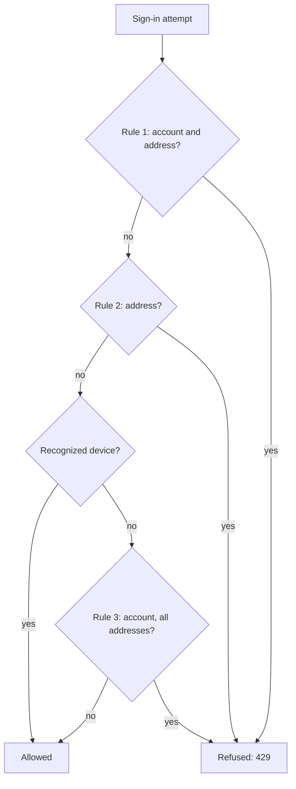
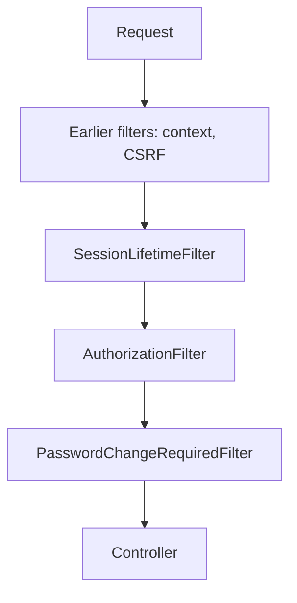

<!-- chapter: 16 | part: II | owner: writer-backend | tag: book-m6-final | status: expanded -->
# Chapter 16: Spring Security II: defenses

Signing in is only the start. A signed-in browser carries a credential that other websites can try to borrow, a public sign-in form invites password guessing, and every request must be checked against what its caller is allowed to do. This chapter covers the layers that make a signed-in session safe and the sign-in endpoint hard to abuse: cross-site request forgery (CSRF) protection, per-endpoint authorization, security headers, session lifetime, and revocation, sign-in throttling, trusting proxies, and the forced password change. Several of them come with real incidents from this project.

## Learning objectives

By the end of this chapter, you will be able to:

- Explain a CSRF attack and the cookie-plus-header defense the project uses.
- Read the authorization rules in `SecurityConfig`, and explain why a document you can't see gives `404` rather than `403`.
- Explain what each security header the API sends is for.
- Describe how sessions are ended: by idle timeout, by a fixed lifetime, and by an administrator.
- Explain how `LoginThrottle` counts attempts atomically, and why a lockout is itself something to defend.
- Explain why `X-Forwarded-For` is trusted only from a configured proxy.
- Explain how the forced password change is enforced on the server.

## Prerequisites

- Chapter 8: how the web works (headers, cookies, the same-origin rule)
- Chapter 13: Validation, configuration properties, and errors
- Chapter 14: Storing data with JPA and Flyway (audit rows are written in their own transaction)
- Chapter 15: Spring Security I

**A note on versions.** All listings are quoted from `book-m6-final`, where these defenses are complete. `SpaCsrfTokenRequestHandler.java` is identical at `book-m1-accounts`. The throttling, session-lifetime, and forced-password-change code arrived in later milestones, and `SecurityConfig` differs from its milestone 1 form.

## Beginner tier: Attacks the browser makes for you

### 16.1 CSRF: the attack

Your browser attaches the session cookie to every request it sends to the app, no matter which page caused the request. That's convenient, and it is also the weakness. Suppose you are signed in to the app in one tab, and in another tab you open a malicious page. That page can contain a hidden form that sends a request to the app's "delete document" address. The browser dutifully attaches your cookie, and the server sees a valid session and does what the request says. This is **cross-site request forgery (CSRF)**: another site borrows your credentials to act in your name. The attacker never sees your cookie; they only need the browser to send it.

An analogy: you leave your outgoing mail tray on your desk. Anyone who can slip a note into the tray gets it posted with your return address, and the post office treats it as yours. The defense is a code word. The post office says: "Every request from you must include today's code word, which only you were told." A stranger who slips a note into your tray can't add the code word, because they don't know it.

**Where the analogy breaks down:** the code word only helps if the stranger can't read it. Anyone who can run a script *inside* the legitimate page (a cross-site scripting attack) can read the code word and use it. The CSRF token protects against forged requests from other sites, not against a compromised page. That's why the API also sends the strict headers in Section 16.4.

### 16.2 The defense: a token in a cookie and a header

The server sets a second cookie, `XSRF-TOKEN`, holding a random value. The app's own JavaScript reads that cookie and copies its value into a request header, `X-XSRF-TOKEN`, on every request that changes something (`POST`, `PUT`, `PATCH`, `DELETE`). The server accepts a change only if the header matches the token. A foreign page can make the browser *send* cookies, but it can't *read* this cookie (browsers only let a site read its own cookies), so it can't fill in the header. This is the **double-submit cookie** pattern: the same value arrives twice, once in a cookie the browser sends automatically and once in a header that only the real app can write.

*Pattern note: The token handler is a swappable strategy (Chapter 38, Section 38.4).*

Here is one changing request as it travels, written as an example with placeholders, not captured from the project.

**Example 16.1 — A request that changes something, with its CSRF header (teaching example)**

```text
DELETE /api/documents/<document-id> HTTP/1.1
Host: localhost:8080
Cookie: SDV_SESSION=<session-id>; XSRF-TOKEN=<csrf-token>
X-XSRF-TOKEN: <csrf-token>
```

The two `<csrf-token>` placeholders are the same value. If the header is missing or different, the server answers `403` before the controller runs. The project configures the cookie in `SecurityConfig`.

**Listing 16.1 — `SecurityConfig.csrfTokenRepository` (`book-m6-final`)**

```java
@Bean
public CsrfTokenRepository csrfTokenRepository() {
    CookieCsrfTokenRepository repository = CookieCsrfTokenRepository.withHttpOnlyFalse();
    repository.setCookieCustomizer(cookie -> cookie.sameSite("Strict").path("/"));
    return repository;
}
```

*Path: `src/main/java/com/example/securedocviewer/security/SecurityConfig.java`*

`withHttpOnlyFalse()` is deliberate. Unlike the session cookie, this cookie *must* be readable by JavaScript, or the app couldn't copy it into the header. That is safe because the token alone gives nothing: a forged request also needs the session cookie, and this cookie's value is worthless to a page that isn't the app. `sameSite("Strict")` and `path("/")` apply the same cookie rules as the session cookie (Chapter 15).

Spring's default handling of CSRF tokens is designed for pages rendered on the server. A single-page application (**SPA**, an app that loads one page and then updates it with JavaScript, as Angular does) needs a small adaptation, which the project keeps in one class.

**Listing 16.2 — `SpaCsrfTokenRequestHandler.java` (`book-m6-final`, imports omitted)**

```java
final class SpaCsrfTokenRequestHandler implements CsrfTokenRequestHandler {

    private final CsrfTokenRequestHandler plain = new CsrfTokenRequestAttributeHandler();
    private final CsrfTokenRequestHandler xor = new XorCsrfTokenRequestAttributeHandler();

    @Override
    public void handle(HttpServletRequest request, HttpServletResponse response, Supplier<CsrfToken> csrfToken) {
        xor.handle(request, response, csrfToken);
        csrfToken.get();
    }

    @Override
    public String resolveCsrfTokenValue(HttpServletRequest request, CsrfToken csrfToken) {
        String header = request.getHeader(csrfToken.getHeaderName());
        return (StringUtils.hasText(header) ? plain : xor).resolveCsrfTokenValue(request, csrfToken);
    }
}
```

*Path: `src/main/java/com/example/securedocviewer/security/SpaCsrfTokenRequestHandler.java`*

The class has two "handlers." The `plain` one uses the token as it is. The `xor` one scrambles it with random data each time it's rendered, which protects tokens embedded in server-rendered pages from an attack called BREACH (one that recovers secrets from the size of compressed responses). `handle` uses the scrambled handler and calls `csrfToken.get()` to force the token to be generated, so the `XSRF-TOKEN` cookie exists from the very first response. `resolveCsrfTokenValue` decides how to read the incoming token: if the request has the `X-XSRF-TOKEN` header, which is what Angular sends with the raw cookie value, compare it as is; otherwise fall back to the scrambled form. The class comment describes this as Spring Security's recommended handling for single-page apps.

You can see the outcome in the `stateChangingRequestsNeedACsrfToken` test in `SecurityIntegrationTest`: a signed-in `POST` without the token gets `403` with the message `Missing or invalid CSRF token. Reload the page and try again.` (Chapter 18).

## Intermediate tier: Who may do what, and what the browser is told

*If you're reading for the first time, Sections 16.3 and 16.4 are the important ones here; 16.5 is about ending sessions and can be skimmed until you need it.*

### 16.3 Authorization rules per endpoint; 404 versus 403

Authentication says who the caller is; the **authorization rules** say what each kind of caller may reach. `SecurityConfig` lists them in order, and **the first rule that matches a request wins**.

**Listing 16.3 — `SecurityConfig.securityFilterChain` (`book-m6-final`, excerpt: the `authorizeHttpRequests` rules; one metrics rule is replaced by `// ...`)**

```java
.authorizeHttpRequests(auth -> auth
        // Liveness/readiness for monitoring: status only, no details.
        .requestMatchers(HttpMethod.GET, "/actuator/health", "/actuator/health/**").permitAll()
        // ...
        .requestMatchers(HttpMethod.POST, "/api/auth/login").permitAll()
        .requestMatchers("/api/admin/**").hasRole("ADMIN")
        .requestMatchers(HttpMethod.POST, "/api/documents").hasAnyRole("PUBLISHER", "ADMIN")
        // Refuse readers before a 50 MB replacement body is received.
        .requestMatchers(HttpMethod.PUT, "/api/documents/*/file").hasAnyRole("PUBLISHER", "ADMIN")
        // Per-document owner/admin checks for edits live in DocumentService.
        .requestMatchers("/api/users/**").hasAnyRole("PUBLISHER", "ADMIN")
        .requestMatchers("/api/**").authenticated()
        .requestMatchers("/error").permitAll()
        .anyRequest().denyAll())
```

*Path: `src/main/java/com/example/securedocviewer/security/SecurityConfig.java`*

Read it from top to bottom, as Spring does. Health checks are open, because monitoring tools have no account, and they reveal only a status. Sign-in must be open: nobody can sign in if they need to be signed in first. Anything under `/api/admin/` needs the `ADMIN` role. Upload (`POST /api/documents`) needs `PUBLISHER` or `ADMIN`. The comment on the replacement rule gives a reason that isn't obvious. The refusal happens *before* the request body is read, so a reader who tries to upload a 50 MB file is turned away without the server spending time receiving it. A `*` in a path stands for one path segment. Then comes a general rule: everything else under `/api/` needs *any* signed-in user. Finally, `anyRequest().denyAll()` refuses anything not mentioned. This last line is the most important habit in the list. A new endpoint you forget to think about is closed, not open.

Note that the order matters: the specific admin rule comes *before* the general `authenticated()` rule in the list. If they were swapped, any signed-in user would match `/api/**` first and reach the admin endpoints.

The rules are coarse: they know the path and the role, not which document is meant. Finer rules ("only the owner may share this document") live in `DocumentService`, which has the document in hand, as the comment in the listing says.

**A document you can't see gives `404`, not `403`.** Suppose a reader asks for `/api/documents/<some-id>`. If the id belongs to a document they may not open, a `403 Forbidden` would say "this exists, and you're not allowed," which confirms the id is real. The class comment of `DocumentService` states the project's rule: "A document the user can't view is reported as not found, never as forbidden, so its existence isn't revealed." A `404` for a document that doesn't exist and a `404` for one you may not see look identical. The `403` is reserved for the case where you *can* see the document but may not change it, for example a reader trying to share a document that is visible to them.

**Errors raised inside the filter chain.** The controller advice from Chapter 13 can't catch failures that happen in a filter, because the filter runs before any controller. `SecurityErrorResponses` fills that gap. It implements three Spring Security hooks. The authentication entry point answers when no one is signed in (`401` with `Sign-in required.`). The access-denied handler answers when a signed-in caller is not allowed (`403`, with a special message for a bad CSRF token). The expired-session strategy answers when an administrator has ended a session (`401` with `Your session has ended. Please sign in again.`). All three write the same `{"error": "..."}` JSON as `GlobalExceptionHandler`, so the browser app needs only one way to read errors.

### 16.4 Security headers

Response headers can instruct the browser to be stricter with what it received. The project sets them in `SecurityConfig`.

**Listing 16.4 — `SecurityConfig.securityFilterChain` (`book-m6-final`, excerpt: the `headers` block)**

```java
.headers(headers -> headers
        // The API only ever returns JSON and PNG tiles, so nothing it serves
        // needs to run script, load resources or be framed.
        .contentSecurityPolicy(csp -> csp.policyDirectives(
                "default-src 'none'; frame-ancestors 'none'; base-uri 'none'; form-action 'none'"))
        // Tile URLs carry signed tokens; never send them onward in a Referer.
        .referrerPolicy(referrer -> referrer.policy(ReferrerPolicy.NO_REFERRER))
        .permissionsPolicyHeader(permissions -> permissions.policy(
                "camera=(), microphone=(), geolocation=(), payment=()")))
```

*Path: `src/main/java/com/example/securedocviewer/security/SecurityConfig.java`*

**Table 16.1 — The security headers and what each does**

| Header | Value in this app | What it prevents |
|---|---|---|
| `Content-Security-Policy` | `default-src 'none'; frame-ancestors 'none'; base-uri 'none'; form-action 'none'` | A response being used to run script, load other resources, be framed, or submit forms |
| `Referrer-Policy` | `no-referrer` | The browser sending the address of the previous page (including signed tile URLs) to other sites |
| `Permissions-Policy` | camera, microphone, geolocation, payment all empty | The page using those browser features |
| `X-Content-Type-Options` | `nosniff` (Spring Security default) | The browser guessing that JSON is HTML and running it |
| `X-Frame-Options` | `DENY` (Spring Security default) | Framing, for older browsers |

A **Content Security Policy (CSP)** tells the browser what a response is allowed to load or do. `default-src 'none'` says "nothing at all," which is right for an API that returns only JSON and PNG images. `frame-ancestors 'none'` forbids any site from placing the response inside a frame, which defeats **clickjacking**, where an attacker hides a real page inside a frame on their own page and tricks you into clicking it. `base-uri` and `form-action` close two smaller doors. The older `X-Frame-Options: DENY` header does the framing job for old browsers; Spring Security adds it by default, and so it adds `nosniff`.

Two of the choices are worth a second look. `Referrer-Policy: no-referrer` is here *because of the signed tile URLs* (Chapter 17): a tile URL contains a token, and if the browser sent that URL as the referrer to another site, the token would leak. And `default-src 'none'` is possible because this is an API; the web page itself is served by another component, which has its own CSP (Part V).

The `SecurityHeadersTest` class checks the headers on a plain API response, and also that `/actuator/health` shows only `UP` with no details and that other actuator endpoints such as `/actuator/env` are closed. A security header nobody tests tends to disappear in the next refactor.

### 16.5 Session lifetime, idle timeout, revocation

Chapter 15 set a 30-minute **idle timeout**: 30 minutes without a request ends the session. But an idle timeout alone has a gap. A session that is used continuously would never expire, so a stolen or forgotten session could live forever as long as *something* keeps using it. `SessionLifetimeFilter` adds an **absolute lifetime**: a session ends a fixed time after sign-in, however active it is.

**Listing 16.5 — `SessionLifetimeFilter.java` (`book-m6-final`, excerpt: the check in `doFilterInternal`)**

```java
if (session != null) {
    if (session.getAttribute(SIGNED_IN_AT) instanceof Instant signedInAt) {
        if (Instant.now().isAfter(signedInAt.plus(maxLifetime))) {
            session.invalidate();
            SecurityContextHolder.clearContext();
        }
    } else if (session.getAttribute(SECURITY_CONTEXT) != null) {
        // Signed in before this rule existed: its lifetime starts now.
        session.setAttribute(SIGNED_IN_AT, Instant.now());
    }
}
chain.doFilter(request, response);
```

*Path: `src/main/java/com/example/securedocviewer/security/SessionLifetimeFilter.java`*

The `SIGNED_IN_AT` attribute is set by `AuthController` at sign-in (Listing 15.7). The filter reads it, and if more than `maxLifetime` (12 hours by default, `session-max-lifetime`) has passed, it invalidates the session and clears the security context. Then it *continues the chain* rather than answering itself: the request now looks anonymous, so the normal rules produce the normal `401`, and the app sends the user to the sign-in screen. The `else if` covers sessions that existed before the rule was introduced: instead of living forever, their clock starts on their next request. Both behaviors have tests, for example `aSessionEndsAFixedTimeAfterSignInHoweverActive`, which backdates the sign-in time by 13 hours and expects `401`.

The filter is registered before Spring's authorization filter, so an expired session is treated as anonymous *before* any access rule is applied.

**Revocation.** `SecurityConfig` registers every session in a `SessionRegistry` and allows unlimited concurrent sessions (`maximumSessions(-1)`): the app doesn't limit how many devices you sign in from, but it knows about each one. That lets `SessionAdministration` list and end sessions. The admin page lists sessions by an opaque **handle** (Chapter 15, Section 15.9), and `revoke(handle)` calls `expireNow()` on the matching session. Spring Security then rejects that session's next request, and the message from `SecurityErrorResponses` appears. `revokeAllFor(username, exceptSessionId)` ends every session a user has, "so the change takes effect now, not when their session happens to time out": it runs when an administrator changes a user's role, disables the account, or resets the password, and when users change their own password.

The test `anAdminCanSignAUserOutEverywhere` shows the whole thing. One user signs in on a "laptop" and a "phone." The user's own attempt to end all sessions is refused with `403`, and the administrator's attempt succeeds with `204`. Both of the user's sessions then get `401` on their next request, and the administrator's own session is unaffected.

## Advanced tier: Abuse, proxies, and forced changes

*You can skip to "In this project" on a first read. Part IV tells the milestones in which these incidents were found.*

### 16.6 Throttling sign-in attempts, and atomic counting

Hashing passwords slowly (Chapter 15) makes each guess expensive, but an attacker can still send many guesses. **Throttling** limits how many attempts are allowed in a period. `LoginThrottle` applies three rules over a rolling 15-minute window.

*Pattern note: Reserving an attempt first and handing it back on success is the reserve-then-compensate pattern (Chapter 38, Section 38.10).*

**Table 16.2 — The three sign-in rules (`LoginThrottle`)**

| Rule | Limit | Stops |
|---|---|---|
| account+ip | 5 failures for one account from one address | Guessing one account's password from one place |
| ip | 20 failures from one address across any accounts | Trying one common password against many accounts ("password spraying") |
| account-wide | 20 failures for one account across all addresses, for addresses the account hasn't recently used | Spreading guesses over many addresses |

A refused attempt returns `429 Too Many Requests` with a `Retry-After` header saying how many seconds until the oldest counted failure ages out of the window. The window is **rolling**: it always looks at the last 15 minutes, not at fixed clock periods, so there's no boundary an attacker can wait for. Figure 16.1 shows how the three rules and the recognized-device exemption combine into one decision.



*Figure 16.1 — The three sign-in rules and the recognized-device exemption in `LoginThrottle.checkAllowed`*

*Text description:* A top-to-bottom decision flow with two ends. An attempt meets rule 1 (five or more failures for this account from this address), then rule 2 (twenty or more failures from this address), then asks whether the device is recognized. A recognized device goes straight to "Allowed," while an unrecognized one also meets rule 3 (twenty failures for the account from all addresses). A "yes" at any of the three rules leads to one refusal box, a `429` with `Retry-After`; an allowed attempt is counted in advance and then its password is checked.

<!-- source: LoginThrottle.checkAllowed at book-m6-final -->

The first two rules apply to everyone, including a recognized device: that is why someone sharing the owner's network address still can't guess freely. Only the third rule, the account-wide one, is skipped for a device the account has recently used, which is what stops a stranger from locking the owner out of their usual device.

**The check-then-act race.** The obvious way to write this is: (1) check whether the caller is locked out; (2) verify the password; (3) if wrong, record a failure. There is a gap between steps 1 and 3, and a password check takes about a tenth of a second. An attacker who sends many guesses at the same moment gets them *all* past step 1 before any reaches step 3, so a limit of five doesn't stop nine simultaneous guesses. This is a **race condition**: the result depends on the timing of things that happen at once.

**The incident.** During the final review rounds, the AI technical-manager reviewer (Chapter 32 explains how the reviews worked) asked whether the sign-in protection would survive a serious external review. It then ran a live probe: nine concurrent wrong passwords for one account from one address, with a limit of five. All nine received `401` (their passwords were actually checked) and only the next single attempt got `429`. The cause was exactly the check-then-act gap described earlier in this section. <!-- source: dossier bugs-and-findings G1; commit 1ce2c8b --> The fix, in commit `1ce2c8b`, is the code in Listing 16.6: reserve the attempt *before* checking the password, and hand the reservation back on success.

**Listing 16.6 — `LoginThrottle.java` (`book-m6-final`, excerpt: methods `reserve` and `succeeded`)**

```java
public synchronized Instant reserve(String username, String clientIp, boolean recognisedDevice) {
    checkAllowed(username, clientIp, recognisedDevice);
    Instant at = clock.instant();
    recordFailure(username, clientIp, at);
    return at;
}

/** The reserved attempt succeeded: hand back its provisional failure and clear this address's account counter. */
public synchronized void succeeded(String username, String clientIp, Instant reservation) {
    failures.remove(accountKey(username, clientIp));
    removeOne(ipKey(clientIp), reservation);
    removeOne(anyIpKey(username), reservation);
}
```

*Path: `src/main/java/com/example/securedocviewer/security/LoginThrottle.java`*

`synchronized` is a Java keyword meaning "only one thread at a time may run this method on this object." `reserve` therefore checks *and* counts as one indivisible step: the second of nine simultaneous callers can't check until the first has counted. Every attempt is counted as a failure in advance; a correct password calls `succeeded`, which removes that provisional failure and clears the account-and-address counter. The class comment states the guarantee: "a burst of parallel guesses can't all pass the check before any of them is counted." After the fix, the same probe let exactly five through. The test `aBurstOfParallelWrongPasswordsGetsNoMoreThanTheLimit` (Chapter 18, Section 18.10) is the regression guard, and **the lesson generalizes: a check followed by an action is a race unless something makes the two one step.**

Two limits of the design are stated in the class comment: the counters live in memory (a restart clears them), and attempts refused by a lock aren't counted, so being locked out doesn't extend the lock. A `@Scheduled` sweep every five minutes drops counters whose failures have all aged out (Chapter 14).

**A lockout is also an attack surface.** The first version of the account-wide rule locked an account after 20 failures from *any* addresses. The reviewer then pointed out that this lets anyone lock out any user: fail 20 times as the victim from a few addresses and the real owner can't sign in. The project's answer is the **recognized device**. `KnownDevices` remembers, for 30 days, addresses an account has *successfully* signed in from, and the account-wide rule doesn't apply to those. An attacker hammering a username from elsewhere therefore can't lock the owner out of their usual device, while the per-address rule still applies to everyone. <!-- source: dossier decisions D7, bugs-and-findings E1; commit 82c24b6 --> Because an address is personal data, only a keyed hash of it is stored (IPv6 addresses grouped by their /64 prefix, since one device rotates addresses within a prefix). Entries expire after 30 days, and they are forgotten when the password changes or the account is disabled. The trade-off is documented: the correct password from a *new* address is refused during an account-wide lockout until an administrator unlocks the account.

### 16.7 Trusting `X-Forwarded-For` only from a proxy

Throttling by address needs the real client address. In a deployment the connection reaches the app through a reverse proxy (a server that receives requests on the app's behalf and forwards them, covered in Part V), so the address on the connection is the proxy's. The original address travels in a header, `X-Forwarded-For`. But any client can write that header. If the app believes it blindly, an attacker can send a different fake address with every attempt and never hit a per-address limit.

*Pattern note: A proxy that owns the trust boundary is the gateway pattern (Chapter 39, Section 39.7).*

**Listing 16.7 — `application.yml` (`book-m6-final`, excerpt: the forwarded-header settings)**

```yaml
server:
  port: 8080
  # Set to "native" only when running behind a trusted reverse proxy (the
  # docker-compose "full" profile does); otherwise X-Forwarded-For is ignored,
  # so clients can't spoof their IP to dodge login throttling.
  forward-headers-strategy: ${FORWARD_HEADERS_STRATEGY:none}
  tomcat:
    remoteip:
      # Which peers may set X-Forwarded-For. Compose pins this to the nginx
      # container's fixed address, so nothing else on the network can spoof it.
      internal-proxies: ${TRUSTED_PROXY_REGEX:127\.0\.0\.1|0:0:0:0:0:0:0:1}
```

*Path: `src/main/resources/application.yml`*

The default, `none`, ignores the header entirely: safe when the app is reached directly. Behind the project's own proxy, the setting becomes `native`, and `internal-proxies` says *which* peers Tomcat may believe; the deployment pins it to the proxy's fixed address. Only then does `request.getRemoteAddr()`, which `AuthController` uses, return the forwarded client address.

**The incident.** An earlier version of the deployment did the opposite of what the setting says: nginx *appended* to an `X-Forwarded-For` header the client had supplied, and the app trusted it, so a client could reset its sign-in lockout by sending a fake address. The description of the pull request that introduced this had claimed direct callers couldn't spoof; that claim was false, and the pull request text was corrected in place. The reviewer found it by testing through the real proxy. The fix made nginx overwrite the header with the real peer address, and a later change made the app trust the header only from the proxy's fixed address. A browser test that goes through nginx now guards it. <!-- source: dossier bugs-and-findings D1 (TM2-1); commits 2d82253, a51674c --> The lesson: **a header a proxy sets is only as trustworthy as the proxy's configuration, so test through the proxy, not around it.**

The tests inside the Java project can't exercise a proxy, but they follow the principle in a small way. `SecurityIntegrationTest` gives every test that causes failures its own address with a helper `from("198.51.100.61")`, whose comment says why: "Tests that cause failures use their own address, so they don't use up 127.0.0.1's allowance."

### 16.8 Forced password change

An account whose password an administrator set, or whose first password was generated and printed in a log, must choose its own at first sign-in. The check that the UI redirects to a password form is a convenience; the *enforcement* is on the server, in `PasswordChangeRequiredFilter`.

**Listing 16.8 — `PasswordChangeRequiredFilter.java` (`book-m6-final`, excerpt: the check in `doFilterInternal`)**

```java
HttpSession session = request.getSession(false);
String path = request.getRequestURI().substring(request.getContextPath().length());
if (session != null && Boolean.TRUE.equals(session.getAttribute(SESSION_ATTRIBUTE))
        && path.startsWith("/api/") && !path.startsWith("/api/auth/")) {
    response.setStatus(HttpServletResponse.SC_FORBIDDEN);
    response.setContentType(MediaType.APPLICATION_JSON_VALUE);
    response.getWriter().write("{\"error\":\"You must change your password before continuing.\",\"passwordChangeRequired\":true}");
    return;
}
chain.doFilter(request, response);
```

*Path: `src/main/java/com/example/securedocviewer/security/PasswordChangeRequiredFilter.java`*

While the session's flag `sdv.mustChangePassword` is set (Chapter 15's Step 7), everything under `/api/` gets a `403` with an explanation and `passwordChangeRequired: true`. The exception is the `/api/auth/` endpoints, where the user can look up who they are, change the password, or sign out. Note the `return` without `chain.doFilter`: the request stops here. Both custom filters are added around Spring's `AuthorizationFilter` in `SecurityConfig`: the lifetime filter before it and this one after it. Figure 16.2 shows where the two filters sit among the others.



*Figure 16.2 — Where the project's two custom filters sit in the chain*

*Text description:* A top-to-bottom chain of six boxes: the request, the earlier Spring Security filters, `SessionLifetimeFilter`, `AuthorizationFilter`, `PasswordChangeRequiredFilter`, and finally the controller. Notice that the lifetime filter comes before the authorization rules and the password-change filter comes after them.

<!-- source: SecurityConfig.securityFilterChain at book-m6-final -->

The order explains the behavior. The lifetime filter runs before the authorization rules, so a session that has outlived its fixed lifetime looks anonymous by the time the rules are applied, and the caller gets the ordinary `401`. The password-change filter runs after them, so it only ever sees requests that authorization has let through, and it blocks those that belong to an account still waiting to choose a password. The test `anAdminSetPasswordMustBeChangedBeforeAnythingElseWorks` walks through the story: an administrator creates a user, the user signs in and is told a change is needed, `GET /api/documents` returns `403` with the flag, `GET /api/auth/me` still works, and after `POST /api/auth/password` the documents endpoint returns `200`.

Changing a password is itself guarded. The endpoint reserves an attempt from the same `LoginThrottle` before checking the current password, because a stolen session shouldn't be a free way to guess it. The commit that added atomic sign-in counting closed this gap too. <!-- source: dossier bugs-and-findings G4; commit 1ce2c8b --> A successful change also ends the user's other sessions, so anyone who had the old password is signed out.

### 16.9 A real incident: the CSRF cookie that vanished at sign-in

Section 16.2's design had a bug that only a browser could see. At sign-in, Spring's built-in step for rotating the CSRF token (part of protecting against session fixation) deleted the cookie and then re-read the token from the request, which still carried the *old* cookie. The browser ended with no token, and the first write after signing in failed with `403`. It was found in a live check against a real database while building the first accounts milestone. `AuthController` now generates and saves a fresh token itself, so exactly one `Set-Cookie` is sent (its comment on `rotateCsrfToken` explains this), and `CsrfCookieFlowTest` reproduces the browser's steps to guard it. <!-- source: dossier bugs-and-findings C1, C2; PR #1; AuthController.rotateCsrfToken and CsrfCookieFlowTest comments at book-m6-final --> Chapter 18, Section 18.8, explains why the ordinary test helper could never have caught it.

### 16.10 Common mistakes

- **Leaving a path open by omission.** Without `anyRequest().denyAll()`, a new endpoint could be reachable by default. Deny first; open on purpose.
- **Ordering rules wrongly.** A broad rule listed before a specific one shadows it. Put the specific rules first.
- **Answering 403 when you mean "doesn't exist."** It confirms the resource is real. Return `404` when the caller has no right to know.
- **Trusting `X-Forwarded-For` everywhere.** Trust it from a named proxy only.
- **Counting after checking.** Any limit that checks first and counts later can be beaten with parallel requests.
- **Building a lockout with no exceptions.** An attacker can use it against the victim; think about who else could trigger it.
- **Hiding a button and calling it security.** The UI conceals what a role can't use, but the server enforces it on every request. Test the server path, as `readersCannotReachAdminOrUpload` does.
- **Testing security with the shortcut helpers only.** See Chapter 18, Section 18.8.

## In this project

**Table 16.3 — Where Chapter 16's ideas live (`book-m6-final`)**

| Idea | File |
|---|---|
| CSRF | `security/SecurityConfig.java`, `security/SpaCsrfTokenRequestHandler.java`, `controller/AuthController.java` |
| Rules and headers | `security/SecurityConfig.java` |
| Filter-chain JSON errors | `security/SecurityErrorResponses.java` |
| Throttling and recognized devices | `security/LoginThrottle.java`, `security/KnownDevices.java` |
| Session filters and revocation | `security/SessionLifetimeFilter.java`, `security/PasswordChangeRequiredFilter.java`, `security/SessionAdministration.java` |
| Proxy trust, cookie, and timeout settings | `src/main/resources/application.yml` |

Part IV's chapters on milestones 1, 3, and 5 (Chapters 26, 28, and 30) tell when each defense arrived and why.

## Try it

### Exercise 16.1 ★ What does `denyAll()` do?

In Listing 16.3, what happens to a request for `GET /api/does-not-exist` from a signed-in reader? What about `GET /somewhere-else` from anyone? Which rule matches each?

*Solution:* Appendix C, Exercise 16.1.

### Exercise 16.2 ★ Two cookies, two rules

Explain in your own words why the `XSRF-TOKEN` cookie is readable by JavaScript while `SDV_SESSION` is not, and why that difference is safe.

*Solution:* Appendix C, Exercise 16.2.

### Exercise 16.3 ★★ Read the headers on your own copy

Start your own local copy of the app and use `curl -i` (Chapter 8) on `/api/auth/me` without signing in. List every security header in the response and match each to a row of Table 16.1. Which header, if missing, would you notice last, and why?

*Solution:* Appendix C, Exercise 16.3.

### Exercise 16.4 ★★ 404 or 403?

For each request, say which status the server returns and why: (a) a reader asks for a private document that belongs to someone else; (b) a reader asks to share a document that is visible to everyone; (c) a reader asks for the admin audit log; (d) no one is signed in and asks for `/api/documents`.

*Hint:* the answers involve two different layers, the rules in `SecurityConfig` and the checks in `DocumentService`.

*Solution:* Appendix C, Exercise 16.4.

### Exercise 16.5 ★★★ Break the throttle in a scratch copy

On a scratch branch, change `LoginThrottle.reserve` so it calls `checkAllowed` but records the failure only *after* `authenticate` fails (a check-then-act design). Run `aBurstOfParallelWrongPasswordsGetsNoMoreThanTheLimit`. What do you observe? Explain why the original passes and yours doesn't.

*Solution:* Appendix C, Exercise 16.5 (a worked outline).

### Exercise 16.6 ★★★ Design a lockout that can't be abused

Suppose you must protect a "reset PIN" endpoint that allows 3 attempts. Design the counting so that (a) parallel guesses can't exceed 3, and (b) a stranger can't lock the real owner out for good. Say what you count, where you store it, and what happens to a legitimate owner who is locked out.

*Solution:* Appendix C, Exercise 16.6 (a worked outline).

## Summary

- CSRF lets another site borrow your cookie; the project defends with a readable `XSRF-TOKEN` cookie that the app copies into an `X-XSRF-TOKEN` header, which a foreign site can't do.
- Authorization is deny-by-default, with coarse role rules in `SecurityConfig` (first match wins, specific before general) and per-document rules in the service; a document you can't see is reported as not found.
- Security headers instruct the browser to load nothing from the API, refuse framing, and never leak signed URLs in a `Referer`.
- Sessions end by idle timeout, by a fixed maximum lifetime and by administrator revocation; every session is registered so it can be listed and ended.
- `LoginThrottle` reserves each attempt atomically before checking the password; recognized devices stop a lockout from being turned against its owner.
- `X-Forwarded-For` is trusted only from a configured proxy address.
- The forced password change is enforced by a server-side filter, and every one of these defenses has a test.

## Further reading

- *Spring Security Reference Documentation*, "Cross Site Request Forgery (CSRF)." https://docs.spring.io/spring-security/reference/servlet/exploits/csrf.html
- *Spring Security Reference Documentation*, "Authorize HttpServletRequests." https://docs.spring.io/spring-security/reference/servlet/authorization/authorize-http-requests.html
- *Spring Security Reference Documentation*, "Security HTTP Response Headers." https://docs.spring.io/spring-security/reference/servlet/exploits/headers.html
- *OWASP Cheat Sheet Series*, "Cross-Site Request Forgery Prevention Cheat Sheet." https://cheatsheetseries.owasp.org/cheatsheets/Cross-Site_Request_Forgery_Prevention_Cheat_Sheet.html
- *OWASP Cheat Sheet Series*, "Authentication Cheat Sheet." https://cheatsheetseries.owasp.org/cheatsheets/Authentication_Cheat_Sheet.html
- *MDN Web Docs*, "Content Security Policy (CSP)." https://developer.mozilla.org/en-US/docs/Web/HTTP/CSP
