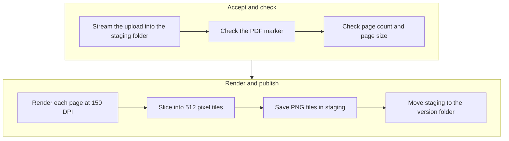
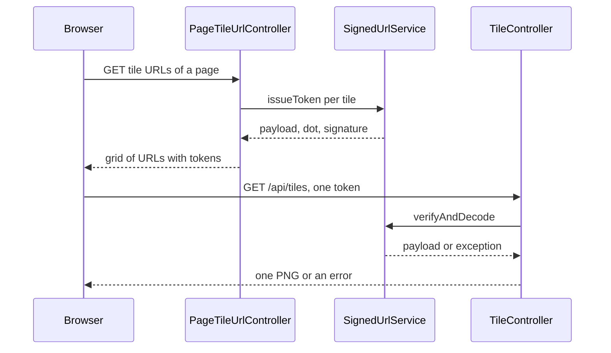
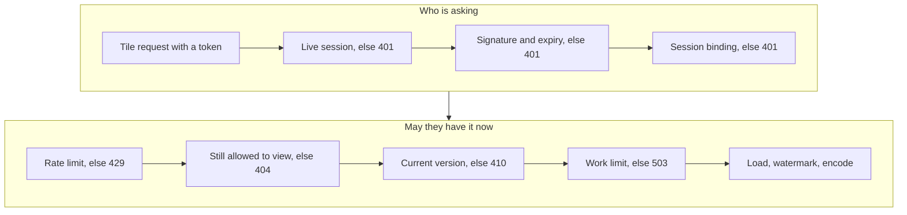

<!-- chapter: 17 | part: II | owner: writer-backend | tag: book-m6-final | status: expanded -->
# Chapter 17: Files, images, PDFs and signatures

The heart of the Secure Document Viewer is that the browser never receives your PDF. The server turns each page into a picture, cuts it into small square tiles, stamps the viewer's identity on each tile, and serves them through links that cannot be forged. This chapter teaches the pieces: pixels and images, drawing a PDF page, slicing, drawing text, signing links, limiting how much work runs at once, and handling files on disk so that a failure never leaves a mess.

## Learning objectives

By the end of this chapter, you will be able to:

- Explain what pixels and a PNG image are, and estimate how much memory a rendered page needs.
- Explain how a page image is sliced into a grid of tiles, work out the grid for a given page, and say why edge tiles are cropped.
- Read the rendering loop in `TileGenerationService` and the drawing code in `WatermarkService`.
- Explain what a hash, an HMAC and a signed token are, and say what each field of a tile token protects against.
- Explain why the server limits how much work runs at once, and how a semaphore does it.
- Describe how uploaded files are staged, committed, versioned and cleaned up, and why the order of the steps matters.

## Prerequisites

- Chapter 3: your first Java program (integer division)
- Chapter 5: collections, lambdas and exceptions
- Chapter 11: Spring Boot foundations
- Chapter 12: REST controllers and JSON
- Chapter 13: Validation, configuration properties and errors (`BadRequestException`, the upload limits)
- Chapter 15: Spring Security I (what a hash is)

## Beginner tier: Pictures and grids

### 17.1 Pixels, images and PNG

A digital image is a grid of **pixels**, tiny colored squares. A page rendered at 150 **dots per inch (DPI)**, the project's `render-dpi: 150` in `application.yml`, has 150 pixels for every inch of paper. An A4 sheet is about 8.27 by 11.69 inches, so the arithmetic is width in inches times DPI: about 1,240 by 1,754 pixels.

**PNG** is a file format that stores such a grid compressed *without losing detail*, which suits pages full of text and sharp lines. (JPEG, the format for photographs, discards detail to save space, and blurs text edges.) In Java, `BufferedImage` is the in-memory grid you read pixels from and draw on.

The in-memory form matters more than the file form, because it is what the server holds while it works. Java's common in-memory format uses about four bytes per pixel. That gives a **worked example** for how much memory one rendered page takes:

**Table 17.1 — Memory for one rendered page, at about 4 bytes per pixel**

| Page | Pixels | Approximate memory |
|---|---|---|
| A4 at 150 DPI (1,240 × 1,754) | 2,174,960 | 8.7 MB |
| The project's limit, `max-page-pixels` | 40,000,000 | 160 MB |

A normal page costs under 10 MB. A page at the limit costs about 160 MB, and two renders may run at once. This is why the limit exists and why it's a *pixel count*, not a page size: a poster-sized page at a high DPI could take gigabytes, and the server would fail before it finished (Chapter 13 shows the check).

Why turn a PDF into pictures at all? A PDF in the browser can be saved, copied and searched. A stack of image tiles can't be saved as a document with one click; it must be reassembled. The project is honest that this raises the effort of copying rather than making it impossible: someone can still photograph the screen. What the design guarantees is that every tile that leaves the server has the viewer's identity drawn into it, and that access can be cut off.

### 17.2 Reading and rendering a PDF

Turning a PDF page into a `BufferedImage` is called **rasterizing**. A PDF describes a page as instructions ("draw this text here, this image there"), and rasterizing carries them out onto a grid of pixels. The project uses the Apache PDFBox library (version 3.0.8, from `pom.xml`), which can open a PDF and draw a page at a chosen DPI. `TileGenerationService` does the work. Listing 17.1 shows the heart of it, and the checks that guard it.

**Listing 17.1 — `TileGenerationService.java` (`book-m6-final`, simplified: the surrounding methods, error handling and the tile-saving helper are omitted; the two excerpts are from different places in the class)**

```java
try (PDDocument document = loadPdf(source)) {
    requireWithinLimits(document);
    PDFRenderer renderer = new PDFRenderer(document);
    // Decode huge embedded images at reduced resolution instead of in full.
    renderer.setSubsamplingAllowed(true);
    for (int pageIndex = 0; pageIndex < document.getNumberOfPages(); pageIndex++) {
        if (cancelled.get() || Thread.currentThread().isInterrupted()) {
            throw new CancellationException("Render abandoned after render-timeout");
        }
        BufferedImage rendered = renderer.renderImageWithDPI(pageIndex, properties.getRenderDpi());
        pages.add(tileAndSave(stagingDir.resolve("page-" + pageIndex), pageIndex, rendered));
    }
}

// ... elsewhere in the class ...

private void requireWithinLimits(PDDocument document) {
    int pageCount = document.getNumberOfPages();
    if (pageCount == 0) {
        throw new BadRequestException("The PDF has no pages.");
    }
    if (pageCount > properties.getMaxPages()) {
        throw new BadRequestException("The PDF has " + pageCount + " pages; the limit is "
                + properties.getMaxPages() + ".");
    }
    // ... a per-page pixel-size check follows ...
}
```

*Path: `src/main/java/com/example/securedocviewer/service/TileGenerationService.java`*

The method opens the PDF, checks it against the limits before drawing anything, and creates a `PDFRenderer`. Then it loops over the pages: `renderImageWithDPI(pageIndex, properties.getRenderDpi())` draws one page as a `BufferedImage` at 150 DPI, and `tileAndSave` (Section 17.3) slices it and writes the tiles into a per-page directory in a staging area. The `try (...)` closes the PDF when the loop ends, even on error (Chapter 5).

Three details are worth a closer look. First, `setSubsamplingAllowed(true)` lets PDFBox decode an enormous embedded photo at reduced resolution instead of in full, since the output is only 150 DPI anyway; the comment says so. Second, before each page the loop checks a `cancelled` flag, so a render that exceeds `render-timeout` can be abandoned at the next page boundary and free its slot (Section 17.6). Third, the PDF is loaded from a file on disk, not from memory. The upload is streamed into a temporary file first, and `loadPdf` uses a temp-file cache because, as its comment says, "large PDFs are buffered on disk, not in the heap". (The **heap** is the region of memory where Java keeps its objects.)

### 17.3 Slicing an image into a grid

Serving a whole page as one image would hand over everything in one request. Tiles are small: `tile-size: 512` pixels square at the final tag. `TileGrid` is the pure arithmetic, kept separate so it can be tested without any PDF (Chapter 18).

**Listing 17.2 — `TileGrid.java` (`book-m0-mvp`, identical at `book-m6-final`; imports and the class comment are omitted)**

```java
public final class TileGrid {

    private TileGrid() {
    }

    /** Number of tiles needed to cover {@code lengthPx} pixels: ceil(lengthPx / tileSize). */
    public static int tileCount(int lengthPx, int tileSize) {
        if (lengthPx <= 0 || tileSize <= 0) {
            throw new IllegalArgumentException("lengthPx and tileSize must both be positive");
        }
        return (lengthPx + tileSize - 1) / tileSize;
    }

    /** Extracts a single tile, cropped to the image bounds at the right/bottom edges. */
    public static BufferedImage sliceTile(BufferedImage page, int row, int col, int tileSize) {
        int x = col * tileSize;
        int y = row * tileSize;
        if (x >= page.getWidth() || y >= page.getHeight()) {
            throw new IllegalArgumentException("Tile (" + row + "," + col + ") is outside the image bounds");
        }
        int w = Math.min(tileSize, page.getWidth() - x);
        int h = Math.min(tileSize, page.getHeight() - y);
        return page.getSubimage(x, y, w, h);
    }
}
```

*Path: `src/main/java/com/example/securedocviewer/service/TileGrid.java`*

`tileCount` rounds up. Integer division in Java drops the remainder (Chapter 3), so adding `tileSize - 1` before dividing is the standard round-up trick: `(1240 + 511) / 512` is `1751 / 512`, which is 3 (the remainder is dropped). `sliceTile` computes the top-left corner from row and column (`x = col * tileSize`), then takes the smaller of a full tile and what remains, so the last tiles are cropped rather than padded. The class comment states the payoff: reassembling every tile at `(col * tileSize, row * tileSize)` "reproduces the source image exactly, with no seams and no bleed". The private constructor stops anyone creating an object of a class that only holds static methods.

**A worked example.** Take the A4 page from Section 17.1, 1,240 by 1,754 pixels, and 512-pixel tiles.

**Table 17.2 — The tile grid for one A4 page at 150 DPI with 512-pixel tiles**

| Direction | Calculation | Result | Sizes of the tiles |
|---|---|---|---|
| Columns | `tileCount(1240, 512)` | 3 | 512, 512, and 1240 − 1024 = **216** |
| Rows | `tileCount(1754, 512)` | 4 | 512, 512, 512, and 1754 − 1536 = **218** |

So the page is a grid of 4 rows by 3 columns, 12 tiles. Nine are full 512 × 512 squares; the right column is 216 pixels wide and the bottom row is 218 tall, and the corner tile is 216 × 218. The comment in `application.yml` gives the same figure for a letter page at 150 DPI: "~12 tiles". The numbers also explain the rate limit in Chapter 26: reading one page fetches about a dozen tiles. Figure 17.1 shows the whole journey from an uploaded file to the tiles on disk.



*Figure 17.1 — How an uploaded PDF becomes tiles on disk*

*Text description:* A chain in two rows, read left to right and then down, with seven boxes. The upload is streamed into a staging folder, the PDF marker is checked, and the PDF is opened and checked for page count and size. Each page is then rendered at 150 DPI, sliced into 512-pixel tiles and saved as PNG files. Finally the staging folder is moved to the version folder in one step. The cheap checks come first and the expensive rendering last.

<!-- source: TileGenerationService.java at book-m6-final -->

The cheap checks come first (the marker, then the page count and size), and the expensive work, rendering, comes only after they pass. Everything is written into a staging folder that no reader can see, and the last step makes it visible in a single move (Section 17.7).

The tiles are written by `tileAndSave`, which calls `sliceTile` for each `(row, col)` and saves a PNG named for its position.

**Listing 17.3 — `TileGenerationService.tileAndSave` (`book-m6-final`, excerpt: the loop)**

```java
Files.createDirectories(pageDir);
for (int row = 0; row < rows; row++) {
    for (int col = 0; col < cols; col++) {
        BufferedImage tile = TileGrid.sliceTile(pageImage, row, col, tileSize);
        File tileFile = pageDir.resolve("tile-" + row + "_" + col + ".png").toFile();
        ImageIO.write(tile, "png", tileFile);
    }
}
```

*Path: `src/main/java/com/example/securedocviewer/service/TileGenerationService.java`*

On disk, a document ends up as a tree like this, where `v1` is the render's version (Section 17.7):

```text
storage/
  <document-id>/
    v1/
      page-0/
        tile-0_0.png   tile-0_1.png   tile-0_2.png
        tile-1_0.png   ...
      page-1/
        ...
```

### 17.4 Drawing text on an image (watermarks)

A watermark is text drawn into the picture. Here it shows the viewer, a UTC timestamp and a short trace code that matches the session column of the audit log, so a leaked screenshot points back to a sign-in (a comment in `application.yml` says so). Its look is configurable: `watermark-opacity: 0.2` and `watermark-spacing: 1.5`, the gap between copies as a multiple of the text height. `WatermarkService` does the drawing, and `TileController` applies it to each tile at request time (Chapter 12). The class comment gives the reason for stamping on the way out rather than during upload: "one stored tile serves every viewer, and every response is still individually traceable back to who requested it and when."

**Listing 17.4 — `WatermarkService.applyWatermark` (`book-m6-final`, simplified: the long explanatory comments, the tile-sizing lines and the closing lines are omitted)**

```java
public BufferedImage applyWatermark(BufferedImage source, String viewerLabel, String traceCode, int nominalTileSize) {
    int width = source.getWidth();
    int height = source.getHeight();
    BufferedImage stamped = new BufferedImage(width, height, BufferedImage.TYPE_INT_ARGB);

    Graphics2D g = stamped.createGraphics();
    try {
        g.setRenderingHint(RenderingHints.KEY_ANTIALIASING, RenderingHints.VALUE_ANTIALIAS_ON);
        g.setRenderingHint(RenderingHints.KEY_TEXT_ANTIALIASING, RenderingHints.VALUE_TEXT_ANTIALIAS_ON);
        g.drawImage(source, 0, 0, null);

        String stamp = TIMESTAMP_FORMAT.format(Instant.now());
        String[] lines = {viewerLabel, traceCode == null ? stamp : stamp + " · " + traceCode};
        // ... choose the font size and compute the spacing (Layout) ...
        g.setComposite(AlphaComposite.getInstance(AlphaComposite.SRC_OVER, opacity));
        g.setColor(Color.RED);
        g.rotate(-Math.PI / 6);
        // ... a loop draws each line at every step of a brick pattern ...
    } finally {
        g.dispose();
    }

    return stamped;
}
```

*Path: `src/main/java/com/example/securedocviewer/service/WatermarkService.java`*

Reading it through: the method creates a new image the same size as the tile and gets a `Graphics2D`, Java's drawing object. It first draws the original tile onto it, then builds two lines of text, the viewer's name and the UTC time (plus the trace code when one is given). It sets a translucent red ink (`opacity`, 0.2 by default) and rotates the drawing surface by 30 degrees (`-Math.PI / 6` radians). A loop, left out here, repeats the two lines across the whole tile in a brick pattern. The `finally` calls `g.dispose()` to release the drawing resources even if something fails.

The repetition is deliberate. Edge tiles are cropped shorter than full ones (Section 17.3), so a single centered mark could land entirely outside a small tile. The source comment explains: repeating the mark "so every tile carries some of it — and a full-size tile carries at least one complete, readable copy". The settings are also clamped inside the service (opacity between 0.05 and 0.6, spacing between 0.5 and 6.0), so a mistaken configuration can't make the mark invisible or overwhelming.

The layout came from a real bug in the first version: copies were spaced a fixed 150 pixels apart, but the label was about 400 pixels wide, so they overprinted and became unreadable. The fix measures the text and derives the spacing from it (`Layout`), splits the label into two short lines, and adds a test that fails if copies overlap (`adjacentCopiesNeverOverprintEachOther` in `WatermarkServiceTest`). <!-- source: dossier bugs-and-findings A1; commit 32d040f --> The lesson: **derive a layout from the measured content, not from a guess, and add a regression test.**

## Intermediate tier: Proving a link wasn't altered

*If you're reading for the first time, Section 17.5 is the most important one here; 17.6 and 17.7 are about resource limits and files.*

### 17.5 Hashes, HMAC and signatures: proving a URL wasn't altered

The browser asks for tiles by URL, and anyone could type a different tile or document number into a URL. The server needs a way to hand out links only *it* can create. Here is the idea through an analogy. A signed tile URL works like a wristband at a concert. The box office (the server) checks your ticket once, then gives you a wristband printed with today's date and a hologram that only the box office can make. Security at each door (each tile request) doesn't phone the box office; it checks the hologram and the date.

**Where the analogy breaks down:** a wristband works for anyone wearing it, but a tile URL is also bound to your session: pasted into another browser, it's refused. And a wristband lasts all night, while a tile URL expires after two minutes.

Now the precise version. A hash (Chapter 15) is a fixed-length fingerprint of some data. An HMAC (hash-based message authentication code) is a hash computed from a message *and a secret key*, here with the algorithm HmacSHA256. Without the key, nobody can produce the right fingerprint for a message, and change a single character of the message and the fingerprint changes completely. The project's **signed token** is the message plus its fingerprint. What is the message? `SignedTilePayload` says.

**Listing 17.5 — `SignedTilePayload.java` (`book-m6-final`, simplified: the comments and imports are omitted)**

```java
public record SignedTilePayload(
        String documentId,
        int page,
        int row,
        int col,
        int tileVersion,
        String sessionBinding,
        long expiresAtEpochSeconds
) {
    public String canonicalString() {
        return documentId + "|" + page + "|" + row + "|" + col + "|" + tileVersion + "|" + sessionBinding + "|" + expiresAtEpochSeconds;
    }
}
```

*Path: `src/main/java/com/example/securedocviewer/model/SignedTilePayload.java`*

The **canonical string** is the seven fields joined in a fixed order with `|` between them. Signing needs *one exact text* to sign, and the fixed order and separator give that. Each field closes a specific hole, which Table 17.3 spells out.

**Table 17.3 — What each field of a tile token protects against**

| Field | What it stops |
|---|---|
| `documentId`, `page`, `row`, `col` | Using a token for one tile to fetch a different tile |
| `tileVersion` | A stale link showing a tile from a replaced PDF, mixing old and new pages |
| `sessionBinding` | Pasting a link into another browser or account (it is derived from the session, not the id itself) |
| `expiresAtEpochSeconds` | Using a link long after it was issued (the lifetime is `url-ttl-seconds`, 120 by default) |

A worked example of a token, with placeholders (a teaching example, not a real token):

**Example 17.1 — The shape of a token (teaching example)**

```text
<base64url(payload)>.<base64url(hmac-of-payload)>

payload, once decoded:
<document-id>|2|1|0|1|<session-binding>|1790000120
```

The two halves are joined with a dot. **base64url** is a way to write arbitrary bytes using only letters, digits and two symbols, so the token is safe inside a URL. Anyone can decode the first half and read the fields, so a token is *not secret*; what matters is that nobody without the key can produce a matching second half. Now the code that issues and verifies it.

**Listing 17.6 — `SignedUrlService.java` (`book-m6-final`, simplified: `parseCanonical`, the helper methods and comments are omitted)**

```java
public String issueToken(String documentId, int page, int row, int col, int tileVersion, String sessionBinding) {
    long expiresAt = Instant.now().getEpochSecond() + properties.getUrlTtlSeconds();
    SignedTilePayload payload = new SignedTilePayload(documentId, page, row, col, tileVersion, sessionBinding, expiresAt);
    String payloadEncoded = base64Url(payload.canonicalString().getBytes(StandardCharsets.UTF_8));
    String signature = base64Url(hmac(payload.canonicalString()));
    return payloadEncoded + "." + signature;
}

public SignedTilePayload verifyAndDecode(String token) {
    String[] parts = token.split("\\.", 2);
    if (parts.length != 2) {
        throw new InvalidTokenException("Malformed token");
    }
    // ... decode the payload; a bad encoding throws InvalidTokenException ...
    String expectedSignature = base64Url(hmac(canonical));
    if (!constantTimeEquals(expectedSignature, providedSignature)) {
        throw new InvalidTokenException("Signature mismatch — token was tampered with or forged");
    }

    SignedTilePayload payload = parseCanonical(canonical);
    if (Instant.now().getEpochSecond() > payload.expiresAtEpochSeconds()) {
        throw new InvalidTokenException("Token expired at " + Instant.ofEpochSecond(payload.expiresAtEpochSeconds()));
    }

    return payload;
}
```

*Path: `src/main/java/com/example/securedocviewer/service/SignedUrlService.java`*

Read it as a recipe. `issueToken` fills in one tile's details plus an expiry time (now plus the configured lifetime), writes them as one canonical string, encodes it, and appends the HMAC. `verifyAndDecode` splits the token at the dot, recomputes the HMAC from the received payload with its own key, and compares. A mismatch means the token was altered or forged, so it is refused with `InvalidTokenException`, which `GlobalExceptionHandler` maps to `401`. Only after the signature checks out is the payload parsed and the expiry compared with the clock.

Two details matter. The first is a **constant-time comparison**, a check whose running time does not depend on how many characters match. `constantTimeEquals` compares with `MessageDigest.isEqual`, which takes the same time however many characters match. An attacker therefore can't learn a signature one character at a time by measuring how fast the server refuses ("Avoids leaking timing information about how much of the signature matched", per the source). And the signature covers every field, which the class comment states directly: holders "cannot forge a new one, extend it, or repurpose it for a different tile". The key never leaves the server, and `ViewerProperties` refuses to start without one at least 32 characters long (Chapter 13).

Figure 17.2 shows the life of a token: issued once for a whole page, then presented once per tile.



*Figure 17.2 — Issuing and checking a signed tile token*

*Text description:* A sequence with the browser, the URL controller, the signing service and the tile controller. In the upper half the browser asks for a page's tile URLs and receives a grid whose URLs each carry a signed token. In the lower half the browser sends one token to the tile controller, which asks the signing service to verify it and returns either one PNG or an error status.

<!-- source: PageTileUrlController.java, SignedUrlService.java and TileController.java at book-m6-final -->

The server holds no list of issued tokens. Everything it needs to check a token is in the token itself and in its own secret key, which is why the check in the lower half of the figure is fast and needs no database.

**A stronger claim, and its limit.** Anyone who holds a valid token can use it until it expires; the HMAC proves it was issued by the server, not that the bearer is the right person. That's why `TileController` adds independent checks: the session binding, the rate limit and a fresh access check on every request (Chapter 12 and Chapter 16). The signature is one layer of several, and Table 17.4 summarizes them at the end of the chapter.

### 17.6 Threads, pools and limits: bounded work

Watermarking and encoding a tile uses the **CPU**, the processor that does the computing. Rendering a PDF uses a lot more, plus memory. A server serves many users at once, using threads: a thread is one line of work a program runs alongside others. If everyone's request needs a heavy step and there's no limit, a crowd of readers, or one hostile client, can make the machine slow for everyone. The remedy is to **bound** the work: allow so many at once, and refuse or delay the rest.

*Pattern note: A limit that keeps one part from exhausting everything else is the bulkhead pattern, and a render's lifecycle is a small state machine (Chapter 38, Sections 38.9 and 38.8).*

`TileWorkLimiter` bounds tile work across *all* users. The per-user rate limit (`TileRateLimiter`, Chapter 26) bounds each reader; this bounds the server. It uses a **semaphore**, a counter of permits: a task must take a permit to run and returns it when done. Picture a car park with a fixed number of spaces and a barrier. A car enters only if a space is free; otherwise it waits a moment and is turned away.

**Listing 17.7 — `TileWorkLimiter.run` (`book-m6-final`, class comment and imports omitted)**

```java
public <T> T run(Callable<T> work) throws Exception {
    if (!slots.tryAcquire(WAIT_MILLIS, TimeUnit.MILLISECONDS)) {
        metrics.tileBusy();
        throw new ServiceBusyException("The server is busy. Retrying shortly.", 1);
    }
    try {
        return work.call();
    } finally {
        slots.release();
    }
}
```

*Path: `src/main/java/com/example/securedocviewer/service/TileWorkLimiter.java`*

`tryAcquire(WAIT_MILLIS, ...)` waits up to 2,000 milliseconds for a permit. If none frees up, the request is refused with `ServiceBusyException`, which becomes `503` with `Retry-After` (Chapter 12), and the viewer retries. The `finally` block returns the permit even if the work throws; forgetting it would slowly leak permits until the server refused everything. The number of permits comes from `max-concurrent-tile-renders`, where `0` means twice the CPU count. `Callable<T>` is a lambda-friendly interface (Chapter 5): the caller passes in the work as a small function, and the limiter runs it inside the permit.

The same idea limits PDF rendering, with more care, because a render can take minutes. `TileGenerationService` has a semaphore of `max-concurrent-renders` (2) permits. An upload waits up to `render-queue-timeout-seconds` (30) for a permit, and otherwise gets a `503`. The render itself runs on a *separate* thread from the one handling the request, so the request thread can give up when `render-timeout` (3 minutes) passes. The render then stops at its next page boundary, cleans up after itself, and only *then* returns its permit. The class comment explains why: "a permit is held until its render thread has actually stopped, so abandoned renders still count against `max-concurrent-renders` and can't pile up CPU or heap behind it."

The history explains the design. The first version had no time limit: a pathological PDF could hold one of the two render slots forever, so a reviewer (an AI agent playing a security reviewer) asked for one. The first fix added the time limit; a later round made the pool queue-free and made each slot stay held until its render had truly stopped. <!-- source: dossier bugs-and-findings G3; commits 1ce2c8b, 782ab6b --> The lesson: **a limit that counts only the work you are waiting for lets abandoned work pile up unseen; count everything that is still running.**

### 17.7 Files on disk safely: staging, atomic move, cleanup

A database transaction can undo itself, but files can't join it. Uploading a document changes both, so the order of the steps decides what a crash leaves behind. The rule the project follows has three parts. *Do the risky work in a place nobody looks. Then make it visible in one step. Make sure every failure path removes the mess.* Listing 17.8 is the upload method, and its comments tell the story.

*Pattern note: Building in staging and switching in one step is the atomic switch idea (Chapter 39, Section 39.11).*

**Listing 17.8 — `DocumentService.upload` (`book-m6-final`)**

```java
public DocumentDetail upload(String rawTitle, String originalFilename, InputStream pdf, Visibility visibility,
                             Viewer viewer, Actor actor) throws IOException {
    String title = validTitle(rawTitle == null || rawTitle.isBlank() ? titleFromFilename(originalFilename) : rawTitle);
    RenderedDocument rendered = tiles.render(pdf);
    String documentId = UUID.randomUUID().toString();
    try {
        tiles.commit(rendered, documentId, 1);
    } catch (IOException | RuntimeException e) {
        tiles.discard(rendered);
        throw e;
    }
    try {
        DocumentDetail created = tx.execute(status -> {
            // Rendering can take a while: the uploader may have been demoted or disabled meanwhile.
            if (!currentRoles(viewer).publisher()) {
                throw new ForbiddenException("Only publishers and admins can upload documents.");
            }
            AppUser owner = users.findByUsername(viewer.username())
                    .orElseThrow(() -> new ResourceNotFoundException("No such user."));
            Document document = documents.save(new Document(documentId, title, owner,
                    visibility == null ? Visibility.PRIVATE : visibility,
                    1, rendered.tileSize(), toPages(rendered)));
            return detail(document, viewer);
        });
        audit.record(AuditEventType.DOCUMENT_UPLOADED, actor,
                Subject.document(documentId, title, rendered.pages().size() + " pages"));
        return created;
    } catch (RuntimeException e) {
        tiles.deleteTiles(documentId);
        throw e;
    }
}
```

*Path: `src/main/java/com/example/securedocviewer/document/DocumentService.java`*

Follow the failure paths. (1) `tiles.render(pdf)` writes everything into a **staging** directory, `.staging/<random-id>/`. If it fails, it deletes its own staging directory. Nobody can see half a render. (2) `tiles.commit(rendered, documentId, 1)` moves the finished render into the document's own folder as version 1. If *that* fails, `tiles.discard` removes the staging copy. (3) The database row is saved inside a short transaction (Chapter 14). If that fails (for example the uploader was demoted while the render ran), the outer `catch` calls `tiles.deleteTiles(documentId)`, removing the committed tiles, because no row points at them. (4) Only after the row exists is the audit event recorded.

The move in step 2 deserves its own attention, because a half-finished move is the worst case.

**Listing 17.9 — `TileGenerationService.commit` (`book-m6-final`)**

```java
public void commit(RenderedDocument rendered, String documentId, int version) throws IOException {
    Path target = versionRoot(documentId, version);
    if (Files.exists(target)) {
        throw new IOException("Tile version already exists: " + target);
    }
    Files.createDirectories(target.getParent());
    FileOperations.moveDirectory(rendered.stagingDir(), target);
}
```

*Path: `src/main/java/com/example/securedocviewer/service/TileGenerationService.java`*

The method refuses to write into a folder that already exists, so a new render can never mix with an old one. And `moveDirectory` renames the whole staging folder to its final name. A rename within one file system is atomic: it either happens completely or not at all, so a reader never sees a folder that is half moved. `FileOperations` uses the operating system's atomic rename (`StandardCopyOption.ATOMIC_MOVE`), and retries it briefly if the file system reports a lock.

**A real incident: locked folders on Windows.** The project was first built in a folder synchronized by OneDrive. Sync clients and antivirus scanners briefly hold files that were written a moment earlier, so renames and deletes of tile folders failed at random with "access denied". *The fix:* `FileOperations` retries each move or delete up to eight times, with pauses that grow from 50 to 800 milliseconds (a little under four seconds in all; the class comment says "about two seconds", but its constants add up to more). It falls back to copy-and-delete if a folder stays locked. The janitor skips a locked folder and tries again next time. The root fix was moving the project out of the synced folder, and `application.yml` now carries a warning: "Keep it out of synced folders (OneDrive, Dropbox)". The developer also noticed a security angle: the sync client was uploading every rendered tile to a cloud service, which defeats the purpose of never handing out the document. <!-- source: dossier bugs-and-findings C4; commit ba00693 --> The lesson: **file operations fail for reasons outside your program; retry the transient ones and clean up the rest.**

**Versions make replacement safe.** Replacing a PDF doesn't overwrite tiles. It renders into a new version directory (`v2`), and only when that is complete does the database row switch its `tile_version` to 2, in one transaction under a row lock (Chapter 14). The old directory is deleted *afterward*. Readers mid-page still have tokens naming version 1, and they get `410 Gone` on their next tile and reload cleanly, instead of receiving a mix of old and new pages. <!-- source: dossier decisions D8; commit cd0f5c2 --> Two later findings tightened this. Tokens were found to *not* yet sign the version at first, so an old link silently served the new render; now the version is one of the signed fields (Table 17.3). <!-- source: dossier bugs-and-findings G8; commit f682716 --> And a leftover `v2` folder from a failed database commit once made every later replacement fail with a `500` until the janitor removed it. Now a leftover target version is cleared under the row lock before the new render is committed. <!-- source: dossier bugs-and-findings F2 -->

**The janitor cleans what remains.** Some failures can't be undone at the moment they happen (a crash between committing tiles and saving the row, or a delete that hits a locked folder). `StorageJanitor` (Chapter 14) sweeps directories nothing points to. It is deliberately conservative: it touches only directories whose names look like document ids, and only ones older than an hour. It also keeps all versions of a document whose *current* version is missing from disk, because then the others may be the only copy left.

## Advanced tier: A leaked link, layer by layer

*You can skip to "In this project" on a first read; Chapter 32 returns to this threat model.*

### 17.8 What a leaked tile URL can do

Suppose a signed tile URL ends up somewhere it shouldn't: in a browser's history on a shared computer, a support ticket, a screenshot. What can the finder do with it? Following the request through `TileController` shows a stack of independent checks, and each one is there because of a specific weakness.

**Table 17.4 — The checks a tile request passes, and what each one stops**

| Check | Where | Stops |
|---|---|---|
| HMAC signature | `SignedUrlService.verifyAndDecode` | Forged or edited links |
| Expiry (120 seconds) | `SignedUrlService.verifyAndDecode` | Using an old link |
| Session binding | `SessionKeys.tileBindingMatches` | Pasting a link into another browser or account |
| A live signed-in session | Spring Security | Using the link after sign-out, timeout or revocation |
| Per-user rate limit | `TileRateLimiter` | Fetching every tile of every page in a burst |
| Fresh access check | `DocumentService.tileAccessIfViewable` | Using a link after the document was unshared or deleted |
| Render version | `TileController` | Mixing tiles of a replaced document |
| Concurrency cap | `TileWorkLimiter` | Overloading the server |
| Watermark | `WatermarkService` | Leaking a tile anonymously: it names the viewer |

Figure 17.3 lays the checks out in the order `TileController` applies them, with the status each one answers.



*Figure 17.3 — The chain of checks a tile request passes*

*Text description:* A chain in two rows, read left to right and then down, of eight steps after the request, each with the status returned when it fails: a live session (`401`), signature and expiry (`401`), session binding (`401`), rate limit (`429`), access to the document (`404`), token version (`410`) and the server-wide work limit (`503`). Only a request that passes all of them reaches the last step, which loads, watermarks and encodes the tile.

<!-- source: TileController.getTile at book-m6-final -->

The cheapest checks come first, and the rate limit sits before the disk read, so a throttled request doesn't pay for the work it would have caused.

Even a token that passes every check yields exactly one tile of one page, watermarked with the requester's own identity. The `TileController` class comment ends: "Passing all five still only gets you ONE tile of ONE page, watermarked with the requester's identity baked in server-side."

**The incident that shaped the token.** In the first version, the token's payload was plain base64 containing the *session id itself* (fields such as `docId|0|0|0|<session-id>|expiry`), so a leaked tile URL leaked the credential that signs you in. A review found it in the first round. The fix replaced the session id with a keyed **session binding** derived from it (`SessionKeys.tileBinding`), and made the tile endpoint require that the request comes from the very session the token was issued to. <!-- source: dossier bugs-and-findings B (TM-4); commit 68b4945 --> The lesson repeats the one from Chapter 15: **never put a credential where it can travel; put something derived from it.**

### 17.9 Common mistakes

- **Loading a whole page or PDF into memory unbounded.** Compute the pixel size first and refuse what is too big, as `requireWithinLimits` does.
- **Signing only part of the data.** If a field isn't in the signed text, someone can change it. Sign every field that matters, in a fixed order.
- **Comparing signatures with `equals`.** It stops at the first difference, which leaks timing. Use a constant-time comparison.
- **Putting a secret in a token that isn't encrypted.** A signed token is readable by anyone; a signature proves authenticity, not secrecy.
- **A limit that counts only waiting work.** Abandoned work that is still running must still count against the limit.
- **Writing files in place.** Write in a staging folder and move atomically; readers should never see a half-written result.
- **Cleaning up only the happy path.** Every `catch` and every early exit needs to remove what the steps before it created.
- **Forgetting that files aren't transactional.** Order the steps so that a failure leaves nothing, or something a janitor can identify and remove.

## In this project

**Table 17.5 — Where Chapter 17's ideas live**

| Idea | File | Tag |
|---|---|---|
| Grid arithmetic | `service/TileGrid.java` | `book-m0-mvp`, `book-m6-final` |
| Rendering and tiling | `service/TileGenerationService.java` | `book-m6-final` |
| Watermark | `service/WatermarkService.java` | `book-m6-final` |
| Signed tokens | `service/SignedUrlService.java`, `model/SignedTilePayload.java` | `book-m6-final` |
| Session-derived values | `security/SessionKeys.java` | `book-m6-final` |
| Bounded work | `service/TileWorkLimiter.java` | `book-m6-final` |
| Disk moves and deletes | `service/FileOperations.java`, `service/StorageJanitor.java` | `book-m6-final` |
| The upload sequence | `document/DocumentService.java` | `book-m6-final` |

Part IV's Chapter 25 shows the first, simplest version of the tiled viewer, and Chapter 29 tells how the watermark was tuned.

## Try it

### Exercise 17.1 ★ Count the tiles

A US letter page is 8.5 by 11 inches. At 150 DPI, how many pixels wide and tall is it? With 512-pixel tiles, how many rows and columns of tiles does it need, and how wide is the last column? Use `TileGrid.tileCount` to check your arithmetic.

*Solution:* Appendix C, Exercise 17.1.

### Exercise 17.2 ★ Why crop, not pad?

Why does `sliceTile` crop edge tiles instead of padding them to full size? What would you see in the viewer if it padded them with white?

*Solution:* Appendix C, Exercise 17.2.

### Exercise 17.3 ★★ Tamper with a token

On your own copy of the app, take a tile URL from the browser's *Network* tab and change one character of the part after the dot. Send it with `curl` while signed in. Which exception is thrown and which status do you get? Then change a character *before* the dot, and explain why the result is the same.

*Solution:* Appendix C, Exercise 17.3.

### Exercise 17.4 ★★ Why `finally`?

Why does `TileWorkLimiter.run` release its permit in a `finally` block? Describe what would happen to the server over time if it released the permit only after the work returned normally.

*Solution:* Appendix C, Exercise 17.4.

### Exercise 17.5 ★★★ Walk the leaked link

A token is valid for 120 seconds and is copied to a friend's browser within that time. Using Table 17.4, list every independent check that still refuses it, and say which single check would refuse it *even if* the friend also somehow signed in as the same user.

*Solution:* Appendix C, Exercise 17.5 (a worked outline).

### Exercise 17.6 ★★★ Design the failure paths

You are adding a "replace thumbnail" feature that writes one image file and updates one database column. List the steps in the order you'd do them, and for each failure point say what is left behind and what cleans it up. Where would you use a staging area, and where an atomic rename?

*Solution:* Appendix C, Exercise 17.6 (a worked outline).

## Summary

- An image is a grid of pixels held in memory at about four bytes each; PNG stores it without loss, and a pixel-count limit protects memory.
- PDFBox rasterizes each page at a chosen DPI; `TileGrid` rounds tile counts up and crops edge tiles so tiles reassemble exactly, and one A4 page becomes 12 tiles.
- Watermarks are drawn per tile at request time in a repeated brick pattern, so each viewer gets different pixels and every tile carries some of the mark.
- An HMAC over every field, with a secret key, makes tokens unforgeable; constant-time comparison, expiry, version and session binding finish the job, and a leaked token still yields one watermarked tile.
- A semaphore bounds concurrent work; excess requests get `503` with `Retry-After`, and abandoned work still counts.
- Files are staged, committed atomically by version and cleaned by a conservative janitor; the order of the steps decides what a failure leaves behind.

## Further reading

- *Apache PDFBox Documentation*. https://pdfbox.apache.org/
- *Java Platform SE API*, `java.awt.image.BufferedImage`. https://docs.oracle.com/en/java/javase/25/docs/api/java.desktop/java/awt/image/BufferedImage.html
- *Java Platform SE API*, `javax.crypto.Mac`. https://docs.oracle.com/en/java/javase/25/docs/api/java.base/javax/crypto/Mac.html
- *Java Platform SE API*, `java.util.concurrent.Semaphore`. https://docs.oracle.com/en/java/javase/25/docs/api/java.base/java/util/concurrent/Semaphore.html
- *RFC 2104*, "HMAC: Keyed-Hashing for Message Authentication." https://www.rfc-editor.org/rfc/rfc2104
- *RFC 4648*, "The Base16, Base32, and Base64 Data Encodings" (base64url). https://www.rfc-editor.org/rfc/rfc4648
