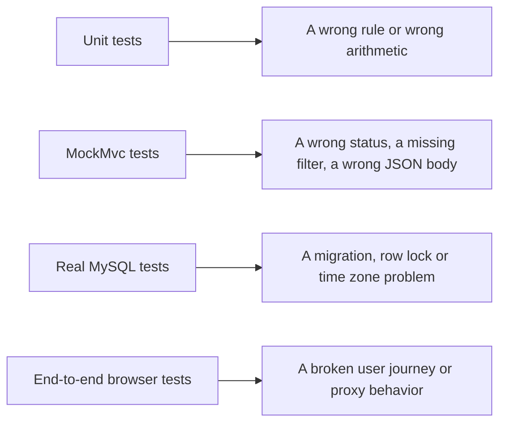

<!-- chapter: 18 | part: II | owner: writer-backend | tag: book-m6-final | status: expanded -->
# Chapter 18: Testing the backend

The Secure Document Viewer makes promises: a reader can't open someone else's document, a copied tile link stops working, twelve parallel password guesses don't become twelve guesses. Promises like these are only worth something if a machine checks them every time the code changes. This chapter teaches you how the project's more than 100 backend tests are built, from a three-line check of one method up to a test that starts a real MySQL database. It also shows how to write tests that fail for the right reasons and never fail at random.

## Learning objectives

By the end of this chapter, you will be able to:

- Explain the test pyramid and choose the right level for a new test.
- Write and run a JUnit 5 test using the arrange, act, assert pattern, and read its result.
- Test pure logic, code with a fake collaborator, and code that touches the file system.
- Write a `MockMvc` test that runs a request through the real security filters.
- Explain what H2 in MySQL mode and Testcontainers each prove, and what neither proves.
- Write a concurrency test that is deterministic, and fix a flaky test by controlling time and ordering.

## Prerequisites

- Chapter 4: classes, objects, records and interfaces
- Chapter 5: collections, lambdas and exceptions
- Chapter 6: Maven and the shape of a project
- Chapters 11 to 16: the backend features under test (you don't need every detail; each test is explained where it appears)

## Beginner tier: Tests are questions the code must keep answering

### 18.1 Why we test, and the test pyramid

A test is code that runs other code and checks the result. Think of the checklist a pilot runs before every takeoff. The pilot knows how to fly, and still nobody trusts memory for the twelfth flight of the day: a checklist run the same way every time catches the step that was skipped. A test suite is the checklist for the code. It runs in minutes, doesn't get bored, and doesn't assume that the change you made "couldn't possibly affect that."

**Where the analogy breaks down:** a checklist confirms that steps were performed. A test can only show that the cases someone *thought to write* still behave as expected. A green test run means "no known problem", never "no problem". Most of the skill in testing is choosing the cases well, and this chapter spends as much time on choosing as on syntax.

Tests come in sizes, and a healthy project has a shape, usually drawn as a pyramid (Figure 18.1).

```text
              /\
             /  \        few:  the whole system, real browser (Playwright, Chapter 24)
            /----\
           /      \      some: part of the application running (Spring, MockMvc, a real database)
          /--------\
         /          \    many: one class or method, no framework, milliseconds
        /------------\
```

*Figure 18.1 — The test pyramid*

*Text description:* A triangle drawn in text with three bands. The narrow top band holds a few whole-system browser tests, the middle band holds some tests that run part of the application, and the wide bottom band holds many fast tests of one class or method. The shape shows that speed and precision fall as a test covers more.

<!-- source: the test classes named in Table 18.1 at book-m6-final; the top layer is the Playwright end-to-end tests of Chapter 24 -->


A **unit test** exercises one small piece, such as a method or a class, in isolation. It's fast (milliseconds) and, when it fails, it points at the broken line. An **integration test** starts several pieces together, for example the real security filters plus the real controllers plus a database, to check that they cooperate. It is slower and, when it fails, tells you *that* something is wrong but makes you search for where. A **system test** drives the finished app the way a user would (Chapter 24). You want many of the first kind, fewer of the second, and few of the third, because speed and precision fall as scope rises.

The project's backend tests at `book-m6-final` follow this shape. Table 18.1 shows the levels with real examples.

**Table 18.1 — Backend tests at `book-m6-final`**

| Level | Example classes | What they prove |
|---|---|---|
| Pure logic | `TileGridTest`, `SignedUrlServiceTest`, `LoginThrottleTest`, `WatermarkServiceTest` | Rules and arithmetic, without Spring |
| Logic with collaborators | `StorageJanitorTest`, `TileGenerationServiceTest` | Code that uses files or other classes, using fakes and temporary folders |
| Application with `MockMvc` | `ErrorContractTest`, `SecurityIntegrationTest`, `CsrfCookieFlowTest`, `SecurityHeadersTest`, `DocumentAccessIntegrationTest` | Endpoints, filters, error shape, access rules |
| Real database | `MySqlIntegrationTest` | Migrations, row locks, UTC timestamps |

All of them live in `src/test/java/com/example/securedocviewer/`, in the same package structure as the code they test. That mirror layout is a Maven convention (Chapter 6): Maven compiles `src/main/java` into the program and `src/test/java` into a separate test program that is never shipped.

Figure 18.2 pairs each layer with the kind of mistake it is best at catching.



*Figure 18.2 — The layers of tests and what each one catches*

*Text description:* Four rows, each with an arrow from a kind of test to the mistakes it catches best. Unit tests catch wrong rules and arithmetic, MockMvc tests catch wrong statuses, missing filters and wrong JSON, real-MySQL tests catch migration, row-lock and time-zone problems, and end-to-end browser tests catch broken user journeys and proxy behavior.

<!-- source: the test classes named in Table 18.1 at book-m6-final; the end-to-end layer is Chapter 24 -->

Each layer is slower than the one before it and sees more of the system. A mistake caught by a unit test is cheap to find; a mistake that only the browser layer can see is expensive, so the project pushes each rule down to the lowest layer that can prove it.

### 18.2 JUnit 5 and the anatomy of a test

**JUnit 5** is the Java testing framework. A test is an ordinary method marked with the annotation `@Test`. When you run the tests, JUnit finds every such method, calls it, and records whether it finished normally (pass) or threw an exception (fail). **Assertions** are the methods that do the throwing. `assertEquals(expected, actual)` throws if the two values differ, and the exception carries a message such as `expected: <3> but was: <2>`.

Nearly every good test has the same three parts, which are easiest to remember as a recipe.

1. **Arrange.** Create the objects and data the test needs.
2. **Act.** Do the one thing being tested.
3. **Assert.** Check the outcome.

Here is the pattern with no project code around it, so you can see the bones. Because it is written to teach and is not from the repository, it's an Example, not a Listing.

**Example 18.1 — The shape of a test**

```java
@Test
void aPageOfOneThousandPixelsNeedsTwoTilesOfFiveHundredTwelve() {
    int pageWidth = 1000;                                 // arrange
    int tileSize = 512;

    int tiles = TileGrid.tileCount(pageWidth, tileSize);  // act

    assertEquals(2, tiles);                               // assert
}
```

Notice the long method name. A test name is documentation: when the test fails in the console, the name is the first thing you read, so it should say what was expected to be true. `aPageOfOneThousandPixelsNeedsTwoTilesOfFiveHundredTwelve` tells you what broke before you open the file. The project's tests follow the same habit: `wrongPasswordAndUnknownUserGetTheSameAnswer`, `readersCannotReachAdminOrUpload`, `anAdminSetPasswordMustBeChangedBeforeAnythingElseWorks`. Read down the list of names in `SecurityIntegrationTest` and you have a summary of the security promises the app makes.

You run every test with Maven (Chapter 6):

```bash
./mvnw test
```

You should see something like:

```text
[INFO] Tests run: N, Failures: 0, Errors: 0, Skipped: 0, Time elapsed: ... s -- in ...TileGridTest
...
[INFO] Tests run: N, Failures: 0, Errors: 0, Skipped: 0
[INFO] BUILD SUCCESS
```

The exact wording and numbers depend on your Maven version and on how many tests exist, so treat this as an illustration of the format. Three words matter in that summary. A **failure** means an assertion did not hold. An **error** means the test itself crashed with an unexpected exception before it could assert. A **skipped** test was deliberately not run; you will meet a deliberate skip in Section 18.9.

### 18.3 Testing pure logic: `TileGridTest`

The easiest code to test has no dependencies: you give it numbers, it returns numbers. `TileGrid` from Chapter 17 is exactly that, so its test needs no Spring, no database and no files.

**Listing 18.1 — `TileGridTest.java` (`book-m6-final`, simplified: imports, the image-building helper and the last two tests are omitted)**

```java
class TileGridTest {

    @Test
    void tileCountRoundsUpForPartialTiles() {
        assertEquals(1, TileGrid.tileCount(1, 256));
        assertEquals(1, TileGrid.tileCount(256, 256));
        assertEquals(2, TileGrid.tileCount(257, 256));
        assertEquals(13, TileGrid.tileCount(612, 50));
        assertEquals(16, TileGrid.tileCount(792, 50));
    }

    @Test
    void tileCountRejectsNonPositiveInputs() {
        assertThrows(IllegalArgumentException.class, () -> TileGrid.tileCount(0, 256));
        assertThrows(IllegalArgumentException.class, () -> TileGrid.tileCount(100, 0));
    }

    @Test
    void edgeTilesAreCroppedNotPadded() {
        BufferedImage page = noiseImage(612, 792);

        BufferedImage interior = TileGrid.sliceTile(page, 0, 0, 50);
        assertEquals(50, interior.getWidth());
        assertEquals(50, interior.getHeight());

        BufferedImage rightEdge = TileGrid.sliceTile(page, 0, 12, 50); // 612 - 600 = 12px wide
        assertEquals(12, rightEdge.getWidth());
        // ...
    }
    // ...
}
```

*Path: `src/test/java/com/example/securedocviewer/service/TileGridTest.java`*

Look at how the first test chooses its inputs. The rule under test is "round up", and the interesting values for a rounding rule are the boundaries. A page one pixel wide needs one tile. A page exactly one tile wide needs one tile, not two. A page one pixel *over* a tile (257 with 256-pixel tiles) needs two. The last two lines use the size of a US letter page in points, 612 by 792. They use a small tile of 50 so you can check the arithmetic by hand: 612 / 50 is 12.24, which rounds up to 13. Whenever you test a rule, ask "where does its behavior change?" and put values on both sides of that line.

The second test uses `assertThrows`, which deserves a slow reading:

```java
assertThrows(IllegalArgumentException.class, () -> TileGrid.tileCount(0, 256));
```

The second argument is a lambda (Chapter 5), a small piece of code handed to `assertThrows` unrun. `assertThrows` runs it inside a `try` block, and passes only if the code throws the named exception type. Without the lambda, the exception would escape from your test line and crash it. This is also a test of a *refusal*: the project cares that bad input fails loudly rather than producing a nonsense grid.

The third test builds a random image (`noiseImage`, omitted here) and checks the dimensions of the tiles cut from it. The comment `// 612 - 600 = 12px wide` is the good kind of comment in a test: it shows the arithmetic that explains the expected number. Tests that assert unexplained numbers are hard to trust and harder to fix.

### 18.4 Common mistakes when starting out

Some mistakes are so common that it's worth naming them early.

- **Testing several things in one test.** A test called `everythingWorks` that asserts twenty things stops at its first failure and hides the other nineteen. Prefer small tests with one reason to fail. (`tileCountRoundsUpForPartialTiles` makes five assertions, but they all check one rule.)
- **Asserting the code's own answer.** If you compute the expected value with the same formula the code uses, the test can never fail. Use a value you worked out by hand or know independently, like the 13 in Listing 18.1.
- **Forgetting the failure cases.** Code that accepts good input is half the job. The project's tests spend as much effort on "the wrong password is refused" and "a tampered token is rejected" as on the happy path, because security is mostly about refusals.
- **Tests that depend on each other's order.** JUnit doesn't promise an order. Each test must set up what it needs. Section 18.7 shows how tests that share one application avoid stepping on each other.
- **Ignoring a red test.** A test that fails "sometimes" is a flaky test (Section 18.11). Don't merge over it; find the cause.

## Intermediate tier: Tests with collaborators and the whole application

*If you're reading for the first time, Sections 18.5 and 18.6 are the important ones here; you can skim 18.7 and come back once you have written a test or two.*

### 18.5 Setting up: `@BeforeEach`, fakes and temporary folders

Real code has dependencies. `SignedUrlService` (Chapter 17) needs a `ViewerProperties` object holding the signing secret and the token lifetime. For a unit test you don't start Spring to get one; you create one by hand. `SignedUrlServiceTest` does it in a method annotated `@BeforeEach`, which JUnit runs before every test so each starts from a clean slate.

**Listing 18.2 — `SignedUrlServiceTest.java` (`book-m6-final`, simplified: imports and two tests are omitted; the test's signing secret is replaced by the placeholder `<unit-test-secret>`, as this book never prints secret values)**

```java
class SignedUrlServiceTest {

    private ViewerProperties properties;
    private SignedUrlService service;

    @BeforeEach
    void setUp() {
        properties = new ViewerProperties();
        properties.setSigningSecret("<unit-test-secret>");
        properties.setUrlTtlSeconds(60);
        service = new SignedUrlService(properties);
    }

    @Test
    void issuedTokenRoundTripsToTheSamePayload() {
        String token = service.issueToken("doc-1", 2, 3, 4, 1, "session-abc");

        SignedTilePayload payload = service.verifyAndDecode(token);

        assertEquals("doc-1", payload.documentId());
        assertEquals(2, payload.page());
        // ...
    }

    @Test
    void tamperedSignatureIsRejected() {
        String token = service.issueToken("doc-1", 0, 0, 0, 1, "session-abc");
        String[] parts = token.split("\\.", 2);
        // Flip the last character of the signature — payload is untouched.
        char[] sig = parts[1].toCharArray();
        sig[sig.length - 1] = sig[sig.length - 1] == 'A' ? 'B' : 'A';
        String tampered = parts[0] + "." + new String(sig);

        assertThrows(InvalidTokenException.class, () -> service.verifyAndDecode(tampered));
    }
    // ...
}
```

*Path: `src/test/java/com/example/securedocviewer/service/SignedUrlServiceTest.java`*

Two things are worth noticing. First, the first test is a **round trip**: issue a token, decode it, and check you get back what you put in. Round trips are a cheap, strong test for any pair of "encode" and "decode" operations. Second, the tampering test is an attack in miniature. It flips one character of the signature and checks that the service refuses it. The next test in the file (omitted) splices the signature of one token onto the payload of another and checks that this too is refused. Those tests together are the executable form of the claim in Chapter 17 that the signature covers every field.

There is a subtle point in `setUp`. The signing secret used in the real test (shown here as a placeholder) is a short throwaway value of only 16 characters, while `ViewerProperties` demands at least 32 (Chapter 13). It works because the length rule is enforced only when *Spring* binds the settings from `application.yml`. A plain `new ViewerProperties()` in a unit test skips validation. That is convenient, and it is also a trap: a unit test proves the service works, not that the configuration is valid. The validation itself is exercised when the whole application starts in the integration tests, which use a test secret longer than 32 characters.

Some classes need help that isn't simple to build by hand. `StorageJanitor` (Chapter 14) looks at real folders on disk and asks the `DocumentRepository` which documents exist. Its test uses two tools.

- `@TempDir` gives the test a fresh, empty folder that JUnit deletes afterward, so the test can create and delete real directories without touching your files.
- **Mockito**, a library that comes with Spring Boot's test starter, creates a **mock**: a stand-in object whose answers you script. A mock stands in for a collaborator that is hard to construct (a repository that needs a database).

**Listing 18.3 — `StorageJanitorTest.java` (`book-m6-final`, excerpt: the second test, imports omitted)**

```java
@Test
void keepsEveryVersionWhenTheCurrentOneIsMissing(@TempDir Path root) throws IOException {
    // e.g. a database restored from before a replace, with tiles archived after it
    Instant old = Instant.now().minus(StorageJanitor.MIN_AGE).minusSeconds(60);
    Path onlySurvivor = dir(root.resolve(KNOWN).resolve("v3"), old);

    ViewerProperties properties = new ViewerProperties();
    properties.setStorageRoot(root.toString());
    DocumentRepository documents = mock(DocumentRepository.class);
    when(documents.findAllTileVersions()).thenReturn(List.<Object[]>of(new Object[] {KNOWN, 2}));

    assertEquals(0, new StorageJanitor(properties, documents).removeOrphans(Instant.now()));
    assertTrue(Files.exists(onlySurvivor), "the only tiles left must be kept for recovery");
}
```

*Path: `src/test/java/com/example/securedocviewer/service/StorageJanitorTest.java`*

Two names in the listing come from parts of the file that are not shown: `dir(...)` is a small helper that creates a folder and gives it a chosen age. `KNOWN` is a made-up document id used throughout the class. Read the test as a story. The database (the mock) says "the document's current tile version is 2". The disk contains only `v3`. The janitor must not delete it, because it might be the only surviving copy of someone's tiles. The last argument of `assertTrue` is a message shown if the assertion fails: `"the only tiles left must be kept for recovery"`. It states the *reason*, so a future developer who breaks this rule learns why it existed. Compare it with the first test in the same class. That test builds nine directories of different ages and checks that exactly four are removed. Each `assertTrue` or `assertFalse` carries a message that names the rule ("a very recent directory may be an upload in flight").

This test also shows a rule about scope. It is about a *dangerous* action, deleting files, and it is written to prove what the action must **not** do. Tests for destructive code should spend most of their lines on the things that must survive.

### 18.6 Spring integration tests and `MockMvc`

Most of the app's rules live in how classes work together: a request passes through security filters, reaches a controller, calls a service and returns JSON, or fails and passes through the exception handler. To test that, you start the application inside the test. Three annotations do it.

- `@SpringBootTest` builds the full application context (Chapter 11): every bean, wired as in production.
- `@ActiveProfiles("test")` makes Spring read `application-test.yml` in addition to `application.yml`.
- `@AutoConfigureMockMvc` provides **MockMvc**, a tool that sends a request into the application's controllers *without opening a network port*. It is faster than a real HTTP call and passes through the same filters and handlers.

The test profile is short enough to read in full.

**Listing 18.4 — `application-test.yml` (`book-m6-final`, simplified: the signing secret and the test administrator's password are replaced by the placeholders `<test-signing-secret>` and `<test-admin-password>`; the real file holds throwaway test values, and this book never prints secret values)**

```yaml
# In-memory H2 in MySQL mode, so the same Flyway migrations run in tests
# without a database server.
spring:
  datasource:
    url: jdbc:h2:mem:securedocs;MODE=MySQL;DATABASE_TO_LOWER=TRUE;DB_CLOSE_DELAY=-1
    username: sa
    password: ""

secure-doc-viewer:
  signing-secret: <test-signing-secret>
  storage-root: ./target/test-storage
  bootstrap-admin:
    username: admin
    password: <test-admin-password>
```

*Path: `src/test/resources/application-test.yml`*

Line by line: `jdbc:h2:mem:securedocs` is an **H2** database that lives in memory and vanishes when the test process ends. `MODE=MySQL` makes it accept MySQL's flavor of SQL, and `DATABASE_TO_LOWER=TRUE` mirrors MySQL's lower-case table names. The *same* Flyway migrations (Chapter 14) therefore run unchanged. The signing secret is a throwaway value longer than the 32-character minimum. The storage root is under `target/`, the folder Maven deletes on `clean`, so tests never litter real storage. The bootstrap admin gets a known username and password so tests can sign in as an administrator; these are test-only placeholders that exist nowhere but in the test profile.

`ErrorContractTest` shows the smallest useful integration test. Its setup is:

**Listing 18.5 — `ErrorContractTest.java` (`book-m6-final`, excerpt: the class header)**

```java
@SpringBootTest
@AutoConfigureMockMvc
@ActiveProfiles("test")
@Import(ErrorContractTest.FailingController.class)
class ErrorContractTest {
```

*Path: `src/test/java/com/example/securedocviewer/controller/ErrorContractTest.java`*

The `@Import` adds a small controller that exists only in this test and throws an exception on purpose, containing a fake SQL statement and a file path in its message. The test calls it and asserts that the response is `500`, that the JSON body says only "Something went wrong on our side. Reference: ...", and that neither the SQL nor the path leaks (Chapter 13). This is a nice example of a test that *creates* its own trouble. There is no natural way to make a healthy app throw an unexpected exception on demand, so the test supplies one.

Now the workhorse. `SecurityIntegrationTest` has 22 tests, and its class comment says they are "one test per property the security review called out." A typical one:

**Listing 18.6 — `SecurityIntegrationTest.java` (`book-m6-final`, excerpt: test `apiRequiresSignIn`)**

```java
@Test
void apiRequiresSignIn() throws Exception {
    mvc.perform(get("/api/documents"))
            .andExpect(status().isUnauthorized())
            .andExpect(jsonPath("$.error").value("Sign-in required."));
}
```

*Path: `src/test/java/com/example/securedocviewer/security/SecurityIntegrationTest.java`*

`mvc.perform(get("/api/documents"))` sends a `GET` request. `andExpect(status().isUnauthorized())` asserts a `401`. `jsonPath("$.error")` looks inside the JSON response: `$` is the whole document and `.error` is the field of that name. The test proves three separate things at once: the security filter chain is active, an anonymous request is refused, and the refusal uses the project's one JSON error shape rather than an HTML page. If someone later changed a rule in `SecurityConfig` by accident, this test would turn red.

### 18.7 Security tests through the real filter chain

Tests that need a signed-in user must sign in first. `SecurityIntegrationTest` has two small helpers that every test uses, and reading them teaches a lot about how the app works.

**Listing 18.7 — `SecurityIntegrationTest.java` (`book-m6-final`, excerpt: the helper methods `user` and `login`)**

```java
private void user(String username, Role role) {
    try {
        accounts.create(username, PASSWORD, role, false);
    } catch (UsernameTakenException alreadyCreated) {
        // Context (and its in-memory database) is shared across tests.
    }
}

private MockHttpSession login(String username, String password) throws Exception {
    MvcResult result = mvc.perform(post("/api/auth/login").with(csrf())
                    .contentType(MediaType.APPLICATION_JSON).content(loginRequest(username, password)))
            .andExpect(status().isOk())
            .andReturn();
    return (MockHttpSession) result.getRequest().getSession(false);
}
```

*Path: `src/test/java/com/example/securedocviewer/security/SecurityIntegrationTest.java`*

`user` creates an account through the real `UserAccountService`, passing `false` for "must change password" so the account is immediately usable. Its `catch` block shows the ordering problem from Section 18.4: Spring reuses one application (and one in-memory database) for all tests in the class, for speed, so a user created by an earlier test may already exist. Each test therefore creates users with *its own distinct name* (`lockout-user`, `cookie-user`, `plain-reader`), and the helper tolerates duplicates. Test data is shared state; naming it uniquely is how tests avoid stepping on each other.

`login` performs a real sign-in through `AuthController`, then captures the resulting session so later requests can present it (`.session(reader)`). The `.with(csrf())` part attaches a valid CSRF token: without it, the request would be refused with `403` before reaching the controller (Chapter 16).

Here are three of the promises the class checks, with what each proves:

- `wrongPasswordAndUnknownUserGetTheSameAnswer` sends both kinds of bad sign-in and asserts the two response bodies are *equal*, proving the app doesn't reveal which usernames exist (Chapter 15).
- `readersCannotReachAdminOrUpload` signs in as a plain reader and asserts `403` on the admin endpoints and on upload, proving the role rules from Chapter 16 hold through the real chain.
- `tileLinksOnlyWorkForTheSessionTheyWereIssuedTo` checks that a tile link issued to one session is refused for another, proving the session binding described in Chapter 17.

Notice the shape: each test names a promise in plain language, arranges a user or two, acts by making requests, and asserts on status codes and JSON. That's the method to copy when you add a feature. Write the sentence "a reader must not be able to ...", turn it into a test name, and make it pass.

**Common mistakes with integration tests.**

- *Mocking too much.* If you replace the security filters or the database with mocks, the test no longer proves the real thing works. Use the real components and fake only what is truly outside your control, such as the clock or the network.
- *Asserting only the status code.* A `400` is also what you get for a hundred unrelated reasons. Check the error message too, as these tests do with `jsonPath`.
- *Sharing users between tests.* See Listing 18.7: give each test its own users.
- *A test that passes because the setup failed.* A test asserting "this request is refused" would pass if the sign-in helper silently failed, and you'd never notice. That is why `login` asserts `isOk()` on the sign-in itself before returning the session.

## Advanced tier: Real databases, time and concurrency

*You can skip to "In this project" on a first read. Part IV comes back to the incidents described here.*

### 18.8 A test helper that hid a bug: `CsrfCookieFlowTest`

Test helpers are convenient, and every convenience hides something. The helper `csrf()` used in Listing 18.7 makes a request carry a valid CSRF token by quietly replacing Spring's token repository. It is fine for most tests. But it means those tests never exercise the *real* cookie the browser uses.

That gap concealed a real bug. At sign-in, Spring's built-in rotation of the CSRF token deleted the `XSRF-TOKEN` cookie and then re-read the token from the request, which still had the old cookie. The browser was left with no token at all, and its first write after signing in failed with `403`. Tests using `csrf()` could not see it. The fix is in `AuthController.rotateCsrfToken` (Chapter 16), and the guard is `CsrfCookieFlowTest`, which behaves like a browser. It makes a first request and takes the `XSRF-TOKEN` cookie from the response, then signs in presenting that cookie and header. It checks three things: the sign-in response carries a *different, non-empty* token, the old token is refused, and the new one works immediately.

Its class comment explains a constraint worth remembering. The `csrf()` helper permanently swaps the filter's repository in whatever application context it runs in, "after which no real XSRF-TOKEN cookie is ever written". So the test class is annotated `@DirtiesContext(classMode = BEFORE_CLASS)`, which tells Spring to throw away any cached application and start a fresh one. <!-- source: dossier bugs-and-findings C1, C2; AuthController.rotateCsrfToken and CsrfCookieFlowTest comments at book-m6-final --> The lesson is general: **when a test uses a shortcut for a mechanism, that mechanism needs at least one test without the shortcut.**

### 18.9 Testcontainers and a real MySQL

H2 in MySQL mode is fast and needs nothing installed, but it is an imitation. Where H2 and MySQL differ (some SQL, locking behavior, how time zones convert), an H2 test can pass while the real database misbehaves. Chapter 14 listed three things the project wanted to check on the real engine: the Flyway migrations, the row lock that serializes PDF replacement, and UTC timestamps. **Testcontainers** is a library that starts a real service, here MySQL, in a Docker container (Chapter 10) for the duration of a test and throws it away afterward.

**Listing 18.8 — `MySqlIntegrationTest.java` (`book-m6-final`, simplified: imports, the JVM time-zone setup and most tests are omitted)**

```java
@SpringBootTest
@ActiveProfiles("test")
@Testcontainers(disabledWithoutDocker = true)
class MySqlIntegrationTest {

    @Container
    @ServiceConnection
    static final MySQLContainer MYSQL = new MySQLContainer("mysql:8.4")
            .withCommand("--default-time-zone=-03:00")
            .withUrlParam("connectionTimeZone", "UTC")
            .withUrlParam("forceConnectionTimeZoneToSession", "true");

    // ...

    @Test
    void everyMigrationAppliesToMySql() {
        List<String> applied = jdbc.queryForList(
                "select version from flyway_schema_history where success = 1 and version is not null order by installed_rank",
                String.class);
        assertEquals(List.of("1", "2", "3"), applied);
        // ...
    }
}
```

*Path: `src/test/java/com/example/securedocviewer/MySqlIntegrationTest.java`*

`@Container` tells Testcontainers to start the `mysql:8.4` image, the same version production runs, before the tests. `@ServiceConnection` is a Spring Boot feature that reads the container's address and credentials and points the application's datasource at it automatically, overriding the H2 URL from the test profile. `disabledWithoutDocker = true` makes the whole class *skip* (not fail) on a machine where Docker isn't running, which is the deliberate skip promised in Section 18.2. The class comment adds the safety net: "CI always has it", so the tests always run before code reaches `main`.

The container is started with a server time zone of `-03:00`, and the test class also sets the JVM to `Asia/Kolkata` (in the omitted code). Those are two *different, non-UTC* zones on purpose. The test then writes an audit event and reads back the raw stored value to check that it is UTC anyway. The class comment describes the situation: a dev machine in India talking to a database set to local time. A test that only passes when everything is in UTC would prove nothing about that.

Another test in the class starts two threads that replace the same PDF at once and checks that the row lock (Chapter 14) serialized them. The document ends at tile version 3, only the newest version directory exists on disk, and neither thread crashed. No mock can prove that. It needs a real database that really takes row locks.

The project's continuous-integration workflow runs `./mvnw -B verify` on every pull request; Chapter 36 covers it.

### 18.10 Concurrency tests: making a race happen on purpose

Some bugs exist only when two things happen at the same moment. A test for such a bug has a problem: run naively, requests trickle in one after another and never collide, so the buggy code passes. The test must force the collision.

`aBurstOfParallelWrongPasswordsGetsNoMoreThanTheLimit` in `SecurityIntegrationTest` does it. It creates 12 threads, each sending a wrong-password sign-in for the same account from the same address. All 12 *wait* at a gate, and then the gate opens and all go at once. The gate is a `CountDownLatch`:

**Listing 18.9 — `SecurityIntegrationTest.java` (`book-m6-final`, simplified: the loop that submits the threads is omitted; each submitted task calls `start.await()` before it sends its request)**

```java
java.util.concurrent.CountDownLatch start = new java.util.concurrent.CountDownLatch(1);
// ...
start.countDown();
```

*Path: `src/test/java/com/example/securedocviewer/security/SecurityIntegrationTest.java`*

A **latch** is a counter starting at 1: `await()` blocks until the count reaches zero, and `countDown()` lowers it, releasing everyone at once. Twelve threads that have all been created and are all waiting at the gate release together, so they really overlap.

Then the assertions. Every response must be either `401` (the password was checked and was wrong) or `429` (refused by the throttle), and the number of `401`s must equal exactly `MAX_FAILURES_PER_ACCOUNT`, which is 5. That is the atomic-counting promise from Chapter 16 in numbers: of 12 simultaneous guesses, exactly 5 were actually checked. A throttle that counted after checking would let many more through, and this test would fail.

**A test must be able to fail.** Ask of any concurrency test: "if I removed the protection, would it fail?" With the latch it would. Without the latch, threads might finish before the next one starts, and the test could pass even against buggy code. That is a weak test, and the worst kind because it gives false confidence. (Exercise 18.5 asks you to explore this.)

### 18.11 Flaky tests, and controlling time

A **flaky test** passes and fails without any change to the code. It is corrosive: once people stop trusting a red build, they stop reading it. The project's history has one instance, fixed in commit `ec6c1c5` (pull request 9), "Fix flaky render-slot assertion in TileGenerationServiceTest".

**The problem.** The test `aRenderThatTakesTooLongIsAbandonedAndFreesItsSlot` makes a render time out, and then asserted that every render slot was free at the same instant the second render returned. **How it was found.** The build on the main branch failed once, after an earlier pull request merged. **The cause.** The render thread frees its slot in a `finally` block that runs *just after* the caller has its result, so on a fast machine the assertion could land in that gap and read 0 where it expected 1. **The fix.** The test now waits, within a limit, for the counters to reach the expected value, and only then asserts. Production behavior was unchanged, because in production the slot frees microseconds after the upload returns. <!-- source: PR #9 description; commit ec6c1c5 --> You can see the pattern in the test. A loop of the form "until a deadline, look; if right, stop; otherwise sleep 100 ms" is followed by the real assertion, with the comment "allow a moment rather than checking at the same instant."

**The lesson.** A test that checks a state at the exact moment a result returns is racing the code it tests. Wait *for a condition*, with a generous limit, never for a fixed guess of how long something takes.

The other general cure is to take control of time. `LoginThrottle` and `KnownDevices` each have a second, package-private constructor that accepts a `java.time.Clock` (Chapter 11 noted that classes with two constructors need an explicit `@Autowired`). In production they use the system clock. A test can pass a clock it controls and move it forward by 15 minutes without waiting 15 minutes. Any code that decides "has enough time passed?" should take its clock as a parameter so that the test, not the calendar, decides.

**Common mistakes with slow or timing-dependent tests.**

- *Sleeping for a fixed time.* `Thread.sleep(2000)` is either too short (flaky) or too long (a slow suite). **Poll** instead: check the condition repeatedly, pausing briefly between checks, until it is true or a deadline passes.
- *Reading the real clock in the assertion.* If code stamps "now" and the test compares to "now" a moment later, they can differ. Compare with a tolerance (`MySqlIntegrationTest` accepts a **drift**, a difference between the two times, of under one minute) or inject a clock.
- *Leaving shared files behind.* Use `@TempDir` or a folder under `target/`, as in Listings 18.3 and 18.4.

## In this project

Part IV shows how these tests grew with each milestone. Table 18.2 shows where each idea in this chapter lives at `book-m6-final`.

**Table 18.2 — Where Chapter 18's ideas live**

| Idea | File |
|---|---|
| Pure-logic tests | `service/TileGridTest.java`, `service/SignedUrlServiceTest.java`, `security/LoginThrottleTest.java` |
| Temporary folders and mocks | `service/StorageJanitorTest.java` |
| Test profile (H2, test secret) | `src/test/resources/application-test.yml` |
| Error shape | `controller/ErrorContractTest.java` |
| Security promises | `security/SecurityIntegrationTest.java`, `security/SecurityHeadersTest.java` |
| Browser-like CSRF flow | `security/CsrfCookieFlowTest.java` |
| Real MySQL | `MySqlIntegrationTest.java` |
| Concurrency | `SecurityIntegrationTest` (burst test), `document/ConcurrentServingIntegrationTest.java` |

All paths are under `src/test/java/com/example/securedocviewer/` unless shown otherwise.

## Try it

### Exercise 18.1 ★ Run the tests and read the summary

From the project folder at `book-m6-final`, run `./mvnw test`. Find the line that reports the number of tests run. Which test class was skipped, if any, and why? (If you don't have Docker running, one should be.)

*Solution:* Appendix C, Exercise 18.1.

### Exercise 18.2 ★ Add a boundary case

In `TileGridTest`, add a test that `TileGrid.tileCount(512, 512)` is 1 and `TileGrid.tileCount(513, 512)` is 2. Predict both answers before you run it. Work on your own branch (`git switch -c exercise-18-2`).

*Solution:* Appendix C, Exercise 18.2.

### Exercise 18.3 ★★ Write an unauthenticated test

Write a new test class that starts the application like `ErrorContractTest` does and asserts that `GET /api/admin/audit` without signing in returns `401` with the error `Sign-in required.`. Then change the test to sign in as a reader (copy the `user` and `login` helpers from Listing 18.7) and assert `403`. What is the difference between the two failures, and which layer of the app produces each?

*Hint:* the first is "we don't know who you are", the second is "we know, and you may not".

*Solution:* Appendix C, Exercise 18.3.

### Exercise 18.4 ★★ Break a rule and watch the test

On a scratch branch, first predict what happens if you change `MAX_FAILURES_PER_ACCOUNT` in `LoginThrottle` from 5 to 6. Then change it, run `LoginThrottleTest` and `SecurityIntegrationTest`, and compare. Next, break the rule differently: make `checkAllowed` ignore the account-and-address rule, and run them again. Which tests fail now, and what does each failure message say? Restore the code. What does the difference between the two experiments tell you about how the tests are tied to the rule?

*Solution:* Appendix C, Exercise 18.4.

### Exercise 18.5 ★★★ Is the burst test strong enough?

In a scratch copy, remove the `start.await()` call from the burst test and run it ten times. Then temporarily change `LoginThrottle.reserve` to check first and count after (so the counting is no longer atomic) and run the original test again. Explain what you observe about which version of the test can detect the bug, and write a paragraph on what makes a concurrency test trustworthy.

*Solution:* Appendix C, Exercise 18.5 (a worked outline).

### Exercise 18.6 ★★★ Design a test for a promise

Pick one promise from the app that has no test of its own (for example, that a document unshared from a user stops serving new tiles to them). Write the promise as a one-line test name, list the arrange, act and assert steps, and say which level of the pyramid it belongs to and why. Implement it if you can.

*Solution:* Appendix C, Exercise 18.6 (a worked outline).

## Summary

- Tests form a pyramid: many fast method-level tests, fewer application tests, few whole-system tests. Choose the lowest level that can prove the promise.
- A JUnit 5 test is a `@Test` method following arrange, act, assert; its name should read as a sentence describing behavior.
- Choose inputs at the boundaries where behavior changes, and spend as many tests on refusals as on successes.
- `@BeforeEach`, `@TempDir` and Mockito mocks let you test code with collaborators, and `assertTrue` messages should state the reason for the rule.
- `@SpringBootTest` with `MockMvc` runs requests through the real filters, controllers and handlers; share the application but not the data.
- H2 in MySQL mode gives speed; Testcontainers gives a real MySQL for what H2 can't vouch for, and a test that uses a shortcut needs a partner test without it.
- Concurrency tests use latches to force a collision; flaky tests are fixed by waiting for conditions and injecting clocks, never by guessing how long something takes.

## Further reading

- *JUnit 5 User Guide*. https://docs.junit.org/current/user-guide/
- *Spring Framework Reference Documentation*, "Testing." https://docs.spring.io/spring-framework/reference/testing.html
- *Spring Boot Reference Documentation*, "Testing." https://docs.spring.io/spring-boot/reference/testing/index.html
- *Testcontainers for Java*. https://java.testcontainers.org/
- *Mockito Documentation*. https://site.mockito.org/
