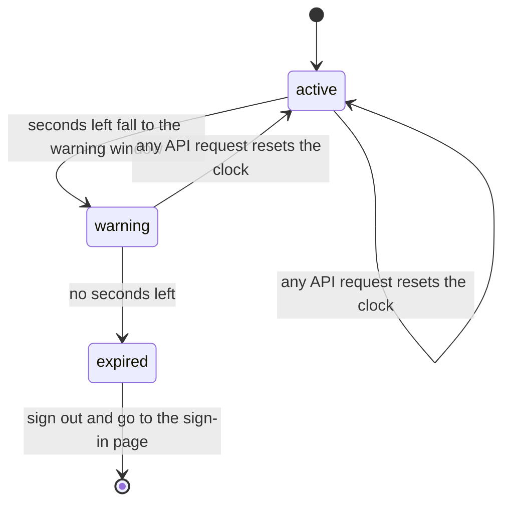

<!-- chapter: 19 | part: III | owner: writer-frontend | tag: book-m6-final | status: expanded -->
<!-- source: TypeScript 6.0.3 strict-by-default behavior verified by compiling a test file with the project's tsconfig.json options (errors TS2322 and TS7006 appeared); zoom rounding in viewer.component.ts; all listings verified with git show book-m6-final -->
# Chapter 19: TypeScript

Everything you see in the Secure Document Viewer's browser window is driven by TypeScript, the language the frontend is written in. In this chapter you learn enough of it to read every file under `frontend/src/app/`, starting from the small data shapes that mirror the backend's JSON and ending with the `async` code that fetches page tiles. If you know Java from Part I, you will recognize most of the ideas; the chapter points out where the two languages differ, because those differences are where beginners trip.

## Learning objectives

By the end of this chapter, you will be able to:

- Explain what TypeScript adds to JavaScript and why the project compiles it before the browser sees it.
- Write an `interface`, a union type, and a typed function, and read the ones in `document.models.ts` and `idle.ts`.
- Trace a small function line by line, using `buildTileViewModels` as the example.
- Handle missing values with `null`, `?.`, `??` and the spread operator, as the session service does.
- Compare `Promise`, `async`/`await`, and `Observable`, and say which the app uses where.
- Read a TypeScript compiler error and find the line it is really about.
- Check that a frontend type matches the JSON the backend sends, and explain what the check does not cover.

## Prerequisites

- Chapter 4: classes, objects, records and interfaces (Java's version of the ideas here).
- Chapter 5: collections, generics, lambdas and exceptions.
- Chapter 8: how the web works (a browser sends HTTP requests and receives JSON).

## Beginner tier: A language that checks your work

### 19.1 JavaScript and TypeScript: what each is

A **browser** runs one programming language natively: **JavaScript**. Every interactive web page, including the Secure Document Viewer's, ultimately runs JavaScript. JavaScript lets you write `total + 1` without ever saying whether `total` holds a number, some text, or nothing at all, and it finds out only when the line runs, in front of a user.

**TypeScript** is JavaScript with a layer of labels added, called **types**. A type says what kind of value a name holds: `number`, `string`, or a shape you define. A program called the **compiler** reads your TypeScript before anything runs, checks that every use matches its label, and then removes the labels, producing plain JavaScript for the browser. The browser never sees a type.

Think of a form at a doctor's office with boxes marked "date of birth" and "phone number". The boxes don't make you honest, but the clerk can spot at once that you wrote a phone number in the date box. TypeScript is the clerk, and the compiler runs the check at your desk, before the form is sent.

**Where the analogy breaks down:** a clerk checks the form once, at the counter, and after that the paperwork is trusted. TypeScript checks only your own code. Data that arrives later from the network, such as the JSON from the backend, is not checked at all when the program runs, because the labels are gone by then. Section 19.9 returns to this.

If you know Java (Chapters 3–5), much of this will feel familiar. The syntax differs in one visible way: the type comes after the name, separated by a colon.

**Example 19.1 — Java and TypeScript side by side**

```java
int pageCount = 12;
```

```typescript
const pageCount: number = 12;
```

`const` means the name can't be pointed at a different value later. `let` is the version that can. The project uses `const` almost everywhere.

The project's TypeScript version is 6.0, pinned in `package.json` as `"typescript": "~6.0.2"` (the `~` is explained in Chapter 20, Section 20.8). The lock file records 6.0.3.

### 19.2 Values and variables

Before reading real code, learn the vocabulary of values. TypeScript's basic types are few:

| Type | Holds | Example | Java counterpart |
|---|---|---|---|
| `string` | Text | `'PRIVATE'` | `String` |
| `number` | Any number, whole or fractional | `12`, `0.4` | `int`, `long`, `double` (all in one) |
| `boolean` | `true` or `false` | `canManage` | `boolean` |
| `string[]` | A list of strings (an **array**) | `['alice', 'bob']` | `List<String>` |
| `null` | Deliberately "no value" | `null` | `null` |
| `undefined` | "Never given a value" | (a variable never set) | (no direct equivalent) |

Two differences from Java matter immediately. First, there is only one kind of number: the same `number` type holds page counts, pixel sizes and timestamps. That's why the Java record in Section 19.9 has `int` and `long` fields where the TypeScript interface has `number` for all of them. Second, JavaScript has two "nothing" values, `null` (put there on purpose) and `undefined` (never assigned). The project's own types use `null` for "not applicable"; `undefined` shows up when you read something that isn't there, such as a missing property.

Text can be assembled with **template literals**, written with backticks, where `${...}` inserts a value. You have already met them: `documents.service.ts` builds its address with `` `${API_BASE_URL}/api/documents` ``, and the viewer builds CSS values such as `` `${info.pageWidthPx}px` ``.

**Example 19.2 — Values in a few lines (teaching example, not repository code)**

```typescript
const title: string = 'Quarterly report';
const pages: number = 12;
const labels: string[] = ['draft', 'internal'];
let note: string | null = null;      // may hold text, or nothing
const summary = `${title} (${pages} pages)`;
note = 'Reviewed';                   // allowed: it's a string
// pages = 'twelve';                 // compile error: a string is not a number
```

Line by line: the first three lines declare a text, a number and a list, with their types after the colons. The fourth uses `let` because `note` will change, and `string | null` says "text or nothing" (Section 19.3 explains the `|`). `summary` has no type written: TypeScript **infers** it from the right-hand side, so `const summary = ...` is a `string` without anyone saying so. The project relies on inference heavily; types are written where the compiler can't guess, such as function parameters and the data shapes in `*.models.ts`. The last line is commented out because it would not compile: assigning text to a `number` is exactly the mistake TypeScript exists to catch.

### 19.3 Types, interfaces, unions

An **interface** names a shape: which properties an object has and what type each one is. It is the closest thing to a Java record (Chapter 4), except that it exists only for the compiler.

**Listing 19.1 — `document.models.ts` (book-m6-final, excerpt: `PageInfo` and `DocumentSummary`)**

```typescript
export type Visibility = 'PRIVATE' | 'EVERYONE';

export interface PageInfo {
  page: number;
  rows: number;
  cols: number;
  tileSize: number;
  pageWidthPx: number;
  pageHeightPx: number;
}

/** A row in the document library. */
export interface DocumentSummary {
  documentId: string;
  title: string;
  pageCount: number;
  owner: string;
  visibility: Visibility;
  createdAtEpochSeconds: number;
  updatedAtEpochSeconds: number;
  canManage: boolean;
  /** Only present when canManage is true. */
  sharedWithCount: number | null;
}
```

*Path: `frontend/src/app/features/documents/document.models.ts`*

Reading it top to bottom:

- `export` makes the name available to other files (Section 19.4).
- `type Visibility = 'PRIVATE' | 'EVERYONE'` defines a **union type**: a value that must be one of the listed alternatives. Here the alternatives are two exact pieces of text. Writing `'PUBLIC'` where a `Visibility` is expected is a compile error, and so is a typo like `'PRIVAT'`. The `|` reads as "or".
- `interface PageInfo { ... }` lists six properties, all numbers.
- `sharedWithCount: number | null` is another union: a number, or `null`. The comment says when it's `null`. The compiler forces every piece of code that reads this property to handle both cases; you can see that in `accessLabel` in `document-list.component.ts`, which checks `doc.sharedWithCount === null` first.
- `/** ... */` is a documentation comment; editors show it when you hover over the name.

The same union idea appears for the three user roles: `export type Role = 'READER' | 'PUBLISHER' | 'ADMIN';` in `session.service.ts`. The backend has an enum with the same three constants (Chapter 15); on this side, a union of strings plays that part.

A union can also mix *shapes*. `idle.ts` describes the three states of the idle-timeout countdown (Chapter 22) this way:

**Listing 19.2 — `idle.ts` (book-m6-final, excerpt: the type)**

```typescript
export type IdleState =
  | { kind: 'active' }
  | { kind: 'warning'; secondsLeft: number }
  | { kind: 'expired' };
```

*Path: `frontend/src/app/core/idle.ts`*

Each alternative carries a `kind` label. Only the `warning` alternative has `secondsLeft`. When code checks `state.kind === 'warning'`, the compiler knows that inside that branch `state.secondsLeft` exists, and outside it, doesn't. This pattern is a **discriminated union**, and it turns "which fields are valid right now?" from a comment into something the compiler enforces. The screen that shows the countdown makes exactly this kind of check on `state.kind` before it reads `state.secondsLeft`. Angular's template syntax, which that screen is written in, is the subject of Chapter 21; for now, only notice the check.

Figure 19.1 shows the same idea as a picture: the three alternatives are the three states of the idle countdown, and the arrows are what moves the app from one to the next.



*Figure 19.1 — The idle states of `IdleState` and what moves between them*

<!-- source: idle.ts (idleState) and app.ts (checkIdle, forceLogout) at book-m6-final; touch() in session.service.ts records activity -->

Notice that the diagram has exactly the states the type has, and no others: a value can never be "half-expired". `idleState` itself only *computes* which state applies from the current time and the last activity; the arrows that reset to `active` happen because every successful API request updates the last-activity time (Chapter 22), and the last arrow happens in `App.checkIdle`, which signs the reader out when the state is `expired`.

### 19.4 Functions, arrow functions, modules

A function declares typed parameters and, after the parameter list, a return type.

**Listing 19.3 — `idle.ts` (book-m6-final, excerpt: the function)**

```typescript
export function idleState(nowMs: number, lastActivityMs: number, timeoutSeconds: number): IdleState {
  if (timeoutSeconds <= 0) {
    return { kind: 'active' };
  }
  const secondsLeft = Math.ceil(timeoutSeconds - (nowMs - lastActivityMs) / 1000);
  if (secondsLeft <= 0) {
    return { kind: 'expired' };
  }
  return secondsLeft <= Math.min(IDLE_WARNING_SECONDS, timeoutSeconds / 2)
    ? { kind: 'warning', secondsLeft }
    : { kind: 'active' };
}
```

*Path: `frontend/src/app/core/idle.ts`*

`IDLE_WARNING_SECONDS` is a constant defined a few lines above the function in the same file (`export const IDLE_WARNING_SECONDS = 5 * 60;`, so 300 seconds), left out of this excerpt. The function takes three numbers, returns an `IdleState`, and has no side effects (it changes nothing outside itself and reads nothing but its inputs): given the same three numbers it always gives the same answer. The compiler checks every `return` against `IdleState`; returning `{ kind: 'warnng' }` would be rejected. Notice `{ kind: 'warning', secondsLeft }`: when a variable has the same name as the property, TypeScript lets you write it once (`secondsLeft` instead of `secondsLeft: secondsLeft`). The condition `cond ? a : b` is the **conditional expression**, the same as in Java: "if `cond`, then `a`, otherwise `b`".

Read the arithmetic once, because the rest of the chapter assumes you can follow such lines. `nowMs - lastActivityMs` is how many milliseconds have passed since the last activity; dividing by 1000 converts to seconds; subtracting that from the timeout gives the seconds left; `Math.ceil` rounds up, so 0.2 seconds left still counts as one second (the countdown never shows zero while there is time). If nothing is left, the session has expired. Otherwise the reader is warned when the seconds left are within the warning window: the smaller of five minutes and half the timeout.

Small functions are often written as **arrow functions**, `(x) => expression`, which are the same idea as Java lambdas (Chapter 5). `this.tiles().filter((t) => t.status === 'loaded')` passes an arrow function that answers "is this tile loaded?" for each element.

A **module** is a file that lists what it shares with `export` and pulls in what it needs with `import`. That's how `viewer.component.ts` uses code from other files:

**Listing 19.4 — `viewer.component.ts` (book-m6-final, excerpt: two of its import lines, not adjacent in the file)**

```typescript
import { API_BASE_URL } from '../../core/config';
import { buildTileViewModels, TileViewModel } from './tile-view-model';
```

*Path: `frontend/src/app/features/viewer/viewer.component.ts`*

The path after `from` is where the code lives: `./` is "this folder" and `../` is "one folder up". Modules replace Java's `package` and `import` pair with a single mechanism where the file path is the address.

### 19.5 Worked example: reading a whole function

The best way to gain fluency is to read a real function slowly. `tile-view-model.ts` turns the server's description of a page into the rectangles the viewer draws (Chapter 21). Here is the function:

**Listing 19.5 — `tile-view-model.ts` (book-m6-final, excerpt: the function; the imports and the interface are omitted)**

```typescript
export function buildTileViewModels(grid: TileUrlGrid, pageInfo: PageInfo, apiBaseUrl: string): TileViewModel[] {
  const tiles: TileViewModel[] = [];
  for (let row = 0; row < grid.rows; row++) {
    for (let col = 0; col < grid.cols; col++) {
      const left = col * grid.tileSize;
      const top = row * grid.tileSize;
      const width = Math.min(grid.tileSize, pageInfo.pageWidthPx - left);
      const height = Math.min(grid.tileSize, pageInfo.pageHeightPx - top);
      tiles.push({
        key: `${row}-${col}`,
        url: `${apiBaseUrl}${grid.tileUrls[row][col]}`,
        top,
        left,
        width,
        height,
      });
    }
  }
  return tiles;
}
```

*Path: `frontend/src/app/features/viewer/tile-view-model.ts`*

Go through it in order.

1. **The signature.** It takes a `TileUrlGrid` (the server's answer to "which tile addresses for this page?"), a `PageInfo` (from Listing 19.1: the page's size in pixels), and a string to put in front of each address. It returns `TileViewModel[]`, an array of tile descriptions.
2. **`const tiles: TileViewModel[] = [];`** starts an empty array. `const` doesn't stop you from adding items; it only stops you from pointing `tiles` at a different array.
3. **Two nested loops.** `for (let row = 0; row < grid.rows; row++)` counts rows from 0, and the inner loop counts columns. `row++` adds one each time. Together they visit every cell of the grid, row by row.
4. **Position.** A tile's `left` edge is its column times the tile size, and its `top` is its row times the tile size.
5. **Size.** Most tiles are exactly `tileSize` wide and high, but the last column and row are usually smaller, because a page is rarely an exact multiple of the tile size. `Math.min(grid.tileSize, pageInfo.pageWidthPx - left)` picks the smaller of "a full tile" and "what remains of the page". The comment in the file says why: edge tiles are cropped, so each tile's size has to be derived from the page's dimensions rather than assumed to equal `tileSize`.
6. **`tiles.push({...})`** adds one description. `key` is a stable label made from the row and column with a template literal. `url` joins the base and the tile's address, found by two-step lookup `grid.tileUrls[row][col]` (an array of arrays). The shorthand `top,` and `left,` means `top: top` and `left: left`.

A concrete case makes the edge logic visible. Suppose a page is 1,000 pixels wide and 1,300 pixels tall, and tiles are 512 pixels:

| Tile (row, col) | left | top | width | height |
|---|---|---|---|---|
| (0, 0) | 0 | 0 | 512 | 512 |
| (0, 1) | 512 | 0 | 488 (1000 − 512) | 512 |
| (1, 0) | 0 | 512 | 512 | 512 |
| (2, 1) | 512 | 1024 | 488 | 276 (1300 − 1024) |

The grid has 2 columns and 3 rows (1,000 ÷ 512 rounds up to 2, and 1,300 ÷ 512 rounds up to 3), so six tiles. Only the interior ones are full-size. This is the kind of small, self-contained, testable logic that TypeScript is good at, and it lives in its own file precisely so it can be understood in isolation.

### 19.6 Missing values and safe access

Real data has gaps: nobody is signed in yet, a document has no share count, a property is absent. TypeScript 6.0 helps by insisting you deal with them. The project's compiler options (Chapter 20) don't mention the `strict` setting, and in TypeScript 6.0 the strict checks are switched on by default: compiling a test file with this project's options rejects `let a: string = null;` (error `TS2322`) and a parameter with no type (error `TS7006`, "implicitly has an 'any' type"). So the compiler will not let you use a value that might be `null` as if it were surely there.

Three small tools make the handling readable, all visible in `session.service.ts`:

- **Optional chaining, `?.`,** stops and yields `undefined` if the thing before it is `null` or `undefined`. `this.current()?.username` means "the username, if there is a current user; otherwise nothing, and no crash".
- **Nullish coalescing, `??`,** supplies a default for `null` or `undefined`. `x ?? null` means "`x`, or `null` if `x` is missing".
- **The spread operator, `...`,** copies the properties of an object into a new one. `{ ...user, mustChangePassword: false }` means "a new object with everything `user` has, but with `mustChangePassword` set to false". The original isn't modified.

**Listing 19.6 — `session.service.ts` (book-m6-final, excerpts from two places in the class)**

```typescript
  readonly username = computed(() => this.current()?.username ?? null);
  // ...
        const user = this.current();
        if (user) {
          this.current.set({ ...user, mustChangePassword: false });
        }
```

*Path: `frontend/src/app/core/session.service.ts`*

The first line combines the first two tools: "the current user's name, or `null` if nobody is signed in". The second block is the end of the change-password method: it reads the current user, and only `if (user)`, meaning only when a user exists, does it store a *new* object with the flag turned off. Storing a new object rather than editing the old one matters in Chapter 21: signals notice a *replaced* value, not an edited one.

Arrays have handy methods you will see everywhere. `filter` keeps the elements that pass a test, `map` transforms each element, `some` asks "does any element pass?", and `includes` asks "is this in the list?". For example, the viewer counts loaded tiles with `this.tiles().filter((t) => t.status === 'loaded').length`, and the admin screen checks whether an event is a warning with `[...].includes(event.type)`.

## Intermediate tier: Asynchronous code, errors, and generics

*On a first read you can skip to "In this project"; Part IV comes back to this.*

### 19.7 `async`, promises and observables (only what the app uses)

A browser must never freeze while it waits for the network. So operations that take time don't return their result; they return a stand-in for it. TypeScript has two stand-ins that matter here.

A **Promise** stands for one result that will arrive later, or fail. An `async` function returns a promise, and inside it the keyword `await` pauses that function (not the browser) until the promise settles. Think of ordering at a coffee counter: you get a buzzer immediately, keep talking with friends, and collect the drink when the buzzer goes off.

**Where the analogy breaks down:** a buzzer goes off once, and so does a promise. But a promise can also end in failure, and a real buzzer has no such state. In code, a failed `await` throws an exception, which you catch with the `try`/`catch` you know from Java (Chapter 5).

An **Observable** stands for a *stream* of results over time: zero, one, or many values. It comes from a library called RxJS, which Angular's `HttpClient` uses (Chapter 22). You start it by calling `.subscribe(...)` with functions for "a value arrived" and "it failed". The project's rule of thumb: Angular's `HttpClient` gives Observables; the browser's `fetch()` gives Promises. You see the Promise side in `viewer.component.ts`:

**Listing 19.7 — `viewer.component.ts` (book-m6-final, excerpt: fetching one tile inside `fetchPendingTiles`)**

```typescript
        let response: Response;
        try {
          response = await fetch(tile.url, { signal, cache: 'no-store' });
        } catch {
          if (signal.aborted) {
            return;
          }
          this.updateTile(tile.key, { status: 'failed' });
          continue;
        }
```

*Path: `frontend/src/app/features/viewer/viewer.component.ts`*

`fetch(...)` returns a promise of a `Response`. `await` waits for it. If the network fails, the promise is rejected and the `catch` block runs. `signal` is an `AbortSignal`, which lets the viewer cancel every in-flight request at once when the reader turns the page, so a cancelled fetch is not treated as an error. `cache: 'no-store'` tells the browser not to keep a copy of the tile. The annotation `let response: Response` is needed because the value is assigned inside `try`. `catch` without a name is allowed when you don't need the error object, and `continue` skips to the next loop round.

Several `await` loops can also run side by side. The viewer starts a fixed number of "workers" and waits for all of them:

```typescript
await Promise.all(Array.from({ length: MAX_CONCURRENT_TILE_FETCHES }, () => worker()));
```

`Array.from({ length: 6 }, () => worker())` creates six calls to `worker()`, each returning a promise (the constant is 6). `Promise.all` gives back one promise that settles when all six are done. Chapter 22 explains why a small pool.

Where a function can only pass a value on later, callers can convert. `session.service.ts` uses `firstValueFrom(...)` to turn an HTTP Observable into a Promise, because Angular's startup hook (`provideAppInitializer`, Chapter 22) waits for a promise.

### 19.8 Reading TypeScript errors

The compiler's messages look intimidating, but they follow a pattern: a code (such as `TS2322`), a sentence saying what it found versus what it expected, and often extra lines drilling into why. Read the first line and the last line; the middle is detail.

**Example 19.3 — A typical error and how to read it**

```text
error TS2322: Type '"PUBLIC"' is not assignable to type 'Visibility'.
```

Read it as: "you gave me `'PUBLIC'`, but this place accepts only a `Visibility`, and `'PUBLIC'` isn't one." The fix is on the line the error names: either the value is a typo, or the union (Listing 19.1) needs a new alternative, which then makes the compiler point at every place that must handle it.

Here are two errors that were produced by compiling a small test file with the project's compiler options and TypeScript 6.0.3 (the file is the author's experiment, not repository code):

```text
t.ts(1,5): error TS2322: Type 'null' is not assignable to type 'string'.
t.ts(2,12): error TS7006: Parameter 'x' implicitly has an 'any' type.
```

The prefix `t.ts(1,5)` gives the file, line and column, so you can jump straight to the spot. The first says a variable declared as `string` was given `null`: the fix is either to allow it (`string | null`) or to not assign it. The second says a function parameter has no type and the compiler can't work one out; `any` would switch checking off, so the compiler asks you to write a type. Two habits help when a message is long: fix the *first* error first, since later ones are often consequences, and read the last line of a multi-line message, which usually names the actual mismatch.

The project turns on a few extra checks in `tsconfig.json` (Chapter 20, Section 20.7). Two are worth knowing now: `noImplicitReturns` (a function whose branches sometimes return a value and sometimes don't is an error) and `noFallthroughCasesInSwitch` (a `switch` case that runs into the next one is an error).

> **Note:** The file doesn't contain the word `strict`. That is not the same as "not strict": in TypeScript 6.0 the strict family of checks is on unless you turn it off. Check the behavior of your own compiler version rather than the presence of a setting.

### 19.9 Types that mirror the API

The backend (Part II) sends JSON. The frontend describes what it expects with interfaces, one per response shape, kept in `*.models.ts` files. `DocumentDetail` in `document.models.ts`, for example, lists the fields the viewer needs: the page list, the `tileVersion`, and `canManage`.

Here is the backend's side of the same shape, the Java record from Part II:

**Listing 19.8 — `DocumentSummary.java` (book-m6-final, simplified: the package line and a documentation comment omitted)**

```java
public record DocumentSummary(
        String documentId,
        String title,
        int pageCount,
        String owner,
        Visibility visibility,
        long createdAtEpochSeconds,
        long updatedAtEpochSeconds,
        boolean canManage,
        Integer sharedWithCount
) {
}
```

*Path: `src/main/java/com/example/securedocviewer/document/DocumentSummary.java`*

Compare it with Listing 19.1 line by line: `String` becomes `string`, `int` and `long` both become `number` (JavaScript has one number type), `boolean` stays, the Java enum `Visibility` becomes a union of its constant names, and `Integer sharedWithCount`, which can be `null` in Java, becomes `number | null`. The names are identical because Jackson, the backend's JSON library, uses the record's field names as JSON keys.

Two rules keep these honest:

- **Field names and types must match the backend's response exactly.** `createdAtEpochSeconds: number` is a number of seconds since 1970 because that is what the backend sends; the frontend converts it for display (`new Date(epochSeconds * 1000)` in `document-list.component.ts`). When the backend changes a field, the interface must change in the same commit.
- **Nullable on the wire means `| null` in the type.** `sharedWithCount: number | null` exists because the count is only present when the reader can manage the document.

Now the limit promised in Section 19.1: these interfaces are a promise, not a check. `this.http.get<DocumentSummary[]>(this.base)` tells the compiler what to expect; nothing verifies the actual JSON at run time. If the backend sent a different shape, the compiler would stay silent and the page would break in front of a user. That is why the project's tests (Chapter 24) feed realistic JSON to the components, and why the server, not the frontend, is the authority on what is allowed (Chapter 23).

### 19.10 Generics: one function, many types

You met generics in Java (`List<String>`, Chapter 5). TypeScript's are the same idea. `HttpClient.get<T>` returns `Observable<T>`, and `signal<T>` (Chapter 21) holds a `T`. The project also defines one. In `manage.component.ts`, several server actions need the same busy flag and error notice, so one helper handles them:

**Listing 19.9 — `manage.component.ts` (book-m6-final, excerpt: method `run`)**

```typescript
  private run<T>(request: Observable<T>, onSuccess: (value: T) => void): void {
    this.busy.set(true);
    this.notice.set(null);
    request.subscribe({
      next: (value) => {
        this.busy.set(false);
        onSuccess(value);
      },
      error: (err: HttpErrorResponse) => {
        this.busy.set(false);
        this.confirmingDelete.set(false);
        this.notice.set({ kind: 'error', text: err.error?.error ?? 'Something went wrong.' });
      },
    });
  }
```

*Path: `frontend/src/app/features/documents/manage.component.ts`*

`<T>` is a placeholder filled in at each call: for `unshare` the request is an `Observable<string[]>`, so `T` is `string[]` and `onSuccess` must accept a `string[]`; for `replaceFile` it's `DocumentDetail`. The compiler checks each call separately. Without a generic, the project would need either a copy of `run` for every response type, or a version that accepts `any` and loses the checking.

### 19.11 Small type tools the app uses

- `Partial<TileState>` means "an object with any subset of `TileState`'s properties". `updateTile(key, patch)` in the viewer uses it so callers can change just `{ status: 'failed' }`.
- `Record<string, () => void>` means "an object whose keys are strings and whose values are functions taking nothing". The viewer's keyboard handler (Chapter 23) uses it to map key names to actions.
- **Type assertions,** written `value as Type`, tell the compiler "trust me, this is a `Type`". They bypass a check, so they are used sparingly; the upload component uses one for `event.target as HTMLInputElement`, because the browser's generic event type doesn't know the target is a file input.
- **Extending an interface** adds properties to an existing shape, as Java's `extends` does. The viewer's tile state builds on the tile description this way:

**Listing 19.10 — `viewer.component.ts` (book-m6-final, excerpt: the tile state types)**

```typescript
type TileStatus = 'pending' | 'loaded' | 'failed';

interface TileState extends TileViewModel {
  /** Object URL of the fetched PNG, once loaded. */
  src: string | null;
  status: TileStatus;
}
```

*Path: `frontend/src/app/features/viewer/viewer.component.ts`*

A `TileState` has everything from Listing 19.5's `TileViewModel` (key, url, position, size) plus a `src` and a `status` that can only be one of three words. Because `status` is a union, a typo such as `'laoded'` fails to compile, and the `if (tile.status === 'loaded')` checks throughout the viewer can never silently compare against a word that doesn't exist.

- `as const` freezes an array of literals into exact types, and `typeof` reads the type of a value, so a list and its type stay in step. The admin screen's list of audit event types does this:

**Listing 19.11 — `admin.models.ts` (book-m6-final, simplified: the event names after `'SIGN_IN'`, 18 in all, are omitted at the `// ...` line)**

```typescript
export const AUDIT_EVENT_TYPES = [
  'PAGE_VIEWED',
  'TILE_VIEWED',
  'SIGN_IN',
  // ...
] as const;

export type AuditEventType = (typeof AUDIT_EVENT_TYPES)[number];
```

*Path: `frontend/src/app/features/admin/admin.models.ts`*

`as const` says the array is fixed and its elements are these exact words, not just "some strings". `(typeof AUDIT_EVENT_TYPES)[number]` reads: the type of the array, indexed by any number, that is, "any one element": a union of all 21 names. The same list can drive a drop-down menu in the admin screen (it does), while the type prevents a filter from being set to a name that isn't in the list. One source of truth, no drift.

## Advanced tier: What types can't prevent

*On a first read you can skip to "In this project"; Part IV comes back to this.*

### 19.12 Stale answers: guarding async code with a generation counter

Types can't prevent a whole class of bugs that async code invites: an answer arriving after it has stopped being relevant. A reader flips from page 3 to page 4 while page 3's tiles are still downloading. If page 3's late responses were allowed to write into the page state, page 4 would show page 3's pixels.

The viewer prevents this with a plain counter, `loadGeneration`, incremented on every page change. Each fetch remembers the value it started with and drops its result if the value has moved on (`if (generation !== this.loadGeneration) { return; }`). The reset code shows the other half of the cleanup:

**Listing 19.12 — `viewer.component.ts` (book-m6-final, excerpt: method `resetPageState`)**

```typescript
  private resetPageState(): void {
    this.loadGeneration++;
    this.abortController.abort();
    this.abortController = new AbortController();
    this.gridSub?.unsubscribe();
    this.reloadSub?.unsubscribe();
    this.clearThrottle();
    for (const tile of this.tiles()) {
      if (tile.src) {
        URL.revokeObjectURL(tile.src);
      }
    }
    this.tiles.set([]);
  }
```

*Path: `frontend/src/app/features/viewer/viewer.component.ts`*

Step by step: bumping `loadGeneration` invalidates every answer still in flight; `abort()` cancels the network requests and a fresh `AbortController` is made for the next page (a controller can be used only once); the two subscriptions are cancelled with `?.unsubscribe()` (the `?.` from Section 19.6: "if there is one"); the throttle timers are cleared; and each tile's temporary `blob:` address is released with `URL.revokeObjectURL` so the browser can free the image memory. The code comments in `viewer.component.ts` give the reason for bounding the requests: outstanding requests would otherwise keep spending the reader's rate-limit budget (Chapter 22). Nothing here is enforced by the compiler; it takes discipline, and `viewer.component.spec.ts` (Chapter 24) checks the visible consequences.

### 19.13 Why `fetch()` for tiles and not `HttpClient` or plain image URLs

The obvious alternatives are to let the browser load tiles itself from an image URL, or to use `HttpClient` like every other call. The comment above `MAX_CONCURRENT_TILE_FETCHES` gives the project's reason: only `fetch()` exposes the response status, and a throttled (429) or expired (401) tile is otherwise indistinguishable from a blank one, so the page silently renders with holes. Chapter 22 shows the outcome handling; the point here is that these language choices (Promise-based `fetch`, `AbortSignal`) follow from what information the code needs.

### 19.14 Numbers and user input: two small traps

JavaScript numbers are double-precision floating point, which cannot represent most decimal fractions exactly. Adding 0.2 repeatedly to 1 shows the effect. Run in Node (Chapter 20):

```text
1.2, 1.4, 1.5999999999999999, 1.7999999999999998
```

The viewer's zoom buttons add or subtract 0.2, so the project rounds after each step:

**Listing 19.13 — `viewer.component.ts` (book-m6-final, excerpt: method `zoomIn`)**

```typescript
  zoomIn(): void {
    this.zoom.update((z) => Math.min(MAX_ZOOM, +(z + 0.2).toFixed(2)));
  }
```

*Path: `frontend/src/app/features/viewer/viewer.component.ts`*

Read from the inside out: `z + 0.2` is the new zoom; `.toFixed(2)` rounds it to two decimals but returns *text*; the leading `+` converts the text back to a number; `Math.min(MAX_ZOOM, ...)` caps it at the maximum. With the rounding, the sequence is a clean 1.2, 1.4, 1.6, 1.8. The reader-visible percentage would look right either way, but other code compares the zoom with plain numbers (the swipe handler ignores swipes when `zoom() > 1`), and clean values keep those comparisons predictable.

The second trap is turning text from a form into a number. `Number('')` is `0`, `Number(' 3 ')` is `3`, `Number(null)` is `0`, and `Number('abc')` is `NaN` ("not a number"), which is not even equal to itself. So `Number(x)` alone can't tell "the user typed nothing" from "the user typed 0". The viewer's page-jump code guards against exactly that:

**Listing 19.14 — `viewer.component.ts` (book-m6-final, excerpt: method `goToPage`)**

```typescript
  goToPage(raw: string): void {
    const pageCount = this.manifest()?.pageCount ?? 0;
    const pageNumber = Number(raw);
    if (!raw.trim() || !Number.isInteger(pageNumber) || pageNumber < 1 || pageNumber > pageCount) {
      this.pageInputError.set(`Enter a whole number from 1 to ${pageCount}.`);
      return;
    }
    this.pageInputError.set(null);
    if (pageNumber - 1 !== this.currentPage()) {
      this.loadPage(pageNumber - 1);
    }
  }
```

*Path: `frontend/src/app/features/viewer/viewer.component.ts`*

The condition rejects, in order: blank text (`!raw.trim()`), anything that is not a whole number (`Number.isInteger` is false for `NaN` and for 2.5), and anything outside 1 to the page count. Only then does the code go on. Note the conversion at the end: the reader's page 3 becomes the code's index 2 (`pageNumber - 1`). This is user input; the type `string` on `raw` tells you nothing about whether it is *sensible*, which is why validation is code, not a type (Chapter 23 returns to this).

## Common mistakes

- **Using `==` instead of `===`.** The double-equals version converts types before comparing (`0 == ''` is true); the triple-equals version doesn't. The project uses `===` and `!==` throughout.
- **Forgetting `await`.** `const r = fetch(url)` gives you a promise, not a response. The compiler usually catches it when you then use `r.ok`.
- **Assuming a type checks the data.** `get<DocumentSummary[]>` is a promise to the compiler, not a validation of the JSON (Section 19.9).
- **Reaching for `any`.** It switches checking off for that value. Prefer a real type, a union, or `unknown` when you don't know the shape yet.
- **Mutating what a signal holds.** Editing an array or object in place doesn't tell Angular anything changed. Build a new value (`{ ...user, ... }`, `.map(...)`) and set it (Chapter 21).
- **Writing `Number(x)` and stopping.** It accepts blanks and returns `NaN` for junk. Combine it with `Number.isInteger` or `Number.isFinite`, and a range check.
- **Comparing floats for equality.** Round first, or compare within a tolerance, as the zoom code does.
- **Treating `null` and `undefined` as the same by accident.** `x ?? y` handles both; `x === null` only one. Know which your data can produce.
- **Leaving a `try`/`catch` empty.** The project's empty `catch` blocks carry a comment saying why ignoring is safe (for example, storage being unavailable); an unexplained empty `catch` hides bugs.

## In this project

| File | First appears | What it shows |
|---|---|---|
| `frontend/src/app/features/documents/document.models.ts` | book-m1-accounts | Interfaces and unions mirroring the API |
| `frontend/src/app/core/idle.ts` | book-m4-reading | Discriminated union and a pure function |
| `frontend/src/app/features/viewer/tile-view-model.ts` | book-m1-accounts | A pure function with loops and `Math.min` |
| `frontend/src/app/core/session.service.ts` | book-m1-accounts | `Role` union, `Observable`, `?.`, `??`, spread, `firstValueFrom` |
| `frontend/src/app/features/viewer/viewer.component.ts` | book-m1-accounts | `async`/`await`, `fetch`, `Promise.all`, `AbortController`, number handling |
| `frontend/src/app/features/documents/manage.component.ts` | book-m2-documents | The generic helper `run<T>` |
| `frontend/src/app/features/admin/admin.models.ts` | book-m1-accounts | `as const` and derived union types |

See any of them at a tag with `git show book-m6-final:frontend/src/app/core/idle.ts`. The viewer grew over the milestones: its fetch loop and `AbortController` exist at book-m1-accounts, while page memory, swipe, and replaced-document handling arrive in later tags.

## Try it

### Exercise 19.1 ★ The nullable property

In `document.models.ts`, which property of `DocumentDetail` can be `null`, and for whom?

*Solution:* Appendix C, Exercise 19.1.

### Exercise 19.2 ★ A Direction type

Write a type `Direction` that allows only `'next'` or `'previous'`, and a function `step(current: number, d: Direction): number`.

*Solution:* Appendix C, Exercise 19.2.

### Exercise 19.3 ★★ Extend IdleState

In a scratch copy, add a fourth alternative `{ kind: 'paused' }` to `IdleState`. Does the compiler complain anywhere? Why or why not?

*Solution:* Appendix C, Exercise 19.3.

### Exercise 19.4 ★★ A fetchOrNull helper

Rewrite the `try`/`catch` in Listing 19.7 as a helper `fetchOrNull(url, signal): Promise<Response | null>`. How can a caller tell an abort from a network failure?

*Solution:* Appendix C, Exercise 19.4.

### Exercise 19.5 ★★★ A generic firstWhere

Write a generic function `firstWhere<T>(items: T[], test: (item: T) => boolean): T | null` and use it to find the first loaded tile.

*Solution:* Appendix C, Exercise 19.5.

### Exercise 19.6 ★★ Tile arithmetic

Using Listing 19.5, work out the position and size of every tile for a page 600 pixels wide and 800 pixels tall with tiles of 256 pixels. How many tiles are there, and what are the width and height of the bottom-right one?

*Solution:* Appendix C, Exercise 19.6.


## Summary

- TypeScript is JavaScript plus labels that a compiler checks and then erases; the browser runs plain JavaScript.
- Interfaces describe shapes, and unions restrict a value to a list of alternatives, which the app uses for roles, visibility, tile status and idle states.
- Discriminated unions let the compiler track which fields exist in which state.
- Missing values are handled explicitly with `null`, `?.`, `??` and spreading into new objects; in TypeScript 6.0 the strict checks are on by default, even though this project's `tsconfig.json` never says `strict`.
- Promises and `await` handle a single delayed result, Observables handle streams; the app uses Observables for `HttpClient` and Promises for `fetch`.
- Generics such as `run<T>` share behavior across types while the compiler checks each use.
- Types mirror the API by agreement only; nothing checks JSON at run time.
- Async code and user input need discipline that types can't provide: the generation counter, number validation and rounding.

Next, Chapter 20 introduces Node and npm, the tools that compile and run all of this.

## Further reading

- TypeScript Handbook, "Everyday Types" and "Narrowing": https://www.typescriptlang.org/docs/handbook/
- MDN Web Docs, "Using promises" and "Fetch API": https://developer.mozilla.org/
- RxJS documentation, "Observable": https://rxjs.dev/guide/observable
