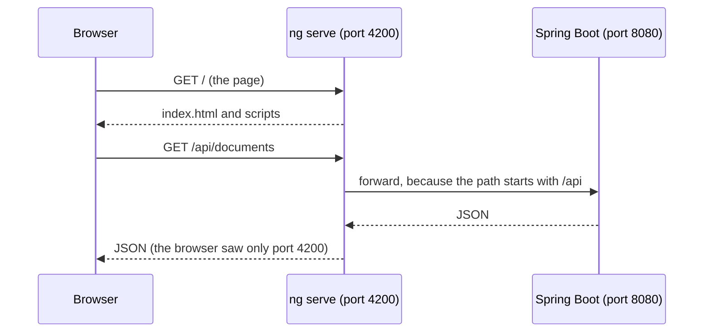

<!-- chapter: 20 | part: III | owner: writer-frontend | tag: book-m6-final | status: expanded -->
<!-- source: Dependabot PRs 10, 11, 12; Dockerfile, dependabot.yml, ci.yml, tsconfig.json, index.html, main.ts listings verified with git show book-m6-final -->
# Chapter 20: Node, npm and the Angular toolchain

Browsers understand JavaScript, but you write TypeScript, split across dozens of files, using libraries other people wrote. Something has to fetch those libraries, compile your code, bundle it into a few files, and serve it while you work. That something is a set of tools built on Node.js and npm, and this chapter shows how the Secure Document Viewer's `frontend/` folder uses them, from the first command you type to the container image that goes to production.

## Learning objectives

By the end of this chapter, you will be able to:

- Explain what Node.js and npm are and why a browser application needs them at build time but not at run time.
- Read `package.json` and `package-lock.json` and say what each is for.
- Run the project's scripts and say what `ng serve`, `ng build` and `ng test` do.
- Trace what happens between typing `npm start` and seeing the app in a browser.
- Explain how the development proxy keeps the browser and the API on the same origin.
- Interpret `^` and `~` version ranges and the settings in the three `tsconfig` files.
- Explain why the project installs with `npm ci` and how it keeps its dependencies current and safe.

## Prerequisites

- Chapter 2: the command line (you will type commands).
- Chapter 6: Maven and project layout (npm plays the same role as Maven for the frontend).
- Chapter 8: how the web works (origins, cookies).
- Chapter 10: containers and Docker (images and build stages).
- Chapter 19: TypeScript.

If you have not installed Node yet, follow the setup chapter in the front matter first. You need Node 24 and the npm that comes with it.

## Beginner tier: Tools that turn source into a website

### 20.1 What Node is; why a frontend needs it

**Node.js** (Node for short) is a program that runs JavaScript outside a browser, on your own computer. Nobody uses Node to show pages to readers. It's used as a workshop: the compiler that turns TypeScript into JavaScript is itself a JavaScript program, so it runs on Node. So do the **bundler**, which gathers your many source files and the libraries they use into a few files a browser can download efficiently, and the test runner.

Think of a print shop. Readers only ever see the finished pamphlet, but to produce it the shop needs presses, cutters and staplers, and someone who knows the order in which to run them. Node is the building's power supply and the operator's hands: it runs the machines and follows the instructions. Once the pamphlets are printed, you can switch the machines off.

**Where the analogy breaks down:** a print shop's pamphlets contain no trace of the machines. A web bundle does contain some code from the libraries you used (Angular itself is shipped to every reader). What stays behind is the tooling: the compiler and test runner never reach the reader.

That is why the project's production image uses two stages (Chapter 10). In the `frontend/Dockerfile`, the first stage starts from a Node image, installs dependencies, and builds. The second stage is only nginx, a web server, holding the finished files. The final image contains no Node at all. The project uses Node 24 (`node:24-alpine`).

### 20.2 Your first contact with Node

You can check that Node is installed, and see what it does, in a terminal (Chapter 2).

```bash
node --version
npm --version
```

You should see something like:

```text
v24.x.x
11.x.x
```

The exact numbers depend on what you installed. The project's `package.json` names npm 11.19.0 (Section 20.3), so a much older npm may print warnings. Now run one line of JavaScript with Node, with no browser involved:

```bash
node -e "console.log(2 + 3)"
```

`-e` tells Node to evaluate the text that follows. `console.log` prints to the terminal. The output is `5`. This is the whole idea of Node: the same language the browser runs, but with your terminal as its screen and your files as its world. The Angular compiler is a much bigger program run the same way.

### 20.3 npm, `package.json`, `package-lock.json`

**npm** is Node's package manager: a tool that downloads libraries (packages) from a public registry (an online catalog of published packages, at npmjs.com) and puts them in a folder called `node_modules/`. It plays the role that Maven played for Java (Chapter 6), and `package.json` is the counterpart of `pom.xml`.

**Listing 20.1 — `package.json` (book-m6-final)**

```json
{
  "name": "frontend",
  "version": "0.0.0",
  "scripts": {
    "ng": "ng",
    "start": "ng serve",
    "build": "ng build",
    "watch": "ng build --watch --configuration development",
    "test": "ng test",
    "e2e": "playwright test"
  },
  "private": true,
  "packageManager": "npm@11.19.0",
  "dependencies": {
    "@angular/common": "^22.1.0",
    "@angular/compiler": "^22.1.0",
    "@angular/core": "^22.1.0",
    "@angular/forms": "^22.1.0",
    "@angular/platform-browser": "^22.1.0",
    "@angular/router": "^22.1.0",
    "rxjs": "~7.8.0",
    "tslib": "^2.3.0"
  },
  "devDependencies": {
    "@angular/build": "^22.1.8",
    "@angular/cli": "^22.1.8",
    "@angular/compiler-cli": "^22.1.0",
    "@axe-core/playwright": "^4.13.0",
    "@playwright/test": "^1.63.0",
    "jsdom": "^30.0.1",
    "prettier": "^3.8.1",
    "typescript": "~6.0.2",
    "vitest": "^5.0.1"
  }
}
```

*Path: `frontend/package.json`*

Read it top to bottom.

- `"name"` and `"version"` identify the project. The version `0.0.0` is a placeholder because the app is never published as a package.
- `"scripts"` names shortcuts you run with `npm run <name>` (or `npm start` and `npm test`, which npm treats specially). `npm test` runs `ng test`. The first script, `"ng": "ng"`, lets you run the Angular CLI through npm as `npm run ng -- <arguments>`.
- `"private": true` stops the project from being published to the public registry by accident.
- `"packageManager"` records which npm version the project expects.
- `"dependencies"` are libraries the shipped app uses: Angular's pieces, RxJS (Chapter 19), and `tslib`, a small helper library the compiled code shares.
- `"devDependencies"` are tools used only while building and testing. They are the Angular CLI and build tooling, TypeScript, the test tools (`vitest`, `jsdom`, Chapter 24), Playwright and its accessibility add-on, and Prettier. Prettier is a code formatter, and `.prettierrc` sets a 100-column width and single quotes.

The split between the two groups matters. Anything in `dependencies` ends up, at least in part, inside the files readers download. Anything in `devDependencies` never leaves the build machine. When you add a library, ask which group it belongs to: "does the reader's browser need this code?"

> **Note:** Vitest 5.0.1 and jsdom 30 appear only at `book-m6-final`. Tags `book-m1-accounts` to `book-m5-platform` use Vitest 4.0.8 and jsdom 28, and Playwright and the accessibility add-on arrive at `book-m5-platform`.

`package-lock.json` is a much longer file (about 8,000 lines at this tag) that the tools write for you. `package.json` says "Angular 22.1 or newer, but not 23"; the lock file records the exact version that was actually installed, along with a fingerprint of each downloaded file. Here is the first part of one entry, the one for RxJS:

**Listing 20.2 — `package-lock.json` (book-m6-final, excerpt: the first lines of the `rxjs` entry)**

```json
    "node_modules/rxjs": {
      "version": "7.8.2",
      "resolved": "https://registry.npmjs.org/rxjs/-/rxjs-7.8.2.tgz",
      "integrity": "sha512-dhKf903U/PQZY6boNNtAGdWbG85WAbjT/1xYoZIC7FAY0yWapOBQVsVrDl58W86//e1VpMNBtRV4MaXfdMySFA==",
      "license": "Apache-2.0",
```

*Path: `frontend/package-lock.json`*

`version` is what was actually installed: `package.json` asked for `~7.8.0`, and 7.8.2 satisfied that. `resolved` is where the file came from. `integrity` is a hash: a short fingerprint calculated from the file's contents. If anyone altered the file, on the registry or in transit, the fingerprint would no longer match and npm would refuse to install it. The lock file describes not only the eight direct dependencies but every library they need in turn, a few hundred entries in total. Commit both files. Don't edit the lock file by hand.

### 20.4 The Angular CLI: `ng serve`, `ng build`, `ng test`

The **Angular CLI** (command line interface) is the `ng` program. Three commands cover almost everything:

```bash
npm ci          # first install: an exact copy of the tested versions (use npm install when you add or change a dependency)
npm start       # ng serve: dev server at http://localhost:4200, reloads on save
npm test        # ng test: run the Vitest specs (keeps running in a terminal; see Section 24.2)
npm run build   # ng build: produce the deployable files under dist/
```

`ng serve` compiles the app in memory and serves it with a small **development server**, refreshing the browser whenever you save a file. `ng build` does the same once, with optimization. It shrinks the code (removing spaces and shortening names). It also adds a fingerprint to each filename, such as `main-AB12CD34.js`, so browsers can cache the files for a year and a changed file gets a new name. The nginx setup in Chapters 30 and 33 relies on that. The build settings live in `angular.json`. Its `build` target names the entry point (`src/main.ts`), the global stylesheet (`src/styles.css`) and size **budgets**, which are limits that raise a warning or an error when the build output grows too large. In production the initial bundle warns at 500 kB and fails at 1 MB, and any one component's styles warn at 4 kB and fail at 8 kB.

### 20.5 Worked example: from `npm start` to the browser

Suppose you have cloned the repository and want to see the frontend. Follow the sequence, and notice which file drives each step.

1. **You type `npm start` in `frontend/`.** npm looks in `package.json` under `"scripts"`, finds `"start": "ng serve"`, and runs that command.
2. **`ng` starts.** The Angular CLI reads `angular.json`. The `serve` target says which builder to use and points at `proxy.conf.json`. Its default configuration is `development`, which turns optimization off and turns on source maps (files that let the browser's developer tools show your TypeScript instead of the generated JavaScript).
3. **The build target is compiled.** The `build` target names `src/main.ts` as the entry point and `tsconfig.app.json` as the compiler settings. The compiler follows every `import` from `main.ts` outward, so it finds every file that matters without you listing them. TypeScript becomes JavaScript, templates are compiled (Chapter 21), and everything is bundled.
4. **The dev server listens.** By default the Angular CLI serves at `http://localhost:4200`; you can confirm it in the terminal output when `ng serve` starts.
5. **The browser asks for `/`.** The server answers with `src/index.html`, which is almost empty:

**Listing 20.3 — `index.html` (book-m6-final)**

```html
<!doctype html>
<html lang="en">
<head>
  <meta charset="utf-8">
  <title>Secure Doc Viewer</title>
  <base href="/">
  <meta name="referrer" content="no-referrer">
  <meta name="viewport" content="width=device-width, initial-scale=1">
  <link rel="icon" type="image/x-icon" href="favicon.ico">
</head>
<body>
  <app-root></app-root>
</body>
</html>
```

*Path: `frontend/src/index.html`*

Line by line: `<!doctype html>` says this is a modern HTML page. `lang="en"` states the language, which screen readers use to pick a pronunciation. `<meta charset="utf-8">` fixes the text encoding (Chapter 2). `<base href="/">` tells the router (Chapter 23) that every relative address starts from the root. `<meta name="referrer" content="no-referrer">` asks the browser not to tell other sites which page a reader came from; the viewport line makes the page fit phone screens. Inside `<body>`, the only content is the custom tag `<app-root>`. The bundler has quietly added `<script>` tags for the compiled files; you don't write them.

6. **The scripts run `main.ts`,** which starts the application:

**Listing 20.4 — `main.ts` (book-m6-final)**

```typescript
import { bootstrapApplication } from '@angular/platform-browser';
import { appConfig } from './app/app.config';
import { App } from './app/app';

bootstrapApplication(App, appConfig)
  .catch((err) => console.error(err));
```

*Path: `frontend/src/main.ts`*

`bootstrapApplication(App, appConfig)` creates the root component `App` (Chapter 21) at the place where `<app-root>` sits, and gives it the app-wide settings from `appConfig` (Chapter 22). `.catch(...)` prints a startup error to the browser's console instead of failing silently. From here on, Angular draws the screen.

7. **You edit a file and save.** The dev server notices, recompiles only what changed, and tells the browser to reload. That loop, edit, save, see the result within seconds, is the main reason the tooling exists.

## Intermediate tier: Same origin, compiler settings, and choosing tools

*On a first read you can skip to "In this project"; Part IV comes back to this.*

### 20.6 The dev proxy (`proxy.conf.json`) and same origin

An origin is the combination of scheme, host and port: `http://localhost:4200` and `http://localhost:8080` are different origins. Browsers keep origins apart; a page from one may not freely call another. Cookies and the CSRF protection from Part II (Chapter 16) assume the page and the API share an origin.

In development the pieces run on two ports: `ng serve` on 4200 and Spring Boot on 8080. The dev server bridges them with a proxy: it forwards any request whose path starts with `/api` to the backend, so the browser thinks it is talking to one server.

**Listing 20.5 — `proxy.conf.json` (book-m6-final)**

```json
{
  "/api": {
    "target": "http://localhost:8080",
    "secure": false,
    "changeOrigin": false,
    "logLevel": "warn"
  }
}
```

*Path: `frontend/proxy.conf.json`*

`angular.json` points the dev server at this file (`"proxyConfig": "proxy.conf.json"`). `target` is where Spring Boot listens. `secure: false` means the proxy doesn't insist on a valid HTTPS certificate for the target (it's plain HTTP on your own machine). `changeOrigin: false` leaves the `Host` header as the browser sent it. `logLevel: "warn"` prints only warnings and errors.

Figure 20.1 shows the path a request takes while you develop.



*Figure 20.1 — Requests in development*

*Text description:* A sequence diagram with three participants: the browser, the `ng serve` development server on port 4200, and Spring Boot on port 8080. The browser asks the development server for the page and receives `index.html` and the scripts. It then asks the same server for `/api/documents`, and the development server forwards that request to Spring Boot and passes the JSON back. Notice that the browser only ever talks to port 4200.

<!-- source: proxy.conf.json and angular.json (proxyConfig) at book-m6-final; README of the frontend gives port 4200; Spring Boot on 8080 per the proxy target -->

The frontend code itself stays free of this: `core/config.ts` sets `API_BASE_URL = ''`, so every call is a relative URL such as `/api/documents`. In production the same job is done by nginx, whose `location ^~ /api/` block forwards to the backend (Chapters 30 and 33). The same code therefore works unchanged in both places.

**Why not let the browser call port 8080 directly?** It is the obvious alternative: fewer moving parts, and you would see the backend's errors straight away. But a page on port 4200 calling port 8080 is a cross-origin request, which the browser allows only if the backend explicitly permits it (a mechanism called CORS, cross-origin resource sharing). It would also work against the project's cookie-based sign-in design. The project relies on the browser sending its session cookie and Angular copying the CSRF cookie into a header (Chapter 22). Both are simplest and safest when the page and the API share one origin. Keeping one origin in development means the code you test is the code you ship. The price is a small config file and one more process in the picture.

### 20.7 Project layout and tsconfig

Table 20.1 lists the contents of `frontend/`, from the top:

**Table 20.1 — The layout of `frontend/`**

| Path | Purpose |
|---|---|
| `src/main.ts` | The entry point: starts the app |
| `src/index.html` | The one HTML page; contains `<app-root>` |
| `src/styles.css` | Global styles and theme tokens (Chapter 21) |
| `src/app/` | The application: `core/` (session, guards), `features/` (screens) |
| `public/` | Files copied unchanged (the favicon) |
| `e2e/` | Playwright tests (Chapter 24) |
| `tsconfig*.json` | TypeScript settings |
| `Dockerfile`, `nginx.conf` | How the production image is built and served |
| `.dockerignore`, `.gitignore` | What to leave out of the image and out of Git |
| `.editorconfig`, `.prettierrc` | Formatting rules shared by editors and the formatter |

Inside `src/app/`, two folders organize the code. `core/` holds things the whole app shares (the session service, the interceptor, the route guards, idle-timeout arithmetic). `features/` holds one folder per screen area: `auth`, `documents`, `viewer`, `admin`. A new reader can find code by asking "is it shared, or does it belong to one screen?"

Three `tsconfig` files exist: `tsconfig.json` (shared settings), `tsconfig.app.json` (the app: all `src/**/*.ts` except specs) and `tsconfig.spec.json` (the specs, with Vitest's global functions such as `describe` and `it` available). The app file sets `"types": []`, so no test globals leak into production code. The shared file's options are short enough to read in full:

**Listing 20.6 — `tsconfig.json` (book-m6-final, excerpt: the `compilerOptions` block)**

```json
  "compilerOptions": {
    "noImplicitOverride": true,
    "noPropertyAccessFromIndexSignature": true,
    "noImplicitReturns": true,
    "noFallthroughCasesInSwitch": true,
    "skipLibCheck": true,
    "isolatedModules": true,
    "experimentalDecorators": true,
    "importHelpers": true,
    "target": "ES2022",
    "module": "preserve"
  },
```

*Path: `frontend/tsconfig.json`*

- `noImplicitOverride` requires the word `override` when a class replaces a method from its parent, so an accidental name clash can't slip through.
- `noPropertyAccessFromIndexSignature` makes you write `process.env['CI']` (brackets) rather than `process.env.CI` for values found by key. You can see the effect in `playwright.config.ts`, which uses `process.env['CI']`.
- `noImplicitReturns` and `noFallthroughCasesInSwitch` are the two checks described in Chapter 19.
- `skipLibCheck` skips re-checking the type declarations of installed libraries, which saves time.
- `isolatedModules` requires each file to be understandable on its own, which fast tools need.
- `experimentalDecorators` enables the `@Component(...)` labels from Chapter 21.
- `importHelpers` reuses the small helpers in `tslib` rather than copying them into every file.
- `"target": "ES2022"` is the JavaScript version to produce, and `"module": "preserve"` leaves `import` statements alone for the bundler.

As Chapter 19 noted, the file never mentions `strict`. That does not mean the strict checks are off: in TypeScript 6.0 they are on by default (compiling a test file with these options rejects assigning `null` to a `string` and untyped parameters). If you need to know what a setting is at your compiler version, test it, as the chapter did, rather than reading the absence of a line as "off".

### 20.8 Semantic versions, `^` and `~`

Most packages number releases `MAJOR.MINOR.PATCH`, such as 22.1.8. By convention a patch fixes bugs, a minor adds features without breaking anything, and a major may break things. This is **semantic versioning**.

- `^22.1.0` accepts any 22.x.y that is 22.1.0 or newer (minor and patch updates, never 23).
- `~6.0.2` accepts only 6.0.x from 6.0.2 up (patches only).

The project uses `~` on TypeScript because each Angular release supports a narrow range of TypeScript versions, and on RxJS to stay on the 7.8 line. The lock file, not the range, decides what you actually get: TypeScript is `~6.0.2` in `package.json` and 6.0.3 in the lock.

Table 20.2 makes the rule concrete. Suppose a project asks for `^22.1.8` and the registry later publishes these versions:

**Table 20.2 — Which new versions the range `^22.1.8` accepts**

| New version | Accepted by `^22.1.8`? | Reason |
|---|---|---|
| 22.1.9 | Yes | Patch update |
| 22.4.0 | Yes | Minor update, same major |
| 23.0.0 | No | New major: may break things |
| 22.1.7 | No | Older than the stated minimum |

Remember that "accepted" describes what an update *may* pick. With a lock file, `npm ci` installs exactly the locked version regardless (Section 20.10).

### 20.9 Why npm and the Angular CLI, and not the alternatives

Every choice in this chapter has an obvious alternative, and it's worth naming them so you can judge the project's choices.

- **npm versus other package managers.** Yarn and pnpm do the same job and are popular. They are faster in some situations and store shared libraries more economically. The project's files show that it uses plain npm (the Dockerfile and CI both call it, and the `packageManager` field pins its version); the project records no reasoning for preferring it to Yarn or pnpm. Reasons a team might have: npm comes with Node, so there is nothing extra to install, and for a small team "fewer tools" can be worth more than a speed gain.
- **The Angular CLI versus assembling your own build.** You could wire together a compiler, a bundler, a dev server and a test runner yourself. The CLI packages those with defaults chosen and updated together by the Angular team (`@angular/build`, `@angular/cli`), so an upgrade is one coordinated step. The cost is that you accept its conventions and its configuration file, `angular.json`.
- **Vitest through the CLI versus a separate runner.** The `test` target in `angular.json` uses the CLI's own unit-test builder, so `ng test` and `npm test` behave the same locally and in CI (Chapter 24).

None of these is "the right answer" in general; they are reasonable defaults for a project whose priority is a small, reviewable toolchain.

## Advanced tier: Reproducible and safe installs

*On a first read you can skip to "In this project"; Part IV comes back to this.*

### 20.10 `npm install` versus `npm ci`

`npm install` may update the lock file if ranges allow newer versions. `npm ci` installs exactly what the lock file says and fails if `package.json` and the lock file disagree. The Dockerfile uses `npm ci --no-audit --no-fund`, so an image rebuilt next month contains the same packages that were tested. (`--no-audit` and `--no-fund` switch off two informational steps npm otherwise performs: a vulnerability report and a funding message. CI has its own vulnerability scan, Section 20.12.) The base images are also pinned by digest, a fingerprint (hash) of the exact image contents, so a rebuild can't silently pick up a different one.

**Listing 20.7 — `Dockerfile` (book-m6-final, excerpt: the build stage)**

```dockerfile
FROM node:24-alpine@sha256:ebfe2f90462722a7a4de65e91990e97fe0d401c70e0e762c5b53302f905ec1c1 AS build
WORKDIR /src
COPY package.json package-lock.json ./
RUN npm ci --no-audit --no-fund
COPY . .
RUN npx ng build --configuration production
```

*Path: `frontend/Dockerfile`*

The order of these lines is deliberate. Docker builds an image in layers and reuses a layer if none of the earlier lines changed (Chapter 10). Copying only `package.json` and `package-lock.json` first, and running `npm ci`, means the slow download step is repeated only when the dependency files change. Copying the rest of the source afterward means an ordinary code edit re-runs only the fast `ng build`. `.dockerignore` keeps `node_modules/`, `dist/` and `.angular/` (the compiler's cache) out of the build, so your local installation never leaks into the image.

### 20.11 Automated updates, deliberately limited

Dependencies age, and old ones carry known security problems. The project uses GitHub's Dependabot (`.github/dependabot.yml`) to open weekly pull requests, and its configuration for the frontend is worth reading:

**Listing 20.8 — `dependabot.yml` (book-m6-final, excerpt: the npm section)**

```yaml
  - package-ecosystem: npm
    directory: /frontend
    schedule:
      interval: weekly
    groups:
      angular:
        patterns: ['@angular/*', '@angular-devkit/*']
      npm-other:
        patterns: ['*']
        exclude-patterns: ['@angular/*', '@angular-devkit/*']
        # Majors arrive as separate PRs, so one breaking upgrade can't hold back the rest.
        update-types: ['minor', 'patch']
    ignore:
      # Angular pins the TypeScript range it supports; TypeScript moves with Angular upgrades.
      - dependency-name: typescript
        update-types: ['version-update:semver-major', 'version-update:semver-minor']
```

*Path: `.github/dependabot.yml`*

Angular packages are grouped so they upgrade together (mixing versions of Angular's parts risks a broken build). All other packages are grouped as minor and patch updates, and major upgrades arrive as separate pull requests so one breaking change can't hold back the rest. It never proposes TypeScript major or minor upgrades, because TypeScript moves with Angular. The same file has a rule for container images: it ignores Node's non-LTS lines. **LTS** means "long-term support" and marks the releases that receive fixes for years. The file's comment says odd-numbered Node releases never become LTS, and it skips Node 25, 27 and 29. The history shows this working. The Vitest 4 to 5 upgrade (pull request 11) and the jsdom 28 to 30 upgrade (pull request 12) arrived as separate, reviewable changes after `book-m5-platform`, which is why Vitest 5 appears only at `book-m6-final`. Chapter 36 covers the supply chain in full.

### 20.12 What the CI does with the frontend

Two jobs in `.github/workflows/ci.yml` tie the toolchain together. The "Frontend tests & build" job installs Node 24, runs `npm ci --no-audit --no-fund`, then `npx ng test --watch=false` and `npx ng build --configuration production`. A separate "dependency-scan" job runs a scanner over `frontend/package-lock.json` (and the backend's `pom.xml`) and fails the build if any library, direct or indirect, has a published vulnerability. That explains why the lock file, which lists every indirect library, matters for security as well as for reproducibility: it is the list the scanner reads.

## Common mistakes

- **Running commands in the wrong folder.** `npm start` in the repository root fails with a message that no `package.json` was found. The frontend lives in `frontend/`; `cd frontend` first.
- **Starting the frontend without the backend.** The page loads, but every call to `/api/...` fails, and the dev server prints a proxy error to the terminal (its `logLevel` is `warn`, so problems are shown). Start Spring Boot on port 8080 first.
- **Port already in use.** If another program holds port 4200, `ng serve` says so and offers another port. Stop the other program, or accept the offer; the proxy still works on a different port.
- **Editing `package-lock.json` by hand,** or resolving a merge conflict in it by picking lines. Fix `package.json`, then run `npm install` and let npm rewrite the lock file.
- **Committing `node_modules/`.** It is huge and machine-specific. `.gitignore` lists it for that reason; if Git shows it as changed, something is wrong with your ignore file.
- **Using `npm install` in CI and Docker.** It may quietly change versions. Use `npm ci` where you need the tested set.
- **Changing a version range to "fix" a problem.** If a build fails after an update, look at the error first; loosening a range to `*` invites the next surprise.
- **Mixing versions of Angular's packages.** All the `@angular/*` packages should be on the same major version. That is why the project updates them as one group.

## In this project

| File | First appears | What it does |
|---|---|---|
| `frontend/package.json`, `package-lock.json` | book-m1-accounts | Scripts, dependencies, exact versions |
| `frontend/angular.json` | book-m1-accounts | Build, serve and test targets; size budgets; proxy setting |
| `frontend/proxy.conf.json` | book-m1-accounts | Dev-time forwarding of `/api` |
| `frontend/tsconfig.json`, `tsconfig.app.json`, `tsconfig.spec.json` | book-m1-accounts | Compiler settings |
| `frontend/Dockerfile`, `.dockerignore` | book-m5-platform | Node build stage, nginx serving stage, `npm ci` |
| `.github/dependabot.yml` | book-m5-platform (see Chapter 36) | Weekly grouped update pull requests |

Try `git show book-m6-final:frontend/package.json`, and compare it with `git show book-m1-accounts:frontend/package.json` to see what testing added.

## Try it

### Exercise 20.1 ★ Which script needs more than Node?

Which of the six `scripts` in Listing 20.1 needs a running stack besides Node? (Hint: read `frontend/playwright.config.ts`.)

*Solution:* Appendix C, Exercise 20.1.

### Exercise 20.2 ★ Reading a version range

What range of versions does `^22.1.8` accept? Would 22.9.0 be accepted? 23.0.0?

*Solution:* Appendix C, Exercise 20.2.

### Exercise 20.3 ★★ Why `secure: false` is fine here

Explain in your own words why `"secure": false` in Listing 20.5 is acceptable in development but would be a concern for a production proxy.

*Solution:* Appendix C, Exercise 20.3.

### Exercise 20.4 ★★ Build the app

Install Node 24 and npm as described in the setup chapter (front matter), then run `npm ci` in `frontend/` and `npm run build`. What folder appears, and what do the filenames inside look like?

*Solution:* Appendix C, Exercise 20.4.

### Exercise 20.5 ★★★ No lock file

Suppose `package.json` says `~6.0.2` but the lock file is deleted. Explain what `npm install` may now do and why `npm ci` refuses to run.

*Solution:* Appendix C, Exercise 20.5.

### Exercise 20.6 ★★ Reorder the Dockerfile

Suppose someone rewrites Listing 20.7 so that `COPY . .` comes before `npm ci`. What changes for a developer who edits one component file and rebuilds the image? Why?

*Solution:* Appendix C, Exercise 20.6.


## Summary

- Node runs JavaScript tools on your machine; the reader's browser never sees it, and the production image contains no Node.
- `package.json` declares what the project needs; `package-lock.json` records exactly what was installed, with a fingerprint for each file.
- `ng serve`, `ng build` and `ng test` are the daily commands; `npm start` runs `ng serve` through the `scripts` table.
- The chain from command to browser is: script, `angular.json`, `main.ts`, `index.html`, the compiled `App` component.
- The dev proxy forwards `/api` to Spring Boot so the browser sees one origin, and nginx does the same in production.
- `^` allows minor and patch updates; `~` allows only patches; the lock file decides the actual version.
- `npm ci`, layer-ordered Dockerfiles and digest-pinned images make builds reproducible; grouped Dependabot pull requests and a lock-file scan keep them current and safe.

Next, Chapter 21 opens `src/app/` and builds screens from components.

## Further reading

- Node.js documentation: https://nodejs.org/docs/latest/api/
- npm documentation, "package.json" and "npm ci": https://docs.npmjs.com/
- Angular documentation, "Angular CLI" and "Workspace configuration": https://angular.dev/tools/cli
- Semantic Versioning 2.0.0: https://semver.org/
- TypeScript documentation, "tsconfig reference": https://www.typescriptlang.org/tsconfig/
