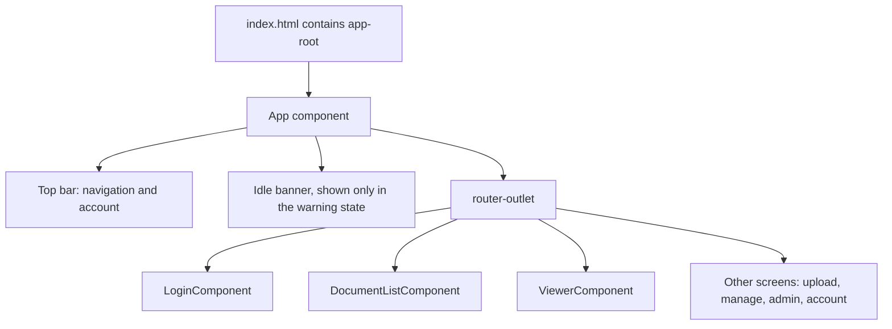
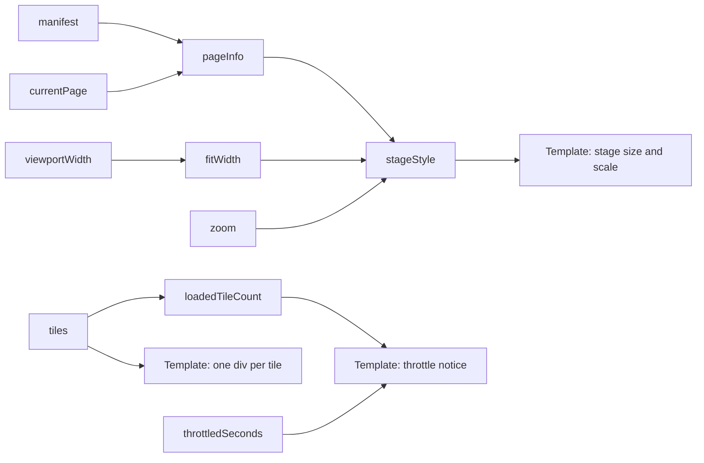

<!-- chapter: 21 | part: III | owner: writer-frontend | tag: book-m6-final | status: expanded -->
<!-- source: contrast tokens changed between book-m4-reading and book-m5-platform (git diff of styles.css); idle banner from Phase 4b (6417d49, book-m4-reading); tile-seam comment in viewer.component.css; contrast ratios computed by the author with the WCAG relative-luminance formula; listings verified with git show book-m6-final -->
# Chapter 21: Angular components and templates

Every screen of the Secure Document Viewer is an Angular component: the top bar, the sign-in form, the document list, and the page viewer. In this chapter you learn what a component is, how its template shows data and reacts to change, and how the app's stylesheet gives every screen a consistent look in light and dark themes. You will also see how the viewer paints a PDF page out of many small pieces without using an image tag, and why.

## Learning objectives

By the end of this chapter, you will be able to:

- Explain the three parts of a component (class, template, style) and read `app.ts`.
- Describe a component's life, from creation to removal, using lifecycle hooks.
- Write a template that shows a value, a condition, and a list, using `{{ }}`, `@if` and `@for`.
- Explain what a signal is, and use `signal`, `set`, `update` and `computed`.
- Read the theme tokens in `styles.css` and explain how dark mode and contrast are handled.
- Explain how the viewer paints page tiles without an `` tag.

## Prerequisites

- Chapter 19: TypeScript (classes, types, arrow functions).
- Chapter 20: Node, npm and the Angular toolchain (`ng serve`, project layout).

## Beginner tier: A screen is a small machine with three parts

### 21.1 Components: a class, a template, a style

An **Angular** component is one reusable piece of screen. Think of a name badge holder at a conference: the plastic holder is always the same, and you slide a different card in. The component is the holder; the data it displays is the card.

**Where the analogy breaks down:** a badge holder is passive, and you swap the card by hand. A component watches its data and redraws itself when the data changes.

A component has three parts: a **class** (the data and actions, in TypeScript), a **template** (the HTML that shows them; HTML is the markup language that describes the structure of a web page, such as headings, buttons and links), and a **stylesheet** (CSS, the language that sets colors, spacing and layout, that decorates them). The top-level component of the app is short enough to read whole:

**Listing 21.1 — `app.ts` (book-m6-final, excerpt: imports and decorator)**

```typescript
import { LowerCasePipe } from '@angular/common';
import { Component, OnDestroy, OnInit, signal } from '@angular/core';
import { Router, RouterLink, RouterLinkActive, RouterOutlet } from '@angular/router';
import { IdleState, idleState } from './core/idle';
import { SessionService } from './core/session.service';

@Component({
  selector: 'app-root',
  standalone: true,
  imports: [RouterOutlet, RouterLink, RouterLinkActive, LowerCasePipe],
  templateUrl: './app.html',
  styleUrl: './app.css',
})
export class App implements OnInit, OnDestroy {
  readonly idle = signal<IdleState>({ kind: 'active' });
```

*Path: `frontend/src/app/app.ts`*

Line by line:

- `@Component({ ... })` is a **decorator**: a label attached to the class below it that tells Angular "this class is a component, configured like so".
- `selector: 'app-root'` is the custom HTML tag that shows this component. `src/index.html` contains `<app-root></app-root>` (Chapter 20, Listing 20.3), and that is where the whole application appears.
- `standalone: true` means the component lists its own dependencies rather than relying on a shared module. (Angular 22 treats components as standalone by default; the project states it explicitly.)
- `imports: [...]` lists the other building blocks that this component's template uses: other components, pipes (formatters, Section 21.3), and directives (extra behavior attached to an element, such as `routerLink`, which turns an ordinary link into an in-app one). If the template uses `routerLink` but `RouterLink` isn't listed here, the compiler complains.
- `templateUrl` and `styleUrl` point to the files `app.html` and `app.css` beside it.
- `export class App implements OnInit, OnDestroy` defines the class. `OnInit` and `OnDestroy` are **lifecycle hooks**: methods (`ngOnInit`, `ngOnDestroy`) that Angular calls when the component appears and when it is removed. Section 21.2 shows what `App` does in them.
- `readonly idle = signal<IdleState>(...)` is a piece of reactive data; Section 21.5 explains it.

The app starts in `main.ts` with `bootstrapApplication(App, appConfig)`, which creates the root component and hands it the app-wide settings (Chapter 22).

Figure 21.1 shows how the pieces you have met so far nest. The page contains one tag, `<app-root>`; the root component draws the top bar, the idle banner and a `<router-outlet />`; and the outlet holds whichever screen component the current address selects (Chapter 23).



*Figure 21.1 — The component tree: from `index.html` to the current screen*

<!-- source: index.html, app.ts, app.html and app.routes.ts at book-m6-final -->

Only one of the screen components exists at a time: when the reader navigates, Angular destroys the old one and creates the new one inside the same outlet. The top bar and the idle banner belong to `App`, so they survive every navigation.

### 21.2 A component's life: creation, hooks and cleanup

A component isn't a permanent object. Angular **creates** it when it's needed (when the router visits its route, or when a parent's template contains its tag), **runs** it while it's on screen, and **destroys** it when it's removed. Lifecycle hooks let the class react at those moments. `App` uses two of them for a single job: a one-second timer that checks whether the reader has been idle.

**Listing 21.2 — `app.ts` (book-m6-final, excerpt: the timer and its cleanup)**

```typescript
export class App implements OnInit, OnDestroy {
  readonly idle = signal<IdleState>({ kind: 'active' });
  private idleTimer: ReturnType<typeof setInterval> | null = null;

  constructor(
    readonly sessionService: SessionService,
    private readonly router: Router,
  ) {}

  ngOnInit(): void {
    this.idleTimer = setInterval(() => this.checkIdle(), 1000);
  }

  ngOnDestroy(): void {
    if (this.idleTimer !== null) {
      clearInterval(this.idleTimer);
    }
  }
```

*Path: `frontend/src/app/app.ts`*

(Excerpt: the rest of the class, which holds `staySignedIn`, `formatCountdown`, `checkIdle` and `logout`, is omitted.)

- The constructor runs first, when the object is created. Its parameters are how Angular hands over the services the class needs (dependency injection, Chapter 22). Here it asks for the `SessionService` and the `Router`. `private readonly` and `readonly` in front of a parameter declare it as a field in one step; `readonly` means the field can't be reassigned, and leaving out `private` (as with `sessionService`) lets the template read it, which it does.
- `ngOnInit` runs once, after the constructor, when the component is ready. It starts a timer with `setInterval(() => this.checkIdle(), 1000)`: "every 1,000 milliseconds, call `checkIdle`". `setInterval` returns a number-like handle, which the class stores in `idleTimer` so it can be stopped later. Its type, `ReturnType<typeof setInterval> | null`, means "whatever `setInterval` returns, or `null` before it starts".
- `ngOnDestroy` runs when the component is removed. It stops the timer with `clearInterval`. Forgetting this is a classic leak: the timer would keep calling `checkIdle` on a component that no longer exists.

The same start-then-clean-up habit appears wherever a component starts something that outlives a single call: timers, subscriptions to Observables, and in the viewer, in-flight requests and temporary image addresses (Chapter 22).

### 21.3 Templates: binding, conditionals, loops

A template is HTML with extra syntax that connects it to the class. Here is the top-level template:

**Listing 21.3 — `app.html` (book-m6-final)**

```html
<header class="topbar">
  <div class="brand">Secure Doc Viewer</div>

  @if (sessionService.user(); as user) {
    <nav>
      <a routerLink="/documents" routerLinkActive="active">Documents</a>
      @if (sessionService.isAdmin()) {
        <a routerLink="/admin" routerLinkActive="active">Admin</a>
      }
    </nav>
    <div class="account">
      <a class="account-link" routerLink="/account" routerLinkActive="active">
        {{ user.username }} <span class="role-badge">{{ user.role | lowercase }}</span>
      </a>
      <button (click)="logout()">Sign out</button>
    </div>
  }
</header>

@if (idle(); as state) {
  @if (state.kind === 'warning') {
    <div class="idle-banner" role="alert">
      You'll be signed out in {{ formatCountdown(state.secondsLeft) }} because of inactivity.
      <button (click)="staySignedIn()">Stay signed in</button>
    </div>
  }
}

<main>
  <router-outlet />
</main>
```

*Path: `frontend/src/app/app.html`*

The template syntax comes in a handful of forms:

- `{{ user.username }}` is **interpolation**: it inserts the value of an expression as text. Angular escapes it, so a username containing `<script>` appears as harmless text, not code. That is a security property you get for free, as long as you use interpolation and not raw HTML insertion.
- `{{ user.role | lowercase }}` pipes the value through a **pipe**, a small formatter. `lowercase` is why the imports list has `LowerCasePipe`.
- `@if (condition) { ... }` shows its block only when the condition is true. `@if (sessionService.user(); as user)` also names the value `user` for use inside the block. The nav bar therefore exists only when someone is signed in, and the Admin link only for administrators.
- `(click)="logout()"` is an **event binding**: when the button is clicked, call the class's `logout` method.
- `routerLink="/documents"` makes a link that changes pages without reloading the browser (Chapter 23), and `routerLinkActive="active"` adds the CSS class `active` to the link when its address is the current one, which `app.css` uses to underline it. `<router-outlet />` is the spot where the current page's component appears.
- The `role="alert"` attribute tells screen readers to announce the banner when it appears (Section 21.7).

Read the idle banner as a nested question. The outer `@if (idle(); as state)` always succeeds (the signal always holds a state) and names it; the inner `@if (state.kind === 'warning')` shows the banner only in the warning state. Inside, `state.secondsLeft` is available because the check on `kind` narrows the type (Chapter 19, Section 19.3).

Two more forms appear in other templates. `@for` repeats a block for each item, and needs a `track` expression so that Angular can tell items apart when the list changes:

**Listing 21.4 — `document-list.component.html` (book-m6-final, excerpt: the card grid)**

```html
  <div class="doc-grid">
    @for (doc of filtered(); track doc.documentId) {
      <article class="doc-card">
        <a class="doc-open" [routerLink]="['/viewer', doc.documentId]">
          <h2>{{ doc.title }}</h2>
```

*Path: `frontend/src/app/features/documents/document-list.component.html`*

`track doc.documentId` says each card is identified by its document id, so when the list is filtered, Angular keeps the cards that remain instead of rebuilding all of them. And square brackets, as in `[routerLink]="[...]"`, are a **property binding**: the attribute's value is computed from an expression instead of being fixed text. The viewer uses the same form to move tiles, for example `[style.top.px]="tile.top"` (Section 21.9) and `[class.pending]="tile.status !== 'loaded'"`.

The three binding forms are worth memorizing as a table:

| Syntax | Direction | Example in the project | Meaning |
|---|---|---|---|
| `{{ expr }}` | class to page, as text | `{{ doc.title }}` | Show a value |
| `[property]="expr"` | class to page, as a property | `[disabled]="currentPage() === 0"` | Set a property from a value |
| `(event)="statement"` | page to class | `(click)="logout()"` | Run code when something happens |

### 21.4 Worked example: a small component from scratch

The best way to absorb the parts is to build one. This is a teaching example, not repository code. It counts how many times a button was clicked and shows a message once the count reaches three.

**Example 21.1 — A click counter (teaching example, not repository code)**

```typescript
import { Component, computed, signal } from '@angular/core';

@Component({
  selector: 'app-counter',
  standalone: true,
  template: `
    <button (click)="add()">Clicked {{ count() }} times</button>
    @if (enough()) {
      <p>That's plenty.</p>
    }
  `,
})
export class CounterComponent {
  readonly count = signal(0);
  readonly enough = computed(() => this.count() >= 3);

  add(): void {
    this.count.update((c) => c + 1);
  }
}
```

Walk through what happens. The template is written inline (`template:` instead of `templateUrl:`), which suits tiny components; the project's own `AccountComponent` does the same. `count` is a signal that starts at 0. `enough` is a computed signal that says whether `count` has reached three. `add` increases the count by one. When you click the button, Angular calls `add()`; that changes `count`; the template read `count()` (in the button label) and `enough()` (in the `@if`), so Angular redraws exactly those two spots. Nothing else on the page is touched. You never wrote "update the button text": you declared *what* the screen should show for a given state, and Angular does the *when*.

## Intermediate tier: Signals and how a screen stays current

*On a first read you can skip to "In this project"; Part IV comes back to this.*

### 21.5 Reactivity: signals and change detection

If the class holds `count = 0` as a plain variable and later sets it to 1, how does the screen learn about it? Angular's answer, used throughout this project, is the **signal**: a box that holds a value and remembers who has read it. You read a signal by calling it like a function (`idle()`), and change it with `set` or `update`:

*Pattern note: Signals track their dependents automatically, an observer-style pattern (Chapter 38, Section 38.7).*

```typescript
readonly zoom = signal(1);          // create, starting at 1
this.zoom.set(1.4);                 // replace the value
this.zoom.update((z) => z + 0.2);   // compute the new value from the old
```

Because templates call the signal (`{{ zoom() }}`), Angular knows that this template depends on `zoom`, and redraws just that part when it changes. Deciding what to redraw is **change detection**. A **computed** signal is a value derived from others; it is recalculated only when a signal it read has changed, and is otherwise cached. The document list uses one for its search box:

**Listing 21.5 — `document-list.component.ts` (book-m6-final, excerpt)**

```typescript
  readonly documents = signal<DocumentSummary[]>([]);
  readonly loading = signal(true);
  readonly errorMessage = signal<string | null>(null);
  readonly query = signal('');

  /** Client-side filter on title and owner; the server already returned only what this user may see. */
  readonly filtered = computed(() => {
    const q = this.query().trim().toLowerCase();
    return q
      ? this.documents().filter((d) => d.title.toLowerCase().includes(q) || d.owner.toLowerCase().includes(q))
      : this.documents();
  });
```

*Path: `frontend/src/app/features/documents/document-list.component.ts`*

Typing in the search box sets `query`, which invalidates `filtered` (marks its saved answer as out of date), which the `@for` in Listing 21.4 reads, so the grid updates. No code says "redraw the grid"; the dependencies do it. Notice `computed` is *lazy*: `filtered` isn't recalculated when `query` changes, only when something next reads it, and then the answer is cached until a dependency changes again.

The comment on `filtered` also carries a security idea worth pausing on: this is a filter over what the server already sent. The server decided which documents this reader may see; the frontend only narrows the list on screen. It never widens it.

A single component can have many signals; the viewer has more than a dozen, and one of its `computed` values does real work. It converts the page's size and the zoom level into the CSS the stage needs:

**Listing 21.6 — `viewer.component.ts` (book-m6-final, excerpt: `stageStyle`)**

```typescript
  readonly stageStyle = computed(() => {
    const info = this.pageInfo();
    if (!info) {
      return {};
    }
    const fitScale = Math.min(1, this.fitWidth() / info.pageWidthPx);
    const scale = fitScale * this.zoom();
    return {
      width: `${info.pageWidthPx}px`,
      height: `${info.pageHeightPx}px`,
      transform: `scale(${scale})`,
      'transform-origin': 'top left',
    };
  });
```

*Path: `frontend/src/app/features/viewer/viewer.component.ts`*

Read it as a small pipeline. `pageInfo()` (itself a `computed`) gives the current page's pixel size, or nothing before the document has loaded, in which case the style is empty. `fitScale` shrinks a page that is wider than the available space (`fitWidth()` is derived from the window width, capped at 900 pixels) but never enlarges it (`Math.min(1, ...)`). `scale` multiplies that by the reader's zoom. The result is the CSS to apply: the page at its natural pixel size, then scaled down or up by a transform. When the window is resized, the zoom changes or the page turns, the signals it read change, and the style recomputes automatically; no line of code says "on resize, recompute".

Figure 21.2 draws these dependencies for the viewer. Boxes on the left are signals that something changes; the middle boxes are `computed` values; the right-hand boxes are the parts of the template that read them. An arrow means "is read by".



*Figure 21.2 — How signals flow through the viewer: from changed values to the parts of the screen that redraw*

<!-- source: viewer.component.ts and viewer.component.html at book-m6-final (signals manifest, currentPage, tiles, zoom, throttledSeconds; computed pageInfo, fitWidth, stageStyle, loadedTileCount) -->

Read it as a map of consequences. If the reader zooms, only `zoom` changes, so only `stageStyle` and the template part that uses it are recalculated; the tiles and the throttle notice are untouched. If a tile finishes loading, `tiles` changes, so the per-tile `div`s and the "N of M tiles loaded" count update, but the page size doesn't. The diagram is simplified: the viewer has more signals (errors, loading state, access-lost) and a second style computed (`stageWrapperStyle`) that follows the same pattern as `stageStyle`.

The same pattern protects who-is-signed-in state. `SessionService` (Chapter 22) keeps the user in a private signal and shares it read-only:

**Listing 21.7 — `session.service.ts` (book-m6-final, excerpt: three lines from the class body, not adjacent)**

```typescript
  private readonly current = signal<CurrentUser | null>(null);
  readonly user = this.current.asReadonly();
  readonly isAdmin = computed(() => this.current()?.role === 'ADMIN');
```

*Path: `frontend/src/app/core/session.service.ts`*

Other classes can read `user()` but cannot call `set` on it; only `SessionService` can change who is signed in. That is the same principle as a private field with a public getter in Java (Chapter 4).

> **Note:** Signals also drive who-is-signed-in state across the whole app. `app.html` can write `sessionService.isAdmin()` and the nav bar updates itself on sign-in and sign-out.

### 21.6 Component inputs and outputs

Angular components normally receive data through **inputs** and report events through **outputs**. This app doesn't need them: a search of `frontend/src/app` finds none. Each screen is a routed page that gets its data from services (Chapter 22) and its parameters from the URL (Chapter 23), so the components don't pass data to one another. We simplify here; Angular's documentation covers `input()` and `output()` if you build reusable widgets later.

For orientation, this is what an input would look like (a teaching example, not repository code):

**Example 21.2 — A component with an input (teaching example, not repository code)**

```typescript
export class PageBadgeComponent {
  readonly page = input.required<number>();   // the parent must supply it
}
```

A parent would write `<app-page-badge [page]="currentPage()" />`, using the same square-bracket property binding as before. Inputs are also signals, read as `page()`. The project's shape, "screens as pages, shared state in services", is a legitimate design for a small app; the price is that a screen can grow large (the viewer is about 500 lines), and a larger team might split it into smaller child components with inputs.

### 21.7 Styling, light and dark themes, and accessibility basics

Component stylesheets are scoped: rules in `app.css` affect only the `App` component. To read them you need a few CSS ideas. A **selector** picks elements (`.topbar` picks elements with `class="topbar"`; `nav a` picks links inside a `nav`). A **declaration** sets a property (`padding: 0.85rem 1.5rem;`). Sizes in `rem` are multiples of the page's base font size, so layouts scale with a reader's font setting. **Flexbox** (`display: flex`) lays children out in a row and lets you align and space them. Here is the top bar:

**Listing 21.8 — `app.css` (book-m6-final, excerpt: the top bar)**

```css
.topbar {
  display: flex;
  align-items: center;
  gap: 1.5rem;
  padding: 0.85rem 1.5rem;
  border-bottom: 1px solid var(--border);
  background: var(--surface);
}

.brand {
  font-weight: 700;
}
```

*Path: `frontend/src/app/app.css`*

`display: flex` puts the brand, the navigation and the account area side by side; `align-items: center` centers them vertically; `gap` spaces them; `padding` and `border-bottom` frame the bar; `background: var(--surface)` uses a theme color (below).

Look-and-feel that every screen shares lives in one global file, `styles.css`, built on **CSS custom properties** (also called variables): named values, written `--name`, that any rule can read with `var(--name)`.

**Listing 21.9 — `styles.css` (book-m6-final, excerpt: the tokens)**

```css
:root {
  --bg: #f6f7f9;
  --surface: #ffffff;
  --fg: #16181d;
  /* Text colours meet WCAG AA (4.5:1) on both --bg and --surface. */
  --muted: #5d6470;
  --border: #e2e4e9;
  --accent: #2458d6;
  /* Text on an --accent background. */
  --on-accent: #ffffff;
  --danger: #c1272f;
}

@media (prefers-color-scheme: dark) {
  :root {
    --bg: #101114;
    --surface: #191b1f;
    --fg: #eceef1;
    --muted: #9aa0aa;
    --border: #2a2d33;
    --accent: #5b8dfd;
    --on-accent: #0b1020;
    --danger: #f0787e;
  }
}
```

*Path: `frontend/src/styles.css`*

`:root` selects the whole page, so these values are available everywhere. Components never write a color; they write `var(--surface)` or `var(--border)` (see `app.css`). The `@media (prefers-color-scheme: dark)` block applies only when the reader's operating system is set to dark mode, and redefines the same names, so one block swaps the whole theme. There is no switch in the app: it follows the system.

The naming is by *role*, not by color: `--surface` is "what cards and bars are painted on", not "white". That's why the dark block can give `--surface` a near-black value without any component changing. It is also why there is a separate `--on-accent`: "the color of text sitting on the accent color", which is white in light mode and near-black in dark mode, because the accent itself is a lighter blue in dark mode.

**Contrast** is the difference in brightness between text and its background, measured as a ratio. The Web Content Accessibility Guidelines (WCAG) level AA asks for a ratio of at least 4.5:1 for normal text, so people with low vision or a dim screen can read it. Table 21.1 lists the ratios of the project's main text pairings, computed with the WCAG formula.

| Pairing | Light theme | Dark theme |
|---|---|---|
| Body text `--fg` on `--bg` | 16.6 : 1 | 16.2 : 1 |
| `--muted` on `--surface` | 6.0 : 1 | 6.6 : 1 |
| `--muted` on `--bg` | 5.6 : 1 | 7.2 : 1 |
| `--on-accent` on `--accent` (buttons) | 6.1 : 1 | 6.0 : 1 |
| `--danger` on `--surface` (error text) | 5.8 : 1 | 6.3 : 1 |

*Table 21.1 — Contrast ratios (computed by the author from the token values in Listing 21.9; the automated check in Chapter 24 is the project's own guard)*

Two things show why tokens matter. First, at `book-m5-platform` the `--muted` color in light mode was changed from `#6b7280` to `#5d6470`: the old value scored 4.8 : 1 on white and only 4.5 : 1 on the page background, right at the limit, and the new one has real margin. Second, the button text color changed from a hard-coded white to `var(--on-accent)`. With white text on the dark theme's lighter accent, the ratio would be only about 3.2 : 1, below the AA threshold; `--on-accent` fixes that by using dark text there. The git diff of `styles.css` between `book-m4-reading` and `book-m5-platform` shows both changes. Because colors live in one place, each fix was a small edit, and Chapter 24 shows the automated check that keeps this true in both themes.

Accessibility basics visible in the templates: form fields are paired with `<label for="...">`; the search box has `aria-label="Search documents"`; error text uses `role="alert"` and status messages `role="status"`, so screen readers announce them; buttons are real `<button>` elements, so they work with the keyboard for free; and the top-bar links use real `<a>` elements with meaningful text.

## Advanced tier: How the viewer paints a page

*On a first read you can skip to "In this project"; Part IV comes back to this.*

### 21.8 Tiles, briefly

A PDF page is cut into rectangular **tiles** on the server (Part II), each a small image, so no single request carries the whole page and each can carry its own watermark. The frontend's job is to put the tiles back together on screen. It asks for a *grid* of signed tile addresses (Chapter 22), downloads each tile, and places it at the right position. Chapter 25 tells the story of the first prototype; here we look at how the Angular viewer does the placing.

### 21.9 CSS backgrounds instead of images or a canvas

The Angular viewer places each tile as an absolutely positioned `<div>` whose CSS background is the tile's picture:

**Listing 21.10 — `viewer.component.html` (book-m6-final, excerpt: the tiles)**

```html
      @for (tile of tiles(); track tile.key) {
        <div
          class="tile"
          [class.pending]="tile.status !== 'loaded'"
          [style.top.px]="tile.top"
          [style.left.px]="tile.left"
          [style.width.px]="tile.width + 1"
          [style.height.px]="tile.height + 1"
          [style.background-image]="tile.src ? 'url(' + tile.src + ')' : null"
        ></div>
      }
```

*Path: `frontend/src/app/features/viewer/viewer.component.html`*

`tile.src` is a temporary `blob:` address the viewer creates for the bytes it fetched (Chapter 22). Each `div` is one tile, positioned by `top` and `left` in page pixels. Note the bindings: `[style.top.px]="tile.top"` sets the CSS `top` property and adds the unit `px` for you; `[class.pending]="..."` turns the `pending` class on or off; `track tile.key` identifies each tile by its row and column (`"row-col"`), so when a tile's status changes from pending to loaded, Angular updates that one `div` and leaves the others alone. The milestone-zero prototype drew the page on a `<canvas>` element (`book-m0-mvp`'s static page; Chapter 25); the Angular viewer, from its first appearance at `book-m1-accounts`, uses divs. A canvas is a rectangle you draw pixels onto with code; a `div` with a background is an ordinary page element the browser lays out. The second is simpler to position, scale and make responsive, and lets each tile appear the moment it arrives.

The stylesheet's comment states the design intent:

**Listing 21.11 — `viewer.component.css` (book-m6-final, excerpt)**

```css
/*
 * Deliberately no  tags: page content is painted as CSS
 * background-image on plain divs, and every layer disables selection and
 * native drag. This is the exact client-side technique discussed for
 * why flipbook readers don't offer "Save Image As" on right-click. It is
 * a UX nicety, not real protection — real protection is the short-lived
 * signed URL, per-request watermark, and rate limit behind each tile.
 */
.stage {
  position: relative;
  background: #fff;
  user-select: none;
  -webkit-user-select: none;
  -webkit-user-drag: none;
}
```

*Path: `frontend/src/app/features/viewer/viewer.component.css`*

Read it honestly: this stops a casual right-click "Save image as" and drag-out of an image, nothing more. Anyone can still open the browser's developer tools, and a screenshot needs no tools at all. The protection that matters is on the server: short-lived signed URLs, a per-viewer watermark, and a rate limit (Chapters 16 and 17). The viewer also swallows the context menu (`blockContextMenu`), and its own comment says the same thing: cosmetic only, and the design stays secure with that handler removed.

### 21.10 A rendering detail: the one-pixel overlap

A second detail from the same file shows how small rendering bugs are solved. The stage is scaled by a fractional amount for zoom (`scale(0.83)`, say), and that fractional scaling left hairline gaps between neighboring tiles, clearly visible over dark page content (the stylesheet's own comment describes the problem; the usual cause is that each scaled edge lands between two screen pixels and is anti-aliased separately). The template makes each tile one pixel wider and taller than its slice (`tile.width + 1`, `tile.height + 1`), so neighbors overlap by a pixel and the seams disappear; the comment above `.tile` explains why. The trade-off is that the last row and column of a tile are drawn twice, which is invisible because they show the same image, and the tile's stretched background (`background-size: 100% 100%`) absorbs the extra pixel.

### 21.11 Blending colors: the idle banner

One more line from `app.css` shows a modern CSS tool the theme makes possible. The idle warning banner is tinted with the accent color:

```css
.idle-banner {
  background: color-mix(in srgb, var(--accent) 15%, var(--surface));
}
```

*Excerpt: `.idle-banner` in `frontend/src/app/app.css` (book-m6-final); other declarations omitted.*

`color-mix` blends two colors: 15 percent accent, 85 percent surface. Because both come from tokens, the banner gets a suitable tint in light and dark themes without a separate dark-mode rule. The design principle: express colors in terms of tokens, and derived colors follow the theme automatically.

## Common mistakes

- **Forgetting to import what the template uses.** Using `routerLink`, a pipe, or another component's tag without listing it in the component's `imports` produces a compile error. Add it to `imports`.
- **Forgetting the parentheses on a signal.** `{{ count }}` shows the signal object, not its value; write `{{ count() }}`. In code, `this.count = 5` doesn't set a signal; call `this.count.set(5)`.
- **Changing an object inside a signal without setting it.** If a signal holds an array or object, mutating it in place (`this.tiles().push(x)`) doesn't notify anyone. Create a new one and set or update it, as the viewer does with `this.tiles.update((tiles) => tiles.map(...))`.
- **A `@for` without a good `track`.** Tracking by position makes Angular rebuild items when a list changes; track by a stable id.
- **Hard-coding colors in component CSS.** A stray `#fff` won't follow the dark theme. Use a token. (The viewer's page stage uses real `#fff` deliberately, because it stands for white paper.)
- **Forgetting to clean up.** Timers and subscriptions started in `ngOnInit` should be stopped in `ngOnDestroy`.
- **Using color alone to convey meaning.** The project pairs color with words and roles (`role="alert"`, a text label like "Failed"), so people who can't tell the colors apart still get the message.
- **Relying on the right-click block for protection.** Section 21.9 explains why it isn't protection.

## In this project

| File | First appears | What it does |
|---|---|---|
| `frontend/src/app/app.ts`, `app.html`, `app.css` | book-m1-accounts (idle banner from book-m4-reading) | Root component: top bar, idle banner, router outlet |
| `frontend/src/styles.css` | book-m1-accounts (contrast tokens at book-m5-platform) | Global theme tokens, dark mode, buttons |
| `frontend/src/app/features/documents/document-list.component.*` | book-m2-documents | Signals, `computed` filter, `@for` |
| `frontend/src/app/features/viewer/viewer.component.*` | book-m1-accounts | Tiles as divs with CSS backgrounds |

View one with `git show book-m6-final:frontend/src/styles.css`.

## Try it

### Exercise 21.1 ★ The Admin link

In `app.html`, which condition decides whether the Admin link appears? Which class property does it read?

*Solution:* Appendix C, Exercise 21.1.

### Exercise 21.2 ★ Changing the accent

Change the accent color in a scratch copy of `styles.css` and reload `ng serve`. Which screens change?

*Solution:* Appendix C, Exercise 21.2.

### Exercise 21.3 ★★ A toggled hint

Add a signal `showHint` to a scratch component with a button that toggles it (`update((v) => !v)`) and an `@if` that shows a paragraph.

*Solution:* Appendix C, Exercise 21.3.

### Exercise 21.4 ★★ Check the contrast

Use a contrast checker to compute the ratio of `--muted` on `--surface` in both themes. Compare your numbers with Table 21.1.

*Solution:* Appendix C, Exercise 21.4.

### Exercise 21.5 ★★★ Why track by id

Explain why `track doc.documentId` is better than tracking by position when the list is filtered.

*Solution:* Appendix C, Exercise 21.5.

### Exercise 21.6 ★★ Extend the counter

Extend Example 21.1 so that the button label shows "Clicked once" for a count of one and "Clicked N times" otherwise, using a `computed` signal for the label. Then add a reset button.

*Solution:* Appendix C, Exercise 21.6.


## Summary

- A component is a class, a template and a stylesheet, shown through its selector, and it has a life: the constructor, `ngOnInit`, and `ngOnDestroy` for cleanup.
- Templates show values with `{{ }}`, decide with `@if`, repeat with `@for`, and respond with `(event)` bindings; `[property]` bindings set values from the class.
- Signals hold values, `computed` derives new ones, and Angular redraws only what read a changed signal; `asReadonly` lets a service share state without sharing the power to change it.
- The app has no component inputs or outputs; screens get data from services and the URL.
- Theme colors are CSS custom properties named by role, redefined under `prefers-color-scheme: dark`; contrast fixes are made in the tokens.
- Tiles are positioned divs with CSS backgrounds, a convenience layer, not protection; a one-pixel overlap hides seams from fractional scaling.

Next, Chapter 22 connects these screens to the backend.

## Further reading

- Angular documentation, "Components", "Templates" and "Signals": https://angular.dev/
- MDN Web Docs, "Using CSS custom properties" and "prefers-color-scheme": https://developer.mozilla.org/
- W3C, "Web Content Accessibility Guidelines (WCAG) 2.1": https://www.w3.org/TR/WCAG21/
