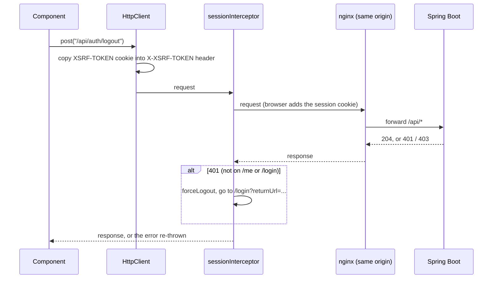

<!-- chapter: 22 | part: III | owner: writer-frontend | tag: book-m6-final | status: expanded -->
# Chapter 22: Talking to the backend

A screen with no data is a mockup. In this chapter you follow a request from a button click in the browser, through Angular's `HttpClient`, across the same-origin proxy, to Spring Boot and back. You also see how the frontend copes when the backend says no: expired sessions, rate limits, and documents replaced while someone is reading them.

## Learning objectives

By the end of this chapter, you will be able to:

- Explain what a service is and how Angular's dependency injection provides one to a component.
- Write a typed `HttpClient` call for a GET, a POST, and a file upload, and read the ones in `documents.service.ts`.
- Explain how the Cross-Site Request Forgery (CSRF) cookie becomes a request header, and where the session cookie is handled.
- Read `session.interceptor.ts` and say what happens on a 401.
- Explain how the viewer reacts to 429, 401, 404, and 410 responses when fetching tiles.
- Explain the idle warning and why background polling must not keep a session alive.
- Read an RxJS pipeline that uses `debounceTime`, `switchMap` and `catchError`, and say why each operator is placed where it is.
- Explain what the Content-Security-Policy header allows and how it constrains the frontend.

## Prerequisites

- Chapter 8: HTTP requests, status codes, cookies.
- Chapter 12: the REST (representational state transfer) endpoints this chapter calls.
- Chapter 16: CSRF protection and rate limiting on the server.
- Chapters 19–21: TypeScript, Observables, components, and signals.

## Beginner tier: A service is a shared helper

### 22.1 Services and dependency injection in Angular

Several screens need the same things: to know who is signed in, to fetch documents. Copying that code into each component would be wasteful and error-prone. Instead the code goes into a service: a plain class, marked `@Injectable`, that Angular creates once and hands to whoever asks. Think of a shared office printer: nobody buys their own, and everyone who needs one is pointed to the same machine.

**Where the analogy breaks down:** a printer sits in the office whether or not anyone prints. Angular creates a service only when something first asks for it.

Asking is called dependency injection, the same idea as Spring's (Chapter 11): a class declares what it needs, and the framework supplies it. Here, in the constructor:

**Listing 22.1 — `documents.service.ts` (book-m6-final, excerpt)**

```typescript
@Injectable({ providedIn: 'root' })
export class DocumentsService {
  private readonly base = `${API_BASE_URL}/api/documents`;

  constructor(private readonly http: HttpClient) {}

  list(): Observable<DocumentSummary[]> {
    return this.http.get<DocumentSummary[]>(this.base);
  }

  get(documentId: string): Observable<DocumentDetail> {
    return this.http.get<DocumentDetail>(`${this.base}/${encodeURIComponent(documentId)}`);
  }
```

*Path: `frontend/src/app/features/documents/documents.service.ts`*

- `providedIn: 'root'` means one shared instance for the whole app.
- `constructor(private readonly http: HttpClient) {}` asks Angular for an `HttpClient`. The words `private readonly` in front of the parameter are TypeScript shorthand that also create a field named `http`. This is constructor injection, as in Chapter 11.
- `list()` returns `Observable<DocumentSummary[]>` (Chapter 19): a stand-in for a list of summaries that will arrive later. Nothing is sent until someone calls `.subscribe(...)`.
- `encodeURIComponent(documentId)` makes the id safe to put in a URL path, so a strange character can't change which endpoint is called.

The `API_BASE_URL` constant (`core/config.ts`) is the empty string, so the resulting address is the relative URL `/api/documents`. Section 22.12 explains why that matters.

A component then calls the service and shows the outcome:

**Listing 22.2 — `document-list.component.ts` (book-m6-final, excerpt: method `refresh`)**

```typescript
  refresh(): void {
    this.loading.set(true);
    this.documentsService.list().subscribe({
      next: (docs) => {
        this.documents.set(docs);
        this.loading.set(false);
      },
      error: () => {
        this.errorMessage.set('Could not load documents.');
        this.loading.set(false);
      },
    });
  }
```

*Path: `frontend/src/app/features/documents/document-list.component.ts`*

The `subscribe` call takes an object with two functions: `next` runs when data arrives, `error` when the request fails. Each updates signals (Chapter 21), and the template's `@if (loading()) ... @else if (errorMessage()) ... @else if (documents().length === 0) ...` chain in `document-list.component.html` shows one of four states: loading, error, empty, or the list. Deciding all four up front, rather than only the happy path, is what makes a screen feel finished.

### 22.2 `HttpClient`: GET, POST, uploads

`HttpClient` is Angular's built-in tool for HTTP. Each method matches an HTTP verb: `get`, `post`, `put`, `patch`, `delete`. The type in angle brackets is the shape you expect back (with the caveat from Chapter 19, Section 19.9: it is a promise, not a check). Sending data means passing a body, which `HttpClient` turns into JSON:

**Listing 22.3 — `session.service.ts` (book-m6-final, excerpt: method `login`)**

```typescript
  login(username: string, password: string): Observable<CurrentUser> {
    return this.http
      .post<CurrentUser>(`${API_BASE_URL}/api/auth/login`, { username, password })
      .pipe(tap((user) => this.current.set(user)));
  }
```

*Path: `frontend/src/app/core/session.service.ts`*

`.pipe(...)` adds steps that run on the result. `tap` performs a side effect without changing the value: here it stores the signed-in user in a signal, so the whole app (the nav bar, the guards) sees the new state at once. Note what is missing: no token is stored, and no `Authorization` header is set. The backend's session cookie is `HttpOnly`, meaning JavaScript can't read it; the browser attaches it automatically (Chapter 15).

Uploads use the browser's `FormData` and ask for progress events:

**Listing 22.4 — `documents.service.ts` (book-m6-final, excerpt: method `upload`)**

```typescript
  upload(title: string, file: File, visibility: Visibility): Observable<HttpEvent<DocumentDetail>> {
    const formData = new FormData();
    formData.append('title', title);
    formData.append('visibility', visibility);
    formData.append('file', file);
    return this.http.post<DocumentDetail>(this.base, formData, { reportProgress: true, observe: 'events' });
  }
```

*Path: `frontend/src/app/features/documents/documents.service.ts`*

`observe: 'events'` makes the Observable emit a series of events (progress reports, then the final response) instead of only the final body. `upload.component.ts` reads `HttpEventType.UploadProgress` to fill a progress bar, and treats "all bytes sent" as the point where the server starts rendering pages.

### 22.3 Observables in five minutes

Every `HttpClient` method returns an **Observable** (Chapter 19), and this chapter reads better with a few habits in mind.

*Pattern note: Observables are the observer pattern in stream form (Chapter 38, Section 38.7).*

- **Nothing happens until you subscribe.** `this.http.get(...)` only *describes* a request. The request is sent when someone calls `.subscribe(...)`. Two subscriptions send two requests.
- **An HTTP Observable delivers one result and ends.** Unlike a stream of key presses, a request produces a single response (or an error) and completes, so a component doesn't have to unsubscribe from it to avoid leaks. Long-lived Observables, such as a timer, are different; those need cleanup (Chapter 21).
- **`.pipe(...)` adds steps.** The steps are small functions called operators. The project uses a handful. `map` changes each value. `tap` does something on the side, such as storing a result, without changing it. `catchError` turns a failure into something else. `switchMap` starts a new Observable for each incoming value and cancels the previous one. `debounceTime` waits until values stop arriving.
- **`subscribe({ next, error })` is where the component reacts.** `next` runs for each value, `error` for a failure.

A useful mental picture is a pipeline of pipes: the request flows in at one end, each operator does its small job, and the component's `next` function is the tap at the other end.

### 22.4 Worked example: what happens when the document list loads

Follow one request from the code you have seen to the pixels, so that every piece has a place.

1. The reader visits `/documents`. The router (Chapter 23) creates `DocumentListComponent`, whose `ngOnInit` calls `refresh()` (Listing 22.2).
2. `refresh()` sets `loading` to true, so the template shows "Loading…", then calls `this.documentsService.list()`.
3. `list()` calls `this.http.get<DocumentSummary[]>('/api/documents')`. That returns an Observable; nothing has been sent yet.
4. `.subscribe(...)` in `refresh()` starts the request. `HttpClient` builds a `GET` request. Because it is a read, it doesn't need the CSRF header. It passes through the interceptor (Section 22.5), which adds nothing on the way out.
5. The browser sends the request to its own origin, with the session cookie attached automatically. In development the dev server forwards it to Spring Boot (Chapter 20); in production nginx does (Section 22.12).
6. Spring Boot checks the session, finds the documents this reader may see, and answers with JSON (Part II).
7. The response passes back through the interceptor's `tap` step, which records the activity for the idle timer (Section 22.8).
8. The Observable emits the parsed list to `next`; the component stores it with `this.documents.set(docs)` and sets `loading` to false.
9. The template reads those signals (Chapter 21), so Angular redraws: "Loading…" goes away, and the `@for` draws one card per document.

If step 6 answers with an error instead, the `error` callback runs, the component sets `errorMessage`, and the template shows the error state. If it answers with a 401, the interceptor also signs the reader out and redirects to sign-in, and only then does the component's `error` callback run.

## Intermediate tier: Cookies, CSRF, and an interceptor

*On a first read you can skip to "In this project"; Part IV comes back to this.*

### 22.5 Interceptors: CSRF header and 401 handling

Cross-Site Request Forgery (CSRF, Chapter 16) is an attack in which another website tricks your browser into sending a request to the app, and the browser helpfully attaches your session cookie. The server's defense is to require a secret that only pages from the app itself can supply. The pattern used here: the server sets a cookie named `XSRF-TOKEN` that JavaScript is allowed to read, and the frontend copies its value into a header, `X-XSRF-TOKEN`, on every state-changing request. A foreign site can't read the app's cookie, so it can't set the header.

*Pattern note: An interceptor is a chain of responsibility with one link (Chapter 38, Section 38.3).*

Angular's `HttpClient` does this copying by default for same-origin requests. `app.config.ts` says so in a comment:

**Listing 22.5 — `app.config.ts` (book-m6-final)**

```typescript
export const appConfig: ApplicationConfig = {
  providers: [
    provideBrowserGlobalErrorListeners(),
    provideRouter(routes),
    // HttpClient's built-in XSRF support is on by default: it copies the
    // XSRF-TOKEN cookie into the X-XSRF-TOKEN header on same-origin writes,
    // which is exactly what the backend's CSRF protection expects.
    provideHttpClient(withInterceptors([sessionInterceptor])),
    // Resolve "who am I" before the first route guard runs.
    provideAppInitializer(() => inject(SessionService).restore()),
  ],
};
```

*Path: `frontend/src/app/app.config.ts`*

There is no CSRF code to write in the app, which is the point: the project relies on the framework's default. The last provider runs `SessionService.restore()` before the first page is shown. It calls `/api/auth/me` to ask the server who is signed in (so a reload keeps you signed in), and its comment in `session.service.ts` notes that this call also primes the CSRF cookie.

Figure 22.1 shows the conversation for a state-changing request, such as signing out.



*Figure 22.1 — A write request from the browser to the API*

*Text description:* A sequence diagram with five participants: the component, HttpClient, the session interceptor, nginx, and Spring Boot. The component posts a request, HttpClient copies the anti-forgery cookie into a request header, and the request passes through the interceptor and nginx to Spring Boot. The response comes back the same way. If the status is 401 on any address except the sign-in and who-am-I endpoints, the interceptor signs the reader out locally and redirects to the sign-in page. Otherwise the response, or the error, goes back to the component.

<!-- source: app.config.ts, session.interceptor.ts and nginx.conf at book-m6-final; XSRF handling is Angular's built-in default -->

An **interceptor** is a function that sees every request and response that passes through `HttpClient`. `sessionInterceptor` handles the case where the session has ended:

**Listing 22.6 — `session.interceptor.ts` (book-m6-final, excerpt: the `catchError` step)**

```typescript
    catchError((error: unknown) => {
      const isAuthProbe = AUTH_PROBES.some((path) => req.url.endsWith(path));
      if (error instanceof HttpErrorResponse && error.status === 403 && error.error?.passwordChangeRequired) {
        router.navigate(['/account'], { queryParams: { required: 1 } });
      }
      if (!isAuthProbe && error instanceof HttpErrorResponse && error.status === 401) {
        sessionService.forceLogout();
        // Same returnUrl contract as authGuard, so signing back in lands
        // where the user was rather than on the documents list.
        const returnUrl = router.url.startsWith('/login') ? undefined : router.url;
        router.navigate(['/login'], { queryParams: returnUrl ? { returnUrl } : {} });
      }
      return throwError(() => error);
    }),
```

*Path: `frontend/src/app/core/session.interceptor.ts`*

- A **401** means "not authenticated." Whatever request received it, the session is gone (timed out, ended elsewhere, or revoked by an administrator), so the interceptor clears local state and sends the reader to the sign-in page, remembering where they were in `returnUrl`.
- The exception is `/api/auth/me` and `/api/auth/login` (the `AUTH_PROBES`): a 401 there means "not signed in" or "wrong password," and redirecting would loop.
- A **403** with `passwordChangeRequired` sends a user whose password was set by an administrator to the account page (Chapter 23).
- `throwError(() => error)` passes the failure on, so the calling component's own `error:` handler still runs.

The interceptor also has a `tap` step, added at `book-m4-reading`, that calls `sessionService.touch()` on every successful response to record activity for the idle warning (Section 22.8).

### 22.6 Loading, error, and empty states

Every screen that loads data has four states, and the project treats each as a design decision, not an afterthought. *Loading* shows "Loading…". *Error* is a sentence saying what failed, in `role="alert"` so screen readers announce it. *Empty* says "No documents yet," with different advice for people who can upload. *Content* is the list itself. Error messages from the server are shown when they exist (`err.error?.error`), falling back to a generic sentence; the backend's error contract (Chapter 13) guarantees they carry no internals.

### 22.7 Handling 429 with `Retry-After`, and 410 Gone

Tiles are not fetched with `HttpClient`. The reason is in a comment in `viewer.component.ts`: only the browser's `fetch()` exposes each response's status, and a throttled or expired tile is otherwise indistinguishable from a blank one, so the page would silently render with holes. Each tile URL is a signed, short-lived address (Chapter 25). The viewer runs six fetches at a time (`MAX_CONCURRENT_TILE_FETCHES`), because a page change would otherwise leave dozens of now-irrelevant requests in flight, each still spending the reader's rate-limit budget.

**Listing 22.7 — `viewer.component.ts` (book-m6-final, excerpt: how one tile response is handled)**

```typescript
        if (response.ok) {
          this.sessionService.touch();
          const blob = await response.blob();
          if (generation !== this.loadGeneration) {
            return;
          }
          this.updateTile(tile.key, { status: 'loaded', src: URL.createObjectURL(blob) });
        } else if (response.status === 429 || response.status === 503) {
          // Over this reader's limit, or the server is briefly busy: wait and resume.
          outcome.retryAfterSeconds = parseRetryAfter(response.headers.get('Retry-After'));
        } else if (response.status === 401) {
          outcome.unauthorized = true;
        } else if (response.status === 404) {
          // Unshared or deleted while open: access is re-checked on every tile.
          outcome.accessRevoked = true;
        } else if (response.status === 410) {
          // The PDF was replaced while open: these URLs point at the old render.
          outcome.replaced = true;
        } else {
          this.updateTile(tile.key, { status: 'failed' });
        }
```

*Path: `frontend/src/app/features/viewer/viewer.component.ts`*

Each status has its own meaning and its own recovery:

- **200:** the response body is a PNG. `URL.createObjectURL(blob)` makes a temporary `blob:` address the tile's CSS background can use (Chapter 21).
- **429 or 503:** too many requests, or the server is briefly busy. The `Retry-After` header says how many seconds to wait. The viewer stops issuing further requests (they would be rejected too), shows "Viewing speed limit reached: N of M tiles loaded. The rest of this page will load in Ns" and counts down each second. When the countdown ends it asks for a *fresh* grid of signed URLs, because waiting can outlast the old URLs' lifetime. If `Retry-After` is missing or unusable, it waits 5 seconds (`FALLBACK_RETRY_AFTER_SECONDS`).
- **401:** a tile URL expired before the worker reached it, or the session is gone. The viewer re-issues the grid once (`allowUrlReissue`); if the session really is gone, that request fails with 401 and the interceptor signs the user out.
- **404:** the document was unshared or deleted while open (access is re-checked on every tile), so the viewer shows a "no longer available to you" state.
- **410 Gone:** the owner replaced the PDF; these URLs point at the old rendering. The viewer reloads the document description and shows a notice, "This document was updated while you were reading." It passes the stale version number so that if the reload finds the same version, it stops with an error instead of looping forever (a case the spec `viewer.component.spec.ts` covers).

### 22.8 Session state and idle warnings

The server ends a session after a period without requests. Readers reading quietly would be surprised by that, so the app warns them. `core/idle.ts` (Chapter 19) is pure arithmetic: from the current time, the time of the last request, and the server's timeout (delivered as `sessionTimeoutSeconds` in the sign-in response), it returns `active`, `warning` with the seconds left, or `expired`. The warning window is the last five minutes, or half the timeout if that is shorter (`idle.spec.ts` has the cases). `App` checks once a second and shows the banner from Listing 21.3; "Stay signed in" calls `/api/auth/me`, and any request extends the server's session.

Two details keep this honest. First, the last-activity time is written to `localStorage` under `sdv.lastActivity` and read back when another tab writes it, so activity in one tab stops another tab from warning wrongly; if storage is unavailable, each tab tracks its own activity. Second, every successful API call (including tile fetches, via `touch()`) counts as activity, matching what the server does.

### 22.9 Asking "who am I?" at startup, and sharing activity between tabs

Two methods in `session.service.ts` carry most of the session logic. The first runs once, at startup:

**Listing 22.8 — `session.service.ts` (book-m6-final, excerpt: method `restore`)**

```typescript
  restore(): Promise<void> {
    return firstValueFrom(
      this.http.get<CurrentUser>(`${API_BASE_URL}/api/auth/me`).pipe(
        tap((user) => this.current.set(user)),
        map(() => undefined),
        catchError(() => {
          this.current.set(null);
          return of(undefined);
        }),
      ),
    );
  }
```

*Path: `frontend/src/app/core/session.service.ts`*

Read the pipeline from the inside out. `http.get` asks the server who the cookie belongs to. `tap` stores the answer in the signal. `map(() => undefined)` discards the user, because the caller only needs to know the check has finished. `catchError` handles the failure case. If the server says "nobody" (a 401 for a signed-out visitor), the service records "nobody signed in" and continues with a normal completion. A signed-out visitor therefore sees the sign-in page and not a startup crash. `firstValueFrom` turns the whole thing into a Promise, because Angular's `provideAppInitializer` (Listing 22.5) waits for a promise before it lets the first route run. Note also that `/api/auth/me` is one of the two "auth probe" addresses the interceptor ignores (Listing 22.6): its 401 is an expected answer, not an ended session.

The second piece is the idle bookkeeping:

**Listing 22.9 — `session.service.ts` (book-m6-final, excerpt: the storage listener and `touch`)**

```typescript
  constructor(private readonly http: HttpClient) {
    window.addEventListener('storage', (event) => {
      if (event.key === LAST_ACTIVITY_KEY && event.newValue) {
        this.activity.set(Math.max(this.activity(), Number(event.newValue)));
      }
    });
  }

  /** Called after every successful API request; the server has just extended the session. */
  touch(): void {
    const now = Date.now();
    this.activity.set(now);
    try {
      localStorage.setItem(LAST_ACTIVITY_KEY, String(now));
    } catch {
      // Other tabs just won't hear about it; this tab still tracks its own activity.
    }
  }
```

*Path: `frontend/src/app/core/session.service.ts`*

`touch()` records "the server was reached a moment ago" in two places: the signal (for this tab) and `localStorage` (for other tabs). Browsers fire a `storage` event in *other* tabs of the same site when one writes to `localStorage`, and the constructor's listener uses it to update that tab's signal, keeping the later of the two times (`Math.max`). The result: if you read in one tab while another sits idle, the idle tab won't pop up a "you'll be signed out" banner that would be wrong. The stored value is only a timestamp, and the code comment says it is not sensitive. Failing to write (private mode, blocked storage) is caught and tolerated.

### 22.10 Search as you type: debouncing and `switchMap`

When an owner shares a document, the manage screen suggests usernames as they type. Sending a request on every keystroke would waste effort and, worse, answers could arrive out of order. The component solves both with an Observable pipeline:

*Pattern note: Debouncing with `switchMap` is the observer idea in practice (Chapter 38, Section 38.7).*

**Listing 22.10 — `manage.component.ts` (book-m6-final, excerpt: the suggestion pipeline)**

```typescript
    this.userQuerySub = this.userQuery
      .pipe(
        debounceTime(200),
        distinctUntilChanged(),
        // The server returns nothing under two characters; don't even ask.
        switchMap((q) => (q.trim().length >= 2 ? this.documentsService.findUsers(q).pipe(catchError(() => of([]))) : of([]))),
      )
      .subscribe((names) => {
        const shared = new Set(this.document()?.sharedWith ?? []);
        this.suggestions.set(names.filter((n) => n !== this.document()?.owner && !shared.has(n)));
      });
```

*Path: `frontend/src/app/features/documents/manage.component.ts`*

`userQuery` is a `Subject`, an Observable you can push values into by hand; the input's handler calls `this.userQuery.next(value)` on each keystroke (`onShareInput`). The operators then do four jobs:

- `debounceTime(200)` waits until 200 milliseconds pass without a new value, so fast typing produces one search, not one per letter.
- `distinctUntilChanged()` ignores a value identical to the previous one.
- `switchMap(...)` starts a request for the latest value and **cancels** the previous one if it's still running, so a slow answer for "al" can never overwrite a fast answer for "alice." Short queries skip the request entirely, mirroring the server's rule, by returning `of([])`, an Observable that immediately emits an empty list.
- `catchError(() => of([]))` sits *inside* the `switchMap`, on the request only. That placement matters: an error caught on the outer pipeline would end the whole stream and suggestions would stop working forever after one failure. Caught on the inner request, one failed search yields an empty list and the stream lives on. The same care appears in the admin dashboard's polling, whose comment says "One failed refresh must not end the polling for good."

The final `subscribe` filters the suggestions to hide the owner and anyone the document is already shared with, using a `Set` for fast lookups. The service method underneath builds the query safely: `this.http.get<string[]>(`${API_BASE_URL}/api/users`, { params: new HttpParams().set('q', prefix) })`. `HttpParams` encodes the value, so a prefix containing `&` or `#` can't alter the address.

### 22.11 Why cookies and not tokens in web storage

The obvious alternative to what this chapter shows is the pattern many tutorials teach: after sign-in the server returns a token, the frontend saves it in `localStorage`, and an interceptor adds an `Authorization` header to every request. It has real advantages: it works across different origins with no cookie rules, and it suits mobile apps and APIs used by other programs. The project chose otherwise, and the comment on `SessionService` states why: "The credential itself is an httpOnly cookie the browser manages — nothing secret is held here or in web storage." An `HttpOnly` cookie can't be read by JavaScript, so a script injected through some bug in the page (a cross-site scripting attack) can't steal it. A token in `localStorage` can be read by any script on the page. The trade-off is that cookies are sent automatically, which is what makes CSRF possible and why the CSRF header (Section 22.5) is needed, and why the app must live on one origin. Neither approach is free; the project accepted the second set of costs in exchange for the first set of protections, and its content security policy (Section 22.12) adds a further barrier against injected scripts.

## Advanced tier: One origin, and quiet polling

*On a first read you can skip to "In this project"; Part IV comes back to this.*

### 22.12 Why one origin: nginx and the proxy

Chapter 20 showed the development proxy. In production, `frontend/nginx.conf` does the same job with more care. The comment at its top says the design goal: "Serves the Angular app and proxies the API, so browser, session cookie and CSRF cookie all share one origin." With one origin there is no cross-origin resource sharing (CORS) setup to get wrong, no cookie policies to loosen, and the relative URLs in the frontend work unchanged.

*Pattern note: One origin behind a proxy is the client-server single-page-app pattern (Chapter 39, Section 39.4).*

**Listing 22.11 — `nginx.conf` (book-m6-final, excerpt: the API location)**

```text
    # ^~ so no regex location (e.g. the static-asset rule below) can capture an API path.
    location ^~ /api/ {
        proxy_pass http://app:8080;
        proxy_set_header Host $host;
        # OVERWRITE (never append to) X-Forwarded-For with the address of the TCP
        # peer. The backend trusts this header (server.forward-headers-strategy),
        # so passing through a client-supplied value would let anyone choose the
        # IP that login throttling and the audit log see.
        proxy_set_header X-Forwarded-For $remote_addr;
```

*Path: `frontend/nginx.conf`*

The comment records a real security fix (fix commit `65f2530`, pull request 1). During a live test through nginx, one of the project's AI review agents found that the proxy appended to a client-supplied `X-Forwarded-For` header and the backend trusted it, so changing the header on each attempt reset the sign-in throttle. The fix made nginx overwrite the header with the real peer address. An end-to-end test in `e2e/secure-viewing.spec.ts` now sends six wrong passwords with different spoofed addresses and expects the sixth to be refused with 429 (Chapter 24). The same file sets a Content Security Policy for the app's pages that allows images only from `'self'`, `blob:` and `data:`; the `blob:` allowance is exactly what the viewer's tiles need.

### 22.13 Polling that must not keep a session alive

The admin dashboard refreshes its session list every five seconds. But a request counts as activity, so a forgotten admin tab would keep the most privileged session alive forever. The code therefore polls only while the page is visible and someone touched it in the last two minutes:

**Listing 22.12 — `admin-dashboard.component.ts` (book-m6-final, excerpt)**

```typescript
export const POLL_IDLE_MS = 2 * 60_000;

export function shouldPoll(now: number, lastInputAt: number, hidden: boolean): boolean {
  return !hidden && now - lastInputAt < POLL_IDLE_MS;
}
```

*Path: `frontend/src/app/features/admin/admin-dashboard.component.ts`*

The doc comment on `shouldPoll` says why: "An unattended admin page must not keep polling: every poll would count as activity and keep the most privileged session alive past its idle timeout." The function is pure and tested in `admin-dashboard.component.spec.ts`.

### 22.14 The throttle countdown, mechanically

Section 22.7 described what the viewer shows when it is throttled. Here is how the countdown is built, because it combines two timers, a signal, and a guard against stale work:

**Listing 22.13 — `viewer.component.ts` (book-m6-final, excerpt: `startThrottleCountdown` and `parseRetryAfter`)**

```typescript
  private startThrottleCountdown(page: number, generation: number, seconds: number): void {
    this.clearThrottle();
    this.throttledSeconds.set(seconds);
    this.countdownTimer = setInterval(
      () => this.throttledSeconds.update((s) => (s === null ? null : Math.max(0, s - 1))),
      1000,
    );
    this.retryTimer = setTimeout(() => {
      this.clearThrottle();
      if (generation === this.loadGeneration) {
        // Fresh URLs, not the old ones: waiting out the window can take
        // long enough for the original tokens to have expired.
        this.requestGrid(page, generation, true);
      }
    }, seconds * 1000);
  }

function parseRetryAfter(header: string | null): number {
  const seconds = Number(header);
  return Number.isFinite(seconds) && seconds > 0 ? Math.ceil(seconds) : FALLBACK_RETRY_AFTER_SECONDS;
}
```

*Path: `frontend/src/app/features/viewer/viewer.component.ts`*

(Excerpt: the two pieces are not adjacent in the file; `parseRetryAfter` is a plain function after the class.) Step by step:

1. `parseRetryAfter` turns the `Retry-After` header into whole seconds. `Number(null)` is 0 and `Number('abc')` is `NaN`, so the check `Number.isFinite(seconds) && seconds > 0` rejects a missing, garbled, or zero header, and falls back to 5 seconds. `Math.ceil` rounds a fractional wait up, never down, so the retry isn't sent a moment too early.
2. `startThrottleCountdown` first clears any earlier countdown (`clearThrottle`), so two can't overlap, then puts the number of seconds in the `throttledSeconds` signal, which the template shows ("will load in 12s").
3. `setInterval` ticks once a second and lowers the signal, never lower than zero. This timer is purely cosmetic; it doesn't decide when to retry.
4. `setTimeout` fires once, after the whole wait, and *is* the retry. It asks for a fresh grid of signed URLs (`requestGrid`), not for the old URLs to be tried again, because the tokens in them may have expired while the reader waited (Chapter 25).
5. The `generation === this.loadGeneration` check drops the retry if the reader has turned to another page in the meantime (Chapter 19, Section 19.12).

Splitting the display timer from the action timer is a small robustness choice: if the display drifted or a tab's timers were slowed by the browser, the retry would still happen at the right moment.

### 22.15 The Content Security Policy

nginx sends one more protection for the app's own pages, in the `location /` block:

**Listing 22.14 — `nginx.conf` (book-m6-final, excerpt: the Content-Security-Policy header)**

```text
        add_header Content-Security-Policy "default-src 'self'; script-src 'self'; style-src 'self' 'unsafe-inline'; img-src 'self' blob: data:; connect-src 'self'; font-src 'self'; object-src 'none'; base-uri 'self'; form-action 'self'; frame-ancestors 'none'" always;
```

*Path: `frontend/nginx.conf`*

A Content Security Policy (CSP) is a header that tells the browser which sources of content the page may use. Anything else is blocked, which limits what an injected script could do. Read the directives as a list of rules:

- `default-src 'self'` allows resources only from the app's own origin unless a later directive says otherwise.
- `script-src 'self'` allows scripts only from this origin (no inline scripts, and no scripts from other sites).
- `style-src 'self' 'unsafe-inline'` allows own-origin styles plus inline ones. The file doesn't say why the looser rule is needed; it is the one place the policy allows something inline.
- `img-src 'self' blob: data:` allows images from the origin, from `blob:` addresses (the viewer's tiles) and from `data:` addresses.
- `connect-src 'self'` restricts where `fetch` and `HttpClient` may talk to, so injected code couldn't send data to another server.
- `object-src 'none'` forbids plug-ins, and `base-uri 'self'` blocks changing the base address.
- `form-action 'self'` stops forms posting elsewhere.
- `frame-ancestors 'none'` forbids embedding the app in another site's frame. `always` makes nginx send the header even on error responses.

The CSP explains a constraint on the frontend code: tiles must come from `blob:` URLs and not from another origin, and scripts can't be inline. It is also why the viewer's approach (fetch the bytes, then make a `blob:` address) fits the policy so naturally.

## Common mistakes

- **Forgetting to subscribe.** A service method that returns an Observable does nothing on its own. If a save button "does nothing," check that something subscribes.
- **Subscribing twice by accident.** Two subscriptions send two requests. If one Observable feeds two places, share the result in a signal instead.
- **Putting `catchError` in the wrong place.** Caught on an outer, long-lived pipeline, an error ends the stream (Section 22.10). Catch it on the inner request.
- **Building URLs by string concatenation.** Use `encodeURIComponent` for path parts and `HttpParams` for query values, as the project does, so user input can't change the address.
- **Storing secrets in `localStorage`.** The project stores a timestamp and a page number only, and says so in comments.
- **Treating a 401 as an ordinary error.** The interceptor handles it centrally; a component shouldn't also redirect, or the reader is bounced twice.
- **Forgetting the CSRF header in a raw client.** Angular adds it for you; `curl` and Playwright's raw API client don't (Chapter 24).
- **Retrying with old signed URLs.** After a wait, ask for fresh ones, as the viewer does.
- **Polling without a stop rule.** Background requests count as activity and keep sessions alive; see Section 22.13.
- **Assuming the `<Type>` on `get<Type>` checks anything.** It is a promise to the compiler only (Chapter 19, Section 19.9).

## In this project

| File | First appears | What it does |
|---|---|---|
| `frontend/src/app/core/session.service.ts` | `book-m1-accounts` | Who is signed in, as signals; login, logout, restore |
| `frontend/src/app/core/session.interceptor.ts` | `book-m1-accounts` (activity and 403 handling later) | 401 handling |
| `frontend/src/app/app.config.ts` | `book-m1-accounts` | Providers: router, HttpClient, startup restore |
| `frontend/src/app/features/documents/documents.service.ts` | `book-m1-accounts` (grew in m2) | Document API calls |
| `frontend/src/app/features/viewer/viewer.component.ts` | `book-m1-accounts` | Tile fetch pool, throttle countdown (429) and 401 handling from m1; tile 404 handling by m4; 410 Gone and replaced-document reload from m5 |
| `frontend/src/app/core/idle.ts` | `book-m4-reading` | Idle-timeout arithmetic |
| `frontend/nginx.conf` | `book-m5-platform` | Production same-origin proxy and headers |

See one with `git show book-m6-final:frontend/src/app/core/session.interceptor.ts`.

## Try it

### Exercise 22.1 ★ The HTTP methods

Which HTTP methods does `DocumentsService` use, and which one sends a file?

*Solution:* Appendix C, Exercise 22.1.

### Exercise 22.2 ★ The interceptor and a 401

What does the interceptor do with a 401 from `/api/auth/login`? Why?

*Solution:* Appendix C, Exercise 22.2.

### Exercise 22.3 ★★ Find the CSRF header

Open the browser's developer tools, Network tab, sign in, then make any `POST`. Find the `X-XSRF-TOKEN` request header and the `XSRF-TOKEN` cookie. Do the values match?

*Solution:* Appendix C, Exercise 22.3.

### Exercise 22.4 ★★ The fallback retry time

In a scratch copy, change `FALLBACK_RETRY_AFTER_SECONDS`. Which situation does it affect?

*Solution:* Appendix C, Exercise 22.4.

### Exercise 22.5 ★★★ A reload without the version check

Explain what could go wrong if the viewer, after a 410, reloaded the document without the `staleVersion` check.

*Solution:* Appendix C, Exercise 22.5.

### Exercise 22.6 ★★ Why `switchMap`

In Listing 22.10, suppose `switchMap` were replaced by `mergeMap`, which does not cancel earlier requests. Describe a sequence of typing and slow responses in which the wrong suggestions would end up on screen.

*Solution:* Appendix C, Exercise 22.6.


## Summary

- Services are shared classes injected through the constructor; `providedIn: 'root'` gives one instance.
- `HttpClient` methods return Observables and do nothing until subscribed; typing the response is a promise, not a check.
- No token is stored in JavaScript: the session cookie is `HttpOnly`, and Angular copies the CSRF cookie into a header by default.
- The interceptor turns a 401 into a clean return to sign-in; the sign-in and who-am-I (`/api/auth/me`) endpoints are exempt.
- The viewer uses `fetch()` so it can see 429, 401, 404, and 410, and responds differently to each.
- The idle warning is arithmetic on the last request time; polling must never count as activity.
- One origin, via the dev proxy, and nginx, is what makes the cookies work without CORS.

Next, Chapter 23 covers the pages themselves: routing, guards, and forms.

## Further reading

- Angular documentation, "HttpClient", "Interceptors" and "Dependency injection": https://angular.dev/
- MDN Web Docs, "Fetch API" and "Retry-After": https://developer.mozilla.org/
- OWASP Cheat Sheet Series, "Cross-Site Request Forgery Prevention": https://cheatsheetseries.owasp.org/
