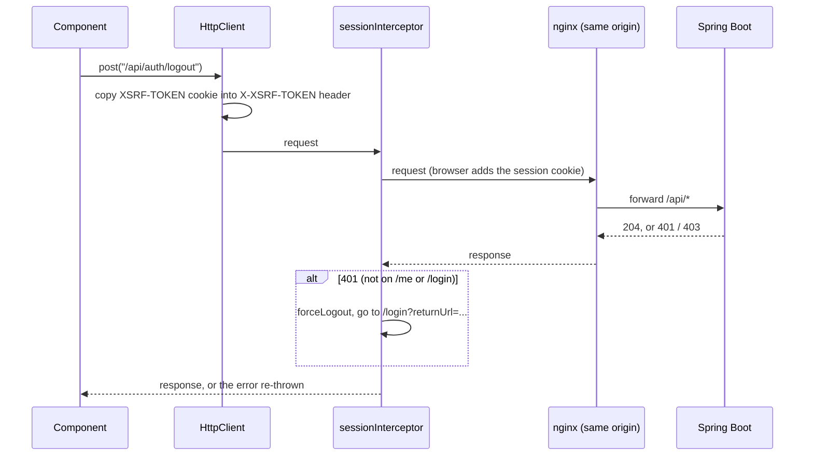

<!-- chapter: 22 | part: III | owner: writer-frontend | tag: book-m6-final | status: draft -->
# Chapter 22: Talking to the backend

A screen with no data is a mockup. In this chapter you follow a request from a button click in the browser, through Angular's `HttpClient`, across the same-origin proxy, to Spring Boot and back. You also see how the frontend copes when the backend says no: expired sessions, rate limits, and documents replaced while someone is reading them.

## Learning objectives

By the end of this chapter, you will be able to:

- Explain what a service is and how Angular's dependency injection provides one to a component.
- Write a typed `HttpClient` call for a GET, a POST and a file upload, and read the ones in `documents.service.ts`.
- Explain how the CSRF cookie becomes a request header, and where the session cookie is handled.
- Read `session.interceptor.ts` and say what happens on a 401.
- Explain how the viewer reacts to 429, 401, 404 and 410 responses when fetching tiles.
- Explain the idle warning and why background polling must not keep a session alive.

## Prerequisites

- Chapter 8: HTTP requests, status codes, cookies.
- Chapter 12: the REST endpoints this chapter calls.
- Chapter 16: CSRF protection and rate limiting on the server.
- Chapters 19–21: TypeScript, Observables, components and signals.

## Beginner tier: A service is a shared helper

### 22.1 Services and dependency injection in Angular

Several screens need the same things: to know who is signed in, to fetch documents. Copying that code into each component would be wasteful and error-prone. Instead the code goes into a **service**: a plain class, marked `@Injectable`, that Angular creates once and hands to whoever asks. Think of a shared office printer: nobody buys their own, and everyone who needs one is pointed to the same machine.

**Where the analogy breaks down:** a printer sits in the office whether or not anyone prints. Angular creates a service only when something first asks for it.

Asking is called **dependency injection**, the same idea as Spring's (Chapter 11): a class declares what it needs, and the framework supplies it. Here, in the constructor:

**Listing 22.1 — `documents.service.ts` (book-m6-final, excerpt)**

```typescript
@Injectable({ providedIn: 'root' })
export class DocumentsService {
  private readonly base = `${API_BASE_URL}/api/documents`;

  constructor(private readonly http: HttpClient) {}

  list(): Observable<DocumentSummary[]> {
    return this.http.get<DocumentSummary[]>(this.base);
  }

  get(documentId: string): Observable<DocumentDetail> {
    return this.http.get<DocumentDetail>(`${this.base}/${encodeURIComponent(documentId)}`);
  }
```

*Path: `frontend/src/app/features/documents/documents.service.ts`*

- `providedIn: 'root'` means one shared instance for the whole app.
- `constructor(private readonly http: HttpClient) {}` asks Angular for an `HttpClient`. The words `private readonly` in front of the parameter are TypeScript shorthand that also create a field named `http`. This is constructor injection, as in Chapter 11.
- `list()` returns `Observable<DocumentSummary[]>` (Chapter 19): a promise of a list of summaries. Nothing is sent until someone calls `.subscribe(...)`.
- `encodeURIComponent(documentId)` makes the id safe to put in a URL path, so a strange character can't change which endpoint is called.

The `API_BASE_URL` constant (`core/config.ts`) is the empty string, so the resulting address is the relative URL `/api/documents`. Section 22.7 explains why that matters.

A component then calls the service and shows the outcome:

**Listing 22.2 — `document-list.component.ts` (book-m6-final, excerpt: method `refresh`)**

```typescript
  refresh(): void {
    this.loading.set(true);
    this.documentsService.list().subscribe({
      next: (docs) => {
        this.documents.set(docs);
        this.loading.set(false);
      },
      error: () => {
        this.errorMessage.set('Could not load documents.');
        this.loading.set(false);
      },
    });
  }
```

*Path: `frontend/src/app/features/documents/document-list.component.ts`*

The `subscribe` call takes an object with two functions: `next` runs when data arrives, `error` when the request fails. Each updates signals (Chapter 21), and the template's `@if (loading()) ... @else if (errorMessage()) ... @else if (documents().length === 0) ...` chain in `document-list.component.html` shows one of four states: loading, error, empty, or the list. Deciding all four up front, rather than only the happy path, is what makes a screen feel finished.

### 22.2 `HttpClient`: GET, POST, uploads

`HttpClient` is Angular's built-in tool for HTTP. Each method matches an HTTP verb: `get`, `post`, `put`, `patch`, `delete`. The type in angle brackets is the shape you expect back (with the caveat from Chapter 19, Section 19.6: it is a promise, not a check). Sending data means passing a body, which `HttpClient` turns into JSON:

**Listing 22.3 — `session.service.ts` (book-m6-final, excerpt: method `login`)**

```typescript
  login(username: string, password: string): Observable<CurrentUser> {
    return this.http
      .post<CurrentUser>(`${API_BASE_URL}/api/auth/login`, { username, password })
      .pipe(tap((user) => this.current.set(user)));
  }
```

*Path: `frontend/src/app/core/session.service.ts`*

`.pipe(...)` adds steps that run on the result. `tap` performs a side effect without changing the value: here it stores the signed-in user in a signal, so the whole app (the nav bar, the guards) sees the new state at once. Note what is missing: no token is stored, and no `Authorization` header is set. The backend's session cookie is `HttpOnly`, meaning JavaScript can't read it; the browser attaches it automatically (Chapter 15).

Uploads use the browser's `FormData` and ask for progress events:

**Listing 22.4 — `documents.service.ts` (book-m6-final, excerpt: method `upload`)**

```typescript
  upload(title: string, file: File, visibility: Visibility): Observable<HttpEvent<DocumentDetail>> {
    const formData = new FormData();
    formData.append('title', title);
    formData.append('visibility', visibility);
    formData.append('file', file);
    return this.http.post<DocumentDetail>(this.base, formData, { reportProgress: true, observe: 'events' });
  }
```

*Path: `frontend/src/app/features/documents/documents.service.ts`*

`observe: 'events'` makes the Observable emit a series of events (progress reports, then the final response) instead of only the final body. `upload.component.ts` reads `HttpEventType.UploadProgress` to fill a progress bar, and treats "all bytes sent" as the point where the server starts rendering pages.

## Intermediate tier: Cookies, CSRF, and an interceptor

*On a first read you can skip to "In this project"; Part IV comes back to this.*

### 22.3 Interceptors: CSRF header and 401 handling

Cross-Site Request Forgery (CSRF, Chapter 16) is an attack in which another website tricks your browser into sending a request to the app, and the browser helpfully attaches your session cookie. The server's defense is to require a secret that only pages from the app itself can supply. The pattern used here: the server sets a cookie named `XSRF-TOKEN` that JavaScript is allowed to read, and the frontend copies its value into a header, `X-XSRF-TOKEN`, on every state-changing request. A foreign site can't read the app's cookie, so it can't set the header.

Angular's `HttpClient` does this copying by default for same-origin requests. `app.config.ts` says so in a comment:

**Listing 22.5 — `app.config.ts` (book-m6-final)**

```typescript
export const appConfig: ApplicationConfig = {
  providers: [
    provideBrowserGlobalErrorListeners(),
    provideRouter(routes),
    // HttpClient's built-in XSRF support is on by default: it copies the
    // XSRF-TOKEN cookie into the X-XSRF-TOKEN header on same-origin writes,
    // which is exactly what the backend's CSRF protection expects.
    provideHttpClient(withInterceptors([sessionInterceptor])),
    // Resolve "who am I" before the first route guard runs.
    provideAppInitializer(() => inject(SessionService).restore()),
  ],
};
```

*Path: `frontend/src/app/app.config.ts`*

There is no CSRF code to write in the app, which is the point: the project relies on the framework's default. The last provider runs `SessionService.restore()` before the first page is shown; it calls `/api/auth/me` to ask the server who is signed in (so a reload keeps you signed in), and its comment in `session.service.ts` notes that this call also primes the CSRF cookie.

Figure 22.1 shows the conversation for a state-changing request, such as signing out.

**Figure 22.1 — A write request from the browser to the API**



An **interceptor** is a function that sees every request and response that passes through `HttpClient`. `sessionInterceptor` handles the case where the session has ended:

**Listing 22.6 — `session.interceptor.ts` (book-m6-final, excerpt: the `catchError` step)**

```typescript
    catchError((error: unknown) => {
      const isAuthProbe = AUTH_PROBES.some((path) => req.url.endsWith(path));
      if (error instanceof HttpErrorResponse && error.status === 403 && error.error?.passwordChangeRequired) {
        router.navigate(['/account'], { queryParams: { required: 1 } });
      }
      if (!isAuthProbe && error instanceof HttpErrorResponse && error.status === 401) {
        sessionService.forceLogout();
        // Same returnUrl contract as authGuard, so signing back in lands
        // where the user was rather than on the documents list.
        const returnUrl = router.url.startsWith('/login') ? undefined : router.url;
        router.navigate(['/login'], { queryParams: returnUrl ? { returnUrl } : {} });
      }
      return throwError(() => error);
    }),
```

*Path: `frontend/src/app/core/session.interceptor.ts`*

- A **401** means "not authenticated". Whatever request received it, the session is gone (timed out, ended elsewhere, or revoked by an administrator), so the interceptor clears local state and sends the reader to the sign-in page, remembering where they were in `returnUrl`.
- The exception is `/api/auth/me` and `/api/auth/login` (the `AUTH_PROBES`): a 401 there just means "not signed in" or "wrong password", and redirecting would loop.
- A **403** with `passwordChangeRequired` sends a user whose password was set by an administrator to the account page (Chapter 23).
- `throwError(() => error)` passes the failure on, so the calling component's own `error:` handler still runs.

The interceptor also has a `tap` step, added at `book-m4-reading`, that calls `sessionService.touch()` on every successful response to record activity for the idle warning (Section 22.6).

### 22.4 Loading, error and empty states

Every screen that loads data has four states, and the project treats each as a design decision, not an afterthought: *loading* ("Loading…"), *error* (a sentence saying what failed, in `role="alert"` so screen assistants announce it), *empty* ("No documents yet", with different advice for people who can upload), and *content*. Error messages from the server are shown when they exist (`err.error?.error`), falling back to a generic sentence; the backend's error contract (Chapter 13) guarantees they carry no internals.

### 22.5 Handling 429 with `Retry-After`, and 410 Gone

Tiles are not fetched with `HttpClient`. The reason is in a comment in `viewer.component.ts`: only the browser's `fetch()` exposes each response's status, and a throttled or expired tile is otherwise indistinguishable from a blank one, so the page would silently render with holes. Each tile URL is a signed, short-lived address (Chapter 25). The viewer runs six fetches at a time (`MAX_CONCURRENT_TILE_FETCHES`), because a page change would otherwise leave dozens of now-irrelevant requests in flight, each still spending the reader's rate-limit budget.

**Listing 22.7 — `viewer.component.ts` (book-m6-final, excerpt: how one tile response is handled)**

```typescript
        if (response.ok) {
          this.sessionService.touch();
          const blob = await response.blob();
          if (generation !== this.loadGeneration) {
            return;
          }
          this.updateTile(tile.key, { status: 'loaded', src: URL.createObjectURL(blob) });
        } else if (response.status === 429 || response.status === 503) {
          // Over this reader's limit, or the server is briefly busy: wait and resume.
          outcome.retryAfterSeconds = parseRetryAfter(response.headers.get('Retry-After'));
        } else if (response.status === 401) {
          outcome.unauthorized = true;
        } else if (response.status === 404) {
          // Unshared or deleted while open: access is re-checked on every tile.
          outcome.accessRevoked = true;
        } else if (response.status === 410) {
          // The PDF was replaced while open: these URLs point at the old render.
          outcome.replaced = true;
        } else {
          this.updateTile(tile.key, { status: 'failed' });
        }
```

*Path: `frontend/src/app/features/viewer/viewer.component.ts`*

Each status has its own meaning and its own recovery:

- **200:** the response body is a PNG. `URL.createObjectURL(blob)` makes a temporary `blob:` address the tile's CSS background can use (Chapter 21).
- **429 or 503:** too many requests, or the server is briefly busy. The `Retry-After` header says how many seconds to wait. The viewer stops issuing further requests (they would be rejected too), shows "Viewing speed limit reached: N of M tiles loaded. The rest of this page will load in Ns" and counts down each second. When the countdown ends it asks for a *fresh* grid of signed URLs, because waiting can outlast the old URLs' lifetime. If `Retry-After` is missing or unusable, it waits 5 seconds (`FALLBACK_RETRY_AFTER_SECONDS`).
- **401:** a tile URL expired before the worker reached it, or the session is gone. The viewer re-issues the grid once (`allowUrlReissue`); if the session really is gone, that request fails with 401 and the interceptor signs the user out.
- **404:** the document was unshared or deleted while open (access is re-checked on every tile), so the viewer shows an "no longer available to you" state.
- **410 Gone:** the owner replaced the PDF; these URLs point at the old rendering. The viewer reloads the document description and shows a notice, "This document was updated while you were reading". It passes the stale version number so that if the reload finds the same version, it stops with an error instead of looping forever (a case the spec `viewer.component.spec.ts` covers).

### 22.6 Session state and idle warnings

The server ends a session after a period without requests. Readers reading quietly would be surprised by that, so the app warns them. `core/idle.ts` (Chapter 19) is pure arithmetic: from the current time, the time of the last request, and the server's timeout (delivered as `sessionTimeoutSeconds` in the sign-in response), it returns `active`, `warning` with the seconds left, or `expired`. The warning window is the last five minutes, or half the timeout if that is shorter (`idle.spec.ts` has the cases). `App` checks once a second and shows the banner from Listing 21.2; "Stay signed in" calls `/api/auth/me`, and any request extends the server's session.

Two details keep this honest. First, the last-activity time is written to `localStorage` under `sdv.lastActivity` and read back when another tab writes it, so activity in one tab stops another tab from warning wrongly; if storage is unavailable, each tab tracks its own activity. Second, every successful API call (including tile fetches, via `touch()`) counts as activity, matching what the server does.

## Advanced tier: One origin, and quiet polling

*On a first read you can skip to "In this project"; Part IV comes back to this.*

### 22.7 Why one origin: nginx and the proxy

Chapter 20 showed the development proxy. In production, `frontend/nginx.conf` does the same job with more care. The comment at its top says the design goal: "Serves the Angular app and proxies the API, so browser, session cookie and CSRF cookie all share one origin." With one origin there is no cross-origin resource sharing (CORS) setup to get wrong, no cookie policies to loosen, and the relative URLs in the frontend just work.

**Listing 22.8 — `nginx.conf` (book-m6-final, excerpt: the API location)**

```text
    # ^~ so no regex location (e.g. the static-asset rule below) can capture an API path.
    location ^~ /api/ {
        proxy_pass http://app:8080;
        proxy_set_header Host $host;
        # OVERWRITE (never append to) X-Forwarded-For with the address of the TCP
        # peer. The backend trusts this header (server.forward-headers-strategy),
        # so passing through a client-supplied value would let anyone choose the
        # IP that login throttling and the audit log see.
        proxy_set_header X-Forwarded-For $remote_addr;
```

*Path: `frontend/nginx.conf`*

The comment records a real security fix (fix commit `2d82253`, pull request 1). During a live test through nginx, one of the project's AI review agents found that the proxy appended to a client-supplied `X-Forwarded-For` header and the backend trusted it, so changing the header on each attempt reset the sign-in throttle. The fix made nginx overwrite the header with the real peer address. An end-to-end test in `e2e/secure-viewing.spec.ts` now sends six wrong passwords with different spoofed addresses and expects the sixth to be refused with 429 (Chapter 24). The same file sets a Content-Security-Policy for the app's pages that allows images only from `'self'`, `blob:` and `data:`; the `blob:` allowance is exactly what the viewer's tiles need.

### 22.8 Polling that must not keep a session alive

The admin dashboard refreshes its session list every five seconds. But a request counts as activity, so a forgotten admin tab would keep the most privileged session alive forever. The code therefore polls only while the page is visible and someone touched it in the last two minutes:

**Listing 22.9 — `admin-dashboard.component.ts` (book-m6-final, excerpt)**

```typescript
export const POLL_IDLE_MS = 2 * 60_000;

export function shouldPoll(now: number, lastInputAt: number, hidden: boolean): boolean {
  return !hidden && now - lastInputAt < POLL_IDLE_MS;
}
```

*Path: `frontend/src/app/features/admin/admin-dashboard.component.ts`*

The doc comment above it says why: "An unattended admin page must not keep polling: every poll would count as activity and keep the most privileged session alive past its idle timeout." The function is pure and tested in `admin-dashboard.component.spec.ts`.

## In this project

| File | First appears | What it does |
|---|---|---|
| `frontend/src/app/core/session.service.ts` | book-m1-accounts | Who is signed in, as signals; login, logout, restore |
| `frontend/src/app/core/session.interceptor.ts` | book-m1-accounts (activity and 403 handling later) | 401 handling |
| `frontend/src/app/app.config.ts` | book-m1-accounts | Providers: router, HttpClient, startup restore |
| `frontend/src/app/features/documents/documents.service.ts` | book-m1-accounts (grew in m2) | Document API calls |
| `frontend/src/app/features/viewer/viewer.component.ts` | book-m1-accounts | Tile fetch pool, throttle countdown (429) and 401 handling from m1; tile 404 handling by m4; 410 Gone and replaced-document reload from m5 |
| `frontend/src/app/core/idle.ts` | book-m4-reading | Idle-timeout arithmetic |
| `frontend/nginx.conf` | book-m5-platform | Production same-origin proxy and headers |

See one with `git show book-m6-final:frontend/src/app/core/session.interceptor.ts`.

## Try it

### Exercise 22.1 ★ The HTTP methods

Which HTTP methods does `DocumentsService` use, and which one sends a file?

### Exercise 22.2 ★ The interceptor and a 401

What does the interceptor do with a 401 from `/api/auth/login`? Why?

### Exercise 22.3 ★★ Find the CSRF header

Open the browser's developer tools, Network tab, sign in, then make any `POST`. Find the `X-XSRF-TOKEN` request header and the `XSRF-TOKEN` cookie. Do the values match?

### Exercise 22.4 ★★ The fallback retry time

In a scratch copy, change `FALLBACK_RETRY_AFTER_SECONDS`. Which situation does it affect?

### Exercise 22.5 ★★★ A reload without the version check

Explain what could go wrong if the viewer, after a 410, reloaded the document without the `staleVersion` check.


Solutions are in `22-http-client-and-services.solutions.md`.

## Summary

- Services are shared classes injected through the constructor; `providedIn: 'root'` gives one instance.
- `HttpClient` methods return Observables and do nothing until subscribed; typing the response is a promise, not a check.
- No token is stored in JavaScript: the session cookie is `HttpOnly`, and Angular copies the CSRF cookie into a header by default.
- The interceptor turns a 401 into a clean return to sign-in; the sign-in and me endpoints are exempt.
- The viewer uses `fetch()` so it can see 429, 401, 404 and 410, and responds differently to each.
- The idle warning is arithmetic on the last request time; polling must never count as activity.
- One origin, via the dev proxy and nginx, is what makes the cookies work without CORS.

Next, Chapter 23 covers the pages themselves: routing, guards and forms.

## Further reading

- Angular documentation, "HttpClient", "Interceptors" and "Dependency injection": https://angular.dev/
- MDN Web Docs, "Fetch API" and "Retry-After": https://developer.mozilla.org/
- OWASP Cheat Sheet Series, "Cross-Site Request Forgery Prevention": https://cheatsheetseries.owasp.org/
