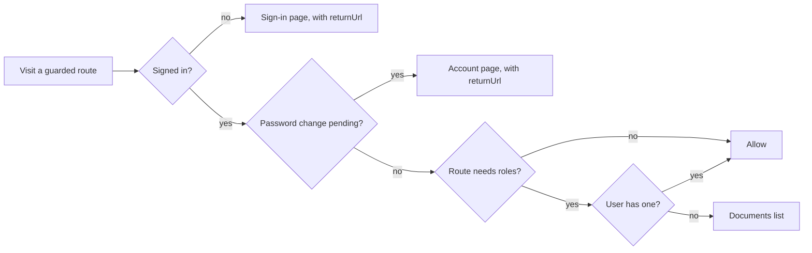
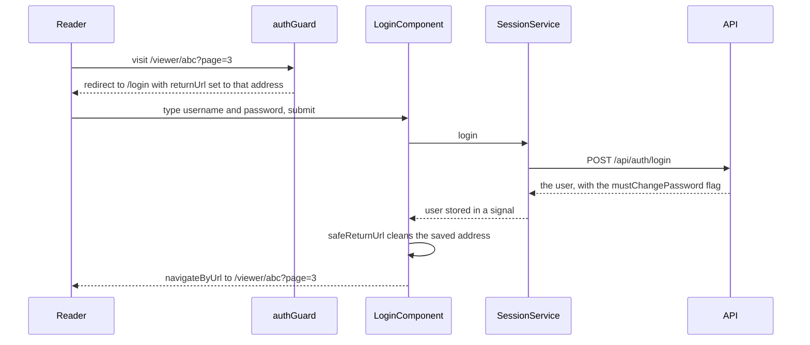

<!-- chapter: 23 | part: III | owner: writer-frontend | tag: book-m6-final | status: expanded -->
<!-- source: forced password change and swipe added in commit d74a346 (book-m5-platform); deep links and keyboard in commit 187498c (book-m4-reading); safeReturnUrl present since book-m1-accounts; listings verified with git show book-m6-final and book-m1-accounts -->
# Chapter 23: Routing, guards, and forms

A single-page application has one HTML page, but readers expect many: a sign-in page, a document list, a viewer you can bookmark. This chapter shows how Angular's router creates that illusion, how guards keep readers out of screens they can't use, how the forms collect input, and how the viewer supports deep links, keyboard navigation, and swiping. Along the way it keeps returning to one theme that runs through the whole project: the browser is friendly territory for convenience and hostile territory for security, so every check made here is also made again on the server.

## Learning objectives

By the end of this chapter, you will be able to:

- Read `app.routes.ts` and say which URL shows which component.
- Trace what the router does between a click on a link and a new screen.
- Explain what a route guard does, and why it is a convenience and not a security control.
- Write a template-driven form with `ngModel` and explain why client-side validation is not security.
- Explain how `returnUrl` is validated, and what that check does and does not protect against.
- Explain how `?page=N` deep links and the viewer's "resume reading" work.
- Explain how the viewer handles keyboard and swipe input safely.

## Prerequisites

- Chapter 8: URLs, including query strings (the `?page=3` part of an address, which carries extra named values).
- Chapter 16: what the server enforces (authorization on every request).
- Chapters 21–22: components, signals, services, and the interceptor.

## Beginner tier: Pages without page loads

### 23.1 Routes and pages (`app.routes.ts`)

A single-page application (SPA) loads one HTML document once. When you click a link, Angular's **router** changes the address in the address bar, swaps which component is shown in the `<router-outlet />` (Chapter 21), and never reloads the browser. Think of a hotel lobby with one desk and many rooms: the front door never changes, but the desk directs you to a different room depending on what you ask for.

**Where the analogy breaks down:** a hotel's rooms exist whether or not you visit. Angular creates a route's component when you arrive and destroys it when you leave, so its signals start fresh each time.

The routes are a list that maps URL paths to components:

**Listing 23.1 — `app.routes.ts` (book-m6-final, simplified: the `admin` and `account` routes and the catch-all route are omitted at the `// ...` line)**

```typescript
export const routes: Routes = [
  { path: '', pathMatch: 'full', redirectTo: 'documents' },
  {
    path: 'login',
    loadComponent: () => import('./features/auth/login.component').then((m) => m.LoginComponent),
  },
  {
    path: 'documents',
    canActivate: [authGuard],
    loadComponent: () =>
      import('./features/documents/document-list.component').then((m) => m.DocumentListComponent),
  },
  {
    path: 'documents/upload',
    canActivate: [roleGuard('PUBLISHER', 'ADMIN')],
    loadComponent: () => import('./features/documents/upload.component').then((m) => m.UploadComponent),
  },
  {
    path: 'documents/:documentId/manage',
    canActivate: [authGuard],
    loadComponent: () =>
      import('./features/documents/manage.component').then((m) => m.ManageDocumentComponent),
  },
  {
    path: 'viewer/:documentId',
    canActivate: [authGuard],
    loadComponent: () => import('./features/viewer/viewer.component').then((m) => m.ViewerComponent),
  },
  // ...
];
```

*Path: `frontend/src/app/app.routes.ts`*

(Simplified: the `admin` and `account` entries, which follow the same pattern, and the catch-all `{ path: '**', redirectTo: 'documents' }` are omitted.)

- `path: ''` with `redirectTo: 'documents'` sends the bare address to the document list. `pathMatch: 'full'` means "only when the path is exactly empty." Without it, every address would match the empty prefix.
- `:documentId` is a **route parameter**: `viewer/abc123` matches, with `documentId` set to `abc123`. The viewer reads it with `this.route.snapshot.paramMap.get('documentId')`.
- `loadComponent: () => import(...)` is lazy loading. The `() =>` is an arrow function (Chapter 19) that Angular calls only when the route is first needed; inside, `import('./features/...')` asks the browser to download that file then, and `.then((m) => m.LoginComponent)` picks the component class out of it. The effect: the component's code is downloaded only when someone first visits that route, which keeps the initial download small. The build budget in `angular.json` (Chapter 20) enforces a size limit on the first download.
- `canActivate: [...]` lists **guards**, covered in Section 23.5.

Routes are matched from the top of the list to the bottom, and the first match wins. That is why the catch-all `**` pattern, which matches everything, must be last: placed earlier, it would swallow every other route.

The other routes follow the same pattern. `admin` is guarded by `roleGuard('ADMIN')`, `account` (the change-password screen) by `authGuard`, and the catch-all sends unknown addresses to the document list. At `book-m1-accounts` the list was the same except for the `documents/:documentId/manage` route, which arrived with document ownership and sharing at `book-m2-documents`.

### 23.2 Worked example: what happens when you click a link

Suppose a signed-in reader is on the document list and clicks the card for a document whose id is `abc123`. Follow the steps:

1. The card contains `<a [routerLink]="['/viewer', doc.documentId]">` (Chapter 21, Listing 21.4). The `routerLink` directive turns the array `['/viewer', 'abc123']` into the address `/viewer/abc123`.
2. Angular intercepts the click, prevents the browser's normal "load a new page" behavior, and tells the router the new address.
3. The router walks the list of routes and finds `viewer/:documentId`. It records that `documentId` is `abc123`.
4. Before entering, it runs the route's guards: `authGuard` (Section 23.5). Signed in? Yes, so the guard returns `true`.
5. It calls the `loadComponent` function; the first time, the browser downloads the viewer's code. Later visits reuse it.
6. It creates the `ViewerComponent`, places it in `<router-outlet />`, and removes the document list component from the screen.
7. The address bar now shows `/viewer/abc123`. The browser's Back button works, because the router added a history entry.
8. `ViewerComponent`'s `ngOnInit` (Chapter 21) reads `documentId` from the route and asks the API for the document (Chapter 22).

Nothing in this sequence reloaded the page: the header, the idle timer in `App` and the signed-in state all survived. That is what "single page" buys: continuity.

### 23.3 Reading route information in a component

A component receives route information by injecting `ActivatedRoute` (Chapter 22 explained injection). Two parts matter here.

- `route.snapshot.paramMap.get('documentId')` reads a **route parameter**, the `:documentId` part of the path.
- `route.snapshot.queryParamMap.get('page')` reads a **query parameter**, the `?page=3` part.

Both return a string, or `null` when the value is absent. Both are text, even when they look like numbers, so code that wants a number must convert and check it (Section 23.11). A "snapshot" is the value at the moment the component was created. The viewer uses snapshots because it is created fresh for each document; a component that stays on screen while its parameters change would subscribe to changes instead.

Navigation in code uses the `Router` service. Two methods appear in the project, and the difference is worth knowing: `router.navigate(['/account'], { queryParams: { required: 1 } })` builds an address from parts (which Angular encodes safely), while `router.navigateByUrl(returnUrl)` takes an address that is already a complete string. The login component uses the second for the saved `returnUrl`, and the first when it builds an address with query parameters.

## Intermediate tier: Guards, forms, and the trust boundary

*On a first read you can skip to "In this project"; Part IV comes back to this.*

### 23.4 A trust boundary, in one paragraph

Everything that runs in the browser is under the reader's control. The reader can open developer tools, edit the JavaScript, change a variable, or skip the frontend and send requests with `curl`. So the frontend can never *enforce* a rule; it can only *express* rules for honest users. The **trust boundary** is the line between what the project controls (the server) and what it doesn't (the browser). This chapter's checks (guards, form validation, `returnUrl` cleaning) sit on the untrusted side. They exist to make the app pleasant and to reduce mistakes. The enforcement is on the server, in Part II. Keep that in mind as you read on. It is the same idea as Chapter 1, Section 1.3.

### 23.5 Guards: `auth.guard.ts`

A **route guard** is a function that Angular runs before entering a route. It returns `true` to allow entry, or a redirect.

*Pattern note: A guard is a guard clause (Chapter 38, Sections 38.11 and 38.13).*

**Listing 23.2 — `auth.guard.ts` (book-m6-final)**

```typescript
export const authGuard: CanActivateFn = (_route, state) => {
  const sessionService = inject(SessionService);
  const router = inject(Router);

  if (sessionService.isLoggedIn()) {
    // An admin-set password must be replaced first; the server enforces the same rule.
    if (sessionService.mustChangePassword() && !state.url.startsWith('/account')) {
      return router.createUrlTree(['/account'], { queryParams: { required: 1, returnUrl: state.url } });
    }
    return true;
  }
  return router.createUrlTree(['/login'], { queryParams: { returnUrl: state.url } });
};

/**
 * UX only: keeps users off screens their role can't use. The server
 * enforces the same rules on every API call regardless of this guard.
 */
export const roleGuard =
  (...roles: Role[]): CanActivateFn =>
  (route, state) => {
    const signedIn = authGuard(route, state);
    if (signedIn !== true) {
      return signedIn;
    }
    return inject(SessionService).hasAnyRole(...roles) ? true : inject(Router).createUrlTree(['/documents']);
  };
```

*Path: `frontend/src/app/core/auth.guard.ts`*

Line by line:

- `CanActivateFn` is the type of a guard function. It receives the route and a `state`; `state.url` is the address being visited.
- `inject(SessionService)` and `inject(Router)` fetch services inside a plain function (Chapter 22).
- `sessionService.isLoggedIn()` reads a computed signal (Chapter 21): true when a user is stored.
- A guard may return `true`, `false`, or a **URL tree**, an object describing a redirect. `router.createUrlTree(['/login'], { queryParams: { returnUrl: state.url } })` builds "go to `/login?returnUrl=<where you wanted to go>`." Returning a URL tree is better than calling `navigate` from inside the guard, because the router can cancel the original navigation cleanly.
- `roleGuard('ADMIN')` is a function that *builds* a guard: `(...roles: Role[])` collects any number of roles into an array, and the inner function first runs `authGuard`, then checks the role. A signed-out visitor to `/admin` is therefore sent to sign in, while a signed-in reader is sent to the documents list.
- The middle `if` handles a special case: a person whose password was set by an administrator must choose their own before going anywhere else. The guard sends them to `/account` with `required=1`. The `!state.url.startsWith('/account')` part prevents an endless loop of redirects to the very page that fixes the problem.

Because `restore()` runs at startup (Chapter 22, `provideAppInitializer`), the guard knows who is signed in before it first runs. Without that, a page reload would look "signed out" for a moment and bounce the reader to sign-in.

The doc comment on `roleGuard` says it plainly: **UX only**, meaning a user-experience convenience. A guard runs in the reader's own browser, which the reader controls. The real check is the server's, on every call (Chapter 16). Guards exist so that honest users don't land on screens that would only show errors.

### 23.6 Worked example: four visits

Figure 23.1 shows the decision `authGuard` and `roleGuard` make, and Table 23.1 shows what `authGuard` and `roleGuard` decide in four situations. The behavior comes from `auth.guard.spec.ts` (Chapter 24) and Listing 23.2.

**Table 23.1 — What the guards decide in four visits**

| Who is visiting | Address | Guard result |
|---|---|---|
| Nobody signed in | `/viewer/abc?page=3` | Redirect to `/login?returnUrl=%2Fviewer%2Fabc%3Fpage%3D3` |
| A reader | `/admin` | Redirect to `/documents` |
| A reader | `/documents` | Allowed |
| A reader whose password was set by an admin | `/documents` | Redirect to `/account?required=1&returnUrl=%2Fdocuments` |

In the first row, the address is *encoded* (`%2F` for `/`, `%3F` for `?`) so that it can travel inside another address as a query value. After the reader signs in, the login component decodes and validates it (Section 23.8) and returns them to the same page.



*Figure 23.1 — The route guard decision flow (`authGuard`, then `roleGuard`)*

*Text description:* A decision flow drawn top to bottom. A visit to a guarded route first asks whether the reader is signed in; if not, the reader is redirected to sign-in with a return address. If signed in, it asks whether a password change is required and the reader is not already on the account page; if so, the reader is redirected to the account page. Otherwise, a route that needs no specific role allows the visit, and a route that does need one allows it only for a user with one of those roles and redirects everyone else to the document list.

<!-- source: auth.guard.ts at book-m6-final; roleGuard runs authGuard first, then checks hasAnyRole -->

In the diagram, "password change pending" stands for the guard's exact test: a change is required and the visit is not already to the account page, so the account page itself always opens. The first two questions belong to `authGuard`, which every guarded route uses. `roleGuard` runs `authGuard` first and adds the last two questions. Every "redirect" leaves the reader somewhere that makes sense, and none of the boxes says "deny with an error": the guard's job is to steer, and the server does the refusing (Section 23.4).

Figure 23.2 follows one signed-out visit from start to finish, including the round trip of `returnUrl`.



*Figure 23.2 — A signed-out visit to a deep link, and the return trip after sign-in*

*Text description:* A sequence diagram with five participants: the reader, the auth guard, the login component, the session service, and the API. A signed-out reader visits a deep link and the guard redirects to the sign-in page with the address saved. The reader submits the form, the session service posts to the API and stores the returned user, and the login component cleans the saved address and navigates to it. Notice that the address travels in the sign-in address and back, with nothing stored in the browser.

<!-- source: auth.guard.ts, login.component.ts (submit, safeReturnUrl), session.service.ts (login) at book-m6-final -->

Notice that the reader ends on the page they originally asked for, with `?page=3` intact, without the frontend having stored anything: the address traveled inside the sign-in address and came back. If `mustChangePassword` were true, the login component would send the reader to the account page first, carrying the same `returnUrl` (Section 23.15).

### 23.7 Forms and client-side validation (and why it's not security)

A **form** collects typed input. The project uses Angular's template-driven forms: importing `FormsModule` lets you tie an input to a class field with `[(ngModel)]`, which keeps them in sync in both directions.

**Listing 23.3 — `login.component.html` (book-m6-final, simplified: the password field and the error paragraph are omitted at the `<!-- ... -->` line)**

```html
  <form (ngSubmit)="submit()">
    <label for="username">Username</label>
    <input
      id="username"
      name="username"
      type="text"
      [(ngModel)]="username"
      autocomplete="username"
      autocapitalize="none"
      spellcheck="false"
      required
    />
    <!-- ... -->
    <button type="submit" [disabled]="submitting() || !username.trim() || !password">
      {{ submitting() ? 'Signing in…' : 'Sign in' }}
    </button>
  </form>
```

*Path: `frontend/src/app/features/auth/login.component.html`*

(Simplified: the password field, which is the same shape with `type="password"` and `autocomplete="current-password"`, and the error paragraph are omitted.)

- `(ngSubmit)="submit()"` runs the method when the form is submitted, whether by button or by pressing Enter.
- `<label for="username">` is tied to the input whose `id` is `username`. Clicking the label focuses the input, and screen readers announce the label when the input gets focus (Chapter 21, accessibility).
- `[(ngModel)]="username"` reads and writes the class field `username`. The square-bracket-and-parentheses "banana in a box" form means: the value flows from the class into the input, and each keystroke flows back. `name` is required by `ngModel` inside a form.
- `autocomplete="username"` lets password managers recognize the field; `autocapitalize="none"` and `spellcheck="false"` stop phones from "correcting" a username.
- `required` marks the field as mandatory for the browser's own validation.
- `[disabled]="..."` disables the button while a request is in flight or a field is empty, preventing double submissions.

The class behind it is short:

**Listing 23.4 — `login.component.ts` (book-m6-final, excerpt: method `submit`)**

```typescript
  submit(): void {
    if (!this.username.trim() || !this.password) {
      return;
    }
    this.submitting.set(true);
    this.errorMessage.set(null);

    this.sessionService.login(this.username.trim(), this.password).subscribe({
      next: (user) => {
        this.password = '';
        const returnUrl = safeReturnUrl(this.route.snapshot.queryParamMap.get('returnUrl'));
        if (user.mustChangePassword) {
          this.router.navigate(['/account'], { queryParams: { required: 1, returnUrl } });
        } else {
          this.router.navigateByUrl(returnUrl);
        }
      },
      error: (err: HttpErrorResponse) => {
        this.submitting.set(false);
        this.password = '';
        this.errorMessage.set(loginErrorMessage(err));
      },
    });
  }
```

*Path: `frontend/src/app/features/auth/login.component.ts`*

The method is a small story. It refuses to send an empty form. It marks itself busy, clears any old error, and asks the session service (Chapter 22) to sign in. On success it wipes the password from memory (`this.password = ''`) and moves on, to the password-change screen if an administrator set the password, or otherwise to the saved `returnUrl`. On failure it also wipes the password, so a mistyped one isn't left sitting in the field, and shows a message. Note that success and failure both clear the password: a small habit that reduces what could be shoulder-surfed or inspected.

How the message is chosen is a small function of its own:

**Listing 23.5 — `login.component.ts` (book-m6-final, excerpt: `loginErrorMessage`)**

```typescript
function loginErrorMessage(err: HttpErrorResponse): string {
  if (err.status === 429) {
    const minutes = Math.max(1, Math.ceil(Number(err.headers.get('Retry-After') ?? 60) / 60));
    return `Too many failed attempts. Try again in about ${minutes} minute${minutes === 1 ? '' : 's'}.`;
  }
  if (err.status === 401) {
    return 'Incorrect username or password.';
  }
  return 'Sign-in failed. Please try again.';
}
```

*Path: `frontend/src/app/features/auth/login.component.ts`*

A 429 here is the sign-in throttle from Chapter 16: too many wrong passwords. The response's `Retry-After` header gives seconds; the function turns them into whole minutes, at least one (`Math.max(1, Math.ceil(x / 60))`), and handles the singular ("1 minute") and plural. `?? 60` means "if the header is missing, assume 60 seconds." A 401 means wrong credentials; anything else gets a generic sentence. The message never says *which* of username or password was wrong, so the screen doesn't help someone guess which usernames exist.

### 23.8 Cleaning `returnUrl`: what it protects, and what it doesn't

The saved address travels in a query parameter, and that parameter is controlled by whoever built the link. Anyone can send a reader a link such as `/login?returnUrl=//evil.example/fake`. What could such a value do?

The classic attack is an **open redirect**: a site that, after sign-in, sends the browser to whatever address the link names, so a genuine sign-in page can be used to send a victim on to a lookalike site. That attack needs code that hands the raw string to the browser itself, for example by assigning it to `window.location` or using it as a link's address.

This project's code doesn't do that. After signing in, the login component calls Angular's `router.navigateByUrl(returnUrl)` (Listing 23.4), and that method treats the string as an address *inside the application*, not as a web address. This was checked against Angular 22.1.7's own URL parser in a scratch project: `//evil.example/fake` is read as two path segments, `evil.example` and `fake`; `https://evil.example` becomes the single segment `https:`; and `javascript:alert(1)` becomes one segment `javascript:alert`. None of them leaves the site. With no matching route, the router falls through to the catch-all route, which shows the document list. So a crafted `returnUrl` cannot, through `navigateByUrl`, send the reader to another site, and the code as written has no path by which it could.

Why then is there a check? The function's own comment states the intent: "Only ever navigate within the app." It is **defense in depth**, a second barrier in case the first one changes. It keeps `returnUrl` a plain in-app path (starting with a single `/`) so that:

- a strange value lands on the intended default, `/documents`, instead of being interpreted as an odd route;
- the value is safe to reuse if a later change ever hands it to something that *would* trust it, such as a full-page redirect or a link; and
- the same value passes through the account screen and back with the same guarantee.

This is a useful habit, but be honest about its size: it is a cheap guard on a path that was already contained, not the fix for an exploit that existed.

The defense is small:

**Listing 23.6 — `login.component.ts` (book-m6-final, excerpt: `safeReturnUrl`)**

```typescript
/** Only ever navigate within the app — a crafted ?returnUrl=//evil.example must not redirect off-site. */
function safeReturnUrl(returnUrl: string | null): string {
  return returnUrl && returnUrl.startsWith('/') && !returnUrl.startsWith('//') ? returnUrl : '/documents';
}
```

*Path: `frontend/src/app/features/auth/login.component.ts`*

Read the condition as three questions, all of which must be yes: is there a value (`returnUrl &&`)? Does it start with a single `/` (an address inside this site)? And does it *not* start with `//`? A browser treats a leading `//` as "same scheme, different host," so a value like `//evil.example` is exactly what you would refuse to hand to a browser-level redirect. Angular's router, as tested earlier in this section, would not follow it off-site anyway. If any answer is no, the function returns the safe default, `/documents`. Table 23.2 runs it on some inputs:

**Table 23.2 — `safeReturnUrl` on sample inputs**

| `returnUrl` value | Result | Why |
|---|---|---|
| `null` (no parameter) | `/documents` | Nothing to follow |
| `/viewer/abc?page=3` | `/viewer/abc?page=3` | Inside the app |
| `//evil.example` | `/documents` | Starts with `//` |
| `https://evil.example` | `/documents` | Doesn't start with `/` |
| `viewer/abc` | `/documents` | Not an absolute path; refused to be safe |

This function has existed since the first frontend milestone (`book-m1-accounts`); it was written with the guard's `returnUrl` design, not added after an incident. The account screen (`account.component.ts`) applies the same rule to its own `returnUrl`. It is duplicated there rather than shared, which is a small piece of technical debt a maintainer might tidy.

### 23.9 Client-side validation is not security

`required`, the 12-character minimum on the password form (`account.component.ts`), and the PDF-only and 50 MB checks in `upload.component.ts` are for the reader's benefit: fast feedback without a round trip. **None of it is security**, because anyone can bypass the browser and send requests directly. The upload component says so in its comment: the size constant "mirrors the server limit ... the server still enforces it." Chapter 13 covered the server-side validation that does the real work.

Why keep the client checks at all? Two reasons. Speed: telling someone their 60 MB file is too large before uploading it saves a long, useless upload. Kindness: an inline sentence next to a field is clearer than a generic error from the server. The rule of thumb is *validate twice, trust once*: check in the browser for the user, check on the server for the system, and only the second counts.

> **Note:** The viewer's page-number form uses `novalidate` on purpose: the component's `goToPage` method does all validation, so every bad value (blank, decimal, out of range) produces the same inline message, "Enter a whole number from 1 to N."

### 23.10 Why template-driven forms and not reactive forms

Angular has two form styles. **Template-driven** forms, used here, put the setup in the template (`ngModel`) and suit small forms with a handful of fields. **Reactive** forms describe the form as objects in the class (form groups and controls with validators), which is more code up front and better for large or dynamic forms, complex cross-field rules, or heavy testing of form logic. The project's forms are small (sign in, change password, upload, share, a page number), and their validation is a few lines of plain code, so the lighter style wins. If a form grew to dozens of fields with interdependent rules, switching to reactive forms would be the natural step.

## Advanced tier: Deep links, resuming, and keyboard

*On a first read you can skip to "In this project"; Part IV comes back to this.*

### 23.11 Deep links and query parameters (page numbers)

A **deep link** is an address that leads straight to a specific state, for example the viewer at page 3 of a document. Query parameters make it possible: `/viewer/<id>?page=3`. At `book-m4-reading` the viewer gained this (commit "Phase 4a: page deep links, keyboard navigation, resume reading"). The rule, from the comment on `initialPage`: `?page=N` (1-based) wins; otherwise resume where this user left off; otherwise page 1.

**Listing 23.7 — `viewer.component.ts` (book-m6-final, excerpt: `initialPage` and `rememberPage`)**

```typescript
  private initialPage(pageCount: number): number {
    const requested = Number(this.route.snapshot.queryParamMap.get('page'));
    if (Number.isInteger(requested) && requested >= 1 && requested <= pageCount) {
      return requested - 1;
    }
    try {
      const saved = Number(localStorage.getItem(this.lastPageKey()));
      return Number.isInteger(saved) && saved >= 0 && saved < pageCount ? saved : 0;
    } catch {
      return 0;
    }
  }

  /** Keeps the URL shareable (?page=N) and remembers the page for next time. */
  private rememberPage(page: number): void {
    void this.router.navigate([], {
      relativeTo: this.route,
      queryParams: { page: page + 1 },
      queryParamsHandling: 'merge',
      replaceUrl: true,
    });
    try {
      localStorage.setItem(this.lastPageKey(), String(page));
    } catch {
      // Storage unavailable (private mode, quota); resuming is just a convenience.
    }
  }
```

*Path: `frontend/src/app/features/viewer/viewer.component.ts`*

Notes on the details:

- The page in the URL is 1-based (people say "page 1"), while the code counts from 0, hence `requested - 1` and `page + 1`. Mixing these up is the classic off-by-one mistake; the project keeps the conversion at the edges (this pair of methods and `goToPage`) so that everywhere else the code counts from 0.
- The URL value is user-controlled input. `Number(...)` turns text into a number (`Number(null)` is 0, and `Number('abc')` is `NaN`, "not a number"), and the `Number.isInteger` check plus the range check reject everything that isn't a whole number in range. A bad value such as `?page=99` falls back to the remembered page, which a spec confirms (`viewer.component.spec.ts`).
- `router.navigate([], { relativeTo: this.route, queryParams: {...}, queryParamsHandling: 'merge', replaceUrl: true })` says: stay on this route (an empty path array), set `page`, keep any other query parameters (`merge`), and *replace* the current history entry instead of adding one. With `replaceUrl: true`, turning ten pages doesn't create ten Back-button steps; Back leaves the viewer.
- `localStorage` remembers the last page per user and document (key `sdv.lastPage.<username>.<documentId>`). The try/catch exists because browsers can disable storage; in that case the feature quietly doesn't work. It stores a page number, nothing sensitive. Keying by username means two people sharing one browser don't see each other's reading position.

### 23.12 The page-number form

The viewer also has a small form for jumping to a page. It is a form without `ngModel`: it reads the field straight from the DOM (the browser's live model of the page) when submitted.

**Listing 23.8 — `viewer.component.html` (book-m6-final, excerpt: the page-jump form)**

```html
      <!-- novalidate: goToPage owns validation so every bad value gets the same inline message. -->
      <form class="page-jump" novalidate (submit)="$event.preventDefault(); goToPage(pageInput.value)">
        <label for="page-input">Page</label>
        <input
          #pageInput
          id="page-input"
          type="number"
          inputmode="numeric"
          min="1"
          [max]="doc.pageCount"
          [value]="currentPage() + 1"
          [attr.aria-invalid]="pageInputError() ? true : null"
          aria-describedby="page-input-error"
        />
```

*Path: `frontend/src/app/features/viewer/viewer.component.html`*

(Excerpt: the closing of the form, the page count, and the Go button are omitted.) `#pageInput` gives the input a name inside the template, so `pageInput.value` can be read when the form is submitted. `$event.preventDefault()` stops the browser's default form submission, which would reload the page. `inputmode="numeric"` asks phones for a number keypad. `[attr.aria-invalid]` sets an accessibility attribute only when there's an error (`null` removes it), and `aria-describedby` points to the error paragraph so screen readers read the message with the field. The `goToPage` method (in `viewer.component.ts`) checks the value is a whole number from 1 to the page count, and otherwise sets `pageInputError`, the same rule as for the URL.

### 23.13 Keyboard navigation

Readers expect arrows and Page Down to turn pages. The viewer listens for keys on the whole document:

**Listing 23.9 — `viewer.component.ts` (book-m6-final, excerpt: `onKeydown`)**

```typescript
  @HostListener('document:keydown', ['$event'])
  onKeydown(event: KeyboardEvent): void {
    const target = event.target as HTMLElement | null;
    if (event.ctrlKey || event.metaKey || event.altKey || !this.manifest() || this.accessLost()
        || (target && /^(INPUT|TEXTAREA|SELECT)$/.test(target.tagName)) || target?.isContentEditable) {
      return;
    }
    const last = this.manifest()!.pageCount - 1;
    const actions: Record<string, () => void> = {
      ArrowRight: () => this.nextPage(),
      PageDown: () => this.nextPage(),
      ArrowLeft: () => this.prevPage(),
      PageUp: () => this.prevPage(),
      Home: () => this.currentPage() !== 0 && this.loadPage(0),
      End: () => this.currentPage() !== last && this.loadPage(last),
      '+': () => this.zoomIn(),
      '=': () => this.zoomIn(),
      '-': () => this.zoomOut(),
    };
    const action = actions[event.key];
    if (action) {
      event.preventDefault();
      action();
    }
  }
```

*Path: `frontend/src/app/features/viewer/viewer.component.ts`*

`@HostListener('document:keydown', ['$event'])` attaches a listener for key presses anywhere on the page and passes it the event. The first `if` lists when to do nothing. It stops when Ctrl, Meta, or Alt is held (so browser shortcuts such as Ctrl+Plus still work). It stops while the page-number field or another text box has focus (so typing "12" doesn't turn pages). It stops when there is no document yet, or when access was lost. Otherwise the pressed key is looked up in a `Record` of actions (Chapter 19, Section 19.11). Unknown keys find nothing (`action` is `undefined`), so they fall through untouched; known ones call `preventDefault()` so the browser doesn't also scroll.

Every page turn goes through the same `loadPage` method as the Prev/Next buttons, which is a security point stated in the code: "there is no shortcut route to a page," so signed URLs, watermarking, and the rate limit apply identically. A keyboard user cannot get to a page any faster or less watched than a mouse user.

### 23.14 Swiping on a phone

*You can skip this section without losing the thread; it is a small geometry exercise.*

Touch users get the same via swipe. The two handlers are short:

**Listing 23.10 — `viewer.component.ts` (book-m6-final, excerpt: swipe handlers)**

```typescript
  onTouchStart(event: TouchEvent): void {
    const touch = event.touches[0];
    this.touchStart = event.touches.length === 1 && touch ? { x: touch.clientX, y: touch.clientY } : null;
  }

  /** Swipe left/right to turn pages; ignored when zoomed in, where a swipe pans instead. */
  onTouchEnd(event: TouchEvent): void {
    const start = this.touchStart;
    const touch = event.changedTouches[0];
    this.touchStart = null;
    if (!start || !touch || this.zoom() > 1) {
      return;
    }
    const dx = touch.clientX - start.x;
    const dy = touch.clientY - start.y;
    if (Math.abs(dx) >= SWIPE_MIN_PX && Math.abs(dx) > 2 * Math.abs(dy)) {
      if (dx < 0) {
        this.nextPage();
      } else {
        this.prevPage();
      }
    }
  }
```

*Path: `frontend/src/app/features/viewer/viewer.component.ts`*

On finger-down the handler remembers where the touch began, but only if exactly one finger is used (`event.touches.length === 1`), so a two-finger pinch is never mistaken for a swipe. On finger-up it computes `dx` and `dy`, the distances moved sideways and up or down. A page turn needs a horizontal movement of at least `SWIPE_MIN_PX` (50 pixels) that is also more than twice the vertical movement, so a diagonal scroll doesn't turn the page. Swiping left (negative `dx`) goes to the next page, like turning a paper page. When the page is zoomed in, swipes are ignored, because then a swipe pans across the enlarged page. Swipe and the mobile layout arrived at `book-m5-platform`, in the commit that made the viewer usable on phones.

### 23.15 The forced password change

One flow crosses most of this chapter and shows how the pieces cooperate. When an administrator creates an account or resets a password, the temporary password works only to reach the change-password screen. The server enforces this (Chapter 16); the frontend mirrors it in three places so that the experience is smooth instead of full of errors:

1. The sign-in response says `mustChangePassword: true`, and `login.component.ts` (Listing 23.4) navigates straight to `/account` with `required=1` and the saved `returnUrl`.
2. `authGuard` (Listing 23.2) sends that user back to `/account` from every other route, so typing an address by hand doesn't get around it.
3. If some request still reaches the server first, the server answers 403 with a marker, and the interceptor (Chapter 22, Listing 22.6) navigates to `/account` too.

Afterward, `changePassword` in `SessionService` sets `mustChangePassword` to false locally, and the account component moves the reader on to their `returnUrl`. This flow was added at `book-m5-platform`; the end-to-end test (Chapter 24) signs new users in this way. The design shows the pattern: the server refuses, and the frontend explains and redirects.

## Common mistakes

- **Treating a guard as a lock.** A guard that hides `/admin` doesn't protect any data. If an API endpoint lacks a server-side check, anyone can call it. Always ask "what does the server do if I skip the screen?"
- **Putting the catch-all route first.** `{ path: '**' }` matches everything, so routes listed after it are unreachable. The symptom: every address shows the documents list.
- **Forgetting `pathMatch: 'full'` on an empty-path redirect.** Without it the empty path matches as a prefix of every address.
- **Forgetting `name` on an `ngModel` input inside a form.** Angular reports an error at run time that the `name` attribute must be set. The fix is one attribute.
- **Off-by-one page numbers.** The URL says `?page=1` for the first page; the code's index is 0. Convert at the edges only.
- **Handing `returnUrl` to a browser-level redirect unchecked.** Angular's `navigateByUrl` keeps you inside the app, but `window.location` or a link would not. See Section 23.8.
- **Handling keys everywhere.** A document-wide key handler that doesn't check the event target steals keystrokes from text fields, and one that doesn't check modifier keys breaks Ctrl+F and Ctrl+Plus.
- **Trusting query parameters.** `?page=abc` yields `NaN`, which is not an integer; always check before using a value from the address.
- **Showing different errors for "no such user" and "wrong password."** It helps an attacker enumerate accounts. The login screen shows one message for both.

## In this project

| File | First appears | What it does |
|---|---|---|
| `frontend/src/app/app.routes.ts` | `book-m1-accounts` (manage route at `book-m2-documents`) | URL to component map, lazy loading, guards |
| `frontend/src/app/core/auth.guard.ts` | `book-m1-accounts` (password-change redirect at `book-m5-platform`) | `authGuard`, `roleGuard` |
| `frontend/src/app/features/auth/login.component.*` | `book-m1-accounts` (idle notice at `book-m4-reading`, forced change at `book-m5-platform`) | Sign-in form, `safeReturnUrl`, error messages |
| `frontend/src/app/features/auth/account.component.ts` | `book-m1-accounts` | Change-password form |
| `frontend/src/app/features/viewer/viewer.component.ts` | `book-m1-accounts` (deep links and keys at `book-m4-reading`, swipe at `book-m5-platform`) | Page jump, deep links, keyboard, swipe |

See one with `git show book-m4-reading:frontend/src/app/features/viewer/viewer.component.ts`.

## Try it

### Exercise 23.1 ★ Who can reach what

Which routes require the `ADMIN` role? Which only require being signed in?

*Solution:* Appendix C, Exercise 23.1.

### Exercise 23.2 ★ The redirect address

What URL does a signed-out visitor to `/documents` get redirected to?

*Solution:* Appendix C, Exercise 23.2.

### Exercise 23.3 ★★ Deleting a guard

Explain why deleting `authGuard` from a route would not let a reader see a document they aren't allowed to see.

*Solution:* Appendix C, Exercise 23.3.

### Exercise 23.4 ★★ Add a route

Add a route `about` (lazy-loaded, no guard) for a scratch component that shows a paragraph. Where in the list must it go?

*Solution:* Appendix C, Exercise 23.4.

### Exercise 23.5 ★★★ Keys and text fields

The viewer ignores key presses when the target is an input. Describe what would go wrong for someone typing a page number if it didn't.

*Solution:* Appendix C, Exercise 23.5.

### Exercise 23.6 ★★ Run `safeReturnUrl`

For each of these values, say what `safeReturnUrl` returns: `/documents/abc/manage`, `///x`, `javascript:alert(1)`, and the empty string.

*Solution:* Appendix C, Exercise 23.6.


## Summary

- The router maps URL paths to components and swaps them without reloading; lazy loading downloads a route's code on first visit, and routes match top to bottom.
- Route and query parameters arrive as text; validate them before use.
- Guards run before a route is entered and redirect when the reader isn't signed in or lacks the role; they are a courtesy, not a defense, because the browser is on the untrusted side of the trust boundary.
- Forms tie inputs to fields with `ngModel`; client-side checks give fast feedback but never replace server validation.
- `returnUrl` is cleaned as defense in depth: it must start with one slash and not two. Angular's `navigateByUrl` treats the string as an in-app address, so it could not leave the site anyway; the check keeps the value predictable and safe to reuse.
- `?page=N` is user input: keep it 1-based, validate it, fall back gracefully, and update it with `replaceUrl` so Back still works.
- Keyboard handling steps aside for modifier keys and text fields; swipe needs distance and direction; every route to a page passes through the same server-checked path.

Next, Chapter 24 shows how all of this is tested.

## Further reading

- Angular documentation, "Routing", "Route guards" and "Template-driven forms": https://angular.dev/
- OWASP, "Unvalidated Redirects and Forwards Cheat Sheet": https://cheatsheetseries.owasp.org/
- MDN Web Docs, "KeyboardEvent", "Touch events" and "Window: localStorage": https://developer.mozilla.org/
