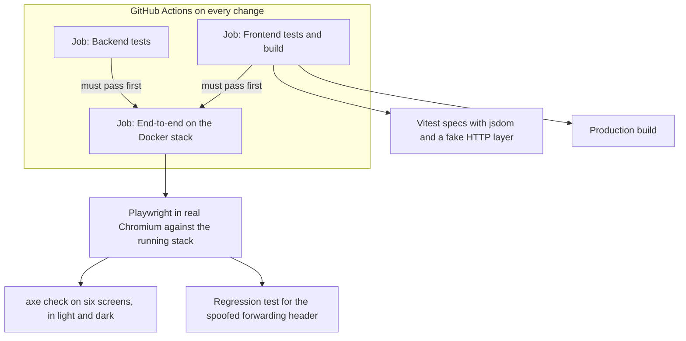
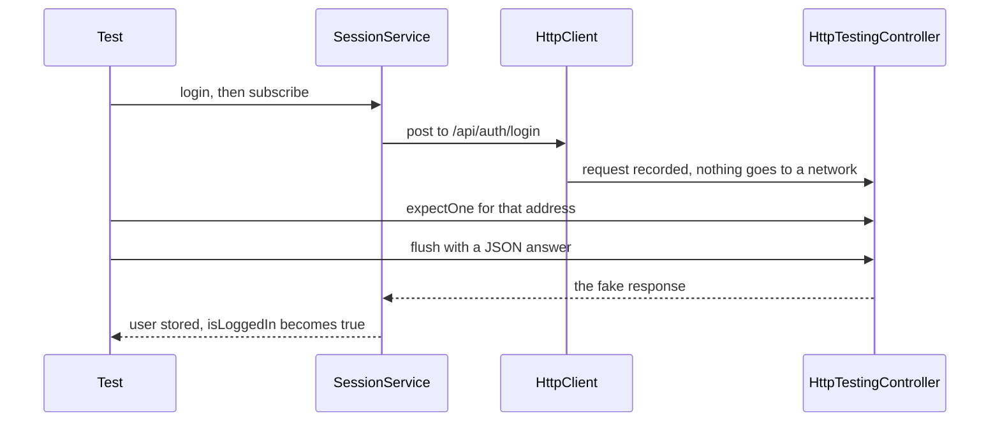

<!-- chapter: 24 | part: III | owner: writer-frontend | tag: book-m6-final | status: expanded -->
<!-- source: X-Forwarded-For spoofing finding (TM2-1, fix 2d82253, PR 1) and its Playwright regression test; axe checks and e2e suite added in Phase 5 (2d10e07); all listings verified with git show book-m6-final -->
# Chapter 24: Testing the frontend

The frontend makes promises: a reader who wasn't given a document never sees it, a page turn asks for exactly one new page of tiles, every screen is readable in light and dark themes. Tests turn those promises into checks that run on every change. This chapter shows the two layers the project uses: fast unit tests with Vitest, and slow, realistic end-to-end tests with Playwright, including automated accessibility checks. It also shows how to read tests as documentation, because in this project the test names are the most honest list of what the frontend is supposed to do.

## Learning objectives

By the end of this chapter, you will be able to:

- Explain the difference between a unit test and an end-to-end test, and why the project has both.
- Read a Vitest spec, including its `describe`, `it` and `expect` structure.
- Write a new test for a pure function and run it.
- Test a component and a service without a real server using `HttpTestingController`.
- Show that something did *not* happen, using `expectNone`.
- Read the Playwright test and explain what the axe accessibility check verifies.
- Explain what CI runs on the frontend.

## Prerequisites

- Chapter 18: testing the backend (the idea of assertions, test isolation).
- Chapters 19–23: TypeScript, components, services, routing.

## Beginner tier: Two kinds of check

### 24.1 Why test at all

A program is a pile of promises, and you can't see a broken promise by looking at code. You see it when a reader is locked out, sees a blank page, or sees a page they shouldn't. **Testing** is the practice of writing small programs that check the main program's promises, so a broken one is caught by a machine within seconds of the change that broke it, rather than by a reader weeks later.

Think of a restaurant kitchen. A cook tastes each sauce before it leaves the kitchen: quick, cheap, done constantly, and it finds a badly seasoned sauce. That's a unit test. Before opening night, the staff also run a full dress rehearsal with real orders, real plates, and real waiters. It is slow and involves everyone, but it finds the problems that only appear when everything works together (the sauce is fine, but it's cold by the time it reaches the table). That's an **end-to-end test**.

**Where the analogy breaks down:** a cook tastes a sauce once, by judgment. A test is code: it runs identically every time, on every change, on machines nobody is watching. Its verdict is a plain pass or fail, and it can only check what somebody thought to write down.

The project has both layers, because each finds problems the other can't (Section 24.9). Figure 24.1 shows where each layer runs, in what job of the automated pipeline, and where the accessibility check fits.



*Figure 24.1 — The frontend test layers and where the accessibility checks run*

*Text description:* A diagram drawn top to bottom with three jobs in a box for the automated pipeline: backend tests, frontend tests and build, and end-to-end tests on the Docker stack. The frontend job runs the Vitest specs and the production build. Both the backend job and the frontend job must pass before the end-to-end job starts. The end-to-end job runs Playwright in a real browser, and that run includes the accessibility check on six screens in both themes and the regression test for the spoofed forwarding header.

<!-- source: ci.yml, playwright.config.ts and secure-viewing.spec.ts at book-m6-final; the six screens are sign-in, admin, upload, manage, document list and viewer -->

The end-to-end job starts only after both the backend job and the frontend job have passed (`needs: [backend, frontend]` in `ci.yml`). The frontend jobs on the left are fast and isolated; the end-to-end job on the right is slow and realistic. The accessibility check is not a separate tool run on its own: it is a step inside the end-to-end test, so it looks at the pages exactly as the real stack serves them.

### 24.2 Unit tests with Vitest

A unit test runs a small piece of code in isolation and checks its result. **Vitest** is the test runner: it finds files ending in `.spec.ts` (a **spec** is a file of tests, short for specification), runs them, and reports which checks passed. It plays the role JUnit did for Java (Chapter 18). You run it with `npm test` (which is `ng test`, Chapter 20). The simplest specs in the project test a pure function, like the idle-timeout arithmetic from Chapter 19:

**Listing 24.1 — `idle.spec.ts` (book-m6-final)**

```typescript
import { idleState } from './idle';

describe('idleState', () => {
  const t0 = 1_000_000;

  it('is active well before the timeout', () => {
    expect(idleState(t0 + 10 * 60_000, t0, 1800)).toEqual({ kind: 'active' });
  });

  it('warns in the last five minutes, counting down', () => {
    expect(idleState(t0 + 26 * 60_000, t0, 1800)).toEqual({ kind: 'warning', secondsLeft: 240 });
  });

  it('expires once the timeout has passed', () => {
    expect(idleState(t0 + 30 * 60_000, t0, 1800)).toEqual({ kind: 'expired' });
  });

  it('scales the warning window down for short timeouts', () => {
    expect(idleState(t0 + 30_000, t0, 120)).toEqual({ kind: 'active' });
    expect(idleState(t0 + 70_000, t0, 120)).toEqual({ kind: 'warning', secondsLeft: 50 });
  });
});
```

*Path: `frontend/src/app/core/idle.spec.ts`*

- `describe('idleState', () => { ... })` groups related tests under a name.
- `it('...', () => { ... })` is one test, named as a sentence about behavior. When it fails, the name tells you what broke.
- `expect(actual).toEqual(expected)` compares values, looking inside objects. If they differ, the test fails and shows both.
- `1_000_000` is a number written with underscores to make it readable. `60_000` is 60,000 milliseconds, one minute, so `t0 + 26 * 60_000` means "26 minutes after time zero".
- Notice `describe`, `it` and `expect` are never imported. `tsconfig.spec.json` (Chapter 20) loads `vitest/globals`, which makes them available everywhere in spec files.

Read the second test as arithmetic. The timeout is 1,800 seconds (30 minutes) and 26 minutes have passed, so 4 minutes, or 240 seconds, remain; that is inside the last five minutes, so the state is a warning with 240 seconds left. The last test shows a design detail. With a 120-second timeout, the warning window shrinks to half the timeout (60 seconds). At 30 seconds in, with 90 seconds left, the state is still `active`. At 70 seconds in, with 50 left, it is a warning.

Times are passed in as arguments rather than read from the clock, so the tests are instant and repeatable: this is why `idleState` was written as a pure function (Chapter 19). If it called `Date.now()` inside, the test would need to freeze or fake time, which is clumsier.

> **Note:** Vitest 5.0.1 and its DOM simulator jsdom 30 are used at `book-m6-final`. Tags `book-m1-accounts` to `book-m5-platform` use Vitest 4.0.8 and jsdom 28. The specs quoted here read the same either way.

The **jsdom** package is a pretend browser written in JavaScript, so component specs can create elements and read `localStorage` without opening a real browser.

**Running the specs.** In a terminal, `npm test` starts in *watch mode*: it runs the specs once, then keeps running and runs them again whenever you save a file. Angular's test builder turns watch mode on when a terminal is attached and off otherwise (its schema says "Defaults to `true` in TTY environments and `false` otherwise"). That can look like a hang if you expect the command to finish. Press Ctrl+C to stop it. For a single run that exits, as in CI and in this chapter's exercises, use `npx ng test --watch=false`. No browser is needed for either: the specs run in Node with jsdom.

### 24.3 Worked example: adding a test

The best way to learn a test framework is to add a test. Suppose you want to pin down the exact moment the warning starts, the *boundary*, because boundaries are where bugs live. Reading `idleState` (Chapter 19, Listing 19.3): with a 1,800-second timeout, the warning window is `Math.min(300, 1800 / 2)`, which is 300. The state is a warning when `secondsLeft <= 300`. So exactly 1,500 seconds after activity, 300 seconds remain and the state should be a warning; one second earlier, 301 remain and it should be active.

Add these to the `describe` block in `idle.spec.ts`:

**Example 24.1 — Two boundary tests for `idleState` (teaching example, not repository code)**

```typescript
  it('starts warning exactly when five minutes remain', () => {
    expect(idleState(t0 + 1_500_000, t0, 1800)).toEqual({ kind: 'warning', secondsLeft: 300 });
  });

  it('is still active one second earlier', () => {
    expect(idleState(t0 + 1_499_000, t0, 1800)).toEqual({ kind: 'active' });
  });
```

Run the specs from `frontend/` (Section 24.2 explains watch mode; `npx ng test --watch=false` runs once and exits). Both should pass. Now try the experiment that makes tests worth having: change `<=` to `<` in `idle.ts` (in a scratch copy) and run again. The first new test fails, and the output shows the expected `warning` and the received `active`. The test noticed a one-character change that no reader would have spotted for weeks. Put the character back.

Three habits are visible in this small example: name the test after the behavior, test the edges of a rule and not only the middle, and make a test *fail* at least once to prove it can.

### 24.4 Testing components and services

Components and services need Angular around them. Angular's **TestBed** builds a small test-only application: you tell it which providers to use (the services and settings, Chapter 22), ask it for objects, and it wires dependencies as in the real app. The trick for HTTP is to swap the real network for a fake: `provideHttpClientTesting()` replaces it, and `HttpTestingController` lets the test say exactly which request it expects and what answer to give.

**Listing 24.2 — `auth.guard.spec.ts` (book-m6-final, excerpt)**

```typescript
describe('route guards', () => {
  beforeEach(() => {
    TestBed.configureTestingModule({ providers: [provideRouter([]), provideHttpClient(), provideHttpClientTesting()] });
  });

  function signIn(role: 'READER' | 'ADMIN', mustChangePassword: boolean): void {
    TestBed.inject(SessionService).login('someone', 'pw').subscribe();
    TestBed.inject(HttpTestingController).expectOne('/api/auth/login')
      .flush({ username: 'someone', role, sessionTimeoutSeconds: 1800, mustChangePassword });
  }
  // ... helpers `run` and `path` omitted

  it('sends signed-out users to login with a return URL', () => {
    expect(path(run(authGuard, '/viewer/abc?page=3'))).toBe('/login?returnUrl=%2Fviewer%2Fabc%3Fpage%3D3');
  });

  it('keeps readers out of admin screens', () => {
    signIn('READER', false);
    expect(path(run(roleGuard('ADMIN'), '/admin'))).toBe('/documents');
    expect(run(authGuard, '/documents')).toBe(true);
  });
});
```

*Path: `frontend/src/app/core/auth.guard.spec.ts`*

(Excerpt: the second test in the file, about a password that an administrator set, is omitted, as are the two helper functions.)

- `beforeEach` runs before every test, giving each a fresh setup so tests can't affect each other. This is **test isolation**: the outcome of one test must never depend on another having run.
- `provideRouter([])` gives the guards a router with no routes, which is enough to build redirect addresses. `provideHttpClient()` plus `provideHttpClientTesting()` provides an HTTP client that never touches a network.
- `TestBed.inject(SessionService)` retrieves the real service, wired to the fake HTTP layer.
- `.login('someone', 'pw').subscribe()` starts the request (nothing is sent until someone subscribes, Chapter 22).
- `expectOne('/api/auth/login')` asserts that exactly one request to that address was made, and `.flush({...})` answers it with the given JSON, as if the server had replied. The test never opens a network connection.
- The signed-in state is created by *performing a real sign-in against the fake*, not by poking the service's internals, so the test exercises the same path the app uses.

The helper functions the excerpt omits deserve a sentence. `run` calls a guard inside `TestBed.runInInjectionContext`, because guards use `inject(...)` and that only works inside an injection context (Chapter 22). `path` turns a redirect object into its text form, so tests can compare plain strings.

Figure 24.2 shows what happens when a test uses the fake HTTP layer. The service believes it is talking to a server; the controller is listening instead.



*Figure 24.2 — Testing a service with `HttpTestingController`*

*Text description:* A sequence diagram with four participants: the test, the session service, HttpClient and the HttpTestingController. The test calls login and subscribes. The service posts through HttpClient, and the request is recorded by the controller instead of going to a network. The test then tells the controller which request it expects and supplies a fake JSON answer. The controller delivers that answer to the service, which stores the user, and the test checks that the reader is signed in.

<!-- source: auth.guard.spec.ts at book-m6-final (signIn helper), provideHttpClientTesting -->

The point to notice is that the test sits on both sides: it starts the request through the service and then plays the server through the controller. The service code under test is the same code that runs in the browser.

### 24.5 Testing a big component: the viewer

The viewer is the biggest component, and its spec needs a setup helper, `create`, used by every test:

**Listing 24.3 — `viewer.component.spec.ts` (book-m6-final, excerpt: the fixture and `create`)**

```typescript
const DOC: DocumentDetail = {
  documentId: 'doc-1',
  title: 'Doc',
  pageCount: 5,
  owner: 'owner',
  visibility: 'EVERYONE',
  createdAtEpochSeconds: 0,
  updatedAtEpochSeconds: 0,
  canManage: false,
  sharedWith: null,
  pages: Array.from({ length: 5 }, (_, page) => ({
    page, rows: 1, cols: 1, tileSize: 256, pageWidthPx: 200, pageHeightPx: 200,
  })),
  tileVersion: 1,
};

describe('ViewerComponent navigation', () => {
  let http: HttpTestingController;

  function create(queryParams: Record<string, string> = {}): ViewerComponent {
    TestBed.configureTestingModule({
      imports: [ViewerComponent],
      providers: [
        provideRouter([]),
        provideHttpClient(),
        provideHttpClientTesting(),
        {
          provide: ActivatedRoute,
          useValue: {
            snapshot: {
              paramMap: convertToParamMap({ documentId: 'doc-1' }),
              queryParamMap: convertToParamMap(queryParams),
            },
          },
        },
      ],
    });
    http = TestBed.inject(HttpTestingController);
    const component = TestBed.createComponent(ViewerComponent).componentInstance;
    component.ngOnInit();
    http.expectOne('/api/documents/doc-1').flush(DOC);
    return component;
  }
```

*Path: `frontend/src/app/features/viewer/viewer.component.spec.ts`*

Several ideas at once:

- `DOC` is a **fixture**: a realistic sample of the data the API would return, typed with the same `DocumentDetail` interface the app uses (Chapter 19). Because it's typed, the compiler checks that the fixture matches the interface; if the API's shape changes and the interface is updated, this fixture stops compiling, which alerts the developer to update it. That is a benefit of types: the test data can't quietly drift. (The type is still a promise about the real server, Chapter 19, Section 19.9.)
- `Array.from({ length: 5 }, (_, page) => ({...}))` builds five page descriptions. The underscore names an argument the code doesn't use.
- The provider `{ provide: ActivatedRoute, useValue: {...} }` replaces the real route information with a hand-made object: "the address is `.../doc-1`, and the query parameters are these". It is a **stub**, a stand-in with only enough behavior. The viewer only reads `snapshot.paramMap` and `snapshot.queryParamMap`, so that is all the stub provides. This is how a test controls "what if the address says `?page=3`?" without a browser.
- `component.ngOnInit()` is called by hand (Chapter 21 lifecycle hooks) so the test decides exactly when the viewer starts loading, and the `expectOne` right after it proves that it asked for the document, and `flush(DOC)` supplies the answer.

With that in place, the individual tests are short, as the keyboard test shows:

**Listing 24.4 — `viewer.component.spec.ts` (book-m6-final, excerpt: keyboard navigation)**

```typescript
  it('turns pages with the arrow keys and jumps with Home/End', () => {
    const viewer = create();
    expectGridRequestFor(0);

    viewer.onKeydown(new KeyboardEvent('keydown', { key: 'ArrowRight' }));
    expect(viewer.currentPage()).toBe(1);
    expectGridRequestFor(1);

    viewer.onKeydown(new KeyboardEvent('keydown', { key: 'End' }));
    expect(viewer.currentPage()).toBe(4);
    expectGridRequestFor(4);
    // ... Home key check omitted
  });
```

*Path: `frontend/src/app/features/viewer/viewer.component.spec.ts`*

The helper `expectGridRequestFor(page)` asserts that the viewer asked the API for that page's signed tile URLs. The test proves two things at once: the keyboard moves the page number, and each page turn triggers exactly one new request. The spec builds a `KeyboardEvent` by hand and hands it to the component's method, the same method the real `@HostListener` (Chapter 23) calls.

## Intermediate tier: What each spec protects

*On a first read you can skip to "In this project"; Part IV comes back to this.*

### 24.6 Specs as executable requirements

Read the test *names* in the project and you get a list of promises. Seven of them are about the viewer:

- "opens the page named in ?page= (1-based)"
- "ignores an out-of-range ?page= and resumes the last page read instead"
- "leaves keys alone while typing in a field or with modifiers held"
- "turns pages with a horizontal swipe, but not when zoomed in"
- "notices a replaced document from its tile URLs and reloads it with a notice"
- "stops instead of reloading forever when tiles are gone but the document has not changed"
- "shows the access-lost state when the document stops being available mid-read"

Each corresponds to a behavior from Chapters 22 and 23. The other specs cover other screens. The document list's filter and access labels are tested. So is the manage screen asking for confirmation before removing someone's access. The upload component's refusal of non-PDFs and oversized files before anything is uploaded is tested, and so is the admin screen's polling rule.

A useful discipline follows from this: **name tests as sentences about behavior**, not about methods. "opens the page named in ?page=" tells a future maintainer what must stay true, even if the method that does it is renamed. A test called `testInitialPage` tells them nothing when it fails.

### 24.7 Proving that nothing happened

Some of the most important behaviors are *non-events*: a request that must not be sent. The manage screen asks for a second click before removing someone's access, because removal takes effect immediately, even for pages already open (Chapter 22). The spec proves that the first click sends nothing:

**Listing 24.5 — `manage-upload.component.spec.ts` (book-m6-final, excerpt: the unshare test)**

```typescript
describe('ManageDocumentComponent sharing', () => {
  it('asks before removing someone, and only then calls the server', () => {
    TestBed.configureTestingModule({
      imports: [ManageDocumentComponent],
      providers: [
        provideRouter([]), provideHttpClient(), provideHttpClientTesting(),
        {
          provide: ActivatedRoute,
          useValue: { snapshot: { paramMap: convertToParamMap({ documentId: 'doc-1' }), queryParamMap: convertToParamMap({}) } },
        },
      ],
    });
    const http = TestBed.inject(HttpTestingController);
    const manage = TestBed.createComponent(ManageDocumentComponent).componentInstance;
    manage.ngOnInit();
    http.expectOne('/api/documents/doc-1').flush(DOC);

    manage.unshare('reader');
    expect(manage.confirmingUnshare()).toBe('reader');
    http.expectNone((req) => req.method === 'DELETE');

    manage.unshare('reader');
    http.expectOne((req) => req.method === 'DELETE' && req.url.endsWith('/doc-1/shares/reader')).flush([]);
    expect(manage.document()?.sharedWith).toEqual([]);
  });
});
```

*Path: `frontend/src/app/features/documents/manage-upload.component.spec.ts`*

Follow the middle of the test. The first `unshare('reader')` should only set the "confirming" state; `expectNone(...)` asserts that no request matching the function was made (here: any `DELETE`). The second `unshare('reader')` is the confirmation, and now `expectOne` finds exactly one `DELETE` to `.../doc-1/shares/reader`, which the test answers with an empty list; the last line checks the component updated its own copy of who has access. Notice that `expectOne` and `expectNone` can take a function instead of a string, to match on method or address flexibly.

### 24.8 Testing a form's checks without a browser

The upload component checks a chosen file before uploading anything. To test it, the spec must fake a file being picked, which is a good look at how tests bend the platform:

**Listing 24.6 — `manage-upload.component.spec.ts` (book-m6-final, excerpt: file checks)**

```typescript
describe('UploadComponent file checks', () => {
  function pick(upload: UploadComponent, file: File): void {
    const input = document.createElement('input');
    Object.defineProperty(input, 'files', { value: [file] });
    upload.onFileSelected({ target: input } as unknown as Event);
  }

  function create(): UploadComponent {
    TestBed.configureTestingModule({
      imports: [UploadComponent],
      providers: [provideRouter([]), provideHttpClient(), provideHttpClientTesting()],
    });
    return TestBed.createComponent(UploadComponent).componentInstance;
  }

  it('refuses a file that is not a PDF before uploading anything', () => {
    const upload = create();
    pick(upload, new File(['hello'], 'notes.txt', { type: 'text/plain' }));
    expect(upload.errorMessage()).toBe('Please choose a PDF file.');
  });

  it('refuses a PDF over the size limit and says how big it was', () => {
    const upload = create();
    const big = new File(['x'], 'big.pdf', { type: 'application/pdf' });
    Object.defineProperty(big, 'size', { value: 60 * 1024 * 1024 });
    pick(upload, big);
    expect(upload.errorMessage()).toBe('That file is 60.0 MB; the limit is 50 MB.');
  });
```

*Path: `frontend/src/app/features/documents/manage-upload.component.spec.ts`*

(Excerpt: the third test, which checks that a title is suggested from the file name, is omitted.) A real file input can't be filled from code for security reasons. So `pick` builds an `<input>` element with jsdom and uses `Object.defineProperty` to give it a `files` list. The test then hands the component a fake event whose `target` is that input. To test the size limit without creating a 60 MB file, the second test *overrides the file's reported size* with `Object.defineProperty`, a one-line trick that turns a two-byte file into a "60 MB" one. Notice the cast `as unknown as Event`: the fake event isn't a real `Event`, so the test tells the compiler "trust me", a shortcut acceptable in tests and rarely elsewhere.

These tests protect the *convenience* checks from Chapter 23. They do not, and cannot, prove the server refuses oversized uploads; that is a backend test (Chapter 18).

### 24.9 What unit tests can't catch

Not everything is testable at unit level. The specs in Listings 24.1 to 24.6 run with a fake network and a pretend browser. The viewer's real `fetch()` calls, the actual signed URLs, the nginx proxy, the cookies and the real backend are absent. A bug in how nginx forwards a header, or in a real cookie's attributes, is invisible to them. That is what the second layer is for. It is slower, needs a running stack, and fails for more reasons (a network hiccup, a slow machine), so the project keeps it to a few carefully chosen journeys and relies on the unit layer for detail.

### 24.10 End-to-end tests with Playwright

**Playwright** drives a real browser (Chromium) against a real running stack: it clicks, types and reads what the page shows, as a person would. The configuration says where the stack lives:

**Listing 24.7 — `playwright.config.ts` (book-m6-final)**

```typescript
export default defineConfig({
  testDir: './e2e',
  timeout: 120_000,
  retries: process.env['CI'] ? 1 : 0,
  reporter: process.env['CI'] ? [['list'], ['html', { open: 'never' }]] : 'list',
  use: {
    baseURL: process.env['E2E_BASE_URL'] ?? 'http://localhost:8081',
    trace: 'retain-on-failure',
  },
  projects: [{ name: 'chromium', use: { ...devices['Desktop Chrome'] } }],
});
```

*Path: `frontend/playwright.config.ts`*

(Excerpt: the file's leading comment and import are omitted.) The comment in the file says the tests need a running full stack (`docker compose --profile full up -d --build`, served at port 8081, Chapter 10) and an admin account supplied through `E2E_ADMIN_USER` and `E2E_ADMIN_PASSWORD` environment variables. Never write a password into a file; the test reads it from the environment and skips itself if it's missing. Line by line: `timeout: 120_000` allows a test two minutes, because uploading and rendering a PDF takes time. `retries` allows one automatic retry only in CI (locally you want failures to show at once). The reporter prints a plain list, and in CI also writes an HTML report. `baseURL` lets tests write `page.goto('/login')` instead of a full address, and can be overridden with `E2E_BASE_URL`. `trace: 'retain-on-failure'` saves a recording of a failed run, screenshots and network calls included, so a failure in CI can be replayed on your machine.

**Running the end-to-end tests yourself.** You need the full stack running, a browser for Playwright to drive, and the administrator password. Follow these steps once, and repeat the last step whenever you want to run the suite.

*Step 1.* From the repository root, start the stack: `docker compose --profile full up -d --build`. The web app is then at `http://localhost:8081`, which is where the tests look by default (the `E2E_BASE_URL` variable overrides it).

*Step 2.* Make sure you know a working administrator password. On an empty database the first start creates an `admin` account, and how its password was chosen matters. If you set `BOOTSTRAP_ADMIN_PASSWORD` in your own `.env` file before that first start, that password works as it is. If you left it empty, the app generates a random password, prints it once in the startup log (`docker compose logs app`), and marks the account as *must change password*. The suite signs in as `admin` and expects to land on the document list, but an account with that flag is sent to the account page (Chapter 23, section 23.15), so the run fails there.

The simplest way is to set `BOOTSTRAP_ADMIN_PASSWORD=<your-admin-password>` in `.env` before you start a stack for the first time, which is what the project's own CI does with a throwaway value. If the stack has already started with a generated password, sign in once in the browser at `http://localhost:8081`, choose your own password on the account page, and use that new password as `E2E_ADMIN_PASSWORD`. (On a throwaway stack you can also delete its data with `docker compose down -v` and start again with the variable set.) Treat the password as a secret: type it into your terminal, and never put it in a file you commit.

*Step 3.* Install the dependencies and the browser Playwright drives. A first run without the browser download fails with an error saying the browser executable doesn't exist.

**Example 24.2 — Installing the test dependencies and the browser (teaching example, not repository code)**

```bash
cd frontend
npm ci
npx playwright install chromium
```

On Linux, Playwright may also need system libraries; the project's CI uses `npx playwright install --with-deps chromium` for that reason.

*Step 4.* Put the password in an environment variable for the current terminal session and run the suite. The variable name is what the spec reads; the value is yours.

**Example 24.3 — Running the suite on each platform (teaching example, not repository code)**

```bash
E2E_ADMIN_PASSWORD='<your-admin-password>' npm run e2e
```

```powershell
$env:E2E_ADMIN_PASSWORD = '<your-admin-password>'
npm run e2e
```

```text
set E2E_ADMIN_PASSWORD=<your-admin-password>
npm run e2e
```

The first block is for bash (macOS, Linux, and Git Bash on Windows), the second for PowerShell, and the third for the Windows Command Prompt. `E2E_ADMIN_USER` defaults to `admin`. Without `E2E_ADMIN_PASSWORD` the main test skips itself. The suite creates accounts, so run it only against a stack you can throw away.

The main test, `e2e/secure-viewing.spec.ts`, tells one story in five steps:

1. An administrator creates three users: a publisher, a reader and an outsider.
2. The publisher signs in for the first time with a temporary password and is forced to change it (the flow from Chapter 23).
3. The publisher uploads a two-page PDF that the test generates, and shares it with the reader.
4. The reader sees every tile load and turns the page with the keyboard (the URL changes to `?page=2`).
5. The outsider can neither see the document in their list nor open it by address, and gets "hasn't been shared with you". Playwright's own helpers make each step readable, for example `page.fill('#username', username)` and `page.click('button[type=submit]')`. Every user name is unique per run (`e2e-pub-<time>`), and an `afterAll` disables the created accounts, with a warning in the source: never point this suite at production, since it creates accounts.

One story with several actors, rather than many small tests, is a deliberate economy: the setup (three users, a PDF) is the expensive part, so the test reuses it for several assertions. The cost is that a failure early in the story hides everything after it; the trace helps.

### 24.11 Why Playwright and not the alternatives

The obvious alternatives are other browser-automation tools, such as Cypress or Selenium, and the simpler alternative of testing only with unit tests. The project uses Playwright with a `@axe-core/playwright` add-on. It records no comparison with other tools, so what follows are features its tests rely on, not recorded reasons. Playwright can run several independent browser contexts in one test (the administrator, publisher, reader and outsider each have their own cookies, `browser.newContext()`). It can emulate the reader's color scheme for the theme checks (Section 24.12). It can also make raw API requests with a browser's cookies for the header test (Section 24.13). Skipping the end-to-end layer would have left the proxy, the cookies and the real tile pipeline untested by any automation.

## Advanced tier: Accessibility checks and a regression test

*On a first read you can skip to "In this project"; Part IV comes back to this.*

### 24.12 Accessibility checks with axe-core

**axe-core** is an engine that inspects a rendered page against the Web Content Accessibility Guidelines (Chapter 21) and reports violations such as low-contrast text, form fields with no label, or missing names on buttons. `@axe-core/playwright` lets a Playwright test run it on the current screen. The project wraps it in a helper used on the sign-in, admin, upload, manage, document-list and viewer screens:

**Listing 24.8 — `secure-viewing.spec.ts` (book-m6-final, excerpt: `expectAccessible`)**

```typescript
/** No serious or critical WCAG 2.1 A/AA violations on the current screen, in light and dark themes. */
async function expectAccessible(page: Page, screen: string): Promise<void> {
  for (const colorScheme of ['light', 'dark'] as const) {
    await page.emulateMedia({ colorScheme });
    const results = await new AxeBuilder({ page }).withTags(['wcag2a', 'wcag2aa', 'wcag21a', 'wcag21aa']).analyze();
    const serious = results.violations
      .filter((v) => v.impact === 'serious' || v.impact === 'critical')
      .map((v) => `${v.id}: ${v.help} (${v.nodes.map((n) => n.target.join(' ')).join(', ')})`);
    expect(serious, `accessibility on ${screen} (${colorScheme})`).toEqual([]);
  }
  await page.emulateMedia({ colorScheme: 'light' });
}
```

*Path: `frontend/e2e/secure-viewing.spec.ts`*

Read it as a recipe. For each of two color schemes, it tells the browser which theme the system prefers (`emulateMedia`). It runs axe restricted to the WCAG 2.0 and 2.1 A and AA rules (`withTags`), keeps only the *serious* and *critical* findings, and formats each as "rule id: help text (which elements)". Then it asserts that the list is empty. The message string passed as the second argument to `expect` tells the reader of a failure which screen and theme it happened on. At the end it resets to light so later steps start from a known state. Because `emulateMedia` triggers the `prefers-color-scheme: dark` block of `styles.css` (Chapter 21), both palettes are checked; a contrast failure that exists only in dark mode can't hide.

> **Note:** Automated checks catch only a portion of accessibility problems (contrast, missing labels, wrong roles). They can't tell whether a screen makes sense to someone using a screen reader. Treat a green axe run as a floor, not a finish line.

The accessibility check arrived with the e2e suite at `book-m5-platform`, the same milestone in which `styles.css` gained the `--on-accent` token and a darker `--muted` (the git diff of `styles.css` between `book-m4-reading` and `book-m5-platform` shows both). The tokens made the fix a two-line change; the check keeps it fixed.

### 24.13 A regression test for a real incident

A **regression test** is a test written so that a fixed bug cannot come back unnoticed. Chapter 22 described how an early nginx configuration appended to a client-supplied `X-Forwarded-For` header, which the backend trusted, so an attacker could reset the sign-in throttle by changing the header on every attempt. One of the project's AI review agents found it during a live test through the proxy. The second e2e test is the regression test that keeps it fixed. It sends six wrong-password sign-ins, each claiming a different address, and expects the first five to be refused with 401 and the sixth with 429:

**Listing 24.9 — `secure-viewing.spec.ts` (book-m6-final, excerpt)**

```typescript
  expect(statuses.slice(0, 5)).toEqual([401, 401, 401, 401, 401]);
  expect(statuses[5]).toBe(429);
```

*Path: `frontend/e2e/secure-viewing.spec.ts`*

The test copies the CSRF token from the `XSRF-TOKEN` cookie into the `X-XSRF-TOKEN` header by hand (`postJson`), because a raw API client doesn't have Angular's automatic behavior (Chapter 22). A unit test could not have caught the bug: it lived in the nginx configuration, which only a test against the whole stack exercises. The lesson the incident teaches about testing is the same as the one about security: test through the real front door.

### 24.14 Testing time-dependent behavior without waiting

The admin dashboard *polls* (asks the server again and again on a timer) every five seconds. It must stop when the page has been left alone, because each poll counts as activity and would keep an idle administrator signed in (Chapter 22). Nobody wants a test that waits two minutes. The project's answer was to extract the *decision* into a pure function, `shouldPoll(now, lastInputAt, hidden)`, and pass the time in:

**Listing 24.10 — `admin-dashboard.component.spec.ts` (book-m6-final, excerpt: polling)**

```typescript
describe('admin sessions polling', () => {
  const now = 10_000_000;

  it('refreshes while someone is using the visible page', () => {
    expect(shouldPoll(now, now - 30_000, false)).toBe(true);
  });

  it('stops when the page has been left alone, so polls never keep an idle admin signed in', () => {
    expect(shouldPoll(now, now - POLL_IDLE_MS, false)).toBe(false);
  });

  it('stops while the tab is hidden', () => {
    expect(shouldPoll(now, now, true)).toBe(false);
  });
});
```

*Path: `frontend/src/app/features/admin/admin-dashboard.component.spec.ts`*

The idea generalizes: when a behavior depends on time, randomness or the outside world, move the *decision* into a function whose inputs are all parameters. The function can be tested directly, and the thin remaining code that gathers the inputs is small enough to trust or to cover in an end-to-end test.

### 24.15 Running tests in CI

**Continuous integration (CI)** runs the tests automatically on every proposed change. `.github/workflows/ci.yml` has a job named "Frontend tests & build": it installs Node 24, runs `npm ci --no-audit --no-fund` (Chapter 20), `npx ng test --watch=false` (Vitest once, not in watch mode) and `npx ng build --configuration production`. A separate "End-to-end (Docker stack)" job starts the whole stack in Docker, installs Chromium and runs `npx playwright test`; it needs the backend and frontend jobs to pass first. Ordering the slow job after the fast ones means a simple mistake fails in a minute, not ten. Chapter 36 covers the whole pipeline.

## Common mistakes

- **Tests that depend on each other.** If a test passes only when another ran first, it will fail mysteriously when run alone. Use `beforeEach` to build a fresh setup.
- **Forgetting to call `.subscribe()` in a test.** With `HttpTestingController`, no request is made until something subscribes, so `expectOne` fails with "no request found". Calling the service method isn't enough (Chapter 22).
- **Forgetting `http.verify()`.** `expectOne` checks for a request you expected; `verify()` (used in other tests of the viewer spec, not shown in the excerpts) also fails if an *unexpected* request is outstanding. Without it, extra requests slip by.
- **Never making a test fail.** A test that can't fail proves nothing. After writing one, break the code on purpose and watch it turn red, as in Section 24.3.
- **Asserting on implementation details.** A test that checks a private method's name breaks when you refactor, though behavior is unchanged. Assert on what a user or caller can observe.
- **Testing the framework.** Checking that `@if` shows an element when a signal is true tests Angular, not the project. Test the project's own decisions.
- **Flaky end-to-end waits.** Sleeping a fixed time and hoping is fragile. The project's Playwright tests wait for what they need, for example `await expect(rd.locator('.tile.pending')).toHaveCount(0, { timeout: 30_000 })`, which waits *up to* 30 seconds and continues as soon as the condition is true.
- **Real credentials in tests.** Passwords come from the environment (`E2E_ADMIN_PASSWORD`) and the temporary passwords in the e2e file belong to accounts that exist for one run and are disabled afterward. Never commit a real secret.
- **Running the e2e suite against production.** It creates accounts. Point it at a throwaway stack.

## In this project

| File | First appears | What it does |
|---|---|---|
| `frontend/src/app/core/idle.spec.ts` | book-m4-reading | Pure-function tests |
| `frontend/src/app/features/viewer/viewer.component.spec.ts` | book-m4-reading (more cases at book-m5-platform) | Navigation, replaced-document and access-lost behavior |
| `frontend/src/app/features/documents/document-list.component.spec.ts` | book-m2-documents | Filter and access labels |
| `frontend/src/app/core/auth.guard.spec.ts`, `frontend/src/app/features/documents/manage-upload.component.spec.ts`, `frontend/src/app/features/admin/admin-dashboard.component.spec.ts` | book-m5-platform | Guards, manage and upload, admin |
| `frontend/src/app/app.spec.ts` | book-m1-accounts | Navigation visibility by role |
| `frontend/playwright.config.ts`, `frontend/e2e/secure-viewing.spec.ts` | book-m5-platform | End-to-end and accessibility tests |
| `.github/workflows/ci.yml` | book-m5-platform | Runs both layers in CI |

Run the specs yourself with `npm test` in `frontend/`, and see one at a tag with `git show book-m6-final:frontend/src/app/core/idle.spec.ts`.

## Try it

### Exercise 24.1 ★ Add a boundary test

In Listing 24.1, add a test: with a timeout of 600 seconds and 100 seconds since activity, the state is `active`. Run it.

*Solution:* Appendix C, Exercise 24.1.

### Exercise 24.2 ★ Two requests, one expectation

What does `expectOne` do if the code under test makes two requests to the same URL?

*Solution:* Appendix C, Exercise 24.2.

### Exercise 24.3 ★★ A spec for `SessionService`

Write a spec for `SessionService` that calls `login`, flushes a user, and checks that `isLoggedIn()` becomes true.

*Solution:* Appendix C, Exercise 24.3.

### Exercise 24.4 ★★ Both themes

Why does `expectAccessible` run the check in both light and dark themes?

*Solution:* Appendix C, Exercise 24.4.

### Exercise 24.5 ★★★ Why only end-to-end

Explain why the X-Forwarded-For regression can only be caught by the end-to-end layer, and what a unit test could still add.

*Solution:* Appendix C, Exercise 24.5.

### Exercise 24.6 ★★ Prove it can fail

Take the test "is still active one second earlier" from Example 24.1. Describe a one-character change in `idle.ts` that would make it fail, and say what the failure message would show.

*Solution:* Appendix C, Exercise 24.6.


## Summary

- Unit tests (Vitest) are fast and isolated; end-to-end tests (Playwright) are slow but exercise the real stack. The project needs both.
- `describe`, `it` and `expect` structure a spec; pure functions like `idleState` are the easiest to test, and test the boundaries, not only the middle.
- `TestBed` with `HttpTestingController` tests components and services against a fake server, using fixtures and stubs to control the world; `expectNone` proves a request was not sent.
- Test names read as a list of the app's promises, so name them as sentences about behavior.
- When behavior depends on time, extract the decision into a pure function.
- axe-core checks WCAG A/AA in both themes, failing on serious or critical issues; it complements, not replaces, human review.
- A regression test keeps a past incident, the spoofed forwarding header, from returning, and only a whole-stack test could have caught it.
- CI runs `ng test`, a production build and the end-to-end suite on every change, with the slow job last.

This closes Part III. Part IV rebuilds the app milestone by milestone, and you now have the vocabulary to follow every frontend change in it.

## Further reading

- Vitest documentation: https://vitest.dev/
- Angular documentation, "Testing" and "HttpClient testing": https://angular.dev/
- Playwright documentation, "Accessibility testing": https://playwright.dev/
- Deque, axe-core documentation: https://www.deque.com/axe/
