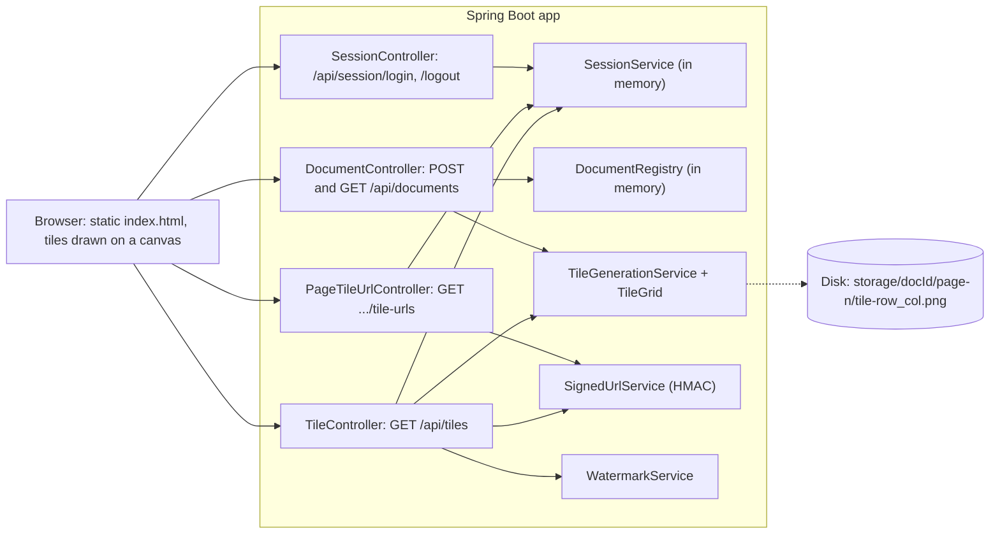

<!-- chapter: 25 | part: IV | owner: writer-app | tag: book-m0-mvp | status: draft -->
# Chapter 25: Milestone 0: The tiled viewer

## Learning objectives

- Explain why the first version of the viewer never sends the PDF file to the browser.
- Compute how many tiles cover a page and why the last row and column are shorter.
- Describe how a signed URL proves a tile request is genuine without a database lookup.
- Read `TileGrid`, `SignedUrlService` and `TileController` at `book-m0-mvp` and say what each does and what it protects against.

## Prerequisites

Chapters 3–6 (Java), 8 (the web), 11–12 (Spring Boot and REST), 17 (signatures and PDFs) and
18 (testing), as listed in `book/OUTLINE.md`. At this milestone the project uses Spring Boot 3.3.4, Java 21 and
PDFBox 3.0.3 (`pom.xml` at `book-m0-mvp`); the upgrade to Spring Boot 4 comes in Chapter 30.

## Beginner tier: Serving a page as small tiles

### 25.1 Requirements and the threat we start with

The project starts from one product goal: let a person read a PDF in a browser without being
able to walk away with the file. The first commit describes the approach: serve documents
without exposing the source file, turn each page into an image, cut that image into tiles at
ingest time, hand out the tiles one at a time through short-lived signed URLs tied to a
session, stamp each tile with the identity of the person requesting it, and reassemble the
tiles on a canvas in the browser.
<!-- source: commit b6aef4e message; dossier/timeline.md#milestone-0 -->

Read that as a list of small defenses, each closing one door:

- **No source file.** There is no URL that returns the PDF, so there is nothing to save.
- **Tiles, not pages.** A page arrives as many small images, so one request never yields a whole page.
- **Signed, short-lived URLs.** A leaked link stops working soon and can't be edited to point elsewhere.
- **Watermark at request time.** Every tile carries the viewer's identity, so a screenshot is traceable.

This is a deterrent, not a vault. Anyone who can see pixels can photograph the screen. The
project's README is explicit about such limits, and the book keeps that honesty: the goal is
to raise the cost of casual copying and to make leaks attributable.

At this tag the product is backend only. It has controllers, services, a session service, an
in-memory `DocumentRegistry`, five unit-test classes and one static `index.html`. There is no
database and no Angular yet.
<!-- source: git ls-tree -r book-m0-mvp; dossier/timeline.md#milestone-0 -->

### 25.2 Tile grid math (`TileGrid`)

**Analogy.** Think of a bathroom wall covered with square tiles. You count how many tiles fit
along the width, rounding up, because a partial tile still has to be cut and placed. **Where
the analogy breaks down:** a real tiler fills gaps with grout; the viewer never pads. Edge
tiles are simply smaller, so putting every tile back at its own position rebuilds the page
exactly.

The math lives in its own class so it can be tested without any PDF library. Two ideas:

1. **Tile count.** For `lengthPx` pixels and tiles of `tileSize` pixels you need
   ceil(lengthPx / tileSize) tiles. Integer arithmetic gives that as
   `(lengthPx + tileSize - 1) / tileSize`.
2. **Cropping.** A tile starts at `(col * tileSize, row * tileSize)` and is `tileSize` wide
   unless the image ends first, in which case it is the remaining width.

**Listing 25.1 — `TileGrid.java` (book-m0-mvp, simplified: Javadoc and imports removed)**

```java
public final class TileGrid {

    private TileGrid() {
    }

    public static int tileCount(int lengthPx, int tileSize) {
        if (lengthPx <= 0 || tileSize <= 0) {
            throw new IllegalArgumentException("lengthPx and tileSize must both be positive");
        }
        return (lengthPx + tileSize - 1) / tileSize;
    }

    public static BufferedImage sliceTile(BufferedImage page, int row, int col, int tileSize) {
        int x = col * tileSize;
        int y = row * tileSize;
        if (x >= page.getWidth() || y >= page.getHeight()) {
            throw new IllegalArgumentException("Tile (" + row + "," + col + ") is outside the image bounds");
        }
        int w = Math.min(tileSize, page.getWidth() - x);
        int h = Math.min(tileSize, page.getHeight() - y);
        return page.getSubimage(x, y, w, h);
    }
}
```

Line by line: the private constructor stops anyone from creating a `TileGrid` object, because
the class only holds functions. `tileCount` rejects zero or negative sizes early, so bad input
fails loudly instead of dividing by zero. `sliceTile` computes the top-left corner, refuses a
tile outside the image, then uses `Math.min` to shorten the last row and column.

The first commit message says a round-trip property test proves the tiles partition a page
without loss. That is why the class has no dependencies: `TileGridTest` can use a synthetic
image instead of a rendered PDF.
<!-- source: commit b6aef4e message; TileGrid.java and TileGridTest.java at book-m0-mvp -->

**Example 25.1.** Compute `tileCount(1000, 256)`. The answer is 4, and the last tile is
232 pixels wide (1000 - 3 * 256).

## Intermediate tier: How the pieces talk to each other

*Assumes the beginner tier. This tier shows how the browser and the server exchange signed, single-use-scope tokens and pixels.*

### 25.3 Signed URLs (`SignedUrlService`)

**Analogy.** A signed URL is like a concert wristband stamped with a seal only the venue owns.
Staff don't consult a guest list at every door; they check the seal. **Where the analogy
breaks down:** a wristband works all night, while a token names one tile and expires at a
fixed time. And a stolen wristband works for whoever wears it, just as a copied URL works
until it expires. That is why Chapter 26 binds tokens to a session more tightly.

The service issues a token that grants access to exactly one tile of one page of one
document, for one session, until a fixed expiry. The token is two base64url strings joined by
a dot: the payload, and an HMAC-SHA256 signature over it. **Base64url** is a way to write any bytes using only letters, digits, hyphen and underscore, so the result is safe inside a URL. **HMAC** (hash-based message
authentication code) mixes a secret key into a hash, so only a holder of the key can produce a
matching signature. Change any field of the payload and the signature no longer matches.

**Listing 25.2 — `SignedUrlService.java` (book-m0-mvp, simplified: Javadoc, `parseCanonical` and the private helpers removed)**

```java
public String issueToken(String documentId, int page, int row, int col, String sessionId) {
    long expiresAt = Instant.now().getEpochSecond() + properties.getUrlTtlSeconds();
    SignedTilePayload payload = new SignedTilePayload(documentId, page, row, col, sessionId, expiresAt);
    String payloadEncoded = base64Url(payload.canonicalString().getBytes(StandardCharsets.UTF_8));
    String signature = base64Url(hmac(payload.canonicalString()));
    return payloadEncoded + "." + signature;
}

public SignedTilePayload verifyAndDecode(String token) {
    String[] parts = token.split("\\.", 2);
    if (parts.length != 2) {
        throw new InvalidTokenException("Malformed token");
    }

    String payloadEncoded = parts[0];
    String providedSignature = parts[1];

    byte[] payloadBytes;
    try {
        payloadBytes = Base64.getUrlDecoder().decode(payloadEncoded);
    } catch (IllegalArgumentException e) {
        throw new InvalidTokenException("Malformed token payload");
    }
    String canonical = new String(payloadBytes, StandardCharsets.UTF_8);

    String expectedSignature = base64Url(hmac(canonical));
    if (!constantTimeEquals(expectedSignature, providedSignature)) {
        throw new InvalidTokenException("Signature mismatch — token was tampered with or forged");
    }

    SignedTilePayload payload = parseCanonical(canonical);
    if (Instant.now().getEpochSecond() > payload.expiresAtEpochSeconds()) {
        throw new InvalidTokenException("Token expired at " + Instant.ofEpochSecond(payload.expiresAtEpochSeconds()));
    }

    return payload;
}
```

Walk through `verifyAndDecode` in order, because the order is the design:

1. **Shape.** Split at the first dot. Two parts, or reject.
2. **Decode** the payload. Text that isn't base64url is rejected.
3. **Recompute** the signature from the decoded payload with the server's secret and compare
   it with the one supplied. The comparison uses `MessageDigest.isEqual`, a constant-time
   check, so an attacker can't learn how many leading characters matched from response timing.
4. **Only then parse** the fields and check the expiry.

The signature is verified before the payload is parsed, so untrusted data reaches the
parsing code only if the server signed it.

The service deliberately does not check that the session is still alive. Its Javadoc explains
why: a tampered or expired token and a revoked session are different failures, and separate
checks keep them distinguishable. `TileController` performs the second check (Section 25.5).
<!-- source: SignedUrlService.java and TileController.java at book-m0-mvp -->

### 25.4 Per-viewer watermarking (`WatermarkService`)

Watermarking could happen at ingest or at serve time. At ingest, every viewer would receive an
identical copy, so a leak couldn't be traced. Stamping a copy per user up front would store N
copies of every tile for N viewers. The project stamps on the way out: one stored tile serves
everyone, and every response is individually attributable.
<!-- source: WatermarkService Javadoc at book-m0-mvp; dossier/decisions.md#d5 -->

**Listing 25.3 — `WatermarkService.java` (book-m0-mvp, simplified: imports and Javadoc removed)**

```java
@Service
public class WatermarkService {

    private static final DateTimeFormatter TIMESTAMP_FORMAT =
            DateTimeFormatter.ofPattern("yyyy-MM-dd HH:mm:ss").withZone(ZoneOffset.UTC);

    public BufferedImage applyWatermark(BufferedImage source, String viewerLabel) {
        BufferedImage stamped = new BufferedImage(
                source.getWidth(), source.getHeight(), BufferedImage.TYPE_INT_ARGB);

        Graphics2D g = stamped.createGraphics();
        try {
            g.setRenderingHint(RenderingHints.KEY_ANTIALIASING, RenderingHints.VALUE_ANTIALIAS_ON);
            g.drawImage(source, 0, 0, null);

            String label = viewerLabel + " · " + TIMESTAMP_FORMAT.format(Instant.now());

            g.setComposite(AlphaComposite.getInstance(AlphaComposite.SRC_OVER, 0.22f));
            g.setColor(Color.RED);
            g.setFont(new Font(Font.SANS_SERIF, Font.BOLD, Math.max(10, source.getHeight() / 12)));
            g.rotate(-Math.PI / 6, source.getWidth() / 2.0, source.getHeight() / 2.0);
            g.drawString(label, -source.getWidth() / 4, source.getHeight() / 2);
        } finally {
            g.dispose();
        }

        return stamped;
    }
}
```

The method copies the tile into a new image, draws the original, then draws one red line of
text ("viewer name, middle dot, UTC time") at 22 percent opacity, rotated 30 degrees around the
tile's center. The `finally` block releases the graphics context even if drawing fails. The
watermark is deliberately simple at this tag. Later milestones make it lighter, two-line and
spaced by measured text width, and add a trace code (Chapter 29).

The cost is real: every tile request decodes a PNG, draws on it and encodes it again. A later
review recorded this as a low-severity limitation (`TM-17`).
<!-- source: WatermarkService.java at book-m0-mvp; dossier/reviews.md TM-17; dossier/decisions.md#d5 -->

### 25.5 The endpoints

Four controllers make up the API. Two matter most for the design.

**Asking for tile URLs.** `PageTileUrlController` answers
`GET /api/documents/{documentId}/pages/{page}/tile-urls`. It checks the session, looks up the
page's grid in the **manifest** (the record of a document's title, page count and tile grid), and issues one signed token per tile, returning a grid of
`/api/tiles?token=...` paths. It never returns a page-level or document-level download link.
<!-- source: PageTileUrlController.java at book-m0-mvp -->

**Redeeming a tile.** `TileController` is the only endpoint that returns pixels.

**Listing 25.4 — `TileController.getTile` (book-m0-mvp, simplified: imports, Javadoc, constructor and fields removed)**

```java
@GetMapping(value = "/api/tiles", produces = MediaType.IMAGE_PNG_VALUE)
public ResponseEntity<byte[]> getTile(@RequestParam String token) throws IOException {
    SignedTilePayload payload = signedUrlService.verifyAndDecode(token);

    // Second, independent check: the token's own expiry can still be in
    // the future while the session it was issued under has since been
    // logged out or timed out.
    String username = sessionService.requireValidSession(payload.sessionId());

    BufferedImage rawTile = tileGenerationService.loadRawTile(
            payload.documentId(), payload.page(), payload.row(), payload.col());

    BufferedImage watermarked = watermarkService.applyWatermark(rawTile, username);

    ByteArrayOutputStream out = new ByteArrayOutputStream();
    ImageIO.write(watermarked, "png", out);

    return ResponseEntity.ok()
            // Deliberately not cacheable beyond a moment — a shared cache
            // holding onto a watermarked-for-someone-else tile would leak it.
            .cacheControl(CacheControl.noStore())
            .body(out.toByteArray());
}
```

The pipeline has four gates in a fixed order: signature and expiry, live session, tile exists,
watermark. Even a request that passes all of them gets one tile. `Cache-Control: no-store`
tells browsers and shared caches not to keep the response, because a copy stamped for one
person must never reach another.

`DocumentController` handles `POST /api/documents` (upload) and `GET /api/documents/{id}`
(manifest). Upload requires a valid session, and its Javadoc notes that a real app would also
check the uploader's role. Chapter 26 adds roles.

#### How ingest stores tiles

`TileGenerationService.ingest` gives the document a random UUID (a 128-bit random identifier), renders each page with PDFBox
at the configured DPI, and calls `tileAndSave`, which slices with `TileGrid` and writes
`{storageRoot}/{documentId}/page-{n}/tile-{row}_{col}.png`. The PDF bytes themselves are not
written to disk. At this tag `application.yml` sets the tile size to 256 pixels, the render
resolution to 150 DPI, the signed-URL lifetime to 120 seconds and the session lifetime to
1,800 seconds.
<!-- source: TileGenerationService.java, DocumentController.java, TileController.java and application.yml at book-m0-mvp -->

## Advanced tier: Sessions and what this version leaves open

*Assumes the earlier tiers. This tier covers the session check behind every token and the gaps that later milestones close.*

### 25.6 A first session service and a one-page viewer

`SessionService` is a minimal in-memory store: `login(username)` creates a random UUID (a 128-bit random identifier) session
id with an expiry, `logout` removes it, and `requireValidSession` returns the username or
throws `SessionExpiredException`. Its own Javadoc calls it a stand-in for a real
authentication system. Because tokens are bound to the session id, ending a session kills
every outstanding URL issued under it, even before the URL's own expiry.

Sign-in at this tag takes only a username, and the session id travels in an `X-Session-Id`
header. The browser side is one static `index.html` that signs in, fetches manifests and tile
URLs, and draws tiles on a canvas. Documents live in an in-memory `DocumentRegistry`, so a
restart forgets them while the tiles stay orphaned on disk.
<!-- source: SessionService.java, git ls-tree at book-m0-mvp; blueprints/v0-mvp.md; dossier/reviews.md TM-8 -->

## In this project

Table 25.1 lists the files to open in your copy of the repository.

**Table 25.1 — Where the concepts live (at `book-m0-mvp`)**

| Concept | Where |
|---|---|
| Tile math | `service/TileGrid.java`, `TileGridTest` |
| Rendering and storage | `service/TileGenerationService.java` |
| Signing | `service/SignedUrlService.java`, `SignedUrlServiceTest` |
| Watermark | `service/WatermarkService.java`, `WatermarkServiceTest` |
| Endpoints | `DocumentController`, `PageTileUrlController`, `TileController`, `SessionController` |
| Sessions | `security/SessionService.java`, `SessionServiceTest` |


## Try it

1. (★) Compute `tileCount` for a page 1,240 pixels wide and 1,754 tall with 256-pixel tiles.
   How many columns and rows, and how wide is the last column?
2. (★★) Run `book-m0-mvp` locally, change one character of a token before the dot and request it.
   `verifyAndDecode` throws `InvalidTokenException`; check `GlobalExceptionHandler` to find the
   HTTP status the client sees, and explain why the order of the checks matters.
3. (★★★) Why does `TileController` not trust the token's expiry alone? Describe a case where
   a token is valid but the request must still be refused.

## Architecture blueprint v0

Figure 25.1 shows the system at this milestone. It is the diagram from
`book/blueprints/v0-mvp.md`.



**Figure 25.1 — Blueprint v0 (`book-m0-mvp`)**

This is the starting point, so nothing changed since a previous version. Signing in takes only
a username, tile URLs are HMAC-signed and bound to the session id, and documents and sessions
live in memory.

## Decisions and challenges

#### Decision: tiles plus signed URLs

**The decision.** Never expose the source PDF: rasterize pages at ingest, slice them into
tiles, deliver tiles through short-lived HMAC-signed URLs bound to a session, and reassemble
them in the browser. **Why this one.** The first commit records this rationale and isolates
the grid math in `TileGrid` with a round-trip test. **The options considered.** The
alternatives weighed at MVP time aren't recorded in the repository history, so this book
doesn't invent them. **What it costs.** Every tile request does work on the server
(Section 25.4), and the design stays a deterrent rather than a guarantee.
<!-- source: commit b6aef4e; dossier/decisions.md#d4 -->

#### Decision: watermark at serve time

**The decision.** Stamp the viewer's identity onto each tile when it is served, not at ingest.
**Why.** One stored tile serves every viewer while each response stays traceable. **What it
costs.** A decode, draw and encode per request, recorded later as a low-severity limitation.
<!-- source: commit b6aef4e; dossier/decisions.md#d5 -->

#### Challenge: the MVP was a demo, and a review said so

**The problem.** This version signed anyone in who typed a username. Later, independent
reviews found that login accepted any username with no password (`TM-2`), that admin
endpoints needed only a valid session and listed every live session id (`TM-1`), that the
tile token contained the session id, so a leaked URL leaked a credential (`TM-4`), and that
the signing secret was committed in `application.yml` (`TM-6`; the file at this tag holds a
visibly demo-only value). **How it was found.** The reviews ran against the working product
after the MVP and a first Angular baseline existed. **The fix.** Milestone 1 (Chapter 26)
addressed these: real accounts, roles, a keyed session binding in tokens, and a secret
supplied through the environment. **The lesson.** A stand-in is fine while you learn the
shape of a system, but write down what it stands in for. The MVP's own Javadoc did that,
which turned the later findings into a to-do list instead of a surprise.
<!-- source: dossier/reviews.md; dossier/bugs-and-findings.md; SessionService Javadoc and application.yml at book-m0-mvp -->

## Summary

- The viewer never serves the PDF: pages become tiles, and tiles leave the server one at a time.
- `TileGrid` isolates the math so a test can prove tiles rebuild a page exactly.
- A token is a signed statement, `payload.signature`; verify the signature first, then parse.
- Two independent checks guard every tile: the token, and the session behind it.
- The watermark is applied per request, so one stored tile serves all viewers traceably.

## Further reading

- *Java Platform SE API*, `javax.crypto.Mac` and `java.security.MessageDigest`. https://docs.oracle.com/en/java/javase/25/docs/api/
- *RFC 2104*, "HMAC: Keyed-Hashing for Message Authentication." https://www.rfc-editor.org/rfc/rfc2104
- *RFC 4648*, section 5, "Base 64 Encoding with URL and Filename Safe Alphabet." https://www.rfc-editor.org/rfc/rfc4648
- *Apache PDFBox documentation.* https://pdfbox.apache.org/
