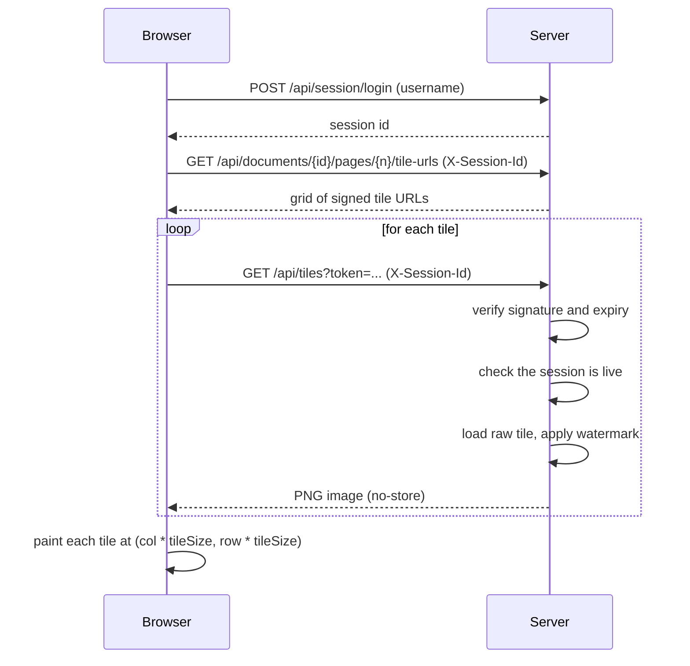
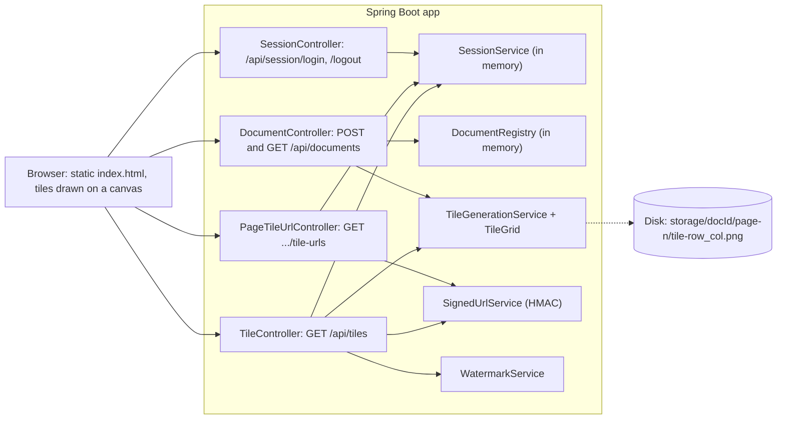

<!-- chapter: 25 | part: IV | owner: writer-app | tag: book-m0-mvp | status: expanded -->
# Chapter 25: Milestone 0: The tiled viewer

## Learning objectives

- Explain why the first version of the viewer never sends the PDF file to the browser, and what it sends instead.
- Compute how many tiles cover a page, and why the last row and column are shorter.
- Describe how a signed URL proves that a tile request is genuine without a database lookup, and why the signature covers every field.
- Follow one tile request through its two independent checks (the token and the session) and say what each protects.
- Explain why the watermark is applied when a tile is served, and what that costs.
- Read `TileGrid`, `SignedUrlService`, `WatermarkService` and `TileController` at `book-m0-mvp` and say what each does and what it protects against.
- Name the honest limits of the design.

## Prerequisites

Chapters 3–6 (Java), 8 (the web), 11–12 (Spring Boot and REST), 17 (signatures and PDFs) and 18
(testing). At this milestone the project uses Spring Boot 3.3.4,
Java 21 and PDFBox 3.0.3 (`pom.xml` at `book-m0-mvp`); the upgrade to Spring Boot 4 comes in Chapter
30. To run this tag yourself, see Table IV.3 ("What you need to run each tag") in the
[Part IV introduction](00-part-introduction.md).
<!-- source: pom.xml at book-m0-mvp; OUTLINE.md -->

## Beginner tier: Serving a page as small tiles

### 25.1 Requirements and the threat we start with

The project starts from one product goal: let a person read a PDF in a browser without being able to
walk away with the file. The first commit describes the approach. The server never hands out the PDF.
It turns each page into an image, cuts that image into tiles when the document is uploaded, and
hands out the tiles one at a time through short-lived signed URLs that are tied to a session. Each
tile is stamped with the identity of the person requesting it, and the browser puts the tiles back
together on a canvas.
<!-- source: commit b6aef4e message; README at book-m0-mvp -->

To see why that is a good design, look at the obvious alternative. A naive viewer shows the PDF
in the browser and "protects" it by hiding the download button and blocking the right-click menu. The
project's own README explains why that fails: both tricks live entirely in the browser, so both are
undone in about ten seconds with the browser's developer tools. The protection has to live on the
server, where the person at the keyboard can't reach it.

The README lists each concern and the answer to it. **Table 25.1** condenses it.

**Table 25.1 — Concerns and how the first version answers them**

| The reader might try to... | How the design answers |
|---|---|
| Save the PDF | The PDF stops existing as a servable file after ingest. Only disconnected PNG tiles remain. No endpoint returns a whole page. |
| Copy a tile URL | The URL carries a signature over document, page, row, column, session and expiry. Change any field and it fails. |
| Reuse the URL later | The URL expires (120 seconds by default), and the expiry is inside the signed payload. |
| Share the URL with someone | The URL is tied to the session it was issued to, and the session is re-checked on every tile request. |
| Keep using URLs after signing out | The session is checked separately from the token's expiry, so signing out kills every URL at once. |
| Take a screenshot anyway | Not prevented. Every tile is watermarked with the viewer's identity and a UTC timestamp, so a leaked capture is traceable. |

Table 25.1 is a list of small defenses, each closing one door. Read the last row twice. The design is a
**deterrent**, not a vault: anyone who can see pixels can photograph a screen. The README's
"Limitations" section says so directly ("This does not make content uncopyable, and nothing can"), and
the book keeps that honesty. The goal is to raise the cost of casual copying and to make leaks
attributable to a person.
<!-- source: README at book-m0-mvp (Why this design; Limitations); commit b6aef4e -->

At this tag the product is backend only. It has controllers, services, a session service, an
in-memory `DocumentRegistry`, five unit-test classes and one static `index.html`. There is no database
and no Angular yet.
<!-- source: git ls-tree -r book-m0-mvp; timeline -->

### 25.2 The vocabulary of a tiled viewer

A PDF is a document format that describes pages of text and graphics. **Rasterizing** a page means
drawing it into an image: a grid of colored dots called **pixels**. A tile is one rectangular piece
of that image, here a square of at most 256 pixels on a side. A token is a small, opaque piece of
text that stands for a permission. A session is the server's record that a particular person
signed in. A watermark is a visible mark, here the viewer's name and the time, drawn over an
image so a copy can be traced. Each term gets a fuller treatment as it comes up; the glossary at the
back of the book collects them.

### 25.3 Tile grid math (`TileGrid`)

**Analogy.** Think of a bathroom wall covered with square tiles. You count how many tiles fit along
the width, rounding up, because a partial tile still has to be cut and placed. **Where the analogy
breaks down:** a real tiler fills gaps with grout; the viewer never pads. Edge tiles are smaller, so putting every tile back at its own position rebuilds the page exactly.

The math lives in its own class so it can be tested without any PDF library. There are two ideas.

1. **Tile count.** For `lengthPx` pixels and tiles of `tileSize` pixels you need
   ceil(lengthPx / tileSize) tiles. Integer arithmetic gives the same number as
   `(lengthPx + tileSize - 1) / tileSize`.
2. **Cropping.** A tile starts at `(col * tileSize, row * tileSize)` and is `tileSize` wide unless the
   image ends first, in which case it is the remaining width.

**Listing 25.1 — `TileGrid.java` (book-m0-mvp, simplified: Javadoc and imports removed)**

```java
public final class TileGrid {

    private TileGrid() {
    }

    public static int tileCount(int lengthPx, int tileSize) {
        if (lengthPx <= 0 || tileSize <= 0) {
            throw new IllegalArgumentException("lengthPx and tileSize must both be positive");
        }
        return (lengthPx + tileSize - 1) / tileSize;
    }

    public static BufferedImage sliceTile(BufferedImage page, int row, int col, int tileSize) {
        int x = col * tileSize;
        int y = row * tileSize;
        if (x >= page.getWidth() || y >= page.getHeight()) {
            throw new IllegalArgumentException("Tile (" + row + "," + col + ") is outside the image bounds");
        }
        int w = Math.min(tileSize, page.getWidth() - x);
        int h = Math.min(tileSize, page.getHeight() - y);
        return page.getSubimage(x, y, w, h);
    }
}
```

*Path: `src/main/java/com/example/securedocviewer/service/TileGrid.java`*

Line by line: the private constructor stops anyone from creating a `TileGrid` object, because the
class only holds functions (a **utility class**). `tileCount` rejects zero or negative sizes early, so
bad input fails loudly instead of dividing by zero. `sliceTile` computes the top-left corner, refuses
a tile outside the image, then uses `Math.min` to shorten the last row and column.
`getSubimage` returns a view onto part of the page image.

**Example 25.1 — A US Letter page.** A US Letter page is 612 by 792 points (a point is 1/72 of an
inch). Rendered at 150 dots per inch, the scale is 150 / 72, about 2.083, so the image is about
1,275 by 1,650 pixels. With 256-pixel tiles:

- columns = (1,275 + 255) / 256 = 5 (integer division), and the last column is 1,275 - 4 × 256 = 251
  pixels wide;
- rows = (1,650 + 255) / 256 = 7, and the last row is 1,650 - 6 × 256 = 114 pixels tall.

That is 5 × 7 = **35 tiles per page**, which is the figure the project's later notes use ("a page is
about 35 tiles"). Remember it: it drives the rate-limit decisions in Chapters 26 and 30.

**Why test the math separately.** `TileGridTest` includes a test that the commit message calls a
round-trip property check. It builds a 613 by 457 pixel image of random noise, deliberately not a multiple of the tile size. It slices the image with 64-pixel tiles and draws every tile back at `(col * tileSize, row * tileSize)` onto a black canvas. Then it compares every pixel with the original.

**Listing 25.2 — `TileGridTest` (book-m0-mvp, excerpt of the reassembly loop)**

```java
BufferedImage reassembled = new BufferedImage(width, height, BufferedImage.TYPE_INT_RGB);
Graphics2D g = reassembled.createGraphics();
g.setColor(Color.BLACK);
g.fillRect(0, 0, width, height);
for (int row = 0; row < rows; row++) {
    for (int col = 0; col < cols; col++) {
        BufferedImage tile = TileGrid.sliceTile(original, row, col, tileSize);
        g.drawImage(tile, col * tileSize, row * tileSize, null);
    }
}
g.dispose();
```

*Path: `src/test/java/com/example/securedocviewer/service/TileGridTest.java`*

If a single pixel differs, the test fails with its coordinates. The point of the test is a guarantee,
in the test's own words: "tiles are a lossless partition of the page ... no seams, no overlap, no
dropped edge strips." Because `TileGrid` has no dependency on PDFBox or Spring, the test needs only a
synthetic image and runs in milliseconds.
<!-- source: TileGrid.java, TileGridTest.java at book-m0-mvp; commit b6aef4e message -->

### 25.4 Turning a PDF into tiles (`TileGenerationService`)

`TileGenerationService.ingest` gives each document a random id (a **UUID**, a 128-bit random
identifier that is practically never repeated), renders each page with PDFBox at the configured
resolution, and calls `tileAndSave` for each page image.

**Listing 25.3 — `TileGenerationService.tileAndSave` and `loadRawTile` (book-m0-mvp, simplified: two methods)**

```java
PageInfo tileAndSave(String documentId, int pageIndex, BufferedImage pageImage) throws IOException {
    int tileSize = properties.getTileSize();
    int width = pageImage.getWidth();
    int height = pageImage.getHeight();
    int cols = TileGrid.tileCount(width, tileSize);
    int rows = TileGrid.tileCount(height, tileSize);

    Path pageDir = storageRoot(documentId).resolve("page-" + pageIndex);
    Files.createDirectories(pageDir);

    for (int row = 0; row < rows; row++) {
        for (int col = 0; col < cols; col++) {
            BufferedImage tile = TileGrid.sliceTile(pageImage, row, col, tileSize);
            File tileFile = pageDir.resolve("tile-" + row + "_" + col + ".png").toFile();
            ImageIO.write(tile, "png", tileFile);
        }
    }

    return new PageInfo(pageIndex, rows, cols, tileSize, width, height);
}

public BufferedImage loadRawTile(String documentId, int page, int row, int col) throws IOException {
    Path tilePath = storageRoot(documentId)
            .resolve("page-" + page)
            .resolve("tile-" + row + "_" + col + ".png");

    if (!Files.exists(tilePath)) {
        throw new DocumentNotFoundException(
                "No such tile: document=%s page=%d row=%d col=%d".formatted(documentId, page, row, col));
    }

    return ImageIO.read(tilePath.toFile());
}
```

*Path: `src/main/java/com/example/securedocviewer/service/TileGenerationService.java`*

The layout on disk is `{storage-root}/{documentId}/page-{n}/tile-{row}_{col}.png`. The class
comment compares it with an object-storage "bucket": it is the same idea as folders in a cloud store.
`tileAndSave` computes the grid with `TileGrid`, creates the page folder, writes each tile as a PNG
image, and returns a `PageInfo` record describing the grid (rows, columns, tile size and page size in
pixels). `loadRawTile` is the read side. Its name says the tile is *raw*: its Javadoc warns that this
method "never returns a copy that's safe to serve directly", because the watermark hasn't been applied.

The upload does not keep the PDF: after `ingest` only tiles exist. The **manifest** (`DocumentManifest`)
records the document's id, title, page count and one `PageInfo` per page, and is what the client asks
for to learn how big each page is. At this tag the manifests live in an in-memory `DocumentRegistry`,
so a server restart forgets every document while its tiles stay behind on disk. Chapter 27 fixes that.
<!-- source: TileGenerationService.java at book-m0-mvp; README at book-m0-mvp (Limitations) -->

## Intermediate tier: How the pieces talk to each other

*Assumes the beginner tier. This tier follows a tile request from the browser to the server and back,
and shows why the design uses signed URLs.*

### 25.5 The request flow

Figure 25.1 shows one page being displayed. It is a sequence diagram: time runs downward.



*Figure 25.1 — One page, request by request (book-m0-mvp)*

*Text description:* A sequence diagram with two participants, the browser and the server, and time running downward. The browser signs in and receives a session id, then asks for the grid of signed tile URLs. In a loop, for each tile, the browser sends a request and the server verifies the signature and expiry, checks that the session is live, loads the raw tile, applies the watermark and returns a PNG image. Last, the browser paints each tile at its column and row offset. Notice that the two checks happen once per tile, not once per page.

Three ideas follow from the figure.

- **The server hands out addresses, not pictures, first.** The response to the `tile-urls` call is
  a grid of URLs, one per tile. The browser then fetches each URL. The server-side check therefore
  happens once per tile, not once per page.
- **A token names one tile.** Each URL contains a token that grants access to exactly one tile of one
  page of one document for one session until a fixed time.
- **Two independent checks.** The tile endpoint verifies the token itself, and separately checks that
  the session behind it is still alive. The next sections take them in turn.

The grid comes back as a small record, `TileUrlGrid`.

**Listing 25.4 — `TileUrlGrid.java` (book-m0-mvp, simplified: Javadoc removed)**

```java
public record TileUrlGrid(
        int page,
        int rows,
        int cols,
        int tileSize,
        String[][] tileUrls
) {
}
```

*Path: `src/main/java/com/example/securedocviewer/model/TileUrlGrid.java`*

A record is Java's compact way to declare a class that only holds data (Chapter 4). `tileUrls[row][col]`
is the URL for the tile in that position, so the client can paint it at `col * tileSize` across and
`row * tileSize` down.
<!-- source: TileUrlGrid.java at book-m0-mvp; index.html at book-m0-mvp -->

### 25.6 Signed URLs (`SignedUrlService`)

**Analogy.** A signed URL is like a concert wristband stamped with a seal only the venue owns. Staff
don't consult a guest list at every door; they check the seal. **Where the analogy breaks down:** a
wristband works all night, while a token names one tile and expires at a fixed time. And a stolen
wristband works for whoever wears it, in the same way a copied URL works until it expires. That is why Chapter
26 binds tokens to a session more tightly.

*Pattern note: A signed URL is a capability URL, combined here with a session (Chapter 39, Section 39.9).*

The service issues a token that grants access to exactly one tile of one page of one document, for
one session, until a fixed expiry. The token is two base64url strings joined by a dot: the payload,
and an HMAC-SHA256 signature over it. **Base64url** is a way to write any bytes using only letters,
digits, hyphen and underscore, so the result is safe inside a URL. HMAC (hash-based message
authentication code) mixes a secret key into a hash, so only a holder of the key can produce a
matching signature. Change any field of the payload and the signature no longer matches.

The payload is described by a record whose `canonicalString` method writes its fields in a fixed
order, separated by a vertical bar.

**Listing 25.5 — `SignedTilePayload.java` (book-m0-mvp, simplified: Javadoc removed)**

```java
public record SignedTilePayload(
        String documentId,
        int page,
        int row,
        int col,
        String sessionId,
        long expiresAtEpochSeconds
) {
    public String canonicalString() {
        return documentId + "|" + page + "|" + row + "|" + col + "|" + sessionId + "|" + expiresAtEpochSeconds;
    }
}
```

*Path: `src/main/java/com/example/securedocviewer/model/SignedTilePayload.java`*

**Worked example.** Suppose document `d1`, page 0, row 2, column 3, session `s1`, expiry 1000. The
canonical string is `d1|0|2|3|s1|1000`. The service base64url-encodes that string, computes an
HMAC-SHA256 of the same string using the secret, base64url-encodes the signature, and joins the two
with a dot: `<encoded payload>.<encoded signature>`. If someone edits the payload to ask for column 4,
the payload part changes, and the signature they can't recompute (they don't have the secret) no
longer matches.

**Listing 25.6 — `SignedUrlService.java` (book-m0-mvp, simplified: Javadoc, `parseCanonical` and the private helpers removed)**

```java
public String issueToken(String documentId, int page, int row, int col, String sessionId) {
    long expiresAt = Instant.now().getEpochSecond() + properties.getUrlTtlSeconds();
    SignedTilePayload payload = new SignedTilePayload(documentId, page, row, col, sessionId, expiresAt);
    String payloadEncoded = base64Url(payload.canonicalString().getBytes(StandardCharsets.UTF_8));
    String signature = base64Url(hmac(payload.canonicalString()));
    return payloadEncoded + "." + signature;
}

public SignedTilePayload verifyAndDecode(String token) {
    String[] parts = token.split("\\.", 2);
    if (parts.length != 2) {
        throw new InvalidTokenException("Malformed token");
    }

    String payloadEncoded = parts[0];
    String providedSignature = parts[1];

    byte[] payloadBytes;
    try {
        payloadBytes = Base64.getUrlDecoder().decode(payloadEncoded);
    } catch (IllegalArgumentException e) {
        throw new InvalidTokenException("Malformed token payload");
    }
    String canonical = new String(payloadBytes, StandardCharsets.UTF_8);

    String expectedSignature = base64Url(hmac(canonical));
    if (!constantTimeEquals(expectedSignature, providedSignature)) {
        throw new InvalidTokenException("Signature mismatch — token was tampered with or forged");
    }

    SignedTilePayload payload = parseCanonical(canonical);
    if (Instant.now().getEpochSecond() > payload.expiresAtEpochSeconds()) {
        throw new InvalidTokenException("Token expired at " + Instant.ofEpochSecond(payload.expiresAtEpochSeconds()));
    }

    return payload;
}
```

*Path: `src/main/java/com/example/securedocviewer/service/SignedUrlService.java`*

Walk through `verifyAndDecode` in order, because the order is the design.

1. **Shape.** Split at the first dot. Two parts, or reject.
2. **Decode** the payload. Text that isn't base64url is rejected.
3. **Recompute** the signature from the decoded payload with the server's secret and compare it with
   the one supplied. The comparison uses `MessageDigest.isEqual`, a **constant-time** check: an
   ordinary string comparison stops at the first difference, so an attacker who measures response
   times could learn how many leading characters were right. A constant-time comparison always takes
   the same time.
4. **Only then parse** the fields and check the expiry.

The signature is verified before the payload is parsed, so untrusted data reaches the parsing code
only if the server signed it.

**Why HMAC and not a plain hash?** A plain hash of the payload could be recomputed by anyone, so an
attacker could change the payload and compute a matching hash. An HMAC needs the secret key, which
never leaves the server. **Why sign at all, and not store issued tokens in a table?** Because the
check then needs no database lookup: the token carries its own proof. That is why each tile request
is cheap to check, and why the same shape appears in cloud storage as "presigned URLs" (the README
notes that `SignedUrlService` "deliberately mirrors the presigned-URL pattern").

The service deliberately does not check that the session is still alive. Its Javadoc explains why: a
tampered or expired token and a revoked session are different failures, and separate checks keep
them distinguishable. `TileController` performs the second check (Section 25.8).

**The tests are the specification.** `SignedUrlServiceTest` covers the behaviors one by one:

- a token round-trips to the same payload;
- a token whose last signature character was flipped is rejected;
- a "Franken-token", made by splicing another tile's payload onto this token's signature, is rejected: it has a valid-looking signature on the wrong payload;
- an expired token is rejected (the test sets a negative lifetime, so the token is already old when issued);
- text that isn't a token at all is rejected.


Each test name reads as a sentence about a security property.
<!-- source: SignedUrlService.java, SignedTilePayload.java, SignedUrlServiceTest.java, README at book-m0-mvp -->

### 25.7 Per-viewer watermarking (`WatermarkService`)

Watermarking could happen at ingest or at serve time. At ingest, every viewer would receive an
identical copy, so a leak couldn't be traced. Stamping a copy per user up front would store N copies of
every tile for N viewers. The project stamps on the way out: one stored tile serves everyone, and every
response is individually attributable. The cost, in the README's words, is "CPU per request and losing
shared caching", which is why tile responses are marked `Cache-Control: no-store`.
<!-- source: WatermarkService Javadoc and README at book-m0-mvp; decisions D5 -->

**Listing 25.7 — `WatermarkService.java` (book-m0-mvp, simplified: imports and Javadoc removed)**

```java
@Service
public class WatermarkService {

    private static final DateTimeFormatter TIMESTAMP_FORMAT =
            DateTimeFormatter.ofPattern("yyyy-MM-dd HH:mm:ss").withZone(ZoneOffset.UTC);

    public BufferedImage applyWatermark(BufferedImage source, String viewerLabel) {
        BufferedImage stamped = new BufferedImage(
                source.getWidth(), source.getHeight(), BufferedImage.TYPE_INT_ARGB);

        Graphics2D g = stamped.createGraphics();
        try {
            g.setRenderingHint(RenderingHints.KEY_ANTIALIASING, RenderingHints.VALUE_ANTIALIAS_ON);
            g.drawImage(source, 0, 0, null);

            String label = viewerLabel + " · " + TIMESTAMP_FORMAT.format(Instant.now());

            g.setComposite(AlphaComposite.getInstance(AlphaComposite.SRC_OVER, 0.22f));
            g.setColor(Color.RED);
            g.setFont(new Font(Font.SANS_SERIF, Font.BOLD, Math.max(10, source.getHeight() / 12)));
            g.rotate(-Math.PI / 6, source.getWidth() / 2.0, source.getHeight() / 2.0);
            g.drawString(label, -source.getWidth() / 4, source.getHeight() / 2);
        } finally {
            g.dispose();
        }

        return stamped;
    }
}
```

*Path: `src/main/java/com/example/securedocviewer/service/WatermarkService.java`*

The method copies the tile into a new image, draws the original, then draws one red line of text
("viewer name, middle dot, UTC time") at 22 percent opacity, rotated 30 degrees around the tile's
center. `AlphaComposite` with 0.22 means each red pixel contributes 22 percent to the result and the
page shows through the rest. The `finally` block releases the graphics context even if drawing fails.
The mark is deliberately simple at this tag. Chapter 29 shows what was wrong with it (a single line
wider than a tile, and marks that miss cropped edge tiles) and how it grew into a two-line brick
pattern with a trace code.

`WatermarkServiceTest` checks the properties that matter: the output has the same dimensions as the
input; at least one pixel changes; and two different viewer labels produce different output, which
proves each viewer's copy is distinct.

The cost is real: every tile request decodes a PNG, draws on it and encodes it again. A later review
recorded this as a low-severity limitation (`TM-17`).
<!-- source: WatermarkService.java, WatermarkServiceTest.java at book-m0-mvp; reviews record TM-17 -->

### 25.8 The endpoints

Four controllers make up the API. Two matter most for the design.

**Asking for tile URLs.** `PageTileUrlController` answers
`GET /api/documents/{documentId}/pages/{page}/tile-urls`.

**Listing 25.8 — `PageTileUrlController.tileUrls` (book-m0-mvp, simplified: Javadoc, constructor and fields removed)**

```java
@GetMapping("/tile-urls")
public ResponseEntity<TileUrlGrid> tileUrls(
        @RequestHeader("X-Session-Id") String sessionId,
        @PathVariable String documentId,
        @PathVariable int page) {

    sessionService.requireValidSession(sessionId);

    DocumentManifest manifest = documentRegistry.require(documentId);
    PageInfo pageInfo = manifest.pages().stream()
            .filter(p -> p.page() == page)
            .findFirst()
            .orElseThrow(() -> new DocumentNotFoundException(
                    "No such page: document=" + documentId + " page=" + page));

    String[][] urls = new String[pageInfo.rows()][pageInfo.cols()];
    for (int row = 0; row < pageInfo.rows(); row++) {
        for (int col = 0; col < pageInfo.cols(); col++) {
            String token = signedUrlService.issueToken(documentId, page, row, col, sessionId);
            urls[row][col] = "/api/tiles?token=" + token;
        }
    }

    return ResponseEntity.ok(new TileUrlGrid(page, pageInfo.rows(), pageInfo.cols(), pageInfo.tileSize(), urls));
}
```

*Path: `src/main/java/com/example/securedocviewer/controller/PageTileUrlController.java`*

The method checks the session, finds the page in the manifest (or throws "no such page"), builds a
two-dimensional array of URLs with one signed token per tile, and returns the grid. It never returns
a page-level or document-level download link. The header `X-Session-Id` carries the session, and
`@PathVariable` pulls `documentId` and `page` out of the address.

**Redeeming a tile.** `TileController` is the only endpoint that returns pixels.

**Listing 25.9 — `TileController.getTile` (book-m0-mvp, simplified: imports, Javadoc, constructor and fields removed)**

```java
@GetMapping(value = "/api/tiles", produces = MediaType.IMAGE_PNG_VALUE)
public ResponseEntity<byte[]> getTile(@RequestParam String token) throws IOException {
    SignedTilePayload payload = signedUrlService.verifyAndDecode(token);

    // Second, independent check: the token's own expiry can still be in
    // the future while the session it was issued under has since been
    // logged out or timed out.
    String username = sessionService.requireValidSession(payload.sessionId());

    BufferedImage rawTile = tileGenerationService.loadRawTile(
            payload.documentId(), payload.page(), payload.row(), payload.col());

    BufferedImage watermarked = watermarkService.applyWatermark(rawTile, username);

    ByteArrayOutputStream out = new ByteArrayOutputStream();
    ImageIO.write(watermarked, "png", out);

    return ResponseEntity.ok()
            // Deliberately not cacheable beyond a moment — a shared cache
            // holding onto a watermarked-for-someone-else tile would leak it.
            .cacheControl(CacheControl.noStore())
            .body(out.toByteArray());
}
```

*Path: `src/main/java/com/example/securedocviewer/controller/TileController.java`*

The pipeline has four gates in a fixed order: signature and expiry, live session, tile exists,
watermark. Even a request that passes all of them gets one tile. `Cache-Control: no-store` tells
browsers and shared caches not to keep the response, because a copy stamped for one person must never
reach another.

**Errors.** Failures throw exceptions, and `GlobalExceptionHandler` maps them to responses.
`InvalidTokenException` and `SessionExpiredException` both become HTTP **401 (Unauthorized)** with a
JSON body `{"error": "..."}`. This is why the README says to try editing a token character (401,
signature mismatch), waiting past the lifetime (401, expired), or logging out and retrying an
unexpired token (401, session revoked).

`DocumentController` handles `POST /api/documents` (upload) and `GET /api/documents/{id}` (manifest).
Upload requires a valid session, and its Javadoc notes that a real app would also check the
uploader's role. Chapter 26 adds roles.
<!-- source: PageTileUrlController.java, TileController.java, DocumentController.java, GlobalExceptionHandler.java at book-m0-mvp; README -->

## Advanced tier: Sessions and what this version leaves open

*Assumes the earlier tiers. This tier covers the session check behind every token, the one-page
client, and the gaps that later milestones close.*

### 25.9 A first session service

**Listing 25.10 — `SessionService.java` (book-m0-mvp, simplified: imports and Javadoc removed)**

```java
@Service
public class SessionService {

    private record Session(String username, Instant expiresAt) {
    }

    private final Map<String, Session> sessions = new ConcurrentHashMap<>();
    private final ViewerProperties properties;

    public SessionService(ViewerProperties properties) {
        this.properties = properties;
    }

    public String login(String username) {
        String sessionId = UUID.randomUUID().toString();
        Instant expiresAt = Instant.now().plusSeconds(properties.getSessionTtlSeconds());
        sessions.put(sessionId, new Session(username, expiresAt));
        return sessionId;
    }

    public void logout(String sessionId) {
        sessions.remove(sessionId);
    }

    public String requireValidSession(String sessionId) {
        Session session = sessions.get(sessionId);
        if (session == null) {
            throw new SessionExpiredException("Session not found or already logged out: " + sessionId);
        }
        if (Instant.now().isAfter(session.expiresAt())) {
            sessions.remove(sessionId);
            throw new SessionExpiredException("Session expired: " + sessionId);
        }
        return session.username();
    }
}
```

*Path: `src/main/java/com/example/securedocviewer/security/SessionService.java`*

The store is a `ConcurrentHashMap` from session id to a small record holding the username and an
expiry. "Concurrent" means several request threads can read and write it at once without corrupting
it (Chapter 5). `login` invents a random UUID, stores the session and returns the id. `logout`
removes it. `requireValidSession` either returns the username or throws.

This is where the design's revocation property comes from. Because every tile token is bound to a
session id, removing the session kills every outstanding token issued under it, even ones whose own
expiry is minutes away. `SessionController` is even more minimal: `POST /api/session/login` mints a
session for *whatever username you give it*. Its Javadoc says plainly: "Stands in for real
authentication."

The stand-in is honest, and it is also the largest hole. Anyone can sign in as anyone, so the name in
the watermark means nothing yet. The README lists it first among limitations: "`SessionController` is
not authentication. It mints a session for any username with no password check." Chapter 26 replaces
it.
<!-- source: SessionService.java, SessionController.java at book-m0-mvp; README (Limitations) -->

### 25.10 The one-page client

The browser side is a single static file, `src/main/resources/static/index.html`. It signs in, uploads
a PDF, asks for a manifest and tile URLs, and draws tiles on an HTML `<canvas>`.

**Listing 25.11 — `index.html` `renderPage` (book-m0-mvp, simplified: status-line updates and the page label removed)**

```javascript
async function renderPage(pageIndex) {
  const res = await api(`/api/documents/${manifest.documentId}/pages/${pageIndex}/tile-urls`);
  const grid = await res.json();

  const canvas = document.getElementById('pageCanvas');
  const pageInfo = manifest.pages.find(p => p.page === pageIndex);
  canvas.width = pageInfo.pageWidthPx;
  canvas.height = pageInfo.pageHeightPx;
  const ctx = canvas.getContext('2d');

  for (let row = 0; row < grid.rows; row++) {
    for (let col = 0; col < grid.cols; col++) {
      const url = grid.tileUrls[row][col];
      // Each fetch redeems a single-tile, session-bound, short-lived token.
      const tileRes = await api(url);
      const blob = await tileRes.blob();
      const bitmap = await createImageBitmap(blob);
      ctx.drawImage(bitmap, col * grid.tileSize, row * grid.tileSize);
    }
  }
}
```

*Path: `src/main/resources/static/index.html`*

The page uses `fetch` to call the API and a helper `api` that adds the `X-Session-Id` header. For each
tile it fetches the image, turns it into a bitmap with `createImageBitmap`, and draws it at
`(col * grid.tileSize, row * grid.tileSize)`: the same formula as `TileGrid`, now used to put the
page back together. The canvas is sized from the manifest's `pageWidthPx` and `pageHeightPx`.

Notice `await` inside the nested loops: tiles are fetched **one after another**, not in parallel. That
is simple and correct, and slow. The Angular viewer of Chapter 26 fetches with a pool of parallel
workers, handles the rate-limit answers, and abandons a page's requests when you turn the page. The
canvas also goes away: the Angular viewer lays tiles out as positioned elements, and the canvas
survives only in this first page.
<!-- source: index.html at book-m0-mvp; blueprints record -->

### 25.11 What this version deliberately leaves open

The README's own limitations are a to-do list for the rest of Part IV.

- **Sessions and manifests are in memory**, so a restart loses both, and neither survives more than
  one server instance. (Chapter 27.)
- **No real authentication.** (Chapter 26.)
- **Tiles live on local disk.** The README names object storage plus a CDN as the production shape,
  and notes that `SignedUrlService` mirrors the presigned-URL pattern so it could map to that with
  little change.
- **Watermarking every tile costs CPU and defeats caching.** At scale one would watermark more
  coarsely or cache per (tile, viewer) with a short lifetime.
- **A determined user with a legitimate session can request every tile and reassemble them.** The
  watermark makes that traceable, and per-session rate limiting "would make it slow". The README lists
  it among "possible next steps"; it arrives in Chapter 26.

Chapter 32 collects these into a proper threat model.
<!-- source: README at book-m0-mvp (Limitations; Possible next steps) -->

## Common mistakes

**Trusting the browser to hide the file.** Symptom: "the download button is hidden, so it's protected".
Fix: the protection must be on the server. If a URL returns the file, anyone can call it.

**Padding edge tiles.** Symptom: a thin seam, or a mismatch at the right and bottom edges. Fix: crop
the last row and column and put every tile at `(col * tileSize, row * tileSize)`, as `TileGrid` does.

**Comparing signatures with `==` or `equals`.** Symptom: it works, and leaks timing. Fix:
`MessageDigest.isEqual` (Listing 25.6).

**Parsing before verifying.** Symptom: a malformed token crashes the parser. Fix: verify the signature
first; only signed data is parsed.

**Forgetting `no-store` on personalized responses.** Symptom: a cache serves one person's watermarked
tile to another. Fix: `Cache-Control: no-store`.

**Believing a token proves the person is still allowed.** Symptom: a signed-out user's URL keeps
working until it expires. Fix: a separate session check per request (Listing 25.9).

**Off-by-one in ceiling division.** Symptom: one tile too few, so the last column of the page is
missing. Fix: `(length + tileSize - 1) / tileSize`, not `length / tileSize`.

## Architecture blueprint v0

Figure 25.2 shows the system at this milestone, as Blueprint v0.



*Figure 25.2 — Blueprint v0 (`book-m0-mvp`)*

*Text description:* A left-to-right flowchart. The browser, a static page that draws tiles on a canvas, calls four controllers inside the Spring Boot application. SessionController uses the in-memory SessionService. DocumentController uses TileGenerationService and the in-memory DocumentRegistry. PageTileUrlController uses SignedUrlService and SessionService. TileController uses SignedUrlService, SessionService, TileGenerationService and WatermarkService. A dotted line shows TileGenerationService writing tiles to disk. Notice that there is no database: sessions and documents live in memory and only the tiles are on disk.
<!-- source: book/blueprints/v0-mvp.md; classes named in the diagram, present at book-m0-mvp under src/main/java/com/example/securedocviewer/: controller/DocumentController.java, service/DocumentRegistry.java, controller/PageTileUrlController.java, controller/SessionController.java, security/SessionService.java, service/SignedUrlService.java, controller/TileController.java, service/TileGenerationService.java, service/TileGrid.java, service/WatermarkService.java -->

This is the starting point, so nothing has changed since a previous version. Signing in takes only a
username, tile URLs are HMAC-signed and bound to the session id, and documents and sessions live in
memory.

## Decisions and challenges

### Decision: tiles plus signed URLs

**The decision.** Never expose the source PDF: rasterize pages at ingest, slice them into tiles,
deliver tiles through short-lived HMAC-signed URLs bound to a session, and reassemble them in the
browser. **Why this one.** The first commit records this rationale and isolates the grid math in
`TileGrid` with a round-trip test. **The options considered.** The alternatives weighed at MVP time
aren't recorded in the repository history, so this book doesn't invent them. **What it costs.** Every
tile request does work on the server (Section 25.7), and the design stays a deterrent rather than a
guarantee.
<!-- source: commit b6aef4e; decisions D4 -->

### Decision: watermark at serve time

**The decision.** Stamp the viewer's identity onto each tile when it is served, not at ingest. **Why.**
One stored tile serves every viewer while each response stays traceable. **What it costs.** A decode,
draw and encode per request, and no shared caching, recorded later as a low-severity limitation.
<!-- source: commit b6aef4e; decisions D5 -->

### Decision: isolate the math

**The decision.** Put the grid arithmetic in a dependency-free class with a property test. **Why.**
The commit message singles this out: the tiles must reassemble the page exactly, and a synthetic
image is enough to prove it. **What it costs.** One more class, and the discipline to keep PDF
rendering out of it.
<!-- source: commit b6aef4e message; TileGridTest.java -->

### Challenge: the MVP was a demo, and a review said so

**The problem.** This version signed anyone in who typed a username. Later, independent reviews by AI review agents (one playing a product owner, one a senior technical manager) found four problems. Login accepted any username with no password (`TM-2`). Admin endpoints needed only a valid session and listed every live session id (`TM-1`). The tile token contained the session id, so a leaked URL leaked a credential (`TM-4`). And the signing secret was committed in `application.yml` (`TM-6`); the file at this tag holds a visibly demo-only value. **How it was found.** The reviews ran against the working
product after the MVP and a first Angular baseline existed. **The fix.** Milestone 1 (Chapter 26)
addressed these: real accounts, roles, a keyed session binding in tokens, and a secret supplied
through the environment. **Where it goes next.** Chapter 26 walks through the fixes, and Chapter 32
collects the whole review record. **The lesson.** A stand-in is fine while you learn the shape of a
system, but write down what it stands in for. The MVP's own Javadoc did that, which turned the later
findings into a to-do list instead of a surprise.
<!-- source: reviews record; bugs record B; SessionService Javadoc and application.yml at book-m0-mvp -->

## In this project

**Table 25.2 — Where the concepts live (at book-m0-mvp)**

| Concept | Where |
|---|---|
| Tile math | `service/TileGrid.java`, `TileGridTest` |
| Rendering and storage | `service/TileGenerationService.java`, `TileGenerationServiceTest` |
| Signing | `service/SignedUrlService.java`, `model/SignedTilePayload.java`, `SignedUrlServiceTest` |
| Watermark | `service/WatermarkService.java`, `WatermarkServiceTest` |
| Endpoints | `controller/DocumentController`, `PageTileUrlController`, `TileController`, `SessionController` |
| Sessions | `security/SessionService.java`, `SessionServiceTest` |
| Client | `src/main/resources/static/index.html` |

Table 25.2 lists the files to open in your copy of the repository.

To see any of these files as it was at this milestone, run `git show book-m0-mvp:<path>`, for example `git show book-m0-mvp:pom.xml`.

## Try it

Solutions are in Appendix C.

### Exercise 25.1 ★ Count the tiles

A page is 1,240 pixels wide and 1,754 pixels tall, and tiles are 256 pixels. How many columns and
rows does `TileGrid.tileCount` give, and how wide is the last column?

### Exercise 25.2 ★ Letter page

Using Example 25.1 as a guide, how many tiles cover a US Letter page rendered at 150 DPI with
128-pixel tiles?

### Exercise 25.3 ★★ Tamper with a token

Run `book-m0-mvp` on your own machine. Sign in, request tile URLs, and change one character in the
middle of the payload part of a token (the part before the dot). Do not change the very last
character: the final character of a base64url string can carry unused bits, so changing it may decode
to the same bytes and the token would still verify. Request the altered URL. Which HTTP status comes back, and why does `verifyAndDecode` check
the signature before it parses the payload?

### Exercise 25.4 ★★ Build a canonical string

Write the canonical string for document `d9`, page 1, row 0, column 4, session `s7`, expiry 5000. If
someone changes the column to 5 but keeps the old signature, which line of `verifyAndDecode` rejects
the token?

### Exercise 25.5 ★★★ Two independent checks

Why does `TileController` not trust the token's expiry alone? Describe a case where a token is valid
but the request must still be refused.

### Exercise 25.6 ★★★ Design a limit

The README suggests per-session rate limiting to slow a scraper. Sketch, in words, where in
`TileController.getTile` you would count requests, what key you would count by, and what response you
would return when the limit is exceeded. Then say why counting by session id turned out to be
weaker than counting by user (Chapter 26 explains).

## Summary

- The viewer never serves the PDF: pages become tiles, and tiles leave the server one at a time.
- `TileGrid` isolates the math so a test can prove tiles rebuild a page exactly; a Letter page at 150
  DPI with 256-pixel tiles is 35 tiles.
- A token is a signed statement, `payload.signature`. Verify the signature first (in constant time),
  then parse.
- Two independent checks guard every tile: the token, and the session behind it.
- The watermark is applied per request, so one stored tile serves all viewers traceably, at a cost in
  CPU and caching.
- The design is a deterrent, and its README lists its own limits honestly.

## Further reading

- *Java Platform SE API*, `javax.crypto.Mac` and `java.security.MessageDigest`. https://docs.oracle.com/en/java/javase/25/docs/api/
- *RFC 2104*, "HMAC: Keyed-Hashing for Message Authentication." https://www.rfc-editor.org/rfc/rfc2104
- *RFC 4648*, section 5, "Base 64 Encoding with URL and Filename Safe Alphabet." https://www.rfc-editor.org/rfc/rfc4648
- *Apache PDFBox documentation.* https://pdfbox.apache.org/
- *MDN Web Docs*, "Cache-Control." https://developer.mozilla.org/en-US/docs/Web/HTTP/Headers/Cache-Control
- *MDN Web Docs*, "Canvas API." https://developer.mozilla.org/en-US/docs/Web/API/Canvas_API
