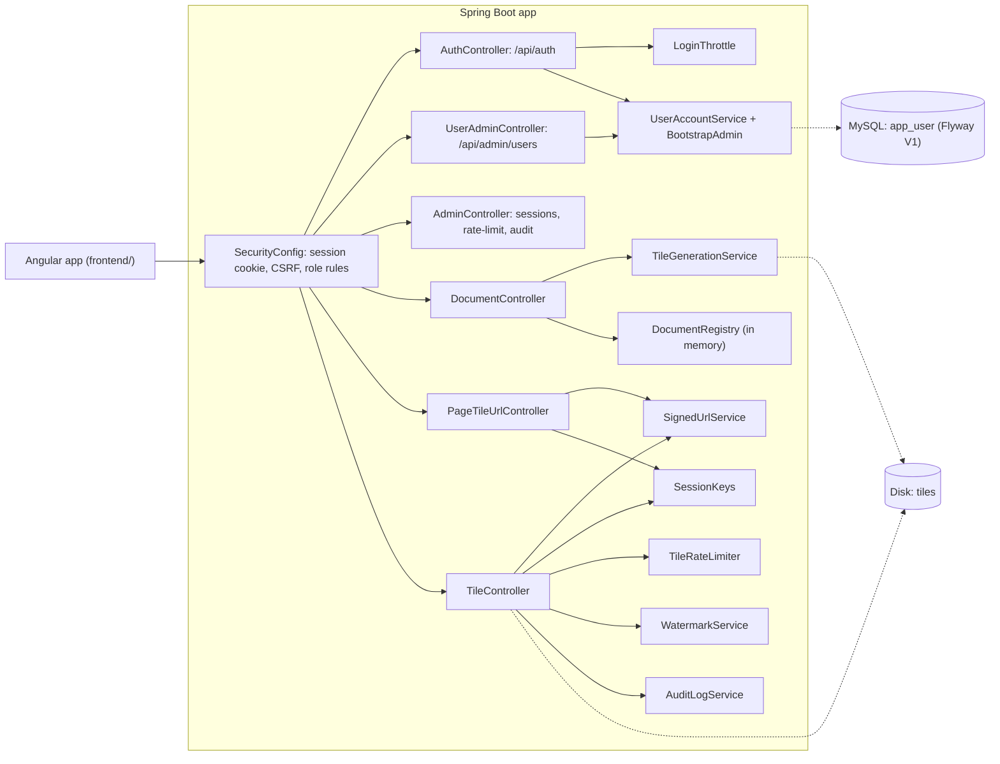

<!-- chapter: 26 | part: IV | owner: writer-app | tag: book-m1-accounts | status: draft -->
# Chapter 26: Milestone 1: Accounts, roles and sessions

## Learning objectives

- Explain why "type any username" was the most serious flaw of the first version, and what replaced it.
- Read `SecurityConfig` and say which roles may call which endpoints.
- Explain what an httpOnly session cookie and a CSRF token each protect against.
- Explain how `SessionKeys` lets a tile URL depend on a session without containing its id.
- Describe the first Flyway migration and where accounts are stored.

## Prerequisites

Chapters 14–16 (data, Spring Data and Spring Security basics as listed in `book/OUTLINE.md`),
19–23 (the Angular frontend) and Chapter 25, the milestone this one builds on. The code is at
`book-m1-accounts`: still Spring Boot 3.3.4 and Java 21, now with Spring Security, JPA, Flyway,
MySQL 8.4 and an Angular 22 frontend (Blueprint v1).
<!-- source: blueprints/v1-accounts.md; dossier/timeline.md -->

## Beginner tier: From "anyone" to real accounts

### 26.1 The product owner's requirements

After the MVP, two independent reviewers read the product as outsiders: an AI agent playing a
product owner (PO) and one playing a senior technical manager (TM). Between them they filed 13
PO and 20 TM findings. Two were rated critical. First, sign-in accepted any username with no
password, even an empty one (`TM-2`, `PO-3`), so the name printed in every watermark meant
nothing. Second, the admin endpoints needed only a valid session, and they listed every live
session id, and the id was the only credential (`TM-1`, `PO-2`): a user could read another
user's session id and act as them.
<!-- source: dossier/bugs-and-findings.md#B; dossier/reviews.md -->

The reviewers suggested delegating sign-in to a real identity provider through **OpenID Connect (OIDC)**, a standard that lets a service such as Google or Keycloak vouch for who a user is; this is often called single sign-on (SSO). The
product owner, asked directly, chose **built-in accounts**: Spring Security, BCrypt passwords,
three roles (READER, PUBLISHER, ADMIN), an httpOnly session cookie, login throttling and a
seeded first admin. The option offered alongside was described as needing an external
identity-provider registration and client secret before it could run.
<!-- source: dossier/decisions.md#d1; memory plan via dossier -->

Phase 1 was delivered as PR #1, which merged into the tag `book-m1-accounts`. It fixed the two
critical findings and several high and medium ones, and it shipped 45 backend tests and 4
frontend tests.
<!-- source: PR #1 body via dossier/timeline.md -->

### 26.2 The vocabulary of accounts

- An **account** is a stored record of who may sign in: a username, a password hash, a role.
- A **password hash** is a one-way scrambling of the password. The server keeps the hash, never
  the password, and compares hashes at sign-in. **BCrypt** is a hash designed to be slow, so
  guessing millions of passwords is expensive.
- A **role** is a named bundle of permissions. Here READER can read documents they have access
  to, PUBLISHER can also upload, and ADMIN can also manage accounts, sessions and the audit log.
- A **session** is the server's memory that you signed in. The browser holds only a small
  cookie that points at it.
- A **cookie** is a small value the server asks the browser to send back on every request.
- **httpOnly** marks a cookie that page JavaScript can't read, so an injected script can't steal it.
- **SameSite=Strict** tells the browser to send a cookie only for requests that start on this site, not from links or forms on other sites.

**Analogy.** A session cookie is a coat-check ticket. You show the ticket, and the attendant
fetches your coat without asking who you are. **Where the analogy breaks down:** a stolen
coat-check ticket gets one coat back, while a stolen session cookie lets someone act as you
until the session ends. So the ticket must never be shown to anyone else, which drives most of this
chapter.

**Listing 26.1 — `V1__create_app_user.sql` (book-m1-accounts)**

*File: `src/main/resources/db/migration/V1__create_app_user.sql`*

```sql
-- Accounts that can sign in. Usernames are stored lower-cased by the
-- application, so the unique constraint is effectively case-insensitive.
CREATE TABLE app_user (
    id            BIGINT       NOT NULL AUTO_INCREMENT,
    username      VARCHAR(64)  NOT NULL,
    password_hash VARCHAR(100) NOT NULL,
    role          VARCHAR(20)  NOT NULL,
    enabled       BOOLEAN      NOT NULL DEFAULT TRUE,
    created_at    DATETIME(6)  NOT NULL,
    PRIMARY KEY (id),
    CONSTRAINT uk_app_user_username UNIQUE (username)
);
```

The file is the first **Flyway migration**: a numbered SQL script that Flyway runs once, in
order, so every copy of the database gets the same shape. `V1` is its version. The table keeps
a hash, not a password. `enabled` lets an admin disable an account without deleting it. The
`UNIQUE` constraint on `username` stops two accounts sharing a name.

The `Role` enum in `account/Role.java` has exactly three values: `READER`, `PUBLISHER`, `ADMIN`.
`UserAccountService` creates and changes accounts, and `BootstrapAdmin` creates the first admin
from the environment or, per PR #1, with a one-time generated password. There is no self
sign-up: only an admin creates accounts.
<!-- source: V1__create_app_user.sql, Role.java at book-m1-accounts; PR #1 body via dossier/decisions.md#d1 -->

## Intermediate tier: How the pieces talk to each other

*Assumes the beginner tier. This tier follows a request from the Angular app through Spring
Security to the controllers, and shows why the project used a cookie session.*

### 26.3 Spring Security configuration (`SecurityConfig`)

Every request now passes through a **filter chain**, a row of checks that each request must pass in order, before it reaches a controller. Table 26.1
summarizes the authorization rules that `SecurityConfig` declares, and Listing 26.2 shows them
in the source.

**Table 26.1 — Who may call what at `book-m1-accounts`**

| Request | Allowed for |
|---|---|
| `POST /api/auth/login` | anyone |
| `/api/admin/**` | ADMIN |
| `POST /api/documents` (upload) | PUBLISHER, ADMIN |
| any other `/api/**` | any signed-in user |
| anything else | nobody (`denyAll`) |

**Listing 26.2 — `SecurityConfig.securityFilterChain` (book-m1-accounts, simplified: Javadoc and the other beans removed)**

*File: `src/main/java/com/example/securedocviewer/security/SecurityConfig.java`*

```java
@Bean
public SecurityFilterChain securityFilterChain(HttpSecurity http,
                                               CsrfTokenRepository csrfTokenRepository,
                                               SecurityContextRepository securityContextRepository,
                                               SessionRegistry sessionRegistry,
                                               SecurityErrorResponses errors) throws Exception {
    http
            .csrf(csrf -> csrf
                    .csrfTokenRepository(csrfTokenRepository)
                    .csrfTokenRequestHandler(new SpaCsrfTokenRequestHandler()))
            .securityContext(context -> context.securityContextRepository(securityContextRepository))
            .sessionManagement(session -> session
                    .sessionFixation(fixation -> fixation.changeSessionId())
                    // Unlimited concurrent sessions, but registered, so an
                    // admin can list and revoke them.
                    .maximumSessions(-1)
                    .sessionRegistry(sessionRegistry)
                    .expiredSessionStrategy(errors))
            .authorizeHttpRequests(auth -> auth
                    .requestMatchers(HttpMethod.POST, "/api/auth/login").permitAll()
                    .requestMatchers("/api/admin/**").hasRole("ADMIN")
                    .requestMatchers(HttpMethod.POST, "/api/documents").hasAnyRole("PUBLISHER", "ADMIN")
                    .requestMatchers("/api/**").authenticated()
                    .requestMatchers("/error").permitAll()
                    .anyRequest().denyAll())
            .exceptionHandling(exceptions -> exceptions
                    .authenticationEntryPoint(errors)
                    .accessDeniedHandler(errors))
            .requestCache(cache -> cache.disable())
            .formLogin(AbstractHttpConfigurer::disable)
            .httpBasic(AbstractHttpConfigurer::disable)
            .logout(AbstractHttpConfigurer::disable);
    return http.build();
}
```

Read the `authorizeHttpRequests` block from top to bottom: Spring applies the first rule that
matches. The last line, `anyRequest().denyAll()`, is a **deny by default** stance: a route you
forget to list is closed, not open. Login, form login, HTTP basic and Spring's own logout are
disabled because `AuthController` implements sign-in and sign-out itself.

The class's own Javadoc gives the reasoning behind the cookie design. The server-side session
lives in an httpOnly cookie, "so the session id is never visible to JavaScript, never sent in a
custom header, and never returned by any endpoint." Because a browser sends cookies
automatically, every state-changing request also needs a CSRF token. Authorization "is enforced
here, not in the UI: the frontend only hides what a role can't use."
<!-- source: SecurityConfig.java at book-m1-accounts; dossier/decisions.md#d3 -->

Three settings deserve a sentence each.

- **Session fixation protection** (`changeSessionId`) gives you a new session id at sign-in, so
  an attacker who planted an id before sign-in gains nothing.
- **`maximumSessions(-1)` with a session registry** allows unlimited concurrent sessions but
  records them, so an admin can list and revoke them.
- **CSRF** (cross-site request forgery) is an attack where another website makes your browser
  send a request that carries your cookie. The defense is a second value, the CSRF token, that
  the attacker's site can't read. The project uses the double-submit pattern: a readable
  `XSRF-TOKEN` cookie whose value Angular's `HttpClient` copies into a request header, and the
  server compares the two. `SameSite=Strict` on the cookies adds another layer.
<!-- source: SecurityConfig.java; PR #1 body via dossier/decisions.md#d3 -->

#### Why a cookie session and not a token in JavaScript

At m0 the session id lived in an `X-Session-Id` header and, in the first Angular baseline, in
`sessionStorage`, where any injected script can read it (`TM-15`). The project's record shows the
outcome (a server-side session in an httpOnly cookie) but no debate about JSON Web Tokens, so the
book does not describe one.
<!-- source: dossier/decisions.md#d3; dossier/bugs-and-findings.md#B -->

### 26.4 Binding tile tokens to a session (`SessionKeys`)

At m0 the tile token contained the session id, in plain base64: `docId|0|0|0|<session-id>|exp`.
A leaked tile URL therefore leaked the credential (`TM-4`). Milestone 1 changes what the token
carries. `SessionKeys` derives values from the session id with HMAC so the id never leaves the
server.

**Listing 26.3 — `SessionKeys.java` (book-m1-accounts, simplified: imports removed)**

*File: `src/main/java/com/example/securedocviewer/security/SessionKeys.java`*

```java
@Component
public class SessionKeys {

    private static final String HMAC_ALGO = "HmacSHA256";

    private final ViewerProperties properties;

    public SessionKeys(ViewerProperties properties) {
        this.properties = properties;
    }

    public String tileBinding(String sessionId) {
        return derive("tile-binding:", sessionId, 16);
    }

    public boolean tileBindingMatches(String sessionId, String binding) {
        return sessionId != null && binding != null && MessageDigest.isEqual(
                tileBinding(sessionId).getBytes(StandardCharsets.UTF_8),
                binding.getBytes(StandardCharsets.UTF_8));
    }

    public String adminHandle(String sessionId) {
        return derive("admin-handle:", sessionId, 9);
    }

    private String derive(String context, String sessionId, int bytes) {
        try {
            Mac mac = Mac.getInstance(HMAC_ALGO);
            mac.init(new SecretKeySpec(properties.getSigningSecret().getBytes(StandardCharsets.UTF_8), HMAC_ALGO));
            byte[] digest = mac.doFinal((context + sessionId).getBytes(StandardCharsets.UTF_8));
            return Base64.getUrlEncoder().withoutPadding().encodeToString(Arrays.copyOf(digest, bytes));
        } catch (GeneralSecurityException e) {
            throw new IllegalStateException("Failed to derive session key", e);
        }
    }
}
```

There are two derived values, each with its own HMAC context string ("tile-binding:" and
"admin-handle:"), so one can't stand in for the other.

- The **tile binding** goes into signed tile URLs. A tile request must present both the URL and
  the session cookie it derives from, so a leaked URL alone is useless.
- The **admin handle** identifies a session in the admin screen so it can be revoked. It can't
  be turned back into the id or used to sign in.

This closes `TM-4` and the display half of `TM-1`. The binding is compared with
`MessageDigest.isEqual`, the same constant-time check you met in Chapter 25.
<!-- source: SessionKeys.java at book-m1-accounts; dossier/bugs-and-findings.md#B (TM-1, TM-4); PR #1 body -->

### 26.5 Rate limiting and sign-in lockout

Two more guards arrive. `TileRateLimiter` limits tile requests per user rather than per
session, because the m0 limit could be bypassed by signing in again (`TM-3`). `LoginThrottle`
slows password guessing: failed sign-ins are counted per account and address and per address,
and the response is HTTP 429 with a `Retry-After` header. Milestone 5 (Chapter 30) revisits the
lockout rules after a reviewer shows they can be abused.
<!-- source: PR #1 body; dossier/decisions.md#d7; dossier/bugs-and-findings.md#B -->

### 26.6 Admin: sessions, users, audit

`AdminController` and `UserAdminController` sit behind the `ADMIN` rule. An admin can list
sessions (by opaque handle, never by id) and revoke them, create accounts, change roles,
disable accounts and reset passwords. Changing a user's role or password ends that user's
sessions. At this tag the audit log is still a small in-memory list; Chapter 27 replaces it
with a persistent one.
<!-- source: PR #1 body; git diff --stat book-m0-mvp book-m1-accounts -->

### 26.7 The Angular frontend appears, and the first Compose file

The first commit of this milestone, `32d040f`, adds the Angular frontend: login, document list,
upload, viewer and admin pages. It replaces the m0 static page. Tiles are painted as absolutely
positioned elements with CSS background images, not on a canvas (Chapter 21 explains the
technique). An Angular development proxy makes the SPA and the API share one origin.
`docker-compose.yml` starts MySQL 8.4 bound to 127.0.0.1, and a git-ignored `.env` holds local
secrets, with `.env.example` as the template.
<!-- source: dossier/timeline.md (32d040f); PR #1 body; blueprints/v1-accounts.md -->

## Advanced tier: Security decisions and what they cost

*Assumes the earlier tiers. This tier covers the choice of MySQL, and the bugs that only a real
browser flow found.*

### 26.8 Why MySQL, and why a real database at all

The project's data model needed to outlive a restart, and the m0 in-memory maps could not. The
implementer recommended an embedded H2 file database; the product owner overrode that and said
they wanted to work with MySQL, and chose to install Docker Desktop to run it. The project
therefore uses MySQL 8.4 (the long-term-support line) in Docker, with Flyway managing the
schema. Tests still use H2 in MySQL mode at this tag; a later reviewer asks for real MySQL in
tests (Chapter 30).
<!-- source: dossier/decisions.md#d2 -->

At m1 only accounts are in the database. Documents still live in memory
(`DocumentRegistry`), which Chapter 27 fixes.

### 26.9 In this project

**Table 26.2 — Where the concepts live (at `book-m1-accounts`)**

| Concept | Where |
|---|---|
| Accounts | `account/AppUser`, `Role`, `UserAccountService`, `BootstrapAdmin`; `V1__create_app_user.sql` |
| Security rules | `security/SecurityConfig`, `SpaCsrfTokenRequestHandler`, `SecurityErrorResponses` |
| Session binding | `security/SessionKeys` |
| Throttles | `security/LoginThrottle`, `security/TileRateLimiter` |
| Admin | `controller/AdminController`, `UserAdminController`, `security/SessionAdministration` |
| Tests | `SecurityIntegrationTest`, `CsrfCookieFlowTest`, `TileRateLimiterTest` |

Table 26.2 is a map for reading the repository at this tag.

## Try it

1. (★) In Table 26.1, which role can call `POST /api/documents`, and what does a READER get back?
2. (★★) Explain in your own words why `denyAll()` is the last rule and not `permitAll()`.
3. (★★★) On your own copy at `book-m1-accounts`, sign in and inspect the cookies in your
   browser's developer tools. Which cookie is readable by JavaScript, and why must it be?

## Architecture blueprint v1

Figure 26.1 is Blueprint v1, copied from `book/blueprints/v1-accounts.md`.



**Figure 26.1 — Blueprint v1 (`book-m1-accounts`)**

What changed since v0:

- `SessionController` and `SessionService` are removed. Sign-in is `POST /api/auth/login` with a password, an httpOnly session cookie and a CSRF cookie plus header.
- A new `account/` package and the first migration, `V1__create_app_user.sql`.
- Admin endpoints for users, sessions, rate-limit usage and the audit log.
- `LoginThrottle` and `TileRateLimiter`; `SessionKeys` binds tokens to the session without exposing its id.
- The static page is replaced by the Angular frontend, and `docker-compose.yml` starts MySQL.
- Documents are still in memory.
<!-- source: blueprints/v1-accounts.md -->

## Decisions and challenges

#### Decision: built-in accounts, not an identity provider

**The decision.** Spring Security with BCrypt accounts and three roles, chosen by the product
owner. **The options considered.** Built-in accounts, or external single sign-on through OIDC
as the reviewers suggested. **Why this one.** The offered description called built-in accounts
self-contained and able to work offline, and said they could be swapped for single sign-on
later, whereas OIDC needed an identity-provider registration first. **What it costs.** The
project now stores password hashes and must run the throttling, lockout and password-change
logic itself (Chapters 30 and 32).
<!-- source: dossier/decisions.md#d1 -->

#### Decision: MySQL over H2

**The decision.** MySQL 8.4 through Docker, chosen by the product owner against the
implementer's H2 recommendation. **Why.** The product owner said they wanted to work with
MySQL. **What it costs.** Docker Desktop had to be installed first, which took several steps
on the product owner's Windows machine.
<!-- source: dossier/decisions.md#d2 -->

#### Incident: signing in deleted the CSRF cookie

**The problem.** With CSRF protection on, the first write request made straight after signing
in returned 403. **How it was found.** A live check against MySQL during Phase 1, in a real
browser-style flow. **The cause.** Session-fixation protection replaces the session on sign-in,
and Spring's default CSRF handling removed the CSRF cookie at that moment without issuing a
new one. **The fix.** The sign-in response now issues a fresh CSRF token itself (an explicit
rotation, handled in `AuthController`), with a `SpaCsrfTokenRequestHandler` for the Angular
pattern. **The lesson.** Unit tests that inject a token don't exercise the real browser flow.
<!-- source: dossier/bugs-and-findings.md#c1; PR #1 body; SecurityConfig Javadoc at book-m1-accounts -->

#### Incident: the test helper hid the bug

**The problem.** The project already had `SecurityIntegrationTest`, yet it never caught the
CSRF bug above. **How it was found.** The reason is recorded in the Javadoc of the new
`CsrfCookieFlowTest`: `spring-security-test`'s `csrf()` helper permanently swaps the CSRF
filter's repository in whatever Spring context it runs in, so no real `XSRF-TOKEN` cookie is
ever written. **The fix.** A separate test class that drives the cookie as a browser does, with
no test helper, and gets a fresh Spring context (`@DirtiesContext`). Its test
`signInResponseCarriesAFreshCsrfTokenUsableImmediately` requests `/api/auth/me` (which returns
401 and sets the cookie), signs in with that cookie, and checks the new token works at once.
**The lesson.** A test helper can change the very thing under test. Test the real flow in a
clean context.
<!-- source: dossier/bugs-and-findings.md#c2; CsrfCookieFlowTest.java at book-m1-accounts -->

#### Finding: a verified session takeover

**The problem.** `TM-1` was demonstrated, not just theorized. As one test user the reviewer
read another user's session id from `/api/admin/sessions`, requested tile URLs with it, and
got a tile back; the audit log and the watermark both named the victim. **The fix.** Roles on
the admin API, and sessions listed by handle. **The lesson.** Never return a credential in an
API, and derive identity from a verified principal, not from something the client sends.
<!-- source: dossier/bugs-and-findings.md#b (TM-1) -->

## Summary

- Signing in with any name was the flaw; built-in accounts with BCrypt, roles and a cookie session replaced it.
- `SecurityConfig` denies by default and states which role reaches which route.
- Tile tokens carry a keyed binding derived from the session, not the session id.
- Throttles limit guessing and scraping; the admin sees sessions only as handles.
- Real-browser tests found a bug that helper-based tests could not.

## Further reading

- *Spring Security Reference*, "Servlet Applications: Cross Site Request Forgery (CSRF)." https://docs.spring.io/spring-security/reference/
- *Spring Security Reference*, "Session Management." https://docs.spring.io/spring-security/reference/
- *Flyway Documentation*, "Migrations." https://documentation.red-gate.com/flyway
- *OWASP Cheat Sheet Series*, "Session Management" and "Cross-Site Request Forgery Prevention." https://cheatsheetseries.owasp.org/
