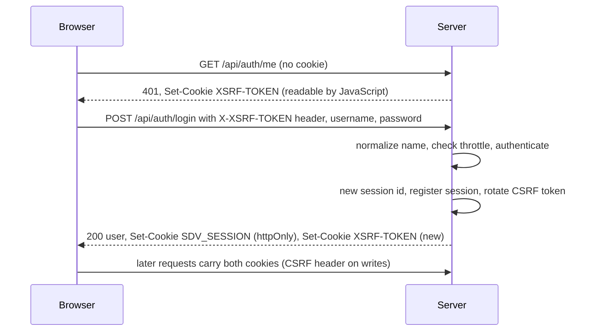
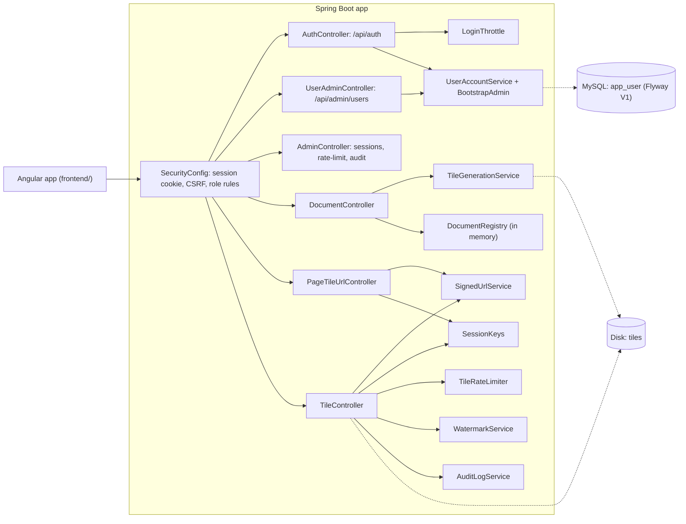

<!-- chapter: 26 | part: IV | owner: writer-app | tag: book-m1-accounts | status: expanded -->
# Chapter 26: Milestone 1: Accounts, roles, and sessions

## Learning objectives

- Explain why "type any username" was the most serious flaw of the first version, and what replaced it.
- Follow one sign-in request through `AuthController` and say what each step defends against.
- Read `SecurityConfig` and say which roles may call which endpoints.
- Explain what an httpOnly session cookie and a CSRF token each protect against, and why the project needs both.
- Explain how `SessionKeys` lets a tile URL depend on a session without containing its id.
- Explain how the tile rate limit and the sign-in throttle work, and what each key is counted by.
- Describe the first Flyway migration and where accounts are stored.
- Describe what the Angular frontend does at this milestone, and what it deliberately does not enforce.

## Prerequisites

Chapters 14–16 (data, Spring Data, and Spring Security basics), 19–23 (the Angular frontend) and
Chapter 25, the milestone this one builds on. The code is at
`book-m1-accounts`: still Spring Boot 3.3.4 and Java 21, now with Spring Security, JPA, Flyway, MySQL
8.4 and an Angular 22 frontend (Blueprint v1). This milestone is pull request #1: an earlier baseline
commit (`1f111ef`, the Angular frontend and admin features) followed by "Phase 1" (`154d62b`, real
accounts, roles, and the admin lockdown). To run this tag yourself, see Table IV.3 ("What you need to
run each tag") in the [Part IV introduction](00-part-introduction.md).
<!-- source: blueprints/v1-accounts.md; timeline; PR #1 body -->

## Beginner tier: From "anyone" to real accounts

### 26.1 The requirements

After the MVP, two independent AI reviewers read the product as outsiders: the AI product-owner reviewer (the PO reviewer) and the AI technical-manager reviewer (the TM reviewer). Between them they filed 13 PO and 20 TM
findings. Two were rated critical.

- **Anyone could sign in as anyone.** Sign-in accepted any username with no password, even an empty
  one (`TM-2`, `PO-3`). The name burned into every watermark therefore meant nothing.
- **Session takeover.** The admin endpoints needed only a valid session and listed every live session id, and the session id was the only credential (`TM-1`, `PO-2`). A user could read another
  user's session id and act as them.

There were more problems. A user could see the admin screens (`PO-1`). The tile token contained the session id (`TM-4`). The per-session tile limit could be bypassed by signing in again (`TM-3`). The signing secret was in the source (`TM-6`). The session id lived in browser storage readable by any injected script (`TM-15`). And the session was per browser tab with a hard cut-off (`PO-9`). Pull request #1 addresses
these, plus `PO-6` (uploads restricted to publishers).
<!-- source: PR #1 body; reviews record; bugs record B -->

The reviewers suggested delegating sign-in to a real identity provider through **OpenID Connect
(OIDC)**, a standard that lets a service such as Google or Keycloak vouch for who a user is; this is
often called single sign-on (SSO). The project owner, asked directly, chose **built-in accounts**:
Spring Security, BCrypt passwords, three roles (READER, PUBLISHER, ADMIN), an httpOnly session cookie,
sign-in throttling, and a seeded first admin. The description of the option offered alongside was that it
needed an identity-provider registration and client secret before it could run.
<!-- source: decisions D1 -->

The pull request lists what it delivers. It shipped 45 backend tests, including 13 security integration
tests and a browser-style flow test for cross-site request forgery (CSRF), and 4 frontend tests (role-aware navigation).
<!-- source: PR #1 body -->

### 26.2 The vocabulary of accounts

- An **account** is a stored record of who may sign in: a username, a password hash, a role.
- A **password hash** is a one-way scrambling of the password. The server keeps the hash, never the
  password, and compares hashes at sign-in. BCrypt is a hash designed to be slow, so guessing
  millions of passwords is expensive. It also adds a random salt to every password, so two users
  with the same password get different hashes.
- A role is a named bundle of permissions. Here READER can read documents they have access to,
  PUBLISHER can also upload, and ADMIN can also manage accounts, sessions, and the audit log.
- A session is the server's memory that you signed in. The browser holds only a small cookie that
  points at it.
- A cookie is a small value the server asks the browser to send back on every request.
- **httpOnly** marks a cookie that page JavaScript can't read, so an injected script can't steal it.
- **SameSite=Strict** tells the browser to send a cookie only for requests that start on this site,
  not from links or forms on other sites.

**Analogy.** A session cookie is a coat-check ticket. You show the ticket, and the attendant fetches
your coat without asking who you are. **Where the analogy breaks down:** a stolen coat-check ticket
gets one coat back, while a stolen session cookie lets someone act as you until the session ends. So
the ticket must never be shown to anyone else, which drives most of this chapter.

**Table 26.1 — Roles at `book-m1-accounts`**

| Role | May do |
|---|---|
| READER | Sign in, list documents, read documents they have access to, change their own password |
| PUBLISHER | Everything a reader can, plus upload documents |
| ADMIN | Everything a publisher can, plus manage users, list, and revoke sessions, view the audit log |

The `Role` enum has exactly these three values, in this order: `READER`, `PUBLISHER`, `ADMIN`. Its
class comment ties them to the roles in Table 26.1. Roles are enforced on the server; the frontend only hides
what a role can't use (Section 26.9).
<!-- source: Role.java, SecurityConfig.java at book-m1-accounts -->

### 26.3 Accounts in the database

**Listing 26.1 — `V1__create_app_user.sql` (book-m1-accounts)**

```sql
-- Accounts that can sign in. Usernames are stored lower-cased by the
-- application, so the unique constraint is effectively case-insensitive.
CREATE TABLE app_user (
    id            BIGINT       NOT NULL AUTO_INCREMENT,
    username      VARCHAR(64)  NOT NULL,
    password_hash VARCHAR(100) NOT NULL,
    role          VARCHAR(20)  NOT NULL,
    enabled       BOOLEAN      NOT NULL DEFAULT TRUE,
    created_at    DATETIME(6)  NOT NULL,
    PRIMARY KEY (id),
    CONSTRAINT uk_app_user_username UNIQUE (username)
);
```

*Path: `src/main/resources/db/migration/V1__create_app_user.sql`*

The file is the first **Flyway migration**: a numbered SQL script that Flyway runs once, in order, so
every copy of the database gets the same shape. `V1` is its version. Flyway records which migrations
have run (and a checksum of each) in its own table, so it never runs one twice, and it refuses to
start if an applied migration has been edited. That rule is why later changes to the schema are new
files (`V2`, `V3`) and never edits of `V1`. The table keeps a hash, not a password. `enabled` lets an
admin disable an account without deleting it. The `UNIQUE` constraint on `username` stops two accounts
sharing a name. `AUTO_INCREMENT` lets the database number rows; `DATETIME(6)` stores time to the
microsecond.
<!-- source: V1__create_app_user.sql at book-m1-accounts -->

`UserAccountService` is "the only place accounts are created or changed." Its class comment gives the
reason for its first rule: usernames are **normalized** to lower case, "so 'Alice' and 'alice' can never
be two different people — the username is what gets burned into every watermark, so it has to be
unambiguous."

**Listing 26.2 — `UserAccountService.create` (book-m1-accounts, simplified: fields and other methods removed)**

```java
private static final Pattern USERNAME = Pattern.compile("[a-z0-9._-]{3,32}");
static final int MIN_PASSWORD_LENGTH = 12;
static final int MAX_PASSWORD_LENGTH = 128;

public static String normalizeUsername(String username) {
    return username == null ? "" : username.trim().toLowerCase(Locale.ROOT);
}

@Transactional
public UserSummary create(String rawUsername, String password, Role role) {
    String username = normalizeUsername(rawUsername);
    if (!USERNAME.matcher(username).matches()) {
        throw new BadRequestException(
                "Username must be 3-32 characters: lower-case letters, digits, '.', '_' or '-'.");
    }
    requireAcceptablePassword(password);
    if (role == null) {
        throw new BadRequestException("A role is required.");
    }
    if (repository.existsByUsername(username)) {
        throw new UsernameTakenException(username);
    }
    return UserSummary.of(repository.save(new AppUser(username, passwordEncoder.encode(password), role)));
}
```

*Path: `src/main/java/com/example/securedocviewer/account/UserAccountService.java`*

**Worked example.** An admin creates an account called ` Pub.One ` (with stray spaces and capitals).
`normalizeUsername` trims and lower-cases it to `pub.one`. The pattern `[a-z0-9._-]{3,32}` accepts it
(3 to 32 characters, letters, digits, dot, underscore, hyphen). The password must be 12 to 128
characters. If `pub.one` already exists the method throws `UsernameTakenException`. Otherwise the
password is turned into a hash by `passwordEncoder.encode(password)` and the account is saved. Note
what *isn't* stored: the password. The `@Transactional` annotation makes the check-and-save one unit,
so two simultaneous requests can't both pass `existsByUsername` (the database's `UNIQUE` constraint is
the final backstop).
<!-- source: UserAccountService.java at book-m1-accounts -->

### 26.4 The first admin

If accounts are created only by admins, who creates the first admin? `BootstrapAdmin` answers. It runs
once at startup (it implements `ApplicationRunner`) and does nothing if any account exists.

**Listing 26.3 — `BootstrapAdmin.run` (book-m1-accounts, simplified: constructor, fields, and password generator removed)**

```java
@Override
public void run(ApplicationArguments args) {
    if (accounts.hasAnyUsers()) {
        return;
    }
    boolean generated = configuredPassword == null || configuredPassword.isBlank();
    String password = generated ? randomPassword() : configuredPassword;
    accounts.create(username, password, Role.ADMIN);
    if (generated) {
        log.warn("\n\nCreated initial admin account '{}' with generated password: {}\n"
                + "Sign in and change it (or set BOOTSTRAP_ADMIN_PASSWORD before first start).\n", username, password);
    } else {
        log.info("Created initial admin account '{}' from BOOTSTRAP_ADMIN_PASSWORD.", username);
    }
}
```

*Path: `src/main/java/com/example/securedocviewer/account/BootstrapAdmin.java`*

The class comment explains the design. The password comes from the environment variable `BOOTSTRAP_ADMIN_PASSWORD`; "if that isn't set, a random one is generated and logged once (the same approach Spring Boot takes for its default user), so no credential ever has to be committed." The generator draws 20 characters from an alphabet without look-alike letters. It uses `SecureRandom`, a random number generator meant for security. (You will meet the same "no I, L, O" idea in Chapter 29.)
On a fresh install you sign in as `admin` with the password from your own `.env` file or the startup
log, then change it on the Account page. Never reuse a real password for a local copy.
<!-- source: BootstrapAdmin.java at book-m1-accounts; README -->

## Intermediate tier: How the pieces talk to each other

*Assumes the beginner tier. This tier follows a request from the Angular app through Spring Security
to the controllers, and shows why the project used a cookie session.*

### 26.5 One sign-in, step by step

Figure 26.1 shows the sign-in from the browser's side and the server's.



*Figure 26.1 — Sign-in and the two cookies (`book-m1-accounts`)*

*Text description:* A sequence diagram between the browser and the server. First the browser asks for the current user without a cookie, and the server answers 401 and sets a readable XSRF-TOKEN cookie. The browser then posts the username and password with that token in a header. The server normalizes the name, checks the sign-in throttle and authenticates, then creates a new session id, registers it and rotates the CSRF token. The reply carries the httpOnly session cookie and a new CSRF cookie, and later requests send both. Notice the two different cookies and that the token is replaced at sign-in.
<!-- source: sign-in flow at book-m1-accounts: controller/AuthController.java (login, rotateCsrfToken), security/LoginThrottle.java, security/DatabaseUserDetailsService.java, security/SecurityConfig.java, security/SpaCsrfTokenRequestHandler.java (under src/main/java/com/example/securedocviewer/) and application.yml session cookie settings -->


Now the code that implements the server's half.

**Listing 26.4 — `AuthController.login` (book-m1-accounts, simplified: constructor and other endpoints removed)**

```java
@PostMapping("/login")
public ResponseEntity<CurrentUser> login(@Valid @RequestBody LoginRequest body,
                                         HttpServletRequest request,
                                         HttpServletResponse response) {
    String username = UserAccountService.normalizeUsername(body.username());
    String clientIp = request.getRemoteAddr();
    loginThrottle.checkAllowed(username, clientIp);

    Authentication authentication;
    try {
        authentication = authenticationManager.authenticate(
                UsernamePasswordAuthenticationToken.unauthenticated(username, body.password()));
    } catch (AuthenticationException e) {
        // Same message for unknown user, wrong password and disabled
        // account, so the response doesn't reveal which accounts exist.
        loginThrottle.recordFailure(username, clientIp);
        throw new BadCredentialsException("Invalid username or password.");
    }
    loginThrottle.recordSuccess(username, clientIp);

    // Ensure a session exists, then rotate its id and register it.
    request.getSession(true);
    sessionAuthenticationStrategy.onAuthentication(authentication, request, response);
    rotateCsrfToken(request, response);
    SecurityContext context = SecurityContextHolder.createEmptyContext();
    context.setAuthentication(authentication);
    SecurityContextHolder.setContext(context);
    securityContextRepository.saveContext(context, request, response);

    return ResponseEntity.ok(toCurrentUser(authentication));
}
```

*Path: `src/main/java/com/example/securedocviewer/controller/AuthController.java`*

Read it in order.

1. **Normalize the name.** `Alice` and `alice` are the same person.
2. **Ask the throttle first.** `loginThrottle.checkAllowed` refuses (with a 429) if this account from
   this address, or this address overall, has failed too often recently (Section 26.11). Checking before
   the password means a locked-out attacker doesn't even get a password comparison.
3. **Authenticate.** The `authenticationManager` loads the account and compares the password with the
   hash (BCrypt).
4. **One message for every failure.** Unknown user, wrong password, and disabled account all produce
   the same `Invalid username or password.` The comment says why: "so the response doesn't reveal which
   accounts exist." A different message for "no such user" would let an attacker list valid usernames.
   This is called user enumeration.
5. **Record the failure or success** with the throttle.
6. **Create the session and change its id.** `sessionAuthenticationStrategy` gives the user a *new*
   session id and registers it. This defeats session fixation, an attack where the attacker plants a
   known session id in your browser before you sign in and then uses it afterward. A new id after sign-in
   makes the planted one worthless.
7. **Rotate the CSRF token.** Section 26.6 explains why this line exists.
8. **Store the security context** in the session, so later requests are recognized as signed in, and
   return the user's name and role. The password is never returned.
<!-- source: AuthController.java at book-m1-accounts -->

### 26.6 Spring Security configuration (`SecurityConfig`)

Every request passes through a **filter chain**, a row of checks that each request must pass in order,
before it reaches a controller. Table 26.2 summarizes the authorization rules that `SecurityConfig`
declares, and Listing 26.5 shows them in the source.

**Table 26.2 — Who may call what at `book-m1-accounts`**

| Request | Allowed for |
|---|---|
| `POST /api/auth/login` | anyone |
| `/api/admin/**` | ADMIN |
| `POST /api/documents` (upload) | PUBLISHER, ADMIN |
| any other `/api/**` | any signed-in user |
| `/error` (Spring's error page) | anyone |
| anything else | nobody (`denyAll`) |

**Listing 26.5 — `SecurityConfig.securityFilterChain` (book-m1-accounts, simplified: Javadoc and the other beans removed)**

```java
@Bean
public SecurityFilterChain securityFilterChain(HttpSecurity http,
                                               CsrfTokenRepository csrfTokenRepository,
                                               SecurityContextRepository securityContextRepository,
                                               SessionRegistry sessionRegistry,
                                               SecurityErrorResponses errors) throws Exception {
    http
            .csrf(csrf -> csrf
                    .csrfTokenRepository(csrfTokenRepository)
                    .csrfTokenRequestHandler(new SpaCsrfTokenRequestHandler()))
            .securityContext(context -> context.securityContextRepository(securityContextRepository))
            .sessionManagement(session -> session
                    .sessionFixation(fixation -> fixation.changeSessionId())
                    // Unlimited concurrent sessions, but registered, so an
                    // admin can list and revoke them.
                    .maximumSessions(-1)
                    .sessionRegistry(sessionRegistry)
                    .expiredSessionStrategy(errors))
            .authorizeHttpRequests(auth -> auth
                    .requestMatchers(HttpMethod.POST, "/api/auth/login").permitAll()
                    .requestMatchers("/api/admin/**").hasRole("ADMIN")
                    .requestMatchers(HttpMethod.POST, "/api/documents").hasAnyRole("PUBLISHER", "ADMIN")
                    .requestMatchers("/api/**").authenticated()
                    .requestMatchers("/error").permitAll()
                    .anyRequest().denyAll())
            .exceptionHandling(exceptions -> exceptions
                    .authenticationEntryPoint(errors)
                    .accessDeniedHandler(errors))
            .requestCache(cache -> cache.disable())
            .formLogin(AbstractHttpConfigurer::disable)
            .httpBasic(AbstractHttpConfigurer::disable)
            .logout(AbstractHttpConfigurer::disable);
    return http.build();
}
```

*Path: `src/main/java/com/example/securedocviewer/security/SecurityConfig.java`*

Read the `authorizeHttpRequests` block from top to bottom: Spring applies the first rule that matches.
The last line, `anyRequest().denyAll()`, is a **deny by default** stance: a route you forget to list is
closed, not open. Login, form login, HTTP basic, and Spring's own logout are disabled because
`AuthController` implements sign-in and sign-out itself. `SecurityErrorResponses` writes a 401 or 403
in the same `{"error": "..."}` JSON shape as `GlobalExceptionHandler`, for failures that happen inside
the filter chain before any controller runs.

The class's own Javadoc gives the reasoning behind the cookie design. The server-side session lives in an
httpOnly cookie, "so the session id is never visible to JavaScript, never sent in a custom header, and
never returned by any endpoint." Because a browser sends cookies automatically, every state-changing
request also needs a CSRF token. Authorization "is enforced here, not in the UI: the frontend only hides
what a role can't use."

Two of the settings in Listing 26.5 deserve a sentence each.

- **Session fixation protection** (`changeSessionId`) gives you a new session id at sign-in, as in step
  6 of the previous section.
- **`maximumSessions(-1)` with a session registry** allows unlimited concurrent sessions (a user may
  be signed in on a phone and a laptop) but records them, so an admin can list and revoke them.

The session cookie itself is configured in `application.yml`.

**Listing 26.6 — `application.yml` session settings (book-m1-accounts)**

```yaml
server:
  port: 8080
  servlet:
    session:
      # Idle timeout: each request extends it, so an active reader is never
      # cut off mid-document, while an abandoned session still dies.
      timeout: 30m
      cookie:
        name: SDV_SESSION
        http-only: true
        same-site: strict
        # Must be true anywhere the app is served over HTTPS.
        secure: ${SESSION_COOKIE_SECURE:false}
```

*Path: `src/main/resources/application.yml`*

The session cookie is named `SDV_SESSION`, is `http-only` and `same-site: strict`, and has a 30-minute
idle timeout: the session ends after that long without a request, and every request extends it (a
**sliding** timeout). The `secure` flag makes a browser send the
cookie only over HTTPS; it must be true wherever the app is served over HTTPS, and is driven by an
environment variable so local development over plain HTTP still works.
<!-- source: SecurityConfig.java, application.yml at book-m1-accounts; decisions D3 -->

### 26.7 CSRF: the second cookie

Because the browser attaches the session cookie to every request to this site automatically, another
website could make your browser send a request to this app, for example a hidden form that submits
a delete. CSRF (cross-site request forgery) is that attack. `SameSite=Strict` already stops most of
it, since the browser won't attach the cookie to a request started elsewhere. The project also uses the
older, well-tested defense: a second value, the CSRF token, that a page on another site can't read.

The design is the double-submit cookie pattern. The server sets a cookie named `XSRF-TOKEN` that
JavaScript *can* read (this is the one cookie that is not httpOnly, on purpose). Angular's `HttpClient`
copies its value into a request header, `X-XSRF-TOKEN`, on every write. The server compares the header
with the cookie. A forged request from another site can carry the cookie (the browser attaches it) but
can't read it to put its value in the header.

**Listing 26.7 — `SpaCsrfTokenRequestHandler` (book-m1-accounts, simplified: imports removed)**

```java
final class SpaCsrfTokenRequestHandler implements CsrfTokenRequestHandler {

    private final CsrfTokenRequestHandler plain = new CsrfTokenRequestAttributeHandler();
    private final CsrfTokenRequestHandler xor = new XorCsrfTokenRequestAttributeHandler();

    @Override
    public void handle(HttpServletRequest request, HttpServletResponse response, Supplier<CsrfToken> csrfToken) {
        xor.handle(request, response, csrfToken);
        csrfToken.get();
    }

    @Override
    public String resolveCsrfTokenValue(HttpServletRequest request, CsrfToken csrfToken) {
        String header = request.getHeader(csrfToken.getHeaderName());
        return (StringUtils.hasText(header) ? plain : xor).resolveCsrfTokenValue(request, csrfToken);
    }
}
```

*Path: `src/main/java/com/example/securedocviewer/security/SpaCsrfTokenRequestHandler.java`*

The class comment calls this "Spring Security's recommended CSRF handling for single-page apps": the single-page application (SPA) echoes the raw cookie value in the header, while values rendered by the server stay
protected against a subtle attack called BREACH. `csrfToken.get()` is called on every request "to make
sure the XSRF-TOKEN cookie is always present for the SPA to read." In the security configuration the
`CookieCsrfTokenRepository.withHttpOnlyFalse()` repository is set to `SameSite=Strict` and path `/`.

The last piece is in step 7 of the sign-in: **rotating** the token. Section 26.14 tells the story of the bug that made it necessary.
<!-- source: SpaCsrfTokenRequestHandler.java, SecurityConfig.java at book-m1-accounts -->

### 26.8 Why a cookie session and not a token in JavaScript

At milestone 0 the session id lived in an `X-Session-Id` header, and in the first Angular baseline, in
`sessionStorage`, where any injected script can read it (`TM-15`). The project's record shows the
outcome (a server-side session in an httpOnly cookie) but no debate about JSON Web Tokens, so the book
does not describe one.

*Pattern note: The session-plus-capability-URL hybrid is discussed in Chapter 39, Section 39.9.*

What the choice buys is that nothing secret is ever visible to page JavaScript. The frontend's
`SessionService` comment says it exactly: "The credential itself is an httpOnly cookie the browser
manages — nothing secret is held here or in web storage — so the session is shared across tabs and
survives a reload: on startup we simply ask the server who we are." The choice costs two things: CSRF protection (Section 26.7) and a server that holds session state, so a single instance for now.
<!-- source: session.service.ts at book-m1-accounts; decisions D3 -->

### 26.9 The Angular frontend appears

The first commit of this milestone, `1f111ef`, adds the Angular frontend: sign-in, document list,
upload, viewer, and admin pages. It replaces the m0 static page. Tiles are painted as absolutely
positioned elements with CSS background images, not on a canvas (Chapter 21 explains the technique). The project README at the tags still says that the browser reassembles tiles onto a canvas; a later documentation-only pull request (#13) corrected that sentence, so trust the code.
Angular's development-server proxy makes the app and the API share one origin during development.

**Listing 26.8 — `auth.guard.ts` (book-m1-accounts)**

```ts
export const authGuard: CanActivateFn = (_route, state) => {
  const sessionService = inject(SessionService);
  const router = inject(Router);

  if (sessionService.isLoggedIn()) {
    return true;
  }
  return router.createUrlTree(['/login'], { queryParams: { returnUrl: state.url } });
};

/**
 * UX only: keeps users off screens their role can't use. The server
 * enforces the same rules on every API call regardless of this guard.
 */
export const roleGuard =
  (...roles: Role[]): CanActivateFn =>
  (route, state) => {
    const signedIn = authGuard(route, state);
    if (signedIn !== true) {
      return signedIn;
    }
    return inject(SessionService).hasAnyRole(...roles) ? true : inject(Router).createUrlTree(['/documents']);
  };
```

*Path: `frontend/src/app/core/auth.guard.ts`*

A route guard decides whether the router may open a page. `authGuard` lets signed-in users through
and otherwise redirects to `/login`, remembering the requested address in a `returnUrl` query
parameter so that signing in returns you there. `roleGuard` builds on it: it requires one of the listed
roles. The comment is the important sentence: "UX only ... The server enforces the same rules on every
API call regardless of this guard." A guard only spares users from screens that would fail. Anyone can
call the API directly, so the server is the only place that protects.

`app.routes.ts` uses the guards: `documents` and `viewer/:documentId` need `authGuard`;
`documents/upload` needs `roleGuard('PUBLISHER', 'ADMIN')`; `admin` needs `roleGuard('ADMIN')`; and
`login` is open. Its page components load lazily (`loadComponent: () => import(...)`), so the browser
downloads a screen's code only when it is visited.

The `SessionService` holds "who is signed in" as a signal that the navigation, guards and
interceptor all read. On startup it calls `GET /api/auth/me`, which also primes the CSRF cookie, and a
401 anywhere (an HTTP interceptor watches) clears the state and sends the user to sign in.
<!-- source: auth.guard.ts, app.routes.ts, session.service.ts at book-m1-accounts; PR #1 body -->

## Advanced tier: Security decisions and what they cost

*Assumes the earlier tiers. This tier covers the session-binding design that closes a token leak, the
throttles, the admin safeguards, and the operational setup, and the bugs that only a real browser flow
found.*

### 26.10 Binding tile tokens to a session (`SessionKeys`)

At milestone 0 the tile token contained the session id, in plain base64: a leaked tile URL therefore
leaked the credential (`TM-4`). The fix changes what the token carries. `SessionKeys` derives values
from the session id with HMAC so the id never leaves the server.

**Listing 26.9 — `SessionKeys.java` (book-m1-accounts, simplified: imports removed)**

```java
@Component
public class SessionKeys {

    private static final String HMAC_ALGO = "HmacSHA256";

    private final ViewerProperties properties;

    public SessionKeys(ViewerProperties properties) {
        this.properties = properties;
    }

    public String tileBinding(String sessionId) {
        return derive("tile-binding:", sessionId, 16);
    }

    public boolean tileBindingMatches(String sessionId, String binding) {
        return sessionId != null && binding != null && MessageDigest.isEqual(
                tileBinding(sessionId).getBytes(StandardCharsets.UTF_8),
                binding.getBytes(StandardCharsets.UTF_8));
    }

    public String adminHandle(String sessionId) {
        return derive("admin-handle:", sessionId, 9);
    }

    private String derive(String context, String sessionId, int bytes) {
        try {
            Mac mac = Mac.getInstance(HMAC_ALGO);
            mac.init(new SecretKeySpec(properties.getSigningSecret().getBytes(StandardCharsets.UTF_8), HMAC_ALGO));
            byte[] digest = mac.doFinal((context + sessionId).getBytes(StandardCharsets.UTF_8));
            return Base64.getUrlEncoder().withoutPadding().encodeToString(Arrays.copyOf(digest, bytes));
        } catch (GeneralSecurityException e) {
            throw new IllegalStateException("Failed to derive session key", e);
        }
    }
}
```

*Path: `src/main/java/com/example/securedocviewer/security/SessionKeys.java`*

There are two derived values, each with its own HMAC **context string** ("tile-binding:" and
"admin-handle:"), so one can't stand in for the other. Mixing a different prefix into the HMAC input
makes the two functions unrelated, even though they use the same key and the same session id.

- The **tile binding** goes into signed tile URLs in place of the session id. A tile request must
  present both the URL and the session cookie it derives from, so a leaked URL alone is useless.
  The tile endpoint recomputes the binding from the caller's own session id and compares it with the
  one in the token, using the constant-time check you met in Chapter 25.
- The **admin handle** identifies a session in the admin screen so it can be revoked. It can't be turned
  back into the id (HMAC is one-way) or used to sign in.

**Worked example.** Alice signs in and receives session id `S`. The server issues her tile URLs with
`binding = HMAC("tile-binding:" + S)`, truncated to 16 bytes. Suppose the URL leaks in a chat message.
Bob opens it with his own session `T`. The server computes `HMAC("tile-binding:" + T)`, which differs
from the binding in the token, so it refuses the request. Signing the token only proved the server
issued it; the binding proves it is being used by the session it was issued to. This closes `TM-4` and
the display half of `TM-1`. (Chapter 29 later changes the encoding of the admin handle to Crockford
Base32.)
<!-- source: SessionKeys.java at book-m1-accounts; bugs record B (TM-1, TM-4); PR #1 body -->

### 26.11 Rate limiting and sign-in lockout

Two guards arrive, and each counts something different on purpose.

*Pattern note: A per-user limit is the rate limiter and bulkhead idea (Chapter 38, Section 38.9).*

**The tile rate limit** (`TileRateLimiter`) is keyed by *username*, not session. The class comment
says why: "signing in again (or in several tabs/browsers at once) doesn't hand out a fresh
allowance." At m0 a script could sign in again to reset a per-session limit (`TM-3`). The limit is a
**sliding window**: it remembers the times of a user's recent tile requests, drops those older than
the window, and refuses if the count reaches the limit. The aim is to make a **scrape** slow: a scrape is a script that copies content by requesting all of it in bulk, here every tile of every page.

**Listing 26.10 — `TileRateLimiter.recordAndEnforce` (book-m1-accounts, simplified: fields, other methods, and Javadoc removed)**

```java
public void recordAndEnforce(String username) {
    Window window = windowsByUser.computeIfAbsent(username, id -> new Window());
    Instant now = Instant.now();
    Instant cutoff = now.minusSeconds(properties.getTileRateLimitWindowSeconds());

    synchronized (window) {
        while (!window.timestamps.isEmpty() && window.timestamps.peekFirst().isBefore(cutoff)) {
            window.timestamps.pollFirst();
        }
        if (window.timestamps.size() >= properties.getTileRateLimitPerWindow()) {
            // The next slot frees up when the oldest counted request
            // slides out of the window; tell the client exactly when.
            long retryAfterSeconds = Math.max(1, (long) Math.ceil(
                    Duration.between(cutoff, window.timestamps.peekFirst()).toMillis() / 1000.0));
            throw new RateLimitExceededException(
                    "Tile rate limit reached (" + properties.getTileRateLimitPerWindow()
                            + " per " + properties.getTileRateLimitWindowSeconds() + "s).",
                    retryAfterSeconds);
        }
        window.timestamps.addLast(now);
    }
}
```

*Path: `src/main/java/com/example/securedocviewer/security/TileRateLimiter.java`*

Each user has a queue of timestamps (`ArrayDeque`). The `while` loop removes timestamps older than the
window from the front. If what remains is at the limit, the method computes exactly when the oldest
remaining request will leave the window and throws an exception carrying that number, which the
handler turns into HTTP 429 with a `Retry-After` header. Otherwise it records "now." The
`synchronized (window)` block makes the prune-count-add sequence atomic for one user, so two
simultaneous requests can't both slip past the last free slot.

The defaults in `application.yml` are 120 tiles per 60 seconds. The comment explains the number: "A
150-DPI letter page is ~35 tiles, so 120 lets a reader turn ~3 pages a minute without waiting while
still keeping a full-document scrape slow." Example 25.1 in Chapter 25 derived the 35. Chapter 30 returns to this trade-off after real reading showed it was too tight.

**The sign-in throttle** (`LoginThrottle`) slows password guessing. Failures are counted in a rolling
15-minute window, per (username, client address) with a limit of 5, and separately per address with a
limit of 20. Its class comment states both reasons: per-pair, "so one attacker can't lock a real user
out from everywhere," and per address, "so spraying many usernames from one address is capped too." A
success clears that account's counter. The counts are in memory, so they reset on a restart and aren't
shared across instances; the comment argues that is acceptable because a throttle "only ever errs on the
side of letting a request through."

Milestone 5 (Chapter 30) revisits the throttle twice: a review showed that a stranger could use it to
lock a victim out, and another showed a race that let nine parallel guesses through a limit of 5.
<!-- source: TileRateLimiter.java, LoginThrottle.java, application.yml at book-m1-accounts; decisions D6, D7; PR #1 body -->

### 26.12 Admin: sessions, users, audit

`AdminController` and `UserAdminController` sit behind the `ADMIN` rule. An admin can list sessions (by
opaque handle, never by id) and revoke them, create accounts, change roles, disable accounts, and reset
passwords. Changing a user's role or password ends that user's sessions, and `AuthController.changePassword`
ends the user's *other* sessions when they change their own password, "so a password change locks
out anyone who had it."

**Listing 26.11 — `UserAccountService.update` (book-m1-accounts, simplified: Javadoc kept, other methods removed)**

```java
/**
 * Changes role and/or enabled flag. An admin can't demote or disable
 * themselves, so the system can't be left with no one able to manage it.
 */
@Transactional
public UserSummary update(String actingUsername, String rawUsername, Role newRole, Boolean enabled) {
    AppUser user = require(rawUsername);
    boolean self = user.getUsername().equals(normalizeUsername(actingUsername));
    if (self && newRole != null && newRole != Role.ADMIN) {
        throw new BadRequestException("You can't remove your own admin role.");
    }
    if (self && Boolean.FALSE.equals(enabled)) {
        throw new BadRequestException("You can't disable your own account.");
    }
    if (newRole != null) {
        user.setRole(newRole);
    }
    if (enabled != null) {
        user.setEnabled(enabled);
    }
    return UserSummary.of(user);
}
```

*Path: `src/main/java/com/example/securedocviewer/account/UserAccountService.java`*

The safeguard is a small rule with a large effect: an admin can't demote or disable *themselves*. If the
last admin could, the system would be left with nobody able to manage it. Rules like this are cheap
to write and expensive to discover in production.

At this tag the audit log is still a small in-memory list (a 500-entry buffer); Chapter 27 replaces it
with a persistent one.
<!-- source: UserAccountService.java, AuthController.java at book-m1-accounts; PR #1 body; research answers V2, V4 -->

### 26.13 Why MySQL, and the first Compose file

The project's data model needed to outlive a restart, and the m0 in-memory maps could not. The
implementer recommended an embedded H2 file database; the project owner overrode that and said they
wanted to work with MySQL, and chose to install Docker Desktop to run it. The project therefore uses
MySQL 8.4 (the long-term-support line) in Docker, with Flyway managing the schema. Tests still use H2
in MySQL mode at this tag; a later review asks for real MySQL in tests (Chapter 30).
<!-- source: decisions D2 -->

**Listing 26.12 — `docker-compose.yml` (book-m1-accounts)**

```yaml
services:
  mysql:
    image: mysql:8.4
    container_name: securedocs-mysql
    restart: unless-stopped
    environment:
      MYSQL_DATABASE: ${DB_NAME:-securedocs}
      MYSQL_USER: ${DB_USERNAME:-securedocs}
      MYSQL_PASSWORD: ${DB_PASSWORD:?Set DB_PASSWORD in .env}
      MYSQL_ROOT_PASSWORD: ${DB_ROOT_PASSWORD:?Set DB_ROOT_PASSWORD in .env}
    ports:
      # Bound to localhost only; the database is never exposed to the network.
      - "127.0.0.1:${DB_PORT:-3306}:3306"
    volumes:
      - mysql-data:/var/lib/mysql
    healthcheck:
      test: ["CMD", "mysqladmin", "ping", "-h", "localhost", "-u", "root", "-p${DB_ROOT_PASSWORD}"]
      interval: 5s
      timeout: 5s
      retries: 20

volumes:
  mysql-data:
```

*Path: `docker-compose.yml`*

Points to notice, each a small security decision. Passwords come from a git-ignored `.env` file; the
`${DB_PASSWORD:?Set DB_PASSWORD in .env}` form makes Compose refuse to start with a clear message if
one is missing. The database port is published only on `127.0.0.1` (this machine), "the database is
never exposed to the network." The data lives in a named volume so it survives the container. The
health check puts the root password on the command line (`-p${DB_ROOT_PASSWORD}`), which anyone able to inspect the container could read. The platform milestone later removes that, and the final-review rounds of Chapter 30 record "MySQL health check no longer puts the root password on the command line." The service is only for development: the app itself still runs from your editor at this tag.

A note for later chapters: Spring configuration imports a local `.env` file
(`spring.config.import: optional:file:.env[.properties]`), so the same file feeds both Compose and the
app in development. Real environment variables win over it.
<!-- source: docker-compose.yml, application.yml at book-m1-accounts; bugs record G7 -->

### 26.14 The tests that pin it, and the bug they found

The CSRF story of this milestone is the best example in the book of why tests must exercise the real
flow.

**Listing 26.13 — `CsrfCookieFlowTest` (book-m1-accounts, simplified: setup and the test password replaced by a placeholder)**

```java
@SpringBootTest
@AutoConfigureMockMvc
@ActiveProfiles("test")
@DirtiesContext(classMode = DirtiesContext.ClassMode.BEFORE_CLASS)
class CsrfCookieFlowTest {

    @Test
    void signInResponseCarriesAFreshCsrfTokenUsableImmediately() throws Exception {
        accounts.create("csrf-user", "<test password>", Role.READER);

        MvcResult anonymous = mvc.perform(get("/api/auth/me")).andExpect(status().isUnauthorized()).andReturn();
        Cookie initialToken = anonymous.getResponse().getCookie("XSRF-TOKEN");
        assertNotNull(initialToken, "first visit did not set XSRF-TOKEN");

        MvcResult signIn = mvc.perform(post("/api/auth/login")
                        .session((MockHttpSession) anonymous.getRequest().getSession(true))
                        .cookie(initialToken)
                        .header("X-XSRF-TOKEN", initialToken.getValue())
                        .contentType(MediaType.APPLICATION_JSON)
                        .content(objectMapper.writeValueAsString(
                                Map.of("username", "csrf-user", "password", "<test password>"))))
                .andExpect(status().isOk())
                .andReturn();
        Cookie rotated = signIn.getResponse().getCookie("XSRF-TOKEN");
        assertNotNull(rotated, "sign-in response did not set XSRF-TOKEN");
        assertNotEquals(initialToken.getValue(), rotated.getValue(), "CSRF token was not rotated at sign-in");
        ...
    }
}
```

*Path: `src/test/java/com/example/securedocviewer/security/CsrfCookieFlowTest.java`*

The test drives the cookies "exactly as a browser would, with no test CSRF helper." Its steps are these. Visit `/api/auth/me` anonymously: the answer is a 401, but the response sets `XSRF-TOKEN`. Sign in carrying that cookie and header. Assert that the sign-in response carries a *new*, non-empty `XSRF-TOKEN` different from the first. Then, in the lines that the excerpt omits, check that the old token no longer works and the new one works at once.
<!-- source: CsrfCookieFlowTest.java at book-m1-accounts -->

## Common mistakes

**Storing or logging passwords.** Symptom: a password appears in a database dump or log. Fix: store
only a BCrypt hash. (The bootstrap password is logged once by design, and only when you didn't supply
one.)

**Different errors for "no such user" and "wrong password."** Symptom: an attacker can list valid
usernames. Fix: one message for all sign-in failures (step 4, Section 26.5).

**Keeping the old session id after sign-in.** Symptom: session fixation. Fix: rotate it
(`changeSessionId`).

**Treating the frontend guard as security.** Symptom: a user hides the admin link and calls the API
anyway. Fix: enforce roles in `SecurityConfig`; the guard is only about experience.

**Forgetting the CSRF token, or making the session cookie readable.** Symptom: either forged requests
succeed, or a script can steal the session. Fix: httpOnly session cookie plus a separate readable CSRF
cookie and header.

**Counting a limit by a value the caller controls.** Symptom: signing in again resets the allowance.
Fix: key by the user (Section 26.11).

**Letting an admin lock themselves out.** Symptom: no one can manage the system. Fix: forbid demoting
or disabling yourself (Listing 26.11).

**Testing with a helper that replaces the thing under test.** Symptom: a bug passes every test. Fix: a
test that runs the real cookie flow in its own context (Section 26.14).

## Architecture blueprint v1

Figure 26.2 is Blueprint v1.



*Figure 26.2 — Blueprint v1 (`book-m1-accounts`)*

*Text description:* A left-to-right flowchart. The Angular app sends every request to SecurityConfig, which fans out to AuthController, UserAdminController, AdminController, DocumentController, PageTileUrlController, and TileController. AuthController uses LoginThrottle and UserAccountService with BootstrapAdmin; UserAccountService reaches MySQL, which holds only the app_user table from migration V1 (dotted line). The tile-URL and tile controllers use SignedUrlService and SessionKeys; TileController also uses TileRateLimiter, WatermarkService and AuditLogService. DocumentController uses TileGenerationService and the in-memory DocumentRegistry, and tiles are on disk. Notice that everything passes through SecurityConfig and that documents are still not in the database.
<!-- source: book/blueprints/v1-accounts.md; classes named in the diagram, present at book-m1-accounts under src/main/java/com/example/securedocviewer/: controller/AdminController.java, service/AuditLogService.java, controller/AuthController.java, account/BootstrapAdmin.java, controller/DocumentController.java, service/DocumentRegistry.java, security/LoginThrottle.java, controller/PageTileUrlController.java, security/SecurityConfig.java, security/SessionKeys.java, service/SignedUrlService.java, controller/TileController.java, service/TileGenerationService.java, security/TileRateLimiter.java, account/UserAccountService.java, controller/UserAdminController.java, service/WatermarkService.java; db/migration/V1__create_app_user.sql; docker-compose.yml; frontend/ -->

What changed since v0:

- `SessionController` and `SessionService` are removed. Sign-in is `POST /api/auth/login` with a password, an httpOnly session cookie and a CSRF cookie plus header.
- A new `account/` package and the first migration, `V1__create_app_user.sql`.
- Admin endpoints for users, sessions, rate-limit usage, and the audit log.
- `LoginThrottle` and `TileRateLimiter`; `SessionKeys` binds tokens to the session without exposing its id.
- The static page is replaced by the Angular frontend, and `docker-compose.yml` starts MySQL.
- Documents are still in memory.
<!-- source: blueprints/v1-accounts.md -->

## Decisions and challenges

### Decision: built-in accounts, not an identity provider

**The decision.** Spring Security with BCrypt accounts and three roles, chosen by the project owner.
**The options considered.** Built-in accounts, or external single sign-on through OIDC as the reviewers
suggested. **Why this one.** The offered description called built-in accounts self-contained and able to
work offline, and said they could be swapped for single sign-on later, whereas OIDC needed an
identity-provider registration first. **What it costs.** The project now stores password hashes and must
run the throttling, lockout, and password-change logic itself (Chapters 30 and 32).
<!-- source: decisions D1 -->

### Decision: MySQL over H2

**The decision.** MySQL 8.4 through Docker, chosen by the project owner against the implementer's H2
recommendation. **Why.** The project owner said they wanted to work with MySQL. **What it costs.**
Docker Desktop had to be installed first, which took several steps on the project owner's Windows
machine.
<!-- source: decisions D2 -->

### Decision: cookie sessions

**The decision.** A server-side session in an httpOnly, SameSite=Strict cookie, with CSRF protection
and a 30-minute sliding timeout. **Why.** It removes the credential from anything JavaScript can read
(`TM-15`, `TM-1`). **What it costs.** CSRF protection is now required, and state lives on the server.
<!-- source: decisions D3 -->

### Incident: signing in deleted the CSRF cookie

**The problem.** With CSRF protection on, the first write request made straight after signing in
returned 403. **How it was found.** A live check against MySQL during Phase 1, in a real
browser-style flow. **The cause.** Session-fixation protection replaces the session on sign-in, and
Spring's default CSRF handling removed the CSRF cookie at that moment without issuing a new one, then
re-read the token from the request, which still carried the old cookie. **The fix.** The sign-in response
issues a fresh CSRF token itself (an explicit rotation, `AuthController.rotateCsrfToken`: "Generating and
saving explicitly sends exactly one Set-Cookie with the new value"). **The lesson.** Unit tests that inject
a token don't exercise the real browser flow.
<!-- source: bugs record C1; PR #1 body; AuthController.java at book-m1-accounts -->

### Incident: the test helper hid the bug

**The problem.** The project already had `SecurityIntegrationTest`, yet it never caught the CSRF bug
of the previous incident. **How it was found.** The reason is recorded in the Javadoc of the new `CsrfCookieFlowTest`:
`spring-security-test`'s `csrf()` helper permanently swaps the CSRF filter's repository in whatever
Spring context it runs in, so no real `XSRF-TOKEN` cookie is ever written. **The fix.** A separate test
class that drives the cookie as a browser does, with no test helper, and gets a fresh Spring context
(`@DirtiesContext`). **The lesson.** A test helper can change the very thing under test. Test the real
flow in a clean context.
<!-- source: bugs record C2; CsrfCookieFlowTest.java at book-m1-accounts -->

### Finding: a verified session takeover

**The problem.** `TM-1` was demonstrated, not only theorized. As one test user the TM reviewer read another
user's session id from `/api/admin/sessions`, requested tile URLs with it, and got a tile back; the audit
log and the watermark both named the victim. **The fix.** Roles on the admin API, and sessions listed by
handle. **The lesson.** Never return a credential in an API, and derive identity from a verified
principal, not from something the client sends.
<!-- source: bugs record B (TM-1) -->

## In this project

**Table 26.3 — Where the concepts live (at `book-m1-accounts`)**

| Concept | Where |
|---|---|
| Accounts | `account/AppUser`, `Role`, `UserAccountService`, `BootstrapAdmin`; `V1__create_app_user.sql` |
| Security rules | `security/SecurityConfig`, `SpaCsrfTokenRequestHandler`, `SecurityErrorResponses` |
| Sign-in and sign-out | `controller/AuthController`, `security/DatabaseUserDetailsService` |
| Session binding | `security/SessionKeys` |
| Throttles | `security/LoginThrottle`, `security/TileRateLimiter` |
| Admin | `controller/AdminController`, `UserAdminController`, `security/SessionAdministration` |
| Frontend | `frontend/src/app/core/*`, `features/auth/*`, `features/admin/*` |
| Tests | `SecurityIntegrationTest`, `CsrfCookieFlowTest`, `TileRateLimiterTest` |

Table 26.3 is a map for reading the repository at this tag.

To see any of these files as it was at this milestone, run `git show book-m1-accounts:<path>`, for example `git show book-m1-accounts:pom.xml`.

## Try it

Solutions are in Appendix C.

### Exercise 26.1 ★ Who may upload?

In Table 26.2, which roles may call `POST /api/documents`? What does a READER receive?

### Exercise 26.2 ★ Why deny by default

Explain in your own words why `anyRequest().denyAll()` is the last rule in Listing 26.5 and not
`permitAll()`.

### Exercise 26.3 ★★ Normalize and validate

For each of `Alice`, ` bob `, `a`, `Carol!` and `dave.smith`, say what `normalizeUsername` returns and
whether `create` accepts it.

### Exercise 26.4 ★★ Sliding window

The limit is 120 requests per 60 seconds. A user made 120 requests during the first 10 seconds of a
minute, then makes a 121st at second 20. Is it refused? What `Retry-After` value is computed
(roughly)?

### Exercise 26.5 ★★★ Bind a token

Bob has a copy of a tile URL that was issued to Alice. Walk through `TileController`'s checks in order
and say which one refuses him and why signing the token alone wasn't enough.

### Exercise 26.6 ★★★ Inspect the cookies

On your own copy at `book-m1-accounts`, start the app. On an empty database the first start creates an
`admin` account. Its password is the value of `BOOTSTRAP_ADMIN_PASSWORD` in your local `.env` file. If that is empty, the password is a random one printed once in the startup log, as the project README describes. Use your own throwaway value, and never copy a real password into notes or screenshots. Sign in and inspect
the cookies in your browser's developer tools. Which cookie can JavaScript read, and why must it be
readable?

## Summary

- Signing in with any name was the flaw; built-in accounts with BCrypt, roles, and a cookie session replaced it.
- Sign-in normalizes the name, throttles, authenticates with one message for every failure, then gives
  the user a new session id and a new CSRF token.
- `SecurityConfig` denies by default and states which role reaches which route; the frontend guards are
  experience only.
- Tile tokens carry a keyed binding derived from the session, not the session id.
- The tile limit is keyed by user and the sign-in throttle by account-and-address and by address.
- Real-browser tests found a bug that helper-based tests could not.

## Further reading

- *Spring Security Reference*, "Cross Site Request Forgery (CSRF)." https://docs.spring.io/spring-security/reference/servlet/exploits/csrf.html
- *Spring Security Reference*, "Session Management." https://docs.spring.io/spring-security/reference/servlet/authentication/session-management.html
- *Flyway Documentation*, "Migrations." https://documentation.red-gate.com/flyway
- *MDN Web Docs*, "Using HTTP cookies" and "Set-Cookie." https://developer.mozilla.org/en-US/docs/Web/HTTP/Cookies
- *OWASP Cheat Sheet Series*, "Session Management," "Cross-Site Request Forgery Prevention" and "Password Storage." https://cheatsheetseries.owasp.org/
- *Angular*, "Routing: route guards." https://angular.dev/guide/routing/common-router-tasks
