<!-- chapter: 27 | part: IV | owner: writer-app | tag: book-m2-documents | status: expanded -->
# Chapter 27: Milestone 2: Documents, ownership, and audit

## Learning objectives

- Explain the ownership and visibility model (private, everyone, shares, admins) and draw it as tables and rows.
- Explain why a document you may not see answers 404, not 403.
- Read the per-tile access query and say why access is re-checked on every tile request.
- Describe what the second Flyway migration adds, and how JPA annotations map a class onto those tables.
- Explain how the audit trail is stored, filtered, and exported, and why a spreadsheet export needs special care.
- Explain the bug that made denied requests vanish from the audit log, and why the fix is a separate transaction.
- Explain why file moves retry, and how the storage janitor cleans up conservatively.

## Prerequisites

Chapters 26 (accounts and sessions), 9 (SQL and MySQL) and 14 (JPA and Flyway). The code is at `book-m2-documents`, still Spring Boot 3.3.4 and Java 21. This
milestone is pull request #2 (commit `f648f33`), which was stacked on pull request #1 and merged
within a minute of it. To run this tag yourself, see Table IV.3 ("What you need to run each tag") in
the [Part IV introduction](00-part-introduction.md).
<!-- source: milestone brief m2; timeline -->

## Beginner tier: Who owns a document?

### 27.1 The requirements

At milestone 1 the app knew who you were, but not what was yours. Every signed-in user saw every
document, and anyone could upload (`PO-4`, `TM-7`). Documents lived in memory, so a restart
lost them and left their tiles orphaned on disk (`PO-5`, `TM-8`). The audit log was a 500-entry ring
buffer in memory: old events were dropped as new ones arrived, and important events, such as a denied
request, were not recorded at all (`TM-9`).

The AI product-owner reviewer and the AI technical-manager reviewer listed more. There was no delete, rename, or replace. Uploads that failed showed a raw error (`PO-8`). The audit log had only tile hits, truncated ids, and no filters or export (`PO-12`). And the document list had no owner, date, or search (`PO-13`). Pull request #2 answers `PO-4`, `PO-5`, `PO-6`, `PO-8`, `PO-12`, `PO-13` and
`TM-7`, `TM-8`, `TM-9`.

The project owner also made one design choice when asked how visibility should work. They approved
Phase 2 with both options: sharing with named users, and a document open to everyone. That means two
kinds of visibility. A document can be shared with named users, or it can be open to everyone who is signed in.
<!-- source: PR #2 body; reviews record; decisions D15 -->

### 27.2 Ownership and visibility

Three ideas define access.

- The **owner** is the account that uploaded the document.
- The visibility is either `PRIVATE` (the owner plus users the owner shares it with) or
  `EVERYONE` (every signed-in user).
- An **admin** can see and manage everything.

**Listing 27.1 — `Visibility.java` (book-m2-documents)**

```java
/** Who, besides the owner and admins, may open a document. */
public enum Visibility {
    /** Only users the owner has explicitly shared it with. */
    PRIVATE,
    /** Every signed-in user. */
    EVERYONE
}
```

*Path: `src/main/java/com/example/securedocviewer/document/Visibility.java`*

An enum is a type with a fixed list of allowed values, so a document can't be given a visibility
like `"sort of private"`; the compiler and the database column (which stores the name as text) only
allow these two.

Table 27.1 shows who can do what. "Manage" means rename, change visibility, share, unshare,
replace the PDF, or delete.

**Table 27.1 — Access at `book-m2-documents`**

| Person | Private, not shared | Private, shared with them | Everyone | Manage |
|---|---|---|---|---|
| The owner | sees | sees | sees | yes |
| A user it is shared with | 404 | sees | sees | no (403) |
| Any other signed-in user | 404 | (n/a) | sees | no |
| An admin | sees | sees | sees | yes |

Two cells need attention. A user who can't see a private document gets **404 "not found"**, never
403 "forbidden." A 403 would confirm that a document with that id exists. A 404 says the same thing
for a document that doesn't exist, so an outsider learns nothing. And a user who *can* see a document
but isn't the owner gets a 403 if they try to manage it: they already know it exists, so refusing
honestly costs nothing.

**Analogy.** A private document is a locked drawer whose label you can't read. If you aren't
allowed, the office answers "no such drawer," not "that drawer is locked." **Where the analogy breaks
down:** an office worker could look through the cabinet and see the drawer. On a server, the only
thing an outsider ever sees is the response, so the response is the entire disclosure.
<!-- source: PR #2 body; DocumentService.java at book-m2-documents -->

### 27.3 The data: three tables

Documents, their pages, and their shares move into MySQL through Flyway migration `V2`, next to the
accounts table from Chapter 26.

**Listing 27.2 — `V2__documents_shares_audit.sql` (book-m2-documents, first 40 lines; the audit table follows in the file)**

```sql
-- Documents are owned by the account that uploaded them. Visibility is either
-- PRIVATE (owner + explicitly shared users) or EVERYONE (any signed-in user).
CREATE TABLE document (
    id          VARCHAR(36)  NOT NULL,
    title       VARCHAR(200) NOT NULL,
    owner_id    BIGINT       NOT NULL,
    visibility  VARCHAR(20)  NOT NULL,
    page_count  INT          NOT NULL,
    tile_size   INT          NOT NULL,
    created_at  DATETIME(6)  NOT NULL,
    updated_at  DATETIME(6)  NOT NULL,
    PRIMARY KEY (id),
    CONSTRAINT fk_document_owner FOREIGN KEY (owner_id) REFERENCES app_user (id)
);

CREATE INDEX ix_document_owner ON document (owner_id);

-- One row per rendered page: the tile grid the viewer needs to lay tiles out.
-- (Column names avoid ROWS, which is reserved in MySQL 8.)
CREATE TABLE document_page (
    document_id    VARCHAR(36) NOT NULL,
    page_index     INT         NOT NULL,
    tile_rows      INT         NOT NULL,
    tile_cols      INT         NOT NULL,
    page_width_px  INT         NOT NULL,
    page_height_px INT         NOT NULL,
    PRIMARY KEY (document_id, page_index),
    CONSTRAINT fk_document_page_document FOREIGN KEY (document_id) REFERENCES document (id) ON DELETE CASCADE
);

-- Explicit per-user grants for PRIVATE documents.
CREATE TABLE document_share (
    document_id VARCHAR(36) NOT NULL,
    user_id     BIGINT      NOT NULL,
    PRIMARY KEY (document_id, user_id),
    CONSTRAINT fk_document_share_document FOREIGN KEY (document_id) REFERENCES document (id) ON DELETE CASCADE,
    CONSTRAINT fk_document_share_user FOREIGN KEY (user_id) REFERENCES app_user (id) ON DELETE CASCADE
);

CREATE INDEX ix_document_share_user ON document_share (user_id);
```

*Path: `src/main/resources/db/migration/V2__documents_shares_audit.sql`*

Ideas from Chapter 9 appear here in their working clothes.

- A foreign key (`owner_id`) ties each document to exactly one account, and the database refuses
  a document whose owner doesn't exist.
- `document_share` is a join table for a many-to-many relationship: one row per (document,
  user) grant. Its composite primary key `(document_id, user_id)` makes it impossible to share the
  same document with the same user twice.
- `ON DELETE CASCADE` removes a document's pages and shares automatically when the document row is
  deleted, so nothing orphaned remains.
- The indexes (`ix_document_owner`, `ix_document_share_user`) let the database find "all
  documents owned by X" or "all shares to user Y" without scanning every row. The list screen and the
  per-tile check ask exactly those questions.
- The comment about `ROWS` records a real quirk: the columns are named `tile_rows` and `tile_cols`
  because `ROWS` is a reserved word in MySQL 8.

**Worked example.** Suppose `pub.one` uploads "Q3 report" (visibility `PRIVATE`) and shares it with
`reader.one`. The rows are: one row in `document` (id a UUID, `owner_id` pointing at `pub.one`'s
`app_user` row); one row per page in `document_page`; and one row in `document_share` linking the
document to `reader.one`'s user id. Now `outsider.one` asks for the document. No row in `document_share`
matches, the owner is someone else and the visibility isn't `EVERYONE`, so the query returns nothing
and the answer is 404. Delete the document and the cascade removes the pages and the share in the same
statement.
<!-- source: V2__documents_shares_audit.sql at book-m2-documents -->

### 27.4 The entity: how a class becomes rows

Chapter 14 introduced JPA, the standard for mapping Java objects onto tables. The `Document` class
is the mapping for these three tables.

**Listing 27.3 — `Document.java` (book-m2-documents, simplified: fields and constructor only)**

```java
@Entity
@Table(name = "document")
public class Document {

    @Id
    @Column(length = 36)
    private String id;

    @Column(nullable = false, length = 200)
    private String title;

    @ManyToOne(fetch = FetchType.LAZY, optional = false)
    @JoinColumn(name = "owner_id")
    private AppUser owner;

    @Enumerated(EnumType.STRING)
    @Column(nullable = false, length = 20)
    private Visibility visibility;

    @Column(name = "page_count", nullable = false)
    private int pageCount;

    @Column(name = "tile_size", nullable = false)
    private int tileSize;

    @Column(name = "created_at", nullable = false)
    private Instant createdAt;

    @Column(name = "updated_at", nullable = false)
    private Instant updatedAt;

    @ElementCollection
    @CollectionTable(name = "document_page", joinColumns = @JoinColumn(name = "document_id"))
    @OrderBy("pageIndex")
    private List<DocumentPage> pages = new ArrayList<>();

    @ManyToMany
    @JoinTable(name = "document_share",
            joinColumns = @JoinColumn(name = "document_id"),
            inverseJoinColumns = @JoinColumn(name = "user_id"))
    private Set<AppUser> sharedWith = new HashSet<>();
    ...
}
```

*Path: `src/main/java/com/example/securedocviewer/document/Document.java`*

Each annotation answers one question about the mapping.

- `@Entity` and `@Table` say "this class is a table." `@Id` marks the primary key: a UUID string
  generated by the code, not by the database.
- `@ManyToOne ... @JoinColumn(name = "owner_id")` says many documents have one owner, stored in the
  `owner_id` column. `FetchType.LAZY` means the owner isn't loaded until you ask for it, which avoids
  reading an account row when you only want the title.
- `@Enumerated(EnumType.STRING)` stores `PRIVATE` or `EVERYONE` as text. The alternative, storing the
  enum's position (0, 1), silently changes meaning if someone reorders the enum. Text is stable.
- `@ElementCollection` maps a list of small value objects (`DocumentPage`) onto rows of
  `document_page`, owned entirely by the document.
- `@ManyToMany ... @JoinTable` maps the set of users onto the `document_share` join table.

This is the first milestone where the database is more than a list of accounts, and the first time
that a schema (Flyway's SQL) and a **model** (JPA's annotations) must agree. If the column
`page_count` is named differently in the two, the app fails at startup or at the first query. The
integration tests catch that.
<!-- source: Document.java at book-m2-documents -->

## Intermediate tier: How access is decided and recorded

*Assumes the beginner tier. This tier shows the queries and the audit path that every request
takes.*

### 27.5 Access is checked in four places, and again on every tile

Access is enforced when the document list is built, when a manifest is read, when tile URLs are
issued and on every single tile request. The last is the important one. A signed URL lasts a short
time, but during that time the owner may unshare or delete the document. Because the tile endpoint
re-checks, unsharing cuts off pages a reader already has open.

The check is a single query designed to be cheap, because it runs for every tile.

**Listing 27.4 — `DocumentRepository.findTitleIfVisible` (book-m2-documents, simplified: only this method)**

```java
/**
 * The per-tile access check: the title (for the audit record) if the user
 * may see the document, empty otherwise. One indexed query, no entity loading.
 */
@Query("""
        select d.title from Document d
        where d.id = :id and (d.visibility = :everyone or d.owner.username = :username
               or :username in (select s.username from d.sharedWith s))
        """)
Optional<String> findTitleIfVisible(@Param("id") String id, @Param("username") String username,
                                    @Param("everyone") Visibility everyone);
```

*Path: `src/main/java/com/example/securedocviewer/document/DocumentRepository.java`*

The query is written in **JPQL**, JPA's query language, which talks about classes and fields
(`Document d`, `d.owner.username`) instead of tables and columns. The `where` clause reads like the
rule in Table 27.1: the document is visible if its visibility is `EVERYONE`, or the caller is the
owner, or the caller's username is in the set of users the document is shared with.

The return type, `Optional<String>`, is a box that is either holding a title or empty. A title means
"visible, and here is a label for the audit record." Empty means "not visible or not there," and the
caller turns empty into a 404. Admins take a different route in `DocumentService.titleIfViewable`,
which skips the visibility test.

For the operations that aren't tiles, the service uses two small private methods.

**Listing 27.5 — `DocumentService` access helpers (book-m2-documents, simplified: two methods and `canView`)**

```java
private Document requireViewable(String documentId, Viewer viewer, Actor actor) {
    Document document = documents.findById(documentId).orElse(null);
    if (document == null || !canView(document, viewer)) {
        audit.record(AuditEventType.ACCESS_DENIED, actor, Subject.document(documentId, null, "view"));
        throw new DocumentNotFoundException("Document not found.");
    }
    return document;
}

private Document requireManageable(String documentId, Viewer viewer, Actor actor) {
    Document document = requireViewable(documentId, viewer, actor);
    if (!canManage(document, viewer)) {
        audit.record(AuditEventType.ACCESS_DENIED, actor, Subject.document(documentId, document.getTitle(), "manage"));
        throw new ForbiddenException("Only the owner or an admin can change this document.");
    }
    return document;
}

private static boolean canView(Document document, Viewer viewer) {
    return viewer.admin()
            || document.getVisibility() == Visibility.EVERYONE
            || document.getOwner().getUsername().equals(viewer.username())
            || document.getSharedWith().stream().anyMatch(u -> u.getUsername().equals(viewer.username()));
}
```

*Path: `src/main/java/com/example/securedocviewer/document/DocumentService.java`*

`requireManageable` calls `requireViewable` first. That single line produces the behavior in Table
27.1: a caller who can't see the document is answered 404 by the first method and never reaches the
403 in the second. Both denials write an `ACCESS_DENIED` audit event first, with the reason, `view`
or `manage`. `Viewer` is a small record of the caller's username and whether they are an admin,
built from the Spring Security authentication.

Note that the same rule is written twice: once as a database query (for the cheap per-tile check and
for the list) and once as Java (for operations that already loaded the entity). The two must agree,
which is why the integration test in Section 27.14 exercises both paths.
<!-- source: DocumentRepository.java, DocumentService.java at book-m2-documents -->

### 27.6 Sharing, and the share picker

Sharing is one `DocumentService` method behind the same "owner or admin" rule as every other
management action. The rules are exact:

- Sharing with a name that doesn't exist fails with HTTP 400 and the message "No user named
  '`<username>`'."
- Sharing with the owner fails with 400 and "The owner always has access."
- Unsharing is silent: removing a user who isn't shared does nothing and raises no error.
- Usernames are normalized (lower-cased) first, so `Friend-C` and `friend-c` are the same person; the
  integration test shares with `Friend-C` and gets back `friend-c`.
- Each change is written to the audit log as `DOCUMENT_SHARED` (detail "with `<user>`") or `DOCUMENT_UNSHARED`
  (detail "from `<user>`"), after the database transaction commits.

The Manage page's sharing box suggests names as you type. `UserDirectoryController`
(`GET /api/users?q=...`) supplies them. Its Javadoc states the safeguards. The controller is limited to PUBLISHER and ADMIN in `SecurityConfig`, because readers never share. It returns usernames only, and at most 20 per query, so it can't dump account details. It matches by name prefix among enabled accounts and leaves out the caller.

**A gap that a later review closed.** At this milestone the picker had no minimum query length, so a single character already listed names. It also listed admin accounts. The PO reviewer later flagged both as a directory leak (`PO2-10`). By `book-m6-final` a query shorter than 2 or
longer than 32 characters returns an empty list, and admin accounts are hidden (Chapter 30).
<!-- source: DocumentService.java, UserDirectoryController.java at book-m2-documents; DocumentAccessIntegrationTest; research answer V1 -->

### 27.7 The audit trail

An audit trail is a durable, ordered record of who did what and when, kept so that questions such
as "who opened this document last Tuesday?" can be answered later. At milestone 1 it was a small
in-memory list. Now it is a database table, written by one service.

*Pattern note: An append-only audit trail is an event log (Chapter 39, Section 39.10).*

**Listing 27.6 — `AuditEventType.java` (book-m2-documents)**

```java
public enum AuditEventType {
    TILE_VIEWED,
    SIGN_IN,
    SIGN_IN_FAILED,
    SIGN_IN_LOCKED,
    SIGN_OUT,
    PASSWORD_CHANGED,
    SESSION_REVOKED,
    USER_CREATED,
    USER_UPDATED,
    USER_PASSWORD_RESET,
    DOCUMENT_UPLOADED,
    DOCUMENT_REPLACED,
    DOCUMENT_UPDATED,
    DOCUMENT_DELETED,
    DOCUMENT_SHARED,
    DOCUMENT_UNSHARED,
    /** A request for a document or tile the user isn't allowed to see. */
    ACCESS_DENIED,
    /** Recorded at most once per user per rate-limit window, not per rejected request. */
    RATE_LIMITED
}
```

*Path: `src/main/java/com/example/securedocviewer/audit/AuditEventType.java`*

The list is the vocabulary of the product's security story: sign-ins, failures and lockouts;
account and password changes; session revocation; document uploads, edits, shares and deletes;
denied access; and throttling. At this tag there is still one `TILE_VIEWED` row per tile. That
becomes a flooding problem, fixed in Chapter 30, where one `PAGE_VIEWED` event replaces up to about
35 rows per page.

The admin screen filters events by type, user, and document, pages through them, lets an
administrator click a user or document to filter by it, and exports the result as CSV. A retention
job removes events older than a configurable number of days (180 by default), once a day. The schedule is a cron expression, a compact timetable with fields for second, minute, hour, day, month, and weekday. The default is `0 30 3 * * *`, which means 03:30:00 every day, and it can be changed in configuration.

**Listing 27.7 — `AuditLogService.record` (book-m2-documents, simplified: one method)**

```java
@Transactional(propagation = Propagation.REQUIRES_NEW)
public void record(AuditEventType type, Actor actor, Subject subject) {
    jdbc.update("""
                    insert into audit_event (occurred_at, event_type, username, session_handle, client_ip,
                        document_id, document_title, page_index, tile_row, tile_col, detail)
                    values (?, ?, ?, ?, ?, ?, ?, ?, ?, ?, ?)""",
            Timestamp.from(Instant.now()), type.name(), actor.username(), actor.sessionHandle(),
            actor.clientIp(), subject.documentId(), truncate(subject.documentTitle(), 200),
            subject.page(), subject.tileRow(), subject.tileCol(), truncate(subject.detail(), 255));
}
```

*Path: `src/main/java/com/example/securedocviewer/audit/AuditLogService.java`*

The service uses Spring's `JdbcTemplate` (plain SQL with parameters) instead of JPA, because an audit
row is written once and never modified, and the code is simpler when it says exactly what it inserts.
The `?` placeholders are parameters: values are sent separately from the SQL text, which is what
prevents SQL injection. Long titles and details are truncated to the column sizes so an unusually long
name can't make the insert fail. The important part is the annotation on the first line.
<!-- source: AuditEventType.java, AuditLogService.java at book-m2-documents; PR #2 body -->

### 27.8 Why the audit write needs its own transaction

A transaction is a group of database changes that succeed or fail together. If any step fails,
everything is rolled back as if nothing happened. Spring wraps a service method in one transaction
by default, so all the database work of one request is atomic.

That is exactly wrong for an audit record of a *failure*. Consider a denied request. The code
records `ACCESS_DENIED`, then throws an exception to answer 404. The exception makes Spring roll back
the request's transaction, and the audit row, part of the same transaction, is rolled back with it.
The event that most needs to be kept is the one that vanishes. That is the bug of this milestone:
`ACCESS_DENIED` events were not being saved.

`Propagation.REQUIRES_NEW` tells Spring: "run this method in a brand-new transaction, separate from
whoever called me." The audit insert commits on its own, before the caller's transaction ends, so the
caller's later rollback can't touch it. Look back at Listing 27.5: `audit.record(...)` comes *before*
`throw new DocumentNotFoundException`, and now the record survives.

**Analogy.** An audit entry is a security camera recording, not a page in the transaction's
notebook. When the notebook page is torn up because the deal fell through, the camera footage of the
attempt must still exist. **Where the analogy breaks down:** a camera records everything, while the
audit log records only what the code chooses to write, and only from that moment: if the code path
never calls `record`, nothing exists to rescue.

A second, related method, `recordAtMostEvery`, records an event only if the same key hasn't been
recorded within an interval. It is used for events that can fire on every request (such as a run of
rate-limited tile fetches) so that an attacker can't flood the log. It exists at this tag; Chapter 30
extends its use.
<!-- source: PR #2 body ("a test caught this"); bugs record C3; AuditLogService.java at book-m2-documents -->

### 27.9 Exporting to a spreadsheet safely

An administrator can export the filtered audit events as a CSV file (comma-separated values), which
opens in Excel or similar. The export is capped at 50,000 rows, newest first, and served as a download.

**Listing 27.8 — `AdminController.csv` (book-m2-documents)**

```java
/**
 * Quotes a field and neutralises spreadsheet formulas: a title such as
 * "=HYPERLINK(...)" would otherwise execute when the export is opened in Excel.
 */
static String csv(String value) {
    if (value == null || value.isEmpty()) {
        return "";
    }
    String safe = "=+-@\t\r".indexOf(value.charAt(0)) >= 0 ? "'" + value : value;
    return "\"" + safe.replace("\"", "\"\"") + "\"";
}
```

*Path: `src/main/java/com/example/securedocviewer/controller/AdminController.java`*

There are two protections in five lines.

1. **Quoting.** Every non-empty value is wrapped in double quotes, and any double quote inside is
   doubled (`"` becomes `""`), which is how CSV represents a quote. Without it, a title containing a
   comma would shift every later column.
2. **Formula neutralization.** Spreadsheets treat a cell that begins with `=`, `+`, `-`, or `@` as a
   formula. A user controls document titles, so a title like `=HYPERLINK("http://example.com/x","Click")`
   would turn into a live formula when an admin opens the export. The code prefixes a single quote to
   any value starting with one of those characters (or a tab or carriage return), which makes the
   spreadsheet treat it as plain text. This class of problem is called **CSV injection**.

The export is a good example of data crossing a trust boundary: audit rows contain text that users
wrote, and the reader of the export is a privileged person with a program that can run formulas.
<!-- source: AdminController.java at book-m2-documents; PR #2 body -->

## Advanced tier: Keeping storage honest

*Assumes the earlier tiers. This tier covers upload safety, cleanup and the operating-system
problem that shaped the file code.*

### 27.10 Upload, staging, and replace

The upload path has a rule: nothing becomes visible until everything succeeded. Uploads render into a
staging folder, and are moved into place only when every page succeeded. A corrupt file returns 400
and leaves nothing on disk. Replacing a document's PDF keeps its id, title, visibility, and shares.

The database side matters too. In `DocumentService.upload` the tiles are committed to their final
folder first, then the database row is saved, and if the save fails the tiles are deleted. A crash
between the two steps can leave a tile folder with no row, and that is what the storage janitor is
for.

The service reports each step to the audit trail after the transaction commits, so an event
appears only for something that really happened. (Chapter 28 rewrites the ingest to stream the
upload to disk; Chapter 30 adds versioned tile folders so that a replace is atomic.)
<!-- source: DocumentService.java at book-m2-documents; PR #2 body -->

### 27.11 Files, OneDrive, and Windows locks

While building this phase, file moves and deletes of tile folders failed intermittently. The project
lived inside a OneDrive folder, and on Windows, antivirus scanners and sync clients briefly hold files
that were written moments ago, which makes a rename or delete fail for a moment.

**Listing 27.9 — `FileOperations` (book-m2-documents, simplified: imports and `deleteDirectory` shown, `moveDirectory` summarized)**

```java
final class FileOperations {

    private static final int ATTEMPTS = 8;

    /** Renames a directory; falls back to copy-and-delete if it stays locked. */
    static void moveDirectory(Path from, Path to) throws IOException {
        ...
    }

    /** Deletes a directory tree; returns false if it didn't exist. */
    static boolean deleteDirectory(Path dir) throws IOException {
        FileSystemException last = null;
        for (int attempt = 0; attempt < ATTEMPTS; attempt++) {
            try {
                return FileSystemUtils.deleteRecursively(dir);
            } catch (FileSystemException e) {
                last = e;
                backOff(attempt);
            }
        }
        throw last;
    }

    private static void backOff(int attempt) {
        try {
            Thread.sleep(50L << Math.min(attempt, 4));
        } catch (InterruptedException e) {
            Thread.currentThread().interrupt();
        }
    }
}
```

*Path: `src/main/java/com/example/securedocviewer/service/FileOperations.java`*

`deleteDirectory` tries up to 8 times. After a `FileSystemException` it sleeps and tries again. The
sleep is an **exponential backoff**: `50L << Math.min(attempt, 4)` shifts the number 50 left by the
attempt number, capped at 4, so the waits are 50, 100, 200, 400 milliseconds, then 800 for each of
the remaining four tries. The sleeps add up to 50 + 100 + 200 + 400 + 4 × 800 = 3,950 milliseconds,
so an operation that never succeeds gives up after about four seconds. (The class's Javadoc says "about
two seconds"; the code, which this book quotes, waits about twice that. The point of the comment is the idea, not the exact figure. When a comment and the code disagree, believe the code.) Waiting longer each time gives whatever holds the lock a chance to let go without
hammering the disk. The `moveDirectory` method (not shown) uses the same loop with an atomic rename,
and if the directory stays locked it falls back to copy-and-delete.

**The root fix was different.** The implementer noticed that OneDrive was also syncing every rendered
tile, and the local secrets file, to the cloud, "which defeats the never-hand-out-the-document
design." The project owner moved the project to `C:\dev\secure-doc-viewer`, and the pull request
recommends that `STORAGE_ROOT` (now configurable) point outside OneDrive or any sync folder.
**The lesson.** Keep working files and storage out of sync folders; a sync client is another program
opening your files, and it may copy what you meant to keep private.
<!-- source: FileOperations.java at book-m2-documents; bugs record C4; PR #2 body -->

### 27.12 The storage janitor

Any system that writes files in several steps can crash between the steps and leave debris. The
`StorageJanitor` sweeps for it.

**Listing 27.10 — `StorageJanitor` (book-m2-documents, simplified: the sweep and the age rule)**

```java
private static final Pattern DOCUMENT_ID = Pattern.compile("[0-9a-f]{8}-[0-9a-f]{4}-[0-9a-f]{4}-[0-9a-f]{4}-[0-9a-f]{12}");
static final Duration MIN_AGE = Duration.ofHours(1);

@Scheduled(initialDelayString = "PT2M", fixedDelayString = "PT6H")
public void sweep() {
    ...
}

int removeOrphans(Instant olderThan) throws IOException {
    Path root = Path.of(properties.getStorageRoot());
    if (!Files.isDirectory(root)) {
        return 0;
    }
    Set<String> known = new HashSet<>(documents.findAllIds());
    int removed = 0;
    for (Path dir : directories(root)) {
        String name = dir.getFileName().toString();
        if (DOCUMENT_ID.matcher(name).matches() && !known.contains(name) && olderThan(dir, olderThan)) {
            removed += tryDelete(dir);
        }
    }
    ...
    return removed;
}
```

*Path: `src/main/java/com/example/securedocviewer/service/StorageJanitor.java`*

The rule for deleting a directory has three conditions, all required: its name looks like a document
id (a UUID), the database has no document with that id, *and* it is more than an hour old. The
class comment calls this "deliberately conservative." A janitor that deletes things is dangerous, so each condition guards against a specific mistake. The name pattern keeps it from touching unrelated folders someone put in the storage root. The database check keeps it from deleting real documents. The age check keeps it from deleting a folder whose upload is still in progress. `@Scheduled` with
`fixedDelayString = "PT6H"` runs the sweep every six hours (after a two-minute initial delay).
`PT6H` is the ISO 8601 notation for "a period of time, six hours." One locked folder can't stop the
sweep: `tryDelete` logs and moves on, and the next sweep retries.
<!-- source: StorageJanitor.java at book-m2-documents; PR #2 body -->

### 27.13 The Manage page

On the frontend, the pull request adds a *Manage* page for each document you control. It has details, a rename box, visibility, sharing with suggestions from the picker, and a "replace PDF" control. Delete takes two steps: you press *Delete* and then confirm, so that a mis-click doesn't destroy a document. The
document list gains a search box, the owner, the date, and a visibility badge, and a Manage link on
documents you control. After an upload you land on the Manage page, so a private document can be shared
straight away. The audit panel on the admin page gets filters, paging, click-to-filter on a user or
document, and the CSV export.
<!-- source: PR #2 body (UI) -->

### 27.14 The test that pins the behavior

The most valuable test of this milestone, `DocumentAccessIntegrationTest`, walks the full story with
real HTTP requests against the real Spring context.

**Listing 27.11 — `DocumentAccessIntegrationTest` (book-m2-documents, excerpt of one test)**

```java
MockHttpSession owner = signIn("owner-c", Role.PUBLISHER);
MockHttpSession friend = signIn("friend-c", Role.READER);
String id = upload(owner, "Owner C shared", "PRIVATE");

mvc.perform(put("/api/documents/" + id + "/shares/Friend-C").session(owner).with(csrf()))
        .andExpect(status().isOk())
        .andExpect(jsonPath("$[0]").value("friend-c"));
assertTrue(listedTitles(friend).contains("Owner C shared"));

String tileUrl = firstTileUrl(id, friend);
mvc.perform(get(tileUrl).session(friend)).andExpect(status().isOk());

mvc.perform(delete("/api/documents/" + id + "/shares/friend-c").session(owner).with(csrf()))
        .andExpect(status().isOk());
// The URL was issued while access was granted, but access is re-checked per tile.
mvc.perform(get(tileUrl).session(friend)).andExpect(status().isNotFound());
assertFalse(listedTitles(friend).contains("Owner C shared"));
```

*Path: `src/test/java/com/example/securedocviewer/document/DocumentAccessIntegrationTest.java`*

Read it as a story. An owner uploads a private document. The owner shares it with a friend, using a
differently capitalized name; the reply lists the normalized name. The friend sees the document and
loads a tile: 200. The owner unshares. The friend requests *the same tile URL*, which was valid
moments ago, and gets 404, and the document has left their list. The comment says why the tile
request fails even though the URL is still signed and unexpired: "access is re-checked per tile."
Other tests in the class cover the other cells of Table 27.1:

- private documents are invisible to others;
- `EVERYONE` documents are visible to all but manageable only by the owner;
- sharing with unknown users or the owner is rejected with 400;
- admins see everything;
- a corrupt upload returns 400 and leaves nothing behind.


<!-- source: DocumentAccessIntegrationTest.java at book-m2-documents; PR #2 body (test plan) -->

## Common mistakes

**Answering 403 for a document the caller can't see.** Symptom: an outsider can probe which ids
exist. Fix: 404 for "can't see," 403 only for "can see but can't manage" (Section 27.2).

**Checking access only when issuing URLs.** Symptom: unsharing doesn't cut off an open page. Fix: check
again on every tile request (Section 27.5).

**Writing the audit record inside the request's transaction.** Symptom: denials and failures never
appear in the log. Fix: `REQUIRES_NEW` (Section 27.8).

**Putting user-written text into a CSV unguarded.** Symptom: a title that runs a formula in the
administrator's spreadsheet. Fix: quote every field and prefix risky leading characters (Listing
27.8).

**Storing an enum by position.** Symptom: reordering the enum changes the meaning of old rows. Fix:
`@Enumerated(EnumType.STRING)`.

**A janitor without guards.** Symptom: a cleanup job that deletes a folder still in use. Fix: name pattern, database
check and minimum age, all required (Listing 27.10).

**Keeping application storage in a sync folder.** Symptom: intermittent "access denied" on rename, and
private files copied to the cloud. Fix: point `STORAGE_ROOT` at a local, unsynced path.

## Architecture blueprint v2

Figure 27.1 is Blueprint v2.

```mermaid
flowchart LR
    B["Angular app: list, upload, viewer, Manage, Admin"]
    subgraph API["Spring Boot app"]
        SEC["SecurityConfig"]
        DC["DocumentController: list, upload, rename, replace, delete, shares"]
        UD["UserDirectoryController: /api/users"]
        PC["PageTileUrlController"]
        TC["TileController"]
        AD["AdminController: audit search and CSV export"]
        DS["DocumentService: view / manage / share rules"]
        TG["TileGenerationService"]
        SJ["StorageJanitor"]
        AU["audit/: AuditLogService, AuditEvent"]
        RL["TileRateLimiter"]
        SU["SignedUrlService"]
    end
    M[("MySQL: users, documents, shares, audit events (Flyway V1, V2)")]
    D[("Disk: tiles")]
    B --> SEC --> DC
    SEC --> UD
    SEC --> PC
    SEC --> TC
    SEC --> AD
    DC --> DS
    PC --> DS
    TC --> DS
    DS -.-> M
    DC --> TG
    TG -.-> D
    SJ -.-> D
    SJ -.-> M
    DC --> AU
    TC --> AU
    AD --> AU
    AU -.-> M
    TC --> RL
    TC --> SU
```



*Figure 27.1 — Blueprint v2 (`book-m2-documents`)*

*Text description:* A left-to-right flowchart. The Angular app goes through SecurityConfig to DocumentController (list, upload, rename, replace, delete, shares), UserDirectoryController, PageTileUrlController, TileController, and AdminController. DocumentController, PageTileUrlController, and TileController all consult DocumentService, which reads and writes MySQL (dotted line), where users, documents, shares, and audit events now live from migrations V1 and V2. DocumentController uses TileGenerationService, which writes tiles to disk; StorageJanitor cleans disk and reads MySQL. DocumentController, TileController, and AdminController write to AuditLogService, which stores events in MySQL, and TileController also uses TileRateLimiter and SignedUrlService. Notice that one service, DocumentService, decides access for three different controllers.
<!-- source: book/blueprints/v2-documents.md; classes named in the diagram, present at book-m2-documents under src/main/java/com/example/securedocviewer/: controller/AdminController.java, audit/AuditEvent.java, audit/AuditLogService.java, controller/DocumentController.java, document/DocumentService.java, controller/PageTileUrlController.java, security/SecurityConfig.java, service/SignedUrlService.java, service/StorageJanitor.java, controller/TileController.java, service/TileGenerationService.java, security/TileRateLimiter.java, controller/UserDirectoryController.java; db/migration/V1, V2 -->

What changed since v1:

- a `document/` package replaces the in-memory `DocumentRegistry`, with migration `V2`;
- documents gain an owner, a visibility, and per-user shares;
- endpoints for rename, replace, delete and shares appear;
- the audit log becomes persistent, with search and CSV export;
- `UserDirectoryController`, `StorageJanitor` and `FileOperations` are added;
- the frontend gets a Manage page.


## Decisions and challenges

### Decision: 404, not 403

**The decision.** A user who may not see a document gets "not found." **The options considered.**
403 (honest, but confirms existence) or 404. **Why this one.** It stops an outsider from learning
that a document exists. **What it costs.** A legitimate user who loses access can't tell "removed"
from "unshared," which the "access lost" screen of Chapter 30 handles in the interface.
<!-- source: PR #2 body -->

### Decision: users plus everyone

**The decision.** Two visibilities: private with explicit shares, and everyone. **Why.** The project
owner chose to have both per-user sharing and an open-to-everyone setting in Phase 2. **What it costs.** No groups, so
sharing with ten people is ten shares.
<!-- source: decisions D15 -->

### Decision: the audit trail lives in the database

**The decision.** Replace the in-memory ring with a persistent table, filters, paging, export, and a retention purge. **Why.** A 500-entry buffer forgets what happened last week, and
resets at every restart (`TM-9`). **What it costs.** Every audited action is a database write, which is why
later milestones cap the noisiest events.
<!-- source: PR #2 body; reviews record TM-9 -->

### Incident: denied requests never reached the audit log

**The problem.** `ACCESS_DENIED` events were not saved. **How it was found.** A test caught it, as the
pull request description records ("a test caught this"). **The cause.** The audit write shared the
caller's transaction. When a request failed, the whole transaction rolled back, and the audit row went
with it. **The fix.** Audit writes run in their own transaction (`REQUIRES_NEW`), as in Listing 27.7.
**The lesson.** The events you most want to keep are recorded on failing paths. Make the record
independent of the outcome it describes.
<!-- source: bugs record C3; PR #2 body -->

### Incident: file locks under OneDrive

**The problem.** Moves and deletes failed intermittently. **How it was found.** While building this
phase in a synced folder. **The fix.** Retrying file operations with backoff, a janitor that skips
locked folders, a configurable storage root, and moving the project out of OneDrive. **The lesson.**
Keep working files and storage out of sync folders, and treat "sometimes fails" as a signal about the
environment, not only the code.
<!-- source: bugs record C4 -->

## In this project

**Table 27.2 — Where the concepts live (at `book-m2-documents`)**

| Concept | Where |
|---|---|
| Ownership and access | `document/Document`, `Visibility`, `Viewer`, `DocumentRepository`, `DocumentService` |
| Sharing | `controller/UserDirectoryController`, `document_share` table, `DocumentService` |
| Audit | `audit/AuditLogService`, `AuditEventType`, `AuditEvent`, `RequestActors` |
| Export | `controller/AdminController` (`csv`) |
| Cleanup | `service/StorageJanitor`, `service/FileOperations` |
| Migration | `V2__documents_shares_audit.sql` |
| Tests | `DocumentAccessIntegrationTest`, `StorageJanitorTest`, `TileGenerationServiceTest` |

Table 27.2 is the map for the source tree at this tag. The pull request reports 56 backend tests and 6
frontend tests.
<!-- source: PR #2 body -->

To see any of these files as it was at this milestone, run `git show book-m2-documents:<path>`, for example `git show book-m2-documents:pom.xml`.

## Try it

Solutions are in Appendix C.

### Exercise 27.1 ★ Why 404

Why does the tile endpoint answer 404, not 403, for a document you may not see?

### Exercise 27.2 ★ Three ways to see a document

In Listing 27.4, which three conditions make a document visible to a non-admin?

### Exercise 27.3 ★★ Read the rows

`pub.one` owns document D, visibility `PRIVATE`, shared with `reader.one` only. For each of `pub.one`,
`reader.one`, `outsider.one` and an admin, say whether the per-tile check passes, and what a request
to rename D returns.

### Exercise 27.4 ★★ Why REQUIRES_NEW

Explain, step by step, why an `ACCESS_DENIED` event would be lost if `record` used the caller's
transaction. What in Listing 27.5 makes the ordering matter?

### Exercise 27.5 ★★ CSV injection

What does `csv("=1+1")` return? What does `csv("Report, final")` return? Why is each safe to open?

### Exercise 27.6 ★★★ Unshare while reading

On your own copy at `book-m2-documents`, sign in as a reader, open a shared document, and have the
owner unshare it. What happens to the next tile request, and why? Then explain what would have to
change in the design to make the reader's already-loaded page disappear too.

## Summary

- Each document has an owner, a visibility, and optional shares; admins see everything; outsiders get 404.
- Access is re-checked on every tile request, so unsharing takes effect immediately.
- Three tables (`document`, `document_page`, `document_share`) hold the model, and JPA annotations map classes onto them.
- The audit trail is a database table written in its own transaction, so failures are still recorded.
- CSV exports quote every field and neutralize formulas.
- Uploads stage first and commit only when complete; file operations retry with backoff; a guarded janitor removes orphans.

## Further reading

- *Spring Framework Reference*, "Transaction Propagation" and "Using @Transactional." https://docs.spring.io/spring-framework/reference/data-access/transaction.html
- *Spring Data JPA Reference Documentation*, "Query methods." https://docs.spring.io/spring-data/jpa/reference/
- *Jakarta Persistence Specification*, "Entities" and "Relationships." https://jakarta.ee/specifications/persistence/
- *MySQL 8.4 Reference Manual*, "Keywords and Reserved Words." https://dev.mysql.com/doc/refman/8.4/en/keywords.html
- *OWASP*, "CSV Injection." https://owasp.org/www-community/attacks/CSV_Injection
- *OWASP Cheat Sheet Series*, "Logging Cheat Sheet." https://cheatsheetseries.owasp.org/cheatsheets/Logging_Cheat_Sheet.html
- *RFC 4180*, "Common Format and MIME Type for CSV Files." https://www.rfc-editor.org/rfc/rfc4180
