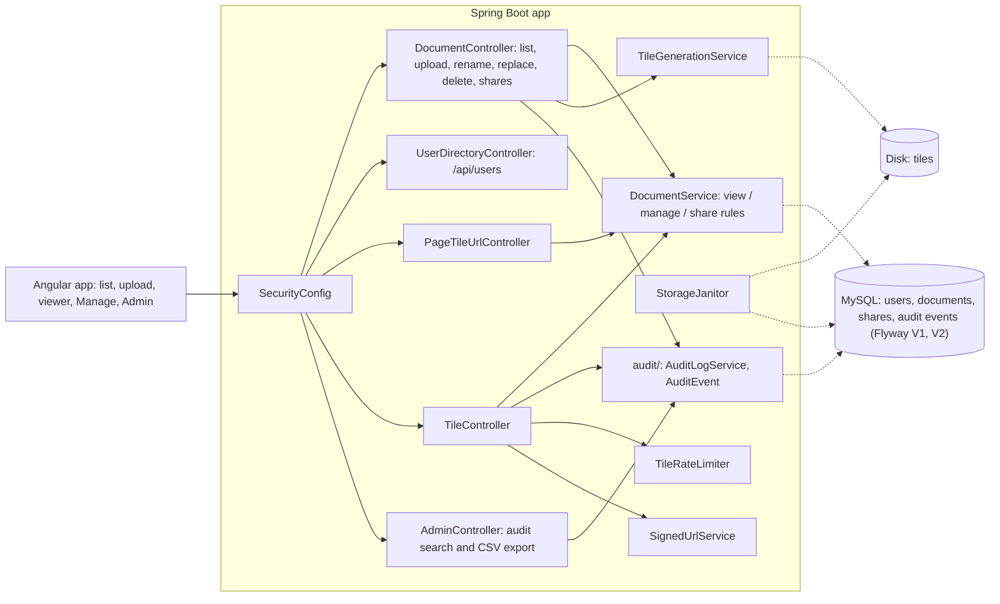

<!-- chapter: 27 | part: IV | owner: writer-app | tag: book-m2-documents | status: draft -->
# Chapter 27: Milestone 2: Documents, ownership and audit

## Learning objectives

- Explain the ownership and visibility model (PRIVATE, EVERYONE, shares, admins).
- Explain why a hidden document answers 404 and not 403.
- Read the per-tile access query and say why access is re-checked on every tile request.
- Describe what the second Flyway migration adds and why the audit trail lives in the database.
- Explain the bug that made denied requests vanish from the audit log, and its fix.

## Prerequisites

Chapters 26 (accounts and sessions), 9 (SQL) and 14 (JPA and Flyway), as listed in
`book/OUTLINE.md`. The code is at `book-m2-documents`, still Spring Boot 3.3.4 and Java 21.
This milestone is PR #2, which was stacked on PR #1.
<!-- source: dossier/milestone-briefs.md#m2; dossier/timeline.md -->

## Beginner tier: Who owns a document?

### 27.1 The product owner's requirements

At m1, every signed-in user saw every document, and anyone could upload (`PO-4`, `TM-7`). Documents
and the audit list lived in memory, so a restart lost them and orphaned the tiles on disk
(`PO-5`, `TM-8`); the audit log was a 500-entry ring buffer (`TM-9`). Milestone 2 answers those
findings, plus `PO-6`, `PO-8`, `PO-12`, `PO-13`. The reviewers were AI review agents playing a
product owner and a senior technical manager; the book cites their finding IDs in code font.
<!-- source: dossier/milestone-briefs.md#m2; dossier/reviews.md -->

The product owner's choice of visibility, in their own words, was "Go ahead with Phase 2, users
plus everyone", meaning both per-user sharing and a document open to everyone.
<!-- source: dossier/decisions.md#d15 -->

### 27.2 Ownership and visibility

Each document has an **owner** and a **visibility**. `Visibility` has two values: `PRIVATE`
(the owner plus users the owner has shared it with) and `EVERYONE` (every signed-in user).
Admins can see everything. Anyone else gets **404, not 403**, so they can't tell a hidden
document exists.
<!-- source: Visibility.java at book-m2-documents; PR #2 body via dossier/milestone-briefs.md -->

**Analogy.** A private document is a locked drawer whose label you can't read: if you aren't
allowed, the office says "no such drawer", not "that drawer is locked." **Where the analogy
breaks down:** an office worker can look in the cabinet and see the drawer; on a server, the
only thing the outsider ever sees is the response, so the response is the whole disclosure.

**Listing 27.1 — `Visibility.java` (book-m2-documents, comments shortened)**

*File: `src/main/java/com/example/securedocviewer/document/Visibility.java`*

```java
public enum Visibility {
    /** Only users the owner has explicitly shared it with. */
    PRIVATE,
    /** Every signed-in user. */
    EVERYONE
}
```

### 27.3 Persisting documents: migration V2

Documents, pages and shares move into MySQL through Flyway migration `V2`. Listing 27.2 shows the
first part. The in-memory `DocumentRegistry` and the 500-entry audit buffer are gone.

**Listing 27.2 — `V2__documents_shares_audit.sql` (book-m2-documents, first 40 lines; the audit table follows in the file)**

*File: `src/main/resources/db/migration/V2__documents_shares_audit.sql`*

```sql
-- Documents are owned by the account that uploaded them. Visibility is either
-- PRIVATE (owner + explicitly shared users) or EVERYONE (any signed-in user).
CREATE TABLE document (
    id          VARCHAR(36)  NOT NULL,
    title       VARCHAR(200) NOT NULL,
    owner_id    BIGINT       NOT NULL,
    visibility  VARCHAR(20)  NOT NULL,
    page_count  INT          NOT NULL,
    tile_size   INT          NOT NULL,
    created_at  DATETIME(6)  NOT NULL,
    updated_at  DATETIME(6)  NOT NULL,
    PRIMARY KEY (id),
    CONSTRAINT fk_document_owner FOREIGN KEY (owner_id) REFERENCES app_user (id)
);

CREATE INDEX ix_document_owner ON document (owner_id);

-- One row per rendered page: the tile grid the viewer needs to lay tiles out.
-- (Column names avoid ROWS, which is reserved in MySQL 8.)
CREATE TABLE document_page (
    document_id    VARCHAR(36) NOT NULL,
    page_index     INT         NOT NULL,
    tile_rows      INT         NOT NULL,
    tile_cols      INT         NOT NULL,
    page_width_px  INT         NOT NULL,
    page_height_px INT         NOT NULL,
    PRIMARY KEY (document_id, page_index),
    CONSTRAINT fk_document_page_document FOREIGN KEY (document_id) REFERENCES document (id) ON DELETE CASCADE
);

-- Explicit per-user grants for PRIVATE documents.
CREATE TABLE document_share (
    document_id VARCHAR(36) NOT NULL,
    user_id     BIGINT      NOT NULL,
    PRIMARY KEY (document_id, user_id),
    CONSTRAINT fk_document_share_document FOREIGN KEY (document_id) REFERENCES document (id) ON DELETE CASCADE,
    CONSTRAINT fk_document_share_user FOREIGN KEY (user_id) REFERENCES app_user (id) ON DELETE CASCADE
);

CREATE INDEX ix_document_share_user ON document_share (user_id);
```

Three ideas from Chapter 9 appear here. A **foreign key** (`owner_id`) ties a document to
exactly one account. `document_share` is a **join table**: one row per (document, user) grant.
`ON DELETE CASCADE` removes a document's pages and shares automatically when the document is
deleted. The comment about `ROWS` is a real quirk: the column is named `tile_rows` because
`ROWS` is a reserved word in MySQL 8.
<!-- source: V2__documents_shares_audit.sql at book-m2-documents -->

## Intermediate tier: How access is decided and recorded

*Assumes the beginner tier. This tier shows the queries and the audit path that every request
takes.*

### 27.4 Access rules re-checked on every tile request

The rule is simple to say: access is checked on the list, the manifest, when tile URLs are
issued, and on every tile request. That last check matters. A signed URL lasts only a short time,
but during that time the owner may unshare or delete the document. Because the tile endpoint
re-checks, unsharing cuts off pages a reader already has open; PR #2 records a test for it.
<!-- source: PR #2 body via dossier/milestone-briefs.md#m2 -->

The check is one query in the repository, designed to be cheap because it runs per tile.

**Listing 27.3 — `DocumentRepository.findTitleIfVisible` (book-m2-documents, simplified: only this method)**

*File: `src/main/java/com/example/securedocviewer/document/DocumentRepository.java`*

```java
/**
 * The per-tile access check: the title (for the audit record) if the user
 * may see the document, empty otherwise. One indexed query, no entity loading.
 */
@Query("""
        select d.title from Document d
        where d.id = :id and (d.visibility = :everyone or d.owner.username = :username
               or :username in (select s.username from d.sharedWith s))
        """)
Optional<String> findTitleIfVisible(@Param("id") String id, @Param("username") String username,
                                    @Param("everyone") Visibility everyone);
```

The result is an `Optional<String>`: a title if the caller may see the document, empty if not.
Returning the title also gives the audit record its label without loading the whole entity.
Empty turns into a 404. Admins take a different path in `DocumentService` (`findTitle`, without
the visibility test).

Managing a document (rename, change visibility, share, replace, delete) is stricter. The private
method `requireManageable` throws `ForbiddenException` unless the caller is the owner or an
admin. A user who can't even see the document gets 404 first.
<!-- source: DocumentRepository.java, DocumentService.java at book-m2-documents -->

### 27.5 Sharing and the share picker

`UserDirectoryController` supplies user suggestions for the sharing box on the Manage page, so an
owner types part of a name and picks a user. Unknown names are rejected with a "No such user."
error from the service.
<!-- source: dossier/milestone-briefs.md#m2 key files; DocumentService.java at book-m2-documents -->

### 27.6 The audit trail

Audit events are stored in MySQL. They cover sign-in, sign-out, failed sign-ins and lockouts;
password and account changes; session revocation; uploads, edits, shares and deletes; denied
access; and throttling. The admin page can filter, page through and export them as CSV with
spreadsheet formulas neutralized, and a retention purge removes events older than a default of
180 days. At this tag the audit still writes one `TILE_VIEWED` row per tile, which becomes a
flooding problem in Chapter 30.
<!-- source: PR #2 body; dossier/milestone-briefs.md#m2 -->

**Listing 27.4 — `AuditLogService.record` (book-m2-documents, simplified: one method)**

*File: `src/main/java/com/example/securedocviewer/audit/AuditLogService.java`*

```java
@Transactional(propagation = Propagation.REQUIRES_NEW)
public void record(AuditEventType type, Actor actor, Subject subject) {
    jdbc.update("""
                    insert into audit_event (occurred_at, event_type, username, session_handle, client_ip,
                        document_id, document_title, page_index, tile_row, tile_col, detail)
                    values (?, ?, ?, ?, ?, ?, ?, ?, ?, ?, ?)""",
            Timestamp.from(Instant.now()), type.name(), actor.username(), actor.sessionHandle(),
            actor.clientIp(), subject.documentId(), truncate(subject.documentTitle(), 200),
            subject.page(), subject.tileRow(), subject.tileCol(), truncate(subject.detail(), 255));
}
```

The important part is the annotation. `Propagation.REQUIRES_NEW` tells Spring to run this method in
its own **transaction** (an all-or-nothing group of database changes), separate from the caller's.
Section 27.9 explains why.
<!-- source: AuditLogService.java at book-m2-documents; dossier/bugs-and-findings.md#c3 -->

## Advanced tier: Keeping storage honest

*Assumes the earlier tiers. This tier covers upload safety, cleanup and the operating-system
problem that shaped the file code.*

### 27.7 Upload, staging and the storage janitor

Uploads render into a staging folder and move into place only when every page succeeded. A corrupt
file returns 400 and leaves nothing on disk. `StorageJanitor` removes tile folders that no document
points to; it is conservative and only touches old folders named like a document id. Deleting a
document removes its tiles from disk.
<!-- source: PR #2 body via dossier/milestone-briefs.md#m2 -->

### 27.8 Files, OneDrive and Windows locks

While building this phase, file moves and deletes of tile folders failed intermittently. The
project was inside a OneDrive folder, and Windows sync and antivirus locks held files open. The
code responded with `FileOperations`, which retries moves and deletes; the janitor skips a locked
folder; and `STORAGE_ROOT` became configurable. The implementer also observed that OneDrive was
syncing every rendered tile, and local secrets, to the cloud, which defeats the design of never
handing out the document. The product owner moved the project to `C:\dev\secure-doc-viewer`.
<!-- source: dossier/bugs-and-findings.md#c4 -->

### 27.9 In this project

**Table 27.1 — Where the concepts live (at `book-m2-documents`)**

| Concept | Where |
|---|---|
| Ownership and access | `document/Document`, `Visibility`, `Viewer`, `DocumentRepository`, `DocumentService` |
| Sharing | `UserDirectoryController`, `document_share` table |
| Audit | `audit/AuditLogService`, `AuditEventType`, `AuditEvent`, `RequestActors` |
| Cleanup | `service/StorageJanitor`, `service/FileOperations` |
| Migration | `V2__documents_shares_audit.sql` |
| Tests | `DocumentAccessIntegrationTest`, `StorageJanitorTest`, `TileGenerationServiceTest` |

Table 27.1 is the map for the source tree at this tag.

## Try it

1. (★) Why does the tile endpoint answer 404 for a document you may not see?
2. (★★) In Listing 27.3, which three conditions make a document visible to a non-admin?
3. (★★★) Sign in as a reader on your own copy, open a shared document, and have the owner unshare it. What happens to the next tile request, and why?

## Architecture blueprint v2

Figure 27.1 is Blueprint v2 from `book/blueprints/v2-documents.md`.



**Figure 27.1 — Blueprint v2 (`book-m2-documents`)**

## Decisions and challenges

#### Decision: 404, not 403

**The decision.** A user who may not see a document gets "not found". **Why this one.** It stops
an outsider from learning that a document exists. **What it costs.** Legitimate users who lose
access can't tell "removed" from "unshared", which Chapter 30's "access lost" screen handles in
the interface.
<!-- source: PR #2 body via dossier/milestone-briefs.md#m2 -->

#### Incident: denied requests never reached the audit log

**The problem.** `ACCESS_DENIED` events were not saved. **How it was found.** A test caught it, as
the PR #2 description records ("a test caught this"). **The cause.** The audit write shared the
caller's transaction. When a request failed, the whole transaction rolled back, and the audit row
went with it. **The fix.** Audit writes run in their own transaction (`REQUIRES_NEW`), as in
Listing 27.4. **The lesson.** The events you most want to keep are recorded on failing paths.
Make the record independent of the outcome it describes.
<!-- source: dossier/bugs-and-findings.md#c3; PR #2 body -->

#### Incident: file locks under OneDrive

**The problem.** Moves and deletes failed intermittently. **How it was found.** While building this
phase in a synced folder. **The fix.** Retrying file operations, a janitor that skips locked
folders, and moving the project out of OneDrive. **The lesson.** Keep working files and storage out
of sync folders; a cloud sync client is another program that opens your files.
<!-- source: dossier/bugs-and-findings.md#c4 -->

## Summary

- Each document has an owner, a visibility and optional shares; outsiders get 404.
- Access is re-checked on every tile request, so unsharing takes effect immediately.
- Documents, pages, shares and audit events live in MySQL through migration V2.
- Audit writes use their own transaction so failures are still recorded.
- Uploads stage first and commit only when complete; a janitor removes orphans.

## Further reading

- *Spring Framework Reference*, "Transaction Propagation." https://docs.spring.io/spring-framework/reference/
- *MySQL 8.4 Reference Manual*, "Keywords and Reserved Words." https://dev.mysql.com/doc/refman/8.4/en/
- *OWASP Cheat Sheet Series*, "Logging Cheat Sheet." https://cheatsheetseries.owasp.org/
