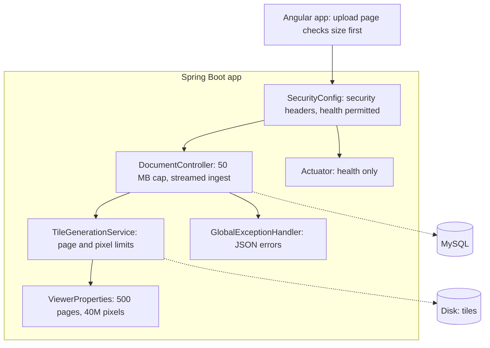

<!-- chapter: 28 | part: IV | owner: writer-app | tag: book-m3-hardening | status: expanded -->
# Chapter 28: Milestone 3: Upload and API hardening

## Learning objectives

- Explain why an upload is untrusted input, and list the limits the project applies before anything is rendered.
- Explain what a decompression bomb is, and calculate the pixel size of a page to see whether it passes the limit.
- Explain the difference between reading an upload into memory and streaming it to disk, and follow the staging-directory pattern.
- Explain why every error has the same JSON shape, and why unexpected errors carry a reference instead of a message.
- Name the security headers the API sends and say what each one prevents.
- Explain what the health endpoint reports, and what it deliberately does not.
- Explain why the same limit is enforced in several layers.

## Prerequisites

Chapters 27 (documents), 13 (validation and error handling) and 16 (Spring Security). The code is at `book-m3-hardening` (pull request #3, three commits named 3a, 3b and
3c; stacked on pull request #2), still Spring Boot 3.3.4 and Java 21. To run this tag yourself, see Table IV.3 ("What you need to run
each tag") in the [Part IV introduction](00-part-introduction.md).
<!-- source: milestone brief m3; timeline -->

## Beginner tier: Never trust what arrives

### 28.1 The requirements

By the end of Chapter 27 the app had accounts, roles, ownership and an audit trail. Its doors were
locked. Milestone 3 asks a different question: what happens when someone sends the app something it
does not expect, or something built to hurt it?

The technical review (an AI review agent playing a senior technical manager) had found, among its
findings, several that belong to this milestone:

- An upload was read whole into memory, had no limits on type, page count or size, and was rendered
  on the request thread. A single large or crafted file could exhaust the server (`TM-5`, rated
  high).
- Error responses were inconsistent (`TM-11`), and some messages echoed the input back to the caller
  (`TM-18`).
- There were no protective response headers (`TM-15`) and no health check for monitoring (`TM-12`).

The AI product-owner reviewer added a user-facing complaint: uploading a corrupt or non-PDF file returned
a raw internal error, gave no progress feedback, and the title was not prefilled (`PO-8`).

Pull request #3 answers all of these in three commits: 3a for uploads, 3b for errors, 3c for headers
and health. It also states what it did not do: "Deferred: processing uploads in the background with
job status."
<!-- source: PR #3 body; reviews record (TM-5, TM-11, TM-12, TM-15, TM-18, PO-8) -->

### 28.2 Input you did not write

**Untrusted input** is any data that comes from outside your program: a file the user uploads, a
value typed in a form, a header or address in a request. "Untrusted" doesn't mean the sender is
malicious. It means your program can't assume the data has the shape it needs, so it must check.

**Analogy.** Think of airport security. Every bag is screened, not because every traveler is a
threat, but because the screening is cheap compared with the consequences of missing one. The
checks happen before the bag reaches the aircraft. **Where the analogy breaks down:** a bag is
screened once, at one gate. Software often has several entrances to the same room, so the same check
may have to exist at more than one of them (Section 28.11).

The viewer's most exposed input is the PDF upload, for three reasons. It is large, so it costs
memory and time to receive. It is complex, so a parser can misbehave on hostile input. And it is
expensive to process: every page is rendered to an image and cut into tiles, which costs far more
CPU and memory than the file's size suggests.

### 28.3 The limits

Before anything is rendered, the server rejects an upload that fails any of these tests:

- **Size:** more than 50 MB. The answer is HTTP 413 ("content too large") with a JSON error body.
- **Signature:** the file does not contain `%PDF-` in its first 1,024 bytes. Real PDFs start with
  that marker; a few writers prepend junk, so the check allows for it.
- **Page count:** zero pages, or more than 500.
- **Page size:** any page whose rendered size would exceed 40 million pixels at the render
  resolution.

The limits are configuration, not magic numbers buried in code.

**Listing 28.1 — `application.yml` (book-m3-hardening, the added lines)**

```yaml
  # Upload limits, checked before anything is rendered. Pixel limit is per
  # page at render-dpi: 40M px is roughly A1 at 150 DPI.
  max-pages: 500
  max-page-pixels: 40000000
...
spring:
  servlet:
    multipart:
      # Keep in step with GlobalExceptionHandler.MAX_UPLOAD_MB and the frontend check.
      max-file-size: 50MB
      max-request-size: 51MB
```

*Path: `src/main/resources/application.yml`*

(The dots mark lines that this excerpt leaves out.) The multipart settings cap the size that the web
server itself will accept. At milestone 2 they were 100 MB. The comment in the file names the two
other places that must agree: the error handler's constant and the frontend's check.
<!-- source: application.yml diff book-m2-documents..book-m3-hardening -->

### 28.4 Worked example: how big is a page?

The pixel limit needs an example to make sense. A PDF page has a size in **points**, where one point
is 1/72 of an inch. Rendering happens at a resolution in **dots per inch (DPI)**; this project renders
at 150 DPI. So the scale from points to pixels is `150 / 72`, about 2.083.

An A4 page is 595 by 842 points. Rendered at 150 DPI: 595 × 2.083 ≈ 1,240 pixels wide and
842 × 2.083 ≈ 1,754 tall, the same page you met in Exercise 25.1. That is 1,240 × 1,754 ≈ 2.2 million
pixels, much smaller than the 40 million limit.

An A0 poster (about 2,384 by 3,370 points) comes to roughly 4,967 by 7,021 pixels, or about 34.9
million pixels. It still passes. (The comment in the file calls the limit "roughly A1"; the
arithmetic shows it is generous, admitting even A0.) Real documents don't get near it.

Now the hostile case. A PDF can declare any page size it likes in its own header. Suppose a file
declares a page 200,000 by 200,000 points. The scale makes that about 416,000 by 416,000 pixels, or
173 billion pixels. At roughly 4 bytes per pixel in a typical image type, allocating that
image would need hundreds of gigabytes, and a small file of a few kilobytes would bring the server
down. That is a decompression bomb: a small input that expands into an enormous amount of work or
memory when processed.

The defense is arithmetic before allocation. The server multiplies the declared width by the
declared height at the render scale and compares the result with the limit, and it does this
*before* it asks PDFBox to render the page.
<!-- source: TileGenerationService.requireWithinLimits at book-m3-hardening; application.yml comment; own arithmetic -->

**Listing 28.2 — `TileGenerationService.requireWithinLimits` (book-m3-hardening)**

```java
private void requireWithinLimits(PDDocument document) {
    int pageCount = document.getNumberOfPages();
    if (pageCount == 0) {
        throw new BadRequestException("The PDF has no pages.");
    }
    if (pageCount > properties.getMaxPages()) {
        throw new BadRequestException("The PDF has " + pageCount + " pages; the limit is "
                + properties.getMaxPages() + ".");
    }
    double scale = properties.getRenderDpi() / 72.0;
    for (int i = 0; i < pageCount; i++) {
        PDPage page = document.getPage(i);
        PDRectangle box = page.getCropBox();
        boolean rotated = page.getRotation() % 180 != 0;
        double width = (rotated ? box.getHeight() : box.getWidth()) * scale;
        double height = (rotated ? box.getWidth() : box.getHeight()) * scale;
        if (width * height > properties.getMaxPagePixels()) {
            throw new BadRequestException("Page " + (i + 1) + " is too large to render ("
                    + Math.round(width) + "x" + Math.round(height) + " px).");
        }
    }
}
```

*Path: `src/main/java/com/example/securedocviewer/service/TileGenerationService.java`*

Read it top to bottom.

1. Count the pages. Zero and too many are both refused, with messages that say what was wrong.
2. Compute the scale: DPI divided by 72 points per inch.
3. For each page, take its **crop box**, the visible area the reader would see, not a hidden larger
   media box.
4. If the page is rotated by 90 or 270 degrees (`getRotation() % 180 != 0`), swap width and height.
   For the area the swap doesn't change the product, but the message then reports the sizes the way a
   reader sees the page.
5. Multiply, and refuse the page if the area is over the limit. The message includes the page number
   and the size.

Every check throws a `BadRequestException`, which Section 28.7 shows turning into HTTP 400.
<!-- source: TileGenerationService.java at book-m3-hardening -->

### 28.5 The signature check

**Listing 28.3 — `TileGenerationService.requirePdfSignature` (book-m3-hardening)**

```java
/** Cheap first check: real PDFs start with "%PDF-" (a few writers prepend junk, so allow 1 KB). */
private static void requirePdfSignature(Path file) throws IOException {
    byte[] head = new byte[1024];
    int read;
    try (InputStream in = Files.newInputStream(file)) {
        read = in.readNBytes(head, 0, head.length);
    }
    if (!new String(head, 0, read, StandardCharsets.ISO_8859_1).contains("%PDF-")) {
        throw new BadRequestException("The file is not a readable PDF.");
    }
}
```

*Path: `src/main/java/com/example/securedocviewer/service/TileGenerationService.java`*

The method reads at most the first 1,024 bytes into a small array and looks for the text `%PDF-`. Decoding
as ISO-8859-1 maps each byte to one character with no failure on odd bytes, which makes it safe for
looking at binary data. This is a **magic number** check: many file formats begin with a short
recognizable marker. It is "cheap" because it happens before any parsing, and it proves less than it
looks: a file can start with `%PDF-` and still be garbage. That is why parsing and the other limits
follow. The pull request records a live test of exactly this case: a file with a PDF header but no valid PDF returned 400 and left no staging leftovers.
<!-- source: TileGenerationService.java at book-m3-hardening; PR #3 body (live checks) -->

### 28.6 Streaming ingest and the staging directory

At milestone 2 the controller read the entire upload into a byte array. A 50 MB file meant 50 MB of
heap memory held for the whole request, per upload, and several uploads at once multiplied the
problem. The fix is small in the controller, and it changes the design.

**Listing 28.4 — `DocumentController` upload (book-m3-hardening, a diff from book-m2-documents: lines starting with `-` were removed, lines starting with `+` were added)**

```diff
-        return documents.upload(title, file.getOriginalFilename(), file.getBytes(), visibility,
-                Viewer.of(authentication), actors.of(request, authentication));
+        try (var in = file.getInputStream()) {
+            return documents.upload(title, file.getOriginalFilename(), in, visibility,
+                    Viewer.of(authentication), actors.of(request, authentication));
+        }
```

*Path: `src/main/java/com/example/securedocviewer/controller/DocumentController.java`*

`file.getBytes()` loads everything into memory; `file.getInputStream()` gives a stream, a way to
read the data a piece at a time. The `try (...)` form is try-with-resources: the stream is closed when
the block ends, even if an error occurs. The service then copies the stream to a file on disk and
parses the file from there.

**Listing 28.5 — `TileGenerationService.render` (book-m3-hardening, simplified: Javadoc and one comment kept)**

```java
public RenderedDocument render(InputStream pdf) throws IOException {
    Path stagingDir = Path.of(properties.getStorageRoot(), STAGING_DIR, UUID.randomUUID().toString());
    Files.createDirectories(stagingDir);
    Path source = stagingDir.resolve("upload.pdf");
    try {
        Files.copy(pdf, source);
        requirePdfSignature(source);
        List<PageInfo> pages = new ArrayList<>();
        try (PDDocument document = loadPdf(source)) {
            requireWithinLimits(document);
            PDFRenderer renderer = new PDFRenderer(document);
            for (int pageIndex = 0; pageIndex < document.getNumberOfPages(); pageIndex++) {
                BufferedImage rendered = renderer.renderImageWithDPI(pageIndex, properties.getRenderDpi());
                pages.add(tileAndSave(stagingDir.resolve("page-" + pageIndex), pageIndex, rendered));
            }
        }
        // The PDF itself must never be committed alongside its tiles.
        Files.delete(source);
        return new RenderedDocument(stagingDir, properties.getTileSize(), pages);
    } catch (IOException | RuntimeException e) {
        try {
            FileOperations.deleteDirectory(stagingDir);
        } catch (IOException cleanupFailure) {
            // Never mask the real error (e.g. "not a readable PDF"); StorageJanitor removes it later.
            e.addSuppressed(cleanupFailure);
        }
        throw e;
    }
}
```

*Path: `src/main/java/com/example/securedocviewer/service/TileGenerationService.java`*

The sequence is the point.

1. Make a private **staging directory** with a random name. Nothing renders directly into the final
   location.
2. Copy the stream to `upload.pdf` inside it: the only time the PDF is on disk.
3. Cheap check (signature), then open the file and check its limits, then render and tile every
   page.
4. Delete the source PDF, so that the staging directory contains only tiles. "The PDF itself must
   never be committed alongside its tiles." This is the founding promise of Chapter 25: the source
   file is never available for download.
5. On any failure, delete the staging directory. If the deletion itself fails, the code attaches that failure to the original error with `addSuppressed` instead of replacing it. The caller then sees the real problem, such as "not a readable PDF", and the janitor from Chapter 27 removes the leftover later.

A separate method, `commit`, later moves the finished staging directory into place under the
document's id. Until then nothing is visible to anyone, so a failed upload can't leave a half-built
document behind.
<!-- source: TileGenerationService.java, DocumentController.java diff at book-m3-hardening; PR #3 body (3a) -->

## Intermediate tier: A consistent contract with clients

*Assumes the beginner tier. This tier covers what the API says back to its callers, and how the
frontend cooperates.*

### 28.7 One shape for every error

Before this milestone a client might receive an HTML error page, a JSON object, or a raw status with
no body, depending on which layer noticed the problem. A client can't be written well against that.
After it, **every error is JSON of the same shape**: `{"error": "..."}`. Table 28.1 lists the cases
the pull request names.

**Table 28.1 — Errors and their statuses at book-m3-hardening**

| Situation | Status | Example message |
|---|---|---|
| Missing parameter, part or header | 400 | `Missing required 'token'.` |
| Value of the wrong type | 400 | `Invalid value for 'page'.` |
| Not a readable PDF, no pages, too many pages, page too large | 400 | `The PDF has 600 pages; the limit is 500.` |
| Unknown route | 404 | `Not found.` |
| Wrong HTTP method | 405 | `Method DELETE is not supported here.` |
| Unsupported content type | 415 | `Unsupported content type.` |
| Upload over 50 MB | 413 | `The file is too large (limit 50 MB).` |
| Anything unexpected | 500 | `Something went wrong on our side. Reference: ...` |

One class, `GlobalExceptionHandler`, is annotated to catch exceptions from every controller, and
each `@ExceptionHandler` method maps one kind of exception to one response.

**Listing 28.6 — `GlobalExceptionHandler` (book-m3-hardening, simplified: three of the handlers, reordered so the last-resort handler comes last)**

```java
@ExceptionHandler({MissingServletRequestParameterException.class, MissingServletRequestPartException.class,
        MissingRequestHeaderException.class})
public ResponseEntity<Map<String, String>> handleMissingInput(Exception e) {
    String name = switch (e) {
        case MissingServletRequestParameterException p -> p.getParameterName();
        case MissingServletRequestPartException p -> p.getRequestPartName();
        case MissingRequestHeaderException h -> h.getHeaderName();
        default -> "input";
    };
    return error(HttpStatus.BAD_REQUEST, "Missing required '" + name + "'.");
}

@ExceptionHandler(MaxUploadSizeExceededException.class)
public ResponseEntity<Map<String, String>> handleUploadTooLarge(MaxUploadSizeExceededException e) {
    return error(HttpStatus.PAYLOAD_TOO_LARGE, "The file is too large (limit " + MAX_UPLOAD_MB + " MB).");
}

/** Last resort: never leak internals, but make the failure traceable in the log. */
@ExceptionHandler(Exception.class)
public ResponseEntity<Map<String, String>> handleUnexpected(Exception e) {
    String reference = UUID.randomUUID().toString().substring(0, 8);
    log.error("Unhandled error, reference {}", reference, e);
    return error(HttpStatus.INTERNAL_SERVER_ERROR,
            "Something went wrong on our side. Reference: " + reference + ".");
}
```

*Path: `src/main/java/com/example/securedocviewer/controller/GlobalExceptionHandler.java`*

Points worth understanding.

- The first handler catches three related exceptions and uses a **`switch` with patterns** (a newer
  Java feature) to pull the missing thing's name out of whichever exception arrived. The message
  names the missing input and nothing else.
- `handleUploadTooLarge` turns the framework's exception for oversize uploads into a 413 with a
  friendly, exact message. Its constant is documented as needing to "keep in step with
  `spring.servlet.multipart.max-file-size`".
- `handleUnexpected` is the **safety net**. Java looks for the most specific handler, so this one, for
  the base `Exception`, runs only when nothing else matched. It generates an eight-character
  reference, logs the full exception (with its stack trace) *under that reference*, and tells the
  client only the reference. A user who reports "Reference: 3fa9c1de" lets an operator find the
  exact failure without the client ever seeing a stack trace, an SQL statement or a file path.

The class's own Javadoc states the rule: "Messages never include stack traces, SQL, file paths or
other internals."
<!-- source: GlobalExceptionHandler.java at book-m3-hardening; PR #3 body (3b) -->

**The test that proves it.** `ErrorContractTest` adds a controller that deliberately throws an
exception whose message contains a fake SQL statement and a fake path, calls it, and asserts on the
response body.

**Listing 28.7 — `ErrorContractTest` (book-m3-hardening, excerpt)**

```java
String body = mvc.perform(get("/api/test/boom").session(admin()))
        .andExpect(status().isInternalServerError())
        .andExpect(jsonPath("$.error").value(org.hamcrest.Matchers.startsWith("Something went wrong on our side. Reference: ")))
        .andReturn().getResponse().getContentAsString();
assertFalse(body.contains("secret_table") || body.contains("C:/internal") || body.contains("IllegalState"), body);
```

*Path: `src/test/java/com/example/securedocviewer/controller/ErrorContractTest.java`*

The test states the contract in code: a 500, the generic sentence, and none of the secrets or the
exception's class name anywhere in the body. Its other tests check the 404, 405 and 400 shapes.
<!-- source: ErrorContractTest.java at book-m3-hardening -->

### 28.8 The frontend cooperates

A server-side limit is a safety net. A good experience tells the user *before* the upload starts.
The upload component mirrors the limits.

**Listing 28.8 — `UploadComponent` (book-m3-hardening, diff excerpt)**

```ts
/** Mirrors the server limit (spring.servlet.multipart.max-file-size); the server still enforces it. */
export const MAX_UPLOAD_MB = 50;
...
if (this.file && !/\.pdf$/i.test(this.file.name) && this.file.type !== 'application/pdf') {
  this.errorMessage.set('Please choose a PDF file.');
  this.file = null;
  input.value = '';
  return;
}
if (this.file && this.file.size > MAX_UPLOAD_MB * 1024 * 1024) {
  this.errorMessage.set(`That file is ${(this.file.size / 1024 / 1024).toFixed(1)} MB; the limit is ${MAX_UPLOAD_MB} MB.`);
  this.file = null;
  input.value = '';
  return;
}
```

*Path: `frontend/src/app/features/documents/upload.component.ts`*

The file's name must end in `.pdf` (case-insensitive) or the browser must report the type
`application/pdf`; and the size must fit. Otherwise the user sees a message at once, and the chosen file is cleared, so
they can't press Upload on something that will fail.

The comment on the constant is the important line: "the server still enforces it". Browser checks
are for kindness, not security, because anyone can send a request without the browser: a script can
skip your form entirely.

**Progress in two stages.** The component also reports progress.

```ts
next: (event) => {
  if (event.type === HttpEventType.UploadProgress) {
    const percent = event.total ? Math.round((100 * event.loaded) / event.total) : 0;
    // Once every byte is sent, the wait is the server rendering pages.
    this.uploadPercent.set(percent >= 100 ? null : percent);
  } else if (event.type === HttpEventType.Response && event.body) {
    // Straight to the manage page, so a private document can be shared right away.
    this.router.navigate(['/documents', event.body.documentId, 'manage'], { queryParams: { uploaded: 1 } });
  }
},
```

`HttpEventType.UploadProgress` events say how many bytes have been sent. When the percentage reaches
100 the component sets the percent to `null`, which the template reads as "now rendering pages": the
second stage, which can take longer than the upload itself. This two-step feedback answered the AI product-owner
reviewer's complaint that uploads gave no progress (`PO-8`).
<!-- source: upload.component.ts diff at book-m3-hardening; PR #3 body -->

### 28.9 Security headers

Every response from the API now carries protective **headers**. A header is a line of metadata sent
with a response, and browsers obey certain ones as instructions.

**Listing 28.9 — `SecurityConfig` headers and health rule (book-m3-hardening, simplified: only the added lines)**

```java
.headers(headers -> headers
        // The API only ever returns JSON and PNG tiles, so nothing it serves
        // needs to run script, load resources or be framed.
        .contentSecurityPolicy(csp -> csp.policyDirectives(
                "default-src 'none'; frame-ancestors 'none'; base-uri 'none'; form-action 'none'"))
        // Tile URLs carry signed tokens; never send them onward in a Referer.
        .referrerPolicy(referrer -> referrer.policy(ReferrerPolicy.NO_REFERRER))
        .permissionsPolicy(permissions -> permissions.policy(
                "camera=(), microphone=(), geolocation=(), payment=()")))
.authorizeHttpRequests(auth -> auth
        // Liveness/readiness for monitoring: status only, no details.
        .requestMatchers(HttpMethod.GET, "/actuator/health", "/actuator/health/**").permitAll()
```

*Path: `src/main/java/com/example/securedocviewer/security/SecurityConfig.java`*

**Table 28.2 — The headers and what each prevents**

| Header | Value | What it prevents |
|---|---|---|
| `Content-Security-Policy` | `default-src 'none'; frame-ancestors 'none'; base-uri 'none'; form-action 'none'` | The browser may not run script or load any resource from an API response, embed it in a frame, change the base address, or submit forms from it |
| `Referrer-Policy` | `no-referrer` | The browser doesn't send a `Referer` header to other sites. Tile URLs carry signed tokens, and a `Referer` could hand one to a third party |
| `Permissions-Policy` | `camera=(), microphone=(), geolocation=(), payment=()` | Switches those browser features off for this origin |
| `X-Content-Type-Options` | `nosniff` | The browser must trust the declared type and not guess (a JSON response can't be treated as a script) |
| `X-Frame-Options` | `DENY` | Older way to forbid framing (clickjacking) |

The last two aren't in the listing. They are Spring Security's default headers, and
`SecurityHeadersTest` asserts both: `nosniff` and `DENY` appear on an API response. The test also
asserts the CSP contains `frame-ancestors 'none'` and `default-src 'none'`, and the referrer policy
is exactly `no-referrer`.

**Worked example: what does the CSP mean?** `default-src 'none'` says "for any kind of resource,
the allowed sources are: none". A page that received this policy can't load a script, a style, an
image or a font, and can't open a connection. It sounds like it would break everything, but this is
an *API*, which returns JSON and PNG tiles that the application's own page fetches; nothing from the
API is ever rendered as a page. So the policy costs nothing legitimate. And if a bug ever caused
the API to send back attacker-supplied HTML, the browser would refuse to run any script in it.

Note the difference from the frontend's own policy, which is set by nginx and permits what the
Angular app needs (Chapter 30).
<!-- source: SecurityConfig.java, SecurityHeadersTest.java at book-m3-hardening; PR #3 body (3c) -->

### 28.10 The health check

Monitoring tools, and Docker in Chapter 30, need a cheap way to ask "is the app alive?". Spring Boot's
**Actuator** library provides endpoints for that. The milestone adds the dependency
(`spring-boot-starter-actuator`) and then locks it down.

**Listing 28.10 — `application.yml` Actuator settings (book-m3-hardening)**

```yaml
management:
  endpoints:
    web:
      exposure:
        # Only the health check; nothing else from Actuator is reachable over HTTP.
        include: health
  endpoint:
    health:
      show-details: never
      probes:
        enabled: true
```

*Path: `src/main/resources/application.yml`*

Three decisions. `include: health` exposes only the health endpoint over HTTP. `show-details: never`
means it reports only a status such as `UP`, not the database's name, disk space or any component
detail. And the security rule in Listing 28.9 makes `/actuator/health` the only public Actuator path:
everything else is denied by the "deny anything else" rule you saw in Chapter 26.

When the database is down, health answers HTTP 503 with status `DOWN`. `SecurityHeadersTest` covers the
contract: health is public and returns `UP`, its body contains neither `components` nor `details`, and
`/actuator/env`, `/actuator/beans`, `/actuator/configprops` and `/actuator` are refused (401, 403 or
404). The pull request also records the live version: health UP, then 503 DOWN with MySQL stopped,
then UP again, and `/actuator/env` returned 401.
<!-- source: application.yml, SecurityHeadersTest.java at book-m3-hardening; PR #3 body -->

## Advanced tier: Defense in depth and honest limits

*Assumes the earlier tiers. This tier covers why the same limit appears in several layers, what the
milestone did not fix, and the incidents and evidence.*

### 28.11 Defense in depth: one limit, four layers

Follow one over-large file through the layers, from the outside in.

1. **The browser** refuses a file over 50 MB and shows a message (kindness, and saves the upload).
2. **The web server's multipart settings** refuse a request whose file is over `max-file-size: 50MB`
   (and whose whole request is over `51MB`, which leaves a megabyte for the form's other fields). The
   handler answers 413.
3. **The signature check** refuses a file that isn't shaped like a PDF.
4. **The limits check** refuses too many pages or a page that would render too large.

Each layer catches things the others can't. The browser check is bypassed by anyone who scripts the
request. The multipart cap stops the giant upload before the application reads it, but says nothing
about what is in a small file. The limits check needs a parsed document, which is why it comes after
cheap checks. This is defense in depth: several independent layers, so the failure of one doesn't
open the whole room.

The comment in `application.yml` ("Keep in step with `GlobalExceptionHandler.MAX_UPLOAD_MB` and the
frontend check") is an admission that the price of layering is duplication: three places hold the
number 50. A future maintainer who changes one and not the others will get confusing behavior, so
the comments name each place.

### 28.12 What this milestone did not fix

Honesty about the limits is part of the milestone. The pull request says the background processing of uploads
was deferred, and that streaming and limits cover the main risk. A large upload still renders while the
request waits. Later milestones added the rest: a maximum of two renders at once, a time limit on a
render, and a server-wide cap on concurrent tile work (Chapter 30, in response to further reviews).

The signing secret has a similar history. The rule that `SIGNING_SECRET` must be present and at least 32 characters
has been in `ViewerProperties` since milestone 1 (`@NotBlank` and `@Size(min = 32)`), so the app refuses to
start with a missing or short secret. The old demo placeholder value remains in the git history, which
the review recorded as informational.
<!-- source: PR #3 body; ViewerProperties.java at book-m1-accounts; reviews record TM-6 -->

### 28.13 Evidence from the live checks

The pull request lists checks made against a running stack.

- A 51 MiB upload returned a JSON 413.
- A file with a PDF header but no valid PDF returned 400 and left no staging leftovers.
- A real PDF uploaded normally.
- All the headers were present.
- `/actuator/health` showed UP, then DOWN (503) when MySQL was stopped, then UP again.
- `/actuator/env` returned 401.

The pattern is worth copying. Each check exercises a failure that the design claims to handle, on
the real system, not only the success path. The automated tests then pin the same behavior so it can't regress. There are 66 backend tests at the end of the milestone, ten of them new: page and pixel limits, the source PDF not being kept, the error contract, and headers and health.
<!-- source: PR #3 body (Test plan) -->

## Common mistakes

**Trusting the file's extension or the browser's content type.** Symptom: a file named `invoice.pdf`
that is really something else gets through. Fix: check the content (the signature), then parse it.

**Checking size after reading everything.** Symptom: memory spikes with each upload. Fix: cap size in
the web server settings, and stream to disk.

**Leaking the exception message.** Symptom: an error page or JSON body that contains SQL, a path or a
class name. Fix: a catch-all handler that logs the detail and returns a reference.

**Different error shapes from different layers.** Symptom: the frontend needs three code paths to
show one message. Fix: one handler class, one JSON shape, tested (Listing 28.6).

**Forgetting a limit's twin.** Symptom: the browser accepts 60 MB and the server refuses it with a
confusing message. Fix: put the constant's name in a comment at every place that repeats it.

**Exposing every Actuator endpoint.** Symptom: `/actuator/env` shows configuration to anyone. Fix:
expose only `health`, hide details, and deny everything else.

**Setting a policy header and never testing it.** Symptom: an upgrade silently drops a header. Fix:
assert headers in a test (`SecurityHeadersTest`).

## Architecture blueprint v3

Figure 28.1 is Blueprint v3.



*Figure 28.1 — Blueprint v3 (`book-m3-hardening`)*

*Text description:* A left-to-right flowchart with no new components. The Angular app, whose upload page checks the file size first, sends requests to SecurityConfig. SecurityConfig now adds security headers and permits the health check. Requests continue to DocumentController (50 MB cap, streamed ingest) and on to TileGenerationService, which applies the page-count and page-pixel limits taken from ViewerProperties (500 pages, 40 million pixels). DocumentController reports failures to GlobalExceptionHandler, which produces the uniform JSON errors; SecurityConfig also exposes only the Actuator health endpoint. Notice that milestone 3 adds guards to the existing request path.
<!-- source: book/blueprints/v3-hardening.md; classes named in the diagram, present at book-m3-hardening under src/main/java/com/example/securedocviewer/: controller/DocumentController.java, controller/GlobalExceptionHandler.java, security/SecurityConfig.java, service/TileGenerationService.java, config/ViewerProperties.java -->

## Decisions and challenges

### Decision: limits and streaming first, background jobs later

**The decision.** Stream uploads, reject bad ones early, and defer background processing. **The
options considered.** Do the rendering in a background job with a status endpoint, or bound the work
and keep it synchronous. **Why this one.** The pull request says that limits and streaming cover the
main risk, and it offers to pick the background job up later if the product owner wants it. **What it
costs.** A large upload still renders while the request waits, which later milestones bound with a
time limit and a concurrency cap.
<!-- source: PR #3 body ("Deferred"); milestone brief m3 -->

### Decision: errors are one shape, and secrets stay in the log

**The decision.** All errors use `{"error": "..."}`, and unexpected failures carry only a short
reference. **Why.** The reviewer found inconsistent statuses and echoed input (`TM-11`, `TM-18`), and
the project wanted no stack traces, SQL or paths reaching a client. **What it costs.** Someone has to
read the server log to see the cause.
<!-- source: PR #3 body; reviews record -->

### Decision: `no-referrer` because URLs carry tokens

**The decision.** Send `Referrer-Policy: no-referrer` on every API response. **Why.** Signed tile
URLs contain a token, and a `Referer` header would carry that URL to another site. **What it costs.**
Nothing the app needs: it doesn't use referrer information.
<!-- source: PR #3 body (3c); SecurityConfig comment -->

### Evidence: testing the failure, not only the success

**The problem.** A defense that is never triggered is a guess. **How it was found.** The pull request's test
plan includes live checks of each failure (Section 28.13). **The lesson.** Test the failure you designed for,
on the real system, and then pin it with an automated test.
<!-- source: PR #3 body (Test plan) -->

## In this project

**Table 28.3 — Where the concepts live (at book-m3-hardening)**

| Concept | Where |
|---|---|
| Upload limits and staging | `service/TileGenerationService.java`, `config/ViewerProperties.java`, `application.yml` |
| Streaming | `controller/DocumentController.java` |
| Error contract | `controller/GlobalExceptionHandler.java`, `controller/ErrorContractTest.java` |
| Headers and health | `security/SecurityConfig.java`, `security/SecurityHeadersTest.java`, `pom.xml` (Actuator) |
| Frontend upload | `features/documents/upload.component.*`, `documents.service.ts` |

Table 28.3 lists the files to open at this tag.

To see any of these files as it was at this milestone, run `git show book-m3-hardening:<path>`, for example `git show book-m3-hardening:pom.xml`.

## Try it

Solutions are in Appendix C.

### Exercise 28.1 ★ A 60 MB upload

Which status code does an upload of 60 MB return, and what does the body look like?

### Exercise 28.2 ★ Reference, not message

Why does the catch-all error include a reference but no exception message?

### Exercise 28.3 ★★ Is this page allowed?

A PDF page is 1,000 by 1,500 points. At 150 DPI, how many pixels is it (round to the nearest million),
and does it pass the 40 million pixel limit?

### Exercise 28.4 ★★ Order of checks

Why does the server check the `%PDF-` signature before it opens the document and checks the page
count? Why is the pixel check done before rendering?

### Exercise 28.5 ★★ Read the headers

In your own copy at `book-m3-hardening`, call `GET /api/auth/me` and list the response headers.
Which of the five headers in Table 28.2 do you see, and which test asserts them?

### Exercise 28.6 ★★★ Health and env

On your own copy, fetch `/actuator/health`, then stop MySQL and fetch it again. What changes, and why is
`/actuator/env` still closed?

## Summary

- An upload is untrusted: check the signature, the page count and the page pixels, cap the size, and
  stream it to a staging directory that is deleted on any failure.
- A decompression bomb is defeated by arithmetic before allocation.
- One error shape everywhere; unexpected errors carry a reference, never internals.
- Headers close browser-side doors, and `no-referrer` protects signed tile URLs.
- Health shows status only, and shows failure honestly.
- The same limit lives in several layers, each catching what the others can't; name each twin in a
  comment.

## Further reading

- *MDN Web Docs*, "Content Security Policy (CSP)." https://developer.mozilla.org/en-US/docs/Web/HTTP/CSP
- *MDN Web Docs*, "Referrer-Policy." https://developer.mozilla.org/en-US/docs/Web/HTTP/Headers/Referrer-Policy
- *MDN Web Docs*, "X-Content-Type-Options." https://developer.mozilla.org/en-US/docs/Web/HTTP/Headers/X-Content-Type-Options
- *Spring Boot Reference*, "Actuator: Endpoints" and "Health." https://docs.spring.io/spring-boot/reference/actuator/endpoints.html
- *Spring Framework Reference*, "Multipart Resolver" and "Exceptions." https://docs.spring.io/spring-framework/reference/web/webmvc/mvc-controller/ann-exceptionhandler.html
- *RFC 9110*, "HTTP Semantics," section 15.5.14 (413 Content Too Large). https://www.rfc-editor.org/rfc/rfc9110
- *OWASP Cheat Sheet Series*, "File Upload." https://cheatsheetseries.owasp.org/cheatsheets/File_Upload_Cheat_Sheet.html
