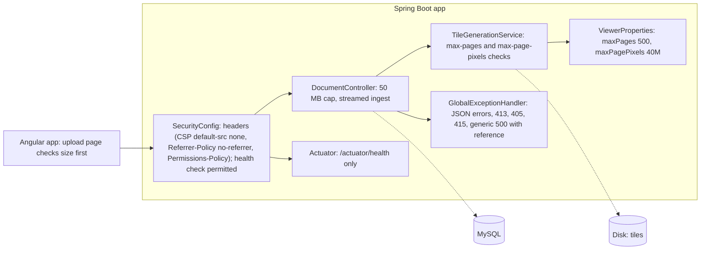

<!-- chapter: 28 | part: IV | owner: writer-app | tag: book-m3-hardening | status: draft -->
# Chapter 28: Milestone 3: Upload and API hardening

## Learning objectives

- Explain why an upload is untrusted input and list the limits the project puts on it.
- Describe what a "decompression bomb" is and how a pixel limit defends against one.
- Explain why every error has the same JSON shape and why the catch-all error carries a reference.
- Name the security headers the API sends and what each prevents.
- Explain what the health endpoint reports and what it deliberately does not.

## Prerequisites

Chapters 27 (documents), 13 (validation and errors) and 16 (Spring Security), as listed in
`book/OUTLINE.md`. The code is at `book-m3-hardening` (PR #3, commits 3a, 3b and 3c; stacked on PR
#2). Still Spring Boot 3.3.4 and Java 21.
<!-- source: dossier/milestone-briefs.md#m3; dossier/timeline.md -->

## Beginner tier: Never trust what arrives

### 28.1 The product owner's requirements

The technical review (an AI reviewer playing a senior technical manager) had found that an upload
was read whole into memory, had no type or size limits and rendered synchronously, which is a
denial-of-service risk (`TM-5`). Error responses were inconsistent (`TM-11`), messages echoed
input (`TM-18`), there were no security headers (`TM-15`) and no health check (`TM-12`). The
product owner's review also complained that a corrupt or non-PDF upload returned a raw 500 with
no progress feedback (`PO-8`). PR #3 addresses all of these in three commits.
<!-- source: dossier/bugs-and-findings.md#b; dossier/milestone-briefs.md#m3 -->

### 28.2 Upload limits and streaming ingest (3a)

Uploads are streamed to a temporary file and parsed from disk instead of being read whole into
memory, and the source PDF is deleted before the tiles are committed. Before anything is rendered,
the server rejects:

- a file without the `%PDF-` signature at its start;
- a document with more than 500 pages;
- any page larger than 40 million pixels at render resolution;
- any upload over 50 MB, with a JSON 413 response.
<!-- source: PR #3 body via dossier/milestone-briefs.md#m3 -->

A **decompression bomb** is a small file that expands into an enormous amount of work or memory
when processed. A PDF page can declare a huge page size; rendering it as an image would exhaust
memory. Checking `width x height` against a limit before rendering stops that. The limits live
in configuration.

**Listing 28.1 — `ViewerProperties.java` (book-m3-hardening, the two new fields only)**

*File: `src/main/java/com/example/securedocviewer/config/ViewerProperties.java`*

```java
/** Uploads with more pages are rejected before anything is rendered. */
private int maxPages = 500;
/** Largest rendered page allowed (width x height at render DPI); stops decompression-bomb PDFs. */
private long maxPagePixels = 40_000_000L;
```

The frontend also checks the file type and size in the browser and shows an upload progress bar,
then a "rendering pages" state. The server still enforces every limit, because a browser check can
be bypassed.
<!-- source: ViewerProperties.java at book-m3-hardening diff; PR #3 body -->

## Intermediate tier: A consistent contract with clients

*Assumes the beginner tier. This tier covers what the API says back, and how.*

### 28.3 Consistent JSON errors without internals (3b)

Every error is now `{"error": "..."}` JSON: missing input and bad types return 400, unknown
routes 404, wrong methods 405, unsupported content types 415, and too-large uploads 413. One class,
`GlobalExceptionHandler`, maps exceptions to responses. Its Javadoc states the rule: messages never
include stack traces, SQL, file paths or other internals.

**Listing 28.2 — `GlobalExceptionHandler.handleUnexpected` (book-m3-hardening, simplified: one method)**

*File: `src/main/java/com/example/securedocviewer/controller/GlobalExceptionHandler.java`*

```java
/** Last resort: never leak internals, but make the failure traceable in the log. */
@ExceptionHandler(Exception.class)
public ResponseEntity<Map<String, String>> handleUnexpected(Exception e) {
    String reference = UUID.randomUUID().toString().substring(0, 8);
    log.error("Unhandled error, reference {}", reference, e);
    return error(HttpStatus.INTERNAL_SERVER_ERROR,
            "Something went wrong on our side. Reference: " + reference + ".");
}
```

This is the safety net. Any exception nobody planned for becomes a 500 with a generic sentence and
an eight-character reference. The full exception, with its stack trace, goes only to the server
log under the same reference. When a user reports the reference, an operator finds the exact
failure. Specific handlers above it in the class handle the known cases, for example
`MaxUploadSizeExceededException` becomes a 413 that says "The file is too large (limit 50 MB)."
<!-- source: GlobalExceptionHandler.java at book-m3-hardening -->

### 28.4 Security headers and the health check (3c)

Every API response now carries strict headers. Listing 28.3 shows the configuration.

**Listing 28.3 — `SecurityConfig` headers and health rule (book-m3-hardening, simplified: only the added lines)**

*File: `src/main/java/com/example/securedocviewer/security/SecurityConfig.java`*

```java
.headers(headers -> headers
        // The API only ever returns JSON and PNG tiles, so nothing it serves
        // needs to run script, load resources or be framed.
        .contentSecurityPolicy(csp -> csp.policyDirectives(
                "default-src 'none'; frame-ancestors 'none'; base-uri 'none'; form-action 'none'"))
        // Tile URLs carry signed tokens; never send them onward in a Referer.
        .referrerPolicy(referrer -> referrer.policy(ReferrerPolicy.NO_REFERRER))
        .permissionsPolicy(permissions -> permissions.policy(
                "camera=(), microphone=(), geolocation=(), payment=()")))
.authorizeHttpRequests(auth -> auth
        // Liveness/readiness for monitoring: status only, no details.
        .requestMatchers(HttpMethod.GET, "/actuator/health", "/actuator/health/**").permitAll()
```

- **Content-Security-Policy** with `default-src 'none'` tells the browser that nothing the API
  serves may run script or load resources, and `frame-ancestors 'none'` forbids embedding it in
  another page.
- **Referrer-Policy: no-referrer** matters here in particular: tile URLs carry signed tokens, and
  a `Referer` header could hand a token to another site.
- **Permissions-Policy** switches off camera, microphone, geolocation and payment features.
- `X-Frame-Options: DENY` and `X-Content-Type-Options: nosniff` are not configured explicitly in the
  listing; they are part of Spring Security's default headers, and `SecurityHeadersTest` at this tag
  asserts both.

`/actuator/health` is public and reports status only. It returns 503 when the database is down.
Every other Actuator endpoint is closed.
<!-- source: SecurityConfig.java and SecurityHeadersTest.java at book-m3-hardening; PR #3 body -->

## Advanced tier: Secrets, limits and what was deferred

*Assumes the earlier tiers. This tier covers configuration hygiene and the honest list of what
this milestone did not do.*

### 28.5 Secrets and configuration hygiene

The signing secret was moved out of the source in milestone 1 (`68b4945`, PR #1): it comes from the
`SIGNING_SECRET` environment variable, and `ViewerProperties` has validated it at startup since then,
with `@NotBlank` and `@Size(min = 32)` (the same annotations are in the file at `book-m1-accounts`).
Milestone 3 doesn't change that rule. The old placeholder remains in git history.
<!-- source: ViewerProperties.java at book-m1-accounts; PR #1 body; dossier/bugs-and-findings.md#b (TM-6) -->

### 28.6 What was deferred

The PR states plainly: "Deferred: processing uploads in the background with job status." Upload
limits and streaming covered the main risk. A render limit and concurrency cap arrive in
Chapter 30 (`cd0f5c2`, `1ce2c8b`).
<!-- source: PR #3 body; dossier/bugs-and-findings.md#b (TM-5) -->

### 28.7 In this project

**Table 28.1 — Where the concepts live (at `book-m3-hardening`)**

| Concept | Where |
|---|---|
| Upload limits | `service/TileGenerationService`, `config/ViewerProperties`, `application.yml` |
| Error contract | `controller/GlobalExceptionHandler`, `ErrorContractTest` |
| Headers and health | `security/SecurityConfig`, `SecurityHeadersTest`, `pom.xml` (Actuator) |
| Frontend upload | `features/documents/upload.component.*` |

Table 28.1 lists the files to open at this tag. The backend tests grow to 66.
<!-- source: git diff --stat book-m2-documents book-m3-hardening; dossier/milestone-briefs.md#m3 -->

## Try it

Solutions are in `28-m3-hardening.solutions.md`.

### Exercise 28.1 ★ A 60 MB upload

Which status code does an upload of 60 MB return, and what does the body look like?

### Exercise 28.2 ★★ Reference, not message

Why does the catch-all error include a reference but no exception message?

### Exercise 28.3 ★★★ Health and env

On your own copy at `book-m3-hardening`, fetch `/actuator/health`, then stop MySQL and fetch it again. What changes, and why is `/actuator/env` still closed?

## Architecture blueprint v3

Figure 28.1 is Blueprint v3, from `book/blueprints/v3-hardening.md`.



**Figure 28.1 — Blueprint v3 (`book-m3-hardening`)**

## Decisions and challenges

#### Decision: limits first, background jobs later

**The decision.** Stream uploads and reject bad ones early, and defer background processing.
**Why.** The PR argues that limits and streaming cover the main risk. **What it costs.** A large
upload still renders while the request waits, which later milestones bound with a time limit and a
concurrency cap.
<!-- source: PR #3 body; dossier/bugs-and-findings.md#b -->

#### Decision: errors are one shape, and secrets stay in the log

**The decision.** All errors use `{"error": "..."}`, and unexpected failures carry only a short
reference. **Why.** The reviewer found inconsistent statuses and echoed input (`TM-11`, `TM-18`),
and the project wanted no stack traces, SQL or paths reaching a client. **What it costs.** Someone
has to read the server log to see the cause.
<!-- source: PR #3 body; dossier/bugs-and-findings.md#b -->

#### Live evidence

The PR records checks against a running stack: a 51 MiB upload returned a JSON 413; a file with a
PDF header but no valid PDF returned 400 with no staging leftovers; `/actuator/health` showed UP,
then DOWN with a 503 when MySQL was stopped, then UP again; and `/actuator/env` returned 401.
**The lesson.** Test the failure you designed for, not only the success path.
<!-- source: PR #3 body -->

## Summary

- An upload is untrusted: check signature, page count, page pixels and size, and stream it.
- One error shape everywhere; unexpected errors carry a reference, never internals.
- Headers close browser-side doors, and no-referrer protects signed tile URLs.
- Health shows status only, and shows failure honestly.

## Further reading

- *MDN Web Docs*, "Content Security Policy (CSP)." https://developer.mozilla.org/en-US/docs/Web/HTTP/CSP
- *MDN Web Docs*, "Referrer-Policy." https://developer.mozilla.org/en-US/docs/Web/HTTP/Headers/Referrer-Policy
- *Spring Boot Reference*, "Actuator: Health." https://docs.spring.io/spring-boot/reference/actuator/endpoints.html
- *RFC 9110*, "HTTP Semantics," section 15.5.14 (413 Content Too Large). https://www.rfc-editor.org/rfc/rfc9110
