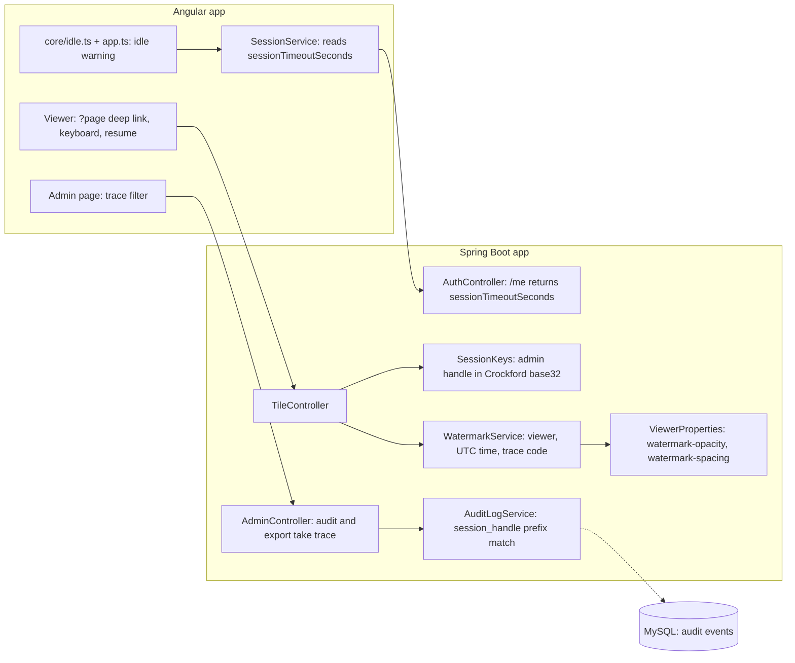

<!-- chapter: 29 | part: IV | owner: writer-app | tag: book-m4-reading | status: draft -->
# Chapter 29: Milestone 4: The reading experience

## Learning objectives

- Explain how a deep link (`?page=N`) makes a page in the viewer shareable.
- Describe the keyboard shortcuts and why they are ignored while you type.
- Explain how the idle-session warning is computed, and why activity is shared across tabs.
- Explain what a trace code in the watermark is for, and why the alphabet excludes I, L, O and U.

## Prerequisites

Chapters 28 (hardening) and 21–23 (Angular components, services and testing),
as listed in `book/OUTLINE.md`. The code is at `book-m4-reading` (PR #4, commits 4a, 4b and 4c),
still Spring Boot 3.3.4 and Java 21. PR #4 was stacked on PR #3.
<!-- source: dossier/milestone-briefs.md#m4; dossier/timeline.md -->

## Beginner tier: Reading comfortably

### 29.1 The product owner's requirements

The product owner's review (an AI agent playing a product owner) found reading awkward: sessions
were per browser tab and cut off hard at 30 minutes with no warning (`PO-9`); the watermark was
too dense, collided with content and had no trace reference (`PO-10`); and there was no `?page=`
link, no keyboard navigation and no resume (`PO-11`). PR #4 answers these three findings.
<!-- source: dossier/milestone-briefs.md#m4; dossier/reviews.md -->

### 29.2 Deep links, keyboard, resume (4a)

- `?page=N` opens that page, and the URL follows the current page, using `replaceUrl` so the Back
  button still leaves the viewer.
- Keys: left and right arrows and PgUp/PgDn turn pages, Home and End jump to the first or last
  page, plus and minus zoom. They are ignored while you type in a field, or with Ctrl, Cmd or Alt
  held.
- Reopening a document resumes the last page read. This is stored in the browser per user and per
  document, and fails silently if the browser refuses to store it.
- Every navigation goes through the same page-loading path, so signed URLs, watermarks and the
  rate limit apply as before. A shortcut can't bypass a protection.
<!-- source: PR #4 body via dossier/milestone-briefs.md#m4 -->

**Analogy.** Resume is a bookmark. **Where the analogy breaks down:** a paper bookmark lives in the
book; this one lives in one browser, so it doesn't follow you to another device.

## Intermediate tier: Session time on the server and in the browser

*Assumes the beginner tier. This tier shows how the browser and the server agree on when a
session ends.*

### 29.3 The idle-session warning (4b)

The server session times out after a period without requests, and every request slides the
timer. The browser needs to warn before that happens. Sign-in and `/api/auth/me` now report
`sessionTimeoutSeconds`. Every successful API call or tile fetch counts as activity, and the time
of the last activity is shared across tabs, so activity in any tab counts. In the last five minutes
a countdown banner with **Stay signed in** appears. On expiry the user goes to the sign-in page
with their place kept and a message saying why.
<!-- source: PR #4 body via dossier/milestone-briefs.md#m4 -->

The arithmetic is a pure function, which makes it easy to test.

**Listing 29.1 — `idle.ts` (book-m4-reading)**

*File: `frontend/src/app/core/idle.ts`*

```ts
/** How long before the idle timeout the "you'll be signed out" banner appears. */
export const IDLE_WARNING_SECONDS = 5 * 60;

export type IdleState =
  | { kind: 'active' }
  | { kind: 'warning'; secondsLeft: number }
  | { kind: 'expired' };

/**
 * Pure idle-timeout arithmetic. The server's session timeout slides with
 * every request; lastActivityMs is the client's record of the most recent
 * request from any tab, so the two stay in step.
 */
export function idleState(nowMs: number, lastActivityMs: number, timeoutSeconds: number): IdleState {
  if (timeoutSeconds <= 0) {
    return { kind: 'active' };
  }
  const secondsLeft = Math.ceil(timeoutSeconds - (nowMs - lastActivityMs) / 1000);
  if (secondsLeft <= 0) {
    return { kind: 'expired' };
  }
  return secondsLeft <= Math.min(IDLE_WARNING_SECONDS, timeoutSeconds / 2)
    ? { kind: 'warning', secondsLeft }
    : { kind: 'active' };
}
```

The type `IdleState` is a **discriminated union**: exactly one of three shapes, told apart by
`kind`. The function returns `expired` when no time is left, `warning` inside the final window,
and `active` otherwise. The window is 5 minutes or half the timeout, whichever is shorter, so a
short timeout still gets a proportionate warning. A timeout of zero or less means "no timeout".
<!-- source: idle.ts at book-m4-reading -->

## Advanced tier: Attribution that survives a screenshot

*Assumes the earlier tiers. This tier covers the watermark's trade-off between visibility and
readability, and a small bug in how people read.*

### 29.4 A lighter, traceable watermark (4c)

The default watermark opacity drops from 0.28 to 0.2 and both opacity and spacing become
configuration. The class clamps the values (opacity between 0.05 and 0.6, spacing between 0.5 and
6) so a bad setting can't make the mark invisible or overwhelming. Each mark now also carries a
**six-character trace code** that identifies the exact session. Its second line reads the UTC time,
a middle dot and the code.
<!-- source: WatermarkService.java diff at book-m3-hardening..book-m4-reading; PR #4 body -->

**Listing 29.2 — `WatermarkService` constructor and label (book-m4-reading, simplified: added lines only)**

*File: `src/main/java/com/example/securedocviewer/service/WatermarkService.java`*

```java
WatermarkService(float opacity, double spacing) {
    this.opacity = Math.max(0.05f, Math.min(0.6f, opacity));
    this.spacing = Math.max(0.5, Math.min(6.0, spacing));
}

// inside applyWatermark(source, viewerLabel, traceCode):
String stamp = TIMESTAMP_FORMAT.format(Instant.now());
String[] lines = {viewerLabel, traceCode == null ? stamp : stamp + " · " + traceCode};
```

The admin audit gains a **trace filter**, so a leaked screenshot can be matched to one specific
sign-in instead of only a username. PR #4 records a live check: the watermarked tile read
`reader.one / 2026-09-18 17:03:21 · 28QWKS`, and `28QWKS` matched the audit log's session for that
request.
<!-- source: PR #4 body; dossier/decisions.md#d5 -->

### 29.5 Crockford Base32 and the I that looked like an l

The trace code is the start of the session's admin handle. Handles used to be base64, whose
alphabet includes `I`, `l`, `O` and `0`, which look alike. **Crockford Base32** uses the digits and
the capital letters except I, L, O and U.

**Listing 29.3 — `SessionKeys.crockfordBase32` (book-m4-reading, simplified: the alphabet and encoder)**

*File: `src/main/java/com/example/securedocviewer/security/SessionKeys.java`*

```java
private static final char[] CROCKFORD = "0123456789ABCDEFGHJKMNPQRSTVWXYZ".toCharArray();

static String crockfordBase32(byte[] bytes) {
    StringBuilder out = new StringBuilder();
    int buffer = 0;
    int bits = 0;
    for (byte b : bytes) {
        buffer = (buffer << 8) | (b & 0xff);
        bits += 8;
        while (bits >= 5) {
            out.append(CROCKFORD[(buffer >>> (bits - 5)) & 31]);
            bits -= 5;
        }
    }
    if (bits > 0) {
        out.append(CROCKFORD[(buffer << (5 - bits)) & 31]);
    }
    return out.toString();
}
```

Each output character encodes 5 bits, so the loop feeds in bytes, and whenever five or more bits
are buffered it writes one character. Leftover bits are padded on the right. The new
`adminHandle` uses 10 bytes of the HMAC output.
<!-- source: SessionKeys.java diff at book-m3-hardening..book-m4-reading -->

### 29.6 In this project

**Table 29.1 — Where the concepts live (at `book-m4-reading`)**

| Concept | Where |
|---|---|
| Deep links, keys, resume | `features/viewer/viewer.component.ts`, `viewer.component.spec.ts` |
| Idle warning | `core/idle.ts`, `core/idle.spec.ts`, `core/session.service.ts`, `app.ts` |
| Watermark | `service/WatermarkService.java`, `WatermarkServiceTest` |
| Handles and trace code | `security/SessionKeys.java`, `audit/AuditLogService.java` |

Table 29.1 maps the milestone onto the source tree. Tests grow to 68 backend and 14 frontend.
<!-- source: dossier/milestone-briefs.md#m4 -->

## Try it

Solutions are in `29-m4-reading.solutions.md`.

### Exercise 29.1 ★ Idle state

What does `idleState` return for a 30-minute timeout when 10 minutes remain?

### Exercise 29.2 ★★ Keys while typing

Why does the viewer ignore arrow keys while you type in the page-number box?

### Exercise 29.3 ★★★ Clamped spacing

Change `spacing` in `WatermarkService` on your own copy. What does the clamp do to a value of 20?

## Architecture blueprint v4

Figure 29.1 is Blueprint v4, from `book/blueprints/v4-reading.md`.



**Figure 29.1 — Blueprint v4 (`book-m4-reading`)**

## Decisions and challenges

#### Incident: the I that looked like an l

**The problem.** The trace code in the watermark could be misread. **How it was found.** While
checking the first version by eye, the implementer misread an `I` as an `l`. **The fix.** Switch
to Crockford Base32, with no I, L, O or U. **The lesson.** An identifier that people read off a
screen must be designed for the human eye, not only for the parser.
<!-- source: PR #4 body; dossier/bugs-and-findings.md#c5; dossier/decisions.md#d9 -->

#### Decision: a lighter watermark

**The decision.** Lower the default opacity from 0.28 to 0.2 and make opacity and spacing
configurable. **Why.** The product owner's review found the mark too dense and colliding with
content (`PO-10`). **What it costs.** A lighter mark is easier to crop or edit out. Later
milestones record the watermark's strength as a documented product decision.
<!-- source: dossier/decisions.md#d5; PR #4 body -->

#### Decision: shared activity across tabs

**The decision.** The last-activity time is shared by every tab. **Why.** Sessions were per tab
before (`PO-9`); a reader active in one tab shouldn't be warned in another. **What it costs.**
The client's clock is an estimate of the server's timer, so the server stays the authority.
<!-- source: PR #4 body; idle.ts Javadoc at book-m4-reading -->

## Summary

- The viewer's URL follows the page, keys turn pages, and reopening resumes.
- The idle warning is a small pure function shared by all tabs' activity.
- The watermark is lighter and carries a trace code tied to the audit log.
- Identifiers meant for people are chosen so people can't confuse them.

## Further reading

- *Angular*, "Routing: query parameters." https://angular.dev/guide/routing
- *MDN Web Docs*, "KeyboardEvent." https://developer.mozilla.org/en-US/docs/Web/API/KeyboardEvent
- *MDN Web Docs*, "Window: localStorage." https://developer.mozilla.org/en-US/docs/Web/API/Window/localStorage
- *RFC 4648*, "The Base16, Base32, and Base64 Data Encodings." https://www.rfc-editor.org/rfc/rfc4648
