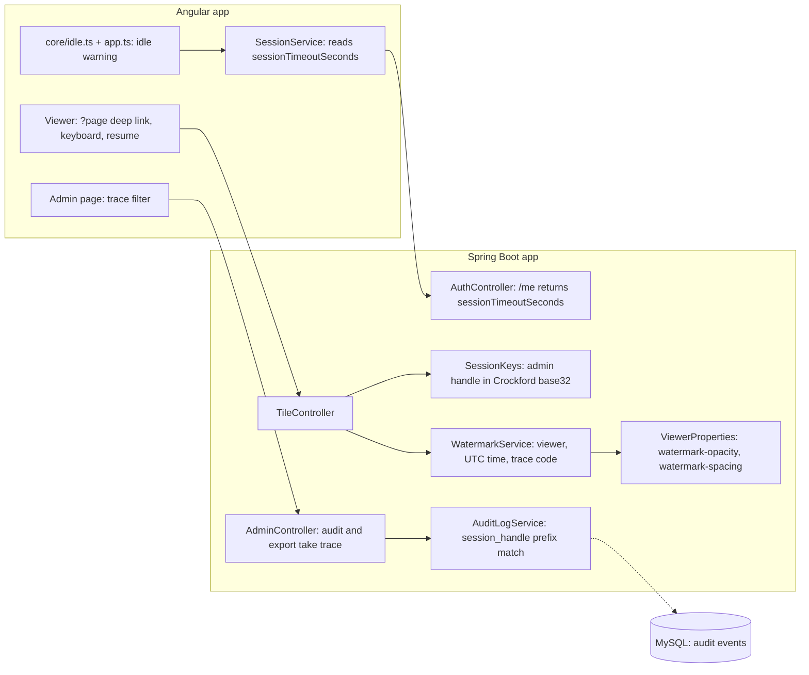

<!-- chapter: 29 | part: IV | owner: writer-app | tag: book-m4-reading | status: expanded -->
# Chapter 29: Milestone 4: The reading experience

## Learning objectives

- Explain how a deep link (`?page=N`) makes a page in the viewer shareable, and why the project uses `replaceUrl`.
- Describe the keyboard shortcuts and why they are ignored while you type or hold a modifier key.
- Explain how the idle-session warning is computed, how activity is shared across browser tabs, and why the server stays the authority.
- Explain why the watermark is repeated in a brick pattern and how its spacing and opacity are configured and limited.
- Explain what a trace code is, how it is derived, and how an administrator uses it.
- Explain why the alphabet for identifiers people read aloud or copy by eye should exclude look-alike characters.

## Prerequisites

Chapters 28 (hardening) and 21–23 (Angular components, services, and testing). Chapter 25 (the watermark's first version) and Chapter 26 (sessions and the
admin handle) matter too. The code is at `book-m4-reading` (pull request #4, three commits named 4a,
4b, and 4c), still Spring Boot 3.3.4 and Java 21. Pull request #4 was stacked on pull request #3. To run this tag yourself, see Table IV.3 ("What you
need to run each tag") in the [Part IV introduction](00-part-introduction.md).
<!-- source: milestone brief m4; timeline -->

## Beginner tier: Reading comfortably

### 29.1 The requirements

Milestones 1 to 3 made the viewer safe. Milestone 4 makes it pleasant, because a secure viewer
that people find annoying gets bypassed, and the point of the product is that people read in it.

The AI product-owner reviewer listed three reading problems:

- **Sessions.** A session belonged to one browser tab and ended at a hard 30-minute cut-off with no
  warning (`PO-9`). You could lose your place in the middle of a page.
- **The watermark.** It was too dense, it collided with the page's content, and it carried no
  reference that could be matched to a record (`PO-10`).
- **Navigation.** There was no link that opened a given page, no keyboard navigation, and no way to
  resume where you stopped (`PO-11`).

Pull request #4 answers all three, in three commits: 4a for navigation, 4b for the idle warning,
4c for the watermark. The changes are small in lines and large in daily effect. They also show a
pattern that repeats through the book: a security feature (the timeout, the watermark) becomes a
product problem the moment real people use it, and the fix is to keep the protection and remove the
friction.
<!-- source: PR #4 body; reviews record (PO-9, PO-10, PO-11) -->

### 29.2 Deep links: the address bar as part of the interface

A deep link is an address that opens the application at a specific place inside it, not only at its front door. For a document viewer the useful place is "page 12 of this document."

Web addresses can carry small pieces of data after a question mark, called **query parameters**. In

```text
/documents/abc123/view?page=12
```

the part after the `?` is `page=12`. The browser sends it along and the page's code can read it. The
viewer's rule is: if the address says `?page=N`, open page N. (People count pages from 1, so the code
subtracts one to get its own zero-based page number.)

Two parts of the behavior need explaining.

**The URL follows the reader.** Each time the reader moves to another page, the viewer updates
`?page=` in the address bar. Copying the address then always yields a link to the page you are
looking at. This is done with the router, using an option called `replaceUrl`. Normally each
navigation adds an entry to the browser's history, so the Back button would step back through every
page you turned. `replaceUrl` overwrites the current entry instead, so Back still leaves the
viewer, as a reader expects.

**Nothing is bypassed.** Opening a link at page 12 doesn't skip any protection. The link only says
which page to ask for; the viewer then asks the server for signed tile URLs for that page, exactly as a click on *Next* would, and the watermark and the rate limit apply as before. Every way of
navigating goes through the same page-loading method, and that is deliberate: a shortcut that
opened a page through a different path would be a second door that also needs a lock.
<!-- source: PR #4 body (4a); viewer.component.ts diff at book-m4-reading -->

### 29.3 Worked example: choosing the first page to show

When the viewer opens, it must choose a page. There are three sources of truth, in an order of
priority: the link, then memory of the last visit, then the default. Listing 29.1 is the real code.

**Listing 29.1 — `ViewerComponent.initialPage` and `rememberPage` (book-m4-reading, excerpt)**

```ts
/** ?page=N (1-based) wins; otherwise resume where this user left off; otherwise page 1. */
private initialPage(pageCount: number): number {
  const requested = Number(this.route.snapshot.queryParamMap.get('page'));
  if (Number.isInteger(requested) && requested >= 1 && requested <= pageCount) {
    return requested - 1;
  }
  try {
    const saved = Number(localStorage.getItem(this.lastPageKey()));
    return Number.isInteger(saved) && saved >= 0 && saved < pageCount ? saved : 0;
  } catch {
    return 0;
  }
}

/** Keeps the URL shareable (?page=N) and remembers the page for next time. */
private rememberPage(page: number): void {
  void this.router.navigate([], {
    relativeTo: this.route,
    queryParams: { page: page + 1 },
    queryParamsHandling: 'merge',
    replaceUrl: true,
  });
  try {
    localStorage.setItem(this.lastPageKey(), String(page));
  } catch {
    // Storage unavailable (private mode, quota); resuming is just a convenience.
  }
}

private lastPageKey(): string {
  return `${LAST_PAGE_KEY_PREFIX}${this.sessionService.username() ?? ''}.${this.documentId}`;
}
```

*Path: `frontend/src/app/features/viewer/viewer.component.ts`*

Read `initialPage` first.

1. `this.route.snapshot.queryParamMap.get('page')` reads the `page` value from the address as text
   (or `null` if absent). `Number(...)` turns it into a number. `Number(null)` is 0, which the next
   test rejects.
2. The `if` accepts the request only if it is a whole number (`Number.isInteger`), at least 1 and
   at most the document's page count. Anything else, such as `?page=abc`, `?page=0`, or `?page=9999`,
   is ignored rather than causing an error. Never trust what arrives in an address bar: a reader can
   type anything, or a link can be corrupted.
3. If the address doesn't give a valid page, the code reads the last-visited page from
   `localStorage` and applies the same kind of check (a saved value from a longer earlier version of
   the document must not point beyond its end).
4. If storage is unavailable, or nothing is saved, it opens page 1 (index 0).

`rememberPage` is the reverse. It writes the current page into the URL with `replaceUrl`, and into
storage.

**Storage and the key.** `localStorage` is a small key-value store the browser keeps per website. The
key is built by `lastPageKey` from a prefix, the signed-in username, and the document id, so two
people who share one browser (or one person with two documents) don't overwrite each other's
place. The `try`/`catch` around every storage call is intentional: private browsing modes and full
quotas can make storage throw, and a convenience must never break the feature it decorates. The
comment says exactly that: "resuming is just a convenience."

**Analogy.** Resume is a bookmark. **Where the analogy breaks down:** a paper bookmark lives in the
book. This one lives in one browser on one device, so it does not follow you to your phone, and it
is per user only because the key includes the username, not because the server knows about it. The
server holds no reading position at all.
<!-- source: viewer.component.ts at book-m4-reading; PR #4 body -->

### 29.4 Keyboard navigation

Serious readers page with the keyboard. The viewer supports left and right arrows and PgUp/PgDn to
turn pages, Home and End to jump to the first and last page, and plus and minus to zoom.

**Listing 29.2 — `ViewerComponent.onKeydown` (book-m4-reading)**

```ts
/**
 * Keyboard navigation, ignored while typing in a field or with modifier
 * keys held (so browser shortcuts like Ctrl+Plus still work).
 */
@HostListener('document:keydown', ['$event'])
onKeydown(event: KeyboardEvent): void {
  const target = event.target as HTMLElement | null;
  if (event.ctrlKey || event.metaKey || event.altKey || !this.manifest()
      || (target && /^(INPUT|TEXTAREA|SELECT)$/.test(target.tagName)) || target?.isContentEditable) {
    return;
  }
  const last = this.manifest()!.pageCount - 1;
  const actions: Record<string, () => void> = {
    ArrowRight: () => this.nextPage(),
    PageDown: () => this.nextPage(),
    ArrowLeft: () => this.prevPage(),
    PageUp: () => this.prevPage(),
    Home: () => this.currentPage() !== 0 && this.loadPage(0),
    End: () => this.currentPage() !== last && this.loadPage(last),
    '+': () => this.zoomIn(),
    '=': () => this.zoomIn(),
    '-': () => this.zoomOut(),
  };
  const action = actions[event.key];
  if (action) {
    event.preventDefault();
    action();
  }
}
```

*Path: `frontend/src/app/features/viewer/viewer.component.ts`*

The pieces, one at a time.

- `@HostListener('document:keydown', ['$event'])` is an Angular **decorator** that says "call this
  method whenever a key is pressed anywhere in the document, and pass me the event object."
- The `if` at the top lists four reasons to do nothing:
  - a modifier key is held, so the browser's own shortcuts, such as Ctrl, and plus for browser zoom, keep working;
  - there is no manifest yet, because the document hasn't loaded;
  - the focus is in an `INPUT`, `TEXTAREA` or `SELECT`, so typing a page number in the jump box doesn't turn pages;
  - the element is editable content.
- `actions` is a table: a `Record` mapping a key name to a function to call. A table replaces a long
  chain of `if` statements, and it makes the supported keys visible at a glance. Both `+` and `=`
  zoom in because on many keyboards they share a key.
- `event.preventDefault()` stops the browser from also acting on the key. Without it, PgDn would
  scroll the page while also turning it.
- `Home` and `End` check first whether you are already there, to avoid a pointless reload of the same
  page.

Everything the table calls, `nextPage`, `prevPage`, and `loadPage`, is the same set of methods the buttons
use. The tests that cover these behaviors are listed under In this project (Table 29.2).
<!-- source: viewer.component.ts at book-m4-reading; PR #4 body (4a) -->

## Intermediate tier: Session time on the server and in the browser

*Assumes the beginner tier. This tier shows how the browser and the server agree on when a session
ends, and how several tabs stay in step.*

### 29.5 The problem with a hard cut-off

Chapter 26 gave sessions an idle timeout: after 30 minutes without requests the server forgets the
session. Every request from you extends it, which is why it is called a sliding timeout. That is
good security (an unattended computer eventually signs out) and terrible manners when the sign-out is
a surprise: you read a long page for 35 minutes without touching the server and find a sign-in screen
with no warning.

The review asked for two things: a warning before the end, and behavior that doesn't depend on
which tab you happen to be in (`PO-9` had complained that the session was per browser tab). The
design has four parts.

1. **The server tells the browser the timeout.** Sign-in and `GET /api/auth/me` now include a
   field `sessionTimeoutSeconds` in their reply, taken from the server's own configuration
   (`server.servlet.session.timeout`, 30 minutes by default). The browser doesn't guess.
2. **The browser records activity.** Each successful API call, and each tile fetch, calls a
   `touch()` method that stores "now" as the time of last activity.
3. **A timer computes the state once a second** with a pure function (Listing 29.4) and shows a
   banner in the last five minutes.
4. **Activity is shared between tabs** through `localStorage`.
<!-- source: PR #4 body (4b); AuthController.java at book-m4-reading -->

### 29.6 Recording activity, in every tab

**Listing 29.3 — `SessionService` activity tracking (book-m4-reading, excerpt)**

```ts
/** Shared by every tab, so activity in one tab keeps the others from warning. Not sensitive. */
const LAST_ACTIVITY_KEY = 'sdv.lastActivity';

private readonly activity = signal(Date.now());
/** Epoch ms of the latest request any tab made to the API. */
readonly lastActivity = this.activity.asReadonly();

constructor(private readonly http: HttpClient) {
  window.addEventListener('storage', (event) => {
    if (event.key === LAST_ACTIVITY_KEY && event.newValue) {
      this.activity.set(Math.max(this.activity(), Number(event.newValue)));
    }
  });
}

/** Called after every successful API request; the server has just extended the session. */
touch(): void {
  const now = Date.now();
  this.activity.set(now);
  try {
    localStorage.setItem(LAST_ACTIVITY_KEY, String(now));
  } catch {
    // Other tabs just won't hear about it; this tab still tracks its own activity.
  }
}
```

*Path: `frontend/src/app/core/session.service.ts`*

This is a small piece of distributed-systems thinking, in a browser. The tabs are like separate
processes with no direct line to each other. What they share is `localStorage`, and the browser fires
a `storage` event in *other* tabs whenever one tab writes a key. So `touch()` in tab A writes the
timestamp; tab B hears the event and raises its own record of activity to the newer value
(`Math.max`, so an old event can never move the clock backward).

Which requests count as activity? Two places call `touch()`. An HTTP interceptor calls it after any
successful response from the API. The interceptor works for calls made through Angular's
`HttpClient`, but tile images are fetched by the viewer with plain `fetch()` (so that it can see
status codes such as 429), and `fetch` bypasses interceptors. That is why the viewer calls
`this.sessionService.touch()` itself when a tile response is OK. The interceptor's own comment states
this split: "Tile images are fetched with plain fetch() by the viewer, which handles its own 401s."
<!-- source: session.service.ts, session.interceptor.ts, viewer.component.ts diffs at book-m4-reading -->

### 29.7 The idle state as a pure function

The clock arithmetic is isolated in one function with no dependencies, which makes it straightforward to
test with plain numbers.

**Listing 29.4 — `idle.ts` (book-m4-reading)**

```ts
/** How long before the idle timeout the "you'll be signed out" banner appears. */
export const IDLE_WARNING_SECONDS = 5 * 60;

export type IdleState =
  | { kind: 'active' }
  | { kind: 'warning'; secondsLeft: number }
  | { kind: 'expired' };

/**
 * Pure idle-timeout arithmetic. The server's session timeout slides with
 * every request; lastActivityMs is the client's record of the most recent
 * request from any tab, so the two stay in step.
 */
export function idleState(nowMs: number, lastActivityMs: number, timeoutSeconds: number): IdleState {
  if (timeoutSeconds <= 0) {
    return { kind: 'active' };
  }
  const secondsLeft = Math.ceil(timeoutSeconds - (nowMs - lastActivityMs) / 1000);
  if (secondsLeft <= 0) {
    return { kind: 'expired' };
  }
  return secondsLeft <= Math.min(IDLE_WARNING_SECONDS, timeoutSeconds / 2)
    ? { kind: 'warning', secondsLeft }
    : { kind: 'active' };
}
```

*Path: `frontend/src/app/core/idle.ts`*

`IdleState` is a discriminated union: exactly one of three shapes, told apart by the `kind`
field. Code that receives one must handle each shape, and TypeScript checks that it does.

Now a worked example with real numbers. Assume the timeout is 1,800 seconds (30 minutes) and the
last activity was at time `t0`.

**Table 29.1 — `idleState` for a 30-minute timeout**

| Minutes since last activity | `secondsLeft` | Result |
|---|---|---|
| 10 | 1,200 | `active` (1,200 is more than 300) |
| 25 | 300 | `warning`, 300 seconds left (300 is not more than 300) |
| 26 | 240 | `warning`, 240 seconds left |
| 30 | 0 | `expired` |

The warning window is `Math.min(300, timeoutSeconds / 2)`: five minutes, or half the timeout,
whichever is smaller. The halving matters for short timeouts. With a 120-second timeout, a fixed
five-minute window would mean "always warning," so the window scales to 60 seconds instead. The
test file checks exactly this: at 30 seconds into a 120-second timeout the state is `active`, and at
70 seconds it is a `warning` with 50 seconds left. A timeout of zero or less means "no timeout" and
the function returns `active`.

Three rows of Table 29.1 (10, 26, and 30 minutes) are cases that the project's `idle.spec.ts` asserts: active, a warning with 240 seconds left, and expired. The 25-minute row shows the edge of the warning window, and a fourth test in the spec covers the scaled short-timeout case.
<!-- source: idle.ts and idle.spec.ts at book-m4-reading -->

### 29.8 The timer and the banner

The application component runs a timer every second and asks `idleState` what to show.

**Listing 29.5 — `App.checkIdle` (book-m4-reading, excerpt)**

```ts
private checkIdle(): void {
  const user = this.sessionService.user();
  if (!user) {
    this.idle.set({ kind: 'active' });
    return;
  }
  const state = idleState(Date.now(), this.sessionService.lastActivity(), user.sessionTimeoutSeconds);
  this.idle.set(state);
  if (state.kind === 'expired') {
    // The server has already dropped the session; don't wait for the next request to find out.
    this.sessionService.forceLogout();
    const returnUrl = this.router.url.startsWith('/login') ? undefined : this.router.url;
    void this.router.navigate(['/login'], { queryParams: { ...(returnUrl ? { returnUrl } : {}), reason: 'idle' } });
  }
}
```

*Path: `frontend/src/app/app.ts`*

If nobody is signed in, there is nothing to time. Otherwise the state is stored in a signal
(Angular's small reactive value, Chapter 22), and the template shows the banner when the state is a
warning. On `expired` the browser signs out locally and goes to the sign-in page with two query
parameters: `returnUrl` (where you were, so signing back in returns you there) and `reason=idle` (so
the sign-in page can say why you're there).

The banner's *Stay signed in* button calls `staySignedIn()`, which makes a request to
`/api/auth/me`. Any authenticated request extends the server's session, so the cheapest one does the
job; the interceptor then calls `touch()`, the state returns to `active`, and the banner disappears.

**The server remains the authority.** The client's clock is an estimate of the server's timer. They
can drift, and a request in flight can change things. If the estimate is wrong, the server's answer
wins: a 401 on the next request still sends the user to sign in, with the same `returnUrl`. The
banner is a courtesy; enforcement stays on the server.
<!-- source: app.ts, session.service.ts at book-m4-reading; PR #4 body (4b) -->

## Advanced tier: Attribution that survives a screenshot

*Assumes the earlier tiers. This tier covers the watermark's design trade-offs, the trace code that
ties an image to a session, and a small bug in how people read.*

### 29.9 Why the watermark was repeated in a brick pattern

At milestone 0 (Chapter 25) the watermark was one rotated line in the middle of each tile. That has a
flaw, which the code comments of milestone 4 spell out. Tiles are 256 pixels square, but tiles on the
right and bottom edges are cropped shorter. A single centered mark can land entirely outside a small
cropped tile and leave it unattributed. And a single line "viewer, time" is wider than a whole tile
at any readable size, so no tile could contain a complete copy of it.

The fix has two parts.

- **Two lines instead of one.** The label is split into the viewer name on one line and the UTC
  time (plus the trace code) on the next. Each line is short enough to fit in a tile.
- **A brick pattern.** The two-line block is repeated across the tile, in rows, each alternate row
  shifted by half a step, like brickwork. The pattern overshoots the tile in every direction, so every
  tile carries some of it and a full-size tile carries at least one complete, readable copy.

**Listing 29.6 — `WatermarkService.Layout` (book-m4-reading, simplified: the spacing record)**

```java
record Layout(int blockWidth, int lineHeight, int stepX, int stepY) {

    static Layout of(FontMetrics metrics, String[] lines, double spacing) {
        int blockWidth = 0;
        for (String line : lines) {
            blockWidth = Math.max(blockWidth, metrics.stringWidth(line));
        }
        int lineHeight = metrics.getHeight();
        int gap = (int) Math.round(metrics.getHeight() * spacing);
        return new Layout(blockWidth, lineHeight, blockWidth + gap, lineHeight * lines.length + gap / 2);
    }
}
```

*Path: `src/main/java/com/example/securedocviewer/service/WatermarkService.java`*

The spacing comes from **measurement**, not guesswork. `metrics.stringWidth(line)` asks the font how
many pixels each line needs; the widest line sets `blockWidth`. The gap between copies is the text
height multiplied by the configured `spacing` (1.5 by default). The step from one copy to the next is
the block plus the gap, so neighboring copies never overprint each other. Because the layout is a
small record with no drawing in it, tests can assert the no-overlap property directly instead of
inferring it from pixels; the class comment says so.

**Worked example.** Suppose the font's line height is 18 pixels and the widest line is 150 pixels wide.
With the default spacing 1.5, `gap = round(18 * 1.5) = 27`. Then `stepX = 150 + 27 = 177` pixels between
copies along a row, and `stepY = 18 * 2 + 27 / 2 = 36 + 13 = 49` pixels between rows (the integer
division `27 / 2` is 13). Double the spacing to 3.0 and the gap becomes 54, `stepX` 204 and `stepY`
36 + 27 = 63: fewer, lighter copies.

The font size scales with the tile (`min(width, height) / 14`, at least 9), the mark is red, rotated 30
degrees (the code does `g.rotate(-Math.PI / 6)`), and drawn at the configured opacity.
<!-- source: WatermarkService.java at book-m4-reading; decisions D5 -->

### 29.10 A lighter mark, with limits

The default opacity dropped from 0.28 to 0.2, and both opacity and spacing became configuration. In `application.yml` they are `watermark-opacity: 0.2` and `watermark-spacing: 1.5`. A comment there says each mark shows the viewer, a UTC timestamp, and a short trace code that matches the session column of the audit log.

**Listing 29.7 — `WatermarkService` constructor and label lines (book-m4-reading, simplified: two excerpts from the class, added lines only; `...` marks code between them)**

```java
WatermarkService(float opacity, double spacing) {
    this.opacity = Math.max(0.05f, Math.min(0.6f, opacity));
    this.spacing = Math.max(0.5, Math.min(6.0, spacing));
}

...
String stamp = TIMESTAMP_FORMAT.format(Instant.now());
String[] lines = {viewerLabel, traceCode == null ? stamp : stamp + " · " + traceCode};
```

*Path: `src/main/java/com/example/securedocviewer/service/WatermarkService.java`*

The constructor **clamps** its settings into a safe range with `Math.max(low, Math.min(high, value))`:
opacity between 0.05 and 0.6, spacing between 0.5 and 6. A configuration typo, such as an opacity of
5 instead of 0.5, can't make the mark invisible or the tile unreadable. The comment in `ViewerProperties`
states the trade-off in one line: "Lower is easier to read through; higher survives recompression
better." A stronger mark is harder to remove and harder to read a document through. The project owner's later sign-off on the strength (Chapter 30) is a decision about that balance.
<!-- source: WatermarkService.java, ViewerProperties.java, application.yml at book-m4-reading -->

### 29.11 The trace code

A watermark that names the viewer, `reader.one`, tells you who. It doesn't tell you *which sign-in*.
Suppose the same person signed in on three devices last week. To know which session produced a
leaked screenshot, the mark must carry a reference to the session, and that reference must not
reveal the credential itself. (Recall from Chapter 26 that the session id must never leave the
server.)

The answer is the admin handle from Chapter 26: a value derived from the session id with a keyed
hash, which identifies the session in the admin screen but can't be turned back into the id. The
watermark shows its first six characters, the **trace code**. `TileController` does this when it
serves each tile (Listing 29.8):

**Listing 29.8 — `TileController` trace code (book-m4-reading, excerpt: two lines)**

```java
String traceCode = sessionKeys.adminHandle(session.getId()).substring(0, 6);
BufferedImage watermarked = watermarkService.applyWatermark(rawTile, username, traceCode);
```

*Path: `src/main/java/com/example/securedocviewer/controller/TileController.java`*

On the administrator's side, the audit log screen gained a **trace filter**. Typing the six
characters from a screenshot lists that session's events.

**Listing 29.9 — `AuditLogService` trace filter (book-m4-reading, excerpt)**

```java
if (query.traceCode() != null && !query.traceCode().isBlank()) {
    // Crockford Base32 is case-insensitive; keep only valid characters so
    // the value can't smuggle LIKE wildcards into the pattern.
    String code = query.traceCode().trim().toUpperCase().replaceAll("[^0-9A-Z]", "");
    conditions.add("session_handle like ?");
    args.add(code + "%");
}
```

*Path: `src/main/java/com/example/securedocviewer/audit/AuditLogService.java`*

Two details deserve attention. The code is **normalized**: trimmed, made upper case, and stripped of
anything that isn't a digit or capital letter, so a reader who types `abc123 ` in lower case with a stray space
still matches. And the stripping is a security measure, as the comment says: the value goes into a SQL
`LIKE` pattern, where `%` and `_` are wildcards. If a caller could include those, they could turn a
lookup into a broad scan. The query itself is parameterized (the `?` placeholders), which protects
against SQL injection; removing wildcards protects against a subtler abuse of a legitimate query
feature.

Pull request #4 records a live check in which the trace code printed on a watermarked tile matched the session shown in the audit log for that request. A tile's second line looks like `2026-01-15 09:30:00 · ABC123` (an invented example value), under the viewer's name.
<!-- source: PR #4 body; TileController.java, AuditLogService.java at book-m4-reading -->

### 29.12 Crockford Base32 and the letter that looked like another

While checking the first version of the trace code by eye, the implementer misread a capital `I` as a
lowercase `l` in the watermark. The codes were base64, whose alphabet contains `I`, `l`, `O`, and `0`, characters that look alike in many fonts. A trace code that can't be read off a
screenshot reliably has failed at its one job.

**Crockford Base32** is an encoding designed for exactly this: it uses the digits and the capital
letters except I, L, O, and U. It also has a friendly property for humans: it is case-insensitive, so `l` and `I` typed by a reader can be forgiven. (The project's trace filter uppercases what you type.)

**Listing 29.10 — `SessionKeys.crockfordBase32` (book-m4-reading, simplified: the alphabet and encoder)**

```java
private static final char[] CROCKFORD = "0123456789ABCDEFGHJKMNPQRSTVWXYZ".toCharArray();

static String crockfordBase32(byte[] bytes) {
    StringBuilder out = new StringBuilder();
    int buffer = 0;
    int bits = 0;
    for (byte b : bytes) {
        buffer = (buffer << 8) | (b & 0xff);
        bits += 8;
        while (bits >= 5) {
            out.append(CROCKFORD[(buffer >>> (bits - 5)) & 31]);
            bits -= 5;
        }
    }
    if (bits > 0) {
        out.append(CROCKFORD[(buffer << (5 - bits)) & 31]);
    }
    return out.toString();
}
```

*Path: `src/main/java/com/example/securedocviewer/security/SessionKeys.java`*

A worked example of the loop, using two bytes `0xFF 0x00` (binary `11111111 00000000`):

1. Take the first byte: `buffer` holds `11111111`, `bits` is 8. Since 8 is at least 5, output the top 5 bits `11111` = 31 = the 32nd
   character, `Z`. Now 3 bits remain (`111`).
2. Take the next byte: `buffer` holds those bits plus `00000000`, so `bits` is 11. Output the top 5 of the 11, `11100` = 28 = `W`. 6 bits remain.
3. Output another 5: `00000` = 0 = `0`. 1 bit remains.
4. The loop ends with one bit left over. The code pads it on the right with zeros to make five bits (`00000`) and outputs a last `0`.

The result is `ZW00`. (Each output character carries 5 bits, so 16 bits need four characters, and
the last one is padded.)

The encoding uses `>>>`, the unsigned right shift, and `& 31` to keep only five bits. The new
`adminHandle` uses 10 bytes of the keyed hash, which produces a 16-character handle; the first six are the trace code.
<!-- source: SessionKeys.java diff book-m3-hardening..book-m4-reading; PR #4 body; decisions D9 -->

## Common mistakes

**Trusting the address bar.** Symptom: `?page=abc` or `?page=-5` throws an error or shows a blank
page. Fix: validate (integer, in range) and fall back, as `initialPage` does (Listing 29.1).

**Letting a shortcut skip the rules.** Symptom: pressing a key loads tiles without a fresh signed URL,
or without the rate limit. Fix: route every navigation through one loading method.

**Handling keys while the reader types.** Symptom: typing a page number turns the page. Fix: ignore
events whose target is an input, and ignore events with Ctrl, Cmd, or Alt held (Listing 29.2).

**Assuming storage always works.** Symptom: the viewer breaks in private browsing mode. Fix: wrap every
`localStorage` call in `try`/`catch`, and treat what it stores as a hint.

**Counting fetches that bypass the interceptor.** Symptom: the idle banner appears while someone is
actively reading, because tile fetches (made with `fetch`) didn't count as activity. Fix: call
`touch()` where the fetch succeeds (Section 29.6).

**Using a client clock as the authority.** Symptom: users are signed out while the banner says they
have time. Fix: the server enforces; the banner only warns, and a 401 sends the user to sign in.

**Choosing identifiers by what parses, not by what reads.** Symptom: a code read from a screenshot
doesn't match. Fix: an alphabet without look-alikes (Section 29.12).

## Architecture blueprint v4

Figure 29.1 is Blueprint v4.



*Figure 29.1 — Blueprint v4 (`book-m4-reading`)*

*Text description:* A left-to-right flowchart in two groups. In the Angular app, the Viewer (deep links, keyboard, resume) calls TileController. The idle-timer code and the session service read the session timeout from AuthController's current-user answer. The Admin page's trace filter calls AdminController, which searches AuditLogService by session-handle prefix in MySQL. In the Spring Boot app, TileController uses SessionKeys for the admin handle and WatermarkService, which reads opacity and spacing from ViewerProperties. Notice how the watermark's trace code links the tile to the audit search.
<!-- source: book/blueprints/v4-reading.md; classes named in the diagram, present at book-m4-reading under src/main/java/com/example/securedocviewer/: controller/AdminController.java, audit/AuditLogService.java, controller/AuthController.java, security/SessionKeys.java, controller/TileController.java, document/Viewer.java, config/ViewerProperties.java, service/WatermarkService.java -->

What changed since v3 is mostly at the edges: the frontend gained the idle timer, the deep links, and the keyboard handling, and the backend gained the configurable watermark, the trace code, and the trace filter.

## Decisions and challenges

### Incident: the I that looked like an l

**The problem.** The trace code in the watermark could be misread. **How it was found.** While
checking the first version by eye, the implementer misread an `I` as an `l`. **The fix.** Switch to
Crockford Base32, with no I, L, O, or U. **The lesson.** An identifier that people read off a screen
must be designed for the human eye, not only for the parser.
<!-- source: PR #4 body; bugs-and-findings C5; decisions D9 -->

### Decision: a lighter watermark

**The decision.** Lower the default opacity from 0.28 to 0.2, make opacity and spacing configurable,
and clamp them. **The options considered.** Keep the dense mark, hide it from the reader, or lighten
it. **Why this one.** The PO reviewer found the mark too dense and colliding with content
(`PO-10`). **What it costs.** A lighter mark is easier to crop or edit out. Later milestones record
the watermark's strength as a documented product decision.
<!-- source: PR #4 body; decisions D5 -->

### Decision: shared activity across tabs

**The decision.** The last-activity time is shared by every tab through storage events. **Why.**
Sessions were per tab before (`PO-9`); a reader active in one tab shouldn't be warned in another.
**What it costs.** The client's clock is only an estimate of the server's timer, so the server stays
the authority.
<!-- source: PR #4 body; idle.ts comments at book-m4-reading -->

### Decision: the URL follows the reader, without history clutter

**The decision.** Use `?page=N` with `replaceUrl`. **Why.** Links are shareable, and the Back button
still leaves the viewer. **What it costs.** A reader who wants Back to step through pages can't;
that is the deliberate trade.
<!-- source: PR #4 body (4a) -->

## In this project

**Table 29.2 — Where the concepts live (at `book-m4-reading`)**

| Concept | Where |
|---|---|
| Deep links, keys, resume | `frontend/src/app/features/viewer/viewer.component.ts`, `viewer.component.spec.ts` |
| Idle warning | `core/idle.ts`, `core/idle.spec.ts`, `core/session.service.ts`, `core/session.interceptor.ts`, `app.ts` |
| Timeout field | `AuthController.CurrentUser` (`sessionTimeoutSeconds`) |
| Watermark | `service/WatermarkService.java`, `WatermarkServiceTest` |
| Trace code and handles | `security/SessionKeys.java`, `controller/TileController.java`, `audit/AuditLogService.java` |
| Configuration | `application.yml` (`watermark-opacity`, `watermark-spacing`) |

Table 29.2 maps the milestone onto the source tree. The tests grow to 68 on the backend and 14 on the
frontend (pull request #4), including four viewer navigation tests (deep link, fallback resume,
Home/End/arrow keys, keys ignored while typing) and four idle-timer tests.
<!-- source: PR #4 body; git diff --stat book-m3-hardening book-m4-reading -->

To see any of these files as it was at this milestone, run `git show book-m4-reading:<path>`, for example `git show book-m4-reading:pom.xml`.

## Try it

Solutions are in Appendix C.

### Exercise 29.1 ★ Idle state

What does `idleState` return for a 30-minute timeout when 10 minutes remain? What if 4 minutes remain?

### Exercise 29.2 ★ Keys while typing

Why does the viewer ignore arrow keys while you type in the page-number box?

### Exercise 29.3 ★★ Which page opens?

The document has 20 pages, the address says `?page=25`, and storage holds `6` for this user and
document (`rememberPage` stores the zero-based index). Which page (1-based) opens? What if the address has no `page` and storage is empty?

### Exercise 29.4 ★★ Spacing arithmetic

Using Listing 29.6, compute `stepX` and `stepY` for a two-line label (the viewer name on one line and
the time and trace code on the second), a 20-pixel line height, a 120-pixel widest line and
`spacing = 2.0`. (`stepY` depends on the number of lines, which is why the exercise fixes it at two.)

### Exercise 29.5 ★★ Clamped spacing

Change `spacing` in `WatermarkService` on your own copy. What does the clamp do to a value of 20?

### Exercise 29.6 ★★★ Design a trace lookup

An administrator types `abc 123` into the trace box (an invented example). Explain, step by step, what the query receives and
what rows match. Then explain what would go wrong if the code weren't normalized before the `LIKE`.

## Summary

- The viewer's address follows the page (`?page=N`, using `replaceUrl`), keys turn pages, and reopening
  resumes, all through the one page-loading path.
- Input from the address bar and from storage is validated, never trusted.
- The idle warning is a pure function fed by activity that every tab shares; the server stays the
  authority.
- The watermark is two lines in a brick pattern, spaced by measured text, lighter by default, and
  clamped to safe settings.
- A trace code, the first six characters of a session's keyed handle, ties a leaked image to one
  sign-in, and its alphabet is chosen so humans can read it.

## Further reading

- *Angular*, "Routing: query parameters" and "Router navigation options (`replaceUrl`)." https://angular.dev/guide/routing
- *Angular*, "Signals." https://angular.dev/guide/signals
- *MDN Web Docs*, "KeyboardEvent." https://developer.mozilla.org/en-US/docs/Web/API/KeyboardEvent
- *MDN Web Docs*, "Window: storage event." https://developer.mozilla.org/en-US/docs/Web/API/Window/storage_event
- *MDN Web Docs*, "Window: localStorage." https://developer.mozilla.org/en-US/docs/Web/API/Window/localStorage
- *Crockford, D.*, "Base 32." https://www.crockford.com/base32.html
- *RFC 4648*, "The Base16, Base32, and Base64 Data Encodings." https://www.rfc-editor.org/rfc/rfc4648
