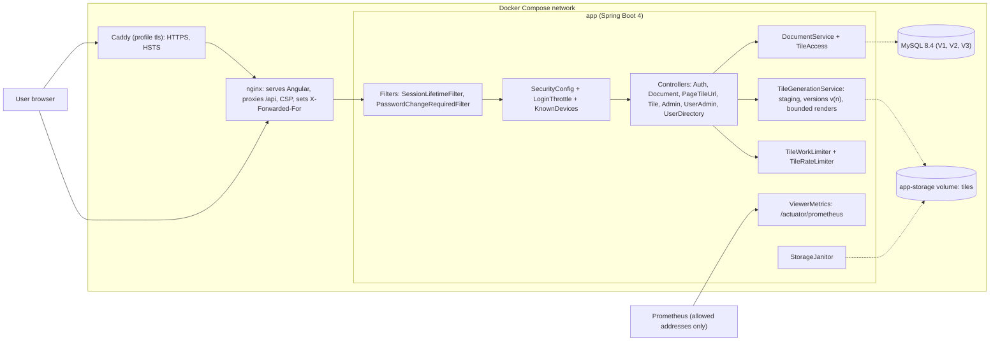

<!-- chapter: 30 | part: IV | owner: writer-app | tag: book-m5-platform | status: expanded -->
# Chapter 30: Milestone 5: The platform and the review rounds

## Learning objectives

- Describe the platform upgrade (Spring Boot 4.1.1, Java 25) and what it broke.
- Read the two Dockerfiles and the Compose file, and explain what each line is for.
- Explain why a forwarded client address is only believed from one known proxy, and how that was found wrong.
- Explain the recognised-device lockout design and the denial-of-service problem it solves.
- Explain versioned tiles, and why a replaced document answers 410 to stale URLs.
- Explain how rendering and tile serving are bounded, and why each bound exists.
- Read the tile endpoint as a sequence of independent gates and say what each one protects.
- Read the story of the review rounds as a method: find, fix, prove.

## Prerequisites

Chapters 26–29 (the earlier milestones), 10 (Docker and Compose), 24 (end-to-end tests) and 16
(Spring Security). The code is at `book-m5-platform`, the merge of
pull request #5. It is the largest milestone: 15 commits, `2d10e07` to `51ea941`, written over roughly
half a day and reviewed in several rounds. Versions at this tag differ from the earlier chapters:
Spring Boot 4.1.1, Java 25, PDFBox 3.0.8, Maven wrapper 3.9.16 (check `pom.xml` at the tag).
<!-- source: milestone brief m5; timeline; versions record -->

## Beginner tier: From a program on one machine to a stack

### 30.1 The requirements

Until now the app ran as a program on one developer's machine, with the database in a container and
everything else started by hand. Three review findings drove the first commit of this milestone:

- Spring Boot 3.3 was past open-source support and PDFBox was behind (`TM-16`).
- There was no Dockerfile, no continuous integration and no Maven wrapper (`TM-14`).
- There were no controller, integration or end-to-end tests (`TM-13`).

The reviewers were AI review agents playing a product owner and a senior technical manager. The
first commit answers with a platform upgrade, containers, a CI pipeline and end-to-end tests. What
followed were review rounds on that commit, and this chapter is mostly their story: the pull
request was submitted, reviewed, corrected and re-reviewed several times before it merged.
<!-- source: PR #5 body; milestone brief m5 -->

### 30.2 The upgrade

The product owner instructed: "Start Phase 5 but can we use Spring Boot 4 if possible? Let us keep
tech as new as long as it is a standard version." The implementer chose the latest GA (general
availability, meaning final, not preview) versions, checked on Maven Central, the public repository
of Java libraries:

**Table 30.1 — The platform upgrade**

| Component | After (book-m5-platform) | Note |
|---|---|---|
| Spring Boot | 4.1.1 (from 3.3.4) | Brings Spring Security 7, Jackson 3, Hibernate 7 and Flyway 12 |
| Java | 25 (from 21) | A long-term-support release |
| PDFBox | 3.0.8 (from 3.0.3) | The PDF rendering library |
| Maven wrapper | 3.9.16 | New in this milestone |

A **major** upgrade of a framework changes names and behaviors, so the migration was real work. The
pull request lists the fixes: the Jackson 3 package names (`tools.jackson.*`, and an `asString()`
method), the `DaoAuthenticationProvider` constructor, the Permissions-Policy header method, the
constant that names HTTP 413 (`CONTENT_TOO_LARGE`), and the package of `@AutoConfigureMockMvc` in
tests. Flyway's warning that MySQL 8.4 was untested disappeared. No deprecation warnings remained.

The **Maven wrapper** (`mvnw`) is a small script committed to the repository that downloads the
exact Maven version the project uses, so every developer and every CI run builds the same way
without installing Maven themselves.
<!-- source: PR #5 body; decisions D10 -->

### 30.3 What a container is

Chapter 10 introduced Docker. As a reminder, an image is a frozen recipe-plus-ingredients bundle: a
filesystem with a program and everything it needs. A container is a running instance of an
image, isolated from the machine around it. Docker Compose starts several containers together
from one file.

**Analogy.** An image is a sealed lunch box packed at the factory; a container is the lunch box being
eaten. Every box from the same factory batch has the same contents, wherever it is opened. **Where the
analogy breaks down:** a lunch box is eaten once, while a container can be stopped, restarted and
have data attached to it in a *volume* that outlives it. What you pack in the image is fixed; what
lives in a volume changes.

The project's stack has up to four containers: MySQL, the backend (`app`), the frontend server
(`web`, which is nginx) and an optional HTTPS front end (`tls`, which is Caddy).

### 30.4 The backend image, line by line

**Listing 30.1 — `Dockerfile` (book-m5-platform)**

```dockerfile
# Pinned by digest (Dependabot updates it) so a rebuild gets exactly the reviewed image.
FROM eclipse-temurin:25-jdk@sha256:97014c4b396021f9ddb7d592a7dbedb0c4e4215c29e03dc01c393558aefb71c2 AS build
WORKDIR /src
# Dependencies first, so they stay cached until pom.xml changes.
COPY mvnw pom.xml ./
COPY .mvn .mvn
RUN chmod +x mvnw && ./mvnw -B -q dependency:go-offline
COPY src src
RUN ./mvnw -B -q -DskipTests package

FROM eclipse-temurin:25-jre@sha256:bb036ed6cfdc57e3da7c22634d15f1b840d2caf76183861c80e81ca4b5104abb
# The watermark and PDF rendering use Java2D text, which needs real fonts in a headless container.
# curl is for the compose health check.
RUN apt-get update \
    && apt-get install -y --no-install-recommends fontconfig fonts-dejavu-core curl \
    && rm -rf /var/lib/apt/lists/* \
    && groupadd --system app && useradd --system --gid app --home /app app \
    && mkdir -p /app /data/storage && chown -R app:app /app /data
WORKDIR /app
COPY --from=build /src/target/secure-doc-viewer.jar app.jar
USER app
ENV STORAGE_ROOT=/data/storage \
    JAVA_TOOL_OPTIONS="-XX:MaxRAMPercentage=75 -Djava.awt.headless=true"
VOLUME /data/storage
EXPOSE 8080
ENTRYPOINT ["java", "-jar", "/app/app.jar"]
```

*Path: `Dockerfile`*

This is a multi-stage build: two `FROM` lines, two images. Read it in two halves.

**The build stage** (first `FROM`, named `build`). It starts from a full JDK (the toolkit that can
compile), copies the wrapper and `pom.xml`, and downloads all dependencies (`dependency:go-offline`)
*before* copying the source. That order is a caching trick. Docker builds an image in layers, one
per instruction, and reuses a layer if its inputs haven't changed. Dependencies change rarely and
source changes constantly, so putting the slow, stable step first means most rebuilds skip the
download. Then it copies the source and runs `package` (without tests: CI ran those) to produce one
runnable file, the JAR.

**The runtime stage** (second `FROM`). It starts from a smaller JRE (the runtime without the
compiler). It installs fonts because, as the comment says, the watermark and the PDF rendering "use
Java2D text, which needs real fonts in a headless container": a slim image has no fonts, and the
watermark would fail. It also installs `curl` for the health check, and creates a **system user**
named `app`. `COPY --from=build` brings only the JAR from the first stage, so the compiler, the
source and the dependency cache never reach the final image.

The last lines set behavior. `USER app` runs the program as that unprivileged user instead of root, so
a flaw in the app can't rewrite the container's system files. `JAVA_TOOL_OPTIONS` tells the JVM to
use up to 75 percent of the container's memory for its heap and to run headless (no display).
`VOLUME` marks where uploaded tiles live so that they survive the container.

**Why pin by digest.** The `@sha256:...` suffix names one exact image, not "whatever `25-jdk`
means today". A tag can be re-pointed; a digest can't. The comment says Dependabot updates the
digest, so pinning doesn't freeze the image, it makes updates deliberate.
<!-- source: Dockerfile at book-m5-platform; PR #5 body -->

### 30.5 The frontend image and nginx

**Listing 30.2 — `frontend/Dockerfile` (book-m5-platform)**

```dockerfile
FROM node:24-alpine@sha256:ebfe2f90462722a7a4de65e91990e97fe0d401c70e0e762c5b53302f905ec1c1 AS build
WORKDIR /src
COPY package.json package-lock.json ./
RUN npm ci --no-audit --no-fund
COPY . .
RUN npx ng build --configuration production

# Unprivileged variant: nginx runs as a non-root user and listens on 8080.
FROM nginxinc/nginx-unprivileged:stable-alpine@sha256:daa17b944bac2b578e962da4c61ad72a59233b3c63abea17113acaf4e6b9aea4
COPY nginx.conf /etc/nginx/conf.d/default.conf
COPY --from=build /src/dist/frontend/browser /usr/share/nginx/html
EXPOSE 8080
```

*Path: `frontend/Dockerfile`*

Same two-stage idea. The first stage uses Node 24 to install dependencies with `npm ci` (which
installs exactly what the lock file says) and to build the Angular application for production. The
second stage copies only the built files, plain HTML, CSS and JavaScript, into **nginx**, a web
server. The "unprivileged" nginx image runs as a non-root user and listens on port 8080, not 80,
because non-root processes can't bind low ports.

nginx has two jobs here. It serves the static Angular files, and it proxies `/api` to the
backend. A reverse proxy receives a request on behalf of another server and passes it along.
The comment at the top of the frontend Dockerfile explains why: "so the browser sees a single origin
(the session and CSRF cookies depend on that)." From the browser's point of view, the page and the API live at one address. The `SameSite=Strict` cookies from Chapter 26 need that.
<!-- source: frontend/Dockerfile at book-m5-platform; PR #5 body -->

### 30.6 Compose: services, profiles and one published port

**Listing 30.3 — `docker-compose.yml` (book-m5-platform, simplified: the `app` and `web` services, most comments and the `mysql` and `tls` services removed)**

```yaml
  app:
    profiles: ["full"]
    build: .
    restart: unless-stopped
    mem_limit: 1536m
    env_file: .env
    environment:
      DB_HOST: mysql
      STORAGE_ROOT: /data/storage
      FORWARD_HEADERS_STRATEGY: native
      TRUSTED_PROXY_REGEX: '172\.28\.0\.10'
    volumes:
      - app-storage:/data/storage
    depends_on:
      mysql:
        condition: service_healthy
    expose:
      - "8080"
    healthcheck:
      test: ["CMD", "curl", "-fsS", "-o", "/dev/null", "http://localhost:8080/actuator/health"]
      interval: 10s
      timeout: 5s
      start_period: 60s
      retries: 6

  web:
    profiles: ["full"]
    build: frontend
    restart: unless-stopped
    mem_limit: 128m
    depends_on:
      app:
        condition: service_healthy
    ports:
      - "127.0.0.1:${WEB_PORT:-8081}:8080"
    networks:
      default:
        ipv4_address: 172.28.0.10
```

*Path: `docker-compose.yml`*

Here are the ideas, one at a time.

- **Profiles.** `profiles: ["full"]` means these services start only when you ask for that profile.
  Plain `docker compose up -d` starts MySQL only, for development with the app running from your
  editor. `docker compose --profile full up -d --build` starts the whole stack. (An optional
  `tls` profile adds HTTPS.)
- **`env_file: .env`** loads secrets from a file that is not in git (the secrets rule from Chapter 28). The MySQL service in the same file refuses to start without a database password:
  `${DB_PASSWORD:?Set DB_PASSWORD in .env}`.
- **`mem_limit`** caps the container's memory. The JVM sizes its heap from it (75 percent, from the
  Dockerfile), so a runaway render can't take the host down.
- **`depends_on` with `condition: service_healthy`** makes ordering real: the app waits until MySQL
  reports healthy, and nginx waits until the app does. A **health check** is a command Docker runs
  repeatedly; the app's calls the health endpoint from Chapter 28.
- **`expose` versus `ports`.** The app only *exposes* 8080 inside the Compose network. Only nginx
  *publishes* a port to the host, and only on `127.0.0.1` (this machine, not the network). Everything
  a user reaches goes through nginx first.
- **A fixed address.** nginx is given `172.28.0.10` on a network with a fixed range. The next section
  explains why that matters.

**Worked example.** Follow `docker compose --profile full up -d --build`. Compose builds the two images from the two Dockerfiles. It starts `mysql`, waits until its health check
(`mysqladmin ping`) passes, starts `app`, which runs Flyway migrations V1 to V3 on the fresh database,
and waits for `/actuator/health` to answer, then starts `web`. When it finishes, you browse to
`http://localhost:8081`: the request enters nginx, which serves the Angular files, and forwards `/api/...` calls to `app:8080`,
which talks to MySQL. Your data lives in two named volumes: `mysql-data` (the database) and
`app-storage` (the tiles). Both survive `docker compose down` unless you delete them
(`docker compose down -v`).
<!-- source: docker-compose.yml at book-m5-platform; PR #5 body -->

### 30.7 Continuous integration

The pull request adds a GitHub Actions workflow, `.github/workflows/ci.yml`, that runs on each push
and pull request. It has four jobs:

- **Backend tests:** `./mvnw -B verify`, including tests that start a real MySQL 8.4 in a container.
- **Frontend tests and build:** `npx ng test --watch=false`, then a production build.
- **Known-vulnerability scan:** a dependency scan with OSV.
- **End-to-end (Docker stack):** generates throwaway secrets, builds and starts the full stack, scans
  the built images with Trivy (fixable HIGH or CRITICAL findings fail the job), waits for the API to be
  healthy, runs Playwright, and uploads the report and service logs if it fails.

Every third-party action in the workflow is pinned to a full commit hash, with the version in a comment. The reason is the same as for images pinned by digest: a moving tag lets someone else's change enter your build.
<!-- source: ci.yml at book-m5-platform; PR #5 body -->

## Intermediate tier: Proxies, addresses, sessions and trust

*Assumes the beginner tier. This tier shows how a request travels through nginx (and optionally
Caddy) and what the backend may believe about it, then the account rules that grew out of the
reviews.*

### 30.8 Whose address is this?

The sign-in throttle and the audit log need the caller's IP address. Behind a proxy, the backend
sees the proxy's address, so the proxy passes the caller's address along in a header called
`X-Forwarded-For`. The trouble is that a header is only text, and anyone can send one. If the
backend believes it from anyone, a client can pretend to be any address.

**The first version was wrong.** nginx *appended* to whatever `X-Forwarded-For` the client already
sent, and the app trusted the result. So a client could send a fake address in the header and reset
its own sign-in lockout at will, and the audit log would record the invented address. The pull
request's first description claimed direct callers couldn't spoof; that was false, and the
description now keeps the struck-through claim and a "Correction". The technical review (`TM2-1`,
high, introduced by this pull request) found it and recommended not merging until it was fixed.

**The fix, in two steps.** Commit `2d82253` made nginx *overwrite* the header with the real address
of the connecting peer. A Playwright test that goes through nginx proves it: it fails on the
pre-fix stack ("Expected 429, Received 401") and passes now. Commit `a51674c` tightened trust further
(finding `TM2-6`): the Compose network has a fixed range, nginx has a fixed address, and the API's
`TRUSTED_PROXY_REGEX` accepts forwarded headers only from that address.

**Listing 30.4 — `frontend/nginx.conf` (book-m5-platform, simplified: comments shortened, headers and static-file rules removed)**

```nginx
map $realip_remote_addr $forwarded_proto {
    172.28.0.11 $http_x_forwarded_proto;
    default     $scheme;
}

server {
    listen 8080;
    server_tokens off;

    set_real_ip_from 172.28.0.11;
    real_ip_header X-Forwarded-For;

    root /usr/share/nginx/html;
    client_max_body_size 51m;

    # ^~ so no regex location (e.g. the static-asset rule below) can capture an API path.
    location ^~ /api/ {
        proxy_pass http://app:8080;
        proxy_set_header Host $host;
        # OVERWRITE (never append to) X-Forwarded-For with the address of the TCP
        # peer. The backend trusts this header (server.forward-headers-strategy),
        # so passing through a client-supplied value would let anyone choose the
        # IP that login throttling and the audit log see.
        proxy_set_header X-Forwarded-For $remote_addr;
        proxy_set_header X-Real-IP $remote_addr;
        proxy_set_header X-Forwarded-Proto $forwarded_proto;
        proxy_read_timeout 300s;   # rendering a long PDF can take a while
        proxy_request_buffering off;
    }

    location = /actuator/health {
        proxy_pass http://app:8080;
        proxy_set_header X-Forwarded-For $remote_addr;
    }
}
```

*Path: `frontend/nginx.conf`*

Read the trust boundary.

- `set_real_ip_from 172.28.0.11` says: only a request that arrives from this address (Caddy, in the
  optional TLS profile) may tell nginx the real client address, through `X-Forwarded-For`. From
  anyone else the header is ignored.
- In the `/api/` location, `proxy_set_header X-Forwarded-For $remote_addr` **replaces** the header with
  the address nginx actually sees. Whatever the client sent is discarded. The backend then trusts
  nginx's address only (`172.28.0.10`), so it believes exactly one link in the chain.
- `location ^~ /api/`: the `^~` modifier means "if this prefix matches, stop looking at regular
  expression rules". A separate finding (`TM2-7`) had shown that a static-file rule (for `.js`
  files) could capture an API path whose name ended in `.js`; `^~` prevents that.
- `proxy_request_buffering off` streams the upload to the backend instead of nginx storing it first,
  and `client_max_body_size 51m` matches the backend's multipart limit (50 MB plus form overhead),
  echoing the "keep in step" lesson from Chapter 28.
- `server_tokens off` hides nginx's version in responses.
<!-- source: frontend/nginx.conf at book-m5-platform; PR #5 body; decisions D11; bugs record D1, D6 -->

The audit log after the fix shows the real peer, not the spoofed `203.0.113.x` addresses the reviewer
had injected. **The lesson:** a forwarded-address header is only as trustworthy as the proxy
configuration behind it, so test *through* the proxy, and correct wrong claims in writing.

### 30.9 Optional HTTPS with Caddy

An optional Compose profile, `tls`, puts **Caddy** in front of nginx. Caddy terminates TLS (it holds
the certificate and speaks HTTPS to browsers) and adds an **HSTS** header, which tells browsers to use
only HTTPS for this site from then on. Two modes are provided. `TLS_MODE=internal` uses Caddy's own
local certificate authority, for trying it out (browsers will warn until you trust it); setting
`TLS_MODE` to an e-mail address requests a real certificate from Let's Encrypt, which needs a public
domain name and open ports.

The `includeSubDomains` part of HSTS is *opt-in* through `HSTS_POLICY`, because turning it on
without every subdomain being HTTPS-ready can lock people out of those subdomains. Caddy overwrites
`X-Forwarded-For` too, since it trusts no upstream proxy. Chapter 33 treats TLS for production in
full; this milestone provides the optional profile and a go-live checklist in the README.
<!-- source: deploy/Caddyfile at book-m5-platform; decisions D12 -->

### 30.10 Passwords set by an admin, and sessions with a lifetime

Two filters were added to enforce rules on the server rather than in the interface.

**Forced password change.** A password an admin creates or resets is known to the admin. So a session
whose account has such a password can do almost nothing until it is changed.

**Listing 30.5 — `PasswordChangeRequiredFilter` (book-m5-platform, simplified: imports and package removed)**

```java
public class PasswordChangeRequiredFilter extends OncePerRequestFilter {

    public static final String SESSION_ATTRIBUTE = "sdv.mustChangePassword";

    @Override
    protected void doFilterInternal(HttpServletRequest request, HttpServletResponse response, FilterChain chain)
            throws ServletException, IOException {
        HttpSession session = request.getSession(false);
        String path = request.getRequestURI().substring(request.getContextPath().length());
        if (session != null && Boolean.TRUE.equals(session.getAttribute(SESSION_ATTRIBUTE))
                && path.startsWith("/api/") && !path.startsWith("/api/auth/")) {
            response.setStatus(HttpServletResponse.SC_FORBIDDEN);
            response.setContentType(MediaType.APPLICATION_JSON_VALUE);
            response.getWriter().write("{\"error\":\"You must change your password before continuing.\",\"passwordChangeRequired\":true}");
            return;
        }
        chain.doFilter(request, response);
    }
}
```

*Path: `src/main/java/com/example/securedocviewer/security/PasswordChangeRequiredFilter.java`*

A **filter** sees every request before a controller does. This one asks: is this session flagged
"must change password", and is the path under `/api/` but not `/api/auth/` (where the password
change lives)? If so it answers 403 with a JSON body that includes `passwordChangeRequired: true`,
which the Angular app reads to route the user to the Account page. The class comment says why it
lives here: "Enforced here, not just in the UI." A user who skips the screen and calls the API
directly still gets refused.

**Absolute lifetime.** The idle timeout from Chapter 29 slides: activity extends it. If something keeps
using a stolen or forgotten session, it never expires.

**Listing 30.6 — `SessionLifetimeFilter` (book-m5-platform, simplified: imports and Javadoc trimmed)**

```java
public class SessionLifetimeFilter extends OncePerRequestFilter {

    /** Set at sign-in by AuthController. */
    public static final String SIGNED_IN_AT = "sdv.signedInAt";

    private final Duration maxLifetime;

    @Override
    protected void doFilterInternal(HttpServletRequest request, HttpServletResponse response, FilterChain chain)
            throws ServletException, IOException {
        HttpSession session = request.getSession(false);
        if (session != null) {
            if (session.getAttribute(SIGNED_IN_AT) instanceof Instant signedInAt) {
                if (Instant.now().isAfter(signedInAt.plus(maxLifetime))) {
                    session.invalidate();
                    SecurityContextHolder.clearContext();
                }
            } else if (session.getAttribute(SECURITY_CONTEXT) != null) {
                // Signed in before this rule existed: its lifetime starts now.
                session.setAttribute(SIGNED_IN_AT, Instant.now());
            }
        }
        chain.doFilter(request, response);
    }
}
```

*Path: `src/main/java/com/example/securedocviewer/security/SessionLifetimeFilter.java`*

The filter compares "now" with the sign-in time stored in the session. Past the maximum lifetime it
invalidates the session and clears the security context, so the request continues as an anonymous
one, and the ordinary 401 sends the user to sign in. The `else if` branch handles sessions that
already existed before the rule was deployed: their clock starts at the first request afterwards.
The pull request lists "absolute session lifetime" among the ultrareview preparation fixes.
<!-- source: security/PasswordChangeRequiredFilter.java, SessionLifetimeFilter.java at book-m5-platform; PR #5 body -->

### 30.11 The three lockout rules, and the recognised device

Milestone 1 throttled failed sign-ins per account and address, and per address. A first fix for the
spoofing finding added a rule: an account-wide lockout across all addresses. The next review found
that the fix created a new attack (`TM3-1`): anyone could lock out any user by failing sign-in from a
few addresses. The victim's own attempts, from their usual computer, would then be refused: a
**denial of service** against a person.

The final design, commit `82c24b6`, uses a 15-minute window and three rules.

**Table 30.2 — The three lockout rules**

| Rule | Limit | Applies to |
|---|---|---|
| Account plus address | 5 failures | always |
| Address | 20 failures | always |
| Account-wide | 20 failures | only *unrecognised* devices |

The third rule is what stops rotating addresses from buying unlimited guesses. The exemption is what
stops the attack on victims: a device is **recognised** after a successful sign-in from it within the
last 30 days, and a recognised device isn't blocked by the account-wide count.

**Listing 30.7 — `KnownDevices` (book-m5-platform, simplified: constructors, hash and normalization removed)**

```java
static final Duration RETENTION = Duration.ofDays(30);

public boolean isRecognised(String username, String clientIp) {
    Integer count = jdbc.queryForObject("""
                    select count(*) from account_known_ip k join app_user u on u.id = k.user_id
                    where u.username = ? and k.ip_hash = ? and k.last_success_at > ?""",
            Integer.class, username, hash(clientIp), Timestamp.from(clock.instant().minus(RETENTION)));
    return count != null && count > 0;
}

@Transactional(propagation = Propagation.REQUIRES_NEW)
public void remember(String username, String clientIp) {
    List<Long> ids = jdbc.queryForList("select id from app_user where username = ?", Long.class, username);
    if (ids.isEmpty()) {
        return;
    }
    // Upsert: safe under concurrent sign-ins from the same device.
    jdbc.update("""
                    insert into account_known_ip (user_id, ip_hash, last_success_at) values (?, ?, ?)
                    on duplicate key update last_success_at = values(last_success_at)""",
            ids.get(0), hash(clientIp), Timestamp.from(clock.instant()));
}

/** After a password change/reset or when the account is disabled. */
public void forget(String username) {
    jdbc.update("delete from account_known_ip where user_id = (select id from app_user where username = ?)", username);
}
```

*Path: `src/main/java/com/example/securedocviewer/security/KnownDevices.java`*

The class comment gives the privacy reasoning: "Addresses are personal data: only a keyed hash is
stored (IPv6 grouped by /64, since privacy addresses rotate within a prefix), and entries expire after
30 days. They are forgotten whenever the account's password changes or it is disabled, so a device
that once had the old password doesn't keep its exemption."

Read the code with that in mind. `isRecognised` counts rows for this user and this address *hash*
newer than 30 days. `remember` is an **upsert**: `insert ... on duplicate key update` inserts a row
or, if one exists for this user and address, refreshes its timestamp; it is safe when two sign-ins
race. `forget` deletes every remembered address for a user. A scheduled method (not shown) purges
expired rows nightly.

The table behind it comes from migration V3, which also adds two columns to `app_user`.

**Listing 30.8 — `V3__tile_versions_and_account_security.sql` (book-m5-platform)**

```sql
-- Each render of a document's PDF lives in its own directory ({doc}/v{n});
-- the row points at the committed version, so replacing a PDF switches
-- versions atomically in one transaction. 0 = the original unversioned layout.
ALTER TABLE document ADD COLUMN tile_version INT NOT NULL DEFAULT 0;

-- Admin-set passwords (new accounts, resets) must be changed at first sign-in.
ALTER TABLE app_user ADD COLUMN must_change_password BOOLEAN NOT NULL DEFAULT FALSE;
ALTER TABLE app_user ADD COLUMN last_sign_in_at DATETIME(6) NULL;

-- Addresses an account has recently signed in from successfully (30 days).
-- They are exempt from the account-wide lockout, so failed guesses from
-- elsewhere cannot lock the real user out of their usual device. Stored as
-- a keyed hash of the address (IPv6 grouped by /64), never the raw IP.
CREATE TABLE account_known_ip (
    user_id         BIGINT      NOT NULL,
    ip_hash         VARCHAR(64) NOT NULL,
    last_success_at DATETIME(6) NOT NULL,
    PRIMARY KEY (user_id, ip_hash),
    CONSTRAINT fk_account_known_ip_user FOREIGN KEY (user_id) REFERENCES app_user (id) ON DELETE CASCADE
);
```

*Path: `src/main/resources/db/migration/V3__tile_versions_and_account_security.sql`*

Note how the migration uses the rule from Chapter 26: V3 is a *new* file. V1 and V2 were never
edited, because Flyway has already recorded their checksums in every existing database, and editing
an applied migration makes it refuse to start. (The `ALTER TABLE ... DEFAULT` values also let the
migration succeed on a database that already has rows.)

**The documented trade-off.** During an account-wide lockout, the correct password from a *new*
device is refused (HTTP 429) until an admin unlocks the account. Unlocking is an admin action that
is itself audited (`USER_UNLOCKED`). The README states the trade-off plainly.

**Verified live.** The lockout design was tested with a plan approved by the technical review:
throwaway containers acting as attackers, each with its own address on the Compose network.
Four attacker addresses each made five wrong guesses; a fifth, fresh address was refused on its first
attempt (429), audited as the account-wide rule. The recognised host still signed in normally.
Spoofed forwarding headers, sent through nginx and even straight to the app container, still got 429.
The correct password from a new address was refused until an admin unlocked it, and then worked.
Eighteen of eighteen checks passed. The attackers' passwords were passed through an environment file
and never printed.
<!-- source: PR #5 body (Live two-IP test); decisions D7; KnownDevices.java, V3 sql at book-m5-platform -->

## Advanced tier: Tiles that can be replaced, and work that can be bounded

*Assumes the earlier tiers. This tier revisits the tile endpoint, which grew from the four-line
pipeline of Chapter 25 into a chain of independent gates, and then the two resource problems that
came with letting people replace documents and upload heavy PDFs.*

### 30.12 The tile endpoint, now six gates

At milestone 0 the tile endpoint verified a token, checked a session, read a tile and stamped it.
This is the same method at milestone 5, where the checks before the work have grown to six (Table
30.3). Compare it with Listing 25.9.

**Listing 30.9 — `TileController.getTile` (book-m5-platform, simplified: Javadoc, the helper `loadTile` and imports removed)**

```java
@GetMapping(value = "/api/tiles", produces = MediaType.IMAGE_PNG_VALUE)
public ResponseEntity<byte[]> getTile(@RequestParam String token,
                                      Authentication authentication,
                                      HttpServletRequest request) throws Exception {
    SignedTilePayload payload = signedUrlService.verifyAndDecode(token);

    // Second, independent check: the request must come from the very
    // session the token was issued to. ...
    HttpSession session = request.getSession(false);
    if (session == null || !sessionKeys.tileBindingMatches(session.getId(), payload.sessionBinding())) {
        throw new InvalidTokenException("This tile link was issued to a different session.");
    }
    String username = authentication.getName();
    Actor actor = actors.of(request, authentication);

    // Third, independent check: a signature- and session-valid request
    // can still be part of a burst trying to redeem every tile of every
    // page. ...
    java.time.Instant counted;
    try {
        counted = tileRateLimiter.recordAndEnforce(username);
    } catch (RateLimitExceededException e) {
        metrics.tileRateLimited();
        auditLogService.recordAtMostEvery(Duration.ofSeconds(properties.getTileRateLimitWindowSeconds()),
                "rate-limited:" + username, AuditEventType.RATE_LIMITED, actor,
                Subject.document(payload.documentId(), null));
        throw e;
    }

    // Fourth: the document may have been unshared or deleted since the URL was issued.
    TileAccess access = documents.tileAccessIfViewable(payload.documentId(), Viewer.of(authentication))
            .orElseThrow(() -> {
                auditLogService.recordAtMostEvery(Duration.ofSeconds(5), "denied:" + username,
                        AuditEventType.ACCESS_DENIED, actor, Subject.document(payload.documentId(), null, "tile"));
                return new DocumentNotFoundException("Document not found.");
            });

    // Issued for an earlier render: the document was replaced since. ...
    if (payload.tileVersion() != access.tileVersion()) {
        throw new TileGoneException();
    }
    String title = access.title();
    String traceCode = sessionKeys.adminHandle(session.getId()).substring(0, 6);
    byte[] png;
    try {
        png = tileWork.run(() -> {
            BufferedImage rawTile = loadTile(payload, access, authentication);
            BufferedImage watermarked = watermarkService.applyWatermark(rawTile, username, traceCode, access.tileSize());
            ByteArrayOutputStream encoded = new ByteArrayOutputStream();
            ImageIO.write(watermarked, "png", encoded);
            return encoded.toByteArray();
        });
    } catch (ServiceBusyException busy) {
        // The server was busy, not the reader too fast: don't charge their allowance.
        tileRateLimiter.refund(username, counted);
        throw busy;
    }

    auditLogService.recordAtMostEvery(PAGE_VIEW_AUDIT_INTERVAL,
            "page:" + actor.sessionHandle() + "|" + payload.documentId() + "|" + payload.page(),
            AuditEventType.PAGE_VIEWED, actor,
            new Subject(payload.documentId(), title, payload.page(), null, null, null));

    metrics.tileServed();

    return ResponseEntity.ok()
            .cacheControl(CacheControl.noStore())
            .body(png);
}
```

*Path: `src/main/java/com/example/securedocviewer/controller/TileController.java`*

Read it as a series of questions, each answered by a different mechanism, and ordered so the cheap
and safe questions come first.

**Table 30.3 — The gates of a tile request**

| Gate | Question | Refusal | Introduced |
|---|---|---|---|
| 1. Signature and expiry | Did the server issue this token, and is it still fresh? | 401 | Chapter 25 |
| 2. Session binding | Is this the same session it was issued to? | 401 | Chapter 26 |
| 3. Rate limit | Is this reader pulling tiles faster than a person reads? | 429 | Chapter 26 |
| 4. Access | May this user still see this document? | 404 | Chapter 27 |
| 5. Version | Is this URL for the current render? | 410 | This chapter |
| 6. Capacity | Does the server have a free slot to do the work? | 503 | This chapter |

The order is deliberate. The comments say the rate limit runs "after auth so unauthenticated requests
can't burn a legitimate user's allowance, and before the disk read/render so a throttled request
doesn't pay that cost." Cheap in-memory checks come before the database check. All of them come before the expensive work of reading, watermarking and encoding a PNG.

Three details are worth a closer look.

- **The refund.** If the server was busy (gate 6), that is not the reader's fault. The catch block
  calls `tileRateLimiter.refund(...)`, handing back the allowance that was counted at gate 3 so a
  busy server doesn't punish the reader for retrying.
- **Audit volume.** At milestone 2 every tile wrote an audit row, and a page is about 35 tiles. The review found
  the log flooded (`TM2-4`, `PO2-4`), so now `recordAtMostEvery` writes one `PAGE_VIEWED` event per
  session, document, page and interval (10 minutes), and denials and rate limits are capped too. The
  `PAGE_VIEW_AUDIT_INTERVAL` constant names it.
- **The trace code.** The lines you met in Chapter 29 are here, with the comment "enough to single
  out one sign-in in the audit log's session column, too short to be of any other use."
<!-- source: TileController.java at book-m5-platform; PR #5 body; bugs record D3, G10 -->

### 30.13 Replacing a document without mixing old and new tiles

Owners can replace a document's PDF. Until this milestone, the new tiles were written over the old
ones while readers were reading. A reader could load some tiles of a page from the old version and
some from the new, producing a page that never existed (`TM2-5` and `PO2-2`).

*Pattern note: Versions plus one atomic switch are the immutable versions pattern (Chapter 39, Section 39.11).*

The fix has three parts.

**1. Versioned directories.** Each render goes into its own directory, `{document}/v{n}/page-.../`.
The `document` row records the current version in `tile_version` (Listing 30.8). Replacing a PDF
renders into `v(n+1)` and then switches the row to point at it, in one database transaction.

**2. A row lock.** The switch happens while holding a lock on the document's row, so two replacements
of the same document can't interleave, and a delete can't slip in between.

**Listing 30.10 — `DocumentService.replaceFile` (book-m5-platform, simplified: Javadoc trimmed)**

```java
public DocumentDetail replaceFile(String documentId, InputStream pdf, Viewer viewer, Actor actor) throws IOException {
    tx.executeWithoutResult(status -> requireManageable(documentId, viewer, actor));
    RenderedDocument rendered = tiles.render(pdf);
    int[] previousVersion = new int[1];
    DocumentDetail updated;
    try {
        updated = tx.execute(status -> {
            Document document = documents.findByIdForUpdate(documentId)
                    .orElseThrow(() -> new DocumentNotFoundException("Document not found."));
            // Rendering can take a while: the owner may have been demoted or disabled,
            // or the document handed to someone else, since the check above.
            if (!canManage(document, currentRoles(viewer))) {
                recordDenied(actor, viewer, Subject.document(documentId, document.getTitle(), "manage"));
                throw new ForbiddenException("Only the owner (as a publisher) or an admin can change this document.");
            }
            previousVersion[0] = document.getTileVersion();
            int nextVersion = document.getTileVersion() + 1;
            try {
                // Under the row lock nothing committed points past the current version,
                // so anything already at the next one is debris from a failed replace.
                tiles.deleteVersion(documentId, nextVersion);
                tiles.commit(rendered, documentId, nextVersion);
            } catch (IOException e) {
                throw new java.io.UncheckedIOException(e);
            }
            document.replacePages(nextVersion, rendered.tileSize(), toPages(rendered));
            return detail(document, viewer);
        });
    } catch (RuntimeException e) {
        tiles.discard(rendered);
        throw e;
    }
    try {
        tiles.deleteVersion(documentId, previousVersion[0]);
    } catch (IOException e) {
        log.warn("Could not remove superseded tiles of {}; the storage janitor will retry", documentId, e);
    }
    audit.record(AuditEventType.DOCUMENT_REPLACED, actor,
            Subject.document(documentId, updated.title(), updated.pageCount() + " pages"));
    return updated;
}
```

*Path: `src/main/java/com/example/securedocviewer/document/DocumentService.java`*

The sequence is what matters.

1. **Check first, cheaply.** The caller must be allowed to manage the document, or the request is
   refused before any work. (A later fix made the replace endpoint check the role before reading the
   upload body, so a reader couldn't make the server spool 50 MB it would then refuse.)
2. **Render outside the lock.** `tiles.render(pdf)` can take a long time, so it happens with no
   database lock held. The result waits in a staging directory.
3. **Lock, re-check, swap.** `findByIdForUpdate` locks the row. The permission check is *repeated*,
   with a comment saying why: "Rendering can take a while: the owner may have been demoted or
   disabled, or the document handed to someone else, since the check above." This is a time-of-check to time-of-use gap. Checking again under the lock closes it.
4. **Clear debris, then commit.** If an earlier replace failed after moving tiles but before the
   database committed, a directory at the next version can exist as debris. The code deletes it first
   (a review finding: without that, a leftover directory made every later replace fail until the
   janitor removed it).
5. **Clean up after.** If anything failed, the staged render is discarded. After a successful swap, the
   previous version's directory is deleted; if that deletion fails, the storage janitor from Chapter 27
   will retry, and the code logs rather than failing a replace that has already succeeded.

**3. Tokens that name their version.** Chapter 25's token signed the document, page, row, column,
session binding and expiry. Milestone 5 adds the render version to the signed fields:

```java
return documentId + "|" + page + "|" + row + "|" + col + "|" + tileVersion + "|" + sessionBinding + "|" + expiresAtEpochSeconds;
```

That change came from a probe in a later round: before it, old tile URLs silently served the new
render, so a page could still mix old and new tiles. With the version in the signed token, a stale URL
fails gate 5 with a 410 (Gone), and the viewer reloads the page with an "updated" notice. The version
is signed, so it can't be edited to ask for an older render.

**A fine distinction: 410 versus 500.** If the tile for the *current* version is missing on disk, the
fault is not "the document was replaced". It is damage on the server, such as a mismatched restore.
`loadTile` handles it: when a tile is gone, it re-reads the current version; if it equals the version
in the request, it throws an internal error (a logged 500), not a 410. Otherwise the client would
reload forever. This is the fix for the endless-reload loop you will meet in Chapter 31.
<!-- source: DocumentService.java, TileController.java, SignedTilePayload.java at book-m5-platform; decisions D8; bugs record F2, F3, G5, G8, G13 -->

### 30.14 Bounding the work

Rendering a large PDF is expensive, and any signed-in publisher can trigger it. The first review of
the platform found that unbounded rendering was a denial-of-service risk (`TM2-2`), and later rounds
tightened it. The final design has four limits.

1. **A cap on concurrent renders.** At most a few renders run at once (the default is 2, set by
   `max-concurrent-renders`). A render needs a **permit**, a token from a counter that starts at that
   number; if none is free, the request is refused with HTTP 503 and a `Retry-After` header. PDFBox
   is also configured to buffer to temporary files rather than the heap, and to subsample very large
   embedded images.
2. **A time limit.** A render runs on its own thread, and the request waits up to a configured
   timeout (`render-timeout`). After that it gives up, answers 400 "This PDF took too long to
   prepare. Try a smaller or simpler file.", and tells the render to stop at its next page boundary.
3. **Slots held until the thread really stops.** If a request abandons a render, the render thread
   still runs until it reaches a page boundary. The permit is released only when that thread has
   finished, so abandoned renders continue to count against the cap and can't pile up behind it.
   There is no queue: a render either gets a thread at once or is refused with a 503.
4. **A cap on concurrent tile work.** Separately from rendering uploads, serving tiles (decode,
   watermark, encode) is CPU work too, and per-user rate limits don't bound the server when many users
   pull tiles at once.

**Listing 30.11 — `TileWorkLimiter` (book-m5-platform, simplified: imports removed)**

```java
/**
 * Caps how many tiles are watermarked and encoded at once across all users.
 * The per-user rate limit bounds each reader; this bounds the server when many
 * readers (or accounts) pull tiles together. A request that can't get a slot
 * within a moment gets 503 + Retry-After, which the viewer retries like a 429.
 */
@Component
public class TileWorkLimiter {

    static final long WAIT_MILLIS = 2_000;

    private final Semaphore slots;
    private final ViewerMetrics metrics;

    public TileWorkLimiter(ViewerProperties properties, ViewerMetrics metrics) {
        int configured = properties.getMaxConcurrentTileRenders();
        this.slots = new Semaphore(configured > 0 ? configured : 2 * Runtime.getRuntime().availableProcessors(), true);
        this.metrics = metrics;
    }

    public <T> T run(Callable<T> work) throws Exception {
        if (!slots.tryAcquire(WAIT_MILLIS, TimeUnit.MILLISECONDS)) {
            metrics.tileBusy();
            throw new ServiceBusyException("The server is busy. Retrying shortly.", 1);
        }
        try {
            return work.call();
        } finally {
            slots.release();
        }
    }
}
```

*Path: `src/main/java/com/example/securedocviewer/service/TileWorkLimiter.java`*

A semaphore is a counter of permits. `tryAcquire(2000, MILLISECONDS)` waits up to two seconds for a
free permit and returns false if none appears. If it fails the method counts a "busy" metric and
throws a `ServiceBusyException` that becomes a 503 with a one-second `Retry-After`; the viewer treats
that like a rate-limit answer and retries. If it succeeds, the work runs, and the `finally` block
releases the permit *even if the work throws*, the same pattern you saw for render slots and the
pattern behind the flaky-test story in Chapter 31.

The permit count defaults to twice the number of CPU cores when not configured. The `true` argument
requests a **fair** semaphore, which serves waiting threads in arrival order.
<!-- source: TileWorkLimiter.java, TileGenerationService.java at book-m5-platform; PR #5 body; bugs record D5, G3, G10 -->

### 30.15 The rate limit, the tile size, and the product owner's sign-off

Two product numbers changed in this milestone. Tiles became 512 pixels instead of 256, and the
per-user rate limit rose from 120 to 180 requests per minute. The reason was reading itself: with 256
pixel tiles a page took about 35 tiles, and normal reading tripped the limit, leaving a blank page
(`PO2-1`; the first finding of this kind was `PO-7`).

The final technical review pointed out the cost and called it a low-severity product decision. Larger tiles and a higher limit let a scraper pull about six times more pixels per minute (180 requests of 512-pixel tiles against 120 of 256-pixel tiles). The review's estimate for copying a 500-page
document by script fell from about 2.4 hours to about 33 minutes, roughly 4.4 times faster overall;
the two ratios measure different things, pixels per minute and time for a whole document. Documents uploaded
before the change keep 256-pixel tiles. The review asked for explicit product-owner sign-off and a
statement in the README's Limitations.

The implementer laid the options out for the product owner. Now: normal reading at about 15 pages a minute before any pause, and about 30 minutes to copy a 500-page document by script. Earlier: about 3 pages a minute, and about 2.4 hours. Every tile is watermarked, so copies are traceable; the
limit only slows copying. The product owner first asked how different limits for sensitive documents would work, which became an open idea: per-document sensitivity levels. Then the product owner decided: "I will go
ahead with the current setup for the rate-limits and see how things go." The README records the
sign-off.
<!-- source: decisions D6; PR #5 body; commits 66f7152, 51ea941 -->

### 30.16 Operations, tests and time

**Metrics.** A Prometheus endpoint (a standard format for monitoring numbers) reports counters for
tiles served and rate-limited, sign-in outcomes, render time and rejected renders. It is limited to
allowed addresses, loopback by default, and nginx doesn't serve it, so it is not reachable from the
internet.

**A real-database test.** Until now tests ran against an in-memory H2 database in MySQL mode. The
technical review (`TM2-8`) asked for the real thing, so `MySqlIntegrationTest` uses Testcontainers, a
library that starts a real MySQL 8.4 in Docker for the test. It checks that Flyway migrations V1 to
V3 apply, that two concurrent replacements are serialized by the row lock, and that timestamps are
stored as UTC.

**The timezone story.** The last check exists because of a real bug (`PO2-5`). The audit view showed
events with times in the future. The cause: a backend started for development, whose JVM ran in the Asia/Kolkata timezone, wrote local time, while the Docker backend wrote UTC, and both wrote to the same
database. The fix pinned JDBC to UTC and made the admin audit view show UTC, like the watermark and the
CSV export. The test sets the database server at UTC-3 and the JVM in Asia/Kolkata, and was
verified to *fail* without the pin. **The lesson:** store instants in UTC, and test with a
deliberately odd timezone. (25 audit rows in the developer's local database had been written in local time; the
product owner approved a one-off `UPDATE` to shift them back. That repair is not in the repository.)

**Backups.** The runbook stops the app while backing up, so the database dump and the tile archive
always match (a review finding). A restore drill was done. A backup was restored into a scratch MySQL and a scratch volume. Every document's current tile version was present, the app booted on it, and Flyway validated V1 to V3. A reader signed in and received a watermarked tile.
<!-- source: PR #5 body (Operations; Final-review fixes); bugs record C6, F1 -->

## Common mistakes

**Trusting a header because a proxy usually sets it.** Symptom: an attacker chooses the address the
throttle sees. Fix: the proxy overwrites the header, and the backend trusts only the proxy's fixed
address (Section 30.8).

**Adding a defense without asking who can trigger it.** Symptom: a lockout that any stranger can use
against any user. Fix: distinguish known from unknown devices (Section 30.11).

**Editing an applied migration.** Symptom: Flyway refuses to start with a checksum mismatch. Fix: add
`V4`, never edit `V3`.

**Putting the slow work inside the lock.** Symptom: every reader of a document waits while an upload
renders. Fix: render first, lock briefly to swap (Listing 30.10).

**Releasing a permit before the work stops.** Symptom: more work running than the cap says. Fix:
release in `finally`, after the thread really ends.

**Building the image with the compiler still in it.** Symptom: a huge image with the source code
inside. Fix: multi-stage builds (Listing 30.1).

**Using a floating tag.** Symptom: a rebuild changes behavior without a commit. Fix: pin by digest,
and let Dependabot propose updates.

**Local time in a shared database.** Symptom: events dated in the future. Fix: UTC everywhere, tested with an odd timezone.

## Architecture blueprint v5

Figure 30.1 is Blueprint v5.



*Figure 30.1 — Blueprint v5 (`book-m5-platform`)*

*Text description:* A left-to-right flowchart of the Docker Compose network. The user's browser reaches nginx directly or through the optional Caddy container (HTTPS and HSTS). Inside the Spring Boot app, a request passes the SessionLifetimeFilter and PasswordChangeRequiredFilter, then SecurityConfig with LoginThrottle and KnownDevices, then the controllers. Controllers use DocumentService (backed by MySQL with migrations V1 to V3), TileWorkLimiter with TileRateLimiter, and TileGenerationService, which writes versioned tile folders to the app-storage volume; StorageJanitor cleans that volume, and Prometheus, from allowed addresses only, reads ViewerMetrics. This is a deployment-oriented view of what was added or changed since Blueprint v4: SignedUrlService, SessionKeys, WatermarkService and AuditLogService still exist at this tag but are left out to keep the drawing readable.
<!-- source: book/blueprints/v5-platform.md; classes named in the diagram, present at book-m5-platform under src/main/java/com/example/securedocviewer/: document/Document.java, document/DocumentService.java, security/KnownDevices.java, security/LoginThrottle.java, security/PasswordChangeRequiredFilter.java, security/SecurityConfig.java, security/SessionLifetimeFilter.java, service/StorageJanitor.java, document/TileAccess.java, service/TileGenerationService.java, security/TileRateLimiter.java, service/TileWorkLimiter.java, service/ViewerMetrics.java; db/migration/V1, V2, V3; Dockerfile; docker-compose.yml; frontend/nginx.conf; deploy/Caddyfile -->

## Decisions and challenges

### Decision: Spring Boot 4 and Java 25

**The decision.** Adopt the newest general-availability versions, at the product owner's instruction.
**The options considered.** Stay on Boot 3.3 with a patch, move to the newest 3.x, or move to 4.
**Why this one.** The product owner asked to keep the technology new as long as it is a standard
version, and Boot 3.3 was out of support. **What it costs.** A migration to Jackson 3 and Spring
Security 7, and a discovery in a later round: Boot 4.1.1 shipped a Tomcat with critical advisories that
had to be pinned to a fixed version (Chapter 31).
<!-- source: decisions D10 -->

### Incident: the proxy that believed the client

**The problem.** nginx appended to a client-supplied `X-Forwarded-For`, so a client could spoof its
address and reset the sign-in lockout. **How it was found.** The technical review found it by testing
through nginx (`TM2-1`), and recommended not merging until it was fixed. **The fix.** nginx overwrites
the header, the API trusts only nginx's address, and a Playwright test proves the behavior through
the proxy. **The lesson.** Trust is a property of a network position, not of a header. The pull
request even carries the correction: a claim made when it was first submitted was struck through
and replaced.
<!-- source: PR #5 body; decisions D11; bugs record D1 -->

### Incident: a fix that created a denial of service

**The problem.** The first fix for the spoofing finding added an account-wide lockout, which let anyone
lock out any user (`TM3-1`). **How it was found.** The technical review's re-read of the fix.
**The fix.** Recognised devices, with the documented trade-off for new devices. **The lesson.** A
defense that counts failures per victim can be turned into a weapon against the victim. Ask who can
trigger it.
<!-- source: decisions D7; bugs record E1 -->

### Incident: replacing a document mid-read

**The problem.** Replacing a PDF while someone was reading could show a page made of old and new tiles
(`TM2-5`). **How it was found.** A review finding, then a probe showing that stale URLs silently
served the new render. **The fix.** Versioned directories, a row lock, and a version in the signed
token, with 410 for stale URLs. **The lesson.** When state has two parts (a row and files), give the
pair one atomic switch, and make every reference name the version it means.
<!-- source: decisions D8; bugs record D4, G8 -->

### Decision: 512-pixel tiles and 180 requests a minute

**The decision.** Larger tiles and a higher limit, accepted by the product owner. **The options
considered.** 256 pixels and 120 a minute (safer against scraping, blank pages for real readers) or
512 and 180. **Why this one.** Normal reading no longer trips the limit; every tile is watermarked so
copies stay traceable. **What it costs.** A scraper pulls about six times more pixels a minute, and a 500-page
harvest drops from about 2.4 hours to about 33 minutes; the README's Limitations state the trade-off.
<!-- source: decisions D6 -->

### Incident: audit times in the future

**The problem.** Events appeared dated in the future. **How it was found.** The AI product-owner
reviewer's re-review (`PO2-5`). **The fix.** UTC pinned in JDBC, UTC shown everywhere, and a Testcontainers
test with an odd timezone that fails without the pin. **The lesson.** Two programs writing to one
database must agree on time.
<!-- source: bugs record C6 -->

### Decision: the ultrareview and the review rounds

The last rounds of this pull request are the subject of Chapter 31, together with the review that
never ran.

## In this project

**Table 30.4 — Where the concepts live (at book-m5-platform)**

| Concept | Where |
|---|---|
| Containers | `Dockerfile`, `frontend/Dockerfile`, `docker-compose.yml`, `deploy/Caddyfile` |
| Proxy trust | `frontend/nginx.conf`, `docker-compose.yml` (subnet, `TRUSTED_PROXY_REGEX`) |
| Lockout and devices | `security/LoginThrottle`, `security/KnownDevices`, `V3__...sql` |
| Password and session rules | `security/PasswordChangeRequiredFilter`, `security/SessionLifetimeFilter` |
| Tile gates and versions | `controller/TileController`, `model/SignedTilePayload`, `document/DocumentService` |
| Bounded work | `service/TileGenerationService`, `service/TileWorkLimiter` |
| CI and tests | `.github/workflows/ci.yml`, `MySqlIntegrationTest`, `frontend/e2e/secure-viewing.spec.ts` |

Table 30.4 lists the places to look at this tag. Tests at the end of the review rounds: 114 backend,
31 frontend and an end-to-end run that includes accessibility checks.
<!-- source: PR #5 body -->

To see any of these files as it was at this milestone, run `git show book-m5-platform:<path>`, for example `git show book-m5-platform:pom.xml`.

## Try it

Solutions are in Appendix C.

### Exercise 30.1 ★ Forwarded header

Why must a backend only trust `X-Forwarded-For` from one proxy address?

### Exercise 30.2 ★ Layers of an image

In Listing 30.1, why are dependencies downloaded before the source is copied?

### Exercise 30.3 ★★ Lockout abuse

Explain how the account-wide lockout rule let an attacker lock out a victim, and how the
recognised-device rule stops that. What does it cost?

### Exercise 30.4 ★★ Order of gates

In Table 30.3, why does the rate-limit gate come before the access check, and why does the access
check come before the disk read?

### Exercise 30.5 ★★★ Version inside the token

In the token format of Section 30.13, why is the tile version part of the signed fields rather than a separate
query parameter?

### Exercise 30.6 ★★★ Design a limit

Suppose you wanted to cap concurrent audit CSV exports at 2. Sketch the code using the pattern of
Listing 30.11, and say what the user should see when the cap is reached.

## Summary

- The platform moved to supported versions, containers, a CI pipeline and end-to-end tests.
- Multi-stage builds, unprivileged users, digest pins and health checks make images small, safe and
  repeatable.
- A proxy header is believed only from one known address; the proxy overwrites it.
- Lockout rules must be abuse-proof, not only attack-proof.
- The tile endpoint is a chain of independent gates, ordered cheap to expensive.
- Versioned, signed tiles keep replacements atomic; the row lock and the repeated permission check
  close the gaps.
- Every unit of work is bounded: renders, render time, concurrent tile work, and per-user rate.
- Review rounds found what tests hadn't; each finding was fixed and pinned by a test.

## Further reading

- *Spring Boot*, "Upgrading to Spring Boot 4" and "Release Notes." https://github.com/spring-projects/spring-boot/wiki
- *Docker Documentation*, "Multi-stage builds," "Compose file reference" and "Compose profiles." https://docs.docker.com/
- *nginx documentation*, "ngx_http_realip_module" and "proxy_pass." https://nginx.org/en/docs/http/ngx_http_realip_module.html
- *Caddy Documentation*, "reverse_proxy." https://caddyserver.com/docs/
- *RFC 7239*, "Forwarded HTTP Extension." https://www.rfc-editor.org/rfc/rfc7239
- *RFC 6797*, "HTTP Strict Transport Security (HSTS)." https://www.rfc-editor.org/rfc/rfc6797
- *Testcontainers*, "Getting started." https://java.testcontainers.org/
- *GitHub Docs*, "Workflow syntax for GitHub Actions." https://docs.github.com/en/actions
- *Java Platform SE API*, `java.util.concurrent.Semaphore`. https://docs.oracle.com/en/java/javase/25/docs/api/
