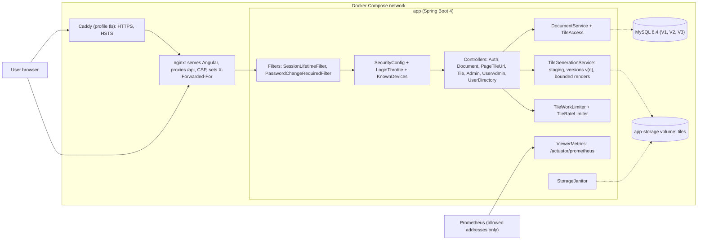

<!-- chapter: 30 | part: IV | owner: writer-app | tag: book-m5-platform | status: draft -->
# Chapter 30: Milestone 5: The platform and the review rounds

## Learning objectives

- Describe the platform upgrade (Spring Boot 4.1.1, Java 25) and what it broke.
- Explain the container layout: backend image, frontend image with nginx, Compose profiles and the optional TLS front end.
- Explain why forwarded client addresses are only trusted from one known proxy, and how that was found wrong.
- Explain the recognised-device lockout design and the denial-of-service problem it solves.
- Explain versioned tiles and why a replaced document answers 410 to stale URLs.
- Read the story of the review rounds as a method: probe, fix, prove.

## Prerequisites

Chapters 26–29 (the earlier milestones), 10 (Docker), 24 (end-to-end tests)
and 16 (Spring Security), as listed in `book/OUTLINE.md`. The code is at `book-m5-platform`, the
merge of PR #5. It is the largest milestone: 15 commits, `2d10e07` to `51ea941`. Versions at this
tag differ from the earlier chapters: Spring Boot 4.1.1, Java 25, PDFBox 3.0.8, Maven wrapper
3.9.16 (check `pom.xml` at the tag).
<!-- source: dossier/milestone-briefs.md#m5; dossier/timeline.md -->

## Beginner tier: From a program on one machine to a stack

### 30.1 The requirements

Three review findings drove the first commit of this milestone: Spring Boot 3.3 was past open-source
support and PDFBox was behind (`TM-16`), there was no Dockerfile, CI or Maven wrapper (`TM-14`), and
there were no controller, integration or end-to-end tests (`TM-13`). The reviewers were AI review
agents. The first commit answers with a platform upgrade, containers, a CI pipeline and end-to-end
tests.
<!-- source: dossier/milestone-briefs.md#m5; dossier/bugs-and-findings.md#b -->

### 30.2 The upgrade

The product owner instructed: "Start Phase 5 but can we use Spring Boot 4 if possible? Let us keep
tech as new as long as it is a standard version." The implementer chose the latest GA versions
checked on Maven Central: Spring Boot 3.3.4 to 4.1.1 (bringing Spring Security 7, Jackson 3,
Hibernate 7 and Flyway 11), Java 21 to 25 (a long-term-support release), PDFBox 3.0.3 to 3.0.8.
Migration fixes included the Jackson 3 packages (`tools.jackson.*`), the
`DaoAuthenticationProvider` constructor, `permissionsPolicyHeader`, `CONTENT_TOO_LARGE` and the new
`@AutoConfigureMockMvc` package. No deprecation warnings remained.
<!-- source: dossier/decisions.md#d10; PR #5 body via dossier/milestone-briefs.md#m5 -->

### 30.3 Containers

- **Backend image:** a JDK 25 build stage, then a JRE 25 runtime running as a non-root user, with
  fonts for the watermark and storage on a volume.
- **Frontend image:** the production Angular build served by nginx with a strict CSP, a fallback so
  deep links work, and `/api` proxied so the browser sees one origin.
- `docker compose --profile full up -d --build` runs everything. Only nginx is published, on
  127.0.0.1:8081. Plain `docker compose up -d` still starts only MySQL for development.
<!-- source: PR #5 body via dossier/milestone-briefs.md#m5; dossier/decisions.md#d11 -->

## Intermediate tier: Proxies, addresses and trust

*Assumes the beginner tier. This tier shows how a request travels through nginx (and optionally
Caddy) and what the backend may believe about it.*

### 30.4 Whose address is this?

The lockout rules and the audit log need the caller's IP address. Behind a proxy, the backend sees
the proxy's address, so the proxy passes the caller's in an `X-Forwarded-For` header. A header is
just text that anyone can send, so the backend must only believe it from a proxy it trusts.

The first version was wrong. nginx appended to whatever `X-Forwarded-For` the client already
sent, so any client could pretend to be any address and reset the sign-in lockout. The technical
review recommended not merging PR #5 until this was fixed (`TM2-1`). The fix (commit `2d82253`) made
nginx overwrite the header with the real peer address. A Playwright test that goes through nginx
fails on the pre-fix stack ("Expected 429, Received 401") and passes on the fixed one. A later
commit (`a51674c`) pinned trust further: Compose uses a fixed subnet, and the API trusts
`X-Forwarded-For` only from nginx's address, `172.28.0.10`.
<!-- source: PR #5 body; dossier/decisions.md#d11; dossier/bugs-and-findings.md#d -->

**Listing 30.1 — `frontend/nginx.conf` (book-m5-platform, simplified: only the forwarding lines)**

*File: `frontend/nginx.conf`*

```nginx
map $realip_remote_addr $forwarded_proto {
    172.28.0.11 $http_x_forwarded_proto;
...
set_real_ip_from 172.28.0.11;
real_ip_header X-Forwarded-For;
...
# OVERWRITE (never append to) X-Forwarded-For with the address of the TCP
proxy_set_header X-Forwarded-For $remote_addr;
```

The listing shows the shape, not the whole file (the dots mark removed lines). nginx accepts a
forwarded address or scheme only from one address, `172.28.0.11`, which is Caddy in the optional
`tls` profile. Everything else gets its real TCP peer address written into the header.
<!-- source: frontend/nginx.conf at book-m5-platform; dossier/decisions.md#d12 -->

### 30.5 Optional HTTPS with Caddy

An optional Compose profile, `tls`, puts Caddy in front of nginx. It terminates TLS and adds HSTS.
`TLS_MODE=internal` uses Caddy's own local certificate authority for trying it out; an e-mail address
requests a real certificate from Let's Encrypt. The `includeSubDomains` part of HSTS is opt-in
through `HSTS_POLICY`, because it is only safe if every subdomain is HTTPS too. The README carries a
go-live checklist.
<!-- source: deploy/Caddyfile at book-m5-platform; dossier/decisions.md#d12 -->

## Advanced tier: Locking out attackers without locking out users

*Assumes the earlier tiers. This tier is a story about a security fix that created a new
vulnerability, and about consistency between a database and files.*

### 30.6 The three lockout rules

Milestone 1 throttled sign-ins per account and address, and per address. A first fix for the
spoofing finding added an account-wide lockout across all addresses. The next review found that
this let anyone lock out any user by failing from several addresses (`TM3-1`): a denial of service
against the victim. The final design, in commit `82c24b6`, uses a 15-minute window:

- account plus address: 5 failures, always applies;
- address: 20 failures, always applies;
- account-wide: 20 failures, applies only to **unrecognised devices**.

A device is recognised after a successful sign-in within 30 days (`KnownDevices.RETENTION`). Its address (IPv6 by /64) is
stored only as an HMAC hash and forgotten on password change, reset and disable. The rule that fired
is audited. An admin can unlock an account, and admin-set passwords must be changed at first
sign-in, enforced by the server (`403 passwordChangeRequired`).
<!-- source: dossier/decisions.md#d7; PR #5 body -->

The trade-off is documented: the correct password from a new device is refused (429) during an
account-wide lockout until an admin unlocks it. It was tested live with throwaway containers as
attackers, each with its own IP: 18 of 18 checks passed, including that spoofed forwarding headers,
even sent straight to the app container, still lock out.
<!-- source: PR #5 body; dossier/decisions.md#d7 -->

### 30.7 Versioned tiles and stale URLs

Replacing a PDF while readers are mid-document could mix old and new tiles (`TM2-5`, `PO2-2`). The
fix (commit `cd0f5c2`) renders a replacement into a new tile version and switches the document to it
under a database row lock. Stale tile URLs answer 410 (Gone), and the viewer reloads with an
"updated" notice. The storage janitor removes superseded versions. A migration, `V3`, adds the
version column and account-security fields.

Then a probe found that old tile URLs silently served the new render, so a page could mix old and
new tiles. The token itself must carry the version, and now does.
<!-- source: dossier/decisions.md#d8; PR #5 body -->

**Listing 30.2 — `SignedTilePayload.canonicalString` (book-m5-platform, simplified: the changed line)**

*File: `src/main/java/com/example/securedocviewer/model/SignedTilePayload.java`*

```java
/** The render the URL was issued for; a replaced document refuses it (410). */
int tileVersion,
...
return documentId + "|" + page + "|" + row + "|" + col + "|" + tileVersion + "|" + sessionBinding + "|" + expiresAtEpochSeconds;
```

Compare it with Chapter 25: the version joins the fields that the signature covers, so it can't be
edited without invalidating the token.
<!-- source: SignedTilePayload.java diff book-m4-reading..book-m5-platform -->

### 30.8 Bounded work

Rendering has a concurrency cap (by default at most 2 concurrent renders, set by `max-concurrent-renders`, answering 503 with `Retry-After` when
busy), a time limit and memory settings. Render slots are held until a render actually stops, with
no queue, so no slot leaks. A server-wide cap on concurrent tile work refunds the reader's allowance
when it answers busy. Tile size went from 256 to 512 pixels and the limit to 180 per minute; the
product owner signed off the defaults after the implementer set out the numbers: about 15 pages a
minute of normal reading against about 30 minutes to copy a 500-page document by script, versus
about 2.4 hours before.
<!-- source: PR #5 body; dossier/decisions.md#d6 -->

### 30.9 Operations

Metrics: a Prometheus endpoint limited to allowed addresses (loopback by default; nginx doesn't
serve it), with counters for tiles served and rate-limited, sign-in outcomes, render time and
rejected renders. `MySqlIntegrationTest` uses Testcontainers on MySQL 8.4: Flyway V1 to V3 apply,
two concurrent replacements are serialized by the row lock, and timestamps are stored as UTC with
the server at -03:00 and the JVM in Asia/Kolkata. The last test was verified to fail without the UTC
pinning. Backups stop the app so the database dump and the tile archive match, and a restore drill
was done.
<!-- source: PR #5 body; dossier/bugs-and-findings.md#c6 -->

### 30.10 In this project

**Table 30.1 — Where the concepts live (at `book-m5-platform`)**

| Concept | Where |
|---|---|
| Containers | `Dockerfile`, `frontend/Dockerfile`, `docker-compose.yml`, `deploy/Caddyfile` |
| Proxy trust | `frontend/nginx.conf`, `docker-compose.yml` subnet |
| Lockout | `security/LoginThrottle`, `security/KnownDevices`, `PasswordChangeRequiredFilter` |
| Versioned tiles | `service/TileGenerationService`, `TileWorkLimiter`, `V3__...sql`, `TileController` |
| CI and tests | `.github/workflows/ci.yml`, `MySqlIntegrationTest`, `frontend/e2e/secure-viewing.spec.ts` |

Table 30.1 lists the places to look at this tag.

## Try it

Solutions are in `30-m5-platform.solutions.md`.

### Exercise 30.1 ★ Forwarded header

Why must a backend only trust `X-Forwarded-For` from one proxy address?

### Exercise 30.2 ★★ Lockout abuse

Explain how the account-wide lockout rule let an attacker lock out a victim, and how the recognised-device rule stops that.

### Exercise 30.3 ★★★ Version inside the token

In Listing 30.2, why is the tile version part of the signed fields rather than a separate query parameter?

## Architecture blueprint v5

Figure 30.1 is Blueprint v5, from `book/blueprints/v5-platform.md`.



**Figure 30.1 — Blueprint v5 (`book-m5-platform`)**

## Decisions and challenges

#### Incident: the proxy that believed the client

**The problem.** nginx appended to a client-supplied `X-Forwarded-For`, so a client could spoof its
address and reset the sign-in lockout. **How it was found.** The technical review (`TM2-1`), which
recommended not merging until it was fixed. **The fix.** nginx overwrites the header, the API trusts
only nginx's address, and a Playwright test proves it. **The lesson.** Trust is a property of a
network position, not of a header. The PR body even carries the correction: a claim made when the
PR was first submitted was struck through and replaced.
<!-- source: PR #5 body; dossier/decisions.md#d11 -->

#### Incident: a fix that created a denial of service

**The problem.** The account-wide lockout let anyone lock out any user (`TM3-1`). **The fix.**
Recognised devices (Section 30.6). **The lesson.** A defense that counts failures per victim turns
into a weapon against the victim. Ask who can trigger it.
<!-- source: dossier/decisions.md#d7 -->

#### Findings from the ultrareview preparation

Each round's findings came from probes or tests and were fixed (PR #5 body):

- A sign-in race let 9 parallel guesses through a limit of 5; the throttle is now atomic and allows exactly 5.
- Passwords over 72 bytes caused a 500 (BCrypt uses at most 72 bytes and refuses longer input; `UserAccountService.MAX_PASSWORD_BYTES = 72`), so they are rejected cleanly.
- Tomcat 11.0.24 carried 3 critical CVEs; it is pinned to 11.0.26.
- A missing current-render tile caused an endless 410 reload loop in the viewer, found by a `/code-review high` dry run.
- The audit throttle became atomic and stops using a database connection when it suppresses.

**The lesson.** Concurrency bugs and dependency advisories don't show up in the happy path. Probe
them on purpose.
<!-- source: PR #5 body; dossier/bugs-and-findings.md#g -->

#### The ultrareview that never ran

The product owner asked for a whole-codebase ultrareview. The tool refused: the diff was 165 files
and 22,096 lines against limits of 500 files and 8,000 lines. The four review rounds and the local
dry run supplied the review value instead.
<!-- source: dossier/decisions.md#d14 -->

## Summary

- The platform moved to supported versions and to containers with CI and end-to-end tests.
- A proxy trusts a forwarded address only from one known peer.
- Lockout rules must be abuse-proof, not only attack-proof.
- Versioned, signed tiles keep replacements atomic; work is bounded everywhere.
- Review rounds found what tests hadn't: probe on purpose.

## Further reading

- *Docker Documentation*, "Compose file reference" and "Multi-stage builds." https://docs.docker.com/
- *nginx documentation*, "ngx_http_realip_module." https://nginx.org/en/docs/http/ngx_http_realip_module.html
- *RFC 7239*, "Forwarded HTTP Extension." https://www.rfc-editor.org/rfc/rfc7239
- *Testcontainers*, "Getting started." https://java.testcontainers.org/
